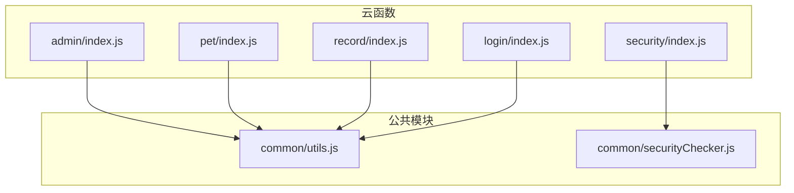
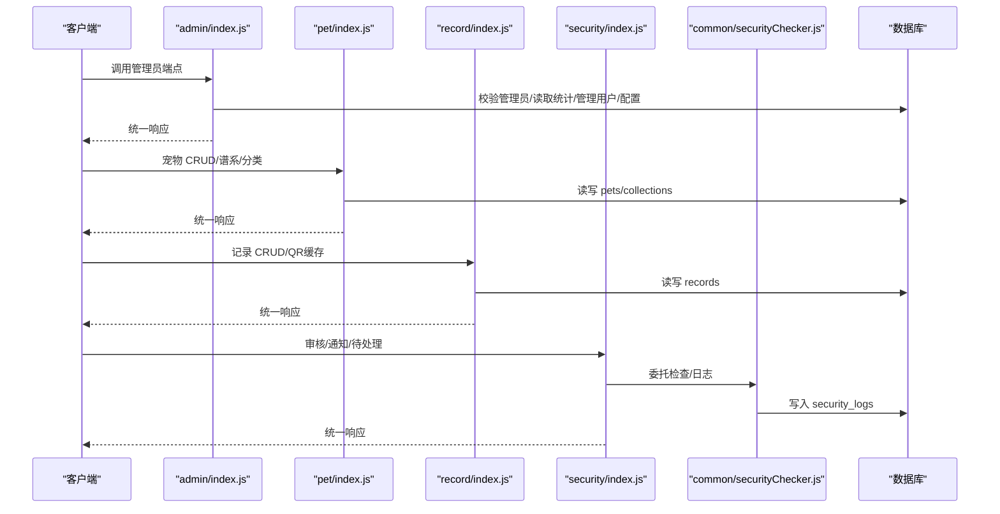
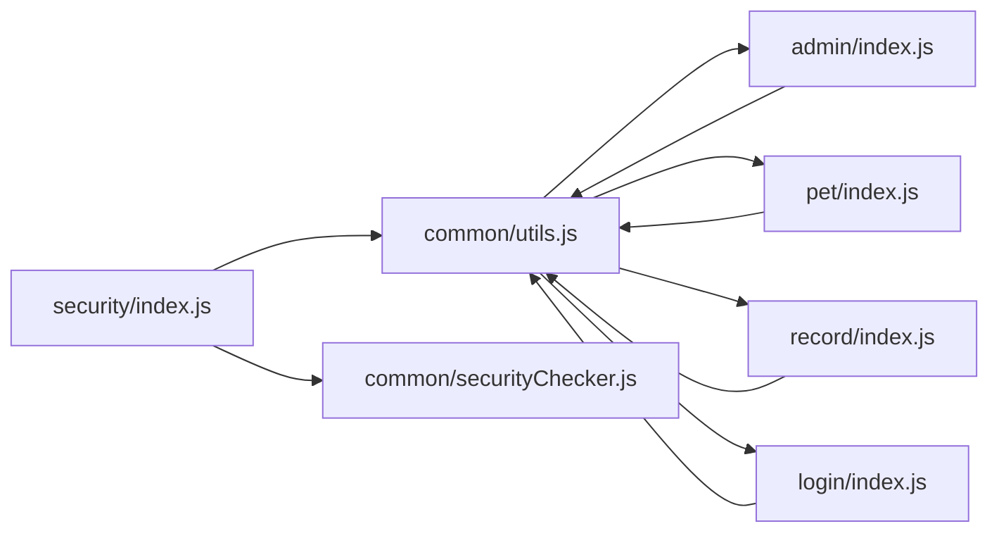

# API参考文档

<cite>
**本文引用的文件**
- [cloudfunctions/admin/index.js](file://cloudfunctions/admin/index.js)
- [cloudfunctions/admin/utils.js](file://cloudfunctions/admin/utils.js)
- [cloudfunctions/admin/config.json](file://cloudfunctions/admin/config.json)
- [cloudfunctions/pet/index.js](file://cloudfunctions/pet/index.js)
- [cloudfunctions/pet/utils.js](file://cloudfunctions/pet/utils.js)
- [cloudfunctions/pet/config.json](file://cloudfunctions/pet/config.json)
- [cloudfunctions/record/index.js](file://cloudfunctions/record/index.js)
- [cloudfunctions/record/utils.js](file://cloudfunctions/record/utils.js)
- [cloudfunctions/record/config.json](file://cloudfunctions/record/config.json)
- [cloudfunctions/login/index.js](file://cloudfunctions/login/index.js)
- [cloudfunctions/login/config.json](file://cloudfunctions/login/config.json)
- [cloudfunctions/security/index.js](file://cloudfunctions/security/index.js)
- [cloudfunctions/common/securityChecker.js](file://cloudfunctions/common/securityChecker.js)
- [cloudfunctions/common/utils.js](file://cloudfunctions/common/utils.js)
</cite>

## 目录
1. [简介](#简介)
2. [项目结构](#项目结构)
3. [核心组件](#核心组件)
4. [架构总览](#架构总览)
5. [详细组件分析](#详细组件分析)
6. [依赖关系分析](#依赖关系分析)
7. [性能与限流](#性能与限流)
8. [故障排查指南](#故障排查指南)
9. [结论](#结论)
10. [附录](#附录)

## 简介
本文件为“养龟档案”项目的云函数API参考文档，覆盖管理员后台、宠物档案、记录管理、登录鉴权与内容安全等模块的端点定义、参数说明、响应格式、认证方式、错误码与最佳实践。文档以实际源码为依据，提供面向API使用者的完整集成指南。

## 项目结构
- 云函数按功能拆分：admin（管理员）、pet（宠物）、record（记录）、login（登录）、security（内容安全）。
- 公共工具：common/utils.js、common/securityChecker.js。
- 每个云函数目录包含：
  - index.js：主入口与路由分发
  - utils.js：数据库、上下文、统一响应封装
  - config.json：权限声明（如需）

图表来源
- [cloudfunctions/admin/index.js:1-71](file://cloudfunctions/admin/index.js#L1-L71)
- [cloudfunctions/pet/index.js:1-82](file://cloudfunctions/pet/index.js#L1-L82)
- [cloudfunctions/record/index.js:1-35](file://cloudfunctions/record/index.js#L1-L35)
- [cloudfunctions/login/index.js:1-148](file://cloudfunctions/login/index.js#L1-L148)
- [cloudfunctions/security/index.js:1-64](file://cloudfunctions/security/index.js#L1-L64)
- [cloudfunctions/common/utils.js:1-69](file://cloudfunctions/common/utils.js#L1-L69)
- [cloudfunctions/common/securityChecker.js:1-226](file://cloudfunctions/common/securityChecker.js#L1-L226)

章节来源
- [cloudfunctions/admin/index.js:1-71](file://cloudfunctions/admin/index.js#L1-L71)
- [cloudfunctions/pet/index.js:1-82](file://cloudfunctions/pet/index.js#L1-L82)
- [cloudfunctions/record/index.js:1-35](file://cloudfunctions/record/index.js#L1-L35)
- [cloudfunctions/login/index.js:1-148](file://cloudfunctions/login/index.js#L1-L148)
- [cloudfunctions/security/index.js:1-64](file://cloudfunctions/security/index.js#L1-L64)
- [cloudfunctions/common/utils.js:1-69](file://cloudfunctions/common/utils.js#L1-L69)
- [cloudfunctions/common/securityChecker.js:1-226](file://cloudfunctions/common/securityChecker.js#L1-L226)

## 核心组件
- 统一响应与错误封装：successResponse/errorResponse
- 数据库与上下文：getDB/getOpenId
- 宠物数据净化：sanitizePhotoUrl/sanitizePhotos/sanitizePetData
- 内容安全：SecurityChecker（文本/图片审核、异步回调、日志记录）

章节来源
- [cloudfunctions/common/utils.js:20-35](file://cloudfunctions/common/utils.js#L20-L35)
- [cloudfunctions/pet/index.js:11-43](file://cloudfunctions/pet/index.js#L11-L43)
- [cloudfunctions/common/securityChecker.js:30-208](file://cloudfunctions/common/securityChecker.js#L30-L208)

## 架构总览
- 请求入口：各云函数的 exports.main 接收 event（包含 action 与 data）与 context（包含 OPENID 等）。
- 权限控制：部分函数（如 admin）在执行前校验管理员身份。
- 数据访问：通过 getDB 获取数据库实例，使用 wx-server-sdk 的数据库命令与云API。
- 安全审核：security 云函数薄包装 common/securityChecker，调用微信安全能力并记录日志。

图表来源
- [cloudfunctions/admin/index.js:27-71](file://cloudfunctions/admin/index.js#L27-L71)
- [cloudfunctions/pet/index.js:45-82](file://cloudfunctions/pet/index.js#L45-L82)
- [cloudfunctions/record/index.js:10-35](file://cloudfunctions/record/index.js#L10-L35)
- [cloudfunctions/security/index.js:15-64](file://cloudfunctions/security/index.js#L15-L64)
- [cloudfunctions/common/securityChecker.js:172-207](file://cloudfunctions/common/securityChecker.js#L172-L207)

## 详细组件分析

### 登录与用户信息（login）
- 功能
  - 校验管理员身份
  - 更新用户昵称/头像/手机
  - 更新公开名片（特长、微信、地区、标签、简介、封面）
  - 首次登录创建用户记录（受系统配置控制）
- 请求
  - event.action: "checkAdmin" | "updateUserInfo" | "updatePublicProfile"
  - event.data: 根据 action 传入对应字段
- 响应
  - 成功：success=true，data 包含结果
  - 失败：success=false，message+error
- 认证
  - 通过 wx-server-sdk 的 cloud.getWXContext() 获取 OPENID/APPID/UNIONID
- 错误
  - 用户信息更新失败、公开名片更新失败、数据库异常等

章节来源
- [cloudfunctions/login/index.js:38-147](file://cloudfunctions/login/index.js#L38-L147)

### 宠物管理（pet）
- 功能
  - 创建/查询/更新/删除宠物
  - 公开宠物列表与详情
  - 宠物谱系查询（父系/母系主线、统计）
  - 分类管理（增删改、自动同步）
- 请求
  - event.action: "create" | "list" | "get" | "update" | "delete" | "publicList" | "publicGet" | "getPedigree" | "getCategories" | "addCategory" | "updateCategory" | "deleteCategory"
  - event.data: 根据 action 传入对应参数
- 响应
  - 成功：success=true，data 包含结果
  - 失败：success=false，message+error
- 认证
  - 通过 OPENID 限定资源归属，防止越权
- 限制
  - 受系统配置 maxPetCount 控制宠物数量上限
  - 别名唯一性校验（同一用户内）
- 数据净化
  - 将腾讯云临时URL净化为 cloud://fileID

章节来源
- [cloudfunctions/pet/index.js:45-82](file://cloudfunctions/pet/index.js#L45-L82)
- [cloudfunctions/pet/index.js:84-138](file://cloudfunctions/pet/index.js#L84-L138)
- [cloudfunctions/pet/index.js:140-180](file://cloudfunctions/pet/index.js#L140-L180)
- [cloudfunctions/pet/index.js:182-250](file://cloudfunctions/pet/index.js#L182-L250)
- [cloudfunctions/pet/index.js:252-349](file://cloudfunctions/pet/index.js#L252-L349)
- [cloudfunctions/pet/index.js:351-368](file://cloudfunctions/pet/index.js#L351-L368)
- [cloudfunctions/pet/index.js:376-412](file://cloudfunctions/pet/index.js#L376-L412)
- [cloudfunctions/pet/index.js:517-634](file://cloudfunctions/pet/index.js#L517-L634)
- [cloudfunctions/pet/index.js:636-688](file://cloudfunctions/pet/index.js#L636-L688)
- [cloudfunctions/pet/index.js:11-43](file://cloudfunctions/pet/index.js#L11-L43)

### 记录管理（record）
- 功能
  - 创建/查询/更新/删除记录
  - QR缓存更新（静默校验）
- 请求
  - event.action: "create" | "list" | "get" | "update" | "delete" | "updateQrBase64"
  - event.data: 根据 action 传入对应参数
- 响应
  - 成功：success=true，data 包含结果
  - 失败：success=false，message+error
- 认证
  - 通过 OPENID 限定资源归属，防止越权
- 特殊
  - 产蛋/出苗/交配记录会附加相应字段
  - updateQrBase64 对记录创建者进行权限校验

章节来源
- [cloudfunctions/record/index.js:10-35](file://cloudfunctions/record/index.js#L10-L35)
- [cloudfunctions/record/index.js:37-82](file://cloudfunctions/record/index.js#L37-L82)
- [cloudfunctions/record/index.js:84-111](file://cloudfunctions/record/index.js#L84-L111)
- [cloudfunctions/record/index.js:113-122](file://cloudfunctions/record/index.js#L113-L122)
- [cloudfunctions/record/index.js:124-144](file://cloudfunctions/record/index.js#L124-L144)
- [cloudfunctions/record/index.js:146-159](file://cloudfunctions/record/index.js#L146-L159)
- [cloudfunctions/record/index.js:161-190](file://cloudfunctions/record/index.js#L161-L190)

### 管理员后台（admin）
- 功能
  - 统计数据（用户/宠物/足迹总量、今日活跃、用户/宠物增长）
  - 用户/宠物/足迹列表查询与筛选
  - 最近动态与用户增长趋势
  - 宠物类型分布
  - 系统配置读取与更新
  - 用户状态变更与封禁/解封
  - 用户删除（级联事务）
- 请求
  - event.action: "getStats" | "getUsers" | "getPets" | "getFootprints" | "getRecentActivities" | "getUserGrowth" | "getPetDistribution" | "getConfig" | "updateConfig" | "updateUser" | "deleteUser"
  - event.data: 根据 action 传入对应参数
- 响应
  - 成功：success=true，data 包含结果
  - 失败：success=false，message+error
- 认证
  - 通过管理员白名单校验（数据库优先，兜底配置）
- 事务
  - 删除用户采用事务，确保一致性

章节来源
- [cloudfunctions/admin/index.js:27-71](file://cloudfunctions/admin/index.js#L27-L71)
- [cloudfunctions/admin/index.js:74-115](file://cloudfunctions/admin/index.js#L74-L115)
- [cloudfunctions/admin/index.js:118-174](file://cloudfunctions/admin/index.js#L118-L174)
- [cloudfunctions/admin/index.js:176-258](file://cloudfunctions/admin/index.js#L176-L258)
- [cloudfunctions/admin/index.js:260-362](file://cloudfunctions/admin/index.js#L260-L362)
- [cloudfunctions/admin/index.js:364-379](file://cloudfunctions/admin/index.js#L364-L379)
- [cloudfunctions/admin/index.js:381-410](file://cloudfunctions/admin/index.js#L381-L410)
- [cloudfunctions/admin/index.js:412-431](file://cloudfunctions/admin/index.js#L412-L431)
- [cloudfunctions/admin/index.js:434-508](file://cloudfunctions/admin/index.js#L434-L508)

### 内容安全（security）
- 功能
  - 图片/文本安全审核（异步/同步）
  - 审核并记录日志
  - 未读通知查询与标记已读
  - 查询待回调审核记录（超时检测）
- 请求
  - event.action: "checkImage" | "checkText" | "checkAndLog" | "getUnreadNotifications" | "markNotificationRead" | "markAllNotificationsRead" | "getPendingChecks"
  - event.data: 根据 action 传入对应参数
- 响应
  - 成功：success=true，data 包含结果
  - 失败：success=false，message
- 认证
  - 通过 OPENID 限定资源归属
- 审核流程
  - checkFile 自动转换 cloud://fileID 为临时URL后调用 mediaCheckAsync
  - checkText 调用 msgSecCheck
  - checkAndLog 写入 security_logs 并返回结果

章节来源
- [cloudfunctions/security/index.js:15-64](file://cloudfunctions/security/index.js#L15-L64)
- [cloudfunctions/security/index.js:69-98](file://cloudfunctions/security/index.js#L69-L98)
- [cloudfunctions/security/index.js:103-127](file://cloudfunctions/security/index.js#L103-L127)
- [cloudfunctions/security/index.js:132-144](file://cloudfunctions/security/index.js#L132-L144)
- [cloudfunctions/security/index.js:151-200](file://cloudfunctions/security/index.js#L151-L200)
- [cloudfunctions/common/securityChecker.js:51-105](file://cloudfunctions/common/securityChecker.js#L51-L105)
- [cloudfunctions/common/securityChecker.js:115-149](file://cloudfunctions/common/securityChecker.js#L115-L149)
- [cloudfunctions/common/securityChecker.js:159-170](file://cloudfunctions/common/securityChecker.js#L159-L170)
- [cloudfunctions/common/securityChecker.js:180-207](file://cloudfunctions/common/securityChecker.js#L180-L207)

## 依赖关系分析
- 统一工具
  - common/utils.js 提供 initCloud/getDB/getOpenId/successResponse/errorResponse/normalizeId/normalizeIds
  - 各云函数通过 require('./utils.js') 或 require('../common/utils.js') 复用
- 安全检查
  - security/index.js 仅做薄包装，核心逻辑在 common/securityChecker.js
  - SecurityChecker 单例模式，复用数据库连接
- 配置
  - config.json 声明所需 openapi 权限（如 security.mediaCheckAsync、security.msgSecCheck）

图表来源
- [cloudfunctions/common/utils.js:1-69](file://cloudfunctions/common/utils.js#L1-L69)
- [cloudfunctions/admin/index.js:1-6](file://cloudfunctions/admin/index.js#L1-L6)
- [cloudfunctions/pet/index.js:1-2](file://cloudfunctions/pet/index.js#L1-L2)
- [cloudfunctions/record/index.js:1-2](file://cloudfunctions/record/index.js#L1-L2)
- [cloudfunctions/login/index.js:1-1](file://cloudfunctions/login/index.js#L1-L1)
- [cloudfunctions/security/index.js:1-2](file://cloudfunctions/security/index.js#L1-L2)
- [cloudfunctions/common/securityChecker.js:1-2](file://cloudfunctions/common/securityChecker.js#L1-L2)

章节来源
- [cloudfunctions/common/utils.js:1-69](file://cloudfunctions/common/utils.js#L1-L69)
- [cloudfunctions/admin/index.js:1-6](file://cloudfunctions/admin/index.js#L1-L6)
- [cloudfunctions/pet/index.js:1-2](file://cloudfunctions/pet/index.js#L1-L2)
- [cloudfunctions/record/index.js:1-2](file://cloudfunctions/record/index.js#L1-L2)
- [cloudfunctions/login/index.js:1-1](file://cloudfunctions/login/index.js#L1-L1)
- [cloudfunctions/security/index.js:1-2](file://cloudfunctions/security/index.js#L1-L2)
- [cloudfunctions/common/securityChecker.js:1-2](file://cloudfunctions/common/securityChecker.js#L1-L2)

## 性能与限流
- 数据库查询
  - 使用分页参数（pageNum/pageSize）控制单次返回量，避免一次性拉取过多数据
  - 合理使用索引字段（如 createdAt、openid、type 等）提升查询效率
- 并发与事务
  - 删除用户采用事务，保证多集合一致性
- 审核异步化
  - 图片审核通过异步接口提交，避免阻塞请求
- 限流建议
  - 建议在网关/边缘层实施基于 OPENID 的速率限制
  - 对高频端点（如 list/get）增加缓存策略（如 Redis）降低数据库压力
- 超时与重试
  - 审核回调超时检测与状态标记，避免悬挂任务

[本节为通用性能建议，不直接分析具体文件]

## 故障排查指南
- 统一响应结构
  - 成功：success=true，data=message
  - 失败：success=false，message+error
- 常见错误定位
  - 权限不足：管理员校验失败、资源归属校验失败
  - 参数缺失：必填字段为空（如 petId、id、action）
  - 资源不存在：文档不存在或已被删除
  - 审核异常：临时URL获取失败、审核接口错误
- 日志与追踪
  - 后端打印错误堆栈，便于定位
  - 审核日志 security_logs 记录 traceId/status/reason
- 建议排查步骤
  - 核对 OPENID 是否正确传递
  - 检查 action 与 data 结构是否符合目标云函数要求
  - 对审核失败的 fileID 检查云存储权限与签名URL有效期

章节来源
- [cloudfunctions/common/utils.js:20-35](file://cloudfunctions/common/utils.js#L20-L35)
- [cloudfunctions/security/index.js:69-98](file://cloudfunctions/security/index.js#L69-L98)
- [cloudfunctions/common/securityChecker.js:51-105](file://cloudfunctions/common/securityChecker.js#L51-L105)

## 结论
本API文档基于实际云函数实现，提供了端点、参数、响应、认证与错误处理的完整参考。建议在生产环境中结合速率限制、缓存与监控体系，确保稳定性与可维护性。

[本节为总结性内容，不直接分析具体文件]

## 附录

### HTTP接口规范与调用约定
- 请求方式
  - 云函数通过云开发SDK触发，无需显式HTTP头
- 认证方式
  - 通过 wx-server-sdk 的 cloud.getWXContext() 获取 OPENID/APPID/UNIONID
- 请求体
  - event: { action: string, data?: object }
- 响应体
  - { success: boolean, data: any, message: string, error?: string }

章节来源
- [cloudfunctions/login/index.js:38-147](file://cloudfunctions/login/index.js#L38-L147)
- [cloudfunctions/common/utils.js:20-35](file://cloudfunctions/common/utils.js#L20-L35)

### 错误码与消息
- 统一错误结构：success=false，message（错误描述），error（可选）
- 常见场景
  - 未知操作：返回“未知操作”
  - 权限不足：返回“无管理员权限/无权限”
  - 参数缺失：返回“XXX不能为空”
  - 资源不存在：返回“XXX不存在”

章节来源
- [cloudfunctions/admin/index.js:35-38](file://cloudfunctions/admin/index.js#L35-L38)
- [cloudfunctions/security/index.js:57-59](file://cloudfunctions/security/index.js#L57-L59)
- [cloudfunctions/pet/index.js:182-190](file://cloudfunctions/pet/index.js#L182-L190)
- [cloudfunctions/record/index.js:113-122](file://cloudfunctions/record/index.js#L113-L122)

### 版本管理、兼容性与废弃策略
- 当前版本
  - 系统配置包含 version 字段（默认 1.0.0）
- 兼容性
  - 响应结构保持 success/data/message 稳定
  - 数据字段尽量向前兼容，新增字段建议可选
- 废弃策略
  - 建议在下一主版本移除已标注废弃的 action 或字段，并在配置中明确提示

章节来源
- [cloudfunctions/admin/index.js:446-472](file://cloudfunctions/admin/index.js#L446-L472)

### SDK使用与集成指南
- 前端调用
  - 通过云开发SDK调用云函数，传入 { action, data }
- 建议
  - 在前端封装统一的云函数调用器，集中处理 success/error
  - 对敏感操作（删除、封禁）增加二次确认
- 示例路径
  - 登录与用户信息更新：[cloudfunctions/login/index.js:38-147](file://cloudfunctions/login/index.js#L38-L147)
  - 宠物 CRUD：[cloudfunctions/pet/index.js:45-82](file://cloudfunctions/pet/index.js#L45-L82)
  - 记录 CRUD：[cloudfunctions/record/index.js:10-35](file://cloudfunctions/record/index.js#L10-L35)
  - 管理员端点：[cloudfunctions/admin/index.js:27-71](file://cloudfunctions/admin/index.js#L27-L71)
  - 安全审核：[cloudfunctions/security/index.js:15-64](file://cloudfunctions/security/index.js#L15-L64)

章节来源
- [cloudfunctions/login/index.js:38-147](file://cloudfunctions/login/index.js#L38-L147)
- [cloudfunctions/pet/index.js:45-82](file://cloudfunctions/pet/index.js#L45-L82)
- [cloudfunctions/record/index.js:10-35](file://cloudfunctions/record/index.js#L10-L35)
- [cloudfunctions/admin/index.js:27-71](file://cloudfunctions/admin/index.js#L27-L71)
- [cloudfunctions/security/index.js:15-64](file://cloudfunctions/security/index.js#L15-L64)

### 测试方法与监控指标
- 测试方法
  - 使用云开发控制台的“云函数测试”功能，构造 event（action/data）验证行为
  - 对关键路径（创建/更新/删除/审核）编写自动化用例
- 监控指标
  - 响应时间、错误率、审核通过率/拒绝率、待回调超时数量
  - 建议在网关层埋点与告警

[本节为通用指导，不直接分析具体文件]

### 第三方集成与合作伙伴接入
- 权限声明
  - security 云函数声明所需 openapi 权限（security.mediaCheckAsync、security.msgSecCheck）
- 集成要点
  - 通过 OPENID 与业务ID（bizId）关联审核记录
  - 使用 checkAndLog 统一记录日志，便于审计与回溯

章节来源
- [cloudfunctions/security/index.js:1-8](file://cloudfunctions/security/index.js#L1-L8)
- [cloudfunctions/common/securityChecker.js:180-207](file://cloudfunctions/common/securityChecker.js#L180-L207)