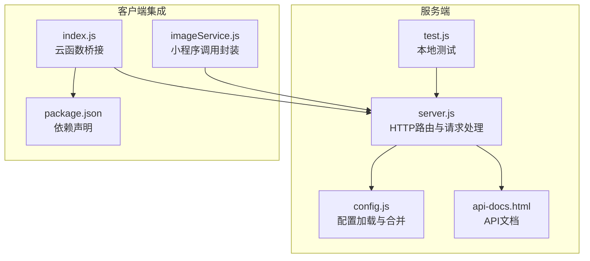
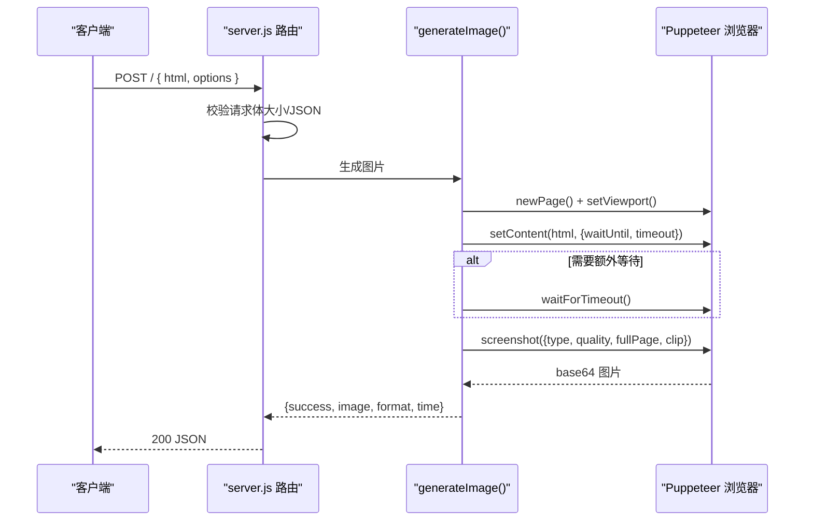
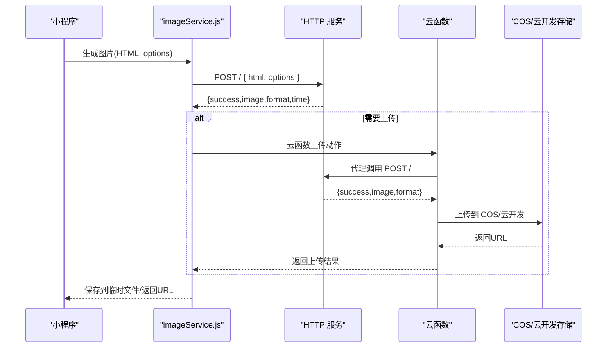
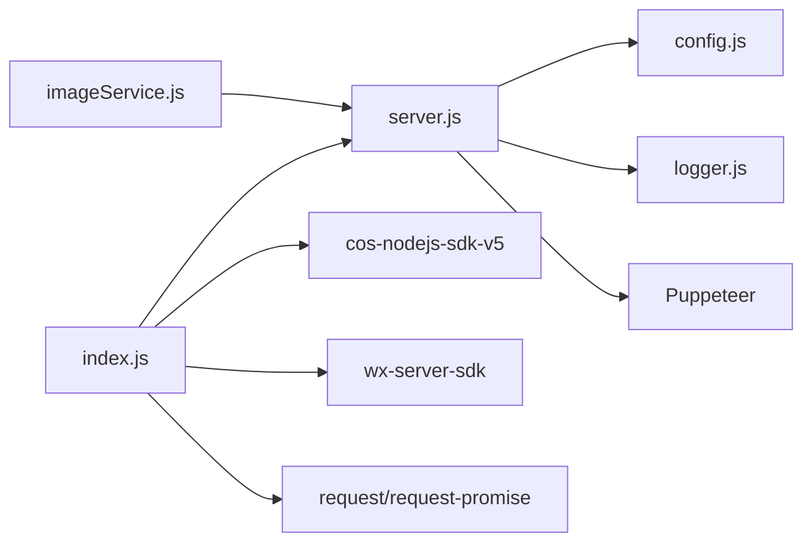

# HTTP接口API

<cite>
**本文档引用的文件**
- [server.js](file://html2image-server/server.js)
- [config.js](file://html2image-server/config.js)
- [api-docs.html](file://html2image-server/api-docs.html)
- [使用说明.md](file://html2image-server/使用说明.md)
- [test.js](file://html2image-server/test.js)
- [index.js](file://cloudfunctions/html2image/index.js)
- [config.json](file://cloudfunctions/html2image/config.json)
- [package.json](file://cloudfunctions/html2image/package.json)
- [imageService.js](file://miniprogram/utils/imageService.js)
- [theme.js](file://miniprogram/utils/theme.js)
- [securityChecker.js](file://cloudfunctions/common/securityChecker.js)
- [config-read.js](file://html2image-server/config-read.js)
</cite>

## 目录
1. [简介](#简介)
2. [项目结构](#项目结构)
3. [核心组件](#核心组件)
4. [架构总览](#架构总览)
5. [详细组件分析](#详细组件分析)
6. [依赖关系分析](#依赖关系分析)
7. [性能考虑](#性能考虑)
8. [故障排查指南](#故障排查指南)
9. [结论](#结论)
10. [附录](#附录)

## 简介
本文件面向第三方集成与内部开发者，系统化说明 HTML 转图片服务的 HTTP 接口规范与实现细节。内容涵盖：
- HTTP 接口规范：请求参数、响应格式、错误码与示例
- Puppeteer 渲染引擎使用：图片生成参数、质量控制与 viewport 设置
- 认证与限流：当前实现与扩展建议
- 配置体系：config.json 与环境变量覆盖
- 故障排查：常见问题定位与解决方案
- 第三方集成：小程序、云开发与云函数的对接方式

## 项目结构
该服务采用 Node.js + HTTP + Puppeteer 的轻量架构，核心文件如下：
- 服务入口与路由：server.js
- 配置加载与合并：config.js
- API 文档与使用说明：api-docs.html、使用说明.md
- 测试与启动脚本：test.js、start-server.*、stop-server.*
- 小程序与云函数集成：miniprogram/utils/imageService.js、cloudfunctions/html2image/index.js

图表来源
- [server.js:1-365](file://html2image-server/server.js#L1-L365)
- [config.js:1-268](file://html2image-server/config.js#L1-L268)
- [api-docs.html:1-348](file://html2image-server/api-docs.html#L1-L348)
- [test.js:1-191](file://html2image-server/test.js#L1-L191)
- [imageService.js:1-202](file://miniprogram/utils/imageService.js#L1-L202)
- [index.js:1-205](file://cloudfunctions/html2image/index.js#L1-L205)
- [package.json:1-12](file://cloudfunctions/html2image/package.json#L1-L12)

章节来源
- [server.js:1-365](file://html2image-server/server.js#L1-L365)
- [config.js:1-268](file://html2image-server/config.js#L1-L268)
- [api-docs.html:1-348](file://html2image-server/api-docs.html#L1-L348)
- [使用说明.md:1-429](file://html2image-server/使用说明.md#L1-L429)

## 核心组件
- HTTP 服务与路由
  - 提供 /health、/config、/api-docs、/（服务信息）与主接口 POST /
  - 健康检查与配置只读查询，便于监控与排障
- 配置系统
  - 默认值 + config.json + 环境变量（H2I_ 前缀）三层合并
  - 关键配置：server、browser、rendering、http、logging、process
- 图片生成引擎
  - 基于 Puppeteer 无头 Chromium，支持 PNG/JPEG/WebP
  - 支持 viewport、deviceScaleFactor、fullPage、clip、waitFor、loadTimeout 等参数
- 客户端集成
  - 小程序：imageService.js 统一封装，自动将本地/云存储图片 URL 转为 base64
  - 云函数：html2image/index.js 作为代理，可选上传至腾讯云 COS

章节来源
- [server.js:207-330](file://html2image-server/server.js#L207-L330)
- [config.js:27-74](file://html2image-server/config.js#L27-L74)
- [config.js:234-243](file://html2image-server/config.js#L234-L243)
- [imageService.js:59-80](file://miniprogram/utils/imageService.js#L59-L80)
- [index.js:66-140](file://cloudfunctions/html2image/index.js#L66-L140)

## 架构总览
服务采用“HTTP API + Puppeteer 渲染”的单进程模型，支持懒启动浏览器，避免常驻开销。

图表来源
- [server.js:276-318](file://html2image-server/server.js#L276-L318)
- [server.js:157-205](file://html2image-server/server.js#L157-L205)

## 详细组件分析

### HTTP 接口规范

- 通用响应格式
  - 成功：200，字段 success=true，image（base64）、format、time（毫秒）
  - 失败：400/413/500，字段 success=false，error

- 主接口：POST /
  - 请求体
    - html: string，必填
    - options: object，可选
      - width/height/deviceScaleFactor：视口尺寸与 DPR
      - format：png/jpeg/webp，默认 png
      - quality：1–100，仅对 jpeg/webp 生效
      - fullPage：是否整页截图
      - clip：{x,y,width,height}，仅截取区域
      - waitFor：加载完成后额外等待毫秒（上限 30000）
      - loadTimeout：页面加载超时（毫秒，下限 5000）
  - 示例与说明参见 api-docs.html 与使用说明.md

- 健康检查：GET /health
  - 返回 status、browser（running/idle）、uptime、config（port/host）

- 配置查看：GET /config
  - 返回 server、rendering、http、browser 等只读摘要

- 服务信息：GET /
  - 返回 name/version/docs/health/config/usage

- 错误码
  - 400：JSON 解析失败
  - 413：请求体超过最大限制（默认 10MB）
  - 500：浏览器启动/渲染异常

章节来源
- [server.js:217-320](file://html2image-server/server.js#L217-L320)
- [server.js:276-318](file://html2image-server/server.js#L276-L318)
- [api-docs.html:139-214](file://html2image-server/api-docs.html#L139-L214)
- [使用说明.md:240-272](file://html2image-server/使用说明.md#L240-L272)

### Puppeteer 渲染引擎与图片生成参数

- 视口与清晰度
  - viewport：width/height/deviceScaleFactor
  - deviceScaleFactor 越大越清晰，但体积与耗时增加
- 截图模式
  - fullPage：整页截图
  - clip：限定区域截图
- 质量控制
  - format：png/jpg/webp
  - quality：1–100（仅对 jpg/webp 生效）
- 超时与等待
  - loadTimeout：页面加载超时（毫秒）
  - waitFor：加载完成后额外等待（毫秒）
- 安全与稳定性
  - 通过 config.browser.args 优化沙箱与 GPU 设置
  - protocolTimeoutMs 控制 DevTools 协议超时

章节来源
- [server.js:157-205](file://html2image-server/server.js#L157-L205)
- [config.js:42-61](file://html2image-server/config.js#L42-L61)
- [config.js:62-69](file://html2image-server/config.js#L62-L69)

### 认证方式、限流策略与错误处理

- 认证方式
  - 当前实现：未内置鉴权逻辑
  - 建议：在反向代理层（如 Nginx/TLS 终止）或前置网关添加鉴权与速率限制
- 限流策略
  - 当前实现：未内置限流
  - 建议：结合反向代理或云平台限流能力，按 IP/Key/租户维度限制 QPS
- 错误处理
  - 请求体过大：413
  - JSON 解析失败：400
  - 渲染异常：500（包含错误信息）
  - 健康检查：返回 browser 状态与 uptime，便于存活探针

章节来源
- [server.js:276-318](file://html2image-server/server.js#L276-L318)
- [server.js:217-230](file://html2image-server/server.js#L217-L230)

### 配置体系与环境变量覆盖

- 配置来源（优先级从高到低）
  1) 环境变量（H2I_ 前缀，嵌套用单下划线，key 内下划线用双下划线）
  2) config.json
  3) 代码默认值
- 关键配置项
  - server.host/port
  - browser.executablePath/headless/launchTimeoutMs/protocolTimeoutMs/args
  - rendering.defaultViewport/defaultFormat/defaultQuality/loadTimeoutMs/fullPageByDefault
  - http.maxRequestBodyBytes/startupWaitSeconds
  - logging.logDir/stdoutLog/startupLog/stopLog
  - process.pidFile

章节来源
- [config.js:4-20](file://html2image-server/config.js#L4-L20)
- [config.js:27-74](file://html2image-server/config.js#L27-L74)
- [config.js:180-223](file://html2image-server/config.js#L180-L223)
- [config-read.js:14-34](file://html2image-server/config-read.js#L14-L34)

### 第三方集成与使用示例

- 小程序集成（imageService.js）
  - 自动将本地/云存储图片 URL 转为 base64，避免 Puppeteer 无法访问本地路径
  - 统一调用 HTTP 服务，支持 loading 提示与错误回退
  - 生成图片保存到临时文件，便于分享
- 云函数集成（cloudfunctions/html2image）
  - 云函数作为代理，调用 HTTP 服务生成图片
  - 可选上传至腾讯云 COS，或上传至云开发存储
  - 通过数据库配置 imageServerUrl、imageTimeout、COS 凭据等
- 调用示例
  - curl 与 Node.js 示例详见 api-docs.html 与使用说明.md
  - 本地测试脚本 test.js 可直接验证服务可用性

图表来源
- [imageService.js:59-80](file://miniprogram/utils/imageService.js#L59-L80)
- [index.js:66-140](file://cloudfunctions/html2image/index.js#L66-L140)

章节来源
- [imageService.js:59-143](file://miniprogram/utils/imageService.js#L59-L143)
- [index.js:14-27](file://cloudfunctions/html2image/index.js#L14-L27)
- [index.js:29-55](file://cloudfunctions/html2image/index.js#L29-L55)
- [index.js:142-172](file://cloudfunctions/html2image/index.js#L142-L172)
- [api-docs.html:164-214](file://html2image-server/api-docs.html#L164-L214)
- [使用说明.md:151-208](file://html2image-server/使用说明.md#L151-L208)

## 依赖关系分析

图表来源
- [server.js:9-14](file://html2image-server/server.js#L9-L14)
- [index.js:1-11](file://cloudfunctions/html2image/index.js#L1-L11)
- [package.json:6-11](file://cloudfunctions/html2image/package.json#L6-L11)

章节来源
- [server.js:9-14](file://html2image-server/server.js#L9-L14)
- [index.js:1-11](file://cloudfunctions/html2image/index.js#L1-L11)
- [package.json:6-11](file://cloudfunctions/html2image/package.json#L6-L11)

## 性能考虑
- 首次请求较慢：Chromium 懒启动，后续请求显著更快
- 视口与清晰度：增大 deviceScaleFactor 与分辨率会显著增加体积与时间
- 格式选择：jpeg/webp 体积更小，适合长图或大图场景
- 超时设置：根据页面复杂度调整 loadTimeout 与 waitFor
- 并发与资源：合理设置浏览器启动参数与协议超时，避免资源争用

## 故障排查指南
- 启动后首次请求慢
  - 现象：POST / 首次响应耗时较长
  - 说明：Chromium 懒启动
- 端口占用
  - 处理：停止旧进程或修改 server.port
- 浏览器启动失败/超时
  - 原因：系统库缺失、沙箱限制、Chrome 版本不匹配、启动超时
  - 处理：安装系统依赖、启用 --no-sandbox、指定 browser.executablePath、提高 browser.launchTimeoutMs
- 响应体过大
  - 处理：改用 jpeg/webp、降低 deviceScaleFactor、降低 quality
- 日志定位
  - 日志目录：logs/，包含按日滚动的服务日志与脚本输出日志
- 健康检查
  - 使用 /health 确认浏览器状态与运行时配置

章节来源
- [使用说明.md:371-413](file://html2image-server/使用说明.md#L371-L413)
- [server.js:217-230](file://html2image-server/server.js#L217-L230)

## 结论
本服务以简洁稳定的 HTTP 接口提供 HTML 到图片的渲染能力，配合灵活的配置体系与客户端集成方案，能够满足多种场景需求。建议在生产环境中通过反向代理增强鉴权与限流，并根据业务特点优化图片参数与超时设置，以获得最佳性能与成本平衡。

## 附录

### 接口调用示例（摘要）
- 健康检查
  - curl http://localhost:3000/health
- 生成 PNG
  - curl -X POST http://localhost:3000/ -H "Content-Type: application/json" -d '{ "html": "<h1>Test</h1>", "options": { "width": 800, "height": 600, "format": "png", "deviceScaleFactor": 2 } }'
- Node.js 调用
  - fetch('http://localhost:3000/', { method: 'POST', headers: { 'Content-Type': 'application/json' }, body: JSON.stringify({ html, options }) }).then(r=>r.json()).then(d=>d.success && fs.writeFileSync('out.png', Buffer.from(d.image, 'base64')))

章节来源
- [api-docs.html:164-214](file://html2image-server/api-docs.html#L164-L214)
- [使用说明.md:151-208](file://html2image-server/使用说明.md#L151-L208)

### 配置项速查（节选）
- server.host/server.port
- browser.executablePath/headless/launchTimeoutMs/protocolTimeoutMs/args
- rendering.defaultViewport/defaultFormat/defaultQuality/loadTimeoutMs/fullPageByDefault
- http.maxRequestBodyBytes/startupWaitSeconds
- logging.logDir/stdoutLog/startupLog/stopLog
- process.pidFile

章节来源
- [config.js:27-74](file://html2image-server/config.js#L27-L74)
- [config.js:327-366](file://html2image-server/config.js#L327-L366)