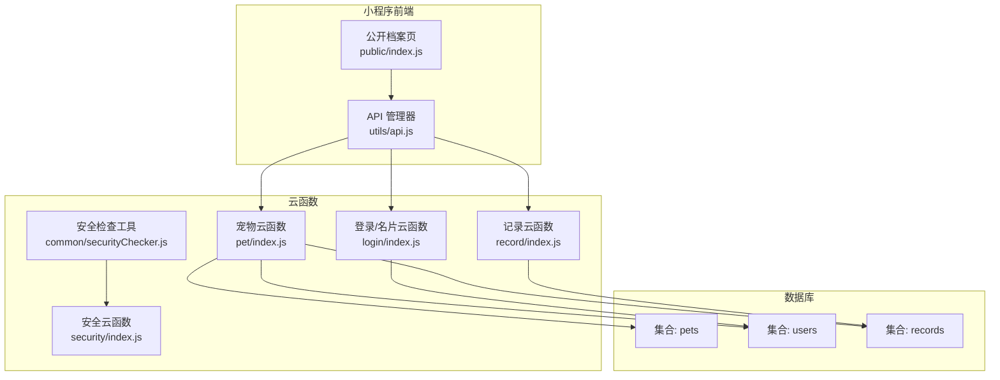
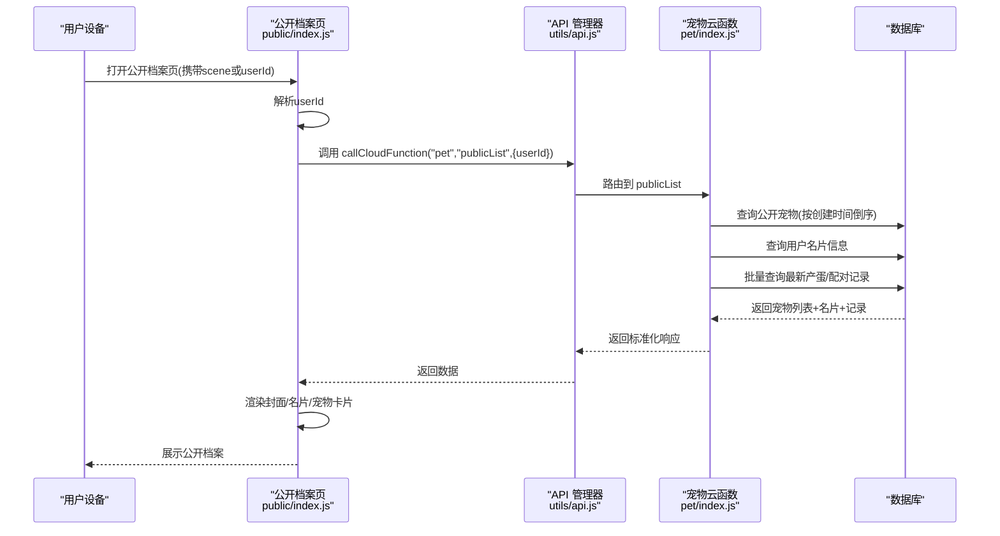
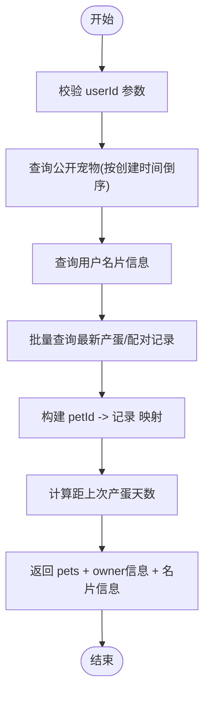
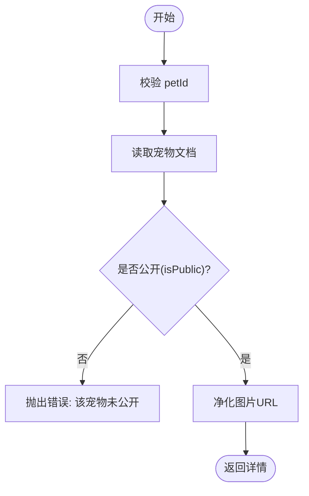
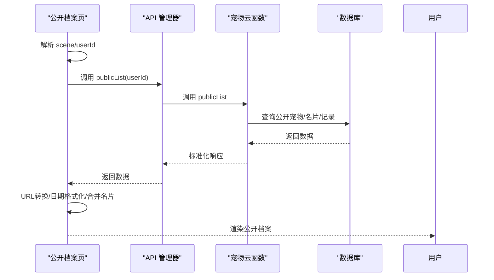
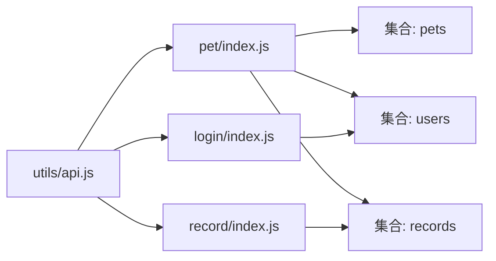

# 公开宠物API

<cite>
**本文引用的文件**
- [cloudfunctions/pet/index.js](file://cloudfunctions/pet/index.js)
- [cloudfunctions/pet/utils.js](file://cloudfunctions/pet/utils.js)
- [miniprogram/subpkg-report/pages/public/index.js](file://miniprogram/subpkg-report/pages/public/index.js)
- [miniprogram/subpkg-report/pages/public/index.wxml](file://miniprogram/subpkg-report/pages/public/index.wxml)
- [miniprogram/utils/api.js](file://miniprogram/utils/api.js)
- [cloudfunctions/login/index.js](file://cloudfunctions/login/index.js)
- [cloudfunctions/record/index.js](file://cloudfunctions/record/index.js)
- [cloudfunctions/admin/index.js](file://cloudfunctions/admin/index.js)
- [cloudfunctions/common/securityChecker.js](file://cloudfunctions/common/securityChecker.js)
- [cloudfunctions/security/index.js](file://cloudfunctions/security/index.js)
- [miniprogram/app.js](file://miniprogram/app.js)
</cite>

## 目录
1. [简介](#简介)
2. [项目结构](#项目结构)
3. [核心组件](#核心组件)
4. [架构总览](#架构总览)
5. [详细组件分析](#详细组件分析)
6. [依赖关系分析](#依赖关系分析)
7. [性能考量](#性能考量)
8. [故障排查指南](#故障排查指南)
9. [结论](#结论)
10. [附录](#附录)

## 简介
本文件面向开发者与产品人员，系统化梳理“公开宠物”相关API与前端页面的实现与使用方式，重点覆盖以下能力：
- 公开宠物列表接口：publicList（获取指定用户的公开宠物列表，附带用户名片与最新产蛋/配对记录）
- 公开宠物详情接口：publicGet（无需登录即可查看公开宠物详情）
- 公开分享机制：通过小程序二维码/链接直达公开档案页，支持转发到会话/朋友圈
- 隐私保护策略：仅公开标记为公开的宠物与部分名片信息；非本人访问不暴露敏感字段
- 权限验证流程：公开接口免鉴权；内部接口严格校验openid归属
- 关联查询：为每个公开宠物附加“最新产蛋/配对记录”，并计算距上次产蛋天数
- 使用场景：宠物展示、社交分享、种龟管理、种源溯源与交流

## 项目结构
公开宠物功能涉及三层协作：
- 云函数层：提供公开宠物列表与详情查询、名片信息更新等能力
- 小程序前端：负责解析场景参数、调用云函数、渲染公开档案页与分享
- 数据层：pets、users、records 等集合存储宠物、用户与事件记录

图表来源
- [cloudfunctions/pet/index.js:45-82](file://cloudfunctions/pet/index.js#L45-L82)
- [miniprogram/utils/api.js:12-38](file://miniprogram/utils/api.js#L12-L38)
- [miniprogram/subpkg-report/pages/public/index.js:100-210](file://miniprogram/subpkg-report/pages/public/index.js#L100-L210)

章节来源
- [cloudfunctions/pet/index.js:45-82](file://cloudfunctions/pet/index.js#L45-L82)
- [miniprogram/utils/api.js:12-38](file://miniprogram/utils/api.js#L12-L38)
- [miniprogram/subpkg-report/pages/public/index.js:100-210](file://miniprogram/subpkg-report/pages/public/index.js#L100-L210)

## 核心组件
- 云函数入口与路由分发：根据 action 分派至具体方法（如 publicList、publicGet）
- 工具模块：统一响应格式、OpenID获取、ID规范化、数据库连接
- 前端API封装：统一封装云函数调用，返回标准化结果
- 公开档案页：解析scene/userId，拉取公开宠物列表，渲染名片与封面，支持分享

章节来源
- [cloudfunctions/pet/index.js:45-82](file://cloudfunctions/pet/index.js#L45-L82)
- [cloudfunctions/pet/utils.js:15-68](file://cloudfunctions/pet/utils.js#L15-L68)
- [miniprogram/utils/api.js:12-38](file://miniprogram/utils/api.js#L12-L38)
- [miniprogram/subpkg-report/pages/public/index.js:20-44](file://miniprogram/subpkg-report/pages/public/index.js#L20-L44)

## 架构总览
公开宠物功能的请求-响应流程如下：

图表来源
- [miniprogram/subpkg-report/pages/public/index.js:100-210](file://miniprogram/subpkg-report/pages/public/index.js#L100-L210)
- [miniprogram/utils/api.js:12-38](file://miniprogram/utils/api.js#L12-L38)
- [cloudfunctions/pet/index.js:252-349](file://cloudfunctions/pet/index.js#L252-L349)

## 详细组件分析

### 公开宠物列表：publicList
- 功能概述
  - 输入：目标用户的 openid（userId）
  - 输出：公开宠物列表、宠物主昵称/头像、公开名片信息；同时为每个宠物附带最新产蛋/配对记录及距上次产蛋天数
- 关键逻辑
  - 查询公开宠物：按创建时间倒序
  - 查询用户名片：昵称、头像、特长、地区、标签、简介、封面等
  - 关联查询：批量查询该用户下各公开宠物的最新“产蛋”和“交配”记录，取每只宠物的最新一条
  - 计算字段：根据最新产蛋日期计算“距上次产蛋天数”
- 响应结构要点
  - pets：公开宠物数组（含最新记录与天数）
  - ownerNickname / ownerAvatar：宠物主基础信息
  - publicShareInfo：公开名片信息（含封面需转换为可用URL）

图表来源
- [cloudfunctions/pet/index.js:252-349](file://cloudfunctions/pet/index.js#L252-L349)

章节来源
- [cloudfunctions/pet/index.js:252-349](file://cloudfunctions/pet/index.js#L252-L349)

### 公开宠物详情：publicGet
- 功能概述
  - 输入：公开宠物ID（petId）
  - 输出：该宠物的完整公开信息（若未公开则拒绝）
- 关键逻辑
  - 校验 petId
  - 读取宠物文档
  - 校验 isPublic 字段，仅公开宠物可被访问
  - 返回净化后的宠物数据（图片URL净化）

图表来源
- [cloudfunctions/pet/index.js:351-368](file://cloudfunctions/pet/index.js#L351-L368)

章节来源
- [cloudfunctions/pet/index.js:351-368](file://cloudfunctions/pet/index.js#L351-L368)

### 前端公开档案页：public/index
- 场景参数解析
  - 支持通过 scene 或 userId 直达他人公开档案
- 数据加载流程
  - 调用云函数 pet/publicList
  - 合并云端返回的 ownerNickname/ownerAvatar 与本地 userInfo/shareInfo
  - 对封面、头像、宠物首图进行URL转换（cloud:// → 临时URL）
  - 计算“微信号是否公开显示”与“距上次产蛋天数”的日期格式化
- 分享能力
  - 支持分享到会话/朋友圈，标题与封面来自名片信息

图表来源
- [miniprogram/subpkg-report/pages/public/index.js:100-210](file://miniprogram/subpkg-report/pages/public/index.js#L100-L210)
- [miniprogram/subpkg-report/pages/public/index.wxml:1-46](file://miniprogram/subpkg-report/pages/public/index.wxml#L1-L46)

章节来源
- [miniprogram/subpkg-report/pages/public/index.js:100-210](file://miniprogram/subpkg-report/pages/public/index.js#L100-L210)
- [miniprogram/subpkg-report/pages/public/index.wxml:1-46](file://miniprogram/subpkg-report/pages/public/index.wxml#L1-L46)

### 公开名片信息与隐私策略
- 名片字段
  - specialty、wechatId、wechatPublic、region、tags、intro、cover
- 隐私策略
  - 仅当用户开启公开名片时，访客可见部分名片信息
  - 微信号是否展示取决于 wechatPublic 与 wechatId 是否存在
  - 头像/封面/宠物图片均支持 cloud:// 到临时URL的转换，便于前端渲染
- 更新名片
  - 通过登录云函数的 updatePublicProfile 动作更新公开名片字段

章节来源
- [cloudfunctions/pet/index.js:266-291](file://cloudfunctions/pet/index.js#L266-L291)
- [cloudfunctions/login/index.js:69-85](file://cloudfunctions/login/index.js#L69-L85)
- [miniprogram/subpkg-report/pages/public/index.js:139-162](file://miniprogram/subpkg-report/pages/public/index.js#L139-L162)

### 权限验证与安全
- 公开接口
  - publicList：无需登录，仅返回公开宠物
  - publicGet：无需登录，仅返回公开宠物详情
- 内部接口
  - 列表/详情/更新/删除等内部接口均以 openid 校验宠物归属
- 图片安全
  - 上传图片后触发安全审核（异步），审核结果通过安全云函数查询
- 登录态
  - 小程序通过云函数 login 获取 openid，前端全局维护登录状态

章节来源
- [cloudfunctions/pet/index.js:182-191](file://cloudfunctions/pet/index.js#L182-L191)
- [cloudfunctions/pet/index.js:233-250](file://cloudfunctions/pet/index.js#L233-L250)
- [cloudfunctions/common/securityChecker.js:74-105](file://cloudfunctions/common/securityChecker.js#L74-L105)
- [cloudfunctions/security/index.js:69-98](file://cloudfunctions/security/index.js#L69-L98)
- [miniprogram/app.js:200-225](file://miniprogram/app.js#L200-L225)

## 依赖关系分析
- 前端依赖
  - utils/api.js 统一调用云函数，封装错误与降级
  - public/index 页面解析参数、发起请求、渲染UI与分享
- 云函数依赖
  - pet/index.js 聚合公开查询、名片与记录关联
  - login/index.js 提供名片更新能力
  - record/index.js 提供产蛋/配对等记录写入
- 数据依赖
  - pets：存储宠物基本信息与公开标记
  - users：存储用户名片与公开设置
  - records：存储产蛋/配对/出苗等事件记录

图表来源
- [miniprogram/utils/api.js:12-38](file://miniprogram/utils/api.js#L12-L38)
- [cloudfunctions/pet/index.js:252-349](file://cloudfunctions/pet/index.js#L252-L349)
- [cloudfunctions/login/index.js:69-85](file://cloudfunctions/login/index.js#L69-L85)
- [cloudfunctions/record/index.js:53-82](file://cloudfunctions/record/index.js#L53-L82)

章节来源
- [miniprogram/utils/api.js:12-38](file://miniprogram/utils/api.js#L12-L38)
- [cloudfunctions/pet/index.js:252-349](file://cloudfunctions/pet/index.js#L252-L349)
- [cloudfunctions/login/index.js:69-85](file://cloudfunctions/login/index.js#L69-L85)
- [cloudfunctions/record/index.js:53-82](file://cloudfunctions/record/index.js#L53-L82)

## 性能考量
- 批量关联查询
  - 通过 petIds 批量查询最新产蛋/配对记录，减少多次往返
- 时间复杂度
  - 关联查询为 O(n)，n 为公开宠物数量；整体受数据库索引与查询条件影响
- 图片URL转换
  - 仅在必要时进行 cloud:// → 临时URL 转换，避免重复转换
- 分页与排序
  - 公开列表按创建时间倒序，利于快速定位最新公开宠物

章节来源
- [cloudfunctions/pet/index.js:294-346](file://cloudfunctions/pet/index.js#L294-L346)

## 故障排查指南
- 公开列表为空
  - 确认 userId 是否正确传入
  - 确认该用户是否存在公开宠物
- 名片信息缺失
  - 检查用户是否已设置公开名片
  - 确认封面/头像URL是否为 cloud:// 格式并可转换
- 详情访问失败
  - 确认 petId 是否有效
  - 确认该宠物 isPublic 是否为真
- 分享封面不显示
  - 检查 cover 是否为 cloud:// 格式并可转换
  - 确认分享回调中是否正确传递 imageUrl
- 安全审核异常
  - 上传图片后审核异步回调，可通过安全云函数查询未读通知

章节来源
- [cloudfunctions/pet/index.js:252-349](file://cloudfunctions/pet/index.js#L252-L349)
- [cloudfunctions/pet/index.js:351-368](file://cloudfunctions/pet/index.js#L351-L368)
- [cloudfunctions/common/securityChecker.js:74-105](file://cloudfunctions/common/securityChecker.js#L74-L105)
- [cloudfunctions/security/index.js:69-98](file://cloudfunctions/security/index.js#L69-L98)
- [miniprogram/subpkg-report/pages/public/index.js:288-308](file://miniprogram/subpkg-report/pages/public/index.js#L288-L308)

## 结论
公开宠物API通过“公开列表 + 公开详情 + 名片信息 + 关联记录”的组合，实现了低成本、高价值的宠物展示与社交分享。前端页面以最小交互完成参数解析、数据拉取与渲染，云函数侧以批量查询与字段净化保障性能与体验。配合隐私策略与安全审核，既满足开放分享，又兼顾用户隐私与合规。

## 附录

### API 参数与响应说明

- publicList（公开宠物列表）
  - 请求参数
    - userId: 目标用户的 openid（字符串）
  - 响应字段
    - pets: 公开宠物数组（含 latestEgg、latestPairing、eggDaysSince）
    - ownerNickname: 宠物主昵称（字符串）
    - ownerAvatar: 宠物主头像URL（字符串，可能为 cloud://）
    - publicShareInfo: 公开名片信息对象（specialty、wechatId、wechatPublic、region、tags、intro、cover）
  - 使用场景
    - 社交分享、种龟展示、种源交流

- publicGet（公开宠物详情）
  - 请求参数
    - id: 公开宠物ID（字符串）
  - 响应字段
    - 宠物完整公开信息（含净化后的图片URL）
  - 使用场景
    - 直接分享某只公开宠物的详情页

章节来源
- [cloudfunctions/pet/index.js:252-349](file://cloudfunctions/pet/index.js#L252-L349)
- [cloudfunctions/pet/index.js:351-368](file://cloudfunctions/pet/index.js#L351-L368)

### 公开分享与社交场景
- 场景参数
  - 支持 scene=userId 或直接 userId 参数
- 分享能力
  - 会话分享：标题为“昵称的龟档案”或默认标题，路径携带 userId
  - 朋友圈分享：支持 timeline 回调，携带 query
- 前端实现
  - onShareAppMessage / onShareTimeline 返回标题、路径/query、封面图

章节来源
- [miniprogram/subpkg-report/pages/public/index.js:20-44](file://miniprogram/subpkg-report/pages/public/index.js#L20-L44)
- [miniprogram/subpkg-report/pages/public/index.js:288-308](file://miniprogram/subpkg-report/pages/public/index.js#L288-L308)