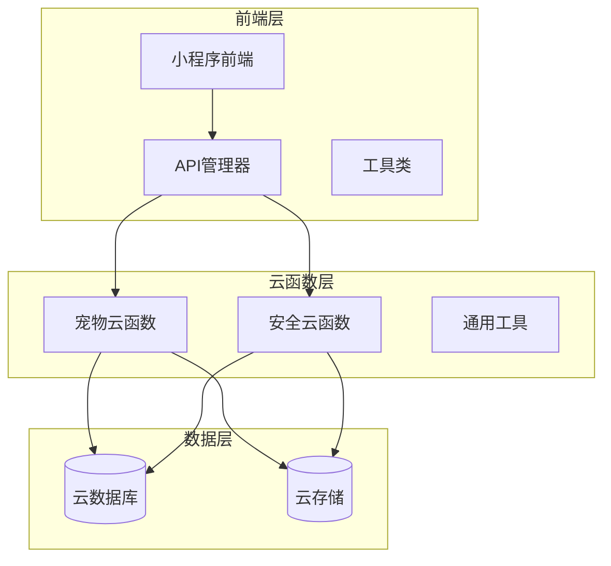
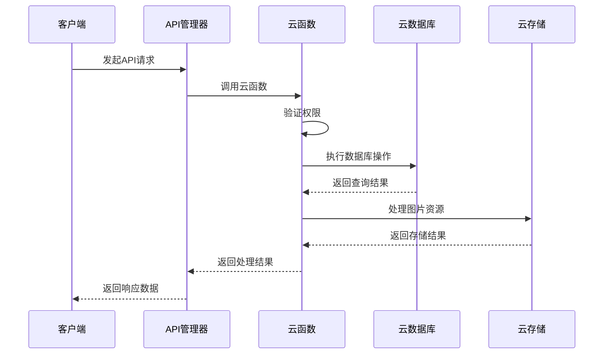
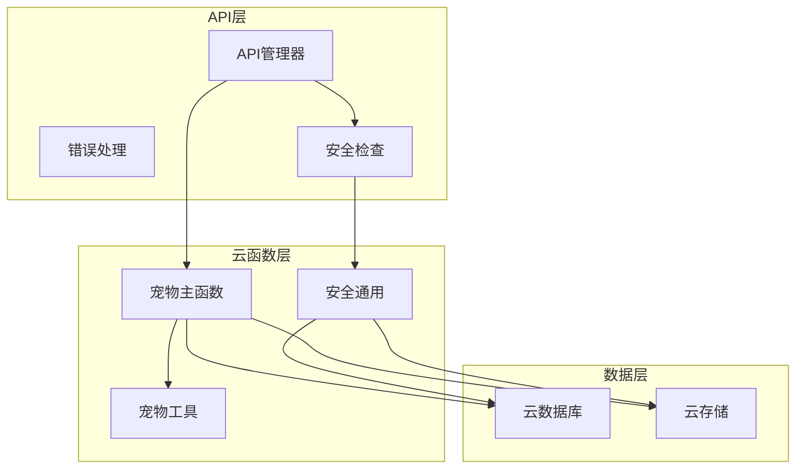

# 宠物CRUD操作API

<cite>
**本文档引用的文件**
- [cloudfunctions/pet/index.js](file://cloudfunctions/pet/index.js)
- [cloudfunctions/pet/utils.js](file://cloudfunctions/pet/utils.js)
- [cloudfunctions/common/securityChecker.js](file://cloudfunctions/common/securityChecker.js)
- [miniprogram/utils/api.js](file://miniprogram/utils/api.js)
- [miniprogram/utils/error.js](file://miniprogram/utils/error.js)
- [miniprogram/utils/securityChecker.js](file://miniprogram/utils/securityChecker.js)
</cite>

## 目录
1. [简介](#简介)
2. [项目结构](#项目结构)
3. [核心组件](#核心组件)
4. [架构概览](#架构概览)
5. [详细组件分析](#详细组件分析)
6. [依赖关系分析](#依赖关系分析)
7. [性能考虑](#性能考虑)
8. [故障排除指南](#故障排除指南)
9. [结论](#结论)

## 简介

本文档详细说明了宠物CRUD操作API的设计与实现，包括创建、查询、更新、删除等核心功能。该系统基于微信云开发平台构建，采用云函数作为后端服务，提供完整的宠物档案管理能力。

系统主要特性：
- 基于用户身份的权限控制
- 宠物数据验证与唯一性检查
- 图片URL净化处理
- 分类管理功能
- 家谱谱系查询
- 安全内容审核集成

## 项目结构

该项目采用分层架构设计，主要分为以下层次：



**图表来源**
- [cloudfunctions/pet/index.js:1-82](file://cloudfunctions/pet/index.js#L1-L82)
- [miniprogram/utils/api.js:4-38](file://miniprogram/utils/api.js#L4-L38)

**章节来源**
- [cloudfunctions/pet/index.js:1-82](file://cloudfunctions/pet/index.js#L1-L82)
- [miniprogram/utils/api.js:4-38](file://miniprogram/utils/api.js#L4-L38)

## 核心组件

### 云函数入口
宠物云函数作为系统的统一入口点，负责接收前端请求并分发到相应的处理逻辑。

### 数据验证组件
实现了完整的数据验证机制，包括必填字段检查、唯一性验证、格式验证等。

### 权限控制系统
基于用户OpenID的权限验证，确保用户只能访问和修改自己的宠物数据。

### 图片处理模块
提供图片URL净化功能，将临时URL转换为永久可用的cloud://格式。

**章节来源**
- [cloudfunctions/pet/index.js:45-82](file://cloudfunctions/pet/index.js#L45-L82)
- [cloudfunctions/pet/utils.js:15-18](file://cloudfunctions/pet/utils.js#L15-L18)

## 架构概览

系统采用微服务架构，通过云函数实现功能模块化：



**图表来源**
- [cloudfunctions/pet/index.js:84-138](file://cloudfunctions/pet/index.js#L84-L138)
- [miniprogram/utils/api.js:12-38](file://miniprogram/utils/api.js#L12-L38)

## 详细组件分析

### 创建宠物 (create)

#### 接口定义
- **方法**: POST
- **路径**: 调用云函数 `pet` 的 `create` 动作
- **权限**: 需要用户登录

#### 请求参数
| 参数名 | 类型 | 必填 | 描述 | 默认值 |
|--------|------|------|------|--------|
| name | string | 是 | 宠物名称 | - |
| category | string | 否 | 分类 | "无" |
| gender | string | 否 | 性别 | "未知" |
| alias | string | 否 | 别名 | "" |
| father | string | 否 | 父亲ID | "" |
| mother | string | 否 | 母亲ID | "" |
| partner | string | 否 | 配偶ID | "" |
| partnerName | string | 否 | 配偶名称 | "" |
| price | string | 否 | 价格 | "" |
| status | string | 否 | 状态 | "正常" |
| isPublic | boolean | 否 | 是否公开 | false |
| photos | array | 否 | 照片URL数组 | [] |

#### 响应数据结构
```javascript
{
  success: boolean,           // 操作是否成功
  data: {
    id: string,              // 新创建的宠物ID
    name: string,            // 宠物名称
    category: string,        // 分类
    gender: string,          // 性别
    alias: string,           // 别名
    father: string,          // 父亲ID
    mother: string,          // 母亲ID
    partner: string,         // 配偶ID
    partnerName: string,     // 配偶名称
    price: string,           // 价格
    status: string,          // 状态
    isPublic: boolean,       // 是否公开
    photos: array,           // 照片URL数组
    openid: string,          // 创建者ID
    createdAt: date,         // 创建时间
    updatedAt: date          // 更新时间
  },
  message: string             // 操作结果描述
}
```

#### 数据验证规则
1. **必填字段**: `name` 字段必须存在且非空
2. **数量限制**: 每个用户最多可拥有 `maxPetCount` 只宠物，默认10只
3. **唯一性检查**: 别名在同一用户下必须唯一
4. **分类同步**: 新增宠物时自动同步分类到分类表

#### 实际使用示例
```javascript
// 基础创建
const result = await api.createPet({
  name: "小龟",
  gender: "公",
  alias: "小黑"
});

// 完整创建
const result = await api.createPet({
  name: "小龟",
  category: "巴西龟",
  gender: "公",
  alias: "小黑",
  father: "father_pet_id",
  mother: "mother_pet_id",
  price: "100元",
  status: "正常",
  isPublic: true,
  photos: ["cloud://bucket/123.jpg"]
});
```

**章节来源**
- [cloudfunctions/pet/index.js:84-138](file://cloudfunctions/pet/index.js#L84-L138)
- [cloudfunctions/pet/index.js:100-109](file://cloudfunctions/pet/index.js#L100-L109)
- [cloudfunctions/pet/index.js:90-98](file://cloudfunctions/pet/index.js#L90-L98)

### 获取宠物列表 (list)

#### 接口定义
- **方法**: POST
- **路径**: 调用云函数 `pet` 的 `list` 动作
- **权限**: 需要用户登录

#### 请求参数
| 参数名 | 类型 | 必填 | 描述 | 默认值 |
|--------|------|------|------|--------|
| filter | object | 否 | 过滤条件 | - |
| pageNum | number | 否 | 页码 | 1 |
| pageSize | number | 否 | 每页数量 | 20 |

过滤条件参数：
| 参数名 | 类型 | 必填 | 描述 | 默认值 |
|--------|------|------|------|--------|
| series | string | 否 | 分类筛选 | "全部" |
| gender | string | 否 | 性别筛选 | "全部" |
| searchText | string | 否 | 搜索关键词 | - |

#### 响应数据结构
```javascript
{
  success: boolean,
  data: {
    list: array,              // 宠物列表
    total: number,            // 总记录数
    pageNum: number,          // 当前页码
    pageSize: number,         // 每页大小
    hasMore: boolean          // 是否还有更多数据
  },
  message: string
}
```

#### 查询逻辑
1. **权限过滤**: 自动添加 `openid` 条件确保数据隔离
2. **分类筛选**: 支持按分类和性别筛选
3. **搜索功能**: 支持模糊搜索（大小写不敏感）
4. **分页处理**: 支持自定义页码和每页数量
5. **排序规则**: 按创建时间降序排列

#### 实际使用示例
```javascript
// 获取所有宠物
const result = await api.getPetList();

// 带过滤条件的查询
const result = await api.getPetList({
  filter: {
    series: "巴西龟",
    gender: "公",
    searchText: "小黑"
  }
}, 1, 20);

// 分页查询
const result = await api.getPetList({}, 2, 10);
```

**章节来源**
- [cloudfunctions/pet/index.js:140-180](file://cloudfunctions/pet/index.js#L140-L180)
- [cloudfunctions/pet/index.js:144-159](file://cloudfunctions/pet/index.js#L144-L159)

### 获取单个宠物 (get)

#### 接口定义
- **方法**: POST
- **路径**: 调用云函数 `pet` 的 `get` 动作
- **权限**: 需要用户登录

#### 请求参数
| 参数名 | 类型 | 必填 | 描述 |
|--------|------|------|------|
| id | string | 是 | 宠物ID |

#### 响应数据结构
与创建接口相同，包含完整的宠物信息。

#### 权限控制
1. **存在性验证**: 确保宠物存在
2. **所有权验证**: 验证宠物属于当前用户
3. **错误处理**: 不存在或无权限时抛出相应错误

#### 实际使用示例
```javascript
const result = await api.getPetById("pet_id");
```

**章节来源**
- [cloudfunctions/pet/index.js:182-191](file://cloudfunctions/pet/index.js#L182-L191)

### 更新宠物 (update)

#### 接口定义
- **方法**: POST
- **路径**: 调用云函数 `pet` 的 `update` 动作
- **权限**: 需要用户登录

#### 请求参数
| 参数名 | 类型 | 必填 | 描述 |
|--------|------|------|------|
| id | string | 是 | 宠物ID |
| 其他字段 | - | 否 | 任意宠物字段 |

#### 数据验证规则
1. **权限验证**: 必须是宠物的所有者
2. **唯一性检查**: 更新别名时排除当前宠物
3. **类型转换**: `isPublic` 字段自动转换为布尔值
4. **分类同步**: 更新分类时同步到分类表

#### 实际使用示例
```javascript
// 更新基本信息
await api.updatePet({
  id: "pet_id",
  name: "新名字",
  alias: "新别名"
});

// 更新公开设置
await api.updatePet({
  id: "pet_id",
  isPublic: true
});
```

**章节来源**
- [cloudfunctions/pet/index.js:193-231](file://cloudfunctions/pet/index.js#L193-L231)
- [cloudfunctions/pet/index.js:205-215](file://cloudfunctions/pet/index.js#L205-L215)

### 删除宠物 (delete)

#### 接口定义
- **方法**: POST
- **路径**: 调用云函数 `pet` 的 `delete` 动作
- **权限**: 需要用户登录

#### 请求参数
| 参数名 | 类型 | 必填 | 描述 |
|--------|------|------|------|
| id | string | 是 | 宠物ID |

#### 删除逻辑
1. **权限验证**: 确保是宠物所有者
2. **级联删除**: 删除宠物的同时删除所有关联记录
3. **数据清理**: 自动清理相关联的数据

#### 实际使用示例
```javascript
await api.deletePet("pet_id");
```

**章节来源**
- [cloudfunctions/pet/index.js:233-250](file://cloudfunctions/pet/index.js#L233-L250)

### 错误码说明

系统采用统一的错误响应格式：

```javascript
{
  success: false,
  message: string,      // 错误描述
  error: string         // 错误详情（可选）
}
```

常见错误类型：
- **参数错误**: 必填字段缺失、格式不正确
- **权限错误**: 无权访问或修改数据
- **业务错误**: 超出数量限制、唯一性冲突
- **系统错误**: 数据库操作失败、网络异常

**章节来源**
- [cloudfunctions/pet/utils.js:28-35](file://cloudfunctions/pet/utils.js#L28-L35)

## 依赖关系分析

### 组件依赖图



**图表来源**
- [cloudfunctions/pet/index.js:1-82](file://cloudfunctions/pet/index.js#L1-L82)
- [cloudfunctions/pet/utils.js:1-69](file://cloudfunctions/pet/utils.js#L1-L69)

### 关键依赖关系

1. **权限控制**: 通过 `getOpenId` 获取用户身份
2. **数据验证**: 在云函数内部实现业务逻辑验证
3. **图片处理**: 通过 `sanitizePhotoUrl` 净化图片URL
4. **安全审核**: 集成微信云开发安全审核服务

**章节来源**
- [cloudfunctions/pet/index.js:45-82](file://cloudfunctions/pet/index.js#L45-L82)
- [cloudfunctions/pet/utils.js:15-18](file://cloudfunctions/pet/utils.js#L15-L18)

## 性能考虑

### 查询优化
- **索引策略**: 建议在 `openid` 和 `alias` 字段建立索引
- **分页处理**: 默认每页20条记录，支持自定义调整
- **批量操作**: 使用 `Promise.all` 并行处理多个查询

### 缓存策略
- **临时URL缓存**: 图片URL转换结果可缓存
- **分类列表缓存**: 分类数据相对稳定，可考虑缓存

### 异步处理
- **图片审核**: 采用异步审核方式，不阻塞主流程
- **批量操作**: 支持批量上传和审核

## 故障排除指南

### 常见问题及解决方案

#### 1. 权限相关错误
**问题**: "宠物不存在" 或 "无权限查看"
**原因**: 用户尝试访问不属于自己的宠物数据
**解决**: 确保使用正确的用户登录状态，检查宠物ID归属

#### 2. 唯一性约束错误
**问题**: "别名已存在，请使用其他别名"
**原因**: 同一用户下别名重复
**解决**: 修改别名为唯一的值，或为空值

#### 3. 数量限制错误
**问题**: "已达到最大宠物数量限制"
**原因**: 超过系统设定的最大宠物数量
**解决**: 删除不需要的宠物后再创建新的

#### 4. 图片显示问题
**问题**: 图片无法显示或显示异常
**原因**: 图片URL格式不正确
**解决**: 系统会自动净化URL，确保使用cloud://格式

### 调试建议

1. **检查网络连接**: 确保云函数调用成功
2. **验证用户状态**: 确认用户已正确登录
3. **检查参数格式**: 确保请求参数符合要求
4. **查看日志输出**: 利用控制台日志进行调试

**章节来源**
- [cloudfunctions/pet/index.js:184-189](file://cloudfunctions/pet/index.js#L184-L189)
- [cloudfunctions/pet/index.js:106-108](file://cloudfunctions/pet/index.js#L106-L108)
- [cloudfunctions/pet/index.js:96-98](file://cloudfunctions/pet/index.js#L96-L98)

## 结论

该宠物CRUD操作API提供了完整、安全、易用的宠物档案管理能力。系统通过严格的权限控制、数据验证和错误处理机制，确保了数据的安全性和一致性。同时，通过云函数架构实现了良好的扩展性和维护性。

主要优势：
- **安全性**: 完善的权限控制和数据验证
- **易用性**: 统一的API接口和错误处理
- **扩展性**: 模块化的云函数设计
- **可靠性**: 完善的错误处理和日志记录

未来可以考虑的功能增强：
- 添加宠物状态变更历史记录
- 实现更复杂的搜索和筛选功能
- 增加数据导入导出功能
- 优化图片处理和存储策略