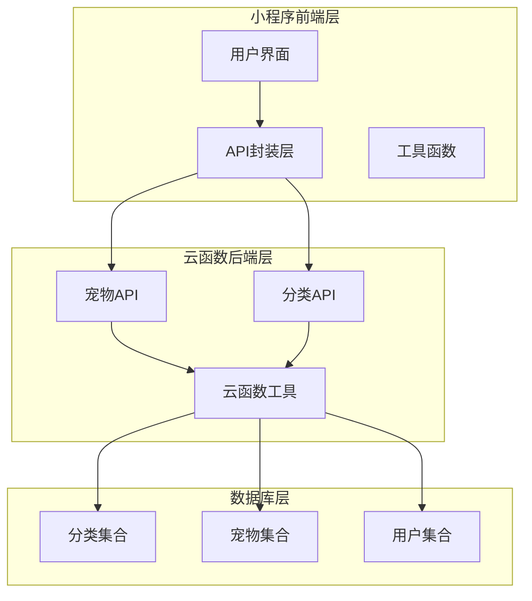
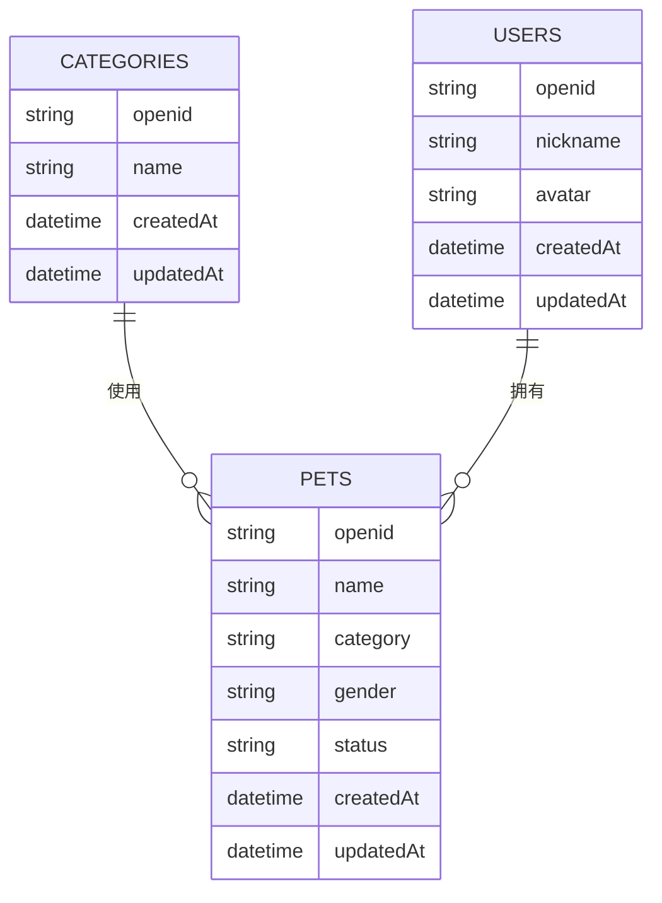
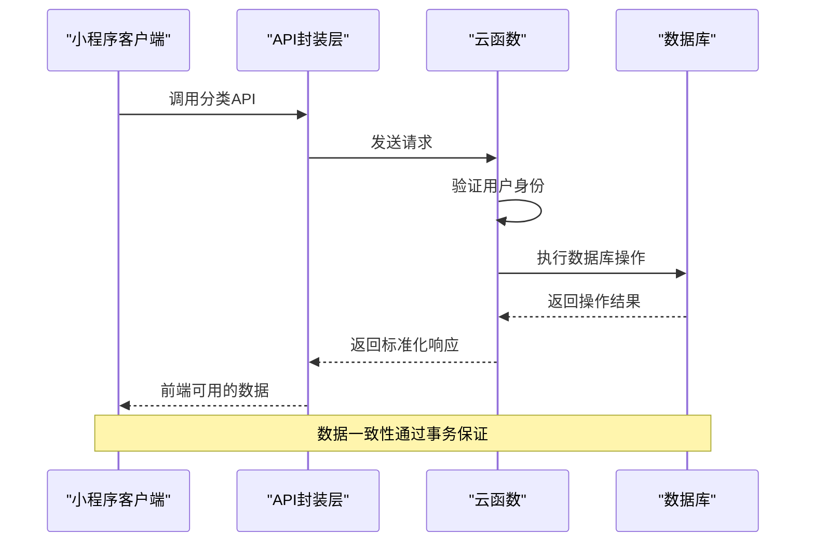
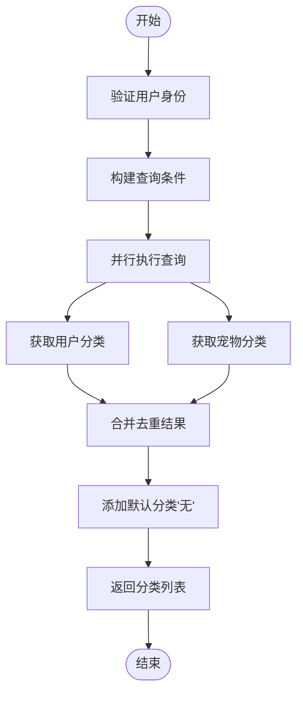
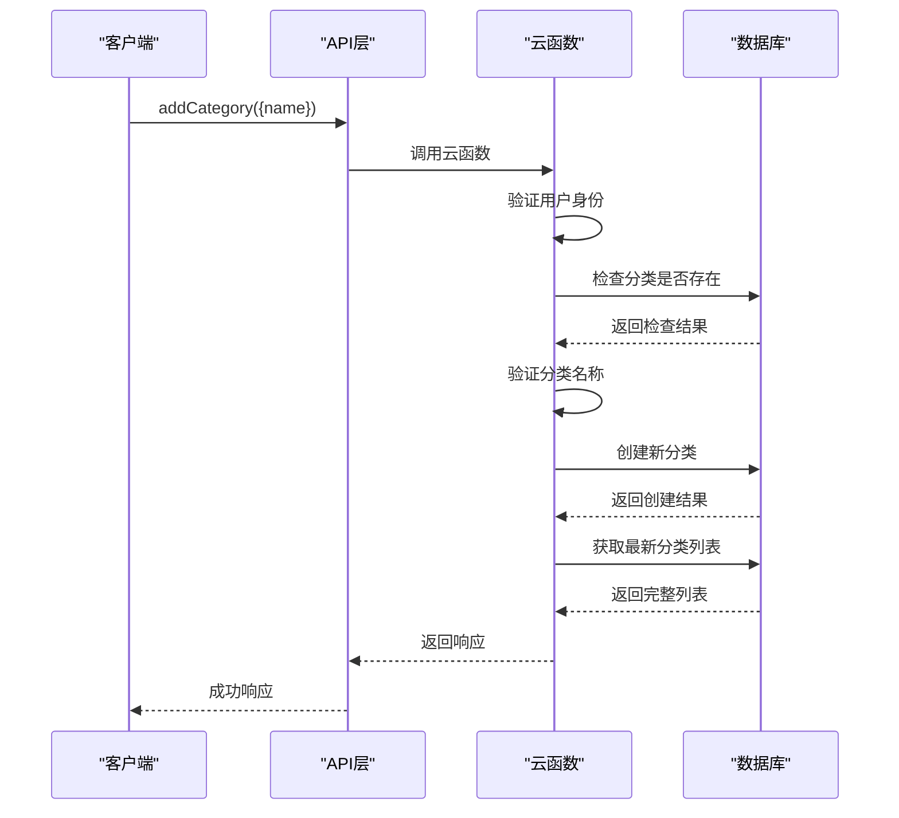
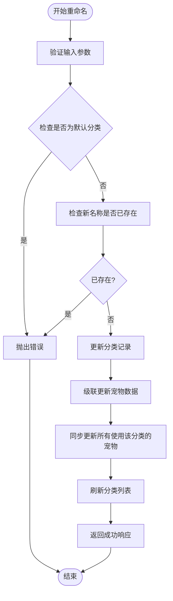
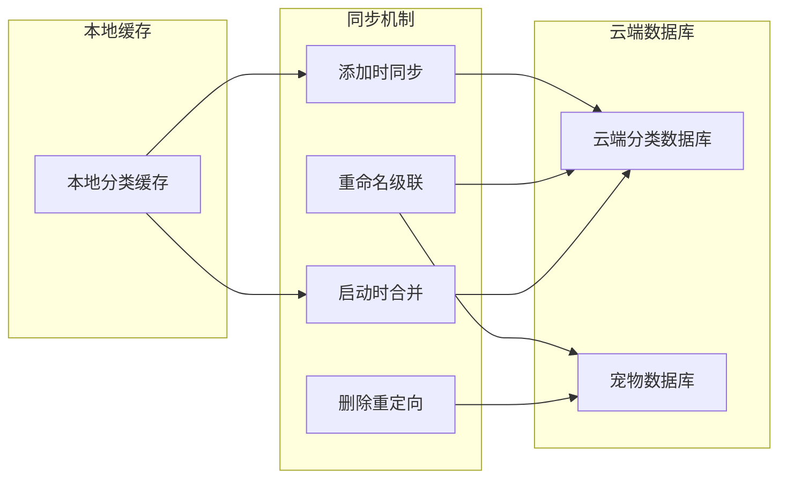
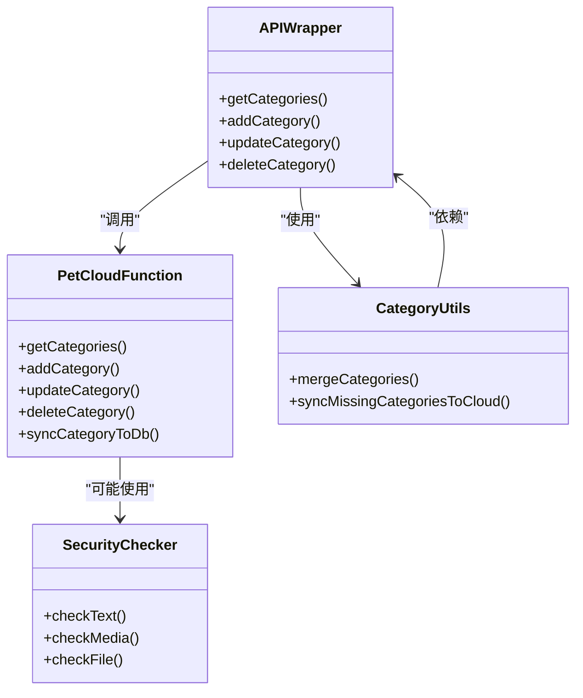

# 宠物分类管理API

<cite>
**本文档引用的文件**
- [cloudfunctions/pet/index.js](file://cloudfunctions/pet/index.js)
- [cloudfunctions/pet/utils.js](file://cloudfunctions/pet/utils.js)
- [miniprogram/utils/api.js](file://miniprogram/utils/api.js)
- [miniprogram/utils/category.js](file://miniprogram/utils/category.js)
- [miniprogram/pages/pet/index.js](file://miniprogram/pages/pet/index.js)
- [miniprogram/pages/pet/detail.js](file://miniprogram/pages/pet/detail.js)
- [cloudfunctions/common/securityChecker.js](file://cloudfunctions/common/securityChecker.js)
- [server-setup/database.sql](file://server-setup/database.sql)
</cite>

## 目录
1. [简介](#简介)
2. [项目结构](#项目结构)
3. [核心组件](#核心组件)
4. [架构概览](#架构概览)
5. [详细组件分析](#详细组件分析)
6. [依赖关系分析](#依赖关系分析)
7. [性能考虑](#性能考虑)
8. [故障排除指南](#故障排除指南)
9. [结论](#结论)
10. [附录](#附录)

## 简介

宠物分类管理API是养龟档案系统中的核心功能模块，负责管理用户自定义的宠物分类体系。该API提供了完整的分类生命周期管理能力，包括分类的增删改查操作，并确保与宠物数据的实时同步。

系统采用微信云开发架构，通过云函数提供RESTful风格的API接口，支持分类的唯一性验证、权限控制和数据一致性保证。默认分类"无"始终存在，用于表示未分类的宠物数据。

## 项目结构

该项目采用前后端分离架构，主要分为以下层次：



**图表来源**
- [cloudfunctions/pet/index.js:45-82](file://cloudfunctions/pet/index.js#L45-L82)
- [miniprogram/utils/api.js:51-81](file://miniprogram/utils/api.js#L51-L81)

**章节来源**
- [cloudfunctions/pet/index.js:1-82](file://cloudfunctions/pet/index.js#L1-L82)
- [miniprogram/utils/api.js:51-81](file://miniprogram/utils/api.js#L51-L81)

## 核心组件

### API接口设计

系统提供四个核心API接口，每个都遵循统一的错误处理和响应格式：

| 接口 | 方法 | 功能描述 | 参数 |
|------|------|----------|------|
| getCategories | GET | 获取用户分类列表 | 无 |
| addCategory | POST | 添加新分类 | `{ name: string }` |
| updateCategory | PUT | 更新分类名称 | `{ oldName: string, newName: string }` |
| deleteCategory | DELETE | 删除分类 | `{ name: string }` |

### 数据模型



**图表来源**
- [cloudfunctions/pet/index.js:637-670](file://cloudfunctions/pet/index.js#L637-L670)

**章节来源**
- [cloudfunctions/pet/index.js:517-524](file://cloudfunctions/pet/index.js#L517-L524)
- [cloudfunctions/pet/index.js:637-670](file://cloudfunctions/pet/index.js#L637-L670)

## 架构概览

系统采用三层架构设计，确保职责分离和可维护性：



**图表来源**
- [cloudfunctions/pet/index.js:45-82](file://cloudfunctions/pet/index.js#L45-L82)
- [cloudfunctions/pet/utils.js:15-18](file://cloudfunctions/pet/utils.js#L15-L18)

## 详细组件分析

### getCategories - 获取分类列表

该接口负责返回当前用户的完整分类列表，包含系统内置的"无"分类和所有用户自定义分类。

#### 实现流程



**图表来源**
- [cloudfunctions/pet/index.js:637-670](file://cloudfunctions/pet/index.js#L637-L670)

#### 关键特性

- **并发优化**: 使用Promise.all并行查询分类和宠物数据
- **去重机制**: 通过Set确保分类名称唯一性
- **默认分类**: 自动包含"无"分类，始终位于列表首位
- **排序规则**: 按创建时间升序排列

**章节来源**
- [cloudfunctions/pet/index.js:517-524](file://cloudfunctions/pet/index.js#L517-L524)
- [cloudfunctions/pet/index.js:637-670](file://cloudfunctions/pet/index.js#L637-L670)

### addCategory - 添加分类

添加新分类时，系统会执行严格的验证和同步操作。

#### 完整流程图



**图表来源**
- [cloudfunctions/pet/index.js:526-556](file://cloudfunctions/pet/index.js#L526-L556)

#### 验证规则

- **必填验证**: 分类名称必须存在且非空
- **唯一性验证**: 同一用户下分类名称必须唯一
- **格式验证**: 自动去除首尾空白字符
- **权限验证**: 必须登录状态才能操作

**章节来源**
- [cloudfunctions/pet/index.js:526-556](file://cloudfunctions/pet/index.js#L526-L556)

### updateCategory - 更新分类

分类重命名操作涉及复杂的级联更新策略，确保数据一致性。

#### 级联更新流程



**图表来源**
- [cloudfunctions/pet/index.js:558-608](file://cloudfunctions/pet/index.js#L558-L608)

#### 级联更新策略

- **原子性**: 整个重命名操作在单个事务中完成
- **完整性**: 所有使用旧分类名称的宠物都会被更新
- **一致性**: 确保数据库中不会出现孤立的分类引用
- **幂等性**: 支持重复调用而不产生副作用

**章节来源**
- [cloudfunctions/pet/index.js:558-608](file://cloudfunctions/pet/index.js#L558-L608)

### deleteCategory - 删除分类

删除分类时，系统会自动将使用该分类的宠物重定向到"无"分类。

#### 删除策略

| 操作类型 | 影响范围 | 处理方式 |
|----------|----------|----------|
| 删除分类 | 分类记录 | 立即删除 |
| 删除分类 | 使用该分类的宠物 | 自动重定向到"无" |
| 默认分类 | 保护机制 | 禁止删除 |

**章节来源**
- [cloudfunctions/pet/index.js:610-634](file://cloudfunctions/pet/index.js#L610-L634)

### 数据同步机制

系统实现了多层次的数据同步机制，确保分类变更的实时性和一致性。

#### 同步策略



**图表来源**
- [cloudfunctions/pet/index.js:672-688](file://cloudfunctions/pet/index.js#L672-L688)
- [miniprogram/utils/category.js:29-59](file://miniprogram/utils/category.js#L29-L59)

**章节来源**
- [cloudfunctions/pet/index.js:672-688](file://cloudfunctions/pet/index.js#L672-L688)
- [miniprogram/utils/category.js:29-59](file://miniprogram/utils/category.js#L29-L59)

## 依赖关系分析

### 组件耦合度

系统采用松耦合设计，各组件间依赖关系清晰：



**图表来源**
- [miniprogram/utils/api.js:67-81](file://miniprogram/utils/api.js#L67-L81)
- [cloudfunctions/pet/index.js:45-82](file://cloudfunctions/pet/index.js#L45-L82)
- [miniprogram/utils/category.js:61-64](file://miniprogram/utils/category.js#L61-L64)

### 外部依赖

- **微信云开发**: 提供云函数、数据库、存储等服务
- **腾讯云安全服务**: 提供内容审核功能
- **小程序框架**: 提供UI组件和生命周期管理

**章节来源**
- [cloudfunctions/common/securityChecker.js:74-105](file://cloudfunctions/common/securityChecker.js#L74-L105)
- [cloudfunctions/pet/utils.js:1-18](file://cloudfunctions/pet/utils.js#L1-L18)

## 性能考虑

### 查询优化

系统通过多种方式优化查询性能：

1. **索引设计**: 在categories和pets集合上建立适当的索引
2. **并发查询**: 使用Promise.all并行执行多个查询
3. **字段投影**: 仅获取必要的字段，减少数据传输
4. **分页机制**: 支持大数据集的分页查询

### 缓存策略

- **本地缓存**: 小程序端缓存分类列表，减少网络请求
- **预加载机制**: 应用启动时预加载常用数据
- **智能更新**: 云端变更时通知客户端更新缓存

### 错误处理

系统实现了完善的错误处理机制：

- **统一错误格式**: 所有API返回一致的错误格式
- **降级策略**: 网络异常时提供本地数据降级
- **重试机制**: 关键操作支持自动重试

## 故障排除指南

### 常见问题及解决方案

#### 权限相关问题

**问题**: "用户未登录"
**原因**: 未正确初始化云开发环境
**解决**: 确保在小程序端正确调用wx.cloud.init()

#### 数据一致性问题

**问题**: 分类重命名后部分宠物未更新
**原因**: 网络中断导致级联更新失败
**解决**: 重新调用updateCategory接口，系统会自动处理幂等性

#### 性能问题

**问题**: 分类列表加载缓慢
**原因**: 数据量过大或网络延迟
**解决**: 
1. 检查数据库索引是否合理
2. 考虑分页加载
3. 优化网络请求频率

**章节来源**
- [cloudfunctions/pet/index.js:518-520](file://cloudfunctions/pet/index.js#L518-L520)
- [cloudfunctions/pet/index.js:569-571](file://cloudfunctions/pet/index.js#L569-L571)

### 调试技巧

1. **查看云函数日志**: 通过微信开发者工具查看详细的错误信息
2. **断点调试**: 在关键位置设置断点观察变量状态
3. **网络监控**: 使用开发者工具的网络面板监控API调用

## 结论

宠物分类管理API提供了完整、可靠的分类管理体系，具有以下优势：

1. **功能完整**: 支持分类的全生命周期管理
2. **数据一致**: 通过级联更新确保数据完整性
3. **性能优化**: 采用并发查询和缓存策略
4. **错误处理**: 完善的异常处理和降级机制
5. **扩展性强**: 模块化设计便于功能扩展

该API为养龟档案系统提供了坚实的分类基础，支持用户灵活管理自己的宠物数据。

## 附录

### API调用示例

#### 获取分类列表
```javascript
// 前端调用
const result = await API.getCategories()
console.log(result.data.categories)
```

#### 添加分类
```javascript
// 前端调用
const result = await API.addCategory("繁殖用龟")
console.log(result.data.categories)
```

#### 更新分类
```javascript
// 前端调用
const result = await API.updateCategory("繁殖用龟", "种龟")
console.log(result.data.categories)
```

#### 删除分类
```javascript
// 前端调用
const result = await API.deleteCategory("种龟")
console.log(result.data.categories)
```

### 最佳实践

1. **输入验证**: 始终验证用户输入，防止恶意数据
2. **错误处理**: 完善的错误处理和用户反馈
3. **性能优化**: 合理使用缓存和分页
4. **安全性**: 实施适当的权限控制和数据验证
5. **监控告警**: 建立完善的日志和监控体系