# 宠物家谱查询API

<cite>
**本文档引用的文件**
- [cloudfunctions/pet/index.js](file://cloudfunctions/pet/index.js)
- [cloudfunctions/pet/utils.js](file://cloudfunctions/pet/utils.js)
- [cloudfunctions/pet/config.json](file://cloudfunctions/pet/config.json)
- [miniprogram/pages/pet/detail.js](file://miniprogram/pages/pet/detail.js)
- [miniprogram/utils/theme.js](file://miniprogram/utils/theme.js)
- [server-setup/database.sql](file://server-setup/database.sql)
</cite>

## 目录
1. [项目概述](#项目概述)
2. [API架构概览](#api架构概览)
3. [getPedigree接口详解](#getpedigree接口详解)
4. [家谱树构建算法](#家谱树构建算法)
5. [递归查询机制](#递归查询机制)
6. [谱系统计功能](#谱系统计功能)
7. [父系主线提取](#父系主线提取)
8. [母系主线提取](#母系主线提取)
9. [数据结构说明](#数据结构说明)
10. [配置参数](#配置参数)
11. [使用场景与最佳实践](#使用场景与最佳实践)
12. [性能优化建议](#性能优化建议)
13. [故障排查指南](#故障排查指南)
14. [总结](#总结)

## 项目概述

宠物家谱查询API是养龟档案系统中的核心功能模块，专门用于查询和管理宠物的家族谱系信息。该系统基于微信云开发平台构建，采用Serverless架构，为用户提供完整的宠物血统管理和繁殖规划解决方案。

系统主要特点：
- **实时谱系查询**：支持多代祖先的实时查询和展示
- **血统统计分析**：提供详细的谱系统计数据和分析报告
- **血缘主线追踪**：自动提取父系和母系血缘主线
- **安全权限控制**：基于用户身份的宠物数据访问控制
- **响应式界面**：支持移动端和PC端的家谱可视化展示

## API架构概览

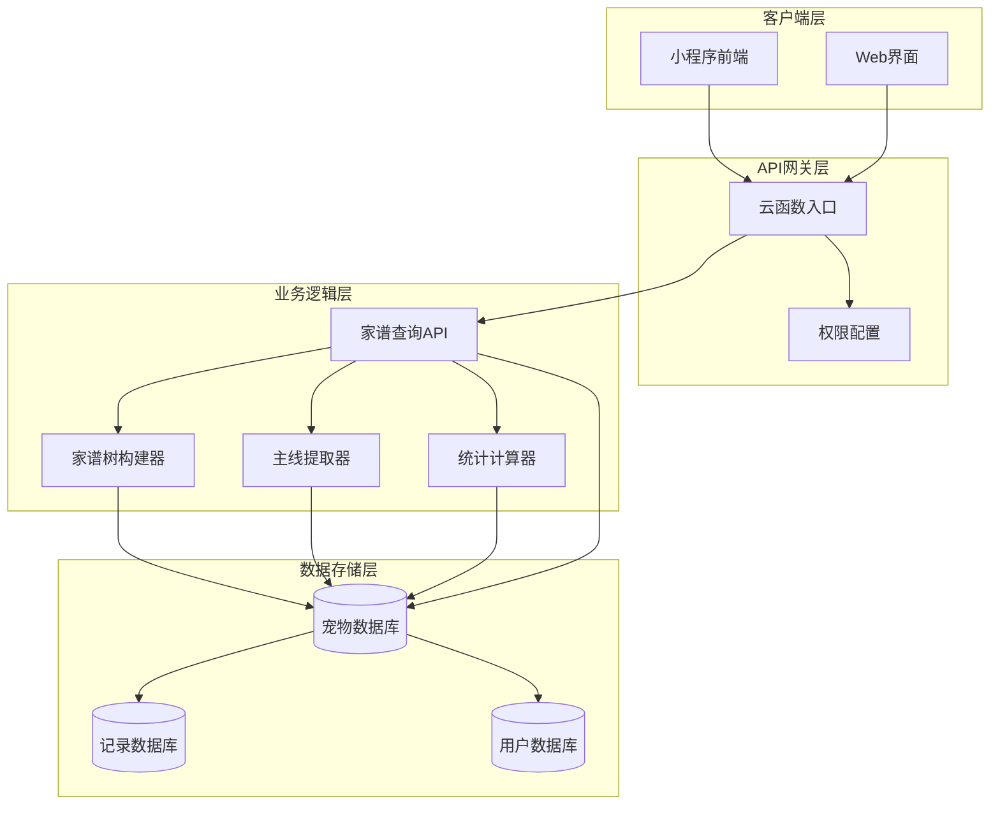

**图表来源**
- [cloudfunctions/pet/index.js:45-82](file://cloudfunctions/pet/index.js#L45-L82)
- [cloudfunctions/pet/config.json:1-6](file://cloudfunctions/pet/config.json#L1-L6)

## getPedigree接口详解

### 接口定义

getPedigree接口是宠物家谱查询的核心入口，负责获取指定宠物的完整家族谱系信息。

**接口签名**：`getPedigree(petId, openid, maxGeneration = 3, envId)`

**参数说明**：
- `petId`：目标宠物的唯一标识符（必填）
- `openid`：当前用户的微信OpenID（必填）
- `maxGeneration`：最大查询代数，默认值为3代
- `envId`：环境ID（可选）

### 权限验证流程

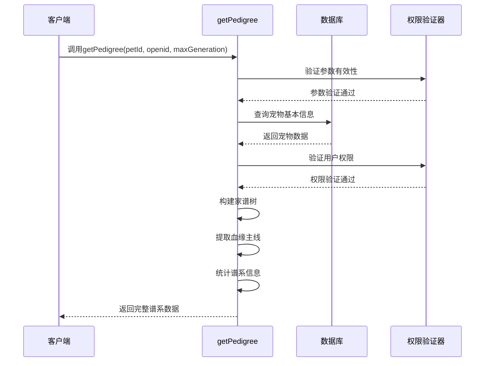

**图表来源**
- [cloudfunctions/pet/index.js:376-412](file://cloudfunctions/pet/index.js#L376-L412)

### 返回数据结构

接口返回的数据包含以下关键部分：

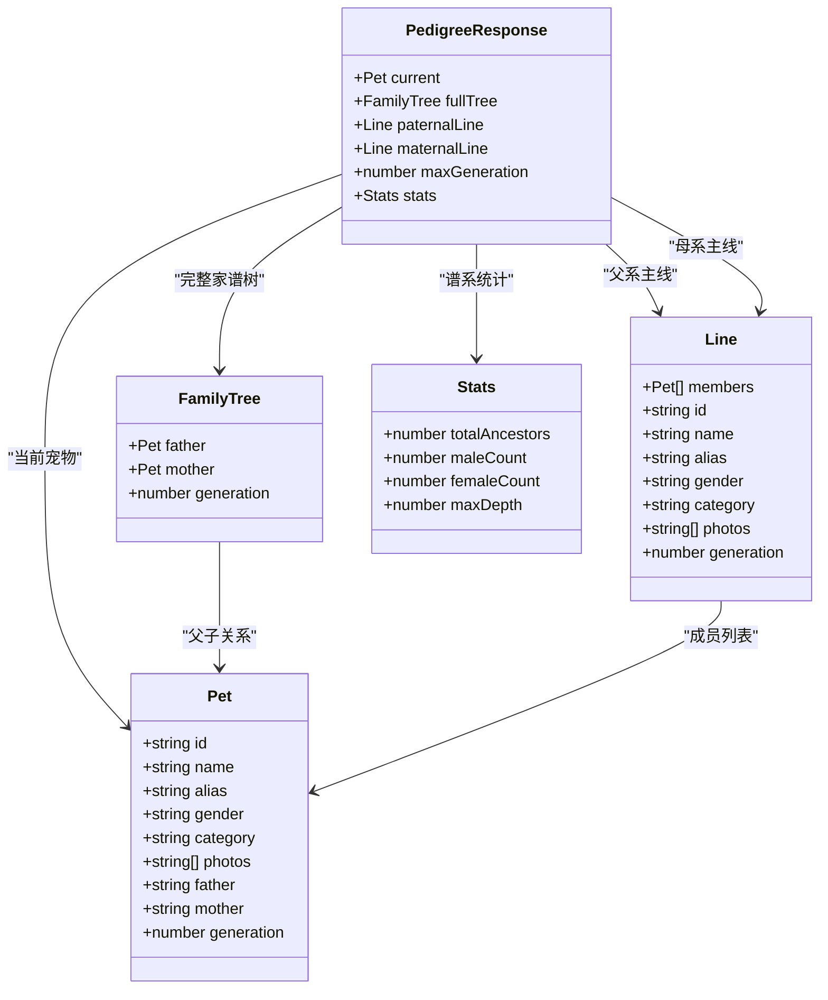

**图表来源**
- [cloudfunctions/pet/index.js:404-411](file://cloudfunctions/pet/index.js#L404-L411)

**章节来源**
- [cloudfunctions/pet/index.js:370-412](file://cloudfunctions/pet/index.js#L370-L412)

## 家谱树构建算法

### 算法原理

家谱树构建采用递归深度优先搜索算法，从目标宠物开始向上追溯祖先，直到达到指定的最大代数限制。

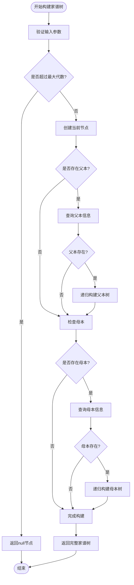

**图表来源**
- [cloudfunctions/pet/index.js:417-469](file://cloudfunctions/pet/index.js#L417-L469)

### 代数层级定义

系统采用标准的家谱代数定义：

| 代数 | 关系 | 说明 |
|------|------|------|
| 0代 | 当前个体 | 目标宠物本身 |
| 1代 | 父母 | 父本和母本 |
| 2代 | 祖父母 | 父父和父母、母父和母母 |
| 3代 | 曾祖父母 | 父父父、父父母、父母父、父母母、母父父、母父母、母母父、母母母 |

**章节来源**
- [cloudfunctions/pet/index.js:417-469](file://cloudfunctions/pet/index.js#L417-L469)

## 递归查询机制

### 查询策略

系统采用智能递归查询策略，确保在保证数据完整性的同时优化查询性能：

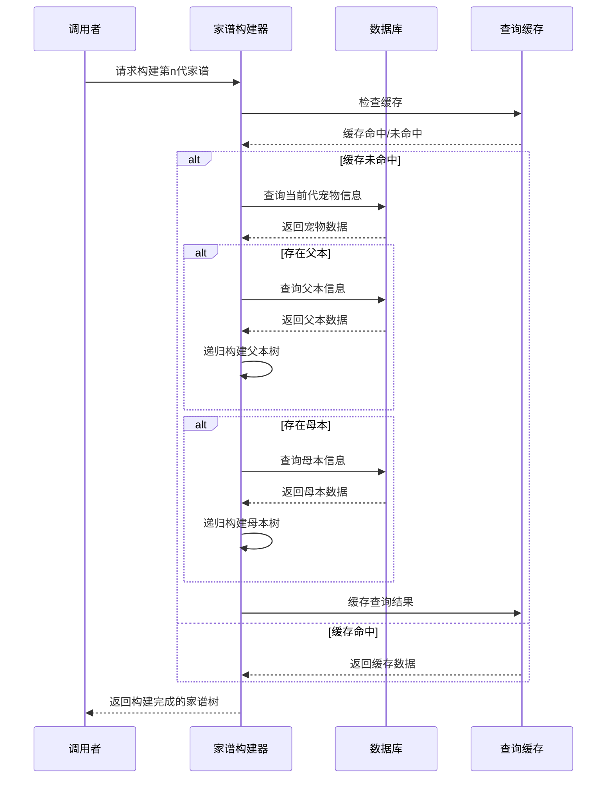

**图表来源**
- [cloudfunctions/pet/index.js:430-466](file://cloudfunctions/pet/index.js#L430-L466)

### 性能优化措施

1. **并发查询**：父本和母本查询采用并行方式执行
2. **条件过滤**：查询时同时包含`_id`和`openid`条件，确保数据安全
3. **深度限制**：严格控制递归深度，防止无限查询
4. **数据净化**：自动处理过期的临时URL，转换为永久cloud地址

**章节来源**
- [cloudfunctions/pet/index.js:430-466](file://cloudfunctions/pet/index.js#L430-L466)

## 谱系统计功能

### 统计指标

系统提供全面的谱系统计分析功能，包括：

| 统计指标 | 定义 | 计算方式 |
|----------|------|----------|
| 总祖先数 | 所有祖先宠物的总数 | 递归遍历所有后代节点 |
| 父系数量 | 父系血统中的宠物数量 | 统计性别为"公"的祖先 |
| 母系数量 | 母系血统中的宠物数量 | 统计性别为"母"的祖先 |
| 最深远代 | 家谱树的最大深度 | 递归遍历找到的最大代数 |

### 统计算法实现

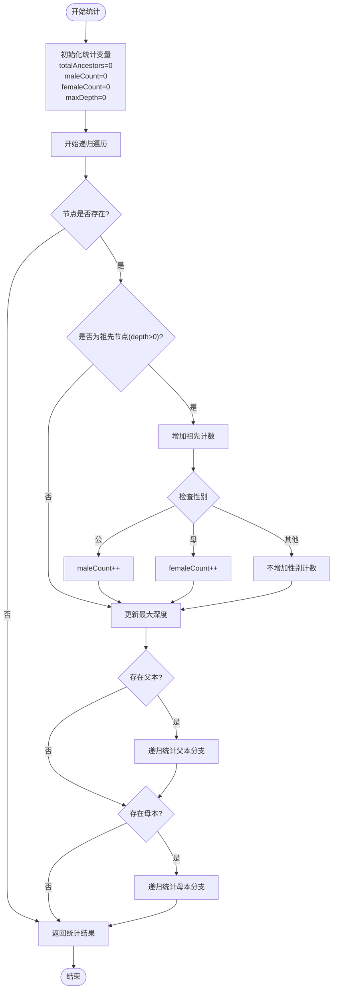

**图表来源**
- [cloudfunctions/pet/index.js:693-722](file://cloudfunctions/pet/index.js#L693-L722)

**章节来源**
- [cloudfunctions/pet/index.js:693-722](file://cloudfunctions/pet/index.js#L693-L722)

## 父系主线提取

### 提取逻辑

父系主线提取算法专注于追踪父系血统的直接传承路径：

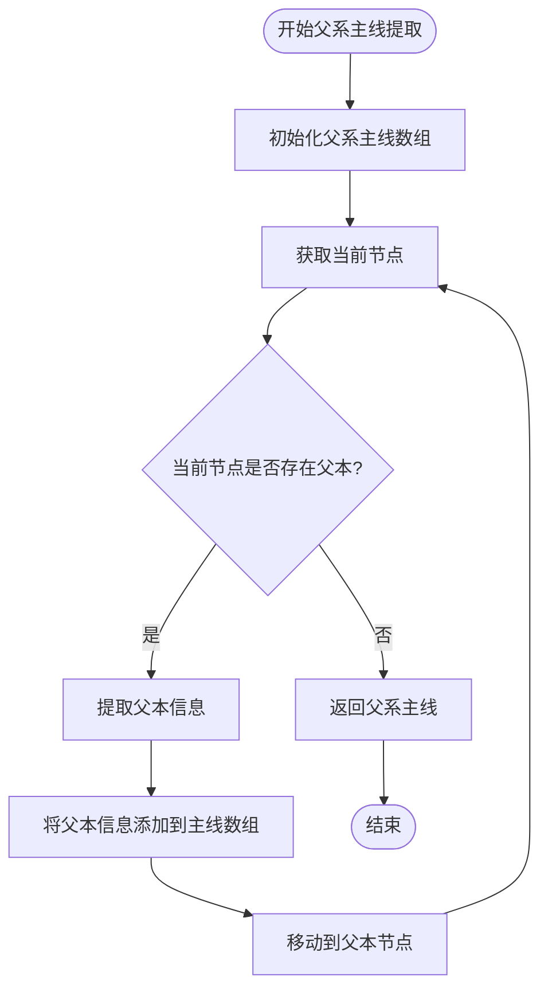

**图表来源**
- [cloudfunctions/pet/index.js:474-492](file://cloudfunctions/pet/index.js#L474-L492)

### 提取规则

1. **性别约束**：仅追踪父系血统，即男性祖先
2. **直接继承**：严格按照"儿子-孙子-曾孙..."的直线传承
3. **信息完整性**：保留每个祖先的ID、姓名、别名、性别、分类、照片和代数信息
4. **顺序保持**：按照从近到远的顺序排列

**章节来源**
- [cloudfunctions/pet/index.js:474-492](file://cloudfunctions/pet/index.js#L474-L492)

## 母系主线提取

### 提取逻辑

母系主线提取算法专注于追踪母系血统的直接传承路径：


**图表来源**
- [cloudfunctions/pet/index.js:497-515](file://cloudfunctions/pet/index.js#L497-L515)

### 提取规则

1. **性别约束**：仅追踪母系血统，即女性祖先
2. **直接继承**：严格按照"女儿-外孙女-曾外孙女..."的直线传承
3. **信息完整性**：保留每个祖先的ID、姓名、别名、性别、分类、照片和代数信息
4. **顺序保持**：按照从近到远的顺序排列

**章节来源**
- [cloudfunctions/pet/index.js:497-515](file://cloudfunctions/pet/index.js#L497-L515)

## 数据结构说明

### 宠物数据模型

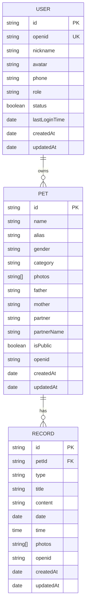

**图表来源**
- [server-setup/database.sql:50-76](file://server-setup/database.sql#L50-L76)
- [server-setup/database.sql:79-109](file://server-setup/database.sql#L79-L109)

### 前端数据结构

前端使用JavaScript对象表示谱系数据：

```javascript
const pedigreeData = {
  current: { /* 当前宠物信息 */ },
  fullTree: {
    father: { /* 父本家谱树 */ },
    mother: { /* 母本家谱树 */ }
  },
  paternalLine: [/* 父系主线数组 */],
  maternalLine: [/* 母系主线数组 */],
  maxGeneration: 3,
  stats: {
    totalAncestors: 0,
    maleCount: 0,
    femaleCount: 0,
    maxDepth: 0
  }
};
```

**章节来源**
- [cloudfunctions/pet/index.js:404-411](file://cloudfunctions/pet/index.js#L404-L411)
- [miniprogram/pages/pet/detail.js:120-132](file://miniprogram/pages/pet/detail.js#L120-L132)

## 配置参数

### 最大查询代数

系统支持的最大查询代数配置：

| 代数级别 | 名称 | 适用场景 |
|----------|------|----------|
| 1代 | 父母 | 快速查看直接双亲 |
| 2代 | 祖父母 | 查看祖父母信息 |
| 3代 | 曾祖父母 | 完整四代谱系分析 |
| 4代及以上 | 更远祖先 | 特殊研究需求 |

### 系统配置项

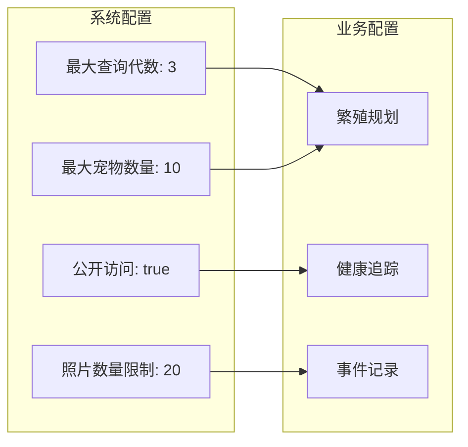

**图表来源**
- [cloudfunctions/pet/index.js:89-98](file://cloudfunctions/pet/index.js#L89-L98)
- [server-setup/database.sql:196-201](file://server-setup/database.sql#L196-L201)

**章节来源**
- [cloudfunctions/pet/index.js:89-98](file://cloudfunctions/pet/index.js#L89-L98)
- [server-setup/database.sql:196-201](file://server-setup/database.sql#L196-L201)

## 使用场景与最佳实践

### 繁殖规划应用

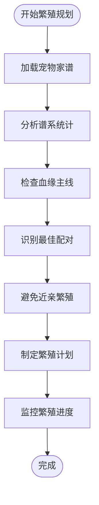

### 血统管理实践

1. **定期更新**：及时更新宠物的父本、母本信息
2. **数据验证**：确保谱系数据的准确性和完整性
3. **隐私保护**：合理设置宠物的公开权限
4. **历史记录**：维护完整的繁殖历史记录

### 界面交互设计

前端提供了丰富的谱系展示功能：

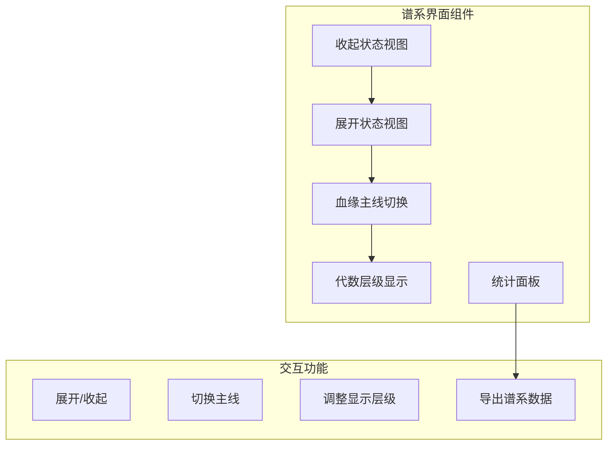

**图表来源**
- [miniprogram/utils/theme.js:243-447](file://miniprogram/utils/theme.js#L243-L447)

**章节来源**
- [miniprogram/utils/theme.js:243-447](file://miniprogram/utils/theme.js#L243-L447)

## 性能优化建议

### 查询优化策略

1. **索引优化**：确保`openid`、`pet_id`等常用查询字段建立索引
2. **查询限制**：合理设置最大查询代数，避免深层递归查询
3. **缓存机制**：利用云开发的缓存功能减少重复查询
4. **批量操作**：对于大量宠物的谱系查询，考虑分批处理

### 前端渲染优化

1. **虚拟滚动**：对于大型谱系树，使用虚拟滚动技术提升渲染性能
2. **懒加载**：按需加载谱系节点，减少初始渲染压力
3. **图片优化**：压缩和懒加载宠物照片，提升页面加载速度
4. **状态管理**：合理管理谱系数据的状态，避免不必要的重渲染

## 故障排查指南

### 常见错误及解决方案

| 错误类型 | 错误代码 | 可能原因 | 解决方案 |
|----------|----------|----------|----------|
| 权限错误 | 403 | 无权访问目标宠物 | 检查openid与宠物归属关系 |
| 数据不存在 | 404 | 宠物ID无效或已被删除 | 验证宠物ID的有效性 |
| 查询超时 | 504 | 递归深度过大 | 降低maxGeneration参数 |
| 配额限制 | 429 | API调用频率过高 | 实施请求节流和缓存策略 |

### 调试技巧

1. **日志记录**：在关键节点添加详细的日志输出
2. **参数验证**：严格验证输入参数的有效性
3. **错误捕获**：使用try-catch捕获和处理异步错误
4. **性能监控**：监控查询时间和资源使用情况

**章节来源**
- [cloudfunctions/pet/index.js:78-81](file://cloudfunctions/pet/index.js#L78-L81)

## 总结

宠物家谱查询API是一个功能完善、架构清晰的谱系管理解决方案。通过高效的递归算法、智能的统计分析和友好的用户界面，为用户提供了一站式的宠物血统管理和繁殖规划服务。

### 核心优势

1. **算法高效**：采用优化的递归查询算法，支持多代谱系快速构建
2. **功能完整**：涵盖谱系查询、统计分析、主线提取等核心功能
3. **用户体验**：提供直观的可视化界面和灵活的交互方式
4. **扩展性强**：模块化的架构设计便于功能扩展和维护

### 应用价值

该API不仅满足了宠物饲养者的日常管理需求，更为专业的繁殖工作提供了强有力的技术支撑。通过科学的谱系管理和数据分析，有助于提高繁殖效率、优化血统质量，推动宠物养殖业的健康发展。