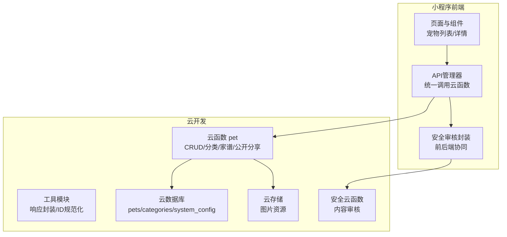
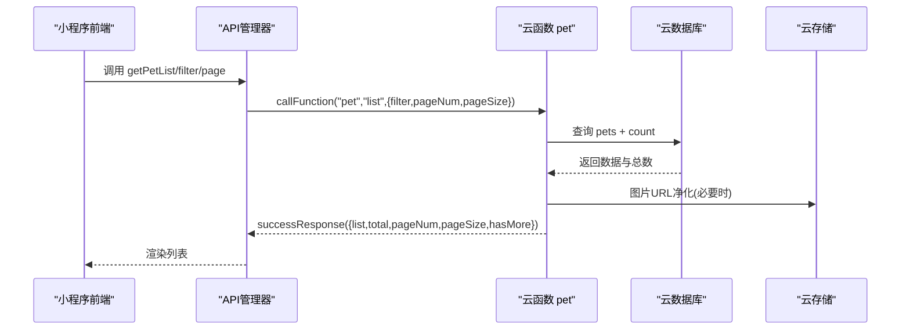
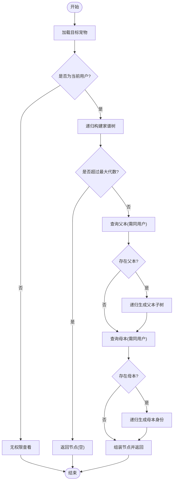
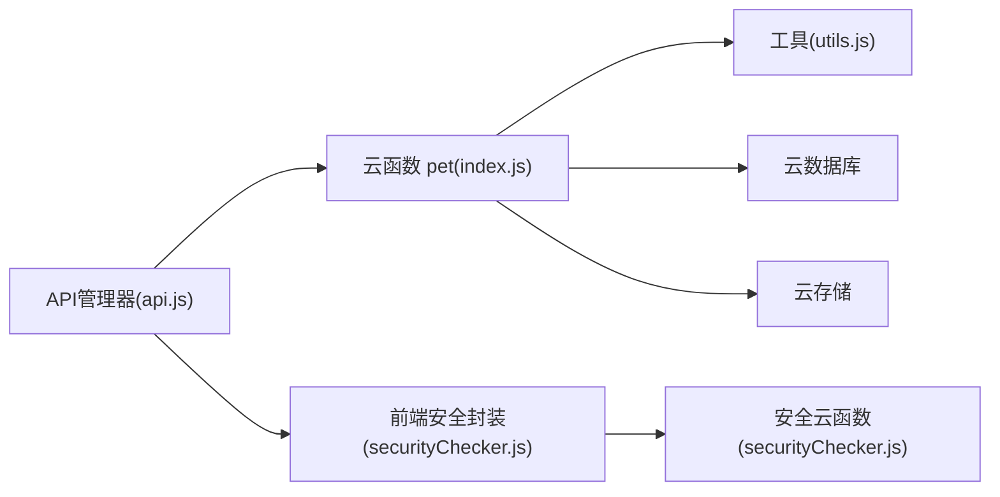

# 宠物管理API

<cite>
**本文档引用的文件**
- [cloudfunctions/pet/index.js](file://cloudfunctions/pet/index.js)
- [cloudfunctions/pet/utils.js](file://cloudfunctions/pet/utils.js)
- [cloudfunctions/common/securityChecker.js](file://cloudfunctions/common/securityChecker.js)
- [miniprogram/utils/api.js](file://miniprogram/utils/api.js)
- [miniprogram/utils/securityChecker.js](file://miniprogram/utils/securityChecker.js)
- [miniprogram/pages/pet/detail.js](file://miniprogram/pages/pet/detail.js)
- [miniprogram/pages/pet/index.js](file://miniprogram/pages/pet/index.js)
- [cloudfunctions/pet/config.json](file://cloudfunctions/pet/config.json)
- [server-setup/database.sql](file://server-setup/database.sql)
</cite>

## 目录
1. [简介](#简介)
2. [项目结构](#项目结构)
3. [核心组件](#核心组件)
4. [架构总览](#架构总览)
5. [详细组件分析](#详细组件分析)
6. [依赖关系分析](#依赖关系分析)
7. [性能考虑](#性能考虑)
8. [故障排除指南](#故障排除指南)
9. [结论](#结论)
10. [附录](#附录)

## 简介
本文件为“宠物管理API”的完整技术文档，涵盖宠物CRUD操作、分类系统、家谱查询、公开宠物分享机制、数据验证规则、权限控制以及图片URL净化处理。文档面向开发者与运维人员，提供端点定义、参数说明、响应格式、错误码、调用示例与常见问题解决方案。

## 项目结构
系统采用“小程序前端 + 云开发云函数 + 云数据库 + 云存储”的架构：
- 前端：微信小程序页面与工具模块负责调用云函数、上传图片、执行安全审核。
- 云函数：提供宠物、记录、提醒、足迹等业务接口，统一鉴权与数据校验。
- 云数据库：存储宠物、记录、分类、系统配置等数据。
- 云存储：存储宠物图片等资源，配合安全审核与URL净化。

图表来源
- [cloudfunctions/pet/index.js:45-82](file://cloudfunctions/pet/index.js#L45-L82)
- [cloudfunctions/pet/utils.js:15-18](file://cloudfunctions/pet/utils.js#L15-L18)
- [miniprogram/utils/api.js:12-38](file://miniprogram/utils/api.js#L12-L38)
- [miniprogram/utils/securityChecker.js:22-41](file://miniprogram/utils/securityChecker.js#L22-L41)

章节来源
- [cloudfunctions/pet/index.js:1-82](file://cloudfunctions/pet/index.js#L1-L82)
- [miniprogram/utils/api.js:1-208](file://miniprogram/utils/api.js#L1-L208)

## 核心组件
- 云函数 pet：实现宠物CRUD、分类管理、家谱查询、公开宠物列表与详情、图片URL净化。
- 工具模块 utils：统一响应格式、OpenID获取、ID规范化、数据库连接。
- 安全审核模块：前后端协同，提供图片/文本审核与异步回调。
- 前端API管理器：封装云函数调用、分页、错误处理、图片上传与审核。

章节来源
- [cloudfunctions/pet/index.js:84-138](file://cloudfunctions/pet/index.js#L84-L138)
- [cloudfunctions/pet/utils.js:1-69](file://cloudfunctions/pet/utils.js#L1-L69)
- [cloudfunctions/common/securityChecker.js:30-208](file://cloudfunctions/common/securityChecker.js#L30-L208)
- [miniprogram/utils/api.js:4-208](file://miniprogram/utils/api.js#L4-L208)

## 架构总览
云函数入口根据 action 分发至不同业务方法，统一通过 OpenID 进行权限校验，数据库查询与更新均以 openid 作为隔离边界。图片URL在返回前端前经过净化，确保使用稳定的云存储标识。

图表来源
- [miniprogram/utils/api.js:43-45](file://miniprogram/utils/api.js#L43-L45)
- [cloudfunctions/pet/index.js:140-180](file://cloudfunctions/pet/index.js#L140-L180)
- [cloudfunctions/pet/utils.js:20-35](file://cloudfunctions/pet/utils.js#L20-L35)

## 详细组件分析

### 宠物CRUD端点
- 创建(create)
  - 请求参数：name、category、gender、alias、father、mother、partner、partnerName、price、status、isPublic、photos 等。
  - 校验规则：名称必填；别名需在同一用户下唯一；按系统配置限制最大宠物数量。
  - 权限控制：通过 OpenID 限定归属。
  - 响应：返回新建宠物的 id 与基础信息。
  - 错误码：名称为空、别名冲突、超出上限、系统配置读取失败等。
  - 示例：前端调用 [APIManager.createPet:51-53](file://miniprogram/utils/api.js#L51-L53)。

- 查询列表(list)
  - 请求参数：filter(series, gender, searchText)、pageNum、pageSize。
  - 查询条件：以 openid 为条件，支持按分类、性别、模糊搜索 name。
  - 分页：返回 total、pageNum、pageSize、hasMore。
  - 响应：list 数组 + 分页元数据。
  - 示例：前端调用 [APIManager.getPetList:43-45](file://miniprogram/utils/api.js#L43-L45)。

- 获取详情(get)
  - 请求参数：id。
  - 权限：必须为当前用户拥有该宠物。
  - 响应：单个宠物对象，photos 经净化处理。
  - 示例：前端调用 [APIManager.getPetById:47-49](file://miniprogram/utils/api.js#L47-L49)。

- 更新(update)
  - 请求参数：id + 可变字段。
  - 校验：别名在同一用户下唯一（排除自身）；isPublic 自动布尔化。
  - 权限：必须为当前用户拥有该宠物。
  - 响应：成功消息。
  - 示例：前端调用 [APIManager.updatePet:55-57](file://miniprogram/utils/api.js#L55-L57)。

- 删除(delete)
  - 请求参数：id。
  - 权限：必须为当前用户拥有该宠物。
  - 关联清理：同时删除该宠物相关的记录。
  - 响应：成功消息。
  - 示例：前端调用 [APIManager.deletePet:59-61](file://miniprogram/utils/api.js#L59-L61)。

章节来源
- [cloudfunctions/pet/index.js:84-138](file://cloudfunctions/pet/index.js#L84-L138)
- [cloudfunctions/pet/index.js:140-180](file://cloudfunctions/pet/index.js#L140-L180)
- [cloudfunctions/pet/index.js:182-191](file://cloudfunctions/pet/index.js#L182-L191)
- [cloudfunctions/pet/index.js:193-231](file://cloudfunctions/pet/index.js#L193-L231)
- [cloudfunctions/pet/index.js:233-250](file://cloudfunctions/pet/index.js#L233-L250)
- [miniprogram/utils/api.js:43-61](file://miniprogram/utils/api.js#L43-L61)

### 宠物分类系统
- 获取分类(getCategories)
  - 返回顺序：默认“无” + 用户自定义分类 + 已使用分类（去重）。
- 新增分类(addCategory)
  - 校验：名称非空且在当前用户下唯一。
- 修改分类(updateCategory)
  - 校验：禁止修改默认分类；新名称唯一；同步更新 pets 集合中的分类。
- 删除分类(deleteCategory)
  - 校验：禁止删除默认分类；删除后同步将 pets 中该分类改为“无”。

章节来源
- [cloudfunctions/pet/index.js:517-524](file://cloudfunctions/pet/index.js#L517-L524)
- [cloudfunctions/pet/index.js:526-556](file://cloudfunctions/pet/index.js#L526-L556)
- [cloudfunctions/pet/index.js:558-608](file://cloudfunctions/pet/index.js#L558-L608)
- [cloudfunctions/pet/index.js:610-634](file://cloudfunctions/pet/index.js#L610-L634)
- [cloudfunctions/pet/index.js:636-670](file://cloudfunctions/pet/index.js#L636-L670)
- [cloudfunctions/pet/index.js:672-688](file://cloudfunctions/pet/index.js#L672-L688)

### 家谱查询(getPedigree)
- 输入：petId、maxGeneration（默认3）。
- 权限：仅宠物主可查看。
- 输出：当前宠物、完整家谱树、父系主线、母系主线、统计信息（祖先总数、公母数量、最大深度）。
- 递归策略：按 generation 逐代查询父本/母本，直至达到最大代数。

图表来源
- [cloudfunctions/pet/index.js:376-412](file://cloudfunctions/pet/index.js#L376-L412)
- [cloudfunctions/pet/index.js:417-469](file://cloudfunctions/pet/index.js#L417-L469)
- [cloudfunctions/pet/index.js:474-515](file://cloudfunctions/pet/index.js#L474-L515)
- [cloudfunctions/pet/index.js:693-722](file://cloudfunctions/pet/index.js#L693-L722)

章节来源
- [cloudfunctions/pet/index.js:376-412](file://cloudfunctions/pet/index.js#L376-L412)
- [cloudfunctions/pet/index.js:417-469](file://cloudfunctions/pet/index.js#L417-L469)
- [cloudfunctions/pet/index.js:474-515](file://cloudfunctions/pet/index.js#L474-L515)
- [cloudfunctions/pet/index.js:693-722](file://cloudfunctions/pet/index.js#L693-L722)

### 公开宠物分享机制
- 获取公开列表(publicList)
  - 输入：userId。
  - 查询：该用户下 isPublic=true 的宠物，按创建时间倒序。
  - 附加：查询用户公开名片信息（昵称、头像、特长、地区、标签、简介、封面等）。
  - 优化：批量查询最新产蛋与交配记录，计算距上次产蛋天数。
- 获取公开详情(publicGet)
  - 输入：petId。
  - 权限：仅公开宠物可访问，非公开则报错。

章节来源
- [cloudfunctions/pet/index.js:252-349](file://cloudfunctions/pet/index.js#L252-L349)
- [cloudfunctions/pet/index.js:351-368](file://cloudfunctions/pet/index.js#L351-L368)

### 数据验证规则与权限控制
- 必填与唯一性
  - 创建：name 必填；alias 在同一用户下唯一。
  - 更新：alias 同一用户下唯一（排除自身）。
- 数量限制
  - 依据 systemConfig.maxPetCount 控制最大宠物数量，默认10。
- 权限控制
  - 所有 CRUD 操作均以 openid 作为归属校验。
  - 家谱查询要求当前用户即为宠物主。
  - 公开详情仅允许访问 isPublic=true 的宠物。
- 图片URL净化
  - 将过期的临时URL转换为稳定的 cloud://fileID 格式，保证长期可用。

章节来源
- [cloudfunctions/pet/index.js:84-138](file://cloudfunctions/pet/index.js#L84-L138)
- [cloudfunctions/pet/index.js:193-231](file://cloudfunctions/pet/index.js#L193-L231)
- [cloudfunctions/pet/index.js:16-43](file://cloudfunctions/pet/index.js#L16-L43)
- [cloudfunctions/pet/index.js:90-98](file://cloudfunctions/pet/index.js#L90-L98)

### 图片上传与安全审核
- 前端上传
  - 调用 [APIManager.uploadImage:156-178](file://miniprogram/utils/api.js#L156-L178)，上传至云存储并返回 fileID。
  - 上传成功后异步触发安全审核（可配置跳过）。
- 安全审核
  - 前端：[SecurityChecker.checkImage:50-59](file://miniprogram/utils/securityChecker.js#L50-L59) 提交审核任务。
  - 后端：[SecurityChecker.checkFile:159-170](file://cloudfunctions/common/securityChecker.js#L159-L170) 获取临时URL并调用云平台审核接口。
  - 日志记录：审核结果写入 security_logs，包含 traceId、场景、业务ID等。

章节来源
- [miniprogram/utils/api.js:156-178](file://miniprogram/utils/api.js#L156-L178)
- [miniprogram/utils/securityChecker.js:50-59](file://miniprogram/utils/securityChecker.js#L50-L59)
- [cloudfunctions/common/securityChecker.js:159-170](file://cloudfunctions/common/securityChecker.js#L159-L170)
- [cloudfunctions/common/securityChecker.js:180-207](file://cloudfunctions/common/securityChecker.js#L180-L207)

### 前端调用示例与页面集成
- 宠物列表页：分页加载、过滤、搜索、状态计算与渲染。
- 宠物详情页：公开模式与私有模式切换、谱系树展示、提醒与记录联动。
- 分类管理：本地与云端分类合并、同步缺失分类。

章节来源
- [miniprogram/pages/pet/index.js:199-338](file://miniprogram/pages/pet/index.js#L199-L338)
- [miniprogram/pages/pet/detail.js:420-514](file://miniprogram/pages/pet/detail.js#L420-L514)

## 依赖关系分析
- 云函数 pet 依赖 utils 提供的数据库连接、OpenID 获取与响应封装。
- 前端 API 管理器封装云函数调用，统一错误处理与 fallback 逻辑。
- 安全审核模块前后端协同，前端提交审核任务，后端执行审核并落库。

图表来源
- [miniprogram/utils/api.js:12-38](file://miniprogram/utils/api.js#L12-L38)
- [cloudfunctions/pet/index.js:45-82](file://cloudfunctions/pet/index.js#L45-L82)
- [cloudfunctions/pet/utils.js:15-18](file://cloudfunctions/pet/utils.js#L15-L18)
- [miniprogram/utils/securityChecker.js:22-41](file://miniprogram/utils/securityChecker.js#L22-L41)
- [cloudfunctions/common/securityChecker.js:30-208](file://cloudfunctions/common/securityChecker.js#L30-L208)

章节来源
- [cloudfunctions/pet/index.js:1-82](file://cloudfunctions/pet/index.js#L1-L82)
- [cloudfunctions/pet/utils.js:1-69](file://cloudfunctions/pet/utils.js#L1-L69)
- [miniprogram/utils/api.js:1-208](file://miniprogram/utils/api.js#L1-L208)
- [miniprogram/utils/securityChecker.js:1-122](file://miniprogram/utils/securityChecker.js#L1-L122)
- [cloudfunctions/common/securityChecker.js:1-226](file://cloudfunctions/common/securityChecker.js#L1-L226)

## 性能考虑
- 分页与索引：列表查询使用 pageNum/pageSize 分页，建议在云数据库中为 openid、category、gender、createdAt 等字段建立索引。
- 并发加载：前端加载时使用序列号防过期，避免旧请求覆盖新请求。
- 图片URL净化：在返回前端前统一转换为 cloud://fileID，减少临时URL失效带来的二次请求。
- 审核异步化：上传后异步触发安全审核，不阻塞主流程。

## 故障排除指南
- 云函数调用失败
  - 现象：前端收到 useFallback 标记或网络错误。
  - 处理：检查云函数部署状态、环境变量、权限配置。
  - 参考：[APIManager.callCloudFunction:12-38](file://miniprogram/utils/api.js#L12-L38)。
- 权限不足
  - 现象：返回“宠物不存在/无权限”。
  - 处理：确认当前用户 OpenID 与目标宠物 openid 一致。
  - 参考：[getPetById:182-191](file://cloudfunctions/pet/index.js#L182-L191)、[getPedigree:376-412](file://cloudfunctions/pet/index.js#L376-L412)。
- 审核失败或超时
  - 现象：安全审核返回失败或异常。
  - 处理：检查 fileID 格式、临时URL获取、云平台审核接口状态。
  - 参考：[SecurityChecker.checkFile:159-170](file://cloudfunctions/common/securityChecker.js#L159-L170)、[SecurityChecker.checkImage:68-74](file://miniprogram/utils/securityChecker.js#L68-L74)。

章节来源
- [miniprogram/utils/api.js:12-38](file://miniprogram/utils/api.js#L12-L38)
- [cloudfunctions/pet/index.js:182-191](file://cloudfunctions/pet/index.js#L182-L191)
- [cloudfunctions/pet/index.js:376-412](file://cloudfunctions/pet/index.js#L376-L412)
- [cloudfunctions/common/securityChecker.js:159-170](file://cloudfunctions/common/securityChecker.js#L159-L170)
- [miniprogram/utils/securityChecker.js:68-74](file://miniprogram/utils/securityChecker.js#L68-L74)

## 结论
本系统通过云函数统一承载宠物CRUD、分类管理、家谱查询与公开分享能力，结合前端API管理器与安全审核模块，实现了稳定、可扩展的宠物档案管理方案。建议在生产环境中完善数据库索引、监控云函数调用与审核成功率，并持续优化前端分页与图片加载体验。

## 附录

### 数据模型概览
- 宠物集合(pets)：包含 openid、name、alias、category、gender、status、isPublic、photos 等字段。
- 分类集合(categories)：按用户隔离，存储分类名称与创建时间。
- 系统配置(system_config)：包含最大宠物数量等全局配置。

章节来源
- [server-setup/database.sql:49-76](file://server-setup/database.sql#L49-L76)
- [server-setup/database.sql:163-181](file://server-setup/database.sql#L163-L181)
- [cloudfunctions/pet/index.js:90-92](file://cloudfunctions/pet/index.js#L90-L92)

### 端点一览与示例
- 创建宠物
  - 方法：POST
  - 路径：云函数 pet，action=create
  - 请求体：包含 name、category、gender、alias、photos 等
  - 响应：success=true，data={id,...}
  - 示例：[APIManager.createPet:51-53](file://miniprogram/utils/api.js#L51-L53)

- 查询列表
  - 方法：POST
  - 路径：云函数 pet，action=list
  - 请求体：{ filter:{series,gender,searchText}, pageNum, pageSize }
  - 响应：success=true，data={list,total,pageNum,pageSize,hasMore}
  - 示例：[APIManager.getPetList:43-45](file://miniprogram/utils/api.js#L43-L45)

- 获取详情
  - 方法：POST
  - 路径：云函数 pet，action=get
  - 请求体：{ id }
  - 响应：success=true，data=宠物对象
  - 示例：[APIManager.getPetById:47-49](file://miniprogram/utils/api.js#L47-L49)

- 更新宠物
  - 方法：POST
  - 路径：云函数 pet，action=update
  - 请求体：{ id, ...可变字段 }
  - 响应：success=true，message
  - 示例：[APIManager.updatePet:55-57](file://miniprogram/utils/api.js#L55-L57)

- 删除宠物
  - 方法：POST
  - 路径：云函数 pet，action=delete
  - 请求体：{ id }
  - 响应：success=true，message
  - 示例：[APIManager.deletePet:59-61](file://miniprogram/utils/api.js#L59-L61)

- 获取公开列表
  - 方法：POST
  - 路径：云函数 pet，action=publicList
  - 请求体：{ userId }
  - 响应：success=true，data={pets,ownerNickname,ownerAvatar,publicShareInfo,...}
  - 示例：[APIManager.callCloudFunction:12-38](file://miniprogram/utils/api.js#L12-L38)

- 获取公开详情
  - 方法：POST
  - 路径：云函数 pet，action=publicGet
  - 请求体：{ id }
  - 响应：success=true，data=宠物对象
  - 示例：[APIManager.callCloudFunction:12-38](file://miniprogram/utils/api.js#L12-L38)

- 家谱查询
  - 方法：POST
  - 路径：云函数 pet，action=getPedigree
  - 请求体：{ id, maxGeneration }
  - 响应：success=true，data={current,fullTree,paternalLine,maternalLine,stats,...}
  - 示例：[APIManager.getPedigree:63-65](file://miniprogram/utils/api.js#L63-L65)

- 分类管理
  - 获取分类：action=getCategories
  - 新增分类：action=addCategory
  - 修改分类：action=updateCategory
  - 删除分类：action=deleteCategory
  - 示例：[APIManager.getCategories:67-69](file://miniprogram/utils/api.js#L67-L69)、[APIManager.addCategory:71-73](file://miniprogram/utils/api.js#L71-L73)、[APIManager.updateCategory:75-77](file://miniprogram/utils/api.js#L75-L77)、[APIManager.deleteCategory:79-81](file://miniprogram/utils/api.js#L79-L81)