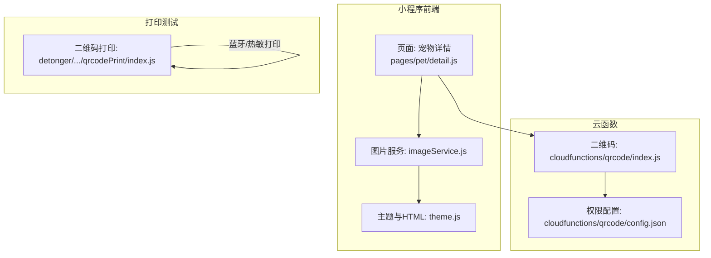
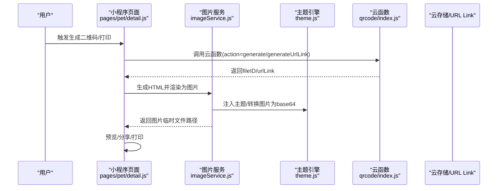
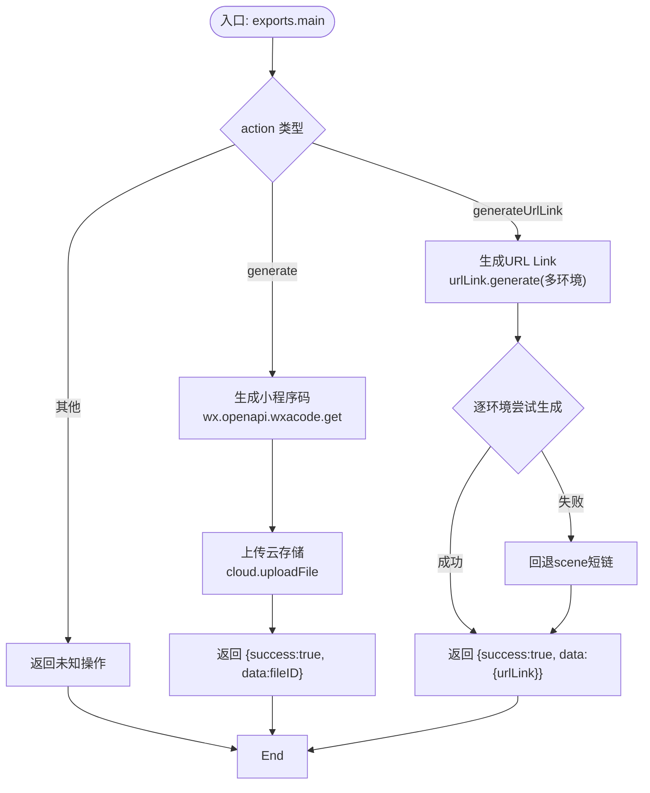
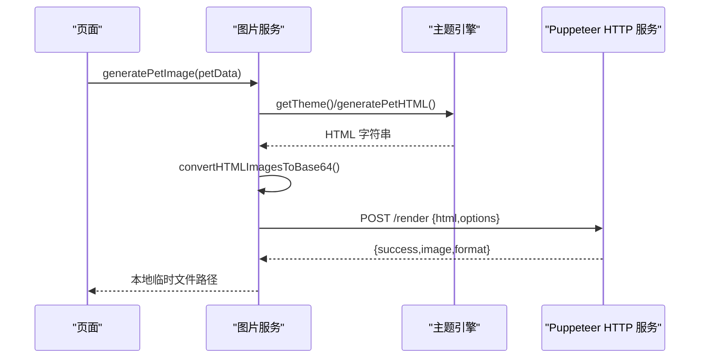
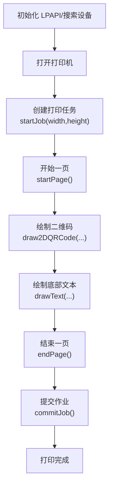
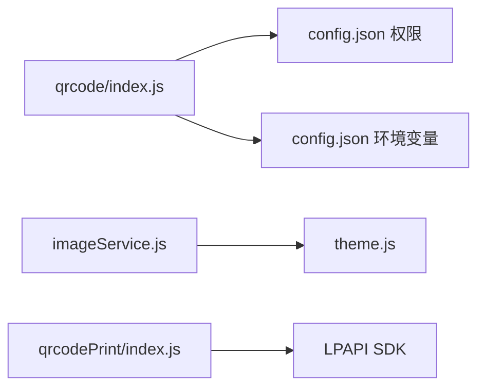

# 二维码生成器

<cite>
**本文档引用的文件**
- [cloudfunctions/qrcode/index.js](file://cloudfunctions/qrcode/index.js)
- [cloudfunctions/qrcode/config.json](file://cloudfunctions/qrcode/config.json)
- [miniprogram/utils/imageService.js](file://miniprogram/utils/imageService.js)
- [miniprogram/utils/theme.js](file://miniprogram/utils/theme.js)
- [detonger/test/lpapi-ble-test/pages/qrcodePrint/index.js](file://detonger/test/lpapi-ble-test/pages/qrcodePrint/index.js)
- [detonger/test/lpapi-ble-test/pages/qrcodePrint/index.json](file://detonger/test/lpapi-ble-test/pages/qrcodePrint/index.json)
- [detonger/test/lpapi-ble-test/pages/qrcodePrint/index.wxml](file://detonger/test/lpapi-ble-test/pages/qrcodePrint/index.wxml)
- [detonger/test/lpapi-ble-test/pages/qrcodePrint/index.wxss](file://detonger/test/lpapi-ble-test/pages/qrcodePrint/index.wxss)
- [miniprogram/pages/pet/detail.js](file://miniprogram/pages/pet/detail.js)
</cite>

## 目录
1. [引言](#引言)
2. [项目结构](#项目结构)
3. [核心组件](#核心组件)
4. [架构总览](#架构总览)
5. [详细组件分析](#详细组件分析)
6. [依赖分析](#依赖分析)
7. [性能考虑](#性能考虑)
8. [故障排查指南](#故障排查指南)
9. [结论](#结论)
10. [附录](#附录)

## 引言
本文件面向“二维码生成器”的实现与使用，覆盖以下方面：
- 二维码生成的实现原理与流程
- 参数配置与输出格式
- 内容编码规则、尺寸规格与样式定制
- 在宠物档案打印、标签制作等场景的应用
- 二维码生成 API 的使用方法、错误处理与性能优化
- 扫描兼容性与质量保证措施

## 项目结构
该项目围绕“微信云开发 + 小程序前端 + 本地打印 SDK”构建二维码能力：
- 云函数模块：负责生成小程序码与 URL Link，并上传至云存储
- 小程序前端：负责调用云函数、渲染 HTML 为图片、以及打印标签
- 打印测试页：演示蓝牙热敏打印机绘制二维码标签

**图表来源**
- [miniprogram/pages/pet/detail.js:1-800](file://miniprogram/pages/pet/detail.js#L1-L800)
- [miniprogram/utils/imageService.js:1-202](file://miniprogram/utils/imageService.js#L1-L202)
- [miniprogram/utils/theme.js:1-800](file://miniprogram/utils/theme.js#L1-L800)
- [cloudfunctions/qrcode/index.js:1-117](file://cloudfunctions/qrcode/index.js#L1-L117)
- [cloudfunctions/qrcode/config.json:1-12](file://cloudfunctions/qrcode/config.json#L1-L12)
- [detonger/test/lpapi-ble-test/pages/qrcodePrint/index.js:1-377](file://detonger/test/lpapi-ble-test/pages/qrcodePrint/index.js#L1-L377)

**章节来源**
- [cloudfunctions/qrcode/index.js:1-117](file://cloudfunctions/qrcode/index.js#L1-L117)
- [cloudfunctions/qrcode/config.json:1-12](file://cloudfunctions/qrcode/config.json#L1-L12)
- [miniprogram/utils/imageService.js:1-202](file://miniprogram/utils/imageService.js#L1-L202)
- [miniprogram/utils/theme.js:1-800](file://miniprogram/utils/theme.js#L1-L800)
- [detonger/test/lpapi-ble-test/pages/qrcodePrint/index.js:1-377](file://detonger/test/lpapi-ble-test/pages/qrcodePrint/index.js#L1-L377)

## 核心组件
- 云函数二维码服务
  - 功能：生成小程序码（wxacode.get）与 URL Link（urlLink.generate），支持多环境回退与错误上报
  - 输出：云存储 fileID 或 urlLink 文本
- 小程序图片服务
  - 功能：将 HTML 渲染为图片（Puppeteer HTTP 服务），支持主题注入与图片转 base64
  - 输出：本地临时文件路径（可用于分享或打印）
- 打印测试页
  - 功能：演示蓝牙热敏打印机绘制 QRCode、DataMatrix、PDF417 等二维条码
  - 输出：预览图片或直接打印

**章节来源**
- [cloudfunctions/qrcode/index.js:7-117](file://cloudfunctions/qrcode/index.js#L7-L117)
- [miniprogram/utils/imageService.js:59-202](file://miniprogram/utils/imageService.js#L59-L202)
- [detonger/test/lpapi-ble-test/pages/qrcodePrint/index.js:297-377](file://detonger/test/lpapi-ble-test/pages/qrcodePrint/index.js#L297-L377)

## 架构总览
二维码生成与打印的整体流程如下：

**图表来源**
- [miniprogram/pages/pet/detail.js:158-216](file://miniprogram/pages/pet/detail.js#L158-L216)
- [miniprogram/utils/imageService.js:59-143](file://miniprogram/utils/imageService.js#L59-L143)
- [miniprogram/utils/theme.js:174-401](file://miniprogram/utils/theme.js#L174-L401)
- [cloudfunctions/qrcode/index.js:7-22](file://cloudfunctions/qrcode/index.js#L7-L22)

## 详细组件分析

### 云函数二维码服务
- 功能点
  - 生成小程序码：使用 wx.openapi.wxacode.get，设置页面路径、二维码尺寸与透明背景
  - 上传云存储：将 buffer 写入云存储，返回 fileID
  - 生成 URL Link：优先使用 urlLink.generate，按环境版本循环尝试，失败时回退为带 scene 的短链
  - 错误处理：捕获异常，记录 errCode 与 errMsg，返回结构化错误
- 关键参数
  - 小程序码：path（含 scene 查询）、width（像素）、isHyaline（透明背景）
  - URL Link：path、query（petId/recordId/from=scan）、expire_type、env_version
- 输出格式
  - 成功：{ success: true, data: fileID 或 { urlLink } }
  - 失败：{ success: false, errCode, message, detail? }

**图表来源**
- [cloudfunctions/qrcode/index.js:7-117](file://cloudfunctions/qrcode/index.js#L7-L117)

**章节来源**
- [cloudfunctions/qrcode/index.js:24-61](file://cloudfunctions/qrcode/index.js#L24-L61)
- [cloudfunctions/qrcode/index.js:63-117](file://cloudfunctions/qrcode/index.js#L63-L117)
- [cloudfunctions/qrcode/config.json:1-12](file://cloudfunctions/qrcode/config.json#L1-L12)

### 小程序图片服务与主题引擎
- 图片服务
  - 通过 HTTP 请求调用外部 Puppeteer 服务，将 HTML 渲染为图片
  - 支持自定义宽度、缩放倍率、格式（png/jpeg）、质量
  - 自动将 HTML 中的图片 URL 转为 base64，确保渲染可用
  - 将返回的 base64 图片保存为本地临时文件，便于后续分享/打印
- 主题引擎
  - 提供主题配置与 HTML 生成模板，用于宠物档案预览页
  - 生成包含照片、标签、统计、谱系、事件记录等内容的完整 HTML

**图表来源**
- [miniprogram/utils/imageService.js:87-143](file://miniprogram/utils/imageService.js#L87-L143)
- [miniprogram/utils/theme.js:174-401](file://miniprogram/utils/theme.js#L174-L401)

**章节来源**
- [miniprogram/utils/imageService.js:59-143](file://miniprogram/utils/imageService.js#L59-L143)
- [miniprogram/utils/theme.js:174-401](file://miniprogram/utils/theme.js#L174-L401)

### 打印测试页（蓝牙热敏打印）
- 功能概述
  - 演示如何使用 LPAPI SDK 绘制 QRCode、DataMatrix、PDF417
  - 支持标签尺寸、打印浓度、速度、出纸方向等参数配置
  - 生成预览图片并可直接发送到蓝牙热敏打印机
- 关键流程
  - 初始化 LPAPI、搜索蓝牙设备、打开打印机
  - 绘制标签页：绘制二维码、底部文本、结束页
  - 提交作业并打印

**图表来源**
- [detonger/test/lpapi-ble-test/pages/qrcodePrint/index.js:297-377](file://detonger/test/lpapi-ble-test/pages/qrcodePrint/index.js#L297-L377)

**章节来源**
- [detonger/test/lpapi-ble-test/pages/qrcodePrint/index.js:123-377](file://detonger/test/lpapi-ble-test/pages/qrcodePrint/index.js#L123-L377)
- [detonger/test/lpapi-ble-test/pages/qrcodePrint/index.json:1-4](file://detonger/test/lpapi-ble-test/pages/qrcodePrint/index.json#L1-L4)
- [detonger/test/lpapi-ble-test/pages/qrcodePrint/index.wxml:1-46](file://detonger/test/lpapi-ble-test/pages/qrcodePrint/index.wxml#L1-L46)
- [detonger/test/lpapi-ble-test/pages/qrcodePrint/index.wxss:1-54](file://detonger/test/lpapi-ble-test/pages/qrcodePrint/index.wxss#L1-L54)

## 依赖分析
- 云函数依赖
  - 权限：wx.openapi.wxacode.get、urlLink.generate
  - 环境变量：wxcloudEnvId
- 小程序依赖
  - 图片服务：HTTP 请求、文件系统、base64 转换
  - 主题引擎：HTML 模板、图片 URL 转 base64
- 打印测试页依赖
  - LPAPI SDK：蓝牙发现、打开打印机、绘制二维条码

**图表来源**
- [cloudfunctions/qrcode/config.json:1-12](file://cloudfunctions/qrcode/config.json#L1-L12)
- [cloudfunctions/qrcode/index.js:1-117](file://cloudfunctions/qrcode/index.js#L1-L117)
- [miniprogram/utils/imageService.js:16-202](file://miniprogram/utils/imageService.js#L16-L202)
- [miniprogram/utils/theme.js:1-800](file://miniprogram/utils/theme.js#L1-L800)
- [detonger/test/lpapi-ble-test/pages/qrcodePrint/index.js:1-377](file://detonger/test/lpapi-ble-test/pages/qrcodePrint/index.js#L1-L377)

**章节来源**
- [cloudfunctions/qrcode/config.json:1-12](file://cloudfunctions/qrcode/config.json#L1-L12)
- [cloudfunctions/qrcode/index.js:1-117](file://cloudfunctions/qrcode/index.js#L1-L117)
- [miniprogram/utils/imageService.js:16-202](file://miniprogram/utils/imageService.js#L16-L202)
- [miniprogram/utils/theme.js:1-800](file://miniprogram/utils/theme.js#L1-L800)
- [detonger/test/lpapi-ble-test/pages/qrcodePrint/index.js:1-377](file://detonger/test/lpapi-ble-test/pages/qrcodePrint/index.js#L1-L377)

## 性能考虑
- 云函数侧
  - 小程序码尺寸固定为 430 像素，建议根据打印介质调整，避免过度放大导致渲染与下载耗时增加
  - URL Link 生成采用多环境回退策略，若频繁失败，建议检查域名与环境配置
- 小程序侧
  - HTML 转 base64 并渲染为图片可能占用较多内存，建议在低配设备上降低 deviceScaleFactor 或 width
  - 图片服务请求超时可配置，建议结合业务场景设置合理阈值
- 打印侧
  - 标签尺寸与打印浓度影响打印速度与能耗，建议在保证可读性的前提下适当降低浓度与速度

[本节为通用指导，无需列出具体文件来源]

## 故障排查指南
- 云函数错误
  - 症状：生成失败，返回 errCode 与 errMsg
  - 排查：检查权限配置、环境变量、网络连通性；关注多环境 URL Link 生成失败日志
- 图片服务错误
  - 症状：渲染失败或保存失败
  - 排查：确认 HTTP 服务可达、HTML 中图片 URL 已正确转 base64、文件系统写入权限
- 打印机问题
  - 症状：蓝牙连接失败、打印无响应
  - 排查：确认蓝牙适配器启用、设备可被发现、打印浓度与速度设置合理

**章节来源**
- [cloudfunctions/qrcode/index.js:49-60](file://cloudfunctions/qrcode/index.js#L49-L60)
- [cloudfunctions/qrcode/index.js:109-116](file://cloudfunctions/qrcode/index.js#L109-L116)
- [miniprogram/utils/imageService.js:133-142](file://miniprogram/utils/imageService.js#L133-L142)
- [detonger/test/lpapi-ble-test/pages/qrcodePrint/index.js:175-210](file://detonger/test/lpapi-ble-test/pages/qrcodePrint/index.js#L175-L210)

## 结论
本项目提供了从云端生成二维码、到小程序端渲染与打印的完整链路。通过云函数与小程序图片服务的配合，既能满足线上分享需求，也能支撑线下标签打印场景。建议在生产环境中持续监控云函数与图片服务的稳定性，并针对不同设备与打印条件优化参数。

[本节为总结性内容，无需列出具体文件来源]

## 附录

### API 使用方法与参数说明
- 云函数调用
  - 参数
    - action: "generate" | "generateUrlLink"
    - data: 生成小程序码时包含 { scene?, page? }；生成 URL Link 时包含 { petId, recordId? }
  - 返回
    - 生成小程序码：{ success: true, data: fileID }
    - 生成 URL Link：{ success: true, data: { urlLink } }
    - 失败：{ success: false, errCode, message, detail? }
- 小程序图片服务
  - 生成宠物预览图：generatePetImage(petData)
  - 通用 HTML 渲染：generateImageFromHTML(html, options)
    - options: { width, deviceScaleFactor, format, quality, loadingText }

**章节来源**
- [cloudfunctions/qrcode/index.js:7-22](file://cloudfunctions/qrcode/index.js#L7-L22)
- [cloudfunctions/qrcode/index.js:24-61](file://cloudfunctions/qrcode/index.js#L24-L61)
- [cloudfunctions/qrcode/index.js:63-117](file://cloudfunctions/qrcode/index.js#L63-L117)
- [miniprogram/utils/imageService.js:59-92](file://miniprogram/utils/imageService.js#L59-L92)

### 内容编码规则与尺寸规格
- 内容编码
  - 小程序码：path + 场景参数 scene（例如 ?scene=...）
  - URL Link：query 包含 petId、recordId、from=scan
- 尺寸规格
  - 小程序码：固定 width=430 像素
  - 打印标签：示例标签尺寸为 40mm x 30mm，二维码区域高度为 labelHeight - margin*2 - textHeight

**章节来源**
- [cloudfunctions/qrcode/index.js:32-36](file://cloudfunctions/qrcode/index.js#L32-L36)
- [detonger/test/lpapi-ble-test/pages/qrcodePrint/index.js:297-306](file://detonger/test/lpapi-ble-test/pages/qrcodePrint/index.js#L297-L306)

### 扫描兼容性与质量保证
- 兼容性
  - URL Link 生成支持多环境版本回退，提升跨环境稳定性
  - 小程序码生成使用 get 接口，开发阶段未发布亦可生成
- 质量保证
  - 打印前生成预览图片，确认可读性后再打印
  - 建议在不同光照与距离下测试扫描成功率，必要时提高打印浓度与分辨率

**章节来源**
- [cloudfunctions/qrcode/index.js:78-93](file://cloudfunctions/qrcode/index.js#L78-L93)
- [cloudfunctions/qrcode/index.js:31-36](file://cloudfunctions/qrcode/index.js#L31-L36)
- [detonger/test/lpapi-ble-test/pages/qrcodePrint/index.js:252-277](file://detonger/test/lpapi-ble-test/pages/qrcodePrint/index.js#L252-L277)