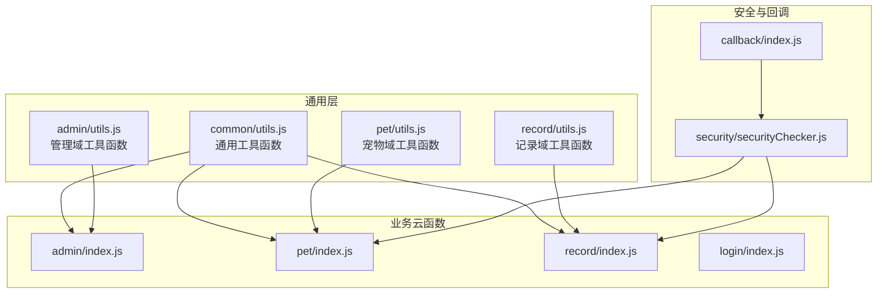
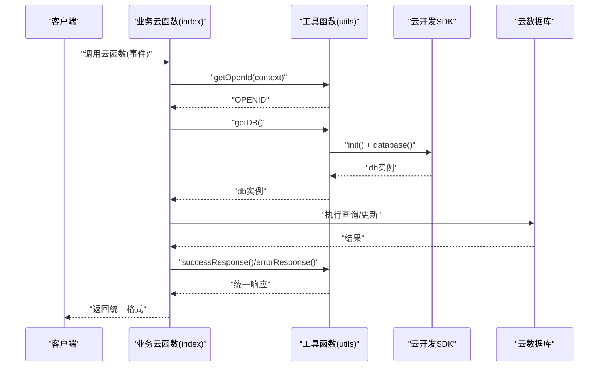
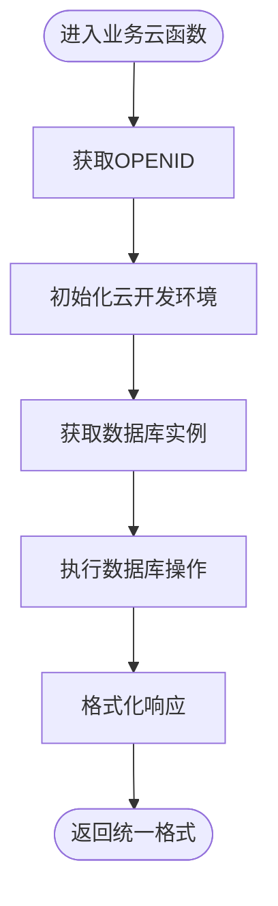
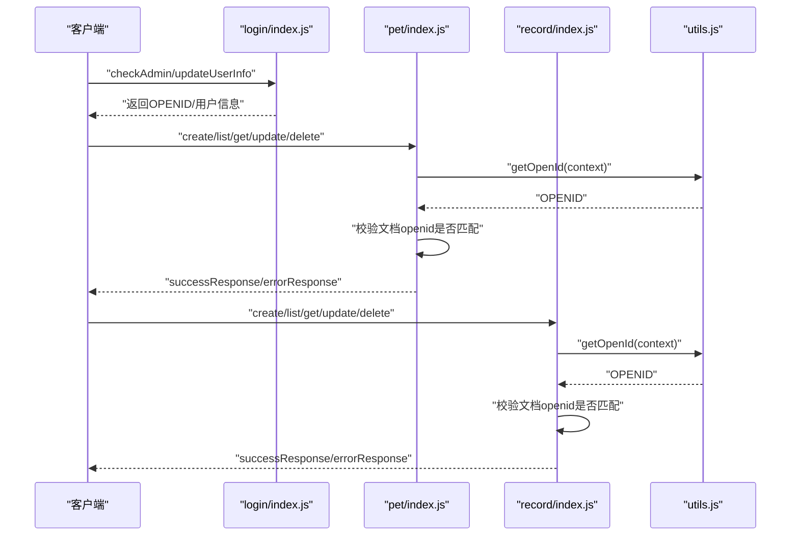
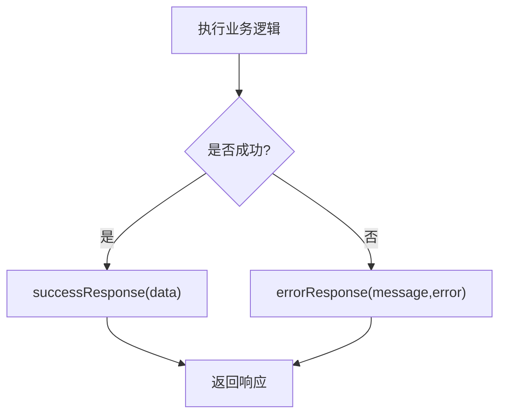
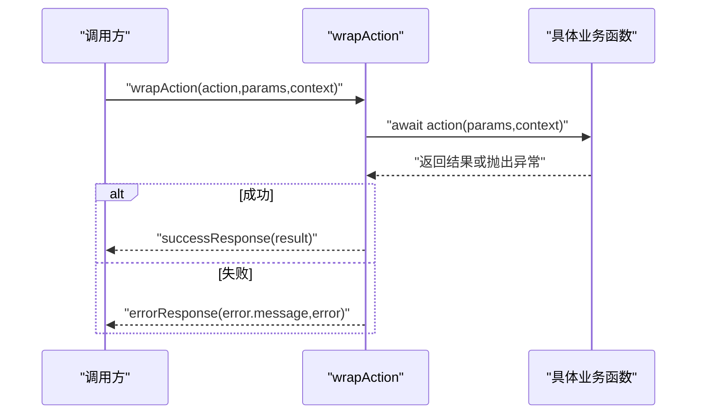
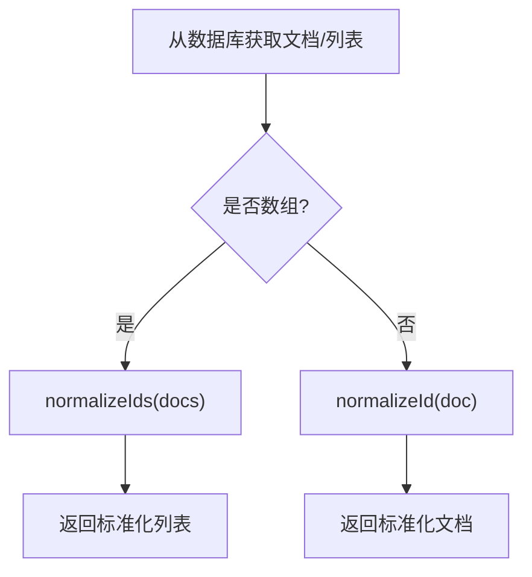
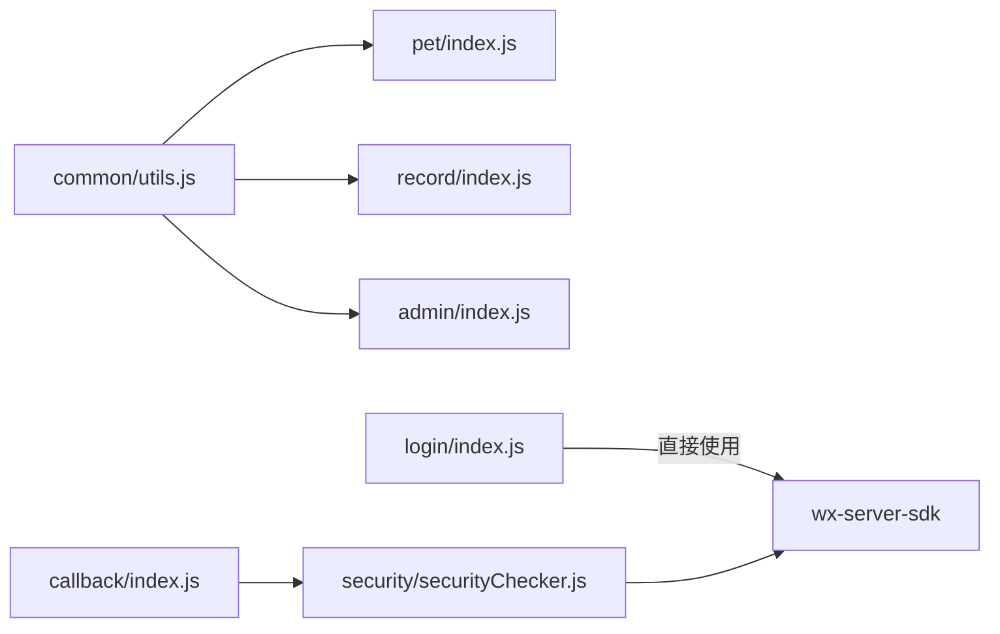

# 云开发工具函数

<cite>
**本文档引用的文件**
- [cloudfunctions/common/utils.js](file://cloudfunctions/common/utils.js)
- [cloudfunctions/admin/utils.js](file://cloudfunctions/admin/utils.js)
- [cloudfunctions/pet/utils.js](file://cloudfunctions/pet/utils.js)
- [cloudfunctions/record/utils.js](file://cloudfunctions/record/utils.js)
- [cloudfunctions/admin/index.js](file://cloudfunctions/admin/index.js)
- [cloudfunctions/pet/index.js](file://cloudfunctions/pet/index.js)
- [cloudfunctions/record/index.js](file://cloudfunctions/record/index.js)
- [cloudfunctions/login/index.js](file://cloudfunctions/login/index.js)
- [cloudfunctions/security/securityChecker.js](file://cloudfunctions/security/securityChecker.js)
- [cloudfunctions/callback/index.js](file://cloudfunctions/callback/index.js)
</cite>

## 目录
1. [引言](#引言)
2. [项目结构](#项目结构)
3. [核心组件](#核心组件)
4. [架构概览](#架构概览)
5. [详细组件分析](#详细组件分析)
6. [依赖关系分析](#依赖关系分析)
7. [性能考虑](#性能考虑)
8. [故障排查指南](#故障排查指南)
9. [结论](#结论)
10. [附录](#附录)

## 引言
本文件面向云开发（微信云开发）场景，系统性梳理并说明工具函数库的设计与使用，重点覆盖以下能力：
- 初始化云开发环境：initCloud()
- 获取数据库连接：getDB()
- 获取用户标识：getOpenId()
- 统一响应格式：successResponse()、errorResponse()
- 异步操作包装器：wrapAction()
- 数据标准化处理：normalizeId()、normalizeIds()

文档将结合各云函数的实际使用案例，给出最佳实践、性能优化建议与常见问题排查方法。

## 项目结构
云开发工具函数以“按功能域拆分”的方式组织：
- 通用工具：cloudfunctions/common/utils.js
- 各业务域工具：admin/utils.js、pet/utils.js、record/utils.js
- 业务云函数：对应目录下的 index.js 文件
- 安全与回调：security/securityChecker.js、callback/index.js

**图表来源**
- [cloudfunctions/common/utils.js:1-69](file://cloudfunctions/common/utils.js#L1-L69)
- [cloudfunctions/admin/utils.js:1-69](file://cloudfunctions/admin/utils.js#L1-L69)
- [cloudfunctions/pet/utils.js:1-69](file://cloudfunctions/pet/utils.js#L1-L69)
- [cloudfunctions/record/utils.js:1-69](file://cloudfunctions/record/utils.js#L1-L69)
- [cloudfunctions/admin/index.js:1-723](file://cloudfunctions/admin/index.js#L1-L723)
- [cloudfunctions/pet/index.js:1-723](file://cloudfunctions/pet/index.js#L1-L723)
- [cloudfunctions/record/index.js:1-191](file://cloudfunctions/record/index.js#L1-L191)
- [cloudfunctions/login/index.js:1-148](file://cloudfunctions/login/index.js#L1-L148)
- [cloudfunctions/security/securityChecker.js:1-206](file://cloudfunctions/security/securityChecker.js#L1-L206)
- [cloudfunctions/callback/index.js:1-223](file://cloudfunctions/callback/index.js#L1-L223)

**章节来源**
- [cloudfunctions/common/utils.js:1-69](file://cloudfunctions/common/utils.js#L1-L69)
- [cloudfunctions/admin/utils.js:1-69](file://cloudfunctions/admin/utils.js#L1-L69)
- [cloudfunctions/pet/utils.js:1-69](file://cloudfunctions/pet/utils.js#L1-L69)
- [cloudfunctions/record/utils.js:1-69](file://cloudfunctions/record/utils.js#L1-L69)

## 核心组件
本节对工具函数进行逐项解析，并结合使用场景说明。

- initCloud()
  - 功能：初始化云开发 SDK，自动使用动态当前环境变量，确保在不同环境（开发/测试/生产）下自动适配。
  - 实现要点：调用 wx-server-sdk.init() 并返回 cloud 实例，便于后续复用。
  - 使用建议：在工具模块中集中初始化，避免重复初始化带来的资源浪费。

- getDB()
  - 功能：获取数据库连接实例，内部通过 initCloud() 确保环境已初始化。
  - 实现要点：返回 cloud.database()，供业务云函数直接使用。
  - 使用建议：在业务云函数入口处一次性获取 db 实例，避免重复调用。

- getOpenId(context)
  - 功能：从上下文获取当前用户的 OPENID，用于权限控制与数据隔离。
  - 实现要点：调用 cloud.getWXContext() 并提取 OPENID。
  - 使用建议：在每个业务操作前调用，确保用户身份正确。

- successResponse(data, message)
  - 功能：统一的成功响应格式，包含 success:true、data、message 字段。
  - 设计要点：约定式输出，便于前端统一处理。
  - 使用建议：所有成功路径均应返回该格式，保持一致性。

- errorResponse(message, error)
  - 功能：统一的错误响应格式，包含 success:false、message、可选 error.message。
  - 设计要点：统一错误输出，便于前端提示与日志追踪。
  - 使用建议：捕获异常或参数校验失败时使用，避免抛出原始异常给前端。

- wrapAction(action, params, context)
  - 功能：异步操作包装器，自动执行 action(params, context)，并在成功/失败时分别返回 successResponse 或 errorResponse。
  - 设计模式：装饰器风格的包装器，简化 try/catch 与返回格式化逻辑。
  - 使用建议：适用于 CRUD 类操作，减少样板代码。

- normalizeId(doc)
  - 功能：将数据库文档的 _id 字段标准化为 id 字段，便于前端统一处理。
  - 使用建议：在返回列表或单个文档前调用，保证字段一致性。

- normalizeIds(docs)
  - 功能：批量标准化文档数组，内部委托 normalizeId。
  - 使用建议：列表查询后统一调用，提升前端兼容性。

**章节来源**
- [cloudfunctions/common/utils.js:3-57](file://cloudfunctions/common/utils.js#L3-L57)
- [cloudfunctions/admin/utils.js:3-57](file://cloudfunctions/admin/utils.js#L3-L57)
- [cloudfunctions/pet/utils.js:3-57](file://cloudfunctions/pet/utils.js#L3-L57)
- [cloudfunctions/record/utils.js:3-57](file://cloudfunctions/record/utils.js#L3-L57)

## 架构概览
工具函数在各业务云函数中的典型调用链如下：

**图表来源**
- [cloudfunctions/pet/index.js:1-82](file://cloudfunctions/pet/index.js#L1-L82)
- [cloudfunctions/record/index.js:1-35](file://cloudfunctions/record/index.js#L1-L35)
- [cloudfunctions/common/utils.js:10-35](file://cloudfunctions/common/utils.js#L10-L35)

**章节来源**
- [cloudfunctions/pet/index.js:45-82](file://cloudfunctions/pet/index.js#L45-L82)
- [cloudfunctions/record/index.js:10-35](file://cloudfunctions/record/index.js#L10-L35)
- [cloudfunctions/common/utils.js:3-35](file://cloudfunctions/common/utils.js#L3-L35)

## 详细组件分析

### initCloud() 与 getDB() 初始化流程
- 初始化策略
  - 通过 initCloud() 设置环境变量，确保跨环境一致。
  - getDB() 在首次调用时完成初始化并缓存 db 实例，避免重复初始化。
- 典型调用位置
  - 业务云函数入口：如 pet/index.js、record/index.js 中直接调用 getDB() 获取 db。
  - 管理端云函数：admin/index.js 中直接使用 cloud.database()，也可替换为 getDB() 统一风格。

**图表来源**
- [cloudfunctions/pet/index.js:4-10](file://cloudfunctions/pet/index.js#L4-L10)
- [cloudfunctions/record/index.js:1-9](file://cloudfunctions/record/index.js#L1-L9)
- [cloudfunctions/common/utils.js:3-13](file://cloudfunctions/common/utils.js#L3-L13)

**章节来源**
- [cloudfunctions/pet/index.js:4-10](file://cloudfunctions/pet/index.js#L4-L10)
- [cloudfunctions/record/index.js:1-9](file://cloudfunctions/record/index.js#L1-L9)
- [cloudfunctions/common/utils.js:3-13](file://cloudfunctions/common/utils.js#L3-L13)

### getOpenId() 权限控制与数据隔离
- 作用：从上下文中提取 OPENID，用于：
  - 数据隔离：查询/更新仅限当前用户数据
  - 权限校验：防止越权访问
- 实际应用
  - 登录云函数：login/index.js 中直接使用 OPENID 完成用户信息维护
  - 业务云函数：pet/index.js、record/index.js 在增删改查前校验 openid 是否匹配

**图表来源**
- [cloudfunctions/login/index.js:38-147](file://cloudfunctions/login/index.js#L38-L147)
- [cloudfunctions/pet/index.js:182-191](file://cloudfunctions/pet/index.js#L182-L191)
- [cloudfunctions/record/index.js:113-122](file://cloudfunctions/record/index.js#L113-L122)
- [cloudfunctions/common/utils.js:15-18](file://cloudfunctions/common/utils.js#L15-L18)

**章节来源**
- [cloudfunctions/login/index.js:38-147](file://cloudfunctions/login/index.js#L38-L147)
- [cloudfunctions/pet/index.js:182-191](file://cloudfunctions/pet/index.js#L182-L191)
- [cloudfunctions/record/index.js:113-122](file://cloudfunctions/record/index.js#L113-L122)
- [cloudfunctions/common/utils.js:15-18](file://cloudfunctions/common/utils.js#L15-L18)

### 统一响应格式 successResponse() 与 errorResponse()
- 设计目标：前后端解耦，前端统一处理 success:true/false。
- 使用场景：
  - 成功路径：返回 successResponse(data/message)
  - 失败路径：返回 errorResponse(message/error)
- 业务体现：
  - admin/index.js：多处直接返回 errorResponse，或在 switch 分支中统一 catch 后返回
  - pet/index.js、record/index.js：在 try/catch 外层统一 catch，返回 errorResponse

**图表来源**
- [cloudfunctions/admin/index.js:67-70](file://cloudfunctions/admin/index.js#L67-L70)
- [cloudfunctions/pet/index.js:78-82](file://cloudfunctions/pet/index.js#L78-L82)
- [cloudfunctions/record/index.js:31-35](file://cloudfunctions/record/index.js#L31-L35)
- [cloudfunctions/common/utils.js:20-35](file://cloudfunctions/common/utils.js#L20-L35)

**章节来源**
- [cloudfunctions/admin/index.js:67-70](file://cloudfunctions/admin/index.js#L67-L70)
- [cloudfunctions/pet/index.js:78-82](file://cloudfunctions/pet/index.js#L78-L82)
- [cloudfunctions/record/index.js:31-35](file://cloudfunctions/record/index.js#L31-L35)
- [cloudfunctions/common/utils.js:20-35](file://cloudfunctions/common/utils.js#L20-L35)

### 异步操作包装器 wrapAction()
- 设计模式：将 action(params, context) 的执行封装为统一的 try/catch + 响应格式化流程。
- 适用范围：适合 CRUD 类操作，减少重复代码。
- 注意事项：
  - 若业务需要自定义错误处理或分支逻辑，可直接使用 try/catch + successResponse/errorResponse。
  - wrapAction 更适合“纯 CRUD”场景，复杂业务建议手写。

**图表来源**
- [cloudfunctions/common/utils.js:37-44](file://cloudfunctions/common/utils.js#L37-L44)
- [cloudfunctions/admin/utils.js:37-44](file://cloudfunctions/admin/utils.js#L37-L44)
- [cloudfunctions/pet/utils.js:37-44](file://cloudfunctions/pet/utils.js#L37-L44)
- [cloudfunctions/record/utils.js:37-44](file://cloudfunctions/record/utils.js#L37-L44)

**章节来源**
- [cloudfunctions/common/utils.js:37-44](file://cloudfunctions/common/utils.js#L37-L44)
- [cloudfunctions/admin/utils.js:37-44](file://cloudfunctions/admin/utils.js#L37-L44)
- [cloudfunctions/pet/utils.js:37-44](file://cloudfunctions/pet/utils.js#L37-L44)
- [cloudfunctions/record/utils.js:37-44](file://cloudfunctions/record/utils.js#L37-L44)

### 数据标准化 normalizeId() 与 normalizeIds()
- 目标：将数据库文档的 _id 统一为 id，提升前端兼容性。
- 使用场景：
  - normalizeId：单个文档标准化
  - normalizeIds：列表标准化
- 实际应用：
  - pet/index.js：getPetList、getPublicPets、getPedigree 等返回前调用 normalizeIds
  - record/index.js：getRecordList、getRecordById 等返回前调用 normalizeId/normalizeIds

**图表来源**
- [cloudfunctions/pet/index.js:172-179](file://cloudfunctions/pet/index.js#L172-L179)
- [cloudfunctions/record/index.js:104-111](file://cloudfunctions/record/index.js#L104-L111)
- [cloudfunctions/common/utils.js:46-57](file://cloudfunctions/common/utils.js#L46-L57)

**章节来源**
- [cloudfunctions/pet/index.js:172-179](file://cloudfunctions/pet/index.js#L172-L179)
- [cloudfunctions/record/index.js:104-111](file://cloudfunctions/record/index.js#L104-L111)
- [cloudfunctions/common/utils.js:46-57](file://cloudfunctions/common/utils.js#L46-L57)

### 实际使用示例与最佳实践
- 在云函数中正确使用工具函数
  - 初始化与获取数据库：参考 pet/index.js、record/index.js 的开头部分，统一使用 getDB()。
  - 获取用户标识：在每个业务操作前调用 getOpenId(context) 校验权限。
  - 统一响应：所有成功/失败路径均返回 successResponse()/errorResponse()。
  - 数据标准化：列表与单个文档返回前调用 normalizeIds()/normalizeId()。
- 最佳实践
  - 将工具函数集中在 utils.js，避免重复实现。
  - 对外暴露统一的响应格式，便于前端统一处理。
  - 对于复杂业务，建议手写 try/catch + successResponse/errorResponse，而非强制使用 wrapAction。
  - 在返回前统一做数据标准化，避免前端多次转换。
- 性能优化建议
  - 复用 db 实例，避免重复初始化。
  - 列表查询时使用分页参数，避免一次性拉取过多数据。
  - 对批量操作使用事务或批量接口，减少往返次数。
  - 对图片等资源，尽量使用云存储 fileID，避免传输大体积数据。

**章节来源**
- [cloudfunctions/pet/index.js:1-82](file://cloudfunctions/pet/index.js#L1-L82)
- [cloudfunctions/record/index.js:1-35](file://cloudfunctions/record/index.js#L1-L35)
- [cloudfunctions/common/utils.js:1-69](file://cloudfunctions/common/utils.js#L1-L69)

## 依赖关系分析
- 工具函数依赖
  - utils.js 依赖 wx-server-sdk，提供 initCloud、getDB、getOpenId、successResponse、errorResponse、wrapAction、normalizeId、normalizeIds。
- 业务云函数依赖
  - admin/index.js、pet/index.js、record/index.js、login/index.js 直接依赖 utils.js 或 wx-server-sdk。
- 安全与回调
  - security/securityChecker.js 依赖 wx-server-sdk 的安全接口，callback/index.js 依赖安全日志与业务数据联动。

**图表来源**
- [cloudfunctions/common/utils.js:1-69](file://cloudfunctions/common/utils.js#L1-L69)
- [cloudfunctions/pet/index.js:1-2](file://cloudfunctions/pet/index.js#L1-L2)
- [cloudfunctions/record/index.js:1-2](file://cloudfunctions/record/index.js#L1-L2)
- [cloudfunctions/admin/index.js:1-2](file://cloudfunctions/admin/index.js#L1-L2)
- [cloudfunctions/login/index.js:1-2](file://cloudfunctions/login/index.js#L1-L2)
- [cloudfunctions/security/securityChecker.js:1-2](file://cloudfunctions/security/securityChecker.js#L1-L2)
- [cloudfunctions/callback/index.js:1-2](file://cloudfunctions/callback/index.js#L1-L2)

**章节来源**
- [cloudfunctions/common/utils.js:1-69](file://cloudfunctions/common/utils.js#L1-L69)
- [cloudfunctions/pet/index.js:1-2](file://cloudfunctions/pet/index.js#L1-L2)
- [cloudfunctions/record/index.js:1-2](file://cloudfunctions/record/index.js#L1-L2)
- [cloudfunctions/admin/index.js:1-2](file://cloudfunctions/admin/index.js#L1-L2)
- [cloudfunctions/login/index.js:1-2](file://cloudfunctions/login/index.js#L1-L2)
- [cloudfunctions/security/securityChecker.js:1-2](file://cloudfunctions/security/securityChecker.js#L1-L2)
- [cloudfunctions/callback/index.js:1-2](file://cloudfunctions/callback/index.js#L1-L2)

## 性能考虑
- 初始化与连接
  - 使用 getDB() 获取 db 实例，避免重复初始化。
  - 在云函数入口处一次性初始化，减少重复开销。
- 查询与分页
  - 列表查询时使用分页参数，避免一次性拉取大量数据。
  - 合理使用索引与 where 条件，减少扫描范围。
- 事务与批量
  - 对需要强一致性的操作使用事务，减少多次往返。
  - 对批量更新/删除使用批量接口，降低网络开销。
- 响应与序列化
  - 统一使用 successResponse/errorResponse，减少前端解析成本。
  - 返回前统一 normalizeId/normalizeIds，避免前端重复处理。

## 故障排查指南
- 常见问题
  - OPENID 获取失败：确认云函数上下文是否正确，或检查 wx-server-sdk 版本。
  - 数据库连接异常：检查环境变量与权限配置，确认集合存在且可访问。
  - 响应格式不一致：确保所有路径均返回 successResponse()/errorResponse()。
  - 权限校验失败：确认业务逻辑中已校验 openid 是否匹配。
- 日志与调试
  - 使用 errorResponse() 输出错误信息，便于前端与运维定位。
  - 在关键节点打印日志，如初始化、查询、更新、删除等。
- 安全与审核
  - 使用 security/securityChecker.js 进行内容安全审核，必要时配合 callback/index.js 处理异步回调。

**章节来源**
- [cloudfunctions/common/utils.js:28-35](file://cloudfunctions/common/utils.js#L28-L35)
- [cloudfunctions/security/securityChecker.js:70-101](file://cloudfunctions/security/securityChecker.js#L70-L101)
- [cloudfunctions/callback/index.js:57-109](file://cloudfunctions/callback/index.js#L57-L109)

## 结论
本工具函数库通过 initCloud()、getDB()、getOpenId()、successResponse()、errorResponse()、wrapAction()、normalizeId()、normalizeIds() 提供了云开发场景下的统一基础设施。结合各业务云函数的实际使用，能够显著降低重复代码、提升响应一致性与前端兼容性，并为复杂业务提供清晰的扩展点。建议在团队内推广统一使用，持续完善错误处理与性能优化策略。

## 附录
- 快速对照表
  - 初始化：initCloud() → getDB()
  - 用户标识：getOpenId(context)
  - 成功响应：successResponse(data, message)
  - 错误响应：errorResponse(message, error)
  - 包装器：wrapAction(action, params, context)
  - 标准化：normalizeId(doc)、normalizeIds(docs)