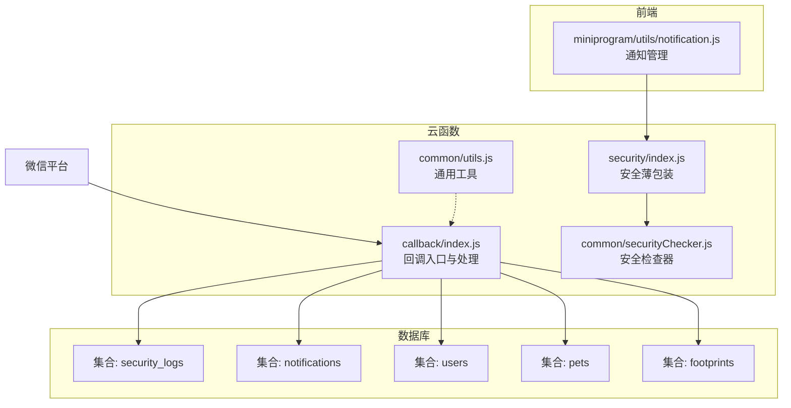
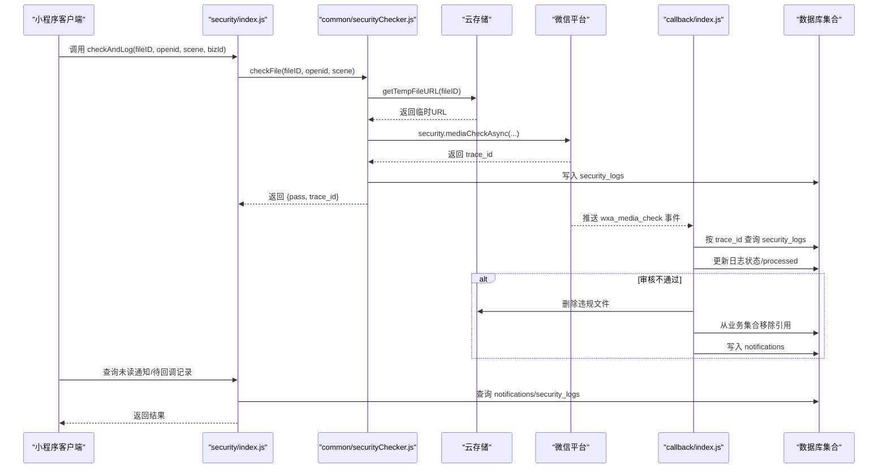
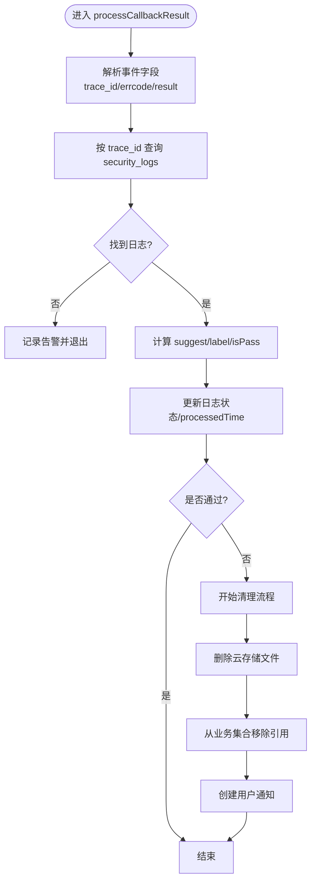
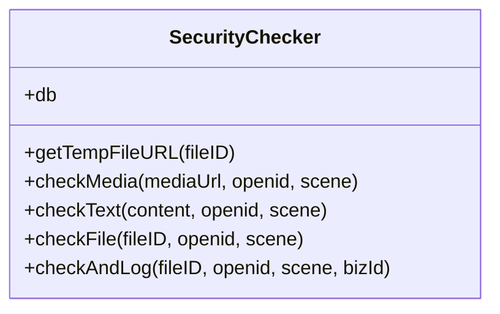
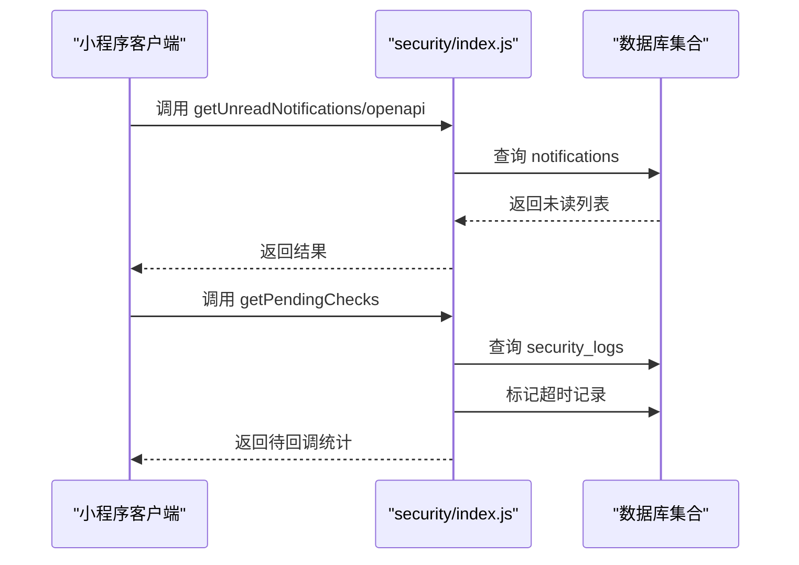
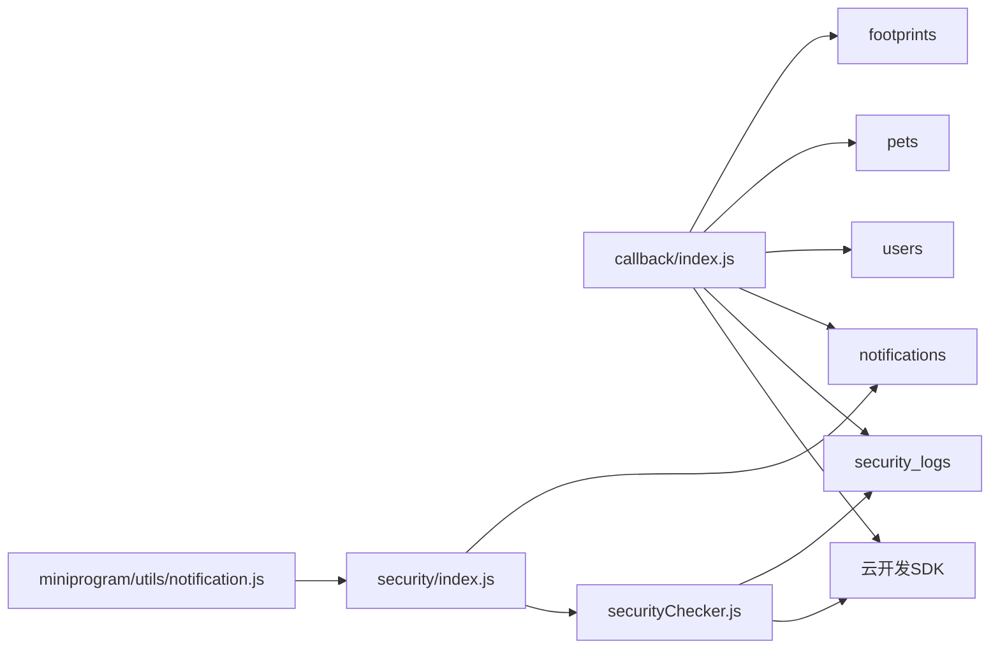

# 回调处理器

<cite>
**本文引用的文件**
- [cloudfunctions/callback/index.js](file://cloudfunctions/callback/index.js)
- [cloudfunctions/callback/config.json](file://cloudfunctions/callback/config.json)
- [cloudfunctions/callback/package.json](file://cloudfunctions/callback/package.json)
- [cloudfunctions/common/securityChecker.js](file://cloudfunctions/common/securityChecker.js)
- [cloudfunctions/common/utils.js](file://cloudfunctions/common/utils.js)
- [cloudfunctions/security/index.js](file://cloudfunctions/security/index.js)
- [cloudfunctions/security/config.json](file://cloudfunctions/security/config.json)
- [cloudfunctions/admin/index.js](file://cloudfunctions/admin/index.js)
- [cloudfunctions/pet/index.js](file://cloudfunctions/pet/index.js)
- [cloudfunctions/record/index.js](file://cloudfunctions/record/index.js)
- [miniprogram/utils/notification.js](file://miniprogram/utils/notification.js)
- [server-setup/database.sql](file://server-setup/database.sql)
</cite>

## 目录
1. [引言](#引言)
2. [项目结构](#项目结构)
3. [核心组件](#核心组件)
4. [架构总览](#架构总览)
5. [详细组件分析](#详细组件分析)
6. [依赖关系分析](#依赖关系分析)
7. [性能考量](#性能考量)
8. [故障排查指南](#故障排查指南)
9. [结论](#结论)
10. [附录](#附录)

## 引言
本文件系统性阐述“回调处理器”的设计与实现，聚焦微信异步审核结果的回调接收与处理流程。文档覆盖消息传递、状态管理、错误处理、安全性与可靠性保障，并给出使用示例、集成指南与性能优化建议。回调处理器在异步操作、第三方集成（微信内容安全）、以及跨模块协作中扮演关键角色。

## 项目结构
回调处理器位于云开发云函数目录下，核心文件包括：
- 回调入口与处理：cloudfunctions/callback
- 安全检查公共能力：cloudfunctions/common/securityChecker.js
- 安全云函数薄包装：cloudfunctions/security
- 前端通知管理：miniprogram/utils/notification.js
- 数据库结构参考：server-setup/database.sql（含云数据库集合schema）

图表来源
- [cloudfunctions/callback/index.js:1-223](file://cloudfunctions/callback/index.js#L1-L223)
- [cloudfunctions/security/index.js:1-200](file://cloudfunctions/security/index.js#L1-L200)
- [cloudfunctions/common/securityChecker.js:1-226](file://cloudfunctions/common/securityChecker.js#L1-L226)
- [cloudfunctions/common/utils.js:1-69](file://cloudfunctions/common/utils.js#L1-L69)
- [miniprogram/utils/notification.js:1-46](file://miniprogram/utils/notification.js#L1-L46)

章节来源
- [cloudfunctions/callback/index.js:1-223](file://cloudfunctions/callback/index.js#L1-L223)
- [cloudfunctions/security/index.js:1-200](file://cloudfunctions/security/index.js#L1-L200)
- [cloudfunctions/common/securityChecker.js:1-226](file://cloudfunctions/common/securityChecker.js#L1-L226)
- [cloudfunctions/common/utils.js:1-69](file://cloudfunctions/common/utils.js#L1-L69)
- [miniprogram/utils/notification.js:1-46](file://miniprogram/utils/notification.js#L1-L46)

## 核心组件
- 回调入口与处理（callback/index.js）
  - 初始化云开发环境，接收微信推送的事件对象，解析并处理审核结果，更新审核日志、清理违规资源、下发用户通知。
- 安全检查器（common/securityChecker.js）
  - 提供图片/文本安全检查、文件ID转临时URL、提交审核并写入日志等能力，封装微信云开发安全接口调用。
- 安全云函数薄包装（security/index.js）
  - 对外暴露统一的云函数入口，委派具体操作至安全检查器，提供通知查询、未处理回调查询等功能。
- 通用工具（common/utils.js）
  - 提供云开发初始化、数据库获取、OpenID提取、响应封装、动作包装等通用能力。
- 前端通知管理（miniprogram/utils/notification.js）
  - 封装云函数调用，提供未读通知查询、节流控制等前端交互能力。

章节来源
- [cloudfunctions/callback/index.js:36-109](file://cloudfunctions/callback/index.js#L36-L109)
- [cloudfunctions/common/securityChecker.js:30-226](file://cloudfunctions/common/securityChecker.js#L30-L226)
- [cloudfunctions/security/index.js:15-64](file://cloudfunctions/security/index.js#L15-L64)
- [cloudfunctions/common/utils.js:3-69](file://cloudfunctions/common/utils.js#L3-L69)
- [miniprogram/utils/notification.js:13-46](file://miniprogram/utils/notification.js#L13-L46)

## 架构总览
回调处理器采用“异步回调 + 日志驱动 + 多集合联动”的架构模式：
- 审核提交阶段：通过安全检查器提交异步审核，写入security_logs并记录trace_id。
- 回调接收阶段：微信平台将审核结果推送到callback云函数，按trace_id回溯日志。
- 结果处理阶段：根据结果更新日志状态，若不通过则清理违规资源并创建通知。
- 前端展示阶段：前端通过security云函数查询未读通知与待回调记录，提升用户体验。

图表来源
- [cloudfunctions/security/index.js:15-64](file://cloudfunctions/security/index.js#L15-L64)
- [cloudfunctions/common/securityChecker.js:159-207](file://cloudfunctions/common/securityChecker.js#L159-L207)
- [cloudfunctions/callback/index.js:57-109](file://cloudfunctions/callback/index.js#L57-L109)

## 详细组件分析

### 回调入口与处理（callback/index.js）
- 设计要点
  - 通过云开发SDK初始化运行环境，接收微信推送事件，解析trace_id、errcode、result等字段。
  - 依据trace_id回查security_logs，确定对应记录，计算建议与标签，更新processed标志与处理时间。
  - 若审核不通过，执行三步清理：删除云存储文件、从业务集合移除引用、创建用户通知。
- 关键流程
  - 日志回溯与状态更新
  - 违规清理（多集合联动）
  - 通知创建
- 错误处理
  - 对数据库更新、文件删除、业务清理等操作均进行try/catch与日志输出，确保失败可追踪。

图表来源
- [cloudfunctions/callback/index.js:57-109](file://cloudfunctions/callback/index.js#L57-L109)

章节来源
- [cloudfunctions/callback/index.js:42-109](file://cloudfunctions/callback/index.js#L42-L109)

### 安全检查器（common/securityChecker.js）
- 设计要点
  - 提供图片异步审核（mediaCheckAsync）、文本审核（msgSecCheck）、文件ID转临时URL、审核并记录日志等能力。
  - 使用单例模式，延迟初始化数据库连接，减少重复开销。
- 关键流程
  - 文件ID转临时URL
  - 调用微信安全接口
  - 写入security_logs并返回结果
- 错误处理
  - 对接口调用失败、URL转换失败等情况进行捕获与返回，便于上层统一处理。

图表来源
- [cloudfunctions/common/securityChecker.js:30-226](file://cloudfunctions/common/securityChecker.js#L30-L226)

章节来源
- [cloudfunctions/common/securityChecker.js:30-226](file://cloudfunctions/common/securityChecker.js#L30-L226)

### 安全云函数薄包装（security/index.js）
- 设计要点
  - 对外暴露统一入口，委派至安全检查器执行具体逻辑。
  - 提供通知查询、标记已读、批量已读、待回调查询等能力，支撑前端展示与引导。
- 关键流程
  - 通知查询与标记
  - 待回调记录查询（超时标记）
- 错误处理
  - 对数据库查询与更新异常进行捕获并返回统一错误信息。

图表来源
- [cloudfunctions/security/index.js:69-200](file://cloudfunctions/security/index.js#L69-L200)

章节来源
- [cloudfunctions/security/index.js:15-200](file://cloudfunctions/security/index.js#L15-L200)

### 前端通知管理（miniprogram/utils/notification.js）
- 设计要点
  - 封装云函数调用，提供未读通知查询与节流控制，避免频繁请求。
  - 通过云函数薄包装与安全检查器协同，实现通知闭环。
- 关键流程
  - 节流控制
  - 云函数调用与结果处理

章节来源
- [miniprogram/utils/notification.js:13-46](file://miniprogram/utils/notification.js#L13-L46)

## 依赖关系分析
- 回调云函数依赖
  - 云开发SDK：初始化运行环境、数据库操作、云存储删除。
  - 数据库集合：security_logs（日志）、notifications（通知）、users/pets/footprints（业务数据）。
- 安全云函数依赖
  - 安全检查器单例：封装微信安全接口调用与日志写入。
  - 数据库集合：notifications、security_logs。
- 前端依赖
  - 通过云函数调用实现通知查询与待回调记录查询。

图表来源
- [cloudfunctions/callback/index.js:36-109](file://cloudfunctions/callback/index.js#L36-L109)
- [cloudfunctions/security/index.js:15-64](file://cloudfunctions/security/index.js#L15-L64)
- [cloudfunctions/common/securityChecker.js:30-226](file://cloudfunctions/common/securityChecker.js#L30-L226)
- [miniprogram/utils/notification.js:13-46](file://miniprogram/utils/notification.js#L13-L46)

章节来源
- [cloudfunctions/callback/index.js:36-109](file://cloudfunctions/callback/index.js#L36-L109)
- [cloudfunctions/security/index.js:15-64](file://cloudfunctions/security/index.js#L15-L64)
- [cloudfunctions/common/securityChecker.js:30-226](file://cloudfunctions/common/securityChecker.js#L30-L226)
- [miniprogram/utils/notification.js:13-46](file://miniprogram/utils/notification.js#L13-L46)

## 性能考量
- 并发与批处理
  - 在业务清理阶段，对多个集合的更新采用逐条处理与异常捕获，避免单点阻塞；如需进一步优化，可在业务允许范围内合并更新并控制并发。
- 数据库查询
  - 回调处理按trace_id精确查询日志，避免全表扫描；通知与待回调查询使用索引字段（openid、status、createTime）进行过滤与排序。
- 文件访问
  - 通过临时URL访问云存储文件，避免直接暴露敏感链接；URL转换失败时及时回退并记录错误。
- 前端节流
  - 通知查询采用节流策略（如1分钟内仅查询一次），降低云函数调用频率，提升整体性能与成本控制。

## 故障排查指南
- 回调未到达或日志缺失
  - 确认微信云开发控制台的消息推送配置是否正确（事件类型、云函数名、推送模式）。
  - 检查security_logs中是否存在对应trace_id的记录，确认checkAndLog流程是否成功写入。
- 审核不通过但未清理
  - 检查回调日志状态是否更新为failed，确认清理流程是否执行（文件删除、业务集合引用移除、通知创建）。
  - 对于多场景（avatar/cover/pet/footprint），核对场景标签与bizId是否正确，避免遗漏清理范围。
- 通知未显示
  - 前端通过security云函数查询未读通知，确认OPENID一致与查询接口返回正常。
  - 检查notifications集合中是否成功写入，字段（openid、isRead）是否正确。
- 待回调记录超时
  - security云函数会将超过10分钟的pending记录标记为timeout，前端可据此提示用户重试或联系客服。
- 权限与配置
  - 回调云函数与安全云函数的权限配置需包含微信安全接口调用权限，确保接口可用。

章节来源
- [cloudfunctions/callback/index.js:42-109](file://cloudfunctions/callback/index.js#L42-L109)
- [cloudfunctions/security/index.js:151-200](file://cloudfunctions/security/index.js#L151-L200)
- [cloudfunctions/security/config.json:1-9](file://cloudfunctions/security/config.json#L1-L9)
- [cloudfunctions/callback/config.json:1-5](file://cloudfunctions/callback/config.json#L1-L5)

## 结论
回调处理器通过“日志驱动 + 多集合联动 + 前端闭环”的方式，实现了微信异步审核结果的可靠接收与处理。其设计兼顾安全性（权限控制、错误隔离）、可靠性（状态更新、超时标记、异常捕获）与可维护性（薄包装层、单例检查器）。结合前端通知与待回调查询，形成完整的用户体验闭环。

## 附录

### 回调URL配置与请求验证
- 配置步骤（在微信开发者工具或云开发控制台中操作）
  - 打开云开发控制台 → 设置 → 其他设置 → 推送模式，选择“云函数”。
  - 添加消息推送：消息类型为event，事件类型为wxa_media_check，云函数名为callback。
- 请求验证
  - 回调云函数接收微信推送事件，解析trace_id、errcode、result等字段，按trace_id回溯日志，确保来源与业务一致性。
- 重试机制与错误处理
  - 回调云函数内部对数据库更新、文件删除、业务清理等操作进行异常捕获与日志记录，失败时返回错误信息，便于定位问题。
  - 安全云函数提供待回调查询与超时标记，辅助前端引导用户处理长时间未回调的记录。

章节来源
- [cloudfunctions/callback/index.js:1-34](file://cloudfunctions/callback/index.js#L1-L34)
- [cloudfunctions/callback/index.js:42-52](file://cloudfunctions/callback/index.js#L42-L52)

### 使用示例与集成指南
- 提交审核并记录日志
  - 调用安全云函数的checkAndLog，传入fileID、openid、scene、bizId，返回结果包含trace_id与状态。
- 接收回调并处理
  - 微信平台自动推送事件至callback云函数，按trace_id回溯日志并执行清理与通知。
- 前端集成
  - 通过miniprogram/utils/notification.js封装云函数调用，查询未读通知与待回调记录，实现用户提示与引导。

章节来源
- [cloudfunctions/security/index.js:23-40](file://cloudfunctions/security/index.js#L23-L40)
- [cloudfunctions/common/securityChecker.js:179-207](file://cloudfunctions/common/securityChecker.js#L179-L207)
- [miniprogram/utils/notification.js:22-46](file://miniprogram/utils/notification.js#L22-L46)

### 安全性与可靠性保证
- 安全性
  - 云函数权限配置包含微信安全接口调用权限，防止越权访问。
  - 回调处理严格按trace_id回溯日志，避免伪造与误判。
- 可靠性
  - 日志状态机：pending → passed/failed/timeout，确保状态可追溯。
  - 失败隔离：清理流程各步骤独立捕获异常，避免连锁失败。
  - 前端节流：减少高频查询，提升稳定性与成本控制。

章节来源
- [cloudfunctions/security/config.json:1-9](file://cloudfunctions/security/config.json#L1-L9)
- [cloudfunctions/callback/index.js:78-109](file://cloudfunctions/callback/index.js#L78-L109)
- [cloudfunctions/security/index.js:151-200](file://cloudfunctions/security/index.js#L151-L200)
- [miniprogram/utils/notification.js:41-46](file://miniprogram/utils/notification.js#L41-L46)

### 性能优化技巧
- 数据库索引与查询
  - 在security_logs与notifications集合上使用常用查询字段建立索引，优化回溯与查询性能。
- 并发控制
  - 在业务清理阶段，对多集合更新进行串行或受控并发，避免数据库压力峰值。
- 前端缓存与节流
  - 前端对通知查询增加节流策略，减少不必要的云函数调用。
- 文件访问优化
  - 通过临时URL访问云存储文件，避免长期有效链接带来的安全风险与带宽浪费。