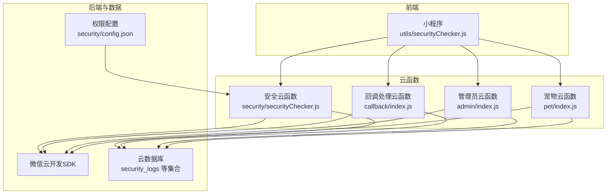
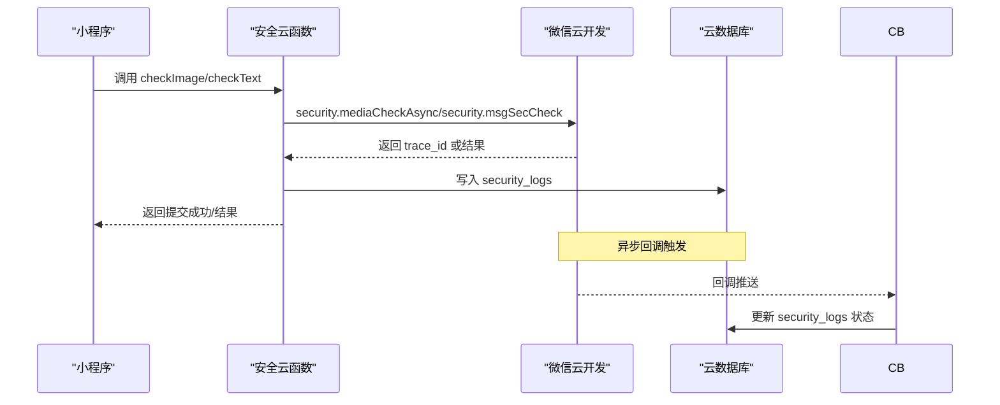
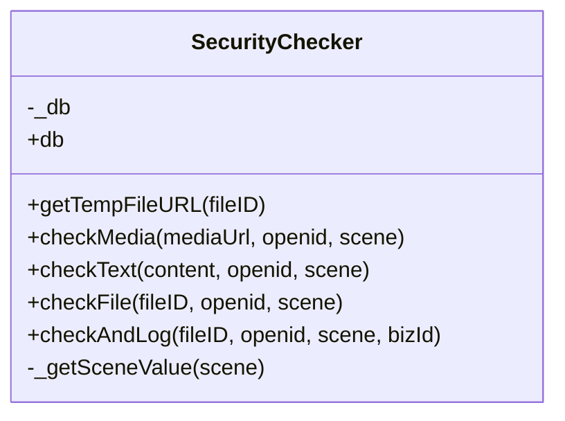
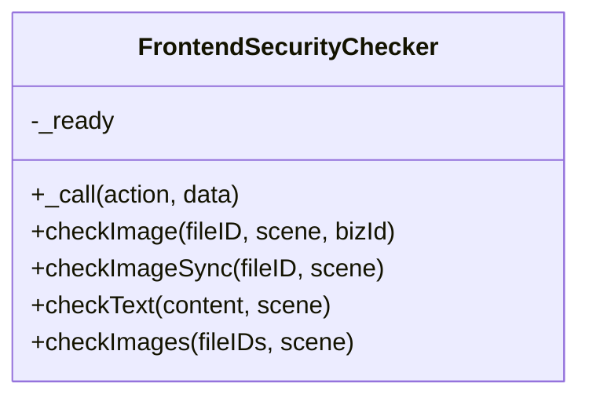
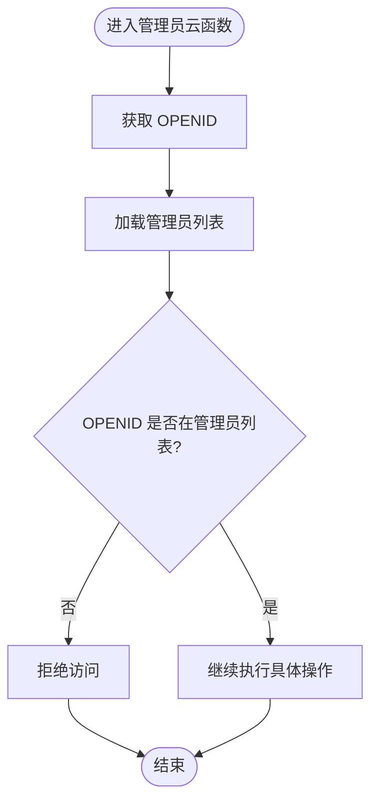
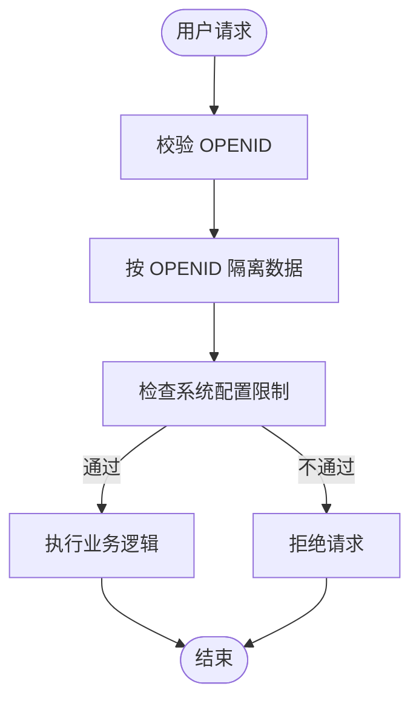
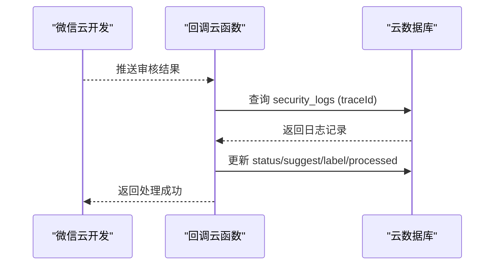
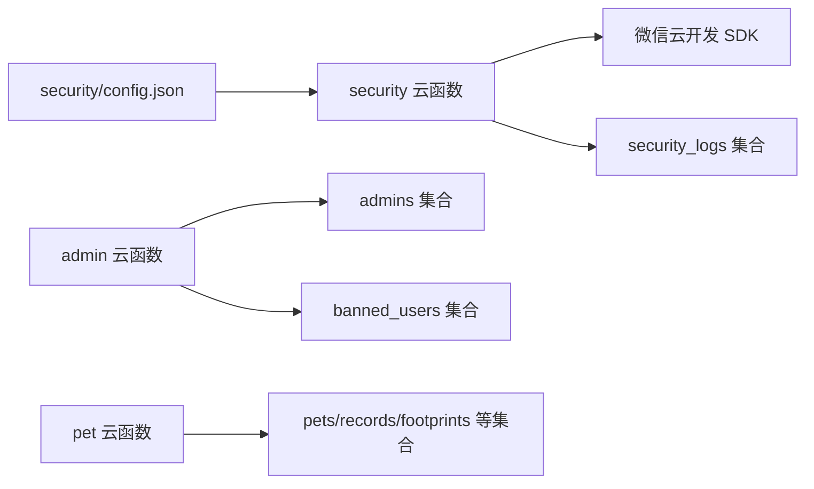

# 安全检查器

<cite>
**本文档引用的文件**
- [cloudfunctions/common/securityChecker.js](file://cloudfunctions/common/securityChecker.js)
- [cloudfunctions/security/securityChecker.js](file://cloudfunctions/security/securityChecker.js)
- [miniprogram/utils/securityChecker.js](file://miniprogram/utils/securityChecker.js)
- [cloudfunctions/admin/index.js](file://cloudfunctions/admin/index.js)
- [cloudfunctions/pet/index.js](file://cloudfunctions/pet/index.js)
- [cloudfunctions/callback/index.js](file://cloudfunctions/callback/index.js)
- [cloudfunctions/security/config.json](file://cloudfunctions/security/config.json)
- [cloudfunctions/admin/config.json](file://cloudfunctions/admin/config.json)
- [cloudfunctions/pet/config.json](file://cloudfunctions/pet/config.json)
- [server-setup/database.sql](file://server-setup/database.sql)
</cite>

## 目录
1. [引言](#引言)
2. [项目结构](#项目结构)
3. [核心组件](#核心组件)
4. [架构总览](#架构总览)
5. [详细组件分析](#详细组件分析)
6. [依赖关系分析](#依赖关系分析)
7. [性能考虑](#性能考虑)
8. [故障排查指南](#故障排查指南)
9. [结论](#结论)
10. [附录](#附录)

## 引言
本文件系统性阐述“安全检查器”的设计与实现，覆盖用户身份验证、权限验证、数据访问控制、内容安全审核、异步回调处理、日志审计与监控等关键安全机制。文档面向开发者与运维人员，既提供代码级细节，也给出可操作的集成步骤与最佳实践。

## 项目结构
安全检查器在本项目中采用三层协同架构：
- 前端封装层：小程序侧统一调用云函数的安全检查能力，提供同步/异步两种模式。
- 云函数服务层：提供安全检查的具体实现，包括图片/文本审核、文件ID到URL转换、审核日志落库等。
- 后台管理与数据层：管理员权限校验、用户数据隔离、系统配置与黑名单管理，配合数据库审计。

图表来源
- [miniprogram/utils/securityChecker.js:1-122](file://miniprogram/utils/securityChecker.js#L1-L122)
- [cloudfunctions/security/securityChecker.js:1-206](file://cloudfunctions/security/securityChecker.js#L1-L206)
- [cloudfunctions/callback/index.js:36-88](file://cloudfunctions/callback/index.js#L36-L88)
- [cloudfunctions/admin/index.js:1-533](file://cloudfunctions/admin/index.js#L1-L533)
- [cloudfunctions/pet/index.js:1-723](file://cloudfunctions/pet/index.js#L1-L723)
- [cloudfunctions/security/config.json:1-9](file://cloudfunctions/security/config.json#L1-L9)

章节来源
- [cloudfunctions/common/securityChecker.js:1-226](file://cloudfunctions/common/securityChecker.js#L1-L226)
- [cloudfunctions/security/securityChecker.js:1-206](file://cloudfunctions/security/securityChecker.js#L1-L206)
- [miniprogram/utils/securityChecker.js:1-122](file://miniprogram/utils/securityChecker.js#L1-L122)

## 核心组件
- 安全检查器（云函数）：提供图片/文本审核、文件ID转URL、审核日志落库、异步回调处理等能力。
- 前端安全检查器（小程序）：封装云函数调用，支持异步提交与同步等待结果，适配多场景。
- 管理员权限校验：集中于管理员云函数，基于数据库管理员表进行权限判定。
- 数据访问控制：通过用户openid隔离数据，结合系统配置与黑名单管理实现访问约束。
- 审核回调处理：接收微信异步审核结果，更新安全日志状态。

章节来源
- [cloudfunctions/security/securityChecker.js:30-191](file://cloudfunctions/security/securityChecker.js#L30-L191)
- [miniprogram/utils/securityChecker.js:13-107](file://miniprogram/utils/securityChecker.js#L13-L107)
- [cloudfunctions/admin/index.js:11-38](file://cloudfunctions/admin/index.js#L11-L38)
- [cloudfunctions/callback/index.js:57-88](file://cloudfunctions/callback/index.js#L57-L88)

## 架构总览
安全检查器遵循“前端发起请求 -> 云函数执行安全检查 -> 异步回调更新状态 -> 数据库审计”的闭环流程。权限控制贯穿管理员与普通用户的数据访问边界。

图表来源
- [miniprogram/utils/securityChecker.js:22-41](file://miniprogram/utils/securityChecker.js#L22-L41)
- [cloudfunctions/security/securityChecker.js:70-101](file://cloudfunctions/security/securityChecker.js#L70-L101)
- [cloudfunctions/callback/index.js:57-88](file://cloudfunctions/callback/index.js#L57-L88)

## 详细组件分析

### 安全检查器（云函数）
- 功能职责
  - 图片安全审核：支持传入公网URL或云存储fileID，自动转换为临时URL后调用微信审核接口。
  - 文本安全审核：直接调用微信文本审核接口，返回建议与标签。
  - 文件ID转URL：将云存储fileID转换为临时HTTP URL，便于审核。
  - 审核日志：将每次审核的关键信息写入数据库，便于审计与追踪。
  - 异步回调：通过回调云函数更新审核结果状态。
- 关键实现要点
  - 场景映射与标签映射，确保审核场景与结果标签一致。
  - 错误处理与降级：接口调用失败时返回明确错误信息，避免阻塞前端。
  - 单例模式：保证云函数内数据库连接与工具类的一致性。
- 数据模型
  - 审核日志集合：包含fileID、scene、bizId、openid、traceId、status、reason等字段。

图表来源
- [cloudfunctions/security/securityChecker.js:30-191](file://cloudfunctions/security/securityChecker.js#L30-L191)

章节来源
- [cloudfunctions/security/securityChecker.js:30-191](file://cloudfunctions/security/securityChecker.js#L30-L191)
- [cloudfunctions/common/securityChecker.js:30-208](file://cloudfunctions/common/securityChecker.js#L30-L208)

### 前端安全检查器（小程序）
- 功能职责
  - 封装云函数调用：统一调用安全云函数，屏蔽云函数细节。
  - 异步/同步两种模式：异步用于后台提交，同步用于需要即时结果的场景。
  - 批量检查：支持对多张图片进行独立异步检查。
- 关键实现要点
  - 云函数调用封装：统一处理返回结果与错误。
  - 审核服务不可用时的降级策略：文本审核失败时默认放行，避免影响用户体验。
  - 单例导出：保证全局唯一实例。

图表来源
- [miniprogram/utils/securityChecker.js:13-107](file://miniprogram/utils/securityChecker.js#L13-L107)

章节来源
- [miniprogram/utils/securityChecker.js:13-107](file://miniprogram/utils/securityChecker.js#L13-L107)

### 管理员权限验证
- 权限来源
  - 管理员列表优先从数据库读取，兜底配置在云函数内维护。
  - 通过OPENID匹配判断是否具备管理员权限。
- 管理员操作
  - 支持统计、用户管理、宠物管理、配置管理、封禁用户等操作。
  - 在执行敏感操作前进行权限校验，失败即返回错误响应。

图表来源
- [cloudfunctions/admin/index.js:27-71](file://cloudfunctions/admin/index.js#L27-L71)

章节来源
- [cloudfunctions/admin/index.js:11-38](file://cloudfunctions/admin/index.js#L11-L38)

### 数据访问控制与用户隔离
- 用户数据隔离
  - 所有数据操作均以openid为维度进行隔离，防止越权访问。
  - 宠物、足迹、记录等模块在查询/更新/删除时严格校验openid。
- 系统配置与限制
  - 通过系统配置限制用户宠物数量、图片数量等，避免滥用。
  - 黑名单管理：封禁用户会写入黑名单表，并在相关操作中生效。

图表来源
- [cloudfunctions/pet/index.js:182-203](file://cloudfunctions/pet/index.js#L182-L203)
- [cloudfunctions/admin/index.js:196-214](file://cloudfunctions/admin/index.js#L196-L214)

章节来源
- [cloudfunctions/pet/index.js:84-138](file://cloudfunctions/pet/index.js#L84-L138)
- [cloudfunctions/pet/index.js:193-231](file://cloudfunctions/pet/index.js#L193-L231)
- [cloudfunctions/admin/index.js:196-214](file://cloudfunctions/admin/index.js#L196-L214)

### 审核回调与日志审计
- 回调处理
  - 接收微信推送的审核结果，根据trace_id查找对应日志。
  - 更新日志状态、建议、标签、处理时间等字段。
- 日志审计
  - 审核日志包含fileID、scene、bizId、openid、traceId、status、reason等，便于审计与追溯。

图表来源
- [cloudfunctions/callback/index.js:57-88](file://cloudfunctions/callback/index.js#L57-L88)

章节来源
- [cloudfunctions/callback/index.js:57-88](file://cloudfunctions/callback/index.js#L57-L88)

## 依赖关系分析
- 权限配置
  - 安全云函数需开启相应openapi权限，确保能调用微信安全审核接口。
  - 管理员云函数与宠物云函数未声明特定openapi权限，但实际权限由代码逻辑与数据库管理员表控制。
- 数据库依赖
  - 审核日志集合用于记录每次审核的元数据与状态。
  - 管理员表、黑名单表、系统配置表支撑权限与访问控制。

图表来源
- [cloudfunctions/security/config.json:1-9](file://cloudfunctions/security/config.json#L1-L9)
- [cloudfunctions/admin/config.json:1-6](file://cloudfunctions/admin/config.json#L1-L6)
- [cloudfunctions/pet/config.json:1-6](file://cloudfunctions/pet/config.json#L1-L6)

章节来源
- [cloudfunctions/security/config.json:1-9](file://cloudfunctions/security/config.json#L1-L9)
- [cloudfunctions/admin/config.json:1-6](file://cloudfunctions/admin/config.json#L1-L6)
- [cloudfunctions/pet/config.json:1-6](file://cloudfunctions/pet/config.json#L1-L6)
- [server-setup/database.sql:9-26](file://server-setup/database.sql#L9-L26)
- [server-setup/database.sql:28-42](file://server-setup/database.sql#L28-L42)
- [server-setup/database.sql:203-214](file://server-setup/database.sql#L203-L214)

## 性能考虑
- 异步审核：图片审核采用异步接口，避免阻塞云函数执行，提升吞吐。
- 临时URL转换：仅在必要时进行fileID到URL转换，减少不必要的网络请求。
- 批量检查：前端支持批量异步检查，降低请求开销。
- 日志写入：审核日志写入采用异步方式，不影响主流程。

## 故障排查指南
- 常见问题
  - 缺少媒体文件URL或无效fileID：检查输入参数与云存储fileID格式。
  - 审核接口错误：查看返回的errcode与errmsg，确认权限配置与网络连通性。
  - 审核服务异常：捕获异常并返回友好提示，前端可选择降级策略。
  - 回调未更新：检查回调云函数是否正确接收推送并更新日志状态。
- 排查步骤
  - 检查权限配置文件是否包含所需openapi权限。
  - 核对数据库中security_logs的状态与traceId是否匹配。
  - 确认管理员列表是否正确加载，OPENID是否在管理员集合中。
  - 检查系统配置项（如最大宠物数量、最大图片数）是否导致业务逻辑异常。

章节来源
- [cloudfunctions/security/securityChecker.js:70-101](file://cloudfunctions/security/securityChecker.js#L70-L101)
- [cloudfunctions/callback/index.js:57-88](file://cloudfunctions/callback/index.js#L57-L88)
- [cloudfunctions/admin/index.js:11-38](file://cloudfunctions/admin/index.js#L11-L38)

## 结论
安全检查器通过“前端封装 + 云函数审核 + 回调更新 + 数据库审计”的闭环设计，实现了内容安全审核、用户权限控制与数据访问隔离。结合管理员权限校验与系统配置，能够有效防范违规内容传播与越权访问风险。建议在生产环境中持续完善权限配置、加强日志审计与监控告警，并定期评估审核策略与阈值。

## 附录

### 安全检查器在不同云函数中的集成方式
- 安全云函数
  - 通过微信云开发SDK调用安全审核接口，支持图片与文本审核。
  - 提供checkAndLog方法，自动记录审核日志。
- 管理员云函数
  - 在执行敏感操作前进行管理员权限校验，确保只有授权用户可操作。
- 宠物云函数
  - 在创建/更新/删除宠物时，严格校验openid，防止越权操作。
- 回调云函数
  - 接收微信推送的审核结果，更新安全日志状态。

章节来源
- [cloudfunctions/security/securityChecker.js:70-191](file://cloudfunctions/security/securityChecker.js#L70-L191)
- [cloudfunctions/admin/index.js:27-71](file://cloudfunctions/admin/index.js#L27-L71)
- [cloudfunctions/pet/index.js:182-231](file://cloudfunctions/pet/index.js#L182-L231)
- [cloudfunctions/callback/index.js:57-88](file://cloudfunctions/callback/index.js#L57-L88)

### 安全策略与最佳实践
- 管理员权限验证
  - 优先从数据库加载管理员列表，失败时回退至兜底配置。
  - 在每个敏感操作前进行权限校验，失败立即终止并返回错误。
- 用户数据隔离
  - 所有数据操作均以openid为维度进行隔离，避免跨用户访问。
  - 在更新/删除操作前先查询文档，验证存在性与归属关系。
- 敏感操作保护
  - 封禁/解封用户时同步更新黑名单表，确保后续操作生效。
  - 系统配置变更需记录更新人与时间，便于审计。
- 审核与监控
  - 审核日志包含traceId、status、reason等关键字段，便于追踪。
  - 审核服务不可用时采用降级策略，保障业务可用性。
  - 定期检查回调处理是否正常，确保审核结果及时更新。

章节来源
- [cloudfunctions/admin/index.js:196-214](file://cloudfunctions/admin/index.js#L196-L214)
- [cloudfunctions/pet/index.js:182-231](file://cloudfunctions/pet/index.js#L182-L231)
- [cloudfunctions/callback/index.js:57-88](file://cloudfunctions/callback/index.js#L57-L88)
- [miniprogram/utils/securityChecker.js:82-92](file://miniprogram/utils/securityChecker.js#L82-L92)