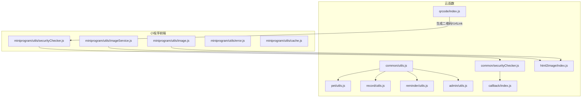
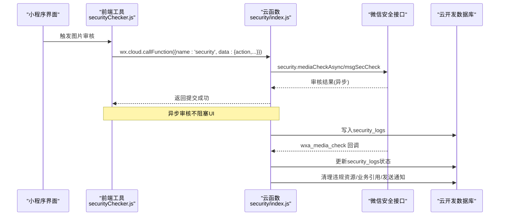
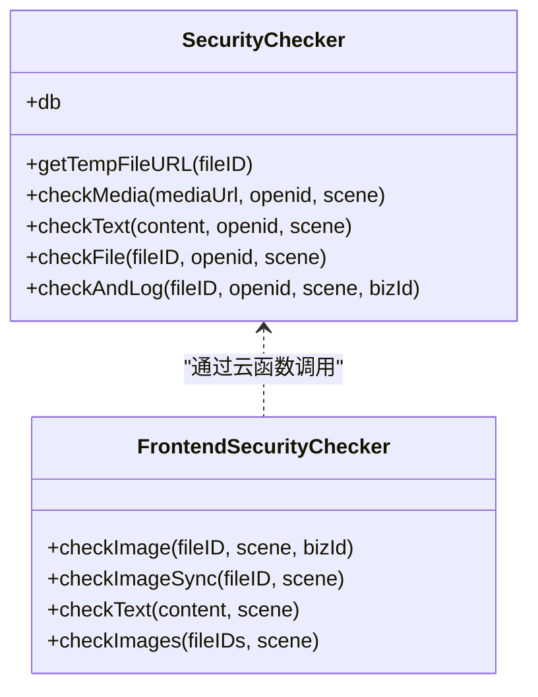
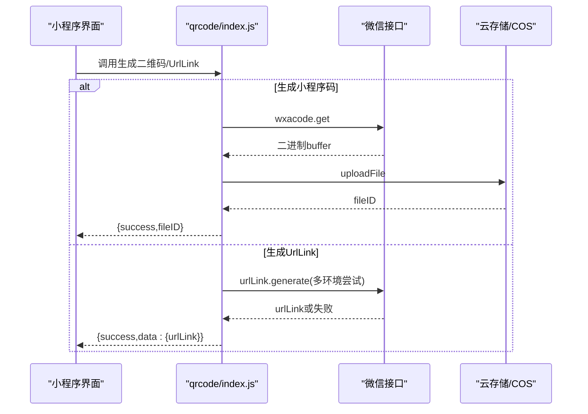
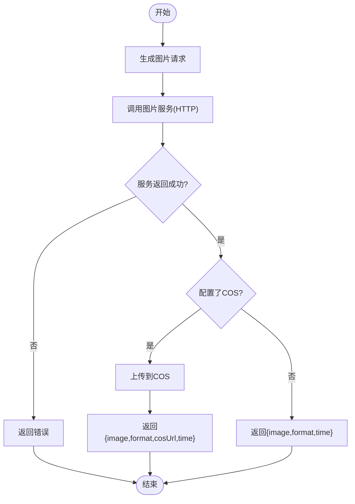
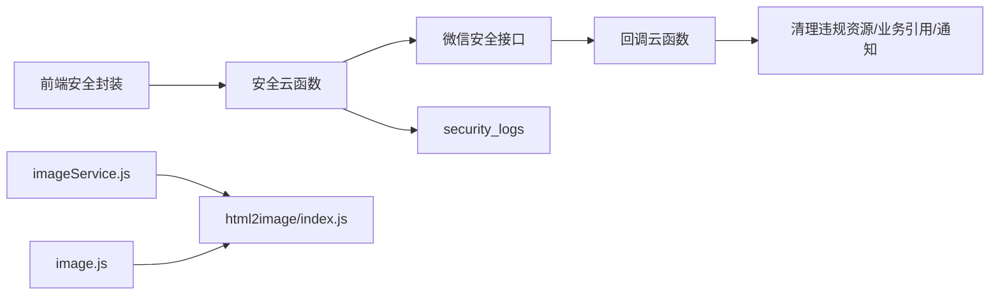

# 工具类API

<cite>
**本文档引用的文件**
- [common/utils.js](file://cloudfunctions/common/utils.js)
- [common/securityChecker.js](file://cloudfunctions/common/securityChecker.js)
- [miniprogram/utils/securityChecker.js](file://miniprogram/utils/securityChecker.js)
- [cloudfunctions/callback/index.js](file://cloudfunctions/callback/index.js)
- [cloudfunctions/qrcode/index.js](file://cloudfunctions/qrcode/index.js)
- [cloudfunctions/html2image/index.js](file://cloudfunctions/html2image/index.js)
- [miniprogram/utils/image.js](file://miniprogram/utils/image.js)
- [miniprogram/utils/imageService.js](file://miniprogram/utils/imageService.js)
- [miniprogram/utils/error.js](file://miniprogram/utils/error.js)
- [miniprogram/utils/cache.js](file://miniprogram/utils/cache.js)
- [pet/utils.js](file://cloudfunctions/pet/utils.js)
- [record/utils.js](file://cloudfunctions/record/utils.js)
- [reminder/utils.js](file://cloudfunctions/reminder/utils.js)
- [admin/utils.js](file://cloudfunctions/admin/utils.js)
</cite>

## 目录
1. [引言](#引言)
2. [项目结构](#项目结构)
3. [核心组件](#核心组件)
4. [架构总览](#架构总览)
5. [详细组件分析](#详细组件分析)
6. [依赖关系分析](#依赖关系分析)
7. [性能考量](#性能考量)
8. [故障排查指南](#故障排查指南)
9. [结论](#结论)
10. [附录](#附录)

## 引言
本文件系统性梳理“工具类API”的设计与实现，覆盖通用工具函数、安全检查、二维码生成、回调处理、图片处理、文件上传、数据校验与错误处理机制，并给出集成指南与性能优化建议。目标是帮助开发者快速理解与复用这些工具模块，降低重复开发成本，提升系统稳定性与可维护性。

## 项目结构
工具类API主要分布在以下位置：
- 云函数通用工具：cloudfunctions/common/utils.js
- 云函数业务工具（pet/record/reminder/admin）：各子模块 utils.js
- 安全检查（云函数与前端封装）：cloudfunctions/common/securityChecker.js、miniprogram/utils/securityChecker.js、cloudfunctions/callback/index.js
- 二维码生成：cloudfunctions/qrcode/index.js
- 图片生成与上传：cloudfunctions/html2image/index.js、miniprogram/utils/imageService.js、miniprogram/utils/image.js
- 前端错误与缓存工具：miniprogram/utils/error.js、miniprogram/utils/cache.js

图表来源
- [common/utils.js:1-69](file://cloudfunctions/common/utils.js#L1-L69)
- [pet/utils.js:1-69](file://cloudfunctions/pet/utils.js#L1-L69)
- [record/utils.js:1-69](file://cloudfunctions/record/utils.js#L1-L69)
- [reminder/utils.js:1-69](file://cloudfunctions/reminder/utils.js#L1-L69)
- [admin/utils.js:1-69](file://cloudfunctions/admin/utils.js#L1-L69)
- [common/securityChecker.js:1-226](file://cloudfunctions/common/securityChecker.js#L1-L226)
- [callback/index.js:1-223](file://cloudfunctions/callback/index.js#L1-L223)
- [qrcode/index.js:1-117](file://cloudfunctions/qrcode/index.js#L1-L117)
- [html2image/index.js:1-205](file://cloudfunctions/html2image/index.js#L1-L205)
- [miniprogram/utils/securityChecker.js:1-122](file://miniprogram/utils/securityChecker.js#L1-L122)
- [miniprogram/utils/imageService.js:1-202](file://miniprogram/utils/imageService.js#L1-L202)
- [miniprogram/utils/image.js:1-170](file://miniprogram/utils/image.js#L1-L170)
- [miniprogram/utils/error.js:1-92](file://miniprogram/utils/error.js#L1-L92)
- [miniprogram/utils/cache.js:1-121](file://miniprogram/utils/cache.js#L1-L121)

章节来源
- [common/utils.js:1-69](file://cloudfunctions/common/utils.js#L1-L69)
- [miniprogram/utils/securityChecker.js:1-122](file://miniprogram/utils/securityChecker.js#L1-L122)
- [cloudfunctions/common/securityChecker.js:1-226](file://cloudfunctions/common/securityChecker.js#L1-L226)
- [cloudfunctions/callback/index.js:1-223](file://cloudfunctions/callback/index.js#L1-L223)
- [cloudfunctions/qrcode/index.js:1-117](file://cloudfunctions/qrcode/index.js#L1-L117)
- [cloudfunctions/html2image/index.js:1-205](file://cloudfunctions/html2image/index.js#L1-L205)
- [miniprogram/utils/imageService.js:1-202](file://miniprogram/utils/imageService.js#L1-L202)
- [miniprogram/utils/image.js:1-170](file://miniprogram/utils/image.js#L1-L170)
- [miniprogram/utils/error.js:1-92](file://miniprogram/utils/error.js#L1-L92)
- [miniprogram/utils/cache.js:1-121](file://miniprogram/utils/cache.js#L1-L121)

## 核心组件
- 通用工具函数（云函数侧）
  - 初始化云开发、获取数据库、获取用户 OpenID、统一响应包装、异常包装、ID 规范化
  - 作用：为各业务云函数提供一致的上下文与返回格式，降低重复代码
- 安全检查（云函数+前端）
  - 云函数侧：图片/文本审核、fileID->URL 转换、审核日志落库、异步回调处理与违规清理
  - 前端封装：统一封装云函数调用，支持异步/同步审核、批量处理
- 二维码生成
  - 生成小程序码（云开发 wxacode）、生成 UrlLink（多环境兼容回退）
- 图片处理与上传
  - 小程序端：HTML 渲染为图片、保存至临时文件、图片 URL 转换与净化
  - 云函数端：调用外部图片服务、可选上传到 COS 或云存储
- 错误与缓存
  - 统一错误提示、加载状态、确认对话框；带过期策略的本地缓存

章节来源
- [common/utils.js:1-69](file://cloudfunctions/common/utils.js#L1-L69)
- [pet/utils.js:1-69](file://cloudfunctions/pet/utils.js#L1-L69)
- [record/utils.js:1-69](file://cloudfunctions/record/utils.js#L1-L69)
- [reminder/utils.js:1-69](file://cloudfunctions/reminder/utils.js#L1-L69)
- [admin/utils.js:1-69](file://cloudfunctions/admin/utils.js#L1-L69)
- [common/securityChecker.js:1-226](file://cloudfunctions/common/securityChecker.js#L1-L226)
- [miniprogram/utils/securityChecker.js:1-122](file://miniprogram/utils/securityChecker.js#L1-L122)
- [cloudfunctions/callback/index.js:1-223](file://cloudfunctions/callback/index.js#L1-L223)
- [cloudfunctions/qrcode/index.js:1-117](file://cloudfunctions/qrcode/index.js#L1-L117)
- [cloudfunctions/html2image/index.js:1-205](file://cloudfunctions/html2image/index.js#L1-L205)
- [miniprogram/utils/imageService.js:1-202](file://miniprogram/utils/imageService.js#L1-L202)
- [miniprogram/utils/image.js:1-170](file://miniprogram/utils/image.js#L1-L170)
- [miniprogram/utils/error.js:1-92](file://miniprogram/utils/error.js#L1-L92)
- [miniprogram/utils/cache.js:1-121](file://miniprogram/utils/cache.js#L1-L121)

## 架构总览
整体采用“前端调用云函数/云开发能力”的分层架构。前端负责交互与展示，云函数负责业务逻辑与第三方服务对接，数据库与云存储作为数据与资源载体。

图表来源
- [miniprogram/utils/securityChecker.js:1-122](file://miniprogram/utils/securityChecker.js#L1-L122)
- [cloudfunctions/common/securityChecker.js:1-226](file://cloudfunctions/common/securityChecker.js#L1-L226)
- [cloudfunctions/callback/index.js:1-223](file://cloudfunctions/callback/index.js#L1-L223)

## 详细组件分析

### 通用工具函数（云函数侧）
- 设计要点
  - 统一初始化云开发环境与数据库连接
  - 统一响应结构：success/data/message/error
  - 统一异常捕获与包装，便于前端消费
  - ID 规范化：将 MongoDB 的 _id 映射为 id，保证前后端一致
- 复用模式
  - 各业务云函数引入该工具，减少样板代码
  - 通过 wrapAction 包裹业务动作，自动捕获异常并标准化返回
- 扩展方法
  - 可按需增加鉴权、限流、审计日志等横切关注点
  - 可抽象出“事务”封装，确保多表更新一致性

章节来源
- [common/utils.js:1-69](file://cloudfunctions/common/utils.js#L1-L69)
- [pet/utils.js:1-69](file://cloudfunctions/pet/utils.js#L1-L69)
- [record/utils.js:1-69](file://cloudfunctions/record/utils.js#L1-L69)
- [reminder/utils.js:1-69](file://cloudfunctions/reminder/utils.js#L1-L69)
- [admin/utils.js:1-69](file://cloudfunctions/admin/utils.js#L1-L69)

### 安全检查（云函数+前端）
- 云函数侧
  - 支持图片异步审核与文本即时审核
  - fileID 自动转临时 URL，再调用微信审核接口
  - 审核日志入库，包含 trace_id、场景、业务ID、用户等
  - 异步回调处理：当审核不通过时，删除云存储文件、清理业务引用、发送通知
- 前端封装
  - 提供异步/同步两种调用方式，批量处理多张图片
  - 审核服务不可用时的降级策略（文本审核放行）

图表来源
- [cloudfunctions/common/securityChecker.js:1-226](file://cloudfunctions/common/securityChecker.js#L1-L226)
- [miniprogram/utils/securityChecker.js:1-122](file://miniprogram/utils/securityChecker.js#L1-L122)

章节来源
- [cloudfunctions/common/securityChecker.js:1-226](file://cloudfunctions/common/securityChecker.js#L1-L226)
- [miniprogram/utils/securityChecker.js:1-122](file://miniprogram/utils/securityChecker.js#L1-L122)
- [cloudfunctions/callback/index.js:1-223](file://cloudfunctions/callback/index.js#L1-L223)

### 二维码生成
- 功能
  - 生成小程序码（wxacode.get），上传到云存储，返回 fileID
  - 生成 UrlLink（多环境兼容），失败时回退到纯文本链接
- 参数与行为
  - 生成小程序码：page、scene、width、透明背景开关
  - 生成 UrlLink：petId/recordId、from=scan、多环境尝试
- 最佳实践
  - 优先使用 UrlLink 以减少前端渲染压力
  - 小程序码适合一次性场景，注意云存储配额与访问频率

图表来源
- [cloudfunctions/qrcode/index.js:1-117](file://cloudfunctions/qrcode/index.js#L1-L117)

章节来源
- [cloudfunctions/qrcode/index.js:1-117](file://cloudfunctions/qrcode/index.js#L1-L117)

### 图片处理与上传
- 小程序端
  - HTML 转图片：将 HTML 中的图片转为 base64，调用图片服务，保存到临时文件
  - 图片 URL 转换：cloud:// 与临时 URL 互转，支持批量与净化
- 云函数端
  - 读取系统配置（图片服务地址、超时、COS 凭证），调用外部服务
  - 可选上传到 COS 或云存储，返回 cosUrl 或 fileID

图表来源
- [cloudfunctions/html2image/index.js:1-205](file://cloudfunctions/html2image/index.js#L1-L205)
- [miniprogram/utils/imageService.js:1-202](file://miniprogram/utils/imageService.js#L1-L202)
- [miniprogram/utils/image.js:1-170](file://miniprogram/utils/image.js#L1-L170)

章节来源
- [cloudfunctions/html2image/index.js:1-205](file://cloudfunctions/html2image/index.js#L1-L205)
- [miniprogram/utils/imageService.js:1-202](file://miniprogram/utils/imageService.js#L1-L202)
- [miniprogram/utils/image.js:1-170](file://miniprogram/utils/image.js#L1-L170)

### 错误处理与缓存
- 错误处理
  - 统一错误消息提取、Toast 展示、加载状态、确认对话框
- 缓存
  - 带过期时间的本地缓存，支持清理过期项与兜底策略

章节来源
- [miniprogram/utils/error.js:1-92](file://miniprogram/utils/error.js#L1-L92)
- [miniprogram/utils/cache.js:1-121](file://miniprogram/utils/cache.js#L1-L121)

## 依赖关系分析
- 低耦合高内聚
  - 通用工具函数被各业务云函数复用，避免重复初始化与响应包装
  - 安全检查前后端分离，前端仅负责调用，逻辑集中在云函数与回调
- 关键依赖链
  - 前端安全封装 -> 安全云函数 -> 微信安全接口 -> 审核日志 -> 回调清理
  - 图片服务链路：小程序 HTML/主题 -> 云函数配置读取 -> 外部服务 -> COS/云存储

图表来源
- [miniprogram/utils/securityChecker.js:1-122](file://miniprogram/utils/securityChecker.js#L1-L122)
- [cloudfunctions/common/securityChecker.js:1-226](file://cloudfunctions/common/securityChecker.js#L1-L226)
- [cloudfunctions/callback/index.js:1-223](file://cloudfunctions/callback/index.js#L1-L223)
- [cloudfunctions/html2image/index.js:1-205](file://cloudfunctions/html2image/index.js#L1-L205)
- [miniprogram/utils/imageService.js:1-202](file://miniprogram/utils/imageService.js#L1-L202)
- [miniprogram/utils/image.js:1-170](file://miniprogram/utils/image.js#L1-L170)

## 性能考量
- 审核与图片生成
  - 异步审核不阻塞 UI，建议优先使用异步提交+回调更新
  - 图片生成服务超时与并发控制：合理设置 imageTimeout，避免阻塞
- 存储与网络
  - 优先使用 UrlLink，减少前端渲染与下载压力
  - COS 上传失败时允许降级返回本地图片，保障主流程可用
- 本地缓存
  - 合理设置过期时间，避免占用过多本地空间
  - 存储满时自动清理过期缓存并重试

## 故障排查指南
- 安全审核
  - 若回调未触发：检查云开发控制台“消息推送”配置，确认事件类型与云函数名
  - 审核不通过但未清理：检查 security_logs 是否存在对应 trace_id，确认回调处理逻辑
- 图片生成
  - 服务不可达：检查 systemConfig.imageServerUrl 与 imageTimeout
  - COS 上传失败：核对 SecretId/SecretKey/Bucket/Region 配置
- 前端图片转换
  - cloud:// 无法转临时 URL：确认 fileID 格式与权限，必要时回退保留原值
- 错误提示
  - 使用统一错误工具显示 Toast，结合控制台日志定位问题

章节来源
- [cloudfunctions/callback/index.js:1-223](file://cloudfunctions/callback/index.js#L1-L223)
- [cloudfunctions/html2image/index.js:1-205](file://cloudfunctions/html2image/index.js#L1-L205)
- [miniprogram/utils/image.js:1-170](file://miniprogram/utils/image.js#L1-L170)
- [miniprogram/utils/error.js:1-92](file://miniprogram/utils/error.js#L1-L92)

## 结论
本套工具类API通过“前端封装 + 云函数实现 + 回调治理”的组合，实现了安全、高效、可扩展的通用能力。建议在新功能中优先复用现有工具，遵循统一的响应与错误处理规范，确保跨模块一致性与可维护性。

## 附录
- 常用工具函数使用示例（路径指引）
  - 安全检查（前端）：[miniprogram/utils/securityChecker.js:50-92](file://miniprogram/utils/securityChecker.js#L50-L92)
  - 安全检查（云函数）：[cloudfunctions/common/securityChecker.js:74-170](file://cloudfunctions/common/securityChecker.js#L74-L170)
  - 审核回调处理：[cloudfunctions/callback/index.js:57-109](file://cloudfunctions/callback/index.js#L57-L109)
  - 二维码生成：[cloudfunctions/qrcode/index.js:24-61](file://cloudfunctions/qrcode/index.js#L24-L61)
  - UrlLink 生成：[cloudfunctions/qrcode/index.js:65-117](file://cloudfunctions/qrcode/index.js#L65-L117)
  - 图片生成（云函数）：[cloudfunctions/html2image/index.js:66-140](file://cloudfunctions/html2image/index.js#L66-L140)
  - 图片生成（前端）：[miniprogram/utils/imageService.js:59-92](file://miniprogram/utils/imageService.js#L59-L92)
  - 图片 URL 转换与净化：[miniprogram/utils/image.js:64-144](file://miniprogram/utils/image.js#L64-L144)
  - 统一错误处理：[miniprogram/utils/error.js:8-34](file://miniprogram/utils/error.js#L8-L34)
  - 本地缓存：[miniprogram/utils/cache.js:11-85](file://miniprogram/utils/cache.js#L11-L85)
- 参数说明与最佳实践
  - 安全检查：scene 支持字符串映射或数字值；文本审核失败时可选择放行
  - 二维码：优先 UrlLink；小程序码适合一次性场景
  - 图片生成：合理设置宽高与质量；COS 上传失败不影响主流程
  - 缓存：设置合理的过期时间；存储满时自动清理过期项