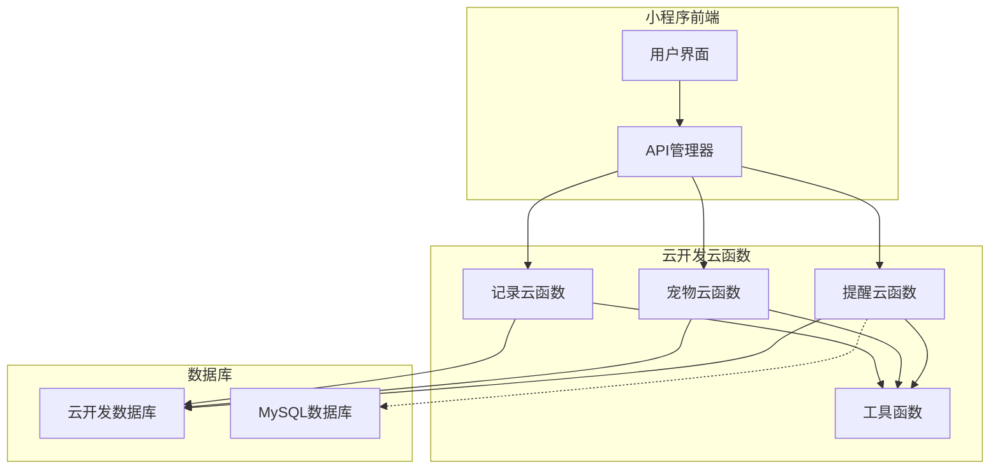
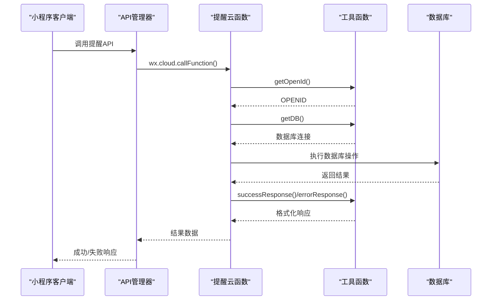
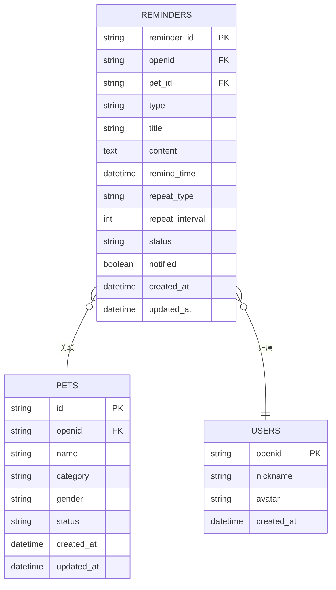
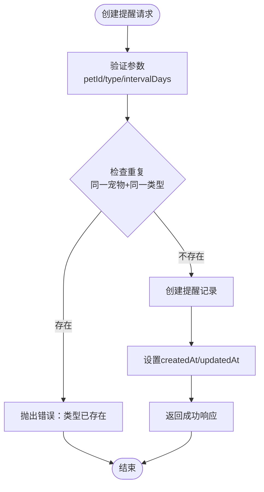
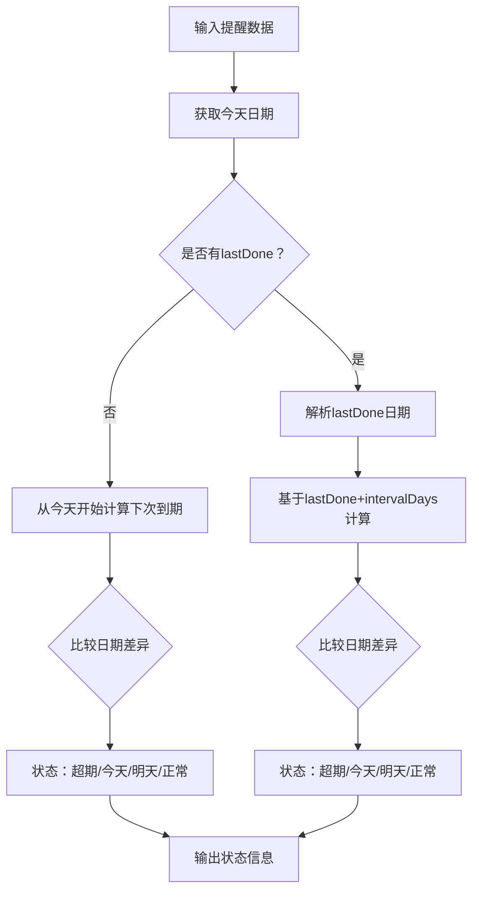
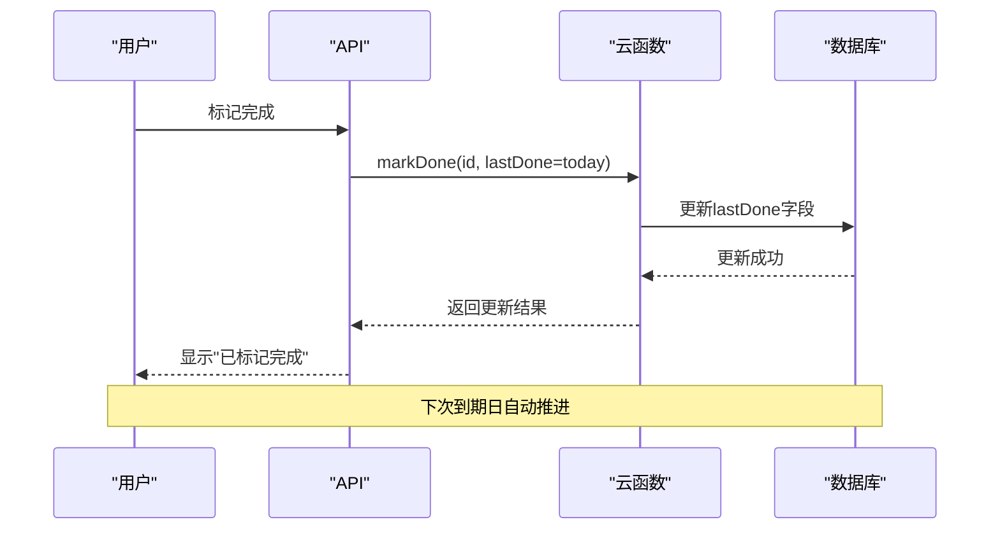
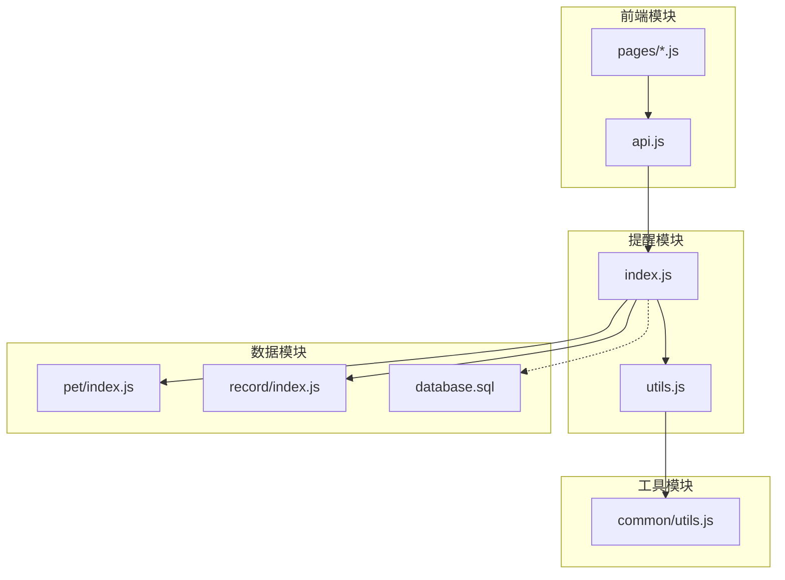

# 提醒管理API

<cite>
**本文档引用的文件**
- [cloudfunctions/reminder/index.js](file://cloudfunctions/reminder/index.js)
- [cloudfunctions/reminder/utils.js](file://cloudfunctions/reminder/utils.js)
- [cloudfunctions/reminder/config.json](file://cloudfunctions/reminder/config.json)
- [cloudfunctions/common/utils.js](file://cloudfunctions/common/utils.js)
- [cloudfunctions/pet/index.js](file://cloudfunctions/pet/index.js)
- [cloudfunctions/record/index.js](file://cloudfunctions/record/index.js)
- [miniprogram/utils/api.js](file://miniprogram/utils/api.js)
- [miniprogram/pages/index/index.js](file://miniprogram/pages/index/index.js)
- [miniprogram/pages/pet/detail.js](file://miniprogram/pages/pet/detail.js)
- [miniprogram/pages/pet/detail.wxml](file://miniprogram/pages/pet/detail.wxml)
- [server-setup/database.sql](file://server-setup/database.sql)
</cite>

## 目录
1. [简介](#简介)
2. [项目结构](#项目结构)
3. [核心组件](#核心组件)
4. [架构概览](#架构概览)
5. [详细组件分析](#详细组件分析)
6. [依赖分析](#依赖分析)
7. [性能考虑](#性能考虑)
8. [故障排除指南](#故障排除指南)
9. [结论](#结论)
10. [附录](#附录)

## 简介
本文件为"提醒管理API"的完整技术文档，涵盖提醒事项的创建、查询、更新、删除接口，以及提醒类型、时间设置、重复规则和通知机制。文档还解释了提醒与宠物记录的关联关系、自动化触发条件、提醒状态管理、历史记录查询和批量操作功能，并提供API调用示例、参数说明和集成指南。

## 项目结构
提醒管理API位于云开发云函数模块中，采用按功能分层的组织方式：
- 云函数层：提供REST风格的云函数接口，封装数据库操作和业务逻辑
- 工具层：提供通用的数据库连接、鉴权、响应格式化等工具函数
- 前端集成层：小程序端通过统一的API管理器调用云函数
- 数据层：支持两种存储方案（云开发数据库和MySQL数据库）



**图表来源**
- [cloudfunctions/reminder/index.js:1-205](file://cloudfunctions/reminder/index.js#L1-L205)
- [cloudfunctions/common/utils.js:1-69](file://cloudfunctions/common/utils.js#L1-L69)
- [miniprogram/utils/api.js:1-208](file://miniprogram/utils/api.js#L1-L208)

**章节来源**
- [cloudfunctions/reminder/index.js:1-205](file://cloudfunctions/reminder/index.js#L1-L205)
- [cloudfunctions/reminder/utils.js:1-69](file://cloudfunctions/reminder/utils.js#L1-L69)
- [cloudfunctions/common/utils.js:1-69](file://cloudfunctions/common/utils.js#L1-L69)

## 核心组件
提醒管理API的核心组件包括：

### 云函数入口
- **入口文件**：`cloudfunctions/reminder/index.js`
- **主要职责**：处理提醒相关的所有业务逻辑，包括CRUD操作、状态管理、权限验证
- **支持的操作**：create、list、listAll、get、update、delete、markDone

### 工具函数库
- **工具文件**：`cloudfunctions/reminder/utils.js`
- **功能**：数据库连接、OPENID获取、响应格式化、数据标准化
- **关键方法**：getDB()、getOpenId()、successResponse()、errorResponse()、normalizeId()

### 前端API管理器
- **文件**：`miniprogram/utils/api.js`
- **功能**：统一调用云函数，提供提醒相关的便捷方法
- **方法**：getReminderList()、getAllReminders()、createReminder()、updateReminder()、deleteReminder()、markReminderDone()

**章节来源**
- [cloudfunctions/reminder/index.js:10-37](file://cloudfunctions/reminder/index.js#L10-L37)
- [cloudfunctions/reminder/utils.js:10-69](file://cloudfunctions/reminder/utils.js#L10-L69)
- [miniprogram/utils/api.js:100-124](file://miniprogram/utils/api.js#L100-L124)

## 架构概览
提醒管理API采用分层架构设计，确保业务逻辑清晰分离：



**图表来源**
- [cloudfunctions/reminder/index.js:10-37](file://cloudfunctions/reminder/index.js#L10-L37)
- [cloudfunctions/reminder/utils.js:15-35](file://cloudfunctions/reminder/utils.js#L15-L35)
- [miniprogram/utils/api.js:12-38](file://miniprogram/utils/api.js#L12-L38)

## 详细组件分析

### 数据模型设计
提醒系统支持两种数据模型：

#### 云开发数据库模型
- **集合名称**：`reminders`
- **核心字段**：
  - `petId`：关联的宠物ID
  - `type`：提醒类型（换水、喂食、健康、custom）
  - `intervalDays`：重复间隔（天）
  - `lastDone`：上次完成日期
  - `note`：备注信息
  - `openid`：用户标识

#### MySQL数据库模型
- **表名称**：`reminders`
- **扩展字段**：
  - `reminder_id`：提醒唯一ID
  - `title`：提醒标题
  - `content`：提醒内容
  - `remind_time`：提醒时间
  - `repeat_type`：重复类型
  - `repeat_interval`：重复间隔
  - `status`：状态（active/completed/expired）
  - `notified`：是否已通知



**图表来源**
- [server-setup/database.sql:139-161](file://server-setup/database.sql#L139-L161)
- [cloudfunctions/reminder/index.js:79-88](file://cloudfunctions/reminder/index.js#L79-L88)

**章节来源**
- [server-setup/database.sql:139-161](file://server-setup/database.sql#L139-L161)
- [cloudfunctions/reminder/index.js:79-88](file://cloudfunctions/reminder/index.js#L79-L88)

### 核心API接口

#### 创建提醒
**接口定义**：
- **路径**：`/reminder/create`
- **方法**：POST
- **参数**：
  - `petId`：必须，宠物ID
  - `type`：必须，提醒类型
  - `intervalDays`：必须，间隔天数（>0）
  - `lastDone`：可选，上次完成日期
  - `note`：可选，备注

**业务逻辑**：
1. 验证输入参数合法性
2. 检查同一宠物+同一类型是否已存在
3. 创建提醒记录，设置创建时间和更新时间
4. 返回创建结果



**图表来源**
- [cloudfunctions/reminder/index.js:55-102](file://cloudfunctions/reminder/index.js#L55-L102)

**章节来源**
- [cloudfunctions/reminder/index.js:55-102](file://cloudfunctions/reminder/index.js#L55-L102)

#### 查询提醒列表
**接口定义**：
- **路径**：`/reminder/list`
- **方法**：GET
- **参数**：`petId`（必须）

**功能特性**：
- 按宠物ID查询提醒列表
- 按创建时间升序排列
- 自动处理集合不存在的情况

**章节来源**
- [cloudfunctions/reminder/index.js:104-123](file://cloudfunctions/reminder/index.js#L104-L123)

#### 查询所有提醒
**接口定义**：
- **路径**：`/reminder/listAll`
- **方法**：GET

**功能特性**：
- 查询当前用户的所有提醒
- 适用于"我的"页面的汇总展示

**章节来源**
- [cloudfunctions/reminder/index.js:126-142](file://cloudfunctions/reminder/index.js#L126-L142)

#### 更新提醒
**接口定义**：
- **路径**：`/reminder/update`
- **方法**：PUT
- **参数**：`id`（必须）及其他可更新字段

**更新规则**：
- 类型变更时检查冲突
- 支持部分字段更新
- 自动更新更新时间

**章节来源**
- [cloudfunctions/reminder/index.js:151-179](file://cloudfunctions/reminder/index.js#L151-L179)

#### 删除提醒
**接口定义**：
- **路径**：`/reminder/delete`
- **方法**：DELETE
- **参数**：`id`（必须）

**权限控制**：
- 验证记录存在性
- 检查用户权限
- 删除后返回成功消息

**章节来源**
- [cloudfunctions/reminder/index.js:181-188](file://cloudfunctions/reminder/index.js#L181-L188)

#### 标记完成
**接口定义**：
- **路径**：`/reminder/markDone`
- **方法**：POST
- **参数**：`id`（必须）、`lastDone`（必须）

**功能特性**：
- 更新上次完成日期
- 自动更新时间戳
- 支持推进到下一个周期

**章节来源**
- [cloudfunctions/reminder/index.js:191-204](file://cloudfunctions/reminder/index.js#L191-L204)

### 状态管理机制

#### 提醒状态计算
提醒状态基于以下规则计算：



**图表来源**
- [miniprogram/pages/index/index.js:187-213](file://miniprogram/pages/index/index.js#L187-L213)
- [miniprogram/pages/pet/detail.js:2619-2664](file://miniprogram/pages/pet/detail.js#L2619-L2664)

**状态定义**：
- **超期**：`daysLeft < 0`
- **今天**：`daysLeft === 0`
- **明天**：`daysLeft === 1`
- **正常**：`daysLeft > 1`
- **已完成**：`doneToday === true`

**章节来源**
- [miniprogram/pages/index/index.js:187-213](file://miniprogram/pages/index/index.js#L187-L213)
- [miniprogram/pages/pet/detail.js:2619-2664](file://miniprogram/pages/pet/detail.js#L2619-L2664)

### 重复规则实现
提醒支持基于间隔天数的重复机制：

#### 重复算法
1. **初始状态**：如果没有`lastDone`，从今天开始计算下次到期日
2. **正常状态**：基于`lastDone + intervalDays`计算下次到期日
3. **状态推进**：当用户标记完成时，`lastDone`更新为今天，下次到期日推进一个周期



**图表来源**
- [cloudfunctions/reminder/index.js:191-204](file://cloudfunctions/reminder/index.js#L191-L204)
- [miniprogram/pages/pet/detail.js:2821-2874](file://miniprogram/pages/pet/detail.js#L2821-L2874)

**章节来源**
- [cloudfunctions/reminder/index.js:191-204](file://cloudfunctions/reminder/index.js#L191-L204)
- [miniprogram/pages/pet/detail.js:2821-2874](file://miniprogram/pages/pet/detail.js#L2821-L2874)

### 通知机制
提醒系统支持多种通知方式：

#### 前端通知
- **首页提醒**：自动计算并显示待处理提醒
- **宠物详情页**：显示具体的提醒状态和操作按钮
- **实时更新**：支持一键标记完成并推进周期

#### 后端通知
- **数据库字段**：MySQL模式下支持`notified`字段跟踪通知状态
- **扩展机制**：可通过增加字段支持更复杂的通知策略

**章节来源**
- [miniprogram/pages/index/index.js:308-312](file://miniprogram/pages/index/index.js#L308-L312)
- [miniprogram/pages/pet/detail.wxml:206-227](file://miniprogram/pages/pet/detail.wxml#L206-L227)

## 依赖分析

### 组件间依赖关系


**图表来源**
- [cloudfunctions/reminder/index.js:1-3](file://cloudfunctions/reminder/index.js#L1-L3)
- [cloudfunctions/reminder/utils.js:1-3](file://cloudfunctions/reminder/utils.js#L1-L3)
- [cloudfunctions/common/utils.js:1-3](file://cloudfunctions/common/utils.js#L1-L3)
- [miniprogram/utils/api.js:1-3](file://miniprogram/utils/api.js#L1-L3)

### 权限控制机制
- **OPENID绑定**：所有操作都绑定到当前用户的OPENID
- **数据隔离**：查询时自动过滤用户数据
- **权限验证**：删除和更新操作前验证记录归属

**章节来源**
- [cloudfunctions/reminder/index.js:14-37](file://cloudfunctions/reminder/index.js#L14-L37)
- [cloudfunctions/reminder/utils.js:15-18](file://cloudfunctions/reminder/utils.js#L15-L18)

## 性能考虑
- **索引优化**：数据库表已建立必要的索引（openid、pet_id、remind_time、status）
- **查询优化**：支持分页查询，避免一次性返回大量数据
- **缓存策略**：前端支持数据预加载和本地缓存
- **并发控制**：云函数支持并发调用，但注意数据库写入的原子性

## 故障排除指南

### 常见错误及解决方案
1. **集合不存在错误**
   - 症状：创建提醒时报错"集合不存在"
   - 解决：在云开发控制台手动创建reminders集合

2. **权限不足**
   - 症状：更新/删除操作返回"记录不存在或无权限"
   - 解决：确认当前用户身份和记录归属关系

3. **重复提醒**
   - 症状：创建提醒时报错"该类型提醒已存在"
   - 解决：修改提醒类型或删除现有同类提醒

4. **参数验证失败**
   - 症状：创建/更新时报各种参数错误
   - 解决：检查必填参数和数据类型

**章节来源**
- [cloudfunctions/reminder/index.js:56-77](file://cloudfunctions/reminder/index.js#L56-L77)
- [cloudfunctions/reminder/index.js:153-157](file://cloudfunctions/reminder/index.js#L153-L157)

## 结论
提醒管理API提供了完整的提醒生命周期管理功能，包括创建、查询、更新、删除和状态管理。系统采用分层架构设计，支持多种存储方案，并提供了完善的权限控制和错误处理机制。通过前后端协同，实现了直观的用户体验和可靠的业务逻辑。

## 附录

### API调用示例

#### 创建提醒
```javascript
// 前端调用
const result = await API.createReminder({
  petId: 'PET_123',
  type: '换水',
  intervalDays: 7,
  lastDone: '2024-01-01'
});
```

#### 查询提醒列表
```javascript
// 前端调用
const result = await API.getReminderList('PET_123');
```

#### 标记完成
```javascript
// 前端调用
const result = await API.markReminderDone('REM_456', '2024-01-08');
```

### 参数说明

#### 创建提醒参数
- `petId`：字符串，必填，宠物唯一标识
- `type`：字符串，必填，提醒类型（换水/喂食/健康/custom）
- `intervalDays`：数字，必填，重复间隔（>0）
- `lastDone`：字符串，可选，上次完成日期（YYYY-MM-DD）
- `note`：字符串，可选，备注信息

#### 状态字段说明
- `statusClass`：状态类别（overdue/today/tomorrow/normal）
- `daysLeft`：距离到期天数
- `doneToday`：今天是否已完成
- `nextDueDate`：下次到期日期

### 集成指南

#### 前端集成步骤
1. 引入API管理器
2. 调用相应的方法进行操作
3. 处理返回的成功/失败响应
4. 更新UI状态

#### 后端集成步骤
1. 在云开发控制台部署云函数
2. 配置数据库权限
3. 调用云函数进行数据操作
4. 处理数据库响应

**章节来源**
- [miniprogram/utils/api.js:109-123](file://miniprogram/utils/api.js#L109-L123)
- [cloudfunctions/reminder/config.json:1-6](file://cloudfunctions/reminder/config.json#L1-L6)