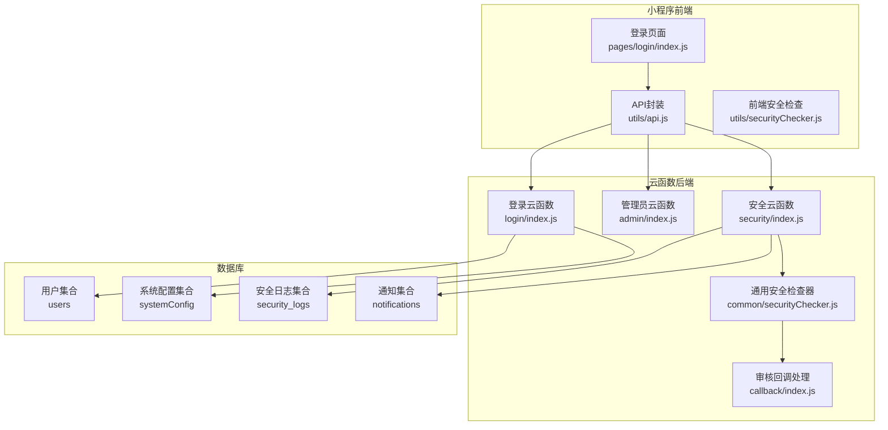
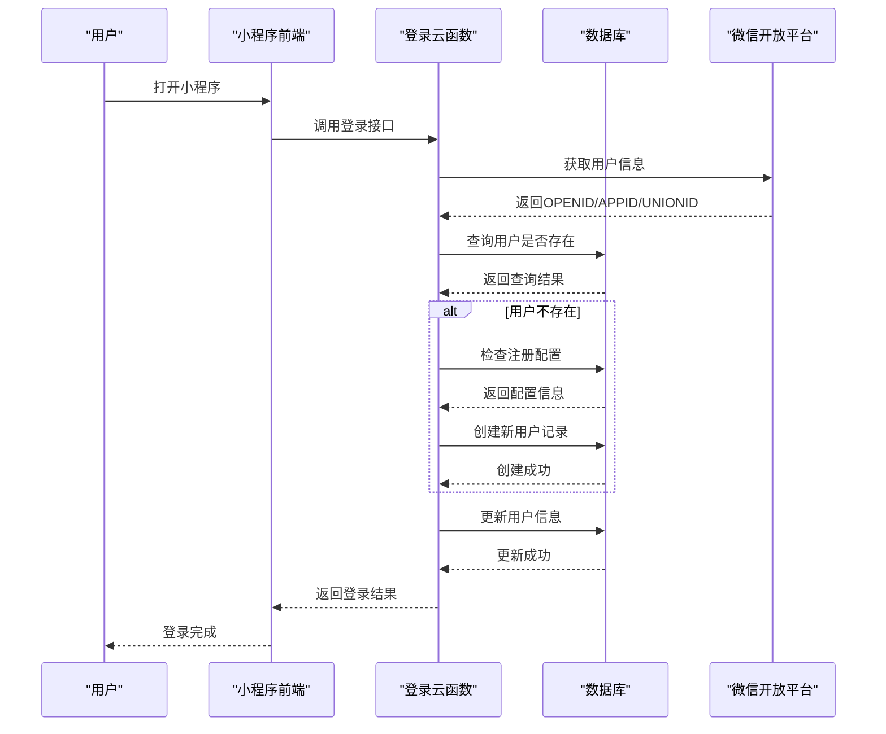
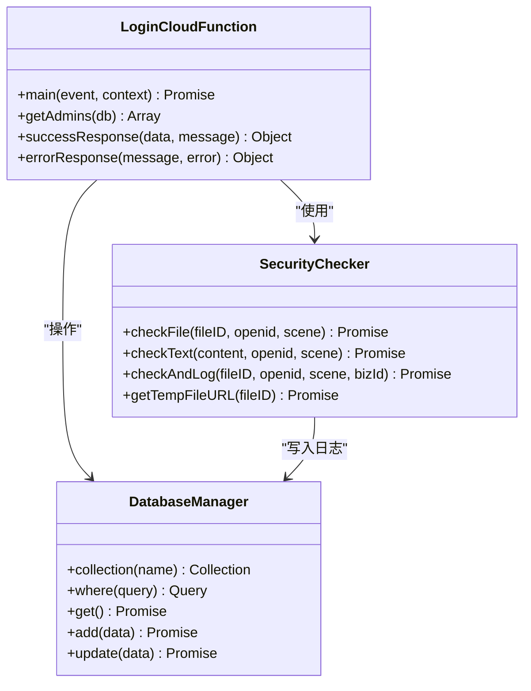
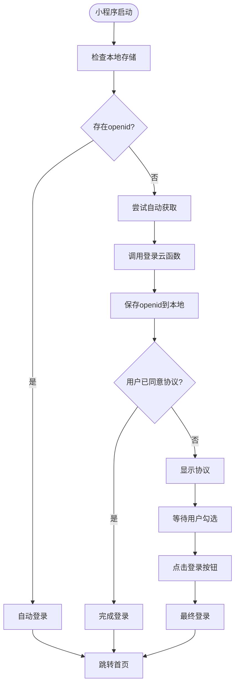
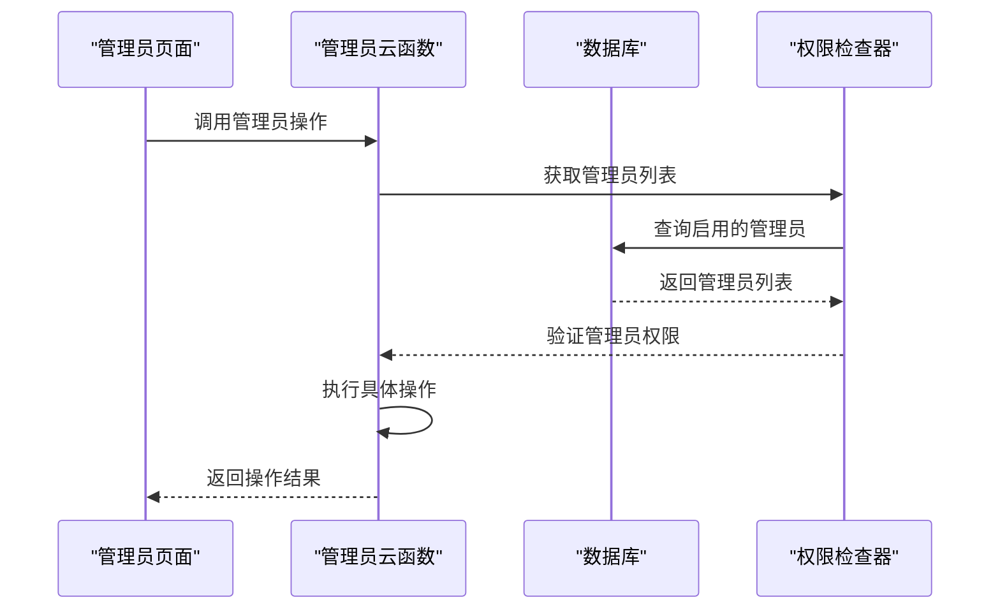
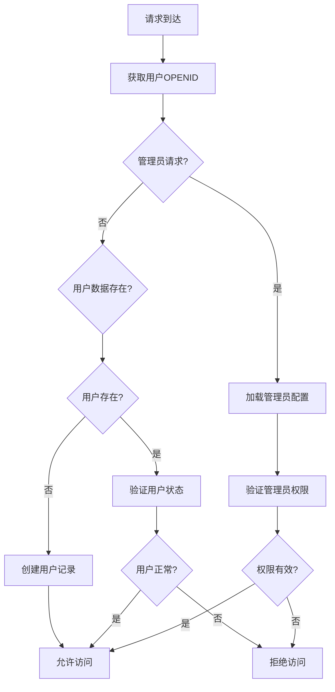
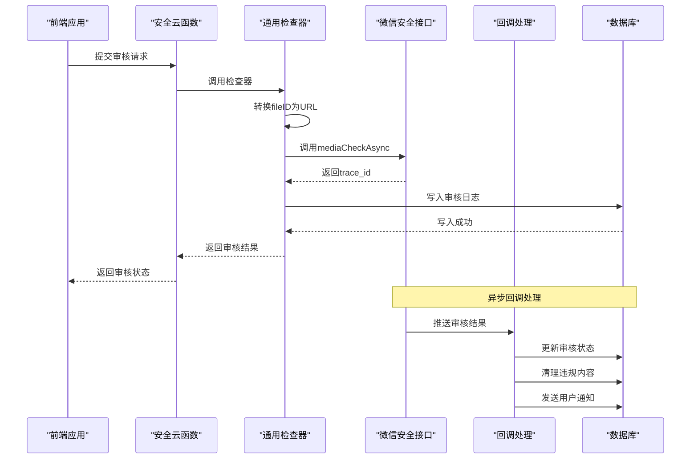
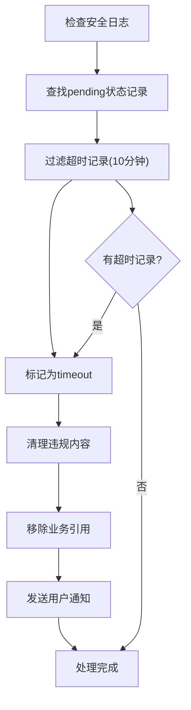
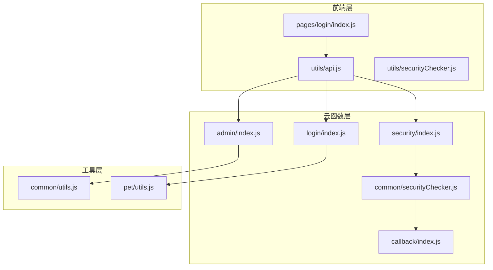
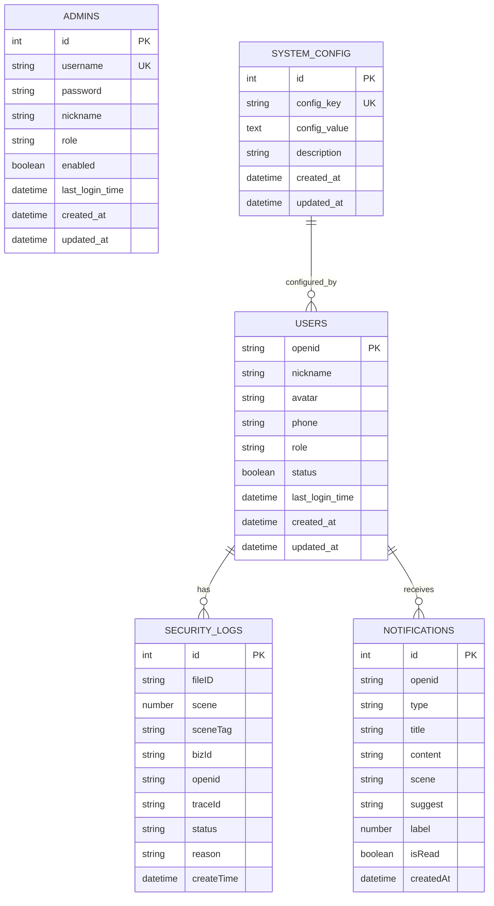

# 用户认证API

<cite>
**本文档引用的文件**
- [login/index.js](file://cloudfunctions/login/index.js)
- [admin/index.js](file://cloudfunctions/admin/index.js)
- [security/index.js](file://cloudfunctions/security/index.js)
- [security/securityChecker.js](file://cloudfunctions/security/securityChecker.js)
- [common/securityChecker.js](file://cloudfunctions/common/securityChecker.js)
- [callback/index.js](file://cloudfunctions/callback/index.js)
- [miniprogram/pages/login/index.js](file://miniprogram/pages/login/index.js)
- [miniprogram/utils/api.js](file://miniprogram/utils/api.js)
- [miniprogram/utils/securityChecker.js](file://miniprogram/utils/securityChecker.js)
- [pet/index.js](file://cloudfunctions/pet/index.js)
- [server-setup/database.sql](file://server-setup/database.sql)
</cite>

## 目录
1. [简介](#简介)
2. [项目结构](#项目结构)
3. [核心组件](#核心组件)
4. [架构概览](#架构概览)
5. [详细组件分析](#详细组件分析)
6. [依赖关系分析](#依赖关系分析)
7. [性能考虑](#性能考虑)
8. [故障排除指南](#故障排除指南)
9. [结论](#结论)
10. [附录](#附录)

## 简介
本文件为「养龟档案」小程序的用户认证API完整技术文档，涵盖登录、注册、退出登录等认证相关接口，详细说明微信授权登录流程、用户信息获取、权限验证和安全检查机制。文档还解释了登录态维护、会话管理以及安全防护措施，并提供认证流程图、API调用示例和错误处理指南。

## 项目结构
该项目采用前后端分离的云开发架构，主要分为以下层次：
- 前端小程序层：负责用户界面交互、本地存储和云函数调用封装
- 云函数层：提供认证、权限管理、内容安全审核等后端能力
- 数据库层：使用腾讯云数据库（MongoDB风格）存储用户、宠物、足迹等数据
- 安全防护层：集成微信内容安全审核、异步回调处理和违规内容清理



**图表来源**
- [login/index.js:38-147](file://cloudfunctions/login/index.js#L38-L147)
- [admin/index.js:27-71](file://cloudfunctions/admin/index.js#L27-L71)
- [security/index.js:15-64](file://cloudfunctions/security/index.js#L15-L64)
- [common/securityChecker.js:30-208](file://cloudfunctions/common/securityChecker.js#L30-L208)
- [callback/index.js:42-52](file://cloudfunctions/callback/index.js#L42-L52)

**章节来源**
- [login/index.js:1-148](file://cloudfunctions/login/index.js#L1-L148)
- [admin/index.js:1-533](file://cloudfunctions/admin/index.js#L1-L533)
- [security/index.js:1-200](file://cloudfunctions/security/index.js#L1-L200)
- [common/securityChecker.js:1-226](file://cloudfunctions/common/securityChecker.js#L1-L226)
- [callback/index.js:1-223](file://cloudfunctions/callback/index.js#L1-L223)

## 核心组件
本项目的认证体系围绕以下核心组件构建：

### 1. 登录云函数（login/index.js）
- **功能**：处理微信授权登录、用户信息初始化、新用户注册控制
- **关键特性**：
  - 通过云开发SDK获取OPENID、APPID、UNIONID
  - 自动创建新用户记录，支持系统配置的注册开关
  - 提供管理员权限检查和用户信息更新接口
  - 兼容数据库连接失败场景，确保基本登录能力

### 2. 安全检查器（common/securityChecker.js）
- **功能**：统一的内容安全审核服务
- **关键特性**：
  - 支持图片异步审核（mediaCheckAsync）和文本审核（msgSecCheck）
  - 自动转换cloud://文件ID为临时URL
  - 审核结果异步回调处理，支持违规内容自动清理
  - 审核日志持久化，便于追踪和审计

### 3. 安全云函数（security/index.js）
- **功能**：安全检查器的薄包装层，提供统一的云函数入口
- **关键特性**：
  - 支持同步和异步审核两种模式
  - 提供用户通知管理（未读通知、标记已读）
  - 查询待处理审核记录，处理超时情况

### 4. 管理员云函数（admin/index.js）
- **功能**：后台管理系统的核心
- **关键特性**：
  - 管理员权限验证和控制
  - 用户、宠物、足迹等数据的增删改查
  - 系统配置管理和统计分析
  - 用户封禁/解封的事务性操作

### 5. 前端API封装（miniprogram/utils/api.js）
- **功能**：统一的云函数调用封装
- **关键特性**：
  - 统一的错误处理和降级策略
  - 支持图片上传和安全审核集成
  - 云函数可用性监控和故障转移

**章节来源**
- [login/index.js:38-147](file://cloudfunctions/login/index.js#L38-L147)
- [common/securityChecker.js:30-208](file://cloudfunctions/common/securityChecker.js#L30-L208)
- [security/index.js:15-64](file://cloudfunctions/security/index.js#L15-L64)
- [admin/index.js:27-71](file://cloudfunctions/admin/index.js#L27-L71)
- [miniprogram/utils/api.js:4-38](file://miniprogram/utils/api.js#L4-L38)

## 架构概览
系统采用「前端小程序 + 云函数 + 数据库」的三层架构，通过微信开放平台实现用户身份认证。



**图表来源**
- [login/index.js:38-147](file://cloudfunctions/login/index.js#L38-L147)
- [miniprogram/pages/login/index.js:52-87](file://miniprogram/pages/login/index.js#L52-L87)

## 详细组件分析

### 登录流程组件分析

#### 登录云函数架构


**图表来源**
- [login/index.js:38-147](file://cloudfunctions/login/index.js#L38-L147)
- [common/securityChecker.js:30-208](file://cloudfunctions/common/securityChecker.js#L30-L208)

#### 登录状态管理流程


**图表来源**
- [miniprogram/pages/login/index.js:16-87](file://miniprogram/pages/login/index.js#L16-L87)
- [miniprogram/pages/login/index.js:89-154](file://miniprogram/pages/login/index.js#L89-L154)

**章节来源**
- [login/index.js:38-147](file://cloudfunctions/login/index.js#L38-L147)
- [miniprogram/pages/login/index.js:16-154](file://miniprogram/pages/login/index.js#L16-L154)

### 权限验证组件分析

#### 管理员权限验证


**图表来源**
- [admin/index.js:27-71](file://cloudfunctions/admin/index.js#L27-L71)
- [admin/index.js:16-25](file://cloudfunctions/admin/index.js#L16-L25)

#### 用户权限验证流程


**图表来源**
- [login/index.js:25-53](file://cloudfunctions/login/index.js#L25-L53)
- [login/index.js:87-147](file://cloudfunctions/login/index.js#L87-L147)

**章节来源**
- [admin/index.js:16-71](file://cloudfunctions/admin/index.js#L16-L71)
- [login/index.js:25-147](file://cloudfunctions/login/index.js#L25-L147)

### 安全检查组件分析

#### 内容安全审核流程


**图表来源**
- [security/index.js:15-64](file://cloudfunctions/security/index.js#L15-L64)
- [common/securityChecker.js:74-105](file://cloudfunctions/common/securityChecker.js#L74-L105)
- [callback/index.js:42-109](file://cloudfunctions/callback/index.js#L42-L109)

#### 审核超时处理机制


**图表来源**
- [security/index.js:151-200](file://cloudfunctions/security/index.js#L151-L200)
- [callback/index.js:96-196](file://cloudfunctions/callback/index.js#L96-L196)

**章节来源**
- [security/index.js:15-200](file://cloudfunctions/security/index.js#L15-L200)
- [common/securityChecker.js:30-208](file://cloudfunctions/common/securityChecker.js#L30-L208)
- [callback/index.js:42-200](file://cloudfunctions/callback/index.js#L42-L200)

## 依赖关系分析

### 组件间依赖关系


**图表来源**
- [miniprogram/pages/login/index.js:1-323](file://miniprogram/pages/login/index.js#L1-L323)
- [miniprogram/utils/api.js:1-208](file://miniprogram/utils/api.js#L1-L208)
- [miniprogram/utils/securityChecker.js:1-122](file://miniprogram/utils/securityChecker.js#L1-L122)
- [login/index.js:1-148](file://cloudfunctions/login/index.js#L1-L148)
- [security/index.js:1-200](file://cloudfunctions/security/index.js#L1-L200)
- [admin/index.js:1-533](file://cloudfunctions/admin/index.js#L1-L533)
- [common/securityChecker.js:1-226](file://cloudfunctions/common/securityChecker.js#L1-L226)
- [callback/index.js:1-223](file://cloudfunctions/callback/index.js#L1-L223)

### 数据库依赖关系


**图表来源**
- [server-setup/database.sql:9-26](file://server-setup/database.sql#L9-L26)
- [server-setup/database.sql:28-42](file://server-setup/database.sql#L28-L42)
- [server-setup/database.sql:183-194](file://server-setup/database.sql#L183-L194)

**章节来源**
- [server-setup/database.sql:1-221](file://server-setup/database.sql#L1-L221)

## 性能考虑
1. **登录性能优化**
   - 本地存储缓存：小程序启动时优先检查本地存储的openid，减少云函数调用
   - 异步处理：用户协议同意状态采用异步处理，不影响登录流程
   - 数据库连接：提供数据库连接失败的降级方案，确保基本登录功能

2. **安全检查性能**
   - 异步审核：图片审核采用异步模式，不阻塞用户操作
   - 批量处理：支持批量图片审核，提高处理效率
   - 缓存机制：临时文件URL转换结果可复用，减少重复请求

3. **权限验证优化**
   - 管理员列表缓存：管理员配置从数据库读取后进行内存缓存
   - 权限检查：采用快速匹配算法，避免多次数据库查询
   - 事务处理：敏感操作使用数据库事务，确保数据一致性

## 故障排除指南

### 常见登录问题
1. **登录失败**
   - 检查网络连接和云函数可用性
   - 验证微信开放平台配置
   - 查看云函数日志获取详细错误信息

2. **用户信息不同步**
   - 检查本地存储的数据格式
   - 验证数据库连接状态
   - 确认用户信息更新接口调用

### 安全检查问题
1. **审核结果延迟**
   - 检查微信安全接口状态
   - 验证回调地址配置
   - 查看安全日志表中的pending记录

2. **违规内容清理失败**
   - 检查云存储权限配置
   - 验证业务数据引用完整性
   - 确认通知发送机制

### 权限验证问题
1. **管理员权限失效**
   - 检查管理员配置表状态
   - 验证数据库连接权限
   - 确认权限检查逻辑

2. **用户状态异常**
   - 检查用户封禁状态
   - 验证用户数据完整性
   - 查看用户操作日志

**章节来源**
- [miniprogram/utils/api.js:27-37](file://miniprogram/utils/api.js#L27-L37)
- [security/index.js:151-200](file://cloudfunctions/security/index.js#L151-L200)
- [callback/index.js:48-51](file://cloudfunctions/callback/index.js#L48-L51)

## 结论
本认证系统通过微信开放平台实现了完整的用户身份认证，结合内容安全审核和权限管理，提供了安全可靠的用户管理体系。系统采用云开发架构，具有良好的扩展性和维护性。通过异步处理和缓存机制，确保了良好的用户体验。建议在生产环境中进一步完善监控告警和自动化运维机制。

## 附录

### API调用示例

#### 登录接口调用
```javascript
// 前端调用示例
const API = getAPI();
try {
  const result = await API.login();
  if (result.success) {
    // 处理登录成功
    wx.setStorageSync('openid', result.data.openid);
  }
} catch (error) {
  // 处理登录失败
  console.error('登录失败:', error);
}
```

#### 用户信息更新
```javascript
// 更新用户信息
await wx.cloud.callFunction({
  name: 'login',
  data: {
    action: 'updateUserInfo',
    data: {
      nickname: '新昵称',
      avatar: 'cloud://fileID',
      phone: '13800000000'
    }
  }
});
```

#### 管理员权限检查
```javascript
// 检查管理员权限
await wx.cloud.callFunction({
  name: 'login',
  data: {
    action: 'checkAdmin'
  }
});
```

### 错误码说明
- `success: false`：通用失败响应
- `message`：错误信息描述
- `error`：详细错误对象（可选）

### 安全最佳实践
1. **输入验证**：所有用户输入必须经过严格验证
2. **权限控制**：实施最小权限原则
3. **日志记录**：完整记录所有关键操作
4. **数据备份**：定期备份重要数据
5. **监控告警**：建立完善的监控和告警机制