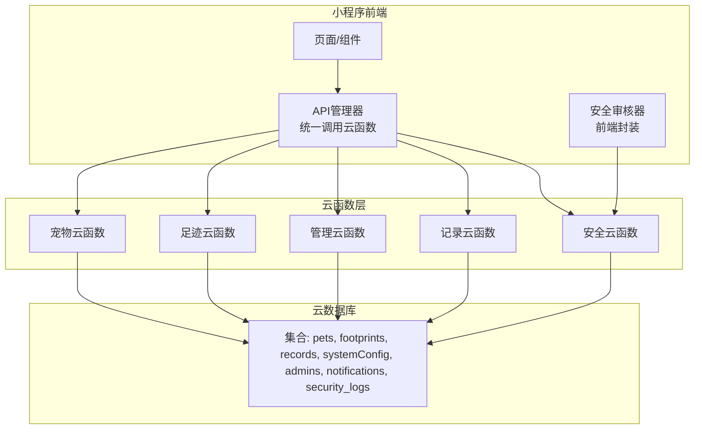
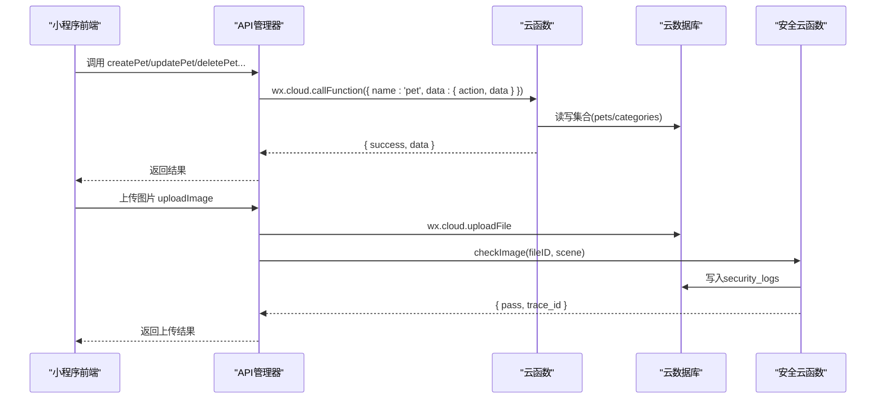
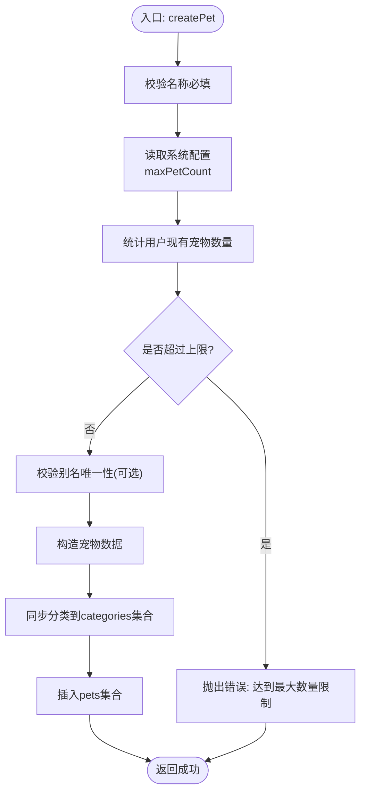
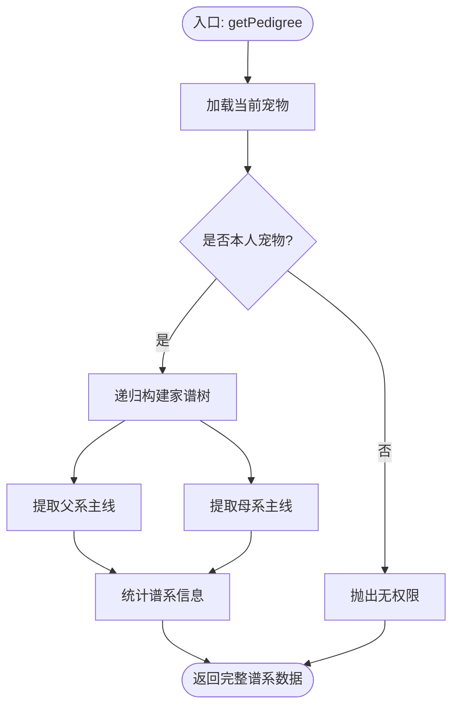
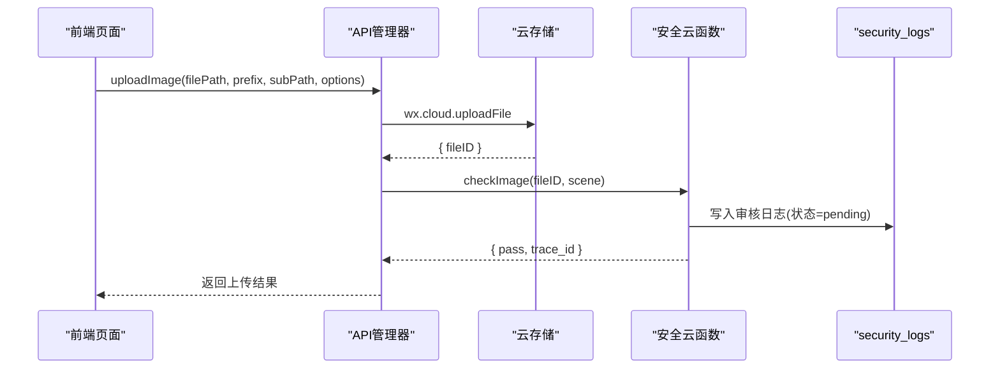
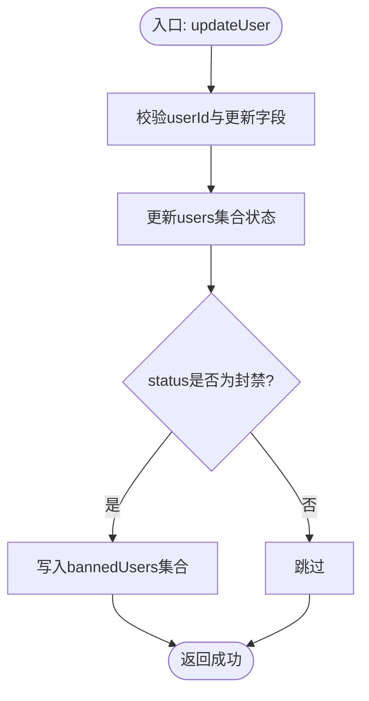
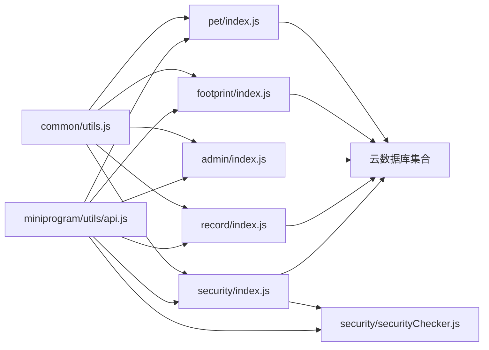

# 内容管理API

<cite>
**本文引用的文件**
- [pet/index.js](file://cloudfunctions/pet/index.js)
- [footprint/index.js](file://cloudfunctions/footprint/index.js)
- [admin/index.js](file://cloudfunctions/admin/index.js)
- [record/index.js](file://cloudfunctions/record/index.js)
- [security/index.js](file://cloudfunctions/security/index.js)
- [securityChecker.js](file://cloudfunctions/security/securityChecker.js)
- [common/utils.js](file://cloudfunctions/common/utils.js)
- [api.js](file://miniprogram/utils/api.js)
- [category.js](file://miniprogram/utils/category.js)
- [securityChecker.js](file://miniprogram/utils/securityChecker.js)
- [database.sql](file://server-setup/database.sql)
- [app.js](file://miniprogram/app.js)
</cite>

## 目录
1. [简介](#简介)
2. [项目结构](#项目结构)
3. [核心组件](#核心组件)
4. [架构总览](#架构总览)
5. [详细组件分析](#详细组件分析)
6. [依赖关系分析](#依赖关系分析)
7. [性能考量](#性能考量)
8. [故障排查指南](#故障排查指南)
9. [结论](#结论)
10. [附录](#附录)

## 简介
本文件面向内容管理API，聚焦以下能力：
- 宠物信息管理：增删改查、谱系查询、分类与标签管理
- 足迹内容审核：图片/视频上传、内容安全审核、异步回调与通知
- 系统公告发布：系统配置管理、运营统计与报表
- 内容搜索过滤、批量操作与状态管理
- 审核流程、违规处理与内容溯源
- 分类管理、标签系统与推荐算法（概念性说明）
- API调用示例与运营工具集成指南

## 项目结构
该项目采用“云开发 + 小程序前端”的分层架构：
- 云函数层：提供REST风格的云函数接口，按模块拆分（pet、footprint、admin、record、security等）
- 前端小程序：封装统一API管理器，调用云函数并处理安全审核与上传
- 数据库：云数据库集合（pets、footprints、records、systemConfig等）与MySQL数据库（用于历史迁移或补充）

图表来源
- [pet/index.js:45-82](file://cloudfunctions/pet/index.js#L45-L82)
- [footprint/index.js:9-32](file://cloudfunctions/footprint/index.js#L9-L32)
- [admin/index.js:27-71](file://cloudfunctions/admin/index.js#L27-L71)
- [record/index.js:10-35](file://cloudfunctions/record/index.js#L10-L35)
- [security/index.js:15-64](file://cloudfunctions/security/index.js#L15-L64)

章节来源
- [pet/index.js:1-82](file://cloudfunctions/pet/index.js#L1-L82)
- [footprint/index.js:1-32](file://cloudfunctions/footprint/index.js#L1-L32)
- [admin/index.js:1-71](file://cloudfunctions/admin/index.js#L1-L71)
- [record/index.js:1-35](file://cloudfunctions/record/index.js#L1-L35)
- [security/index.js:1-64](file://cloudfunctions/security/index.js#L1-L64)

## 核心组件
- 宠物管理云函数：提供宠物增删改查、谱系查询、分类管理等能力
- 足迹管理云函数：提供足迹列表、详情、创建、更新、删除
- 管理云函数：提供运营统计、用户/宠物/足迹查询、系统配置管理、用户封禁/解封
- 记录云函数：提供日常记录、产蛋/出苗/交配等专项记录的增删改查
- 安全云函数：提供图片/文本审核、审核日志、未读通知、待处理审核记录查询
- 前端API管理器：统一封装云函数调用、上传、批量操作、安全审核
- 安全审核器（前端）：封装对安全云函数的调用，支持同步/异步审核

章节来源
- [pet/index.js:45-82](file://cloudfunctions/pet/index.js#L45-L82)
- [footprint/index.js:9-32](file://cloudfunctions/footprint/index.js#L9-L32)
- [admin/index.js:27-71](file://cloudfunctions/admin/index.js#L27-L71)
- [record/index.js:10-35](file://cloudfunctions/record/index.js#L10-L35)
- [security/index.js:15-64](file://cloudfunctions/security/index.js#L15-L64)
- [api.js:4-208](file://miniprogram/utils/api.js#L4-L208)
- [securityChecker.js:13-122](file://miniprogram/utils/securityChecker.js#L13-L122)

## 架构总览
内容管理API围绕“云函数 + 云数据库 + 前端SDK”展开，核心交互如下：

图表来源
- [api.js:12-38](file://miniprogram/utils/api.js#L12-L38)
- [pet/index.js:45-82](file://cloudfunctions/pet/index.js#L45-L82)
- [security/index.js:15-64](file://cloudfunctions/security/index.js#L15-L64)

## 详细组件分析

### 宠物信息管理API
- 功能点
  - 创建宠物：校验名称、用户上限、别名唯一性，自动同步分类
  - 列表查询：支持按系列/性别/搜索文本过滤，分页
  - 详情查询：按ID查询并鉴权
  - 更新宠物：别名唯一性校验（排除自身）、公开状态切换、分类同步
  - 删除宠物：鉴权+级联删除关联记录
  - 公开列表/详情：按用户ID查询公开宠物，附带名片信息与最新产蛋/交配记录
  - 谱系查询：递归构建家谱树，提取父系/母系主线，统计谱系信息
  - 分类管理：获取、新增、更新、删除分类，自动去重与同步

- 关键流程（创建宠物）

图表来源
- [pet/index.js:84-138](file://cloudfunctions/pet/index.js#L84-L138)

- 关键流程（谱系查询）

图表来源
- [pet/index.js:376-412](file://cloudfunctions/pet/index.js#L376-L412)

章节来源
- [pet/index.js:84-412](file://cloudfunctions/pet/index.js#L84-L412)

### 足迹内容审核API
- 功能点
  - 创建足迹：校验图片数量上限、保存基础字段
  - 列表/详情/更新/删除：均做权限校验
  - 安全审核：图片/文本审核、异步回调、通知与待处理记录查询
  - 审核日志：记录fileID、场景、traceId、状态、创建时间

- 关键流程（图片上传与安全审核）

图表来源
- [api.js:156-178](file://miniprogram/utils/api.js#L156-L178)
- [security/index.js:15-64](file://cloudfunctions/security/index.js#L15-L64)
- [securityChecker.js:163-190](file://cloudfunctions/security/securityChecker.js#L163-L190)

章节来源
- [footprint/index.js:34-159](file://cloudfunctions/footprint/index.js#L34-L159)
- [security/index.js:15-200](file://cloudfunctions/security/index.js#L15-L200)
- [securityChecker.js:30-206](file://cloudfunctions/security/securityChecker.js#L30-L206)
- [securityChecker.js:13-122](file://miniprogram/utils/securityChecker.js#L13-L122)

### 系统公告与运营管理API
- 功能点
  - 统计数据：用户/宠物/足迹总量、今日活跃、用户/宠物增长率
  - 用户管理：列表、搜索、状态变更、封禁/解封、删除（事务）
  - 宠物管理：列表、搜索、分类过滤
  - 足迹管理：列表、搜索、时间范围过滤
  - 最近动态：取最新足迹
  - 用户增长趋势：按自然周统计新增用户
  - 宠物类型分布：按分类统计占比
  - 系统配置：读取/更新（含更新人、更新时间）

- 关键流程（用户封禁）

图表来源
- [admin/index.js:177-217](file://cloudfunctions/admin/index.js#L177-L217)

章节来源
- [admin/index.js:74-533](file://cloudfunctions/admin/index.js#L74-L533)

### 记录管理API
- 功能点
  - 日常记录：文本、日期、时间、照片
  - 产蛋/出苗/交配记录：附加专项字段
  - QR缓存更新：静默更新记录的二维码缓存字段
  - 权限控制：仅记录创建者可更新/删除

章节来源
- [record/index.js:37-191](file://cloudfunctions/record/index.js#L37-L191)

### 分类与标签系统
- 分类管理
  - 宠物分类：云端维护categories集合，自动去重合并
  - 本地缺失分类同步：前端在本地编辑时自动补齐云端分类
- 标签系统
  - 当前代码未见显式“标签”字段；可通过扩展字段或新增集合实现

章节来源
- [pet/index.js:517-688](file://cloudfunctions/pet/index.js#L517-L688)
- [category.js:29-59](file://miniprogram/utils/category.js#L29-L59)

### 推荐算法（概念性说明）
- 当前仓库未实现推荐算法，建议思路：
  - 基于用户行为（浏览、点赞、收藏）与内容特征（类别、标签、时间）构建向量
  - 使用协同过滤或内容相似度进行召回与排序
  - 结合系统配置与运营策略（如热门、置顶）进行混合排序

## 依赖关系分析
- 云函数依赖
  - 通用工具：统一响应、错误处理、OpenID获取、ID标准化
  - 数据库：集合读写、聚合查询、事务（管理端删除用户）
- 前端依赖
  - API管理器：统一封装云函数调用、上传、批量操作
  - 安全审核器：封装对安全云函数的调用，支持同步/异步
- 数据库依赖
  - 宠物/足迹/记录/系统配置/管理员/通知/安全日志等集合

图表来源
- [common/utils.js:1-69](file://cloudfunctions/common/utils.js#L1-L69)
- [pet/index.js:1-10](file://cloudfunctions/pet/index.js#L1-L10)
- [footprint/index.js:1-10](file://cloudfunctions/footprint/index.js#L1-L10)
- [admin/index.js:1-10](file://cloudfunctions/admin/index.js#L1-L10)
- [record/index.js:1-10](file://cloudfunctions/record/index.js#L1-L10)
- [security/index.js:1-10](file://cloudfunctions/security/index.js#L1-L10)
- [api.js:1-208](file://miniprogram/utils/api.js#L1-L208)
- [securityChecker.js:1-206](file://cloudfunctions/security/securityChecker.js#L1-L206)

章节来源
- [common/utils.js:1-69](file://cloudfunctions/common/utils.js#L1-L69)
- [api.js:1-208](file://miniprogram/utils/api.js#L1-L208)

## 性能考量
- 分页与索引
  - 列表查询均支持pageNum/pageSize，建议结合数据库索引优化（如按创建时间倒序）
- 并发与事务
  - 管理端删除用户使用事务，确保一致性
- 审核异步化
  - 图片审核通过异步回调，避免阻塞上传流程
- 缓存与日志
  - QR缓存字段用于减少重复生成成本
  - 审核日志记录traceId与状态，便于溯源

## 故障排查指南
- 常见错误
  - 未知操作：action不在支持列表
  - 权限不足：非本人数据或无管理员权限
  - 参数缺失：缺少必要字段（如ID、名称、场景）
  - 上传失败：云存储上传异常或审核服务不可用
- 审核问题
  - 未读通知：调用获取未读通知接口
  - 待处理审核：查询pendingChecks，超时自动标记timeout
- 建议排查步骤
  - 检查云函数返回的success/message/error
  - 核对OpenID与数据归属
  - 查看security_logs中的traceId与状态
  - 确认系统配置项（如最大宠物数量、最大图片数）

章节来源
- [pet/index.js:78-82](file://cloudfunctions/pet/index.js#L78-L82)
- [admin/index.js:35-38](file://cloudfunctions/admin/index.js#L35-L38)
- [security/index.js:69-98](file://cloudfunctions/security/index.js#L69-L98)
- [security/index.js:151-200](file://cloudfunctions/security/index.js#L151-L200)

## 结论
本内容管理API以云函数为核心，覆盖宠物信息、足迹审核、运营统计与系统配置等关键能力。通过统一的API管理器与安全审核器，实现了前后端解耦与审核异步化。建议后续增强标签系统、引入推荐算法，并完善批量操作与状态机管理，以进一步提升运营效率与用户体验。

## 附录

### API调用示例（路径参考）
- 宠物管理
  - 创建宠物：[createPet:84-138](file://cloudfunctions/pet/index.js#L84-L138)
  - 获取列表：[getPetList:140-180](file://cloudfunctions/pet/index.js#L140-L180)
  - 获取谱系：[getPedigree:376-412](file://cloudfunctions/pet/index.js#L376-L412)
  - 获取分类：[getCategories:517-524](file://cloudfunctions/pet/index.js#L517-L524)
- 足迹管理
  - 创建足迹：[createFootprint:34-72](file://cloudfunctions/footprint/index.js#L34-L72)
  - 获取列表：[getFootprintList:74-107](file://cloudfunctions/footprint/index.js#L74-L107)
- 安全审核
  - 图片审核：[checkImage:23-27](file://cloudfunctions/security/index.js#L23-L27)
  - 文本审核：[checkText:29-33](file://cloudfunctions/security/index.js#L29-L33)
  - 审核日志：[checkAndLog:35-39](file://cloudfunctions/security/index.js#L35-L39)
- 运营管理
  - 获取统计：[getStats:74-115](file://cloudfunctions/admin/index.js#L74-L115)
  - 用户列表：[getUsers:118-174](file://cloudfunctions/admin/index.js#L118-L174)
  - 更新用户：[updateUser:177-217](file://cloudfunctions/admin/index.js#L177-L217)
  - 删除用户（事务）：[deleteUser:220-258](file://cloudfunctions/admin/index.js#L220-L258)
  - 系统配置：[getConfig:435-473](file://cloudfunctions/admin/index.js#L435-L473)，[updateConfig:476-508](file://cloudfunctions/admin/index.js#L476-L508)

### 运营工具集成指南
- 前端API封装
  - 统一调用云函数：[APIManager.callCloudFunction:12-38](file://miniprogram/utils/api.js#L12-L38)
  - 上传图片并异步审核：[uploadImage:156-178](file://miniprogram/utils/api.js#L156-L178)
  - 批量上传：[uploadImages:183-190](file://miniprogram/utils/api.js#L183-L190)
- 安全审核
  - 前端封装：[SecurityChecker:13-122](file://miniprogram/utils/securityChecker.js#L13-L122)
  - 云函数实现：[securityChecker.js:30-206](file://cloudfunctions/security/securityChecker.js#L30-L206)
- 系统配置加载
  - 应用启动时加载配置：[app.js:17-48](file://miniprogram/app.js#L17-L48)
- 数据库结构参考
  - MySQL表结构：[database.sql:1-221](file://server-setup/database.sql#L1-L221)