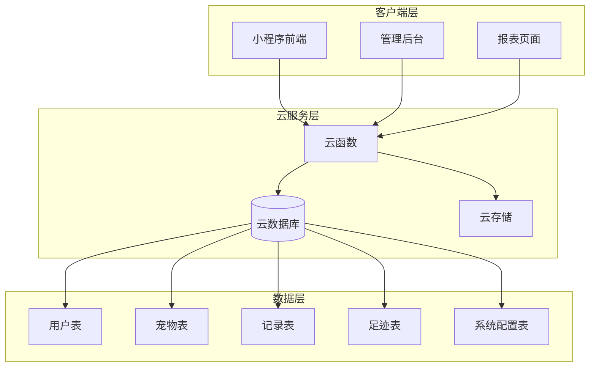
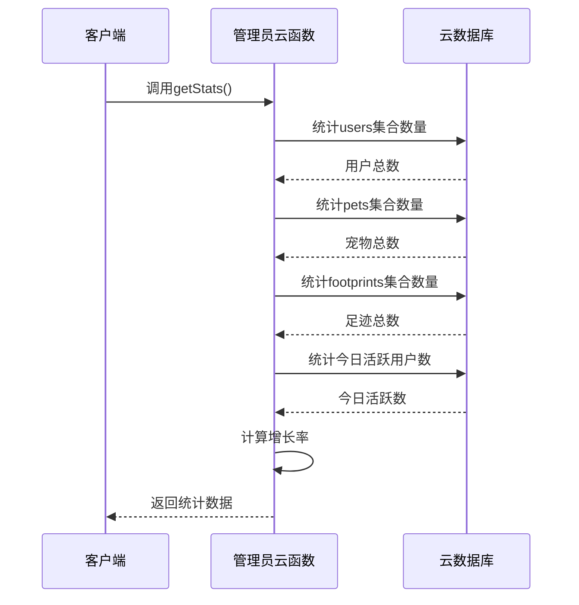
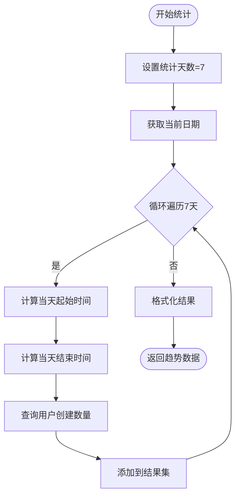
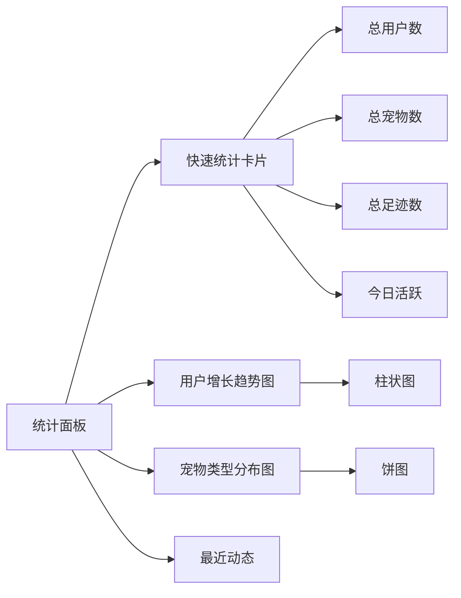
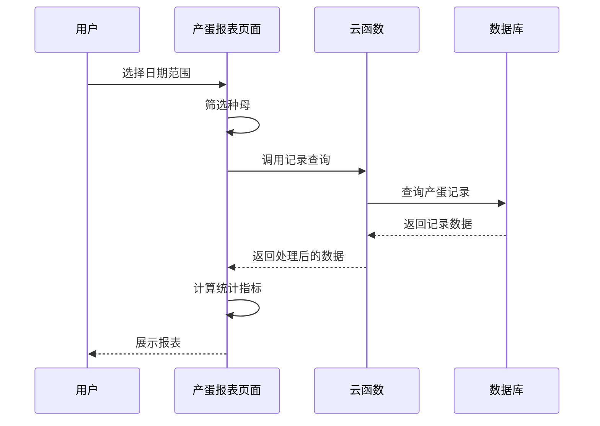
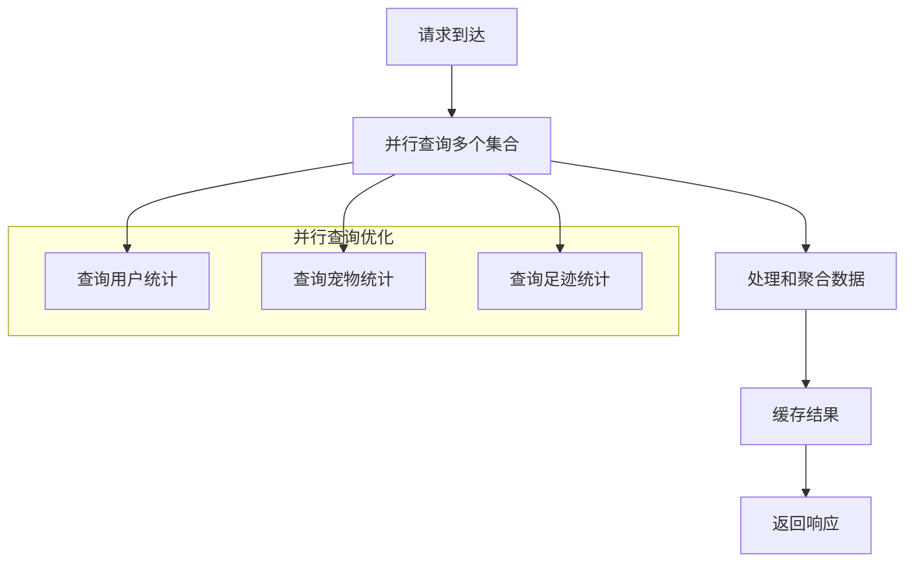

# 数据统计API

<cite>
**本文档引用的文件**
- [admin/index.js](file://cloudfunctions/admin/index.js)
- [pet/index.js](file://cloudfunctions/pet/index.js)
- [record/index.js](file://cloudfunctions/record/index.js)
- [common/utils.js](file://cloudfunctions/common/utils.js)
- [api.js](file://miniprogram/utils/api.js)
- [admin/index.js](file://miniprogram/subpkg-admin/pages/admin/index.js)
- [admin/index.js](file://miniprogram/subpkg-admin/pages/admin/index.wxml)
- [admin/index.js](file://miniprogram/subpkg-admin/pages/admin/index.wxss)
- [users.js](file://miniprogram/subpkg-admin/pages/admin/users.js)
- [pets.js](file://miniprogram/subpkg-admin/pages/admin/pets.js)
- [public/index.js](file://miniprogram/subpkg-report/pages/public/index.js)
- [egg-report/index.js](file://miniprogram/subpkg-report/pages/egg-report/index.js)
- [hatch-report/index.js](file://miniprogram/subpkg-report/pages/hatch-report/index.js)
- [database.sql](file://server-setup/database.sql)
</cite>

## 目录
1. [项目概述](#项目概述)
2. [系统架构](#系统架构)
3. [核心统计功能](#核心统计功能)
4. [API接口规范](#api接口规范)
5. [数据统计指标](#数据统计指标)
6. [图表展示与可视化](#图表展示与可视化)
7. [报表生成功能](#报表生成功能)
8. [性能优化策略](#性能优化策略)
9. [故障排查指南](#故障排查指南)
10. [总结](#总结)

## 项目概述

养龟档案是一个专为龟类爱好者设计的数字化管理平台，提供宠物档案管理、成长记录追踪、繁殖统计分析等功能。数据统计API作为系统的核心组件，负责收集、处理和展示各类业务统计数据。

该系统采用微信小程序+云开发的技术架构，通过云函数提供RESTful风格的API接口，支持实时数据计算、历史数据分析和趋势预测功能。

## 系统架构



**图表来源**
- [admin/index.js:1-71](file://cloudfunctions/admin/index.js#L1-71)
- [pet/index.js:45-82](file://cloudfunctions/pet/index.js#L45-82)
- [record/index.js:10-35](file://cloudfunctions/record/index.js#L10-35)

## 核心统计功能

### 整体统计数据

系统提供实时的整体统计数据，包括用户总数、宠物总数、足迹总数和今日活跃用户数。



**图表来源**
- [admin/index.js:74-115](file://cloudfunctions/admin/index.js#L74-115)

### 用户增长趋势分析

系统支持按7天周期的用户增长趋势分析，提供每日新增用户数量统计。



**图表来源**
- [admin/index.js:382-410](file://cloudfunctions/admin/index.js#L382-410)

### 宠物类型分布统计

系统提供宠物类型的分布统计，支持按品种分类的饼状图展示。

**章节来源**
- [admin/index.js:412-431](file://cloudfunctions/admin/index.js#L412-431)

## API接口规范

### 管理员统计接口

#### 获取整体统计数据
- **接口地址**: `admin/getStats`
- **请求方式**: GET
- **请求参数**: 无
- **响应数据**:
  - `totalUsers`: 总用户数
  - `totalPets`: 总宠物数
  - `totalFootprints`: 总足迹数
  - `todayActive`: 今日活跃用户数
  - `userGrowth`: 用户增长率 (%)
  - `petGrowth`: 宠物增长率 (%)

#### 获取用户增长趋势
- **接口地址**: `admin/getUserGrowth`
- **请求方式**: GET
- **请求参数**:
  - `days`: 统计天数，默认7天
- **响应数据**: 数组格式，包含每日用户增长数据

#### 获取宠物类型分布
- **接口地址**: `admin/getPetDistribution`
- **请求方式**: GET
- **请求参数**: 无
- **响应数据**: 数组格式，包含各类别统计信息

### 前端调用示例

```javascript
// 获取整体统计数据
const stats = await wx.cloud.callFunction({
  name: 'admin',
  data: {
    action: 'getStats'
  }
})

// 获取用户增长趋势（14天）
const growth = await wx.cloud.callFunction({
  name: 'admin',
  data: {
    action: 'getUserGrowth',
    days: 14
  }
})

// 获取宠物类型分布
const distribution = await wx.cloud.callFunction({
  name: 'admin',
  data: {
    action: 'getPetDistribution'
  }
})
```

**章节来源**
- [admin/index.js:41-71](file://cloudfunctions/admin/index.js#L41-71)
- [admin/index.js:382-431](file://cloudfunctions/admin/index.js#L382-431)

## 数据统计指标

### 核心指标定义

| 指标名称 | 计算公式 | 数据来源 | 更新频率 |
|---------|---------|---------|---------|
| 总用户数 | users集合总数 | 用户表 | 实时 |
| 总宠物数 | pets集合总数 | 宠物表 | 实时 |
| 总足迹数 | footprints集合总数 | 足迹表 | 实时 |
| 今日活跃用户数 | 当日创建足迹的用户数 | 足迹表createdAt | 实时 |
| 用户增长率 | (本周新增用户/上周新增用户) × 100% | 用户表createdAt | 每日 |
| 宠物增长率 | (本周新增宠物/上周新增宠物) × 100% | 宠物表createdAt | 每日 |

### 统计算法实现

#### 增长率计算算法
```mermaid
flowchart TD
Start([开始计算]) --> GetLastWeek[获取上周日期范围]
GetLastWeek --> CountNewUsers[统计上周新增用户]
CountNewUsers --> CountTotalUsers[统计总用户数]
CountTotalUsers --> CalcGrowth[计算增长率]
CalcGrowth --> CheckOldUsers{上周用户数>0?}
CheckOldUsers --> |是| CalcPercentage[(新增用户/上周用户)×100%]
CheckOldUsers --> |否| SetZero[设为0%]
CalcPercentage --> FormatResult[格式化结果]
SetZero --> FormatResult
FormatResult --> End([返回结果])
```

**图表来源**
- [admin/index.js:89-105](file://cloudfunctions/admin/index.js#L89-105)

**章节来源**
- [admin/index.js:89-114](file://cloudfunctions/admin/index.js#L89-114)

## 图表展示与可视化

### 管理后台统计面板

系统提供直观的统计面板，包含卡片式统计数据和图表展示：



**图表来源**
- [admin/index.js:1-123](file://miniprogram/subpkg-admin/pages/admin/index.js#L1-123)
- [admin/index.js:54-88](file://miniprogram/subpkg-admin/pages/admin/index.wxml#L54-L88)

### 前端数据处理逻辑

```javascript
// 并行加载多维统计数据
const [statsRes, growthRes, distRes, activitiesRes] = await Promise.all([
  this.callAdminAPI('getStats'),
  this.callAdminAPI('getUserGrowth', { days: 7 }),
  this.callAdminAPI('getPetDistribution'),
  this.callAdminAPI('getRecentActivities')
])

// 更新界面状态
this.setData({
  stats: statsRes.data,
  userChartData: growthRes.data,
  petDistribution: distRes.data,
  recentActivities: activitiesRes.data
})
```

**章节来源**
- [admin/index.js:38-82](file://miniprogram/subpkg-admin/pages/admin/index.js#L38-82)

## 报表生成功能

### 产蛋报表

系统提供详细的产蛋统计报表，支持按时间范围、种母筛选和多种排序方式。



**图表来源**
- [egg-report/index.js:178-367](file://miniprogram/subpkg-report/pages/egg-report/index.js#L178-367)

### 出苗报表

提供出苗统计分析，支持按种母、时间范围筛选和质量等级统计。

**章节来源**
- [hatch-report/index.js:146-301](file://miniprogram/subpkg-report/pages/hatch-report/index.js#L146-301)

### 公开展示页面

支持用户公开档案的统计展示，便于分享和交流。

**章节来源**
- [public/index.js:100-210](file://miniprogram/subpkg-report/pages/public/index.js#L100-210)

## 性能优化策略

### 数据库查询优化

1. **索引优化**: 关键查询字段建立适当索引
   - 用户表: openid, phone, status
   - 宠物表: openid, category, status
   - 记录表: openid, pet_id, type, date

2. **查询优化**: 使用复合查询条件减少扫描范围

3. **分页查询**: 大数据量场景使用分页机制

### 云函数性能优化



**图表来源**
- [admin/index.js:75-79](file://cloudfunctions/admin/index.js#L75-79)

### 前端性能优化

1. **懒加载**: 图片和数据按需加载
2. **缓存策略**: 本地缓存常用数据
3. **防抖处理**: 搜索和筛选操作防抖
4. **虚拟滚动**: 大列表数据虚拟化

**章节来源**
- [users.js:62-67](file://miniprogram/subpkg-admin/pages/admin/users.js#L62-67)
- [pets.js:58-63](file://miniprogram/subpkg-admin/pages/admin/pets.js#L58-63)

## 故障排查指南

### 常见问题及解决方案

#### 云函数调用失败
- **症状**: API返回useFallback标志
- **原因**: 网络异常或云函数不可用
- **解决方案**: 检查网络连接，重试请求

#### 权限不足
- **症状**: 返回无管理员权限错误
- **原因**: 用户不是管理员身份
- **解决方案**: 确认管理员配置和用户身份

#### 数据查询超时
- **症状**: 查询响应缓慢或超时
- **原因**: 数据量过大或查询条件不当
- **解决方案**: 优化查询条件，增加索引

### 错误处理机制

```javascript
try {
  const result = await wx.cloud.callFunction({
    name: 'admin',
    data: { action: 'getStats' }
  })
  
  if (!result.result.success) {
    throw new Error(result.result.message)
  }
  
  return result.result.data
} catch (error) {
  console.error('统计API调用失败:', error)
  // 显示错误提示
  wx.showToast({
    title: '数据加载失败',
    icon: 'none'
  })
}
```

**章节来源**
- [api.js:12-38](file://miniprogram/utils/api.js#L12-38)

## 总结

数据统计API为养龟档案系统提供了完整的统计分析能力，包括：

1. **实时统计**: 提供系统整体运行状态的实时监控
2. **趋势分析**: 支持用户增长趋势和业务发展轨迹分析
3. **分布统计**: 宠物类型分布等结构化数据分析
4. **报表展示**: 产蛋、出苗等专业统计报表
5. **性能优化**: 多层次的性能优化策略确保系统稳定运行

通过标准化的API接口和完善的错误处理机制，系统能够为用户提供准确、及时的数据洞察，支持业务决策和运营分析。