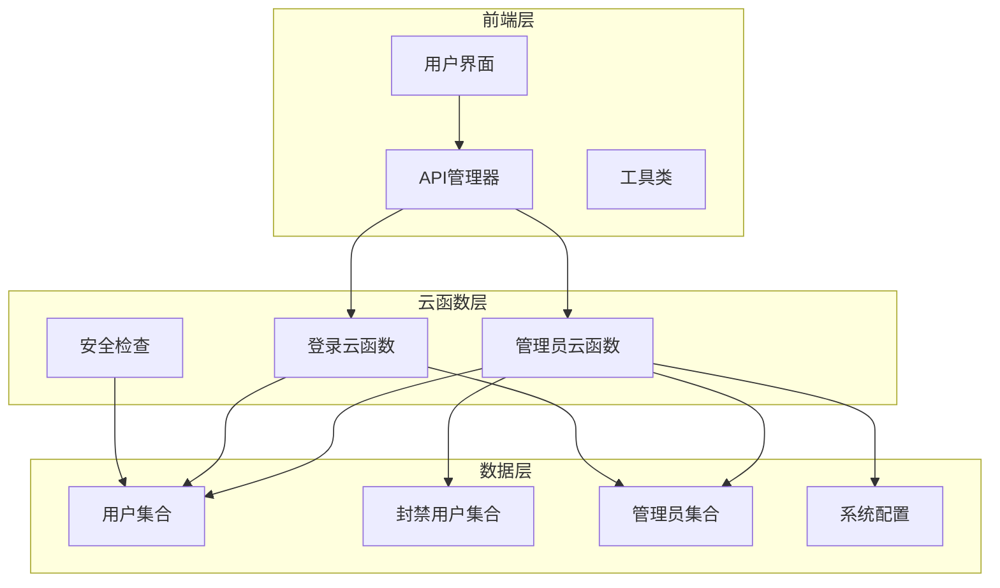
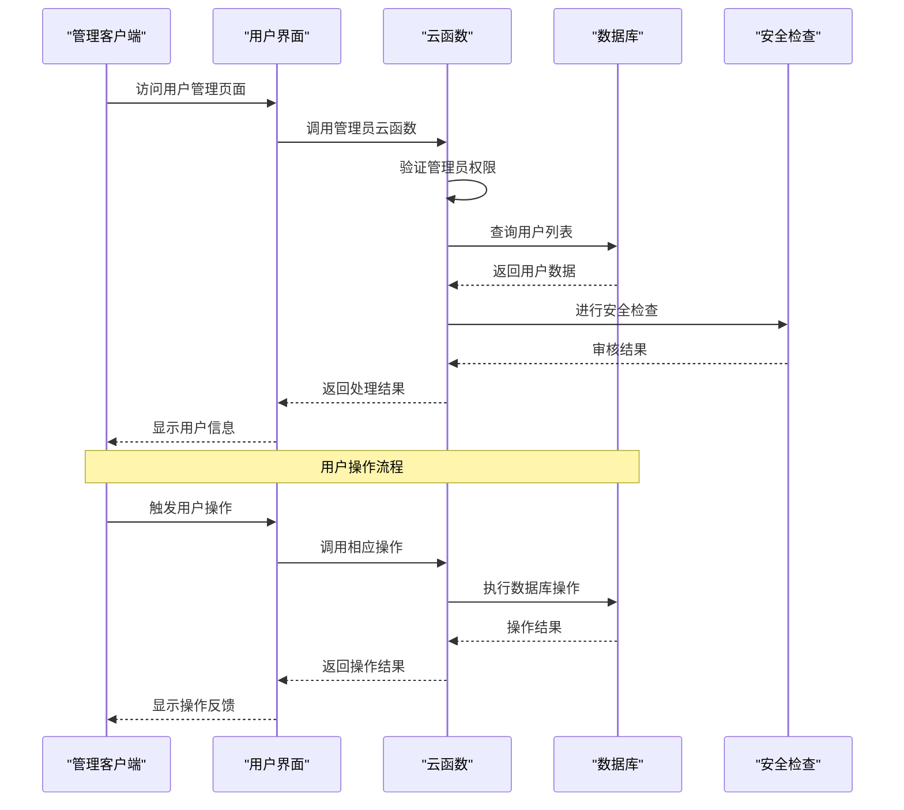
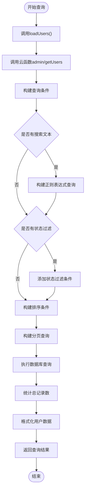
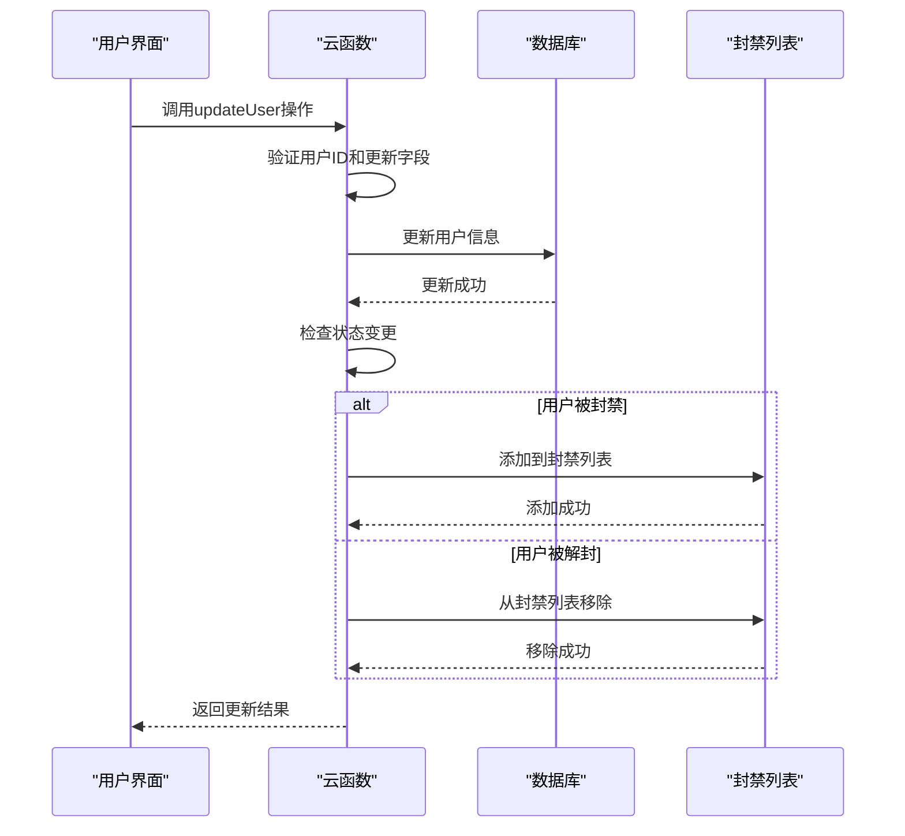
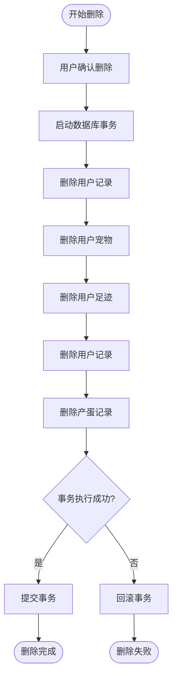
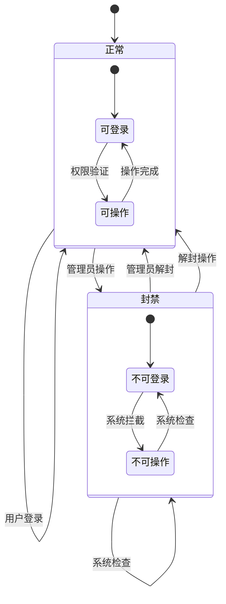
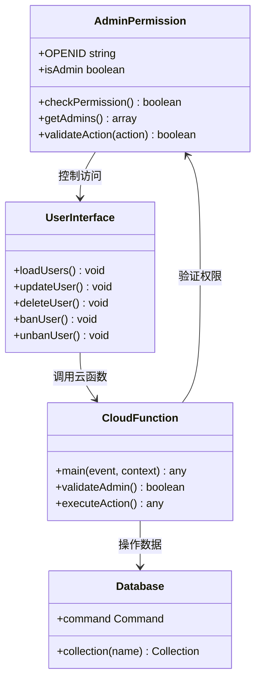
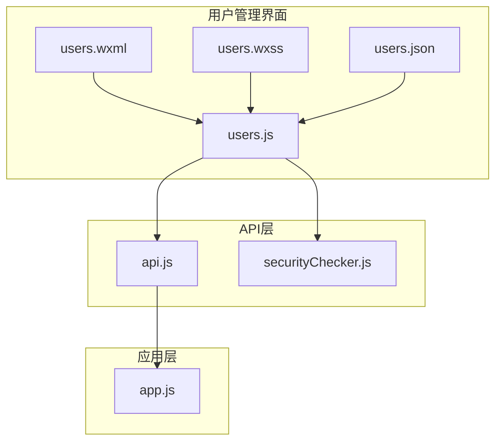
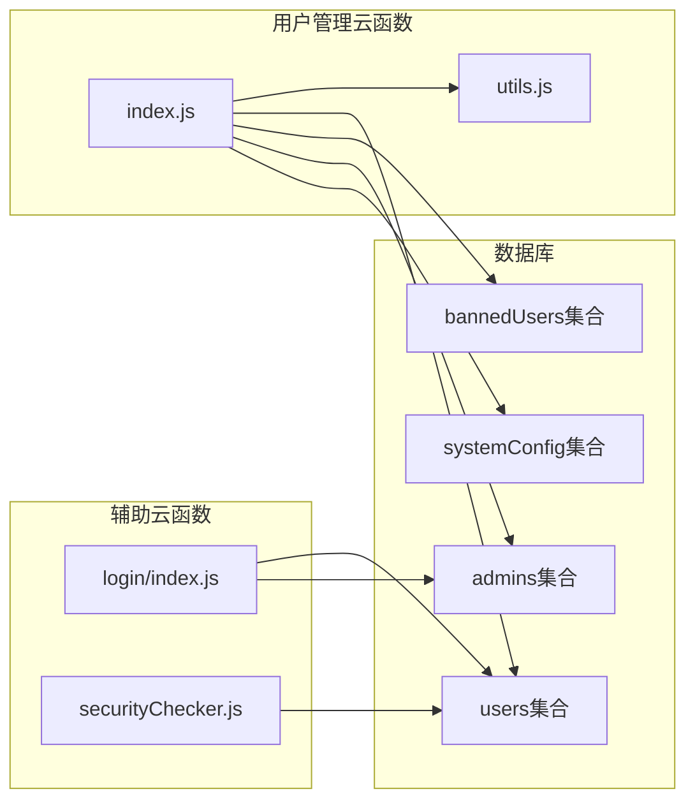
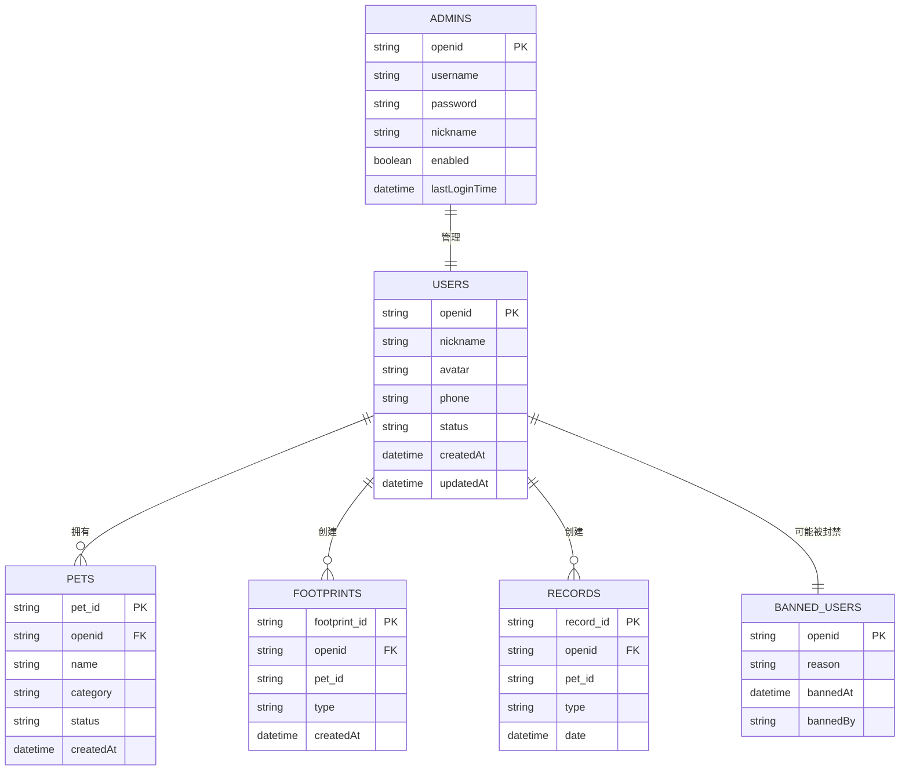

# 用户管理API

<cite>
**本文档引用的文件**
- [users.js](file://miniprogram/subpkg-admin/pages/admin/users.js)
- [users.json](file://miniprogram/subpkg-admin/pages/admin/users.json)
- [users.wxss](file://miniprogram/subpkg-admin/pages/admin/users.wxss)
- [users.wxml](file://miniprogram/subpkg-admin/pages/admin/users.wxml)
- [api.js](file://miniprogram/utils/api.js)
- [index.js](file://cloudfunctions/admin/index.js)
- [utils.js](file://cloudfunctions/admin/utils.js)
- [securityChecker.js](file://cloudfunctions/common/securityChecker.js)
- [login/index.js](file://cloudfunctions/login/index.js)
- [database.sql](file://server-setup/database.sql)
- [app.js](file://miniprogram/app.js)
</cite>

## 目录
1. [简介](#简介)
2. [项目结构](#项目结构)
3. [核心组件](#核心组件)
4. [架构概览](#架构概览)
5. [详细组件分析](#详细组件分析)
6. [依赖关系分析](#依赖关系分析)
7. [性能考虑](#性能考虑)
8. [故障排除指南](#故障排除指南)
9. [结论](#结论)
10. [附录](#附录)

## 简介
用户管理API是养龟档案管理系统的核心功能模块，负责管理平台用户账户、权限控制和数据一致性。该系统基于微信小程序云开发架构，提供完整的用户生命周期管理能力，包括用户列表查询、信息更新、删除操作、状态管理和封禁/解封机制。

系统采用前后端分离的设计模式，前端通过云函数调用实现用户管理功能，后端云函数提供统一的权限验证和数据操作接口。支持用户搜索过滤、状态管理、分页查询等特性，并具备完善的权限控制和操作审计功能。

## 项目结构
用户管理功能主要分布在以下三个层次：



**图表来源**
- [users.js:1-288](file://miniprogram/subpkg-admin/pages/admin/users.js#L1-L288)
- [index.js:1-533](file://cloudfunctions/admin/index.js#L1-L533)
- [login/index.js:1-53](file://cloudfunctions/login/index.js#L1-L53)

**章节来源**
- [users.js:1-288](file://miniprogram/subpkg-admin/pages/admin/users.js#L1-L288)
- [index.js:1-533](file://cloudfunctions/admin/index.js#L1-L533)

## 核心组件
用户管理API由多个核心组件协同工作，形成完整的用户管理体系：

### 前端用户界面组件
- **用户列表页面**：提供用户信息展示、搜索过滤、状态管理功能
- **操作按钮组**：包含编辑、封禁、解封、删除等用户管理操作
- **搜索和筛选**：支持按昵称、用户名、openid等多维度搜索
- **分页显示**：支持大数据量的分页加载和排序功能

### 云函数服务组件
- **管理员权限验证**：确保只有授权管理员可以执行用户管理操作
- **用户数据操作**：提供用户信息查询、更新、删除等核心功能
- **状态同步管理**：维护用户状态与封禁列表的一致性
- **事务性操作**：确保删除用户时的数据完整性

### 数据存储组件
- **用户集合**：存储用户基本信息、状态、权限等数据
- **封禁用户集合**：维护被封禁用户的黑名单管理
- **管理员集合**：存储系统管理员账户信息
- **系统配置集合**：提供系统级别的用户管理配置

**章节来源**
- [users.js:29-91](file://miniprogram/subpkg-admin/pages/admin/users.js#L29-L91)
- [index.js:117-174](file://cloudfunctions/admin/index.js#L117-L174)

## 架构概览
用户管理API采用三层架构设计，确保系统的可扩展性和可维护性：



**图表来源**
- [users.js:30-58](file://miniprogram/subpkg-admin/pages/admin/users.js#L30-L58)
- [index.js:27-71](file://cloudfunctions/admin/index.js#L27-L71)

系统架构特点：
- **权限隔离**：通过管理员权限验证确保操作安全性
- **数据一致性**：使用事务确保批量操作的原子性
- **状态同步**：维护用户状态与封禁列表的实时同步
- **错误处理**：完善的异常捕获和错误响应机制

## 详细组件分析

### 用户列表查询组件
用户列表查询功能提供了强大的数据检索和展示能力：



**图表来源**
- [users.js:30-58](file://miniprogram/subpkg-admin/pages/admin/users.js#L30-L58)
- [index.js:117-174](file://cloudfunctions/admin/index.js#L117-L174)

查询功能特性：
- **多字段搜索**：支持昵称、用户名、真实姓名、openid的模糊搜索
- **状态过滤**：按用户状态（正常、封禁）进行筛选
- **排序功能**：支持按创建时间、更新时间、昵称等字段排序
- **分页机制**：默认每页20条记录，支持自定义分页大小
- **数据统计**：同时返回用户总数和统计数据

**章节来源**
- [users.js:60-91](file://miniprogram/subpkg-admin/pages/admin/users.js#L60-L91)
- [index.js:117-174](file://cloudfunctions/admin/index.js#L117-L174)

### 用户信息更新组件
用户信息更新功能支持对用户基本信息的修改：



**图表来源**
- [users.js:131-155](file://miniprogram/subpkg-admin/pages/admin/users.js#L131-L155)
- [index.js:176-217](file://cloudfunctions/admin/index.js#L176-L217)

更新功能特性：
- **字段选择性更新**：仅更新传入的字段，避免不必要的数据修改
- **状态同步**：封禁/解封操作会同步更新封禁用户列表
- **权限验证**：确保只有管理员可以执行用户信息更新
- **错误处理**：提供详细的错误信息和回滚机制

**章节来源**
- [users.js:114-155](file://miniprogram/subpkg-admin/pages/admin/users.js#L114-L155)
- [index.js:176-217](file://cloudfunctions/admin/index.js#L176-L217)

### 用户删除组件
用户删除功能提供完整的数据清理能力：



**图表来源**
- [users.js:216-266](file://miniprogram/subpkg-admin/pages/admin/users.js#L216-L266)
- [index.js:219-258](file://cloudfunctions/admin/index.js#L219-L258)

删除功能特性：
- **事务性操作**：确保删除操作的原子性和一致性
- **级联删除**：自动删除用户相关的所有数据（宠物、足迹、记录等）
- **数据完整性**：通过事务保证删除操作的完整执行
- **错误恢复**：删除失败时自动回滚所有已执行的操作

**章节来源**
- [users.js:216-266](file://miniprogram/subpkg-admin/pages/admin/users.js#L216-L266)
- [index.js:219-258](file://cloudfunctions/admin/index.js#L219-L258)

### 用户封禁/解封机制
封禁/解封机制确保了平台的安全管理和用户行为控制：



**图表来源**
- [users.js:157-214](file://miniprogram/subpkg-admin/pages/admin/users.js#L157-L214)
- [index.js:196-214](file://cloudfunctions/admin/index.js#L196-L214)

机制特点：
- **实时生效**：封禁/解封操作立即生效
- **双向同步**：用户状态与封禁列表保持实时同步
- **审计追踪**：封禁操作会被记录在封禁列表中
- **权限控制**：仅管理员可以执行封禁/解封操作

**章节来源**
- [users.js:157-214](file://miniprogram/subpkg-admin/pages/admin/users.js#L157-L214)
- [index.js:196-214](file://cloudfunctions/admin/index.js#L196-L214)

### 权限控制系统
权限控制系统确保只有授权用户可以访问和操作用户管理功能：



**图表来源**
- [index.js:27-71](file://cloudfunctions/admin/index.js#L27-L71)
- [login/index.js:38-53](file://cloudfunctions/login/index.js#L38-L53)

权限控制特性：
- **管理员验证**：通过数据库中的管理员列表验证权限
- **动态权限**：支持从数据库动态获取管理员配置
- **权限继承**：管理员权限具有最高优先级
- **降级保护**：数据库查询失败时使用内置管理员列表

**章节来源**
- [index.js:11-25](file://cloudfunctions/admin/index.js#L11-L25)
- [login/index.js:24-53](file://cloudfunctions/login/index.js#L24-L53)

## 依赖关系分析

### 前端依赖关系
用户管理界面依赖于多个前端组件和工具类：



**图表来源**
- [users.js:1-288](file://miniprogram/subpkg-admin/pages/admin/users.js#L1-L288)
- [api.js:1-208](file://miniprogram/utils/api.js#L1-L208)

### 云函数依赖关系
云函数之间存在明确的依赖关系和职责分工：



**图表来源**
- [index.js:1-533](file://cloudfunctions/admin/index.js#L1-L533)
- [utils.js:1-69](file://cloudfunctions/admin/utils.js#L1-L69)
- [login/index.js:1-53](file://cloudfunctions/login/index.js#L1-L53)

### 数据库依赖关系
用户管理涉及多个数据库集合之间的复杂关系：



**图表来源**
- [database.sql:9-221](file://server-setup/database.sql#L9-L221)

**章节来源**
- [database.sql:9-221](file://server-setup/database.sql#L9-L221)

## 性能考虑
用户管理API在设计时充分考虑了性能优化和用户体验：

### 查询性能优化
- **索引设计**：用户表针对openid、phone、status等常用查询字段建立索引
- **分页查询**：默认每页20条记录，支持大数据量的高效分页
- **条件查询**：使用正则表达式进行模糊匹配，避免全表扫描
- **并发查询**：统计总数和数据查询采用并行处理提高效率

### 缓存策略
- **本地缓存**：用户信息和系统配置在本地存储中缓存
- **会话管理**：通过openid管理用户会话状态
- **预加载机制**：应用启动时预加载必要的用户数据

### 错误处理和重试
- **网络异常处理**：云函数调用失败时提供降级方案
- **超时控制**：设置合理的请求超时时间
- **重试机制**：关键操作支持有限次数的自动重试

## 故障排除指南

### 常见问题诊断
1. **权限不足问题**
   - 检查管理员列表配置
   - 验证用户openid是否在管理员集合中
   - 查看云函数日志中的权限验证错误

2. **数据查询异常**
   - 检查数据库连接状态
   - 验证查询条件的正确性
   - 查看索引使用情况

3. **事务执行失败**
   - 检查事务中的所有操作
   - 验证外键约束和数据完整性
   - 查看回滚日志

### 调试工具和方法
- **云函数日志**：通过微信开发者工具查看详细的错误日志
- **数据库监控**：监控查询性能和索引使用情况
- **网络调试**：使用开发者工具的网络面板分析API调用

**章节来源**
- [index.js:67-70](file://cloudfunctions/admin/index.js#L67-L70)
- [users.js:53-57](file://miniprogram/subpkg-admin/pages/admin/users.js#L53-L57)

## 结论
用户管理API提供了完整的用户生命周期管理解决方案，具有以下优势：

### 技术优势
- **权限安全**：严格的管理员权限验证机制
- **数据一致**：事务性操作确保数据完整性
- **扩展性强**：模块化的架构设计便于功能扩展
- **性能优化**：合理的索引设计和查询优化

### 功能特色
- **全面的用户管理**：支持用户查询、更新、删除、封禁等完整功能
- **灵活的搜索过滤**：多维度的搜索和筛选能力
- **状态管理**：完善的用户状态控制和同步机制
- **审计追踪**：完整的操作日志和审计功能

### 最佳实践建议
- **定期备份**：重要用户数据应定期备份
- **权限最小化**：遵循最小权限原则分配管理员权限
- **监控告警**：建立完善的系统监控和告警机制
- **性能监控**：持续监控系统性能指标

## 附录

### API调用示例
以下是一些常见的用户管理API调用示例：

#### 获取用户列表
```javascript
// 前端调用示例
wx.cloud.callFunction({
  name: 'admin',
  data: {
    action: 'getUsers',
    searchText: '张三',
    filterStatus: '正常',
    page: 1,
    pageSize: 20,
    sortField: 'createdAt',
    sortOrder: 'desc'
  }
})
```

#### 更新用户信息
```javascript
// 前端调用示例
wx.cloud.callFunction({
  name: 'admin',
  data: {
    action: 'updateUser',
    userId: 'user_id_123',
    nickname: '新昵称',
    status: '封禁'
  }
})
```

#### 删除用户
```javascript
// 前端调用示例
wx.cloud.callFunction({
  name: 'admin',
  data: {
    action: 'deleteUser',
    userId: 'user_id_123',
    openid: 'openid_456'
  }
})
```

### 集成指南
1. **环境准备**：确保微信云开发环境配置正确
2. **权限配置**：在管理员集合中添加管理员账户
3. **数据库初始化**：执行数据库脚本创建必要的集合
4. **前端配置**：配置用户管理界面的导航和权限
5. **测试验证**：进行全面的功能测试和性能测试

### 配置选项
- **最大用户数量**：通过系统配置限制用户数量
- **搜索范围**：配置搜索字段的匹配范围
- **分页大小**：调整每页显示的用户数量
- **状态选项**：自定义用户状态的枚举值

**章节来源**
- [users.js:30-58](file://miniprogram/subpkg-admin/pages/admin/users.js#L30-L58)
- [index.js:117-174](file://cloudfunctions/admin/index.js#L117-L174)