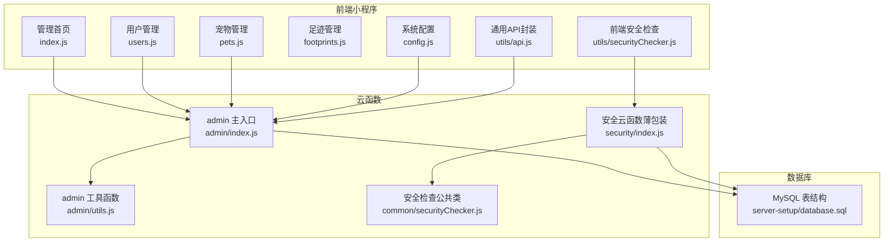
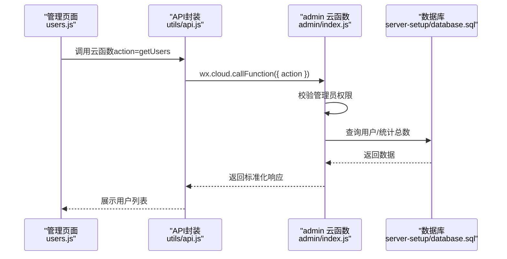
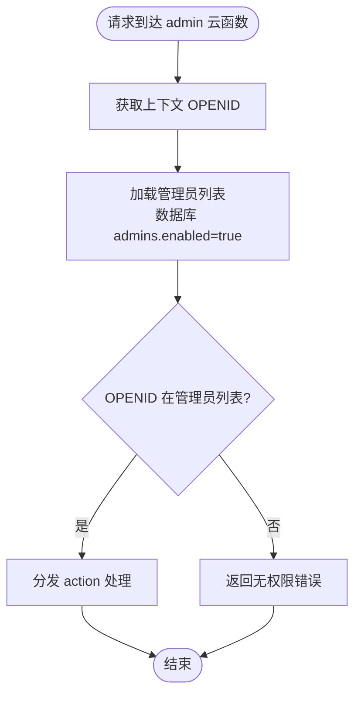
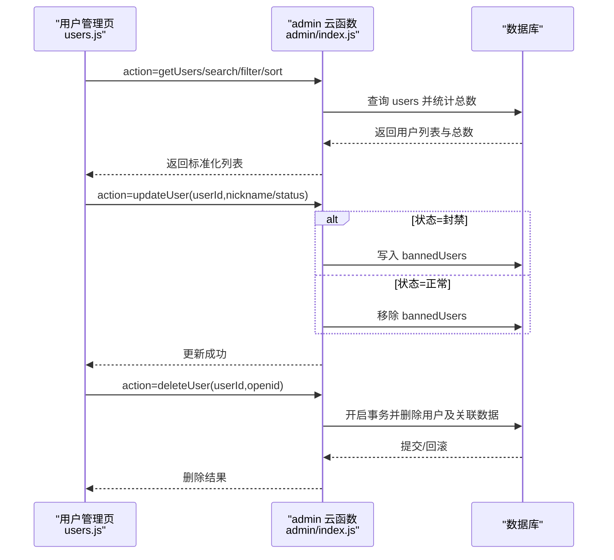
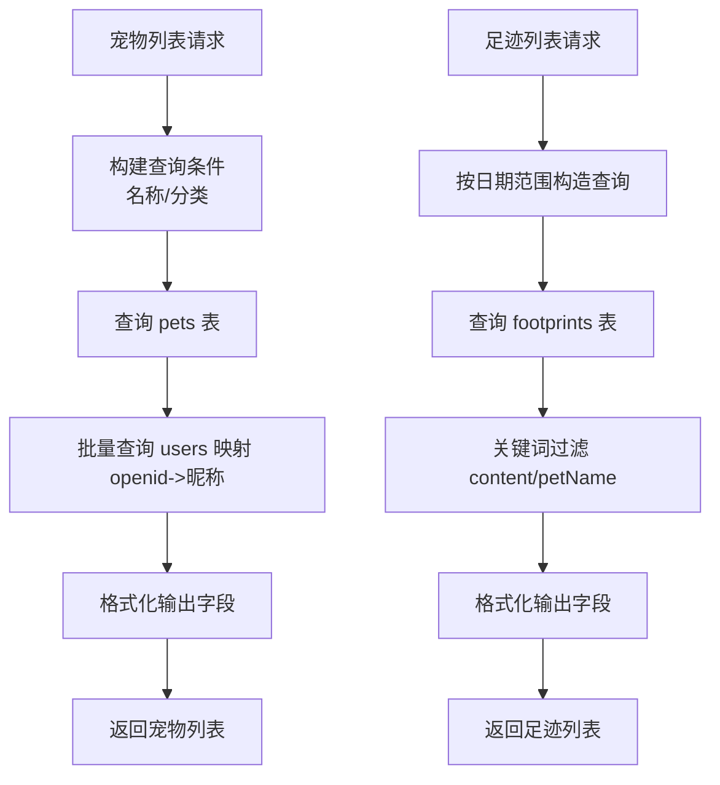
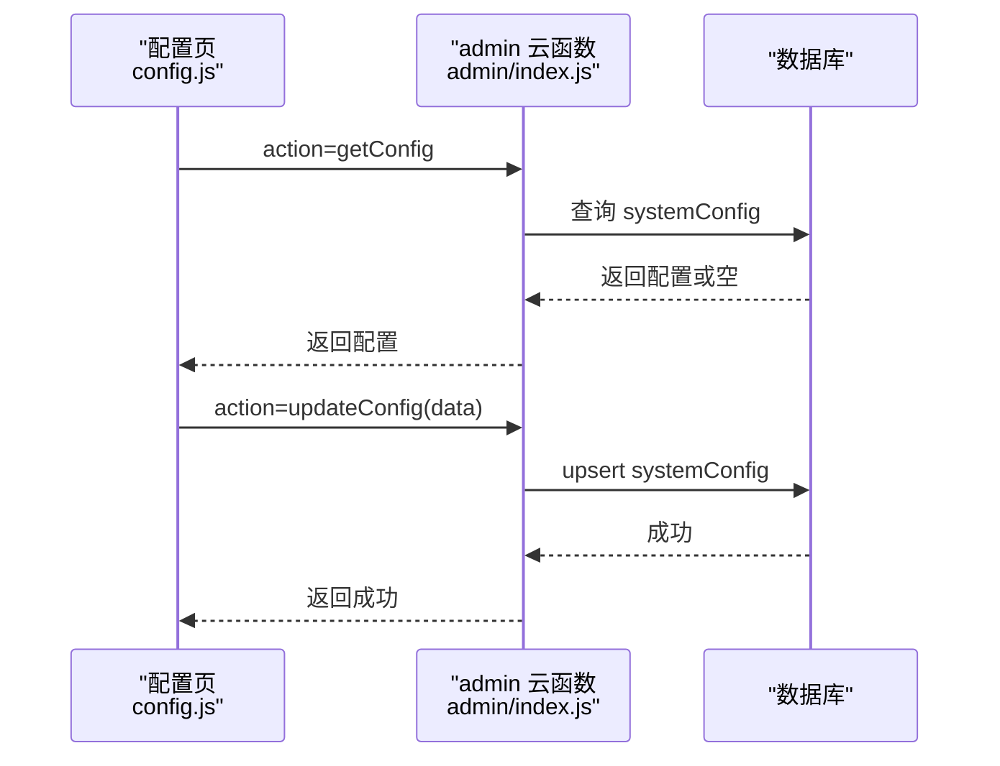
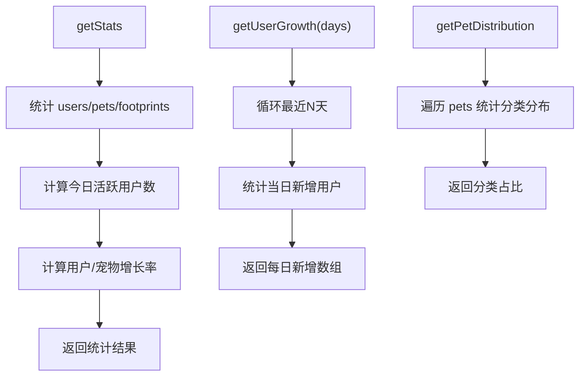
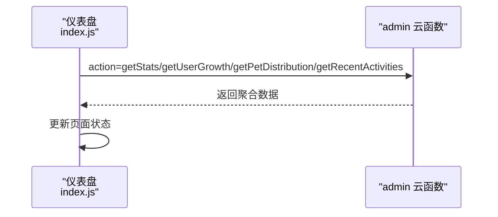
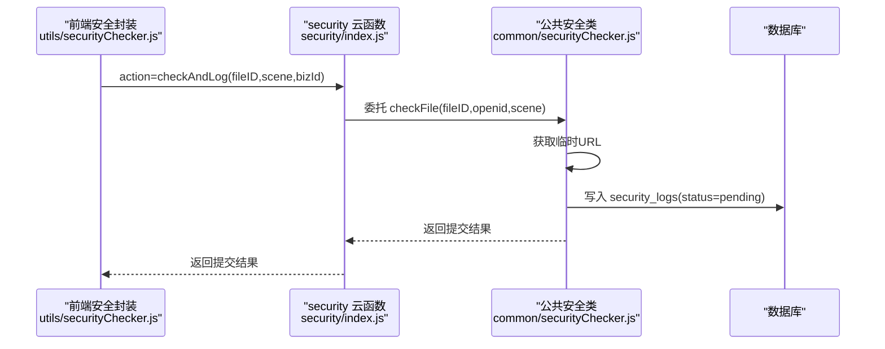
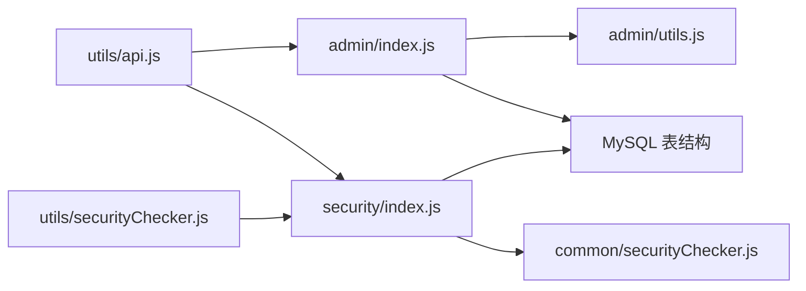

# 管理后台API

<cite>
**本文引用的文件**
- [cloudfunctions/admin/index.js](file://cloudfunctions/admin/index.js)
- [cloudfunctions/admin/utils.js](file://cloudfunctions/admin/utils.js)
- [cloudfunctions/common/securityChecker.js](file://cloudfunctions/common/securityChecker.js)
- [cloudfunctions/security/index.js](file://cloudfunctions/security/index.js)
- [miniprogram/subpkg-admin/pages/admin/index.js](file://miniprogram/subpkg-admin/pages/admin/index.js)
- [miniprogram/subpkg-admin/pages/admin/users.js](file://miniprogram/subpkg-admin/pages/admin/users.js)
- [miniprogram/subpkg-admin/pages/admin/pets.js](file://miniprogram/subpkg-admin/pages/admin/pets.js)
- [miniprogram/subpkg-admin/pages/admin/footprints.js](file://miniprogram/subpkg-admin/pages/admin/footprints.js)
- [miniprogram/subpkg-admin/pages/admin/config.js](file://miniprogram/subpkg-admin/pages/admin/config.js)
- [miniprogram/utils/api.js](file://miniprogram/utils/api.js)
- [miniprogram/utils/securityChecker.js](file://miniprogram/utils/securityChecker.js)
- [server-setup/database.sql](file://server-setup/database.sql)
</cite>

## 目录
1. [引言](#引言)
2. [项目结构](#项目结构)
3. [核心组件](#核心组件)
4. [架构总览](#架构总览)
5. [详细组件分析](#详细组件分析)
6. [依赖关系分析](#依赖关系分析)
7. [性能与扩展性](#性能与扩展性)
8. [故障排查指南](#故障排查指南)
9. [结论](#结论)
10. [附录：API调用示例与集成指南](#附录api调用示例与集成指南)

## 引言
本文件面向管理后台开发者与集成方，系统化梳理“管理后台API”的权限控制、用户管理、系统配置、数据统计分析、用户行为监控与系统维护能力。文档覆盖：
- 管理员角色验证与权限拦截
- 用户列表检索、封禁/解封、批量删除
- 宠物与足迹数据管理
- 系统配置的读取与更新
- 数据统计与趋势分析
- 内容安全审核与审计日志
- 前端管理界面的数据接口与交互流程
- API调用示例与集成步骤

## 项目结构
管理后台由三部分组成：
- 云函数层：提供统一的管理后台接口（权限校验、数据聚合、配置管理）
- 前端小程序包：管理页面负责调用云函数并展示数据
- 安全与审核：封装内容安全检查与异步回调处理

图表来源
- [cloudfunctions/admin/index.js:27-71](file://cloudfunctions/admin/index.js#L27-L71)
- [cloudfunctions/admin/utils.js:1-69](file://cloudfunctions/admin/utils.js#L1-L69)
- [cloudfunctions/common/securityChecker.js:30-208](file://cloudfunctions/common/securityChecker.js#L30-L208)
- [cloudfunctions/security/index.js:15-64](file://cloudfunctions/security/index.js#L15-L64)
- [miniprogram/utils/api.js:12-38](file://miniprogram/utils/api.js#L12-L38)
- [miniprogram/utils/securityChecker.js:22-41](file://miniprogram/utils/securityChecker.js#L22-L41)
- [server-setup/database.sql:9-221](file://server-setup/database.sql#L9-L221)

章节来源
- [cloudfunctions/admin/index.js:1-71](file://cloudfunctions/admin/index.js#L1-L71)
- [cloudfunctions/admin/utils.js:1-69](file://cloudfunctions/admin/utils.js#L1-L69)
- [cloudfunctions/common/securityChecker.js:30-208](file://cloudfunctions/common/securityChecker.js#L30-L208)
- [cloudfunctions/security/index.js:15-64](file://cloudfunctions/security/index.js#L15-L64)
- [miniprogram/utils/api.js:12-38](file://miniprogram/utils/api.js#L12-L38)
- [miniprogram/utils/securityChecker.js:22-41](file://miniprogram/utils/securityChecker.js#L22-L41)
- [server-setup/database.sql:9-221](file://server-setup/database.sql#L9-L221)

## 核心组件
- 管理后台云函数（admin）
  - 权限校验：基于数据库中的管理员列表进行校验
  - 功能聚合：统计、用户、宠物、足迹、配置、近期活动、趋势分析
  - 数据一致性：删除用户时使用事务清理关联数据
- 安全检查云函数（security）
  - 文本/媒体审核薄包装
  - 审核日志记录与待处理回调查询
- 前端API封装（utils/api.js）
  - 统一调用云函数，处理成功/失败与降级
  - 图片上传与安全审核联动
- 前端安全检查（utils/securityChecker.js）
  - 封装对 security 云函数的调用，支持异步/同步审核
- 数据库表结构（server-setup/database.sql）
  - 用户、管理员、宠物、记录、足迹、提醒、分类、系统配置、黑名单等

章节来源
- [cloudfunctions/admin/index.js:17-71](file://cloudfunctions/admin/index.js#L17-L71)
- [cloudfunctions/admin/index.js:117-258](file://cloudfunctions/admin/index.js#L117-L258)
- [cloudfunctions/admin/index.js:381-431](file://cloudfunctions/admin/index.js#L381-L431)
- [cloudfunctions/admin/index.js:433-508](file://cloudfunctions/admin/index.js#L433-L508)
- [cloudfunctions/security/index.js:15-64](file://cloudfunctions/security/index.js#L15-L64)
- [cloudfunctions/common/securityChecker.js:30-208](file://cloudfunctions/common/securityChecker.js#L30-L208)
- [miniprogram/utils/api.js:12-38](file://miniprogram/utils/api.js#L12-L38)
- [miniprogram/utils/securityChecker.js:22-41](file://miniprogram/utils/securityChecker.js#L22-L41)
- [server-setup/database.sql:9-221](file://server-setup/database.sql#L9-L221)

## 架构总览
管理后台采用“前端页面 + 云函数 + 数据库”的三层架构。管理员通过小程序管理页发起请求，云函数进行权限校验与数据聚合，数据库提供持久化存储。

图表来源
- [miniprogram/subpkg-admin/pages/admin/users.js:30-58](file://miniprogram/subpkg-admin/pages/admin/users.js#L30-L58)
- [miniprogram/utils/api.js:12-38](file://miniprogram/utils/api.js#L12-L38)
- [cloudfunctions/admin/index.js:27-71](file://cloudfunctions/admin/index.js#L27-L71)
- [cloudfunctions/admin/index.js:117-174](file://cloudfunctions/admin/index.js#L117-L174)
- [server-setup/database.sql:9-26](file://server-setup/database.sql#L9-L26)

## 详细组件分析

### 管理员权限控制与鉴权
- 管理员来源：优先从数据库 admins 表读取 enabled=true 的管理员；若失败则回退内置 OPENID 列表
- 请求入口：admin 云函数根据 event.action 分发处理，并在最外层进行权限校验
- 失败处理：无权限时直接返回错误响应，避免越权访问

图表来源
- [cloudfunctions/admin/index.js:17-38](file://cloudfunctions/admin/index.js#L17-L38)
- [cloudfunctions/admin/index.js:41-71](file://cloudfunctions/admin/index.js#L41-L71)

章节来源
- [cloudfunctions/admin/index.js:11-38](file://cloudfunctions/admin/index.js#L11-L38)

### 用户管理
- 列表查询：支持按昵称/用户名/openid/昵称模糊搜索、状态过滤、排序与分页
- 更新用户：支持昵称与状态更新；当状态为“封禁”时写入黑名单表，解封时移除
- 删除用户：开启事务，删除用户及其宠物、足迹、记录、产蛋记录，保证数据一致性

图表来源
- [cloudfunctions/admin/index.js:117-174](file://cloudfunctions/admin/index.js#L117-L174)
- [cloudfunctions/admin/index.js:176-217](file://cloudfunctions/admin/index.js#L176-L217)
- [cloudfunctions/admin/index.js:219-258](file://cloudfunctions/admin/index.js#L219-L258)
- [miniprogram/subpkg-admin/pages/admin/users.js:30-58](file://miniprogram/subpkg-admin/pages/admin/users.js#L30-L58)

章节来源
- [cloudfunctions/admin/index.js:117-174](file://cloudfunctions/admin/index.js#L117-L174)
- [cloudfunctions/admin/index.js:176-217](file://cloudfunctions/admin/index.js#L176-L217)
- [cloudfunctions/admin/index.js:219-258](file://cloudfunctions/admin/index.js#L219-L258)
- [miniprogram/subpkg-admin/pages/admin/users.js:30-58](file://miniprogram/subpkg-admin/pages/admin/users.js#L30-L58)

### 宠物与足迹管理
- 宠物列表：支持按名称搜索、分类过滤，批量查询用户信息以显示主人昵称
- 足迹列表：支持按日期范围筛选与关键词过滤，返回内容摘要与图片集合

图表来源
- [cloudfunctions/admin/index.js:260-320](file://cloudfunctions/admin/index.js#L260-L320)
- [cloudfunctions/admin/index.js:322-362](file://cloudfunctions/admin/index.js#L322-L362)

章节来源
- [cloudfunctions/admin/index.js:260-320](file://cloudfunctions/admin/index.js#L260-L320)
- [cloudfunctions/admin/index.js:322-362](file://cloudfunctions/admin/index.js#L322-L362)

### 系统配置管理
- 读取配置：优先从 systemConfig 表读取，失败时返回默认配置
- 更新配置：支持新增或更新，自动记录更新时间与更新者 OPENID

图表来源
- [cloudfunctions/admin/index.js:433-473](file://cloudfunctions/admin/index.js#L433-L473)
- [cloudfunctions/admin/index.js:475-508](file://cloudfunctions/admin/index.js#L475-L508)
- [miniprogram/subpkg-admin/pages/admin/config.js:49-114](file://miniprogram/subpkg-admin/pages/admin/config.js#L49-L114)

章节来源
- [cloudfunctions/admin/index.js:433-508](file://cloudfunctions/admin/index.js#L433-L508)
- [miniprogram/subpkg-admin/pages/admin/config.js:49-114](file://miniprogram/subpkg-admin/pages/admin/config.js#L49-L114)

### 数据统计与趋势分析
- 总体统计：用户/宠物/足迹总数、今日活跃用户数、用户/宠物增长率
- 用户增长趋势：按自然周统计每日新增用户
- 宠物分布：按分类统计数量与占比

图表来源
- [cloudfunctions/admin/index.js:74-115](file://cloudfunctions/admin/index.js#L74-L115)
- [cloudfunctions/admin/index.js:381-410](file://cloudfunctions/admin/index.js#L381-L410)
- [cloudfunctions/admin/index.js:412-431](file://cloudfunctions/admin/index.js#L412-L431)

章节来源
- [cloudfunctions/admin/index.js:74-115](file://cloudfunctions/admin/index.js#L74-L115)
- [cloudfunctions/admin/index.js:381-431](file://cloudfunctions/admin/index.js#L381-L431)

### 最近动态与仪表盘
- 最近动态：取最新足迹列表，用于仪表盘展示
- 仪表盘：聚合统计、用户增长曲线、宠物分布与最近动态

图表来源
- [miniprogram/subpkg-admin/pages/admin/index.js:34-82](file://miniprogram/subpkg-admin/pages/admin/index.js#L34-L82)
- [cloudfunctions/admin/index.js:364-379](file://cloudfunctions/admin/index.js#L364-L379)
- [cloudfunctions/admin/index.js:74-115](file://cloudfunctions/admin/index.js#L74-L115)
- [cloudfunctions/admin/index.js:381-431](file://cloudfunctions/admin/index.js#L381-L431)

章节来源
- [miniprogram/subpkg-admin/pages/admin/index.js:34-82](file://miniprogram/subpkg-admin/pages/admin/index.js#L34-L82)
- [cloudfunctions/admin/index.js:364-379](file://cloudfunctions/admin/index.js#L364-L379)

### 内容安全审核与审计
- 审核能力：支持图片媒体异步审核与文本内容审核
- 日志记录：将审核请求写入 security_logs，包含 fileID、场景、业务ID、traceId、状态等
- 待处理查询：查询 pending 状态且超时的审核记录，便于运维跟踪

图表来源
- [miniprogram/utils/securityChecker.js:22-41](file://miniprogram/utils/securityChecker.js#L22-L41)
- [cloudfunctions/security/index.js:15-64](file://cloudfunctions/security/index.js#L15-L64)
- [cloudfunctions/common/securityChecker.js:179-207](file://cloudfunctions/common/securityChecker.js#L179-L207)

章节来源
- [cloudfunctions/common/securityChecker.js:30-208](file://cloudfunctions/common/securityChecker.js#L30-L208)
- [cloudfunctions/security/index.js:15-64](file://cloudfunctions/security/index.js#L15-L64)
- [miniprogram/utils/securityChecker.js:22-41](file://miniprogram/utils/securityChecker.js#L22-L41)

## 依赖关系分析
- 管理后台云函数依赖数据库表 users、admins、pets、footprints、records、eggRecords、systemConfig、bannedUsers
- 安全云函数依赖公共安全类与数据库表 notifications、security_logs
- 前端通过 utils/api.js 统一调用云函数，减少重复逻辑
- 前端安全封装复用安全云函数，实现审核与通知能力

图表来源
- [cloudfunctions/admin/index.js:1-71](file://cloudfunctions/admin/index.js#L1-L71)
- [cloudfunctions/admin/utils.js:1-69](file://cloudfunctions/admin/utils.js#L1-L69)
- [cloudfunctions/security/index.js:15-64](file://cloudfunctions/security/index.js#L15-L64)
- [cloudfunctions/common/securityChecker.js:30-208](file://cloudfunctions/common/securityChecker.js#L30-L208)
- [miniprogram/utils/api.js:12-38](file://miniprogram/utils/api.js#L12-L38)
- [miniprogram/utils/securityChecker.js:22-41](file://miniprogram/utils/securityChecker.js#L22-L41)
- [server-setup/database.sql:9-221](file://server-setup/database.sql#L9-L221)

章节来源
- [cloudfunctions/admin/index.js:1-71](file://cloudfunctions/admin/index.js#L1-L71)
- [cloudfunctions/security/index.js:15-64](file://cloudfunctions/security/index.js#L15-L64)
- [miniprogram/utils/api.js:12-38](file://miniprogram/utils/api.js#L12-L38)
- [miniprogram/utils/securityChecker.js:22-41](file://miniprogram/utils/securityChecker.js#L22-L41)
- [server-setup/database.sql:9-221](file://server-setup/database.sql#L9-L221)

## 性能与扩展性
- 并发查询：统计接口使用 Promise.all 并行查询多个集合，降低延迟
- 分页与索引：用户/宠物/足迹列表均支持分页与排序，建议在数据库层面建立相应索引
- 事务删除：删除用户时使用事务，确保强一致，但需注意事务开销与锁竞争
- 审核异步化：图片审核采用异步提交，避免阻塞上传流程
- 配置缓存：前端配置页支持本地存储兜底，提升可用性

章节来源
- [cloudfunctions/admin/index.js:74-115](file://cloudfunctions/admin/index.js#L74-L115)
- [cloudfunctions/admin/index.js:219-258](file://cloudfunctions/admin/index.js#L219-L258)
- [cloudfunctions/common/securityChecker.js:158-170](file://cloudfunctions/common/securityChecker.js#L158-L170)
- [miniprogram/subpkg-admin/pages/admin/config.js:66-79](file://miniprogram/subpkg-admin/pages/admin/config.js#L66-L79)

## 故障排查指南
- 无管理员权限
  - 现象：返回无权限错误
  - 排查：确认 OPENID 是否在 admins 表 enabled=true 或回退列表
- 云函数调用失败
  - 现象：API封装返回 useFallback 或网络错误
  - 排查：检查云函数部署状态、环境变量、权限配置
- 审核提交失败
  - 现象：checkAndLog 返回失败或 pending 超时
  - 排查：检查 fileID 是否有效、临时URL是否可访问、回调是否正常
- 删除用户失败
  - 现象：事务回滚
  - 排查：检查关联数据是否存在、数据库连接与权限

章节来源
- [cloudfunctions/admin/index.js:35-38](file://cloudfunctions/admin/index.js#L35-L38)
- [miniprogram/utils/api.js:27-37](file://miniprogram/utils/api.js#L27-L37)
- [cloudfunctions/common/securityChecker.js:158-170](file://cloudfunctions/common/securityChecker.js#L158-L170)
- [cloudfunctions/security/index.js:151-195](file://cloudfunctions/security/index.js#L151-L195)
- [cloudfunctions/admin/index.js:253-257](file://cloudfunctions/admin/index.js#L253-L257)

## 结论
本管理后台API围绕“权限可控、数据一致、可观测可审计”设计，提供完善的用户管理、系统配置、统计分析与内容安全能力。通过统一的云函数入口与前端封装，既保证了安全性，也提升了开发效率与可维护性。

## 附录：API调用示例与集成指南

### 前端调用云函数（示例路径）
- 管理首页加载聚合数据
  - [调用路径:38-82](file://miniprogram/subpkg-admin/pages/admin/index.js#L38-L82)
- 用户列表查询与操作
  - [加载用户列表:30-58](file://miniprogram/subpkg-admin/pages/admin/users.js#L30-L58)
  - [更新用户状态:189-214](file://miniprogram/subpkg-admin/pages/admin/users.js#L189-L214)
  - [删除用户:242-266](file://miniprogram/subpkg-admin/pages/admin/users.js#L242-L266)
- 宠物列表查询
  - [加载宠物列表:27-54](file://miniprogram/subpkg-admin/pages/admin/pets.js#L27-L54)
- 系统配置读取与保存
  - [读取配置:49-80](file://miniprogram/subpkg-admin/pages/admin/config.js#L49-L80)
  - [保存配置:82-114](file://miniprogram/subpkg-admin/pages/admin/config.js#L82-L114)
- 通用API封装
  - [统一调用云函数:12-38](file://miniprogram/utils/api.js#L12-L38)

### 管理后台云函数（示例路径）
- 管理员权限校验与分发
  - [权限校验与分发:27-71](file://cloudfunctions/admin/index.js#L27-L71)
- 用户管理
  - [查询用户列表:117-174](file://cloudfunctions/admin/index.js#L117-L174)
  - [更新用户:176-217](file://cloudfunctions/admin/index.js#L176-L217)
  - [删除用户（事务）:219-258](file://cloudfunctions/admin/index.js#L219-L258)
- 宠物与足迹
  - [宠物列表:260-320](file://cloudfunctions/admin/index.js#L260-L320)
  - [足迹列表:322-362](file://cloudfunctions/admin/index.js#L322-L362)
- 统计与趋势
  - [总体统计:74-115](file://cloudfunctions/admin/index.js#L74-L115)
  - [用户增长趋势:381-410](file://cloudfunctions/admin/index.js#L381-L410)
  - [宠物分布:412-431](file://cloudfunctions/admin/index.js#L412-L431)
- 系统配置
  - [读取配置:433-473](file://cloudfunctions/admin/index.js#L433-L473)
  - [更新配置:475-508](file://cloudfunctions/admin/index.js#L475-L508)

### 安全与审核（示例路径）
- 前端安全封装
  - [图片/文本审核调用:49-92](file://miniprogram/utils/securityChecker.js#L49-L92)
- 安全云函数薄包装
  - [薄包装入口:15-64](file://cloudfunctions/security/index.js#L15-L64)
- 公共安全检查类
  - [文件审核与日志:158-207](file://cloudfunctions/common/securityChecker.js#L158-L207)

### 数据库表结构（参考）
- 用户、管理员、宠物、记录、足迹、提醒、分类、系统配置、黑名单等
  - [表结构定义:9-221](file://server-setup/database.sql#L9-L221)