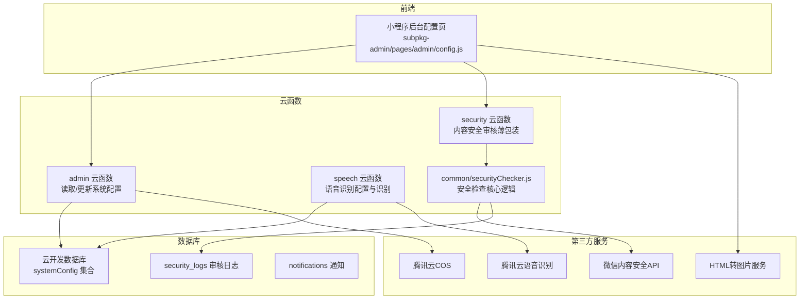
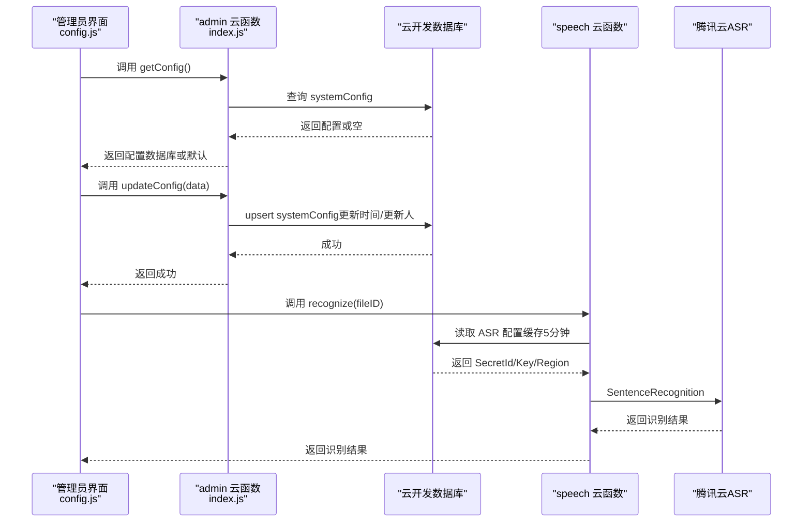
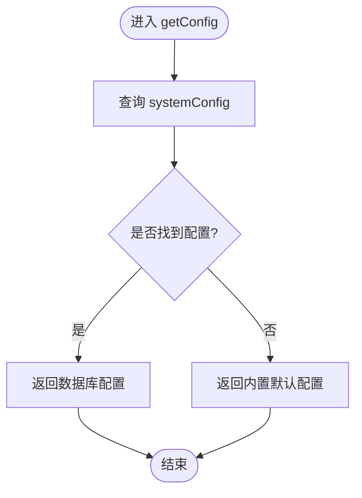
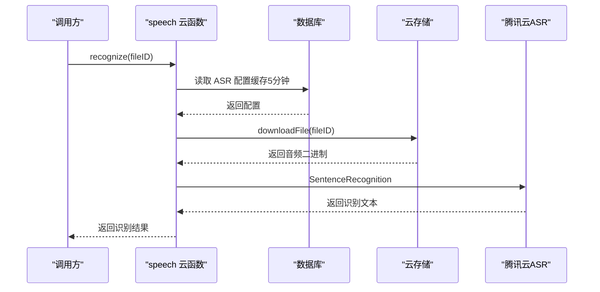
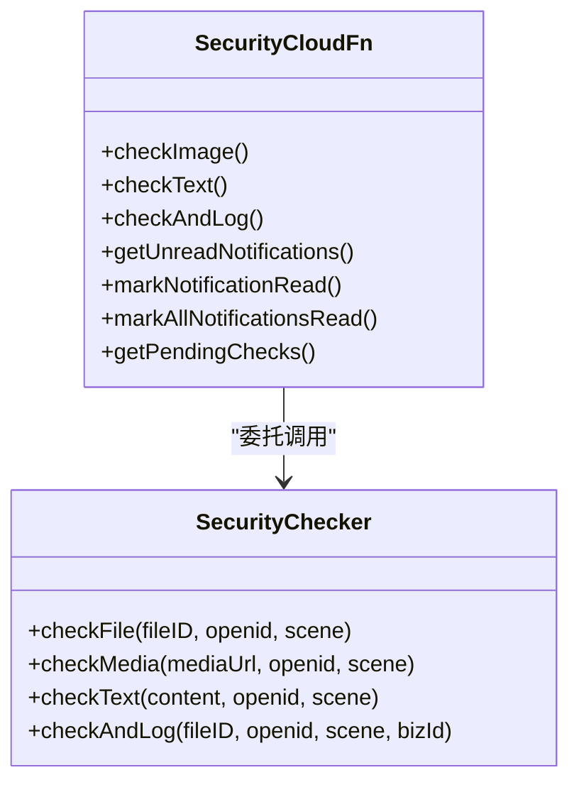
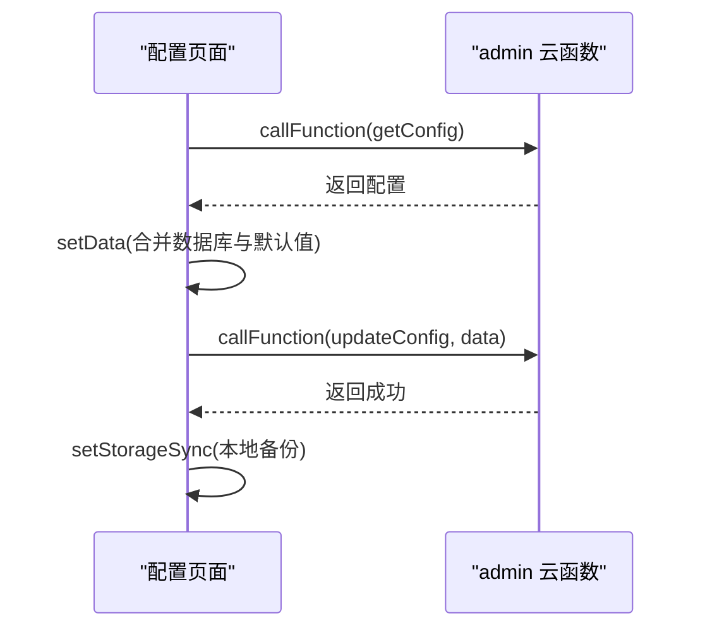
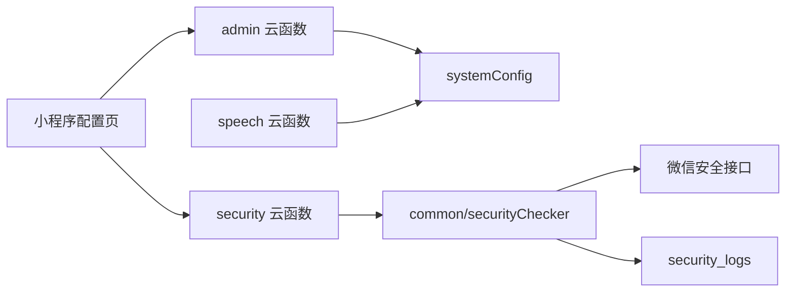

# 系统配置API

<cite>
**本文档引用的文件**
- [cloudfunctions/admin/index.js](file://cloudfunctions/admin/index.js)
- [cloudfunctions/admin/utils.js](file://cloudfunctions/admin/utils.js)
- [cloudfunctions/admin/config.json](file://cloudfunctions/admin/config.json)
- [cloudfunctions/speech/index.js](file://cloudfunctions/speech/index.js)
- [cloudfunctions/speech/config.json](file://cloudfunctions/speech/config.json)
- [cloudfunctions/security/index.js](file://cloudfunctions/security/index.js)
- [cloudfunctions/common/securityChecker.js](file://cloudfunctions/common/securityChecker.js)
- [cloudfunctions/security/config.json](file://cloudfunctions/security/config.json)
- [miniprogram/subpkg-admin/pages/admin/config.js](file://miniprogram/subpkg-admin/pages/admin/config.js)
- [miniprogram/utils/imageService.js](file://miniprogram/utils/imageService.js)
- [miniprogram/utils/securityChecker.js](file://miniprogram/utils/securityChecker.js)
- [miniprogram/utils/notification.js](file://miniprogram/utils/notification.js)
- [html2image-server/config.js](file://html2image-server/config.js)
- [html2image-server-dist/config.js](file://html2image-server-dist/config.js)
</cite>

## 目录
1. [引言](#引言)
2. [项目结构](#项目结构)
3. [核心组件](#核心组件)
4. [架构总览](#架构总览)
5. [详细组件分析](#详细组件分析)
6. [依赖关系分析](#依赖关系分析)
7. [性能考虑](#性能考虑)
8. [故障排查指南](#故障排查指南)
9. [结论](#结论)
10. [附录](#附录)

## 引言
本文件面向系统管理员与运维工程师，系统性梳理“系统配置API”的设计与实现，覆盖以下主题：
- 系统参数配置、功能开关控制、第三方服务集成的配置管理接口
- 配置项分类、权限控制与版本管理机制
- 配置热更新、回滚机制与配置验证规则
- 云存储配置、语音识别配置与通知服务配置
- API调用示例与运维管理指南

## 项目结构
系统配置API由三部分协同构成：
- 前端管理界面：小程序后台页面负责配置的读取、编辑与保存
- 云函数层：提供配置读取与更新能力，并承载第三方服务（语音识别、内容安全）的配置与调用
- 第三方服务：云存储、语音识别、内容安全审核、图片渲染服务等

**图表来源**
- [miniprogram/subpkg-admin/pages/admin/config.js:1-185](file://miniprogram/subpkg-admin/pages/admin/config.js#L1-L185)
- [cloudfunctions/admin/index.js:433-508](file://cloudfunctions/admin/index.js#L433-L508)
- [cloudfunctions/speech/index.js:69-92](file://cloudfunctions/speech/index.js#L69-L92)
- [cloudfunctions/security/index.js:15-64](file://cloudfunctions/security/index.js#L15-L64)
- [cloudfunctions/common/securityChecker.js:30-208](file://cloudfunctions/common/securityChecker.js#L30-L208)

**章节来源**
- [miniprogram/subpkg-admin/pages/admin/config.js:1-185](file://miniprogram/subpkg-admin/pages/admin/config.js#L1-L185)
- [cloudfunctions/admin/index.js:433-508](file://cloudfunctions/admin/index.js#L433-L508)
- [cloudfunctions/speech/index.js:69-92](file://cloudfunctions/speech/index.js#L69-L92)
- [cloudfunctions/security/index.js:15-64](file://cloudfunctions/security/index.js#L15-L64)
- [cloudfunctions/common/securityChecker.js:30-208](file://cloudfunctions/common/securityChecker.js#L30-L208)

## 核心组件
- 系统配置集合：systemConfig，存储系统名称、版本、注册策略、图片服务、推送开关、公告、第三方服务密钥等
- 管理员权限：仅允许数据库中启用的管理员执行配置更新
- 配置读取：优先从数据库读取；若失败，返回内置默认配置
- 配置更新：支持增量更新，保留只读字段（如创建时间），记录更新人与更新时间
- 第三方服务配置：
  - 云存储（COS）：SecretId/SecretKey/Bucket/Region
  - 语音识别（ASR）：SecretId/SecretKey/Region
  - 内容安全：微信开放平台安全接口权限
  - 图片渲染：图片服务端点与超时配置

**章节来源**
- [cloudfunctions/admin/index.js:433-508](file://cloudfunctions/admin/index.js#L433-L508)
- [cloudfunctions/admin/utils.js:20-35](file://cloudfunctions/admin/utils.js#L20-L35)
- [cloudfunctions/admin/config.json:1-6](file://cloudfunctions/admin/config.json#L1-L6)
- [cloudfunctions/speech/config.json:1-6](file://cloudfunctions/speech/config.json#L1-L6)
- [cloudfunctions/security/config.json:1-9](file://cloudfunctions/security/config.json#L1-L9)

## 架构总览
系统配置API采用“前端-云函数-数据库-第三方服务”分层架构，确保配置集中管理与安全可控。

**图表来源**
- [miniprogram/subpkg-admin/pages/admin/config.js:49-114](file://miniprogram/subpkg-admin/pages/admin/config.js#L49-L114)
- [cloudfunctions/admin/index.js:475-508](file://cloudfunctions/admin/index.js#L475-L508)
- [cloudfunctions/speech/index.js:94-143](file://cloudfunctions/speech/index.js#L94-L143)

## 详细组件分析

### 管理端配置API（admin 云函数）
- 功能
  - 获取系统配置：优先读数据库，失败时返回内置默认配置
  - 更新系统配置：支持全量字段更新，自动忽略只读字段，记录更新时间与更新人
  - 权限控制：仅允许数据库中启用的管理员执行更新
- 数据模型
  - systemConfig：包含系统基础信息、功能开关、第三方服务配置等
- 错误处理
  - 数据库查询失败时记录错误并返回默认配置
  - 更新失败捕获异常并返回统一错误响应

**图表来源**
- [cloudfunctions/admin/index.js:433-473](file://cloudfunctions/admin/index.js#L433-L473)

**章节来源**
- [cloudfunctions/admin/index.js:433-508](file://cloudfunctions/admin/index.js#L433-L508)
- [cloudfunctions/admin/utils.js:20-35](file://cloudfunctions/admin/utils.js#L20-L35)

### 语音识别配置与识别（speech 云函数）
- 功能
  - 从数据库读取ASR配置（带5分钟缓存），若失败降级使用环境变量
  - 懒加载初始化ASR客户端（配置变更时重建）
  - 下载云存储音频文件，调用腾讯云ASR进行识别
- 配置项
  - asrSecretId、asrSecretKey、asrRegion
- 错误处理
  - 缺少文件ID或API密钥时抛出明确错误
  - 识别异常捕获并返回友好错误信息

**图表来源**
- [cloudfunctions/speech/index.js:69-143](file://cloudfunctions/speech/index.js#L69-L143)

**章节来源**
- [cloudfunctions/speech/index.js:17-67](file://cloudfunctions/speech/index.js#L17-L67)
- [cloudfunctions/speech/index.js:94-143](file://cloudfunctions/speech/index.js#L94-L143)

### 内容安全审核与通知（security 云函数 + 公共类）
- 功能
  - 提供 checkImage、checkText、checkAndLog、通知查询与标记等接口
  - 审核日志持久化至 security_logs，通知持久化至 notifications
  - 支持查询“待回调结果”（pending）并标记超时
- 权限控制
  - 仅授权的微信安全接口（mediaCheckAsync、msgSecCheck）可用
- 前端交互
  - 通过小程序云函数调用，提供未读通知检查、弹窗展示与一键已读

**图表来源**
- [cloudfunctions/common/securityChecker.js:30-208](file://cloudfunctions/common/securityChecker.js#L30-L208)
- [cloudfunctions/security/index.js:15-200](file://cloudfunctions/security/index.js#L15-L200)

**章节来源**
- [cloudfunctions/security/index.js:15-200](file://cloudfunctions/security/index.js#L15-L200)
- [cloudfunctions/common/securityChecker.js:30-208](file://cloudfunctions/common/securityChecker.js#L30-L208)
- [cloudfunctions/security/config.json:1-9](file://cloudfunctions/security/config.json#L1-L9)

### 小程序配置管理界面
- 功能
  - 加载配置：调用 admin/getConfig，失败时回退本地存储
  - 保存配置：调用 admin/updateConfig，同时写入本地存储
  - 重置配置：恢复默认值
- 交互
  - 输入框与开关事件绑定，实时更新 data.config
  - 成功/失败提示与加载态管理

**图表来源**
- [miniprogram/subpkg-admin/pages/admin/config.js:49-114](file://miniprogram/subpkg-admin/pages/admin/config.js#L49-L114)

**章节来源**
- [miniprogram/subpkg-admin/pages/admin/config.js:1-185](file://miniprogram/subpkg-admin/pages/admin/config.js#L1-L185)

### 图片服务配置与调用
- 配置项
  - imageServerUrl：图片渲染服务端点
  - imageTimeout：请求超时
- 行为
  - 优先从全局配置读取，否则使用内置默认值
  - 调用图片服务端点生成图片，保存为临时文件

**章节来源**
- [miniprogram/utils/imageService.js:18-46](file://miniprogram/utils/imageService.js#L18-L46)
- [miniprogram/utils/imageService.js:98-143](file://miniprogram/utils/imageService.js#L98-L143)

### HTML转图片服务配置（独立进程）
- 配置加载顺序（优先级从高到低）
  - 环境变量（H2I_ 前缀，支持嵌套键与下划线转义）
  - config.json（注释安全解析）
  - 硬编码默认值
- 关键配置
  - server.host/port、browser、rendering、http、logging、process

**章节来源**
- [html2image-server/config.js:1-268](file://html2image-server/config.js#L1-L268)
- [html2image-server-dist/config.js:1-268](file://html2image-server-dist/config.js#L1-L268)

## 依赖关系分析
- 权限控制
  - admin 云函数：仅启用的管理员可更新配置
  - security 云函数：仅授权微信安全接口可用
  - speech 云函数：依赖数据库中的ASR配置
- 外部依赖
  - 腾讯云 SDK（ASR/COS）、微信云开发SDK、微信内容安全API
- 数据依赖
  - systemConfig：集中存放系统配置
  - security_logs：审核日志
  - notifications：用户通知

**图表来源**
- [cloudfunctions/admin/index.js:433-508](file://cloudfunctions/admin/index.js#L433-L508)
- [cloudfunctions/speech/index.js:69-92](file://cloudfunctions/speech/index.js#L69-L92)
- [cloudfunctions/security/index.js:15-64](file://cloudfunctions/security/index.js#L15-L64)
- [cloudfunctions/common/securityChecker.js:30-208](file://cloudfunctions/common/securityChecker.js#L30-L208)

**章节来源**
- [cloudfunctions/admin/config.json:1-6](file://cloudfunctions/admin/config.json#L1-L6)
- [cloudfunctions/security/config.json:1-9](file://cloudfunctions/security/config.json#L1-L9)
- [cloudfunctions/speech/config.json:1-6](file://cloudfunctions/speech/config.json#L1-L6)

## 性能考虑
- 配置缓存
  - 语音识别配置缓存5分钟，减少数据库与SDK初始化开销
- 请求超时
  - 图片服务请求超时可配置，避免长时间阻塞
- 并发与批处理
  - 审核任务异步提交，前端轮询“待回调”状态
- 日志与监控
  - 审核日志与通知表支持分页查询与时间过滤

[本节为通用指导，无需特定文件来源]

## 故障排查指南
- 配置读取失败
  - 现象：界面显示默认配置
  - 排查：确认数据库 systemConfig 是否存在；检查 admin 云函数权限
- 配置更新失败
  - 现象：返回错误消息
  - 排查：确认调用者为启用的管理员；检查数据库连接与字段合法性
- 语音识别失败
  - 现象：返回“缺少API密钥”或识别异常
  - 排查：确认数据库 ASR 配置；检查环境变量降级；查看ASR服务端点可达性
- 内容安全审核异常
  - 现象：审核接口错误或服务异常
  - 排查：确认 security 云函数权限；检查微信安全接口可用性；查看 security_logs
- 图片生成失败
  - 现象：图片服务返回错误或网络失败
  - 排查：确认 imageServerUrl 与 imageTimeout；检查图片服务端点与防火墙

**章节来源**
- [cloudfunctions/admin/index.js:475-508](file://cloudfunctions/admin/index.js#L475-L508)
- [cloudfunctions/speech/index.js:48-67](file://cloudfunctions/speech/index.js#L48-L67)
- [cloudfunctions/security/index.js:69-98](file://cloudfunctions/security/index.js#L69-L98)
- [miniprogram/utils/imageService.js:98-143](file://miniprogram/utils/imageService.js#L98-L143)

## 结论
系统配置API通过集中化的数据库配置与严格的权限控制，实现了对系统参数、功能开关与第三方服务的统一管理。结合缓存、降级与错误处理机制，保障了配置更新的可靠性与稳定性。建议在生产环境中：
- 严格限制管理员权限范围
- 定期校验第三方服务密钥与端点连通性
- 建立配置变更审计与回滚预案

[本节为总结性内容，无需特定文件来源]

## 附录

### API定义与调用示例

- 获取系统配置
  - 方法：GET 或 云函数调用
  - 云函数：admin/getConfig
  - 返回：系统配置对象（数据库或默认）
  - 示例路径：[miniprogram/subpkg-admin/pages/admin/config.js:52-65](file://miniprogram/subpkg-admin/pages/admin/config.js#L52-L65)

- 更新系统配置
  - 方法：POST 或 云函数调用
  - 云函数：admin/updateConfig
  - 参数：配置对象（自动忽略只读字段）
  - 示例路径：[miniprogram/subpkg-admin/pages/admin/config.js:86-92](file://miniprogram/subpkg-admin/pages/admin/config.js#L86-L92)

- 语音识别
  - 方法：云函数调用
  - 云函数：speech/recognize
  - 参数：fileID（云存储音频文件ID）
  - 示例路径：[cloudfunctions/speech/index.js:94-143](file://cloudfunctions/speech/index.js#L94-L143)

- 内容安全审核
  - 方法：云函数调用
  - 云函数：security/checkImage、security/checkText、security/checkAndLog
  - 示例路径：[cloudfunctions/security/index.js:22-40](file://cloudfunctions/security/index.js#L22-L40)

- 通知管理
  - 方法：云函数调用
  - 云函数：security/getUnreadNotifications、security/markNotificationRead、security/markAllNotificationsRead、security/getPendingChecks
  - 示例路径：[cloudfunctions/security/index.js:69-144](file://cloudfunctions/security/index.js#L69-L144)

### 配置项分类与说明
- 系统基础
  - systemName、version、servicePhone、notice
- 功能开关
  - allowRegister、allowAnonymous、enablePush
- 图片服务
  - imageServer、imageServerUrl、imageTimeout
- 第三方服务
  - qcloudSecretId/Key/Bucket/Region（COS）
  - asrSecretId/Key/Region（ASR）
- 其他
  - maxPetCount、maxFootprintImages、apiUrl、cloudEnvId

**章节来源**
- [cloudfunctions/admin/index.js:446-472](file://cloudfunctions/admin/index.js#L446-L472)
- [miniprogram/subpkg-admin/pages/admin/config.js:4-28](file://miniprogram/subpkg-admin/pages/admin/config.js#L4-L28)

### 权限控制与版本管理
- 权限控制
  - 管理员白名单：数据库启用的管理员才可更新配置
  - 安全接口授权：仅允许指定微信安全接口
- 版本管理
  - 配置更新记录 updatedBy 与 updatedAt
  - 建议引入配置版本号与变更历史表以支持回滚

**章节来源**
- [cloudfunctions/admin/index.js:31-38](file://cloudfunctions/admin/index.js#L31-L38)
- [cloudfunctions/admin/index.js:485-502](file://cloudfunctions/admin/index.js#L485-L502)
- [cloudfunctions/security/config.json:1-9](file://cloudfunctions/security/config.json#L1-L9)

### 配置热更新与回滚机制
- 热更新
  - 语音识别配置缓存5分钟，配置变更后懒加载重建客户端
  - 前端配置读取失败时回退本地存储
- 回滚机制
  - 当前未实现自动回滚；建议引入配置版本号与“上一版本”回滚接口

**章节来源**
- [cloudfunctions/speech/index.js:17-46](file://cloudfunctions/speech/index.js#L17-L46)
- [miniprogram/subpkg-admin/pages/admin/config.js:66-79](file://miniprogram/subpkg-admin/pages/admin/config.js#L66-L79)

### 配置验证规则
- 必填校验
  - 语音识别：SecretId/SecretKey 必填
  - 识别：fileID 必填
- 类型转换
  - 环境变量配置按字符串/布尔/数值自动转换
- 注释支持
  - config.json 支持行注释与块注释（解析前清理）

**章节来源**
- [cloudfunctions/speech/index.js:48-51](file://cloudfunctions/speech/index.js#L48-L51)
- [html2image-server/config.js:225-232](file://html2image-server/config.js#L225-L232)
- [html2image-server/config.js:97-143](file://html2image-server/config.js#L97-L143)