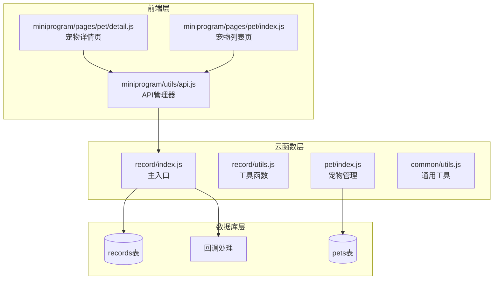
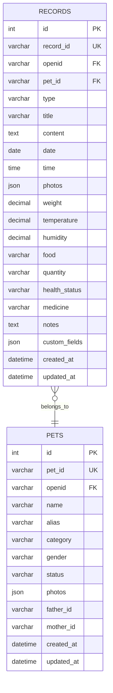
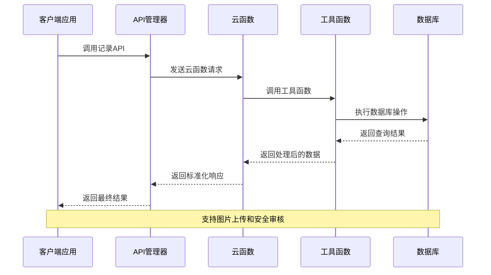
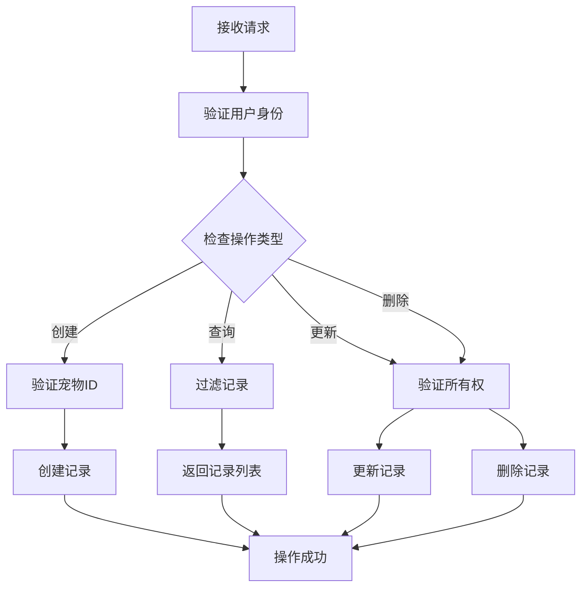
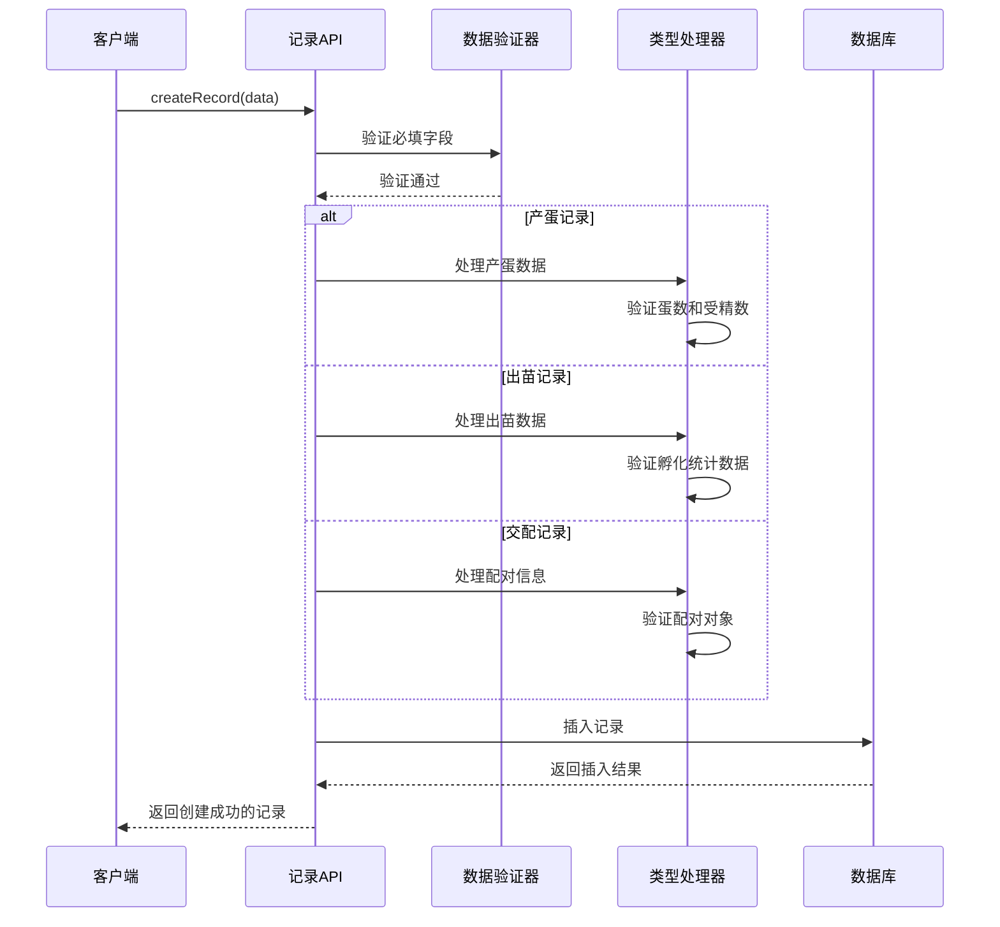
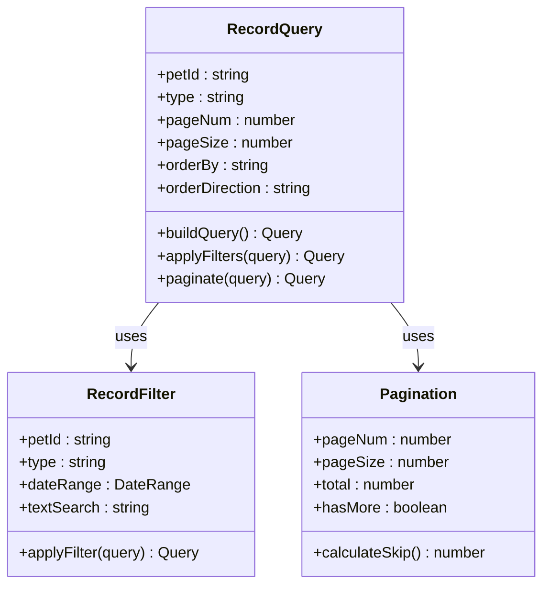
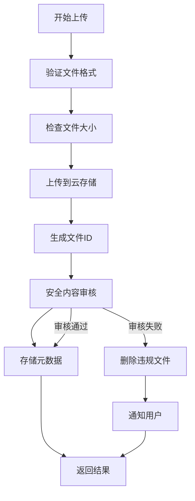
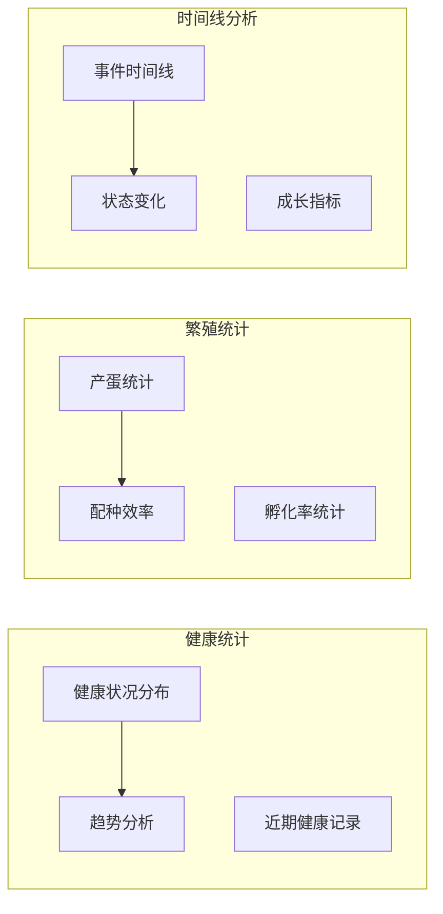
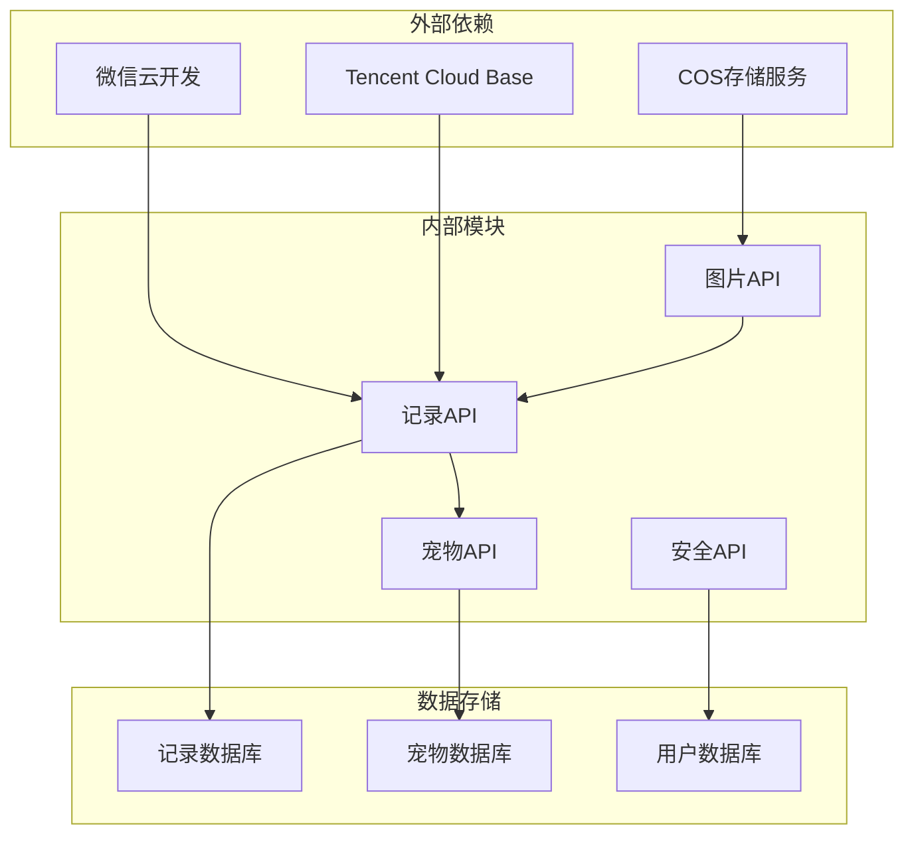

# 记录管理API

<cite>
**本文档引用的文件**
- [cloudfunctions/record/index.js](file://cloudfunctions/record/index.js)
- [cloudfunctions/record/utils.js](file://cloudfunctions/record/utils.js)
- [cloudfunctions/pet/index.js](file://cloudfunctions/pet/index.js)
- [cloudfunctions/common/utils.js](file://cloudfunctions/common/utils.js)
- [miniprogram/utils/api.js](file://miniprogram/utils/api.js)
- [server-setup/database.sql](file://server-setup/database.sql)
- [cloudfunctions/callback/index.js](file://cloudfunctions/callback/index.js)
- [miniprogram/pages/pet/detail.js](file://miniprogram/pages/pet/detail.js)
- [miniprogram/pages/pet/index.js](file://miniprogram/pages/pet/index.js)
</cite>

## 目录
1. [简介](#简介)
2. [项目结构](#项目结构)
3. [核心组件](#核心组件)
4. [架构概览](#架构概览)
5. [详细组件分析](#详细组件分析)
6. [依赖关系分析](#依赖关系分析)
7. [性能考虑](#性能考虑)
8. [故障排除指南](#故障排除指南)
9. [结论](#结论)

## 简介

记录管理API是养龟档案系统中的核心功能模块，负责管理各种类型的宠物健康记录、繁殖记录和其他日常记录。该API提供了完整的CRUD操作，支持多种记录类型扩展，具备强大的图片上传处理能力和完善的数据验证规则。

系统采用微信云开发架构，通过云函数提供RESTful风格的API接口，支持记录与宠物的关联关系管理、时间线展示和统计分析功能。

## 项目结构

记录管理API位于cloudfunctions/record目录下，采用模块化设计：

**图表来源**
- [cloudfunctions/record/index.js:1-191](file://cloudfunctions/record/index.js#L1-L191)
- [cloudfunctions/record/utils.js:1-69](file://cloudfunctions/record/utils.js#L1-L69)
- [miniprogram/utils/api.js:1-208](file://miniprogram/utils/api.js#L1-L208)

**章节来源**
- [cloudfunctions/record/index.js:1-191](file://cloudfunctions/record/index.js#L1-L191)
- [cloudfunctions/record/utils.js:1-69](file://cloudfunctions/record/utils.js#L1-L69)
- [miniprogram/utils/api.js:1-208](file://miniprogram/utils/api.js#L1-L208)

## 核心组件

### 记录类型系统

系统支持多种预定义的记录类型，每种类型都有特定的数据结构和业务逻辑：

| 记录类型 | 描述 | 特殊字段 | 数据验证 |
|---------|------|----------|----------|
| 健康 | 宠物健康状况记录 | health_status, medicine, temperature, humidity | 必须包含日期和基本描述 |
| 交配 | 繁殖配对记录 | partnerId, partnerName | 需要配对对象信息 |
| 产蛋 | 产蛋情况记录 | eggCount, fertilizedCount | 数值必须为正整数 |
| 出苗 | 孵化出苗记录 | hatchCount, gradeACount, defectCount | 需要完整的孵化统计数据 |
| 日常 | 一般性日常记录 | text, photos | 基本文本描述 |

### 数据模型

记录表结构支持灵活的字段扩展，同时保持核心字段的一致性：

**图表来源**
- [server-setup/database.sql:78-109](file://server-setup/database.sql#L78-L109)

**章节来源**
- [server-setup/database.sql:78-109](file://server-setup/database.sql#L78-L109)
- [cloudfunctions/record/index.js:37-82](file://cloudfunctions/record/index.js#L37-L82)

## 架构概览

记录管理API采用分层架构设计，确保系统的可维护性和扩展性：

**图表来源**
- [miniprogram/utils/api.js:12-38](file://miniprogram/utils/api.js#L12-L38)
- [cloudfunctions/record/index.js:10-35](file://cloudfunctions/record/index.js#L10-L35)

### 权限控制机制

系统实现了严格的权限控制，确保数据安全：

**图表来源**
- [cloudfunctions/record/index.js:124-159](file://cloudfunctions/record/index.js#L124-L159)
- [cloudfunctions/record/utils.js:15-18](file://cloudfunctions/record/utils.js#L15-L18)

**章节来源**
- [cloudfunctions/record/index.js:10-35](file://cloudfunctions/record/index.js#L10-L35)
- [cloudfunctions/record/utils.js:15-18](file://cloudfunctions/record/utils.js#L15-L18)

## 详细组件分析

### 记录创建流程

记录创建是API中最复杂的操作之一，需要处理多种记录类型和数据验证：

**图表来源**
- [cloudfunctions/record/index.js:37-82](file://cloudfunctions/record/index.js#L37-L82)

#### 数据验证规则

系统实施了多层次的数据验证机制：

| 验证层级 | 验证内容 | 验证规则 | 错误处理 |
|----------|----------|----------|----------|
| 基础验证 | 宠物ID | 必填且有效 | 抛出"宠物ID不能为空"错误 |
| 类型验证 | 记录类型 | 支持的类型列表 | 使用默认类型"日常" |
| 数值验证 | 产蛋数量 | 整数且>=0 | 转换为0或有效数值 |
| 关联验证 | 配对对象 | 存在且属于同一用户 | 清理无效的配对信息 |
| 图片验证 | 照片数组 | 数组且非空 | 保留原始数组或置空 |

**章节来源**
- [cloudfunctions/record/index.js:37-82](file://cloudfunctions/record/index.js#L37-L82)

### 记录查询系统

查询系统支持灵活的筛选条件和分页机制：

**图表来源**
- [cloudfunctions/record/index.js:84-111](file://cloudfunctions/record/index.js#L84-L111)

#### 高级查询功能

系统支持以下高级查询特性：

- **多条件组合查询**：支持按宠物ID、记录类型、日期范围等多条件组合
- **全文搜索**：支持记录内容的模糊匹配搜索
- **分页查询**：内置分页机制，支持大数据集的高效查询
- **排序功能**：支持按创建时间、更新时间等字段排序

**章节来源**
- [cloudfunctions/record/index.js:84-111](file://cloudfunctions/record/index.js#L84-L111)

### 图片上传处理

系统提供了完整的图片上传和处理机制：

**图表来源**
- [miniprogram/utils/api.js:156-190](file://miniprogram/utils/api.js#L156-L190)
- [cloudfunctions/callback/index.js:124-223](file://cloudfunctions/callback/index.js#L124-L223)

#### 图片处理特性

- **自动格式转换**：支持多种图片格式的自动转换
- **尺寸优化**：自动压缩和优化图片尺寸
- **安全审核**：集成内容安全审核机制
- **过期处理**：自动处理临时URL的过期问题

**章节来源**
- [miniprogram/utils/api.js:156-190](file://miniprogram/utils/api.js#L156-L190)
- [cloudfunctions/callback/index.js:124-223](file://cloudfunctions/callback/index.js#L124-L223)

### 统计分析功能

系统集成了丰富的统计分析功能，帮助用户更好地理解宠物的健康状况：

**图表来源**
- [miniprogram/pages/pet/index.js:416-464](file://miniprogram/pages/pet/index.js#L416-L464)
- [miniprogram/pages/pet/detail.js:1998-2237](file://miniprogram/pages/pet/detail.js#L1998-L2237)

#### 统计指标说明

- **健康预警**：30天内出现健康记录的宠物标记为预警状态
- **配种状态**：母龟30天内无交配/产蛋记录标记为待配状态
- **孵化率**：根据出苗记录计算全品率和孵化成功率
- **产蛋统计**：统计产蛋数量和受精率的变化趋势

**章节来源**
- [miniprogram/pages/pet/index.js:416-464](file://miniprogram/pages/pet/index.js#L416-L464)
- [miniprogram/pages/pet/detail.js:1998-2237](file://miniprogram/pages/pet/detail.js#L1998-L2237)

## 依赖关系分析

记录管理API与其他系统组件的依赖关系如下：

**图表来源**
- [cloudfunctions/record/index.js:1-8](file://cloudfunctions/record/index.js#L1-L8)
- [cloudfunctions/common/utils.js:1-13](file://cloudfunctions/common/utils.js#L1-L13)

### 模块耦合度

系统采用了松耦合的设计原则：

- **低耦合**：各云函数相对独立，职责明确
- **高内聚**：相同功能的代码集中在相应的模块中
- **可扩展性**：新的记录类型可以通过简单的配置添加
- **可维护性**：清晰的模块边界便于代码维护和测试

**章节来源**
- [cloudfunctions/record/index.js:1-8](file://cloudfunctions/record/index.js#L1-L8)
- [cloudfunctions/common/utils.js:1-13](file://cloudfunctions/common/utils.js#L1-L13)

## 性能考虑

### 查询优化

系统实施了多项查询优化策略：

- **索引优化**：为常用查询字段建立数据库索引
- **分页机制**：默认每页20条记录，支持大数据集的高效查询
- **缓存策略**：合理利用微信云开发的缓存机制
- **批量操作**：支持批量查询和更新操作

### 并发控制

系统具备完善的并发控制机制：

- **事务处理**：关键操作使用数据库事务保证数据一致性
- **锁机制**：对共享资源实施适当的锁控制
- **重试机制**：网络异常时自动重试机制
- **超时控制**：合理的超时设置防止长时间阻塞

## 故障排除指南

### 常见错误及解决方案

| 错误类型 | 错误代码 | 可能原因 | 解决方案 |
|----------|----------|----------|----------|
| 权限错误 | 403 | 用户无权访问目标记录 | 检查用户身份和记录归属 |
| 参数错误 | 400 | 请求参数格式不正确 | 验证必填字段和数据类型 |
| 数据不存在 | 404 | 记录或宠物不存在 | 确认ID的有效性和存在性 |
| 系统错误 | 500 | 服务器内部错误 | 检查日志并重试操作 |

### 调试技巧

- **启用详细日志**：在开发环境中启用详细的错误日志
- **使用开发者工具**：利用微信开发者工具的调试功能
- **监控API调用**：通过云开发控制台监控API调用情况
- **测试边界条件**：充分测试各种边界条件和异常情况

**章节来源**
- [cloudfunctions/record/index.js:31-34](file://cloudfunctions/record/index.js#L31-L34)
- [cloudfunctions/record/index.js:128-134](file://cloudfunctions/record/index.js#L128-L134)

## 结论

记录管理API是一个功能完整、设计合理的微服务系统。它不仅满足了养龟档案的基本需求，还具备良好的扩展性和维护性。

### 主要优势

- **模块化设计**：清晰的模块划分便于维护和扩展
- **完善的权限控制**：确保数据安全和隐私保护
- **灵活的记录类型**：支持多种记录类型的扩展
- **强大的统计分析**：提供有价值的洞察和决策支持
- **可靠的图片处理**：完整的图片上传和审核机制

### 未来改进方向

- **API版本管理**：引入API版本控制机制
- **更精细的权限控制**：支持更细粒度的权限管理
- **实时通知**：增加实时状态变更通知功能
- **数据分析增强**：提供更多维度的数据分析功能

该API为养龟档案系统提供了坚实的技术基础，能够有效支撑宠物健康管理的各种需求。