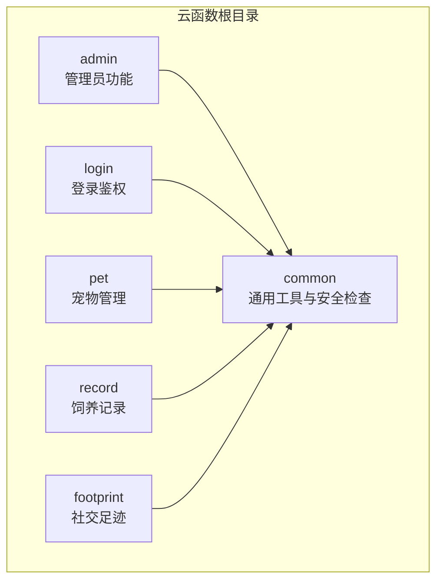
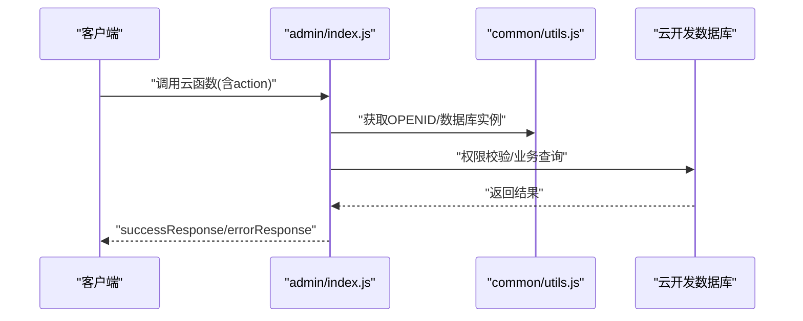
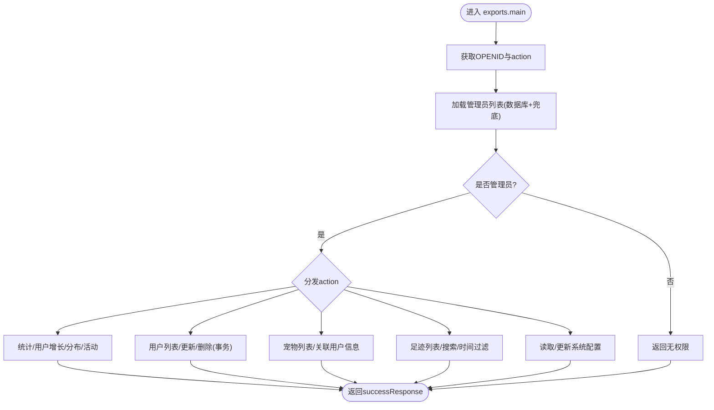
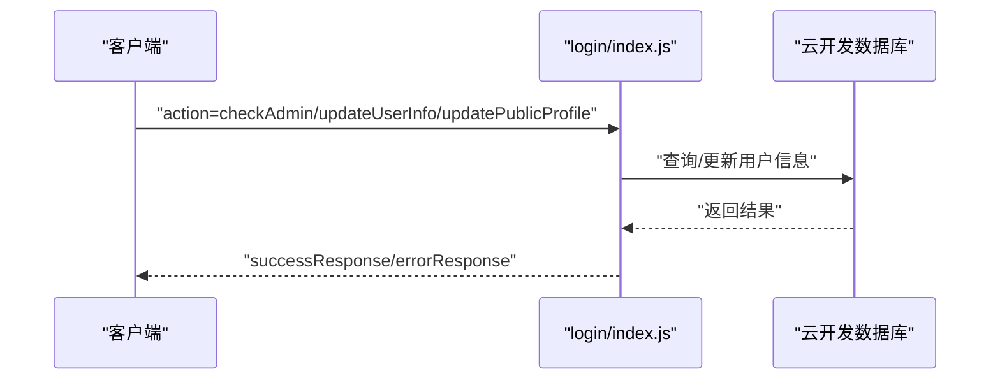
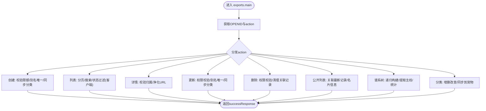
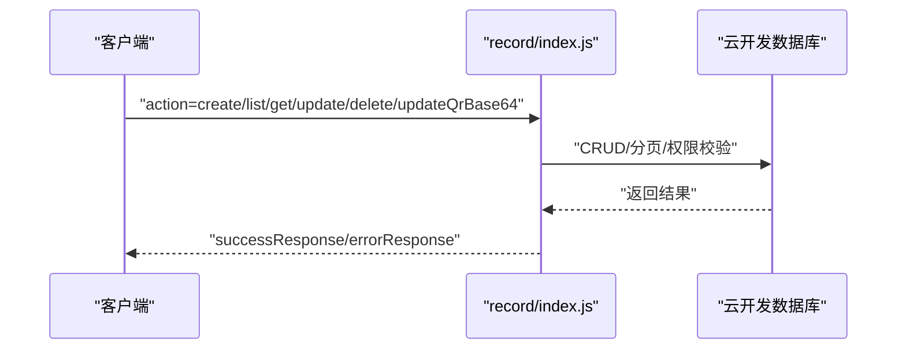
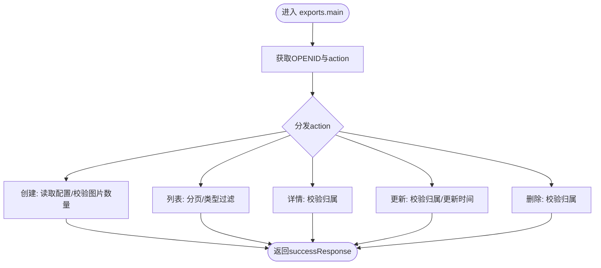
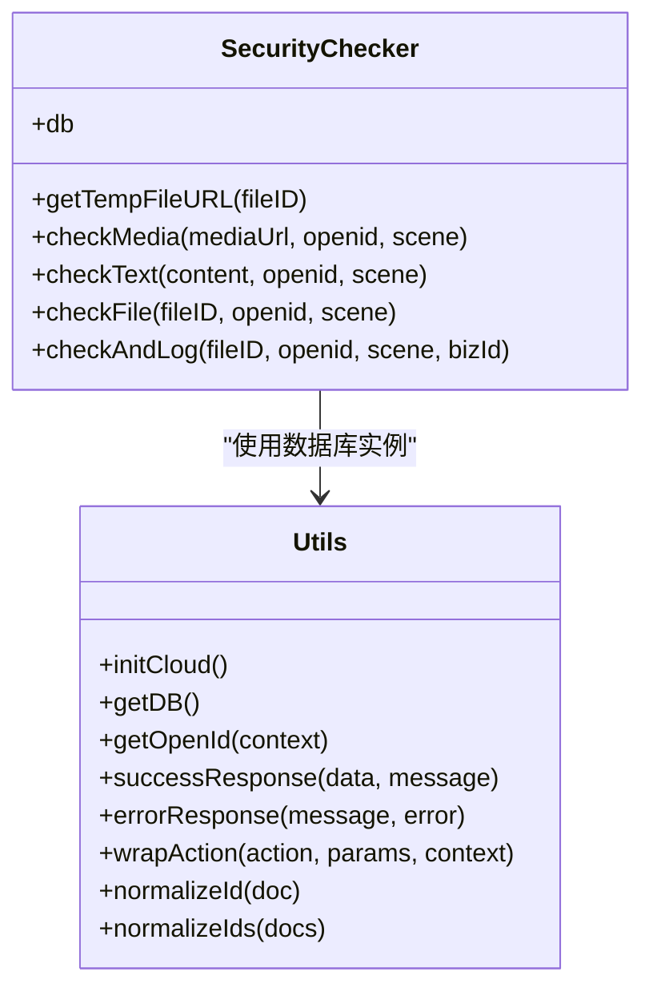
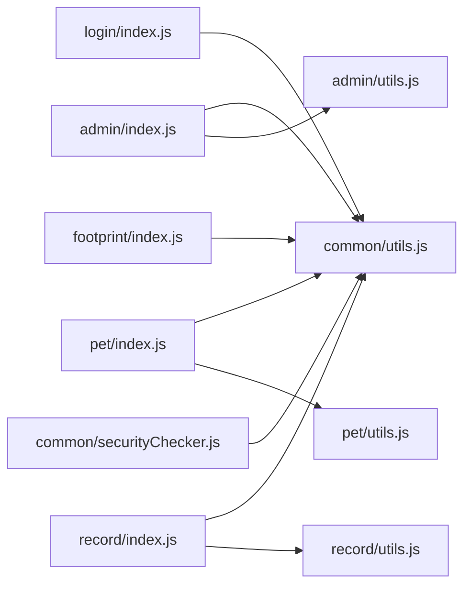

# 云函数架构设计

<cite>
**本文引用的文件**
- [cloudfunctions/admin/index.js](file://cloudfunctions/admin/index.js)
- [cloudfunctions/admin/utils.js](file://cloudfunctions/admin/utils.js)
- [cloudfunctions/admin/config.json](file://cloudfunctions/admin/config.json)
- [cloudfunctions/common/securityChecker.js](file://cloudfunctions/common/securityChecker.js)
- [cloudfunctions/common/utils.js](file://cloudfunctions/common/utils.js)
- [cloudfunctions/login/index.js](file://cloudfunctions/login/index.js)
- [cloudfunctions/login/config.json](file://cloudfunctions/login/config.json)
- [cloudfunctions/footprint/index.js](file://cloudfunctions/footprint/index.js)
- [cloudfunctions/footprint/config.json](file://cloudfunctions/footprint/config.json)
- [cloudfunctions/pet/index.js](file://cloudfunctions/pet/index.js)
- [cloudfunctions/pet/utils.js](file://cloudfunctions/pet/utils.js)
- [cloudfunctions/pet/config.json](file://cloudfunctions/pet/config.json)
- [cloudfunctions/record/index.js](file://cloudfunctions/record/index.js)
- [cloudfunctions/record/utils.js](file://cloudfunctions/record/utils.js)
- [cloudfunctions/record/config.json](file://cloudfunctions/record/config.json)
</cite>

## 目录
1. [引言](#引言)
2. [项目结构](#项目结构)
3. [核心组件](#核心组件)
4. [架构总览](#架构总览)
5. [详细组件分析](#详细组件分析)
6. [依赖关系分析](#依赖关系分析)
7. [性能考虑](#性能考虑)
8. [故障排查指南](#故障排查指南)
9. [结论](#结论)
10. [附录](#附录)

## 引言
本技术文档面向“养龟档案”项目的云函数架构，系统阐述整体架构模式、设计原则与核心组件，深入解析初始化流程、环境配置与数据库连接机制，详解通用工具函数、安全检查机制与错误处理策略，并给出模块化设计、代码组织结构与依赖管理建议。同时提供性能优化策略、内存与并发处理机制、调试方法、日志记录与监控指标，以及与腾讯云开发平台的集成方式与最佳实践。

## 项目结构
云函数采用按功能域划分的模块化目录结构，每个功能域独立成包，包含入口文件、配置文件与工具函数，便于维护与扩展。公共能力集中在 common 目录，供各功能域复用。

图表来源
- [cloudfunctions/admin/index.js:1-71](file://cloudfunctions/admin/index.js#L1-L71)
- [cloudfunctions/login/index.js:1-148](file://cloudfunctions/login/index.js#L1-L148)
- [cloudfunctions/pet/index.js:1-82](file://cloudfunctions/pet/index.js#L1-L82)
- [cloudfunctions/record/index.js:1-35](file://cloudfunctions/record/index.js#L1-L35)
- [cloudfunctions/footprint/index.js:1-32](file://cloudfunctions/footprint/index.js#L1-L32)
- [cloudfunctions/common/utils.js:1-69](file://cloudfunctions/common/utils.js#L1-L69)
- [cloudfunctions/common/securityChecker.js:1-226](file://cloudfunctions/common/securityChecker.js#L1-L226)

章节来源
- [cloudfunctions/admin/index.js:1-71](file://cloudfunctions/admin/index.js#L1-L71)
- [cloudfunctions/login/index.js:1-148](file://cloudfunctions/login/index.js#L1-L148)
- [cloudfunctions/pet/index.js:1-82](file://cloudfunctions/pet/index.js#L1-L82)
- [cloudfunctions/record/index.js:1-35](file://cloudfunctions/record/index.js#L1-L35)
- [cloudfunctions/footprint/index.js:1-32](file://cloudfunctions/footprint/index.js#L1-L32)
- [cloudfunctions/common/utils.js:1-69](file://cloudfunctions/common/utils.js#L1-L69)
- [cloudfunctions/common/securityChecker.js:1-226](file://cloudfunctions/common/securityChecker.js#L1-L226)

## 核心组件
- 初始化与上下文
  - 云函数统一通过 SDK 初始化当前动态环境，获取微信上下文中的 OPENID、APPID、UNIONID 等关键信息，作为后续鉴权与数据隔离依据。
- 数据库连接
  - 通过云开发数据库封装统一获取数据库实例，使用命令构造器进行复杂查询与聚合。
- 通用工具
  - 统一的成功/失败响应格式、数据库连接获取、OPENID 提取、参数规范化（id 映射）、动作包装器等，降低重复代码与提升一致性。
- 安全检查
  - 提供文本与媒体（图片）异步安全审核能力，支持 fileID -> 临时 URL 解析与审核日志落库，保障内容合规。

章节来源
- [cloudfunctions/admin/index.js:4-6](file://cloudfunctions/admin/index.js#L4-L6)
- [cloudfunctions/common/utils.js:3-18](file://cloudfunctions/common/utils.js#L3-L18)
- [cloudfunctions/common/utils.js:20-44](file://cloudfunctions/common/utils.js#L20-L44)
- [cloudfunctions/common/utils.js:46-57](file://cloudfunctions/common/utils.js#L46-L57)
- [cloudfunctions/common/securityChecker.js:51-105](file://cloudfunctions/common/securityChecker.js#L51-L105)
- [cloudfunctions/common/securityChecker.js:115-149](file://cloudfunctions/common/securityChecker.js#L115-L149)
- [cloudfunctions/common/securityChecker.js:159-170](file://cloudfunctions/common/securityChecker.js#L159-L170)
- [cloudfunctions/common/securityChecker.js:180-207](file://cloudfunctions/common/securityChecker.js#L180-L207)

## 架构总览
云函数整体遵循“入口分发 + 权限校验 + 功能实现 + 统一响应”的模式。各功能域通过 action 字段分发到具体处理函数，结合系统配置与数据库进行业务处理，最终以统一响应体返回。

图表来源
- [cloudfunctions/admin/index.js:27-71](file://cloudfunctions/admin/index.js#L27-L71)
- [cloudfunctions/common/utils.js:15-18](file://cloudfunctions/common/utils.js#L15-L18)
- [cloudfunctions/common/utils.js:10-13](file://cloudfunctions/common/utils.js#L10-L13)
- [cloudfunctions/common/utils.js:20-35](file://cloudfunctions/common/utils.js#L20-L35)

## 详细组件分析

### 管理员云函数（admin）
职责：提供后台统计、用户/宠物/足迹管理、系统配置维护与用户封禁/解封等能力。具备管理员白名单与降级兜底策略，确保系统可用性。

图表来源
- [cloudfunctions/admin/index.js:27-71](file://cloudfunctions/admin/index.js#L27-L71)
- [cloudfunctions/admin/index.js:17-25](file://cloudfunctions/admin/index.js#L17-L25)
- [cloudfunctions/admin/index.js:219-258](file://cloudfunctions/admin/index.js#L219-L258)
- [cloudfunctions/admin/index.js:433-508](file://cloudfunctions/admin/index.js#L433-L508)

章节来源
- [cloudfunctions/admin/index.js:11-25](file://cloudfunctions/admin/index.js#L11-L25)
- [cloudfunctions/admin/index.js:27-71](file://cloudfunctions/admin/index.js#L27-L71)
- [cloudfunctions/admin/index.js:219-258](file://cloudfunctions/admin/index.js#L219-L258)
- [cloudfunctions/admin/index.js:433-508](file://cloudfunctions/admin/index.js#L433-L508)
- [cloudfunctions/admin/utils.js:1-69](file://cloudfunctions/admin/utils.js#L1-L69)
- [cloudfunctions/admin/config.json:1-6](file://cloudfunctions/admin/config.json#L1-L6)

### 登录云函数（login）
职责：根据微信上下文判断管理员身份，支持更新用户信息与公开名片，首次登录自动创建用户记录并读取系统配置控制注册开关。

图表来源
- [cloudfunctions/login/index.js:38-53](file://cloudfunctions/login/index.js#L38-L53)
- [cloudfunctions/login/index.js:55-85](file://cloudfunctions/login/index.js#L55-L85)
- [cloudfunctions/login/index.js:87-136](file://cloudfunctions/login/index.js#L87-L136)

章节来源
- [cloudfunctions/login/index.js:1-148](file://cloudfunctions/login/index.js#L1-L148)
- [cloudfunctions/login/config.json:1-6](file://cloudfunctions/login/config.json#L1-L6)

### 宠物管理云函数（pet）
职责：宠物增删改查、公开列表与详情、谱系树构建（父系/母系主线）、分类管理与同步、图片 URL 净化与权限校验。

图表来源
- [cloudfunctions/pet/index.js:45-82](file://cloudfunctions/pet/index.js#L45-L82)
- [cloudfunctions/pet/index.js:84-138](file://cloudfunctions/pet/index.js#L84-L138)
- [cloudfunctions/pet/index.js:140-180](file://cloudfunctions/pet/index.js#L140-L180)
- [cloudfunctions/pet/index.js:182-191](file://cloudfunctions/pet/index.js#L182-L191)
- [cloudfunctions/pet/index.js:193-250](file://cloudfunctions/pet/index.js#L193-L250)
- [cloudfunctions/pet/index.js:252-349](file://cloudfunctions/pet/index.js#L252-L349)
- [cloudfunctions/pet/index.js:376-412](file://cloudfunctions/pet/index.js#L376-L412)
- [cloudfunctions/pet/index.js:517-634](file://cloudfunctions/pet/index.js#L517-L634)

章节来源
- [cloudfunctions/pet/index.js:1-723](file://cloudfunctions/pet/index.js#L1-L723)
- [cloudfunctions/pet/utils.js:1-69](file://cloudfunctions/pet/utils.js#L1-L69)
- [cloudfunctions/pet/config.json:1-6](file://cloudfunctions/pet/config.json#L1-L6)

### 饲养记录云函数（record）
职责：记录的增删改查、分页查询、QR 缓存字段静默更新（仅记录创建者可写）。

图表来源
- [cloudfunctions/record/index.js:10-35](file://cloudfunctions/record/index.js#L10-L35)
- [cloudfunctions/record/index.js:37-82](file://cloudfunctions/record/index.js#L37-L82)
- [cloudfunctions/record/index.js:84-111](file://cloudfunctions/record/index.js#L84-L111)
- [cloudfunctions/record/index.js:113-122](file://cloudfunctions/record/index.js#L113-L122)
- [cloudfunctions/record/index.js:124-144](file://cloudfunctions/record/index.js#L124-L144)
- [cloudfunctions/record/index.js:146-159](file://cloudfunctions/record/index.js#L146-L159)
- [cloudfunctions/record/index.js:162-190](file://cloudfunctions/record/index.js#L162-L190)

章节来源
- [cloudfunctions/record/index.js:1-191](file://cloudfunctions/record/index.js#L1-L191)
- [cloudfunctions/record/utils.js:1-69](file://cloudfunctions/record/utils.js#L1-L69)
- [cloudfunctions/record/config.json:1-6](file://cloudfunctions/record/config.json#L1-L6)

### 社交足迹云函数（footprint）
职责：足迹的增删改查、分页列表、按类型/时间过滤、图片数量限制校验。

图表来源
- [cloudfunctions/footprint/index.js:9-32](file://cloudfunctions/footprint/index.js#L9-L32)
- [cloudfunctions/footprint/index.js:34-72](file://cloudfunctions/footprint/index.js#L34-L72)
- [cloudfunctions/footprint/index.js:74-107](file://cloudfunctions/footprint/index.js#L74-L107)
- [cloudfunctions/footprint/index.js:109-126](file://cloudfunctions/footprint/index.js#L109-L126)
- [cloudfunctions/footprint/index.js:128-146](file://cloudfunctions/footprint/index.js#L128-L146)
- [cloudfunctions/footprint/index.js:148-159](file://cloudfunctions/footprint/index.js#L148-L159)

章节来源
- [cloudfunctions/footprint/index.js:1-160](file://cloudfunctions/footprint/index.js#L1-L160)
- [cloudfunctions/footprint/config.json:1-6](file://cloudfunctions/footprint/config.json#L1-L6)

### 通用工具与安全检查
- 工具函数
  - 统一初始化云开发、获取数据库、提取 OPENID、成功/失败响应、动作包装、文档 id 规范化。
- 安全检查
  - 提供文本与媒体异步审核、fileID -> 临时 URL 转换、审核日志落库、场景映射与标签映射。

图表来源
- [cloudfunctions/common/securityChecker.js:30-208](file://cloudfunctions/common/securityChecker.js#L30-L208)
- [cloudfunctions/common/utils.js:3-68](file://cloudfunctions/common/utils.js#L3-L68)

章节来源
- [cloudfunctions/common/utils.js:1-69](file://cloudfunctions/common/utils.js#L1-L69)
- [cloudfunctions/common/securityChecker.js:1-226](file://cloudfunctions/common/securityChecker.js#L1-L226)

## 依赖关系分析
- 模块内聚与耦合
  - 各功能域内部高内聚，通过 common 复用工具与安全检查，避免重复逻辑。
  - admin 依赖 common 的响应与数据库工具，同时直接访问系统配置与用户/宠物/足迹等集合。
  - pet/record/footprint 依赖 common 的工具函数与数据库封装。
- 外部依赖
  - 云开发 SDK、云开发数据库、云开发 openapi（安全检查）。
- 配置
  - 各云函数的 config.json 当前为空，表示默认权限策略；可在其中声明所需 openapi 权限。

图表来源
- [cloudfunctions/admin/index.js:1-2](file://cloudfunctions/admin/index.js#L1-L2)
- [cloudfunctions/admin/utils.js:1-69](file://cloudfunctions/admin/utils.js#L1-L69)
- [cloudfunctions/common/utils.js:1-69](file://cloudfunctions/common/utils.js#L1-L69)
- [cloudfunctions/pet/index.js:1-2](file://cloudfunctions/pet/index.js#L1-L2)
- [cloudfunctions/pet/utils.js:1-69](file://cloudfunctions/pet/utils.js#L1-L69)
- [cloudfunctions/record/index.js:1-2](file://cloudfunctions/record/index.js#L1-L2)
- [cloudfunctions/record/utils.js:1-69](file://cloudfunctions/record/utils.js#L1-L69)
- [cloudfunctions/footprint/index.js:1-1](file://cloudfunctions/footprint/index.js#L1-L1)
- [cloudfunctions/common/securityChecker.js:1-1](file://cloudfunctions/common/securityChecker.js#L1-L1)

章节来源
- [cloudfunctions/admin/index.js:1-2](file://cloudfunctions/admin/index.js#L1-L2)
- [cloudfunctions/pet/index.js:1-2](file://cloudfunctions/pet/index.js#L1-L2)
- [cloudfunctions/record/index.js:1-2](file://cloudfunctions/record/index.js#L1-L2)
- [cloudfunctions/footprint/index.js:1-1](file://cloudfunctions/footprint/index.js#L1-L1)
- [cloudfunctions/common/utils.js:1-69](file://cloudfunctions/common/utils.js#L1-L69)
- [cloudfunctions/common/securityChecker.js:1-1](file://cloudfunctions/common/securityChecker.js#L1-L1)

## 性能考虑
- 并发与批量查询
  - 使用 Promise.all 并行统计与查询，减少串行等待时间（如管理员统计、宠物列表批量用户映射）。
- 分页与索引
  - 列表查询均采用 orderBy + skip + limit 实现分页；建议在高频查询字段建立索引以提升性能。
- 数据净化与缓存
  - 宠物图片 URL 净化避免过期临时链接，减少二次请求；QR 缓存字段静默更新减少重复生成开销。
- 事务与一致性
  - 删除用户采用事务保证多集合一致性，避免脏数据。
- 超时与重试
  - 审核接口调用需关注超时与失败重试策略，必要时引入指数退避与幂等处理。

## 故障排查指南
- 常见错误类型
  - 权限不足：管理员校验失败、资源归属校验失败。
  - 参数缺失：必填字段为空、图片数量超限、记录不存在。
  - 数据库异常：集合不存在、索引缺失导致查询缓慢、事务回滚。
- 日志与监控
  - 统一使用 errorResponse 输出错误消息与堆栈信息；在关键路径增加 console.error 记录。
  - 建议接入云开发日志与监控面板，关注执行耗时、错误率与超时。
- 安全检查
  - 审核失败或接口错误时，检查 fileID 是否有效、临时 URL 是否可访问、场景映射是否正确。

章节来源
- [cloudfunctions/admin/index.js:35-38](file://cloudfunctions/admin/index.js#L35-L38)
- [cloudfunctions/admin/index.js:180-190](file://cloudfunctions/admin/index.js#L180-L190)
- [cloudfunctions/pet/index.js:84-98](file://cloudfunctions/pet/index.js#L84-L98)
- [cloudfunctions/record/index.js:124-134](file://cloudfunctions/record/index.js#L124-L134)
- [cloudfunctions/common/securityChecker.js:90-104](file://cloudfunctions/common/securityChecker.js#L90-L104)
- [cloudfunctions/common/securityChecker.js:130-133](file://cloudfunctions/common/securityChecker.js#L130-L133)

## 结论
本架构以“统一初始化 + 权限校验 + 功能分发 + 统一响应 + 公共能力复用”为核心设计原则，实现了模块化、可扩展与高一致性的云函数体系。通过数据库连接封装、安全检查与错误处理标准化，提升了系统的稳定性与安全性。建议持续完善索引策略、监控告警与权限配置，进一步提升性能与可观测性。

## 附录
- 与腾讯云开发平台集成要点
  - 使用 wx-server-sdk 初始化动态环境，确保在不同环境间无缝切换。
  - 在 config.json 中声明所需的 openapi 权限，避免运行时权限不足。
  - 利用云开发数据库的事务、聚合与索引能力，优化复杂查询与一致性需求。
  - 结合云开发日志与监控，建立完善的可观测性体系。