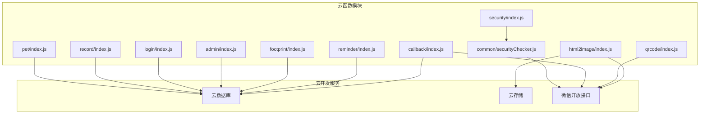
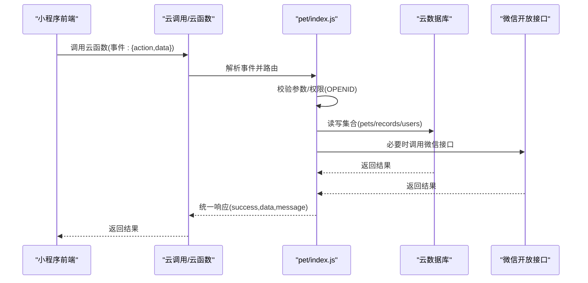
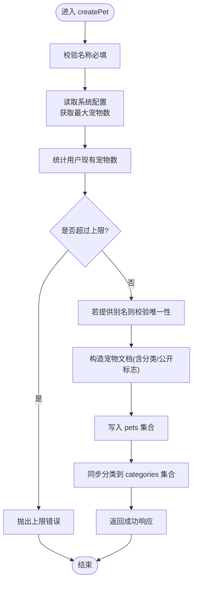
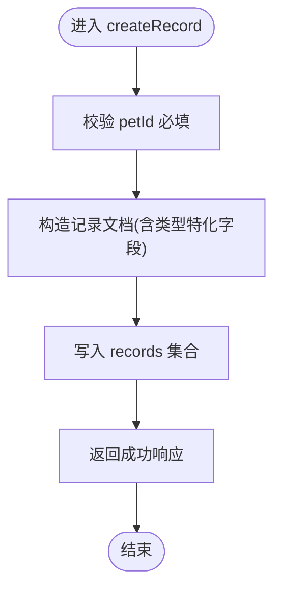
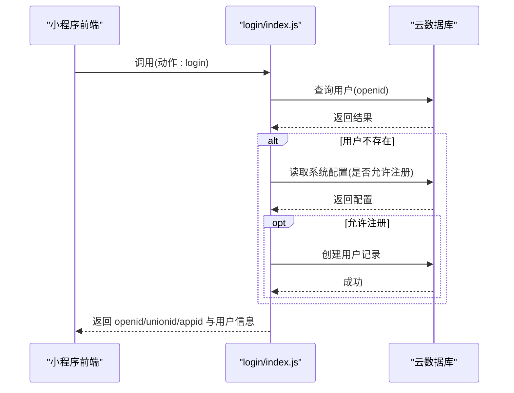
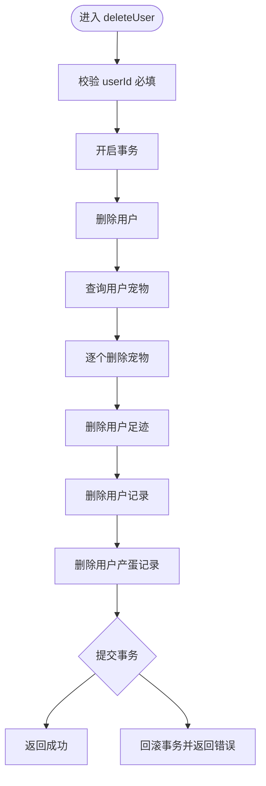
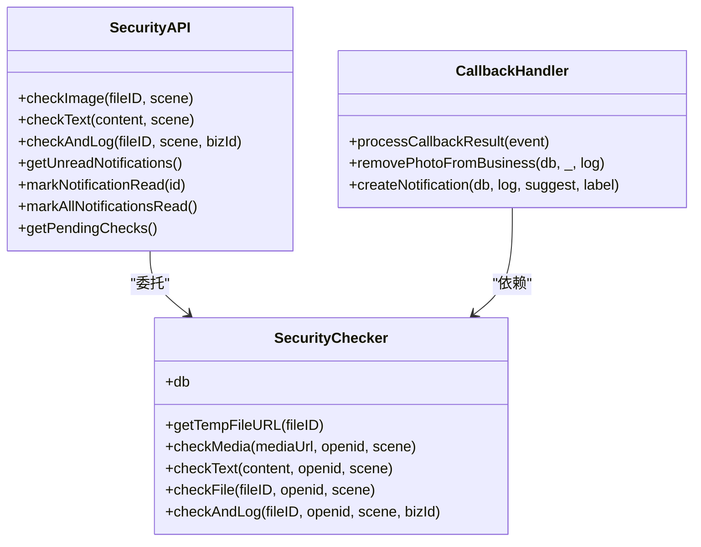
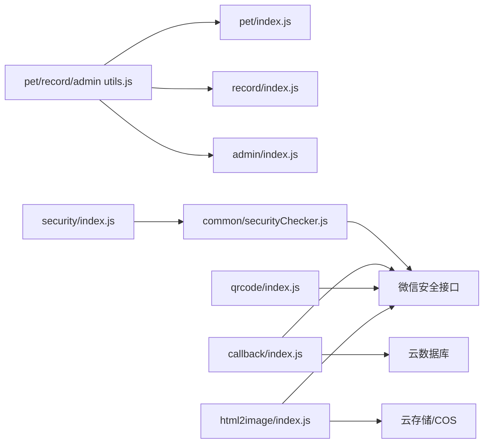

# 云函数详解

<cite>
**本文引用的文件**
- [cloudfunctions/pet/index.js](file://cloudfunctions/pet/index.js)
- [cloudfunctions/pet/utils.js](file://cloudfunctions/pet/utils.js)
- [cloudfunctions/record/index.js](file://cloudfunctions/record/index.js)
- [cloudfunctions/record/utils.js](file://cloudfunctions/record/utils.js)
- [cloudfunctions/login/index.js](file://cloudfunctions/login/index.js)
- [cloudfunctions/admin/index.js](file://cloudfunctions/admin/index.js)
- [cloudfunctions/admin/utils.js](file://cloudfunctions/admin/utils.js)
- [cloudfunctions/common/securityChecker.js](file://cloudfunctions/common/securityChecker.js)
- [cloudfunctions/callback/index.js](file://cloudfunctions/callback/index.js)
- [cloudfunctions/footprint/index.js](file://cloudfunctions/footprint/index.js)
- [cloudfunctions/reminder/index.js](file://cloudfunctions/reminder/index.js)
- [cloudfunctions/qrcode/index.js](file://cloudfunctions/qrcode/index.js)
- [cloudfunctions/html2image/index.js](file://cloudfunctions/html2image/index.js)
- [cloudfunctions/security/index.js](file://cloudfunctions/security/index.js)
</cite>

## 目录
1. [引言](#引言)
2. [项目结构](#项目结构)
3. [核心组件](#核心组件)
4. [架构总览](#架构总览)
5. [详细组件分析](#详细组件分析)
6. [依赖分析](#依赖分析)
7. [性能考虑](#性能考虑)
8. [故障排查指南](#故障排查指南)
9. [结论](#结论)
10. [附录](#附录)

## 引言
本文件面向“养龟档案”项目的云函数系统，提供从架构设计、部署机制、运行原理到各云函数业务逻辑与数据流的全面技术文档。重点覆盖 pet、record、login、admin 等核心云函数，并阐述安全机制、权限控制、错误处理策略、调试与性能优化方法、云函数间调用关系与数据传递、以及与小程序前端的交互模式与 API 设计原则。最后给出扩展开发的最佳实践与注意事项。

## 项目结构
云函数采用按功能模块划分的目录组织方式，核心模块如下：
- pet：宠物管理与谱系查询
- record：事件记录管理（产蛋、出苗、交配、日常等）
- login：登录态校验、用户信息与公开名片维护
- admin：后台统计与管理
- common：通用工具与安全审核公共类
- callback：微信异步审核回调处理
- footprint：社交足迹（动态）管理
- reminder：提醒事项管理
- qrcode：小程序码与 URL Link 生成
- html2image：HTML 转图片服务集成
- security：内容安全薄包装层

图表来源
- [cloudfunctions/pet/index.js:1-82](file://cloudfunctions/pet/index.js#L1-L82)
- [cloudfunctions/record/index.js:1-35](file://cloudfunctions/record/index.js#L1-L35)
- [cloudfunctions/login/index.js:1-148](file://cloudfunctions/login/index.js#L1-L148)
- [cloudfunctions/admin/index.js:1-71](file://cloudfunctions/admin/index.js#L1-L71)
- [cloudfunctions/common/securityChecker.js:1-226](file://cloudfunctions/common/securityChecker.js#L1-L226)
- [cloudfunctions/callback/index.js:1-52](file://cloudfunctions/callback/index.js#L1-L52)
- [cloudfunctions/footprint/index.js:1-32](file://cloudfunctions/footprint/index.js#L1-L32)
- [cloudfunctions/reminder/index.js:1-37](file://cloudfunctions/reminder/index.js#L1-L37)
- [cloudfunctions/qrcode/index.js:1-22](file://cloudfunctions/qrcode/index.js#L1-L22)
- [cloudfunctions/html2image/index.js:1-27](file://cloudfunctions/html2image/index.js#L1-L27)
- [cloudfunctions/security/index.js:1-64](file://cloudfunctions/security/index.js#L1-L64)

章节来源
- [cloudfunctions/pet/index.js:1-82](file://cloudfunctions/pet/index.js#L1-L82)
- [cloudfunctions/record/index.js:1-35](file://cloudfunctions/record/index.js#L1-L35)
- [cloudfunctions/login/index.js:1-148](file://cloudfunctions/login/index.js#L1-L148)
- [cloudfunctions/admin/index.js:1-71](file://cloudfunctions/admin/index.js#L1-L71)
- [cloudfunctions/common/securityChecker.js:1-226](file://cloudfunctions/common/securityChecker.js#L1-L226)
- [cloudfunctions/callback/index.js:1-52](file://cloudfunctions/callback/index.js#L1-L52)
- [cloudfunctions/footprint/index.js:1-32](file://cloudfunctions/footprint/index.js#L1-L32)
- [cloudfunctions/reminder/index.js:1-37](file://cloudfunctions/reminder/index.js#L1-L37)
- [cloudfunctions/qrcode/index.js:1-22](file://cloudfunctions/qrcode/index.js#L1-L22)
- [cloudfunctions/html2image/index.js:1-27](file://cloudfunctions/html2image/index.js#L1-L27)
- [cloudfunctions/security/index.js:1-64](file://cloudfunctions/security/index.js#L1-L64)

## 核心组件
- 通用工具与响应封装：各模块均复用统一的工具库，负责环境初始化、数据库连接、OpenID 获取、成功/失败响应封装、文档 ID 规范化等。
- 安全审核体系：通过公共类封装微信内容安全接口，支持图片与文本审核、异步回调处理、违规清理与用户通知。
- 权限与鉴权：通过云开发上下文获取 OPENID，结合业务数据的 openid 字段进行强校验，确保资源隔离与数据安全。
- 错误处理：统一捕获异常并返回标准化错误响应，便于前端展示与日志追踪。
- 数据一致性：部分管理类操作采用事务，保障跨集合的数据一致性。

章节来源
- [cloudfunctions/pet/utils.js:1-69](file://cloudfunctions/pet/utils.js#L1-L69)
- [cloudfunctions/record/utils.js:1-69](file://cloudfunctions/record/utils.js#L1-L69)
- [cloudfunctions/admin/utils.js:1-69](file://cloudfunctions/admin/utils.js#L1-L69)
- [cloudfunctions/common/securityChecker.js:1-226](file://cloudfunctions/common/securityChecker.js#L1-L226)

## 架构总览
云函数整体遵循“薄服务层 + 云数据库 + 微信开放能力”的架构模式：
- 前端通过云调用或云函数直接请求，传入 action 与 data。
- 云函数解析上下文获取 OPENID，按 action 分派至具体处理器。
- 处理器执行业务逻辑（参数校验、权限校验、数据持久化、第三方接口调用等），返回统一响应结构。
- 安全审核链路独立，支持异步回调与自动清理。

图表来源
- [cloudfunctions/pet/index.js:45-82](file://cloudfunctions/pet/index.js#L45-L82)
- [cloudfunctions/record/index.js:10-35](file://cloudfunctions/record/index.js#L10-L35)
- [cloudfunctions/login/index.js:38-147](file://cloudfunctions/login/index.js#L38-L147)
- [cloudfunctions/admin/index.js:27-71](file://cloudfunctions/admin/index.js#L27-L71)

## 详细组件分析

### 宠物云函数（pet）
职责与能力
- 宠物 CRUD：创建、列表、详情、更新、删除
- 公开展示：公开列表与详情查询，附带最新产蛋/交配记录与天数统计
- 家谱谱系：按最大代数递归构建家谱树，提取父系/母系主线并统计谱系信息
- 分类管理：用户自定义分类的增删改查与自动同步
- 数据净化：将过期临时图片 URL 转换为稳定 cloud:// fileID

关键流程（创建宠物）

图表来源
- [cloudfunctions/pet/index.js:84-138](file://cloudfunctions/pet/index.js#L84-L138)

章节来源
- [cloudfunctions/pet/index.js:1-723](file://cloudfunctions/pet/index.js#L1-L723)
- [cloudfunctions/pet/utils.js:1-69](file://cloudfunctions/pet/utils.js#L1-L69)

### 事件记录云函数（record）
职责与能力
- 记录 CRUD：创建、列表、详情、更新、删除
- 类型特化：产蛋（记录数量）、出苗（分级统计）、交配（关联配对对象）、日常（可带照片）
- QR 缓存：静默更新记录的二维码缓存字段（仅记录创建者可更新）

关键流程（创建记录）

图表来源
- [cloudfunctions/record/index.js:37-82](file://cloudfunctions/record/index.js#L37-L82)

章节来源
- [cloudfunctions/record/index.js:1-191](file://cloudfunctions/record/index.js#L1-L191)
- [cloudfunctions/record/utils.js:1-69](file://cloudfunctions/record/utils.js#L1-L69)

### 登录云函数（login）
职责与能力
- 登录态校验：返回当前 OPENID、APPID、UNIONID
- 管理员校验：查询管理员名单并判断当前用户是否管理员
- 用户信息更新：昵称、头像、手机等
- 公开名片更新：公开领域展示所需字段
- 新用户注册：根据系统配置决定是否允许注册，创建用户记录

关键流程（登录与新用户创建）

图表来源
- [cloudfunctions/login/index.js:38-147](file://cloudfunctions/login/index.js#L38-L147)

章节来源
- [cloudfunctions/login/index.js:1-148](file://cloudfunctions/login/index.js#L1-L148)

### 管理员云函数（admin）
职责与能力
- 统计看板：用户/宠物/足迹总数、今日活跃、用户/宠物增长率
- 用户管理：列表检索、更新状态（含封禁/解封）、删除用户（事务）
- 宠物管理：按名称/分类检索、关联用户信息展示
- 足迹管理：按日期范围与关键字检索
- 配置管理：读取/更新系统配置（含腾讯云 COS、ASR 等）

关键流程（删除用户事务）

图表来源
- [cloudfunctions/admin/index.js:220-258](file://cloudfunctions/admin/index.js#L220-L258)

章节来源
- [cloudfunctions/admin/index.js:1-533](file://cloudfunctions/admin/index.js#L1-L533)
- [cloudfunctions/admin/utils.js:1-69](file://cloudfunctions/admin/utils.js#L1-L69)

### 安全审核与回调（common/securityChecker.js、security/index.js、callback/index.js）
职责与能力
- 安全检查：图片媒体异步审核、文本内容审核
- 审核日志：记录 trace_id、场景、业务关联 ID、状态等
- 异步回调：接收微信推送，更新日志状态，清理违规内容，发送用户通知
- 通知查询：未读通知、标记已读、批量已读、待回调超时检查

类图（安全检查器）

图表来源
- [cloudfunctions/common/securityChecker.js:30-226](file://cloudfunctions/common/securityChecker.js#L30-L226)
- [cloudfunctions/security/index.js:15-64](file://cloudfunctions/security/index.js#L15-L64)
- [cloudfunctions/callback/index.js:57-109](file://cloudfunctions/callback/index.js#L57-L109)

章节来源
- [cloudfunctions/common/securityChecker.js:1-226](file://cloudfunctions/common/securityChecker.js#L1-L226)
- [cloudfunctions/security/index.js:1-200](file://cloudfunctions/security/index.js#L1-L200)
- [cloudfunctions/callback/index.js:1-223](file://cloudfunctions/callback/index.js#L1-L223)

### 其他重要云函数

#### 足迹（footprint）
- 功能：创建、列表、详情、更新、删除
- 限制：受系统配置控制的每条足迹最大图片数量

章节来源
- [cloudfunctions/footprint/index.js:1-160](file://cloudfunctions/footprint/index.js#L1-L160)

#### 提醒（reminder）
- 功能：同一宠物+类型唯一约束、按宠物/用户聚合查询、标记完成
- 兼容：集合不存在时的降级处理与提示

章节来源
- [cloudfunctions/reminder/index.js:1-205](file://cloudfunctions/reminder/index.js#L1-L205)

#### 二维码（qrcode）
- 功能：生成小程序码（云存储返回 fileID）、生成 URL Link（多环境兼容与回退）

章节来源
- [cloudfunctions/qrcode/index.js:1-117](file://cloudfunctions/qrcode/index.js#L1-L117)

#### HTML 转图片（html2image）
- 功能：调用外部服务生成图片，可选上传到腾讯云 COS 或云开发存储
- 配置：从系统配置读取服务地址、超时、COS 凭证与桶信息

章节来源
- [cloudfunctions/html2image/index.js:1-205](file://cloudfunctions/html2image/index.js#L1-L205)

## 依赖分析
- 模块内聚：各云函数围绕单一业务域，内部职责清晰，耦合度低
- 通用工具：utils.js 提供统一的环境初始化、数据库连接、响应封装、ID 规范化
- 安全子系统：security 云函数薄包装 common/securityChecker，回调独立模块，职责边界明确
- 第三方集成：微信开放接口（二维码、URL Link、内容安全）、腾讯云 COS

图表来源
- [cloudfunctions/pet/utils.js:1-69](file://cloudfunctions/pet/utils.js#L1-L69)
- [cloudfunctions/record/utils.js:1-69](file://cloudfunctions/record/utils.js#L1-L69)
- [cloudfunctions/admin/utils.js:1-69](file://cloudfunctions/admin/utils.js#L1-L69)
- [cloudfunctions/security/index.js:1-64](file://cloudfunctions/security/index.js#L1-L64)
- [cloudfunctions/common/securityChecker.js:1-226](file://cloudfunctions/common/securityChecker.js#L1-L226)
- [cloudfunctions/callback/index.js:1-52](file://cloudfunctions/callback/index.js#L1-L52)
- [cloudfunctions/qrcode/index.js:1-22](file://cloudfunctions/qrcode/index.js#L1-L22)
- [cloudfunctions/html2image/index.js:1-27](file://cloudfunctions/html2image/index.js#L1-L27)

章节来源
- [cloudfunctions/pet/utils.js:1-69](file://cloudfunctions/pet/utils.js#L1-L69)
- [cloudfunctions/record/utils.js:1-69](file://cloudfunctions/record/utils.js#L1-L69)
- [cloudfunctions/admin/utils.js:1-69](file://cloudfunctions/admin/utils.js#L1-L69)
- [cloudfunctions/security/index.js:1-64](file://cloudfunctions/security/index.js#L1-L64)
- [cloudfunctions/common/securityChecker.js:1-226](file://cloudfunctions/common/securityChecker.js#L1-L226)
- [cloudfunctions/callback/index.js:1-52](file://cloudfunctions/callback/index.js#L1-L52)
- [cloudfunctions/qrcode/index.js:1-22](file://cloudfunctions/qrcode/index.js#L1-L22)
- [cloudfunctions/html2image/index.js:1-27](file://cloudfunctions/html2image/index.js#L1-L27)

## 性能考虑
- 并发查询与批量处理：管理员模块对用户与宠物的统计采用并发查询，减少等待时间。
- 分页与偏移：宠物、记录、足迹、提醒等均支持分页，避免一次性加载过多数据。
- 事务批处理：删除用户时使用事务，保证原子性与一致性。
- 审核异步化：图片审核采用异步接口，避免阻塞请求路径。
- 缓存与回退：二维码生成支持多环境回退策略，提升稳定性。
- 外部服务超时控制：HTML 转图片服务支持超时配置，防止长时间阻塞。

## 故障排查指南
- 统一错误响应：所有云函数均返回 success/message/error 结构，便于前端统一处理。
- 日志定位：关键路径打印错误堆栈与上下文，便于快速定位。
- 审核回调：若出现“待回调”超时，可通过安全云函数查询 pending 列表并提示用户。
- 权限校验：所有写操作均先校验文档 openid 与当前用户一致，避免越权。
- 集合不存在：提醒模块对集合不存在场景做了降级处理，建议在云开发控制台提前创建集合。

章节来源
- [cloudfunctions/pet/index.js:78-81](file://cloudfunctions/pet/index.js#L78-L81)
- [cloudfunctions/record/index.js:31-34](file://cloudfunctions/record/index.js#L31-L34)
- [cloudfunctions/reminder/index.js:114-120](file://cloudfunctions/reminder/index.js#L114-L120)
- [cloudfunctions/security/index.js:151-200](file://cloudfunctions/security/index.js#L151-L200)

## 结论
本云函数体系以“模块化、统一工具、安全闭环、事务保障”为核心设计原则，既满足业务灵活性，又确保数据安全与一致性。通过清晰的调用链与标准化响应，为小程序前端提供了稳定可靠的服务支撑。后续扩展应遵循现有工具与安全机制，保持模块边界清晰与错误处理一致。

## 附录

### API 设计原则
- 请求结构：事件对象包含 action 与 data，便于路由与参数传递
- 响应结构：统一 success/data/message/error，便于前端一致处理
- 权限模型：基于 openid 的强校验，所有写操作需验证归属
- 错误处理：捕获异常并返回友好错误信息，保留原始错误以便定位

### 云函数间调用关系
- 安全相关：security 云函数委托 common/securityChecker；callback 独立处理微信推送
- 业务协作：pet/record/footprint 等直接读写云数据库；qrcode 与 html2image 调用微信与 COS
- 管理后台：admin 云函数聚合用户、宠物、足迹与配置，提供统计与运维能力

### 扩展开发最佳实践
- 复用工具：优先使用 utils.js 中的统一初始化与响应封装
- 权限前置：所有写操作务必先校验 openid 与文档归属
- 并发优化：对多集合统计与查询使用并发 Promise
- 审核闭环：涉及图片/文本的业务必须记录审核日志并处理回调
- 配置驱动：敏感配置（COS、ASR）通过 systemConfig 管理，避免硬编码
- 错误可观测：在关键路径打印上下文与错误堆栈，便于定位问题