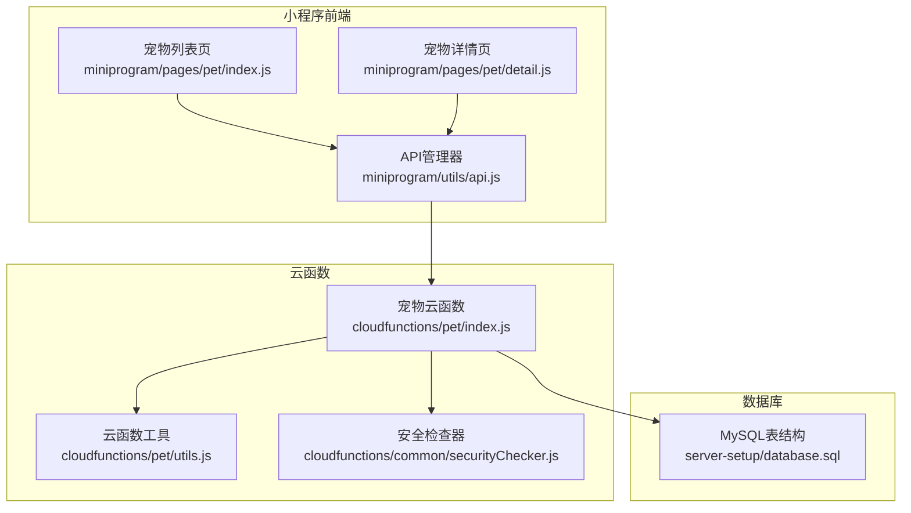
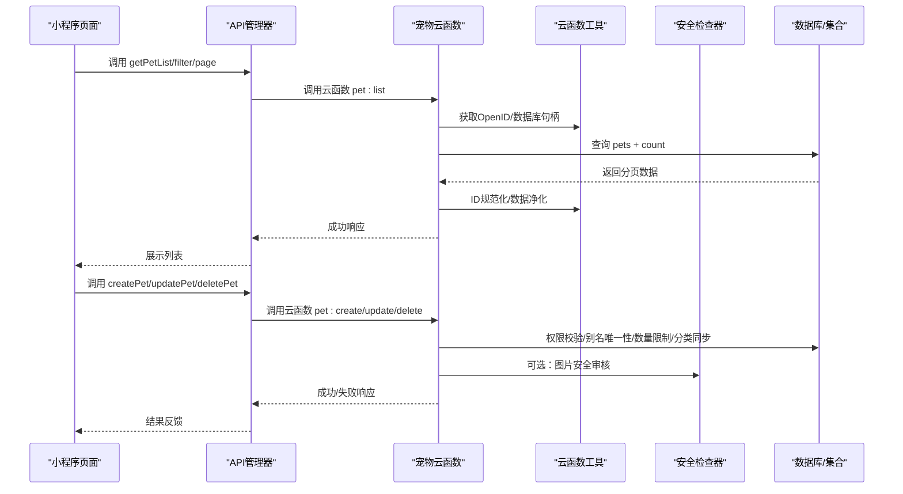
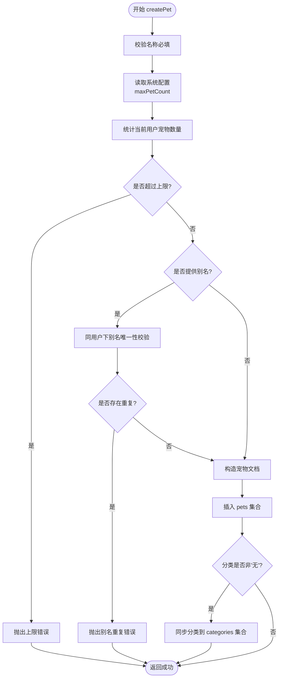
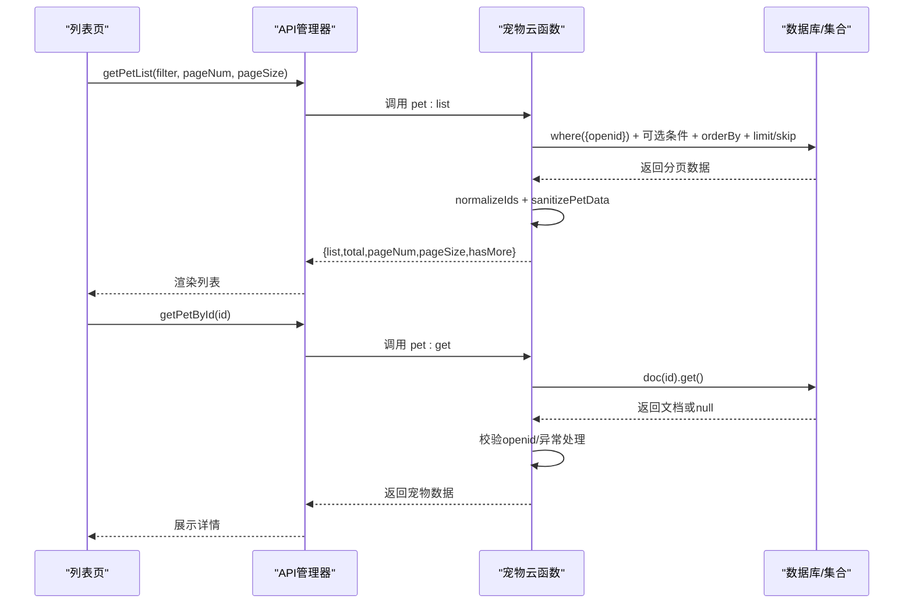
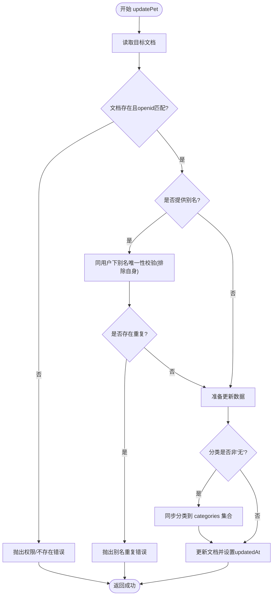
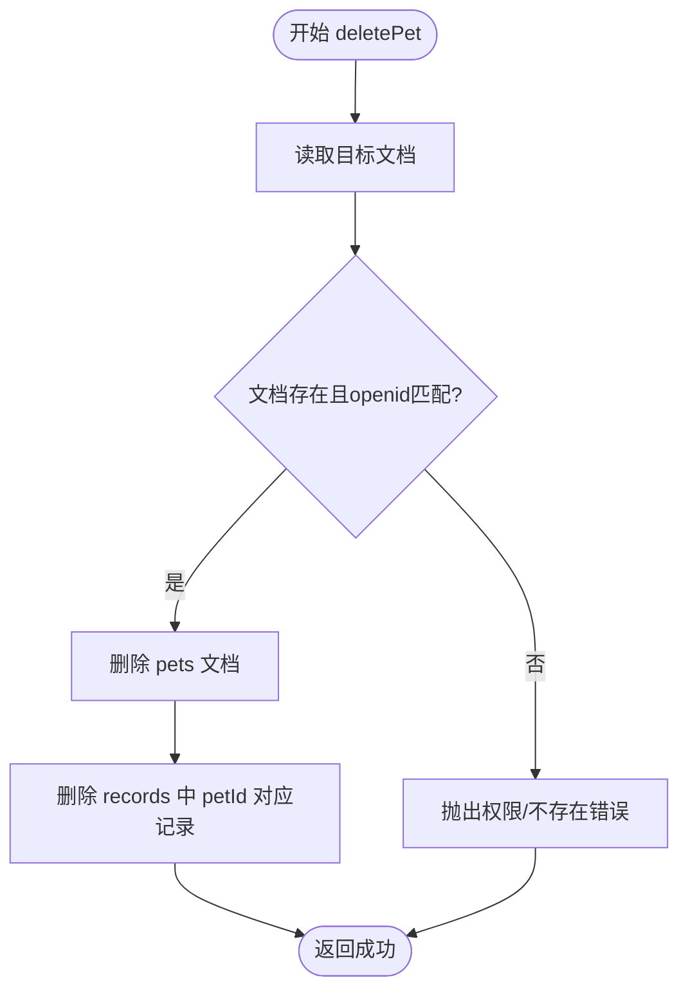
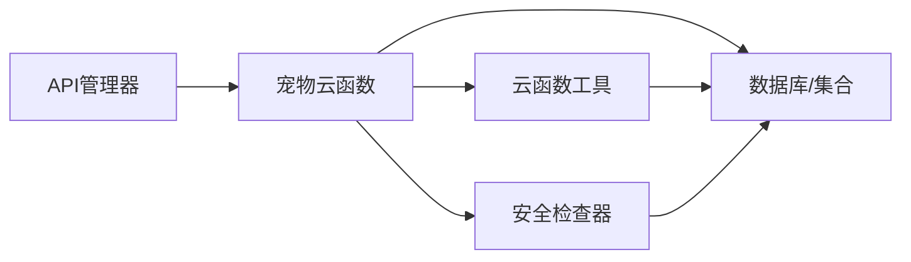

# 宠物CRUD操作

<cite>
**本文引用的文件**
- [cloudfunctions/pet/index.js](file://cloudfunctions/pet/index.js)
- [cloudfunctions/pet/utils.js](file://cloudfunctions/pet/utils.js)
- [cloudfunctions/common/securityChecker.js](file://cloudfunctions/common/securityChecker.js)
- [miniprogram/utils/api.js](file://miniprogram/utils/api.js)
- [miniprogram/pages/pet/index.js](file://miniprogram/pages/pet/index.js)
- [miniprogram/pages/pet/detail.js](file://miniprogram/pages/pet/detail.js)
- [server-setup/database.sql](file://server-setup/database.sql)
</cite>

## 目录
1. [引言](#引言)
2. [项目结构](#项目结构)
3. [核心组件](#核心组件)
4. [架构总览](#架构总览)
5. [详细组件分析](#详细组件分析)
6. [依赖关系分析](#依赖关系分析)
7. [性能考量](#性能考量)
8. [故障排查指南](#故障排查指南)
9. [结论](#结论)

## 引言
本文面向“养龟档案”项目中的宠物CRUD能力，围绕宠物创建、查询、更新、删除四大核心操作，系统梳理数据验证规则、权限控制、别名唯一性、数量限制、分类同步、搜索过滤、分页处理、数据净化、安全审核与错误处理机制，并提供可视化架构图与流程图帮助理解与落地实施。

## 项目结构
- 云函数层：提供统一的宠物CRUD入口与工具封装，负责权限校验、数据校验、分类同步、错误包装与响应格式化。
- 小程序前端：提供宠物列表页与详情页，负责调用云函数、分页加载、搜索过滤、状态计算、图片URL净化与本地缓存。
- 数据库：MySQL侧包含用户、宠物、记录、分类、系统配置等表；云开发侧包含pets、records、categories、systemConfig等集合（云函数中使用）。
- 安全模块：提供图片/文本内容安全审核能力，支持异步提交与日志记录。

图表来源
- [cloudfunctions/pet/index.js:45-82](file://cloudfunctions/pet/index.js#L45-L82)
- [cloudfunctions/pet/utils.js:1-69](file://cloudfunctions/pet/utils.js#L1-L69)
- [cloudfunctions/common/securityChecker.js:1-226](file://cloudfunctions/common/securityChecker.js#L1-L226)
- [miniprogram/utils/api.js:1-208](file://miniprogram/utils/api.js#L1-L208)
- [server-setup/database.sql:1-221](file://server-setup/database.sql#L1-L221)

章节来源
- [cloudfunctions/pet/index.js:1-82](file://cloudfunctions/pet/index.js#L1-L82)
- [cloudfunctions/pet/utils.js:1-69](file://cloudfunctions/pet/utils.js#L1-L69)
- [cloudfunctions/common/securityChecker.js:1-226](file://cloudfunctions/common/securityChecker.js#L1-L226)
- [miniprogram/utils/api.js:1-208](file://miniprogram/utils/api.js#L1-L208)
- [server-setup/database.sql:1-221](file://server-setup/database.sql#L1-L221)

## 核心组件
- 宠物云函数入口：集中处理 create/list/get/update/delete/publicGet 等动作，统一鉴权与错误处理。
- 云函数工具：提供数据库初始化、OpenID获取、成功/失败响应、ID规范化、批量ID规范化等。
- 安全检查器：提供图片/文本审核、临时URL转换、审核日志落库等能力。
- 前端API管理器：封装云函数调用、错误处理、图片上传与安全审核触发。
- 前端页面：列表页负责分页与搜索过滤，详情页负责权限校验与只读模式。

章节来源
- [cloudfunctions/pet/index.js:45-82](file://cloudfunctions/pet/index.js#L45-L82)
- [cloudfunctions/pet/utils.js:1-69](file://cloudfunctions/pet/utils.js#L1-L69)
- [cloudfunctions/common/securityChecker.js:1-226](file://cloudfunctions/common/securityChecker.js#L1-L226)
- [miniprogram/utils/api.js:1-208](file://miniprogram/utils/api.js#L1-L208)
- [miniprogram/pages/pet/index.js:199-338](file://miniprogram/pages/pet/index.js#L199-L338)
- [miniprogram/pages/pet/detail.js:420-482](file://miniprogram/pages/pet/detail.js#L420-L482)

## 架构总览
下图展示了从前端到云函数再到数据库与安全模块的整体调用链路与职责边界。

图表来源
- [cloudfunctions/pet/index.js:84-250](file://cloudfunctions/pet/index.js#L84-L250)
- [cloudfunctions/pet/utils.js:10-69](file://cloudfunctions/pet/utils.js#L10-L69)
- [cloudfunctions/common/securityChecker.js:51-207](file://cloudfunctions/common/securityChecker.js#L51-L207)
- [miniprogram/utils/api.js:43-81](file://miniprogram/utils/api.js#L43-L81)

## 详细组件分析

### 宠物创建 createPet
- 数据验证规则
  - 必填校验：名称必填，否则抛错。
  - 数量限制：读取系统配置中的最大宠物数量上限，若当前用户已达到上限则拒绝创建。
  - 别名唯一性：当提供别名时，需在同一用户下唯一，否则抛错。
- 分类同步机制
  - 创建成功后，若分类非“无”，则尝试同步到分类集合（去重插入）。
- 数据净化
  - 图片URL净化：将过期的临时URL转换为稳定的cloud://fileID，保证展示一致性。
- 错误处理
  - 云函数统一try/catch包装，错误消息透传给前端。

图表来源
- [cloudfunctions/pet/index.js:84-138](file://cloudfunctions/pet/index.js#L84-L138)

章节来源
- [cloudfunctions/pet/index.js:84-138](file://cloudfunctions/pet/index.js#L84-L138)
- [cloudfunctions/pet/utils.js:16-44](file://cloudfunctions/pet/utils.js#L16-L44)

### 宠物查询 getPetList / getPetById
- getPetList
  - 权限验证：查询条件强制绑定openid，确保只能看到自己的宠物。
  - 搜索过滤：
    - 分类筛选：按series过滤。
    - 性别筛选：按gender过滤。
    - 搜索文本：基于正则进行大小写不敏感匹配（name字段）。
  - 分页处理：支持pageNum/pageSize，计算hasMore与total。
  - 数据净化：对返回的photos字段进行URL净化，确保cloud://fileID格式。
- getPetById
  - 权限验证：先读取文档，再比对openid，不存在或无权限即抛错。
  - 数据净化：同样进行URL净化与ID规范化。

图表来源
- [cloudfunctions/pet/index.js:140-191](file://cloudfunctions/pet/index.js#L140-L191)
- [miniprogram/utils/api.js:43-49](file://miniprogram/utils/api.js#L43-L49)
- [miniprogram/pages/pet/index.js:199-338](file://miniprogram/pages/pet/index.js#L199-L338)
- [miniprogram/pages/pet/detail.js:420-459](file://miniprogram/pages/pet/detail.js#L420-L459)

章节来源
- [cloudfunctions/pet/index.js:140-191](file://cloudfunctions/pet/index.js#L140-L191)
- [miniprogram/utils/api.js:43-49](file://miniprogram/utils/api.js#L43-L49)
- [miniprogram/pages/pet/index.js:199-338](file://miniprogram/pages/pet/index.js#L199-L338)
- [miniprogram/pages/pet/detail.js:420-459](file://miniprogram/pages/pet/detail.js#L420-L459)

### 宠物更新 updatePet
- 安全机制与权限验证
  - 先读取目标文档，校验存在性与openid归属，否则抛错。
- 别名冲突检测
  - 更新时对别名进行唯一性校验，排除自身ID（_.neq(id)）。
- 自动分类同步
  - 若新分类非“无”，则同步到分类集合。
- 数据净化与字段处理
  - isPublic字段统一转换为布尔值。
  - updatedAt使用服务器时间戳。

图表来源
- [cloudfunctions/pet/index.js:193-231](file://cloudfunctions/pet/index.js#L193-L231)

章节来源
- [cloudfunctions/pet/index.js:193-231](file://cloudfunctions/pet/index.js#L193-L231)

### 宠物删除 deletePet
- 权限控制与存在性校验
  - 通过doc(id)读取并校验openid归属，不存在或无权限则抛错。
- 级联删除策略
  - 删除宠物文档后，同步删除该宠物在records集合中的所有记录（按petId过滤）。
- 关联数据清理
  - 通过异步移除records集合中的相关记录，避免残留。

图表来源
- [cloudfunctions/pet/index.js:233-250](file://cloudfunctions/pet/index.js#L233-L250)

章节来源
- [cloudfunctions/pet/index.js:233-250](file://cloudfunctions/pet/index.js#L233-L250)

### 分类同步机制
- 同步触发点
  - 创建/更新时，若分类非“无”，则调用同步函数。
- 同步策略
  - 若分类不存在于categories集合，则插入一条新记录；若已存在则忽略。
- 分类维护
  - 支持增删改分类，修改时同步更新使用该分类的宠物记录；删除时将宠物分类置为“无”。

章节来源
- [cloudfunctions/pet/index.js:132-135](file://cloudfunctions/pet/index.js#L132-L135)
- [cloudfunctions/pet/index.js:221-225](file://cloudfunctions/pet/index.js#L221-L225)
- [cloudfunctions/pet/index.js:672-688](file://cloudfunctions/pet/index.js#L672-L688)
- [cloudfunctions/pet/index.js:526-634](file://cloudfunctions/pet/index.js#L526-L634)

### 数据净化与URL处理
- 图片URL净化
  - 将过期的临时URL转换为稳定的cloud://fileID，避免展示失效。
  - 列表与详情均进行净化处理，确保展示一致性。
- ID规范化
  - 将数据库返回的_docId统一映射为id字段，便于前端使用。

章节来源
- [cloudfunctions/pet/index.js:16-43](file://cloudfunctions/pet/index.js#L16-L43)
- [cloudfunctions/pet/utils.js:46-57](file://cloudfunctions/pet/utils.js#L46-L57)

### 错误处理与异常捕获
- 云函数层
  - 统一try/catch包装，捕获内部异常并返回标准化错误响应。
- 前端层
  - API管理器对云函数调用失败进行降级处理，标记cloudAvailable=false并返回友好提示。
  - 页面层结合本地缓存回退逻辑，保证在网络异常时仍可查看数据。

章节来源
- [cloudfunctions/pet/index.js:78-82](file://cloudfunctions/pet/index.js#L78-L82)
- [miniprogram/utils/api.js:27-38](file://miniprogram/utils/api.js#L27-L38)
- [miniprogram/pages/pet/index.js:328-337](file://miniprogram/pages/pet/index.js#L328-L337)
- [miniprogram/pages/pet/detail.js:453-458](file://miniprogram/pages/pet/detail.js#L453-L458)

## 依赖关系分析
- 前端到云函数：通过API管理器统一封装调用，屏蔽云函数细节。
- 云函数到工具：依赖工具模块进行数据库初始化、OpenID获取、响应格式化与ID规范化。
- 云函数到安全：可选调用安全检查器进行图片/文本审核，并记录审核日志。
- 云函数到数据库：直接读写集合（pets、records、categories、systemConfig），并配合MySQL侧表结构。

图表来源
- [miniprogram/utils/api.js:12-38](file://miniprogram/utils/api.js#L12-L38)
- [cloudfunctions/pet/index.js:1-13](file://cloudfunctions/pet/index.js#L1-L13)
- [cloudfunctions/pet/utils.js:1-18](file://cloudfunctions/pet/utils.js#L1-L18)
- [cloudfunctions/common/securityChecker.js:30-41](file://cloudfunctions/common/securityChecker.js#L30-L41)

章节来源
- [miniprogram/utils/api.js:1-208](file://miniprogram/utils/api.js#L1-L208)
- [cloudfunctions/pet/index.js:1-13](file://cloudfunctions/pet/index.js#L1-L13)
- [cloudfunctions/pet/utils.js:1-69](file://cloudfunctions/pet/utils.js#L1-L69)
- [cloudfunctions/common/securityChecker.js:1-226](file://cloudfunctions/common/securityChecker.js#L1-L226)

## 性能考量
- 查询优化
  - 列表查询强制绑定openid，避免跨用户扫描。
  - 使用索引字段（如category、gender、createdAt）提升排序与过滤效率。
- 分页与去重
  - 前端在加载更多时采用去重合并策略，避免重复数据。
- 并发控制
  - 通过序列号防过期请求，避免并发请求导致的数据覆盖。
- 图片URL转换
  - 在前端批量转换cloud://fileID为可展示URL，减少云函数端压力。

章节来源
- [cloudfunctions/pet/index.js:140-179](file://cloudfunctions/pet/index.js#L140-L179)
- [miniprogram/pages/pet/index.js:209-318](file://miniprogram/pages/pet/index.js#L209-L318)

## 故障排查指南
- 常见错误与定位
  - “宠物不存在/无权限”：检查OpenID是否正确、文档是否存在、是否跨用户访问。
  - “别名已存在”：确认同用户下别名唯一性校验逻辑，更新时需排除自身。
  - “达到最大宠物数量限制”：检查系统配置maxPetCount，确认当前用户实际数量。
  - “云函数调用失败”：查看API管理器的降级逻辑与cloudAvailable状态。
- 日志与审计
  - 安全检查器支持写入审核日志，便于追踪审核状态与trace_id。
- 本地回退
  - 前端在云函数失败时可回退到本地缓存数据，保障可用性。

章节来源
- [cloudfunctions/pet/index.js:84-138](file://cloudfunctions/pet/index.js#L84-L138)
- [cloudfunctions/pet/index.js:182-250](file://cloudfunctions/pet/index.js#L182-L250)
- [cloudfunctions/common/securityChecker.js:172-207](file://cloudfunctions/common/securityChecker.js#L172-L207)
- [miniprogram/utils/api.js:27-38](file://miniprogram/utils/api.js#L27-L38)
- [miniprogram/pages/pet/index.js:328-337](file://miniprogram/pages/pet/index.js#L328-L337)

## 结论
本方案围绕宠物CRUD提供了完善的权限控制、数据校验、数量限制、别名唯一性、分类同步与数据净化机制，并通过前后端协作实现稳定可靠的用户体验。建议在生产环境中持续完善安全审核策略与监控告警，确保内容合规与系统稳定性。