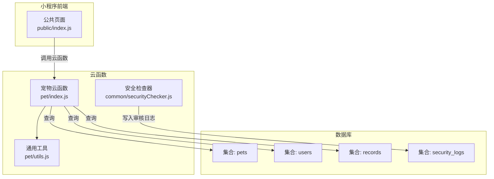
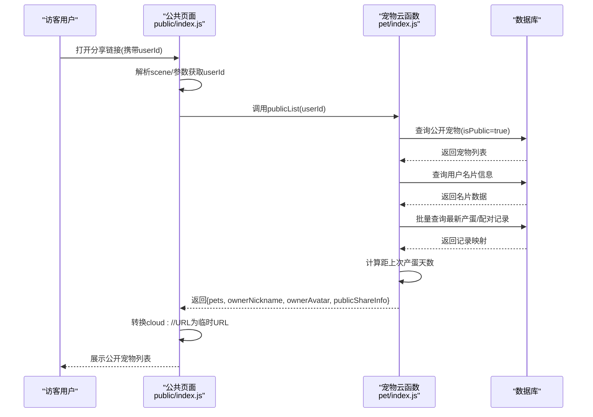
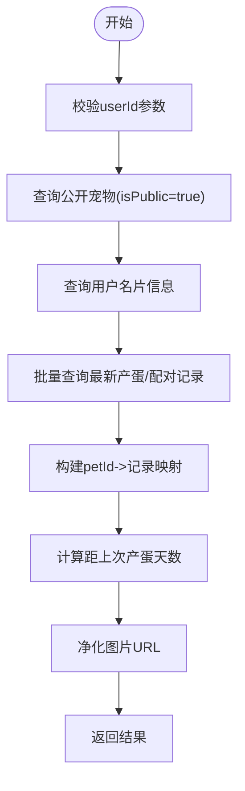
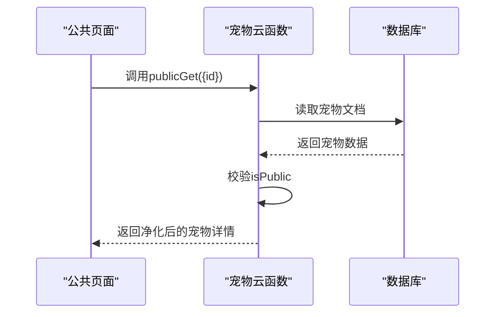
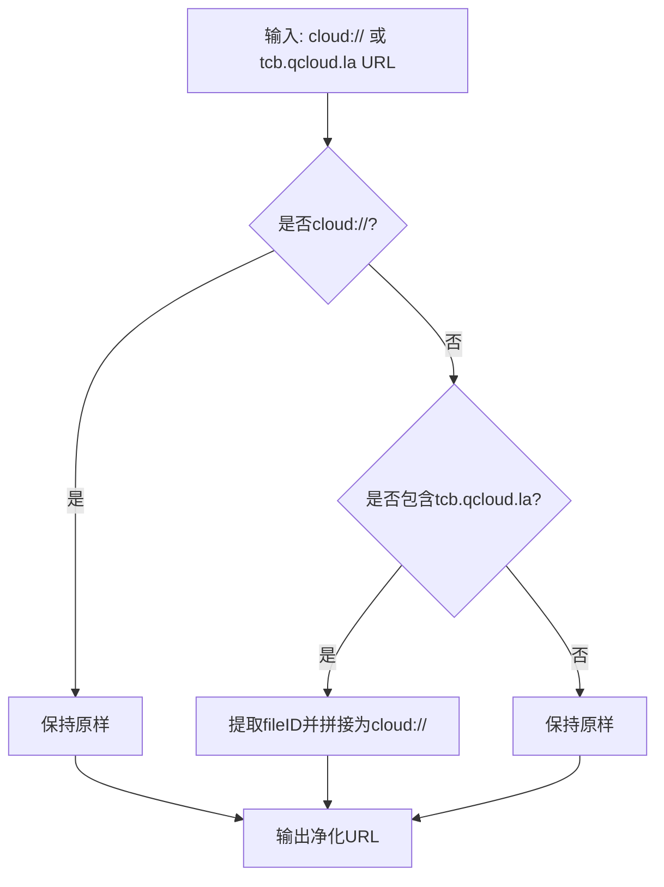
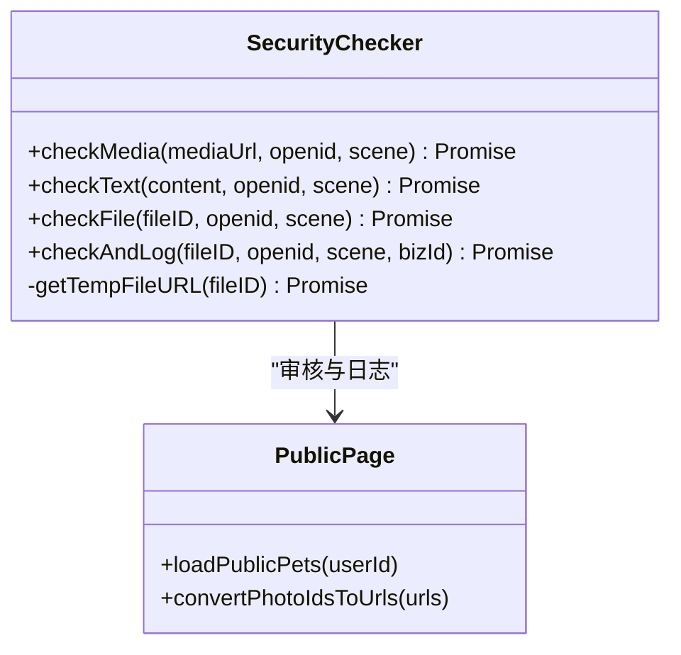
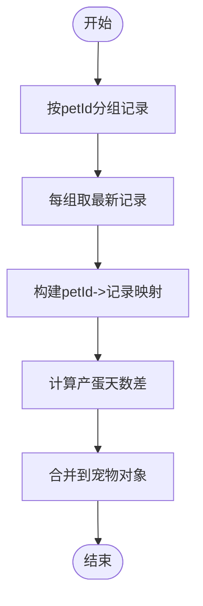
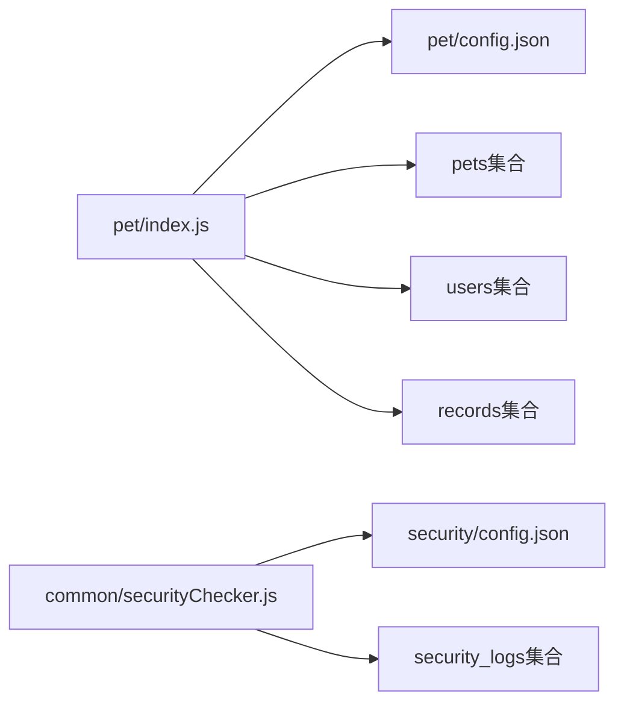

# 宠物公开分享功能

<cite>
**本文档引用的文件**
- [cloudfunctions/pet/index.js](file://cloudfunctions/pet/index.js)
- [cloudfunctions/pet/utils.js](file://cloudfunctions/pet/utils.js)
- [miniprogram/subpkg-report/pages/public/index.js](file://miniprogram/subpkg-report/pages/public/index.js)
- [cloudfunctions/common/securityChecker.js](file://cloudfunctions/common/securityChecker.js)
- [miniprogram/utils/securityChecker.js](file://miniprogram/utils/securityChecker.js)
- [cloudfunctions/security/config.json](file://cloudfunctions/security/config.json)
- [cloudfunctions/pet/config.json](file://cloudfunctions/pet/config.json)
- [cloudfunctions/record/utils.js](file://cloudfunctions/record/utils.js)
</cite>

## 目录
1. [引言](#引言)
2. [项目结构](#项目结构)
3. [核心组件](#核心组件)
4. [架构概览](#架构概览)
5. [详细组件分析](#详细组件分析)
6. [依赖关系分析](#依赖关系分析)
7. [性能考虑](#性能考虑)
8. [故障排查指南](#故障排查指南)
9. [结论](#结论)
10. [附录](#附录)

## 引言
本文件面向养龟档案项目的宠物公开分享功能，围绕公开宠物列表与详情两大能力，系统性阐述以下技术要点：
- 公开宠物列表(getPublicPets)的实现原理：用户权限验证、公开宠物筛选、名片信息获取、最新记录关联与时间距离计算。
- 公开宠物详情(getPublicPetById)的功能设计：权限验证机制、数据安全保护与访问控制策略。
- 分享状态管理、隐私保护机制与用户数据脱敏处理。
- 公开宠物统计信息计算、时间距离计算与数据聚合逻辑。
- 分享功能的配置选项、访问统计与安全审计实现。

## 项目结构
公开分享功能涉及云开发与小程序前端的协同：
- 云函数层：宠物相关云函数负责公开数据查询、数据净化与统计聚合。
- 前端层：公共页面负责接收用户ID、调用云函数、展示公开信息与处理图片URL转换。
- 安全层：内容安全审核云函数与前端封装，保障图片与文本的安全性。

**图表来源**
- [cloudfunctions/pet/index.js:45-82](file://cloudfunctions/pet/index.js#L45-L82)
- [cloudfunctions/pet/utils.js:1-69](file://cloudfunctions/pet/utils.js#L1-L69)
- [miniprogram/subpkg-report/pages/public/index.js:100-210](file://miniprogram/subpkg-report/pages/public/index.js#L100-L210)
- [cloudfunctions/common/securityChecker.js:180-207](file://cloudfunctions/common/securityChecker.js#L180-L207)

**章节来源**
- [cloudfunctions/pet/index.js:1-82](file://cloudfunctions/pet/index.js#L1-L82)
- [miniprogram/subpkg-report/pages/public/index.js:1-44](file://miniprogram/subpkg-report/pages/public/index.js#L1-L44)

## 核心组件
- 公开宠物列表(getPublicPets)：按用户ID筛选公开宠物，附带主人名片信息与最新产蛋/配对记录，计算距上次产蛋天数。
- 公开宠物详情(getPublicPetById)：无需权限验证，仅允许访问标记为公开的宠物。
- 数据净化与URL转换：将cloud://与tcb.qcloud.la格式的图片URL转换为可访问的临时URL。
- 安全与审计：通过安全检查器提交图片/文本审核，并记录到security_logs集合。

**章节来源**
- [cloudfunctions/pet/index.js:252-368](file://cloudfunctions/pet/index.js#L252-L368)
- [cloudfunctions/pet/utils.js:16-43](file://cloudfunctions/pet/utils.js#L16-L43)
- [cloudfunctions/common/securityChecker.js:30-207](file://cloudfunctions/common/securityChecker.js#L30-L207)

## 架构概览
公开分享功能的端到端流程如下：

**图表来源**
- [miniprogram/subpkg-report/pages/public/index.js:20-44](file://miniprogram/subpkg-report/pages/public/index.js#L20-L44)
- [miniprogram/subpkg-report/pages/public/index.js:100-210](file://miniprogram/subpkg-report/pages/public/index.js#L100-L210)
- [cloudfunctions/pet/index.js:252-349](file://cloudfunctions/pet/index.js#L252-L349)

## 详细组件分析

### 公开宠物列表(getPublicPets)实现
- 权限与筛选
  - 输入：目标用户ID(userId)。
  - 过滤条件：openid等于userId且isPublic为真。
  - 结果：按创建时间倒序排列的公开宠物列表。
- 名片信息获取
  - 查询users集合，返回nickname、avatar与publicSpecialty、publicWechatId、publicWechatPublic、publicRegion、publicTags、publicIntro、publicCover等公开名片字段。
- 最新记录关联与时间距离计算
  - 批量查询records集合，分别按petId分组取最新产蛋与配对记录。
  - 对每个宠物，计算最新产蛋日期到当前日期的天数差，作为“距上次产蛋天数”。
- 数据净化
  - 将cloud://与tcb.qcloud.la格式的图片URL转换为可用的临时URL，确保前端可渲染。
- 返回结构
  - 返回pets、ownerNickname、ownerAvatar、publicShareInfo。

**图表来源**
- [cloudfunctions/pet/index.js:252-349](file://cloudfunctions/pet/index.js#L252-L349)

**章节来源**
- [cloudfunctions/pet/index.js:252-349](file://cloudfunctions/pet/index.js#L252-L349)

### 公开宠物详情(getPublicPetById)实现
- 权限与访问控制
  - 不需要鉴权上下文，但必须传入有效宠物ID。
  - 仅当目标宠物的isPublic为真时才允许访问，否则拒绝。
- 数据安全
  - 返回前对图片URL进行净化，确保使用临时URL。
- 适用场景
  - 用于公共页面跳转详情或预览，无需登录态即可查看公开信息。

**图表来源**
- [cloudfunctions/pet/index.js:351-368](file://cloudfunctions/pet/index.js#L351-L368)

**章节来源**
- [cloudfunctions/pet/index.js:351-368](file://cloudfunctions/pet/index.js#L351-L368)

### 数据净化与URL转换
- 图片URL净化
  - 支持将cloud://与tcb.qcloud.la格式转换为临时URL，便于前端直接渲染。
- 前端URL转换
  - 在公共页面中，对头像、封面、宠物照片等进行统一转换，保证跨环境兼容。

**图表来源**
- [cloudfunctions/pet/utils.js:16-32](file://cloudfunctions/pet/utils.js#L16-L32)
- [miniprogram/subpkg-report/pages/public/index.js:119-191](file://miniprogram/subpkg-report/pages/public/index.js#L119-L191)

**章节来源**
- [cloudfunctions/pet/utils.js:16-43](file://cloudfunctions/pet/utils.js#L16-L43)
- [miniprogram/subpkg-report/pages/public/index.js:119-191](file://miniprogram/subpkg-report/pages/public/index.js#L119-L191)

### 安全与隐私保护
- 内容安全审核
  - 云函数侧提供SecurityChecker，支持图片媒体审核与文本内容审核。
  - 支持将cloud://文件自动转换为临时URL后进行审核。
  - 审核结果写入security_logs集合，便于审计追踪。
- 前端封装
  - 小程序端提供SecurityChecker封装，支持异步/同步审核与批量处理。
- 隐私字段控制
  - 公开名片字段由用户自行设置公开范围，如wechatPublic、region、tags等。
  - 公共页面仅展示公开字段，避免泄露私密信息。

**图表来源**
- [cloudfunctions/common/securityChecker.js:30-207](file://cloudfunctions/common/securityChecker.js#L30-L207)
- [miniprogram/utils/securityChecker.js:13-107](file://miniprogram/utils/securityChecker.js#L13-L107)

**章节来源**
- [cloudfunctions/common/securityChecker.js:30-207](file://cloudfunctions/common/securityChecker.js#L30-L207)
- [miniprogram/utils/securityChecker.js:13-107](file://miniprogram/utils/securityChecker.js#L13-L107)

### 统计信息与数据聚合
- 最新记录聚合
  - 通过records集合按petId分组取最新产蛋与配对记录，构建映射以O(1)时间复杂度关联到对应宠物。
- 时间距离计算
  - 对最新产蛋日期与当前日期做毫秒级差值计算，转换为整数天数，过滤负值。
- 数据聚合逻辑
  - 将净化后的宠物数据、名片信息、最新记录与天数差合并为最终响应体。

**图表来源**
- [cloudfunctions/pet/index.js:297-346](file://cloudfunctions/pet/index.js#L297-L346)

**章节来源**
- [cloudfunctions/pet/index.js:297-346](file://cloudfunctions/pet/index.js#L297-L346)

## 依赖关系分析
- 云函数权限配置
  - 宠物云函数：默认无openapi权限声明。
  - 安全云函数：声明了security.mediaCheckAsync与security.msgSecCheck权限。
- 数据库集合依赖
  - pets：存储宠物基本信息与公开状态。
  - users：存储用户公开名片信息。
  - records：存储产蛋与配对等事件记录。
  - security_logs：存储内容审核日志。

**图表来源**
- [cloudfunctions/pet/config.json:1-6](file://cloudfunctions/pet/config.json#L1-L6)
- [cloudfunctions/security/config.json:1-9](file://cloudfunctions/security/config.json#L1-L9)
- [cloudfunctions/pet/index.js:252-349](file://cloudfunctions/pet/index.js#L252-L349)
- [cloudfunctions/common/securityChecker.js:180-207](file://cloudfunctions/common/securityChecker.js#L180-L207)

**章节来源**
- [cloudfunctions/pet/config.json:1-6](file://cloudfunctions/pet/config.json#L1-L6)
- [cloudfunctions/security/config.json:1-9](file://cloudfunctions/security/config.json#L1-L9)

## 性能考虑
- 批量查询优化
  - 公开列表通过一次查询获取公开宠物，随后使用_.in批量查询records，减少多次往返。
- 映射与聚合
  - 使用哈希表建立petId->记录映射，降低二次遍历成本。
- URL转换
  - 仅对cloud://与tcb.qcloud.la格式执行转换，避免不必要的网络请求。
- 前端缓存
  - 公共页面对最近浏览记录进行本地缓存，提升交互体验。

[本节为通用指导，无需特定文件分析]

## 故障排查指南
- 公开列表为空
  - 检查目标用户是否设置了公开宠物(isPublic=true)。
  - 确认用户名片信息是否存在且公开字段有效。
- 图片无法显示
  - 确认图片URL是否为cloud://或tcb.qcloud.la格式。
  - 检查临时URL转换是否成功，必要时重新获取。
- 审核异常
  - 检查security云函数权限配置是否正确。
  - 查看security_logs集合中的审核记录与trace_id。
- 权限错误
  - 公开详情访问被拒通常因目标宠物未公开(isPublic=false)，请确认宠物公开状态。

**章节来源**
- [cloudfunctions/pet/index.js:252-368](file://cloudfunctions/pet/index.js#L252-L368)
- [cloudfunctions/common/securityChecker.js:180-207](file://cloudfunctions/common/securityChecker.js#L180-L207)

## 结论
公开分享功能通过严格的公开状态控制与数据净化机制，实现了安全、高效的公共展示能力。结合内容安全审核与审计日志，进一步强化了平台的数据安全与合规性。建议在后续迭代中：
- 增加访问统计埋点，记录公共页面的浏览次数与来源。
- 优化图片缓存策略，减少重复转换带来的延迟。
- 扩展隐私字段的细粒度控制，允许用户选择性公开更多名片信息。

[本节为总结性内容，无需特定文件分析]

## 附录
- 关键API路径
  - 公开宠物列表：pet云函数的publicList动作，参数为{ userId }。
  - 公开宠物详情：pet云函数的publicGet动作，参数为{ id }。
- 前端调用示例
  - 公共页面通过API.callCloudFunction('pet', 'publicList', { userId })获取公开列表。
  - 详情页通过API.callCloudFunction('pet', 'publicGet', { id })获取公开详情。

**章节来源**
- [miniprogram/subpkg-report/pages/public/index.js:100-210](file://miniprogram/subpkg-report/pages/public/index.js#L100-L210)
- [cloudfunctions/pet/index.js:45-82](file://cloudfunctions/pet/index.js#L45-L82)