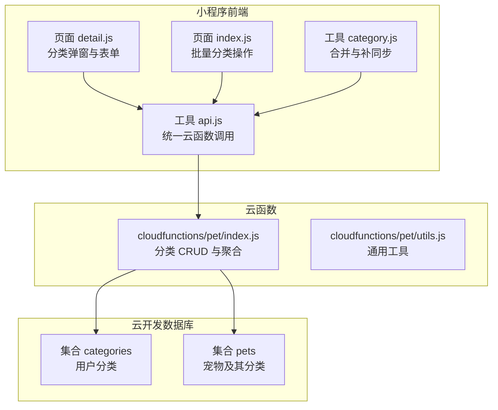
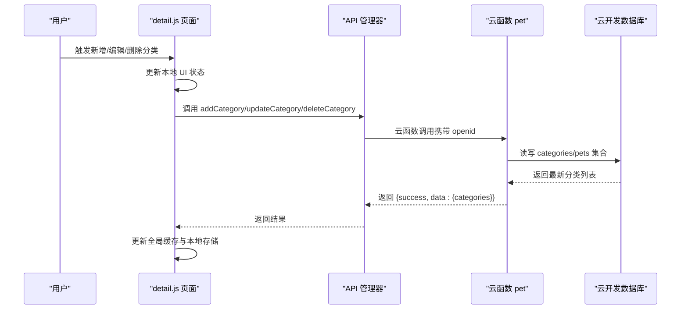
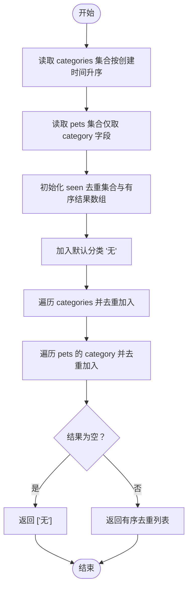
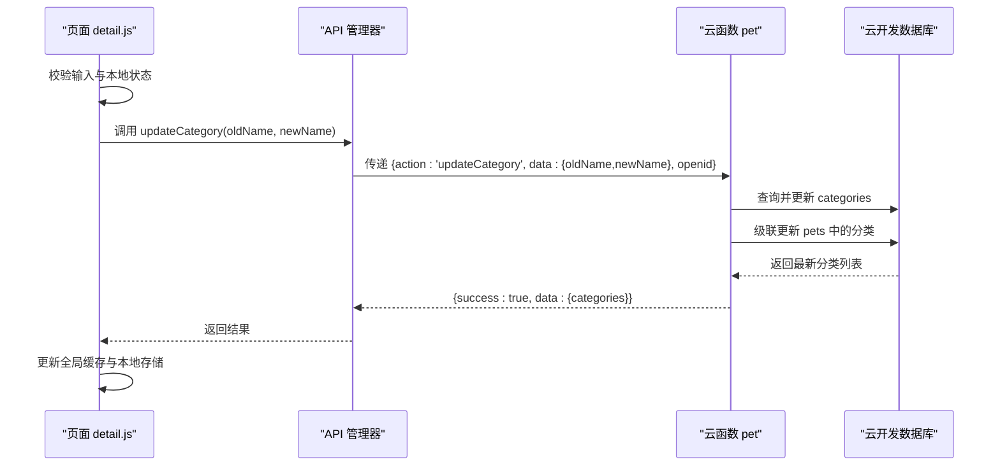
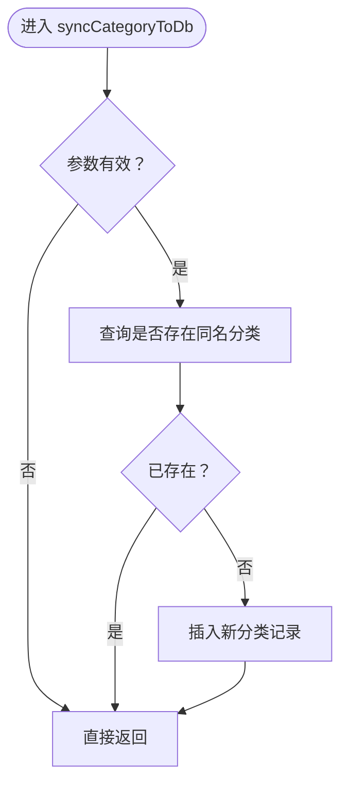
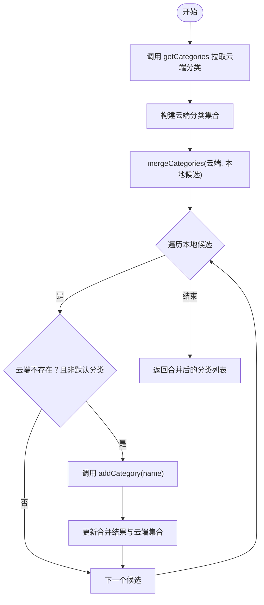
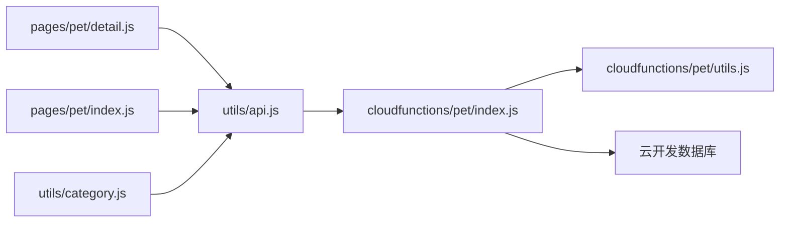

# 宠物分类管理系统

<cite>
**本文引用的文件**
- [miniprogram/utils/category.js](file://miniprogram/utils/category.js)
- [cloudfunctions/pet/index.js](file://cloudfunctions/pet/index.js)
- [cloudfunctions/pet/utils.js](file://cloudfunctions/pet/utils.js)
- [miniprogram/utils/api.js](file://miniprogram/utils/api.js)
- [miniprogram/pages/pet/detail.js](file://miniprogram/pages/pet/detail.js)
- [miniprogram/pages/pet/index.js](file://miniprogram/pages/pet/index.js)
- [server-setup/database.sql](file://server-setup/database.sql)
- [cloudfunctions/common/securityChecker.js](file://cloudfunctions/common/securityChecker.js)
- [miniprogram/utils/securityChecker.js](file://miniprogram/utils/securityChecker.js)
</cite>

## 目录
1. [引言](#引言)
2. [项目结构](#项目结构)
3. [核心组件](#核心组件)
4. [架构总览](#架构总览)
5. [详细组件分析](#详细组件分析)
6. [依赖关系分析](#依赖关系分析)
7. [性能考虑](#性能考虑)
8. [故障排查指南](#故障排查指南)
9. [结论](#结论)
10. [附录](#附录)

## 引言
本技术文档围绕“养龟档案”项目的宠物分类管理系统展开，重点阐释以下能力与机制：
- 分类列表获取（buildCategoryList）的实现原理：分类集合读取、宠物分类合并、去重与排序逻辑
- 分类增删改（addCategory/updateCategory/deleteCategory）的完整生命周期：权限验证、数据一致性保证、级联更新机制
- 分类同步（syncCategoryToDb）机制：自动分类创建与数据完整性维护
- 安全策略与权限控制：基于 openid 的用户隔离与操作约束
- 扩展性设计、性能优化与大数据量处理方案

## 项目结构
分类管理涉及三层协作：
- 前端小程序（页面与工具）：负责用户交互、本地缓存与云函数调用
- 云函数（pet 模块）：提供分类 CRUD、列表聚合与同步逻辑
- 数据库存储：云开发数据库（categories、pets 等集合）

图表来源
- [miniprogram/pages/pet/detail.js:640-839](file://miniprogram/pages/pet/detail.js#L640-L839)
- [miniprogram/pages/pet/index.js:800-999](file://miniprogram/pages/pet/index.js#L800-L999)
- [miniprogram/utils/api.js:1-208](file://miniprogram/utils/api.js#L1-L208)
- [miniprogram/utils/category.js:1-65](file://miniprogram/utils/category.js#L1-L65)
- [cloudfunctions/pet/index.js:45-82](file://cloudfunctions/pet/index.js#L45-L82)
- [cloudfunctions/pet/utils.js:1-69](file://cloudfunctions/pet/utils.js#L1-L69)

章节来源
- [miniprogram/pages/pet/detail.js:640-839](file://miniprogram/pages/pet/detail.js#L640-L839)
- [miniprogram/pages/pet/index.js:800-999](file://miniprogram/pages/pet/index.js#L800-L999)
- [miniprogram/utils/api.js:1-208](file://miniprogram/utils/api.js#L1-L208)
- [miniprogram/utils/category.js:1-65](file://miniprogram/utils/category.js#L1-L65)
- [cloudfunctions/pet/index.js:45-82](file://cloudfunctions/pet/index.js#L45-L82)
- [cloudfunctions/pet/utils.js:1-69](file://cloudfunctions/pet/utils.js#L1-L69)

## 核心组件
- 分类合并与补同步工具：提供多来源分类合并、去重与“无”分类优先策略，并支持将本地缺失的分类同步至云端
- 云函数分类服务：提供分类 CRUD、列表聚合（buildCategoryList）、自动同步（syncCategoryToDb）
- 前端 API 管理器：封装云函数调用，统一错误处理与降级策略
- 页面交互层：在新增、编辑、删除分类时，先更新本地 UI，再异步同步至云端，失败时回滚本地状态

章节来源
- [miniprogram/utils/category.js:1-65](file://miniprogram/utils/category.js#L1-L65)
- [cloudfunctions/pet/index.js:525-634](file://cloudfunctions/pet/index.js#L525-L634)
- [cloudfunctions/pet/index.js:636-688](file://cloudfunctions/pet/index.js#L636-L688)
- [miniprogram/utils/api.js:1-208](file://miniprogram/utils/api.js#L1-L208)
- [miniprogram/pages/pet/detail.js:640-839](file://miniprogram/pages/pet/detail.js#L640-L839)

## 架构总览
分类管理采用“前端本地状态 + 云端持久化”的双轨模式，确保用户体验与数据一致性。

图表来源
- [miniprogram/pages/pet/detail.js:640-839](file://miniprogram/pages/pet/detail.js#L640-L839)
- [miniprogram/utils/api.js:67-81](file://miniprogram/utils/api.js#L67-L81)
- [cloudfunctions/pet/index.js:525-634](file://cloudfunctions/pet/index.js#L525-L634)

## 详细组件分析

### 分类列表获取（buildCategoryList）实现原理
- 数据来源
  - categories 集合：按创建时间升序排列的用户自定义分类
  - pets 集合：用户下所有宠物的 category 字段（可能包含尚未入库的分类）
- 合并与去重
  - 以“无”为默认首项，随后依次加入 categories 集合中的分类
  - 遍历 pets 中的分类，仅当非空且未出现过时加入
- 复杂度
  - 时间复杂度 O(N + M)，N 为 categories 条目数，M 为 pets 条目数
  - 空间复杂度 O(N + M)，用于去重集合与结果数组

图表来源
- [cloudfunctions/pet/index.js:636-665](file://cloudfunctions/pet/index.js#L636-L665)

章节来源
- [cloudfunctions/pet/index.js:636-665](file://cloudfunctions/pet/index.js#L636-L665)

### 分类增删改生命周期与一致性保障
- 新增分类（addCategory）
  - 参数校验：名称非空，去除空白
  - 唯一性校验：同一 openid 下不允许重复名称
  - 写入数据库：插入新分类记录
  - 刷新列表：重新构建分类列表并返回
- 修改分类（updateCategory）
  - 权限与输入校验：必须登录、旧/新名称均非空
  - 禁止修改默认分类“无”，新名称不得为“无”
  - 唯一性校验：新名称不可重复
  - 级联更新：同时更新 pets 集合中使用旧分类的记录为新分类
  - 刷新列表：返回最新分类列表
- 删除分类（deleteCategory）
  - 权限与输入校验：必须登录，名称非空
  - 禁止删除默认分类“无”
  - 级联更新：将 pets 集合中使用该分类的记录统一改为“无”
  - 刷新列表：返回最新分类列表

图表来源
- [miniprogram/pages/pet/detail.js:717-767](file://miniprogram/pages/pet/detail.js#L717-L767)
- [cloudfunctions/pet/index.js:558-608](file://cloudfunctions/pet/index.js#L558-L608)

章节来源
- [cloudfunctions/pet/index.js:525-634](file://cloudfunctions/pet/index.js#L525-L634)
- [miniprogram/pages/pet/detail.js:695-767](file://miniprogram/pages/pet/detail.js#L695-L767)

### 分类同步（syncCategoryToDb）机制
- 触发时机
  - 创建/更新宠物时，若 category 非空且非“无”，则尝试同步到 categories 集合
- 同步策略
  - 若目标分类不存在，则自动创建；若已存在则忽略
  - 发生异常时记录错误日志，不影响主流程
- 作用
  - 保证“用户输入的分类”与“数据库中可选分类”一致，避免脏数据与不一致

图表来源
- [cloudfunctions/pet/index.js:672-688](file://cloudfunctions/pet/index.js#L672-L688)
- [cloudfunctions/pet/index.js:133-135](file://cloudfunctions/pet/index.js#L133-L135)
- [cloudfunctions/pet/index.js:223-225](file://cloudfunctions/pet/index.js#L223-L225)

章节来源
- [cloudfunctions/pet/index.js:672-688](file://cloudfunctions/pet/index.js#L672-L688)
- [cloudfunctions/pet/index.js:133-135](file://cloudfunctions/pet/index.js#L133-L135)
- [cloudfunctions/pet/index.js:223-225](file://cloudfunctions/pet/index.js#L223-L225)

### 分类合并与补同步（前端侧）
- 合并策略
  - 多来源数组合并，去重，保持顺序
  - 默认“无”始终位于首位，且不重复
- 补同步
  - 从云端拉取现有分类，与本地候选分类比对
  - 对于本地存在而云端缺失的分类，逐个调用 addCategory 进行补同步
  - 成功后合并结果并更新本地缓存

图表来源
- [miniprogram/utils/category.js:29-59](file://miniprogram/utils/category.js#L29-L59)
- [miniprogram/utils/category.js:4-24](file://miniprogram/utils/category.js#L4-L24)

章节来源
- [miniprogram/utils/category.js:1-65](file://miniprogram/utils/category.js#L1-L65)

### 安全策略与权限控制
- 用户隔离
  - 所有分类操作均需携带 openid，数据库查询与更新限定 openid
- 输入校验
  - 新增/修改必填且去空白；禁止将分类命名为“无”
  - 默认分类“无”不可修改或删除
- 错误处理
  - 云函数统一捕获异常并返回标准化错误响应
  - 前端在调用失败时回滚本地状态，保证界面一致性
- 内容安全（扩展）
  - 图片与文本审核由安全云函数提供，可在上传与发布流程中集成

章节来源
- [cloudfunctions/pet/index.js:525-634](file://cloudfunctions/pet/index.js#L525-L634)
- [cloudfunctions/pet/index.js:45-82](file://cloudfunctions/pet/index.js#L45-L82)
- [cloudfunctions/common/securityChecker.js:1-226](file://cloudfunctions/common/securityChecker.js#L1-L226)
- [miniprogram/utils/securityChecker.js:1-122](file://miniprogram/utils/securityChecker.js#L1-L122)

### 批量操作优化
- 本地先行更新：UI 层先更新本地状态，提升交互流畅度
- 异步同步：调用云函数异步执行，失败时回滚本地状态
- 列表刷新：每次变更后统一刷新分类列表，避免中间态显示
- 前端缓存：使用本地存储与全局数据缓存减少重复请求

章节来源
- [miniprogram/pages/pet/detail.js:640-839](file://miniprogram/pages/pet/detail.js#L640-L839)
- [miniprogram/pages/pet/index.js:800-999](file://miniprogram/pages/pet/index.js#L800-L999)

## 依赖关系分析
- 前端依赖
  - 页面依赖 API 管理器进行云函数调用
  - 工具模块依赖 API 管理器进行分类合并与补同步
- 云函数依赖
  - 依赖数据库工具模块获取连接与通用响应格式
  - 依赖 openid 进行用户隔离
- 数据库依赖
  - categories 集合：存储用户分类
  - pets 集合：存储宠物及其分类，作为 buildCategoryList 的补充来源

图表来源
- [miniprogram/pages/pet/detail.js:640-839](file://miniprogram/pages/pet/detail.js#L640-L839)
- [miniprogram/pages/pet/index.js:800-999](file://miniprogram/pages/pet/index.js#L800-L999)
- [miniprogram/utils/api.js:1-208](file://miniprogram/utils/api.js#L1-L208)
- [cloudfunctions/pet/index.js:45-82](file://cloudfunctions/pet/index.js#L45-L82)
- [cloudfunctions/pet/utils.js:1-69](file://cloudfunctions/pet/utils.js#L1-L69)
- [miniprogram/utils/category.js:1-65](file://miniprogram/utils/category.js#L1-L65)

章节来源
- [miniprogram/pages/pet/detail.js:640-839](file://miniprogram/pages/pet/detail.js#L640-L839)
- [miniprogram/pages/pet/index.js:800-999](file://miniprogram/pages/pet/index.js#L800-L999)
- [miniprogram/utils/api.js:1-208](file://miniprogram/utils/api.js#L1-L208)
- [cloudfunctions/pet/index.js:45-82](file://cloudfunctions/pet/index.js#L45-L82)
- [cloudfunctions/pet/utils.js:1-69](file://cloudfunctions/pet/utils.js#L1-L69)
- [miniprogram/utils/category.js:1-65](file://miniprogram/utils/category.js#L1-L65)

## 性能考虑
- 列表聚合
  - 使用并发读取 categories 与 pets 字段，降低等待时间
  - 去重使用 Set，时间复杂度线性
- 级联更新
  - updateCategory 与 deleteCategory 的级联更新为单次批量更新，避免多次往返
- 前端缓存
  - 本地存储与全局数据缓存减少重复请求
- 大数据量建议
  - 分类数量增长时，建议在前端引入虚拟滚动与分页加载
  - 在云函数侧增加索引与查询优化（如按 openid 精确过滤）
  - 对频繁变更的分类，可考虑引入增量刷新策略

## 故障排查指南
- 常见错误与定位
  - “用户未登录”：确认云函数入口是否正确提取 openid
  - “分类已存在”：检查唯一性校验与输入去空白
  - “无权限”：确认 pets 查询与更新时的 openid 校验
- 日志与回滚
  - 云函数捕获异常并返回标准化错误
  - 前端在调用失败时回滚本地状态，恢复 UI 一致性
- 数据一致性
  - 若发现“云端有、本地无”的情况，可使用补同步工具将本地缺失分类同步至云端

章节来源
- [cloudfunctions/pet/index.js:45-82](file://cloudfunctions/pet/index.js#L45-L82)
- [cloudfunctions/pet/index.js:525-634](file://cloudfunctions/pet/index.js#L525-L634)
- [miniprogram/pages/pet/detail.js:690-767](file://miniprogram/pages/pet/detail.js#L690-L767)

## 结论
本分类管理系统通过“前端本地状态 + 云端持久化”的协同机制，实现了高可用、强一致性的分类管理能力。其关键特性包括：
- 列表聚合与去重算法高效稳定
- 增删改操作具备完善的权限与一致性保障
- 自动同步机制确保数据完整性
- 前端缓存与异步同步优化交互体验
- 可扩展的设计便于后续功能增强与性能优化

## 附录
- 数据库表结构参考（分类表）
  - 字段：id、category_id、openid、name、icon、color、sort_order、is_default、status、created_at、updated_at
  - 索引：唯一索引（category_id）、普通索引（openid、status）

章节来源
- [server-setup/database.sql:163-181](file://server-setup/database.sql#L163-L181)