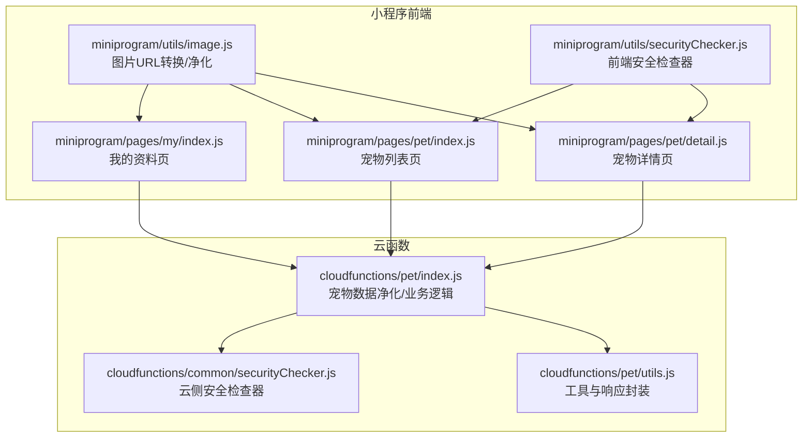
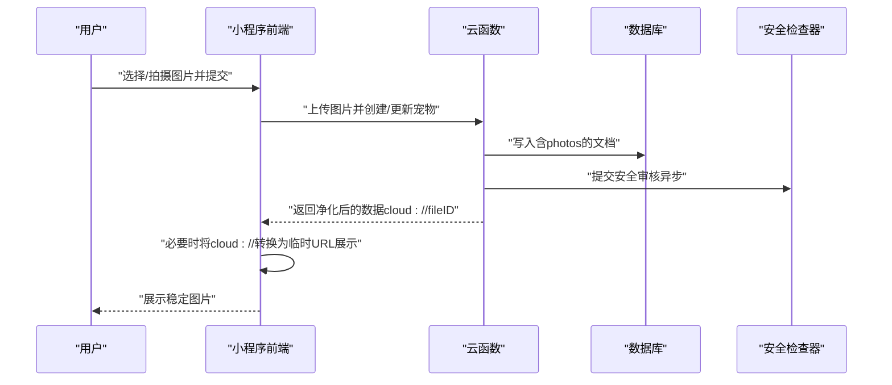
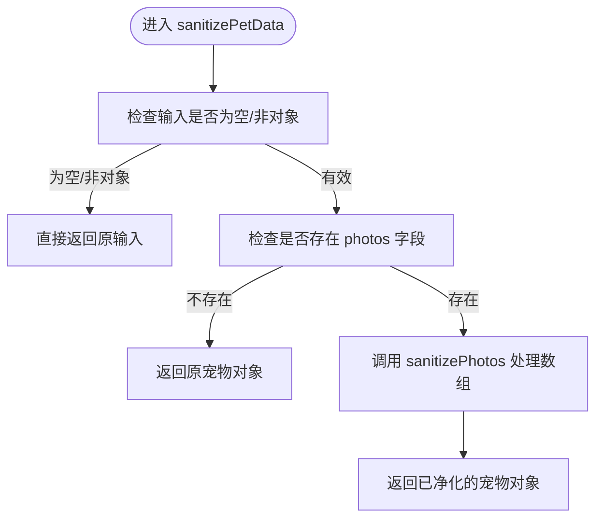
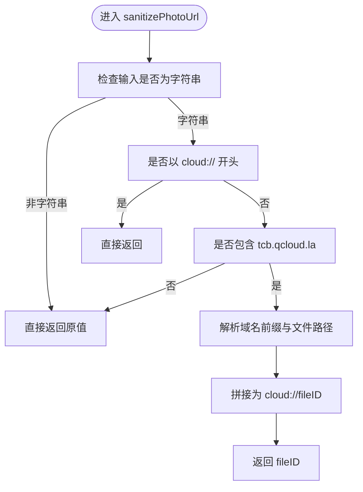
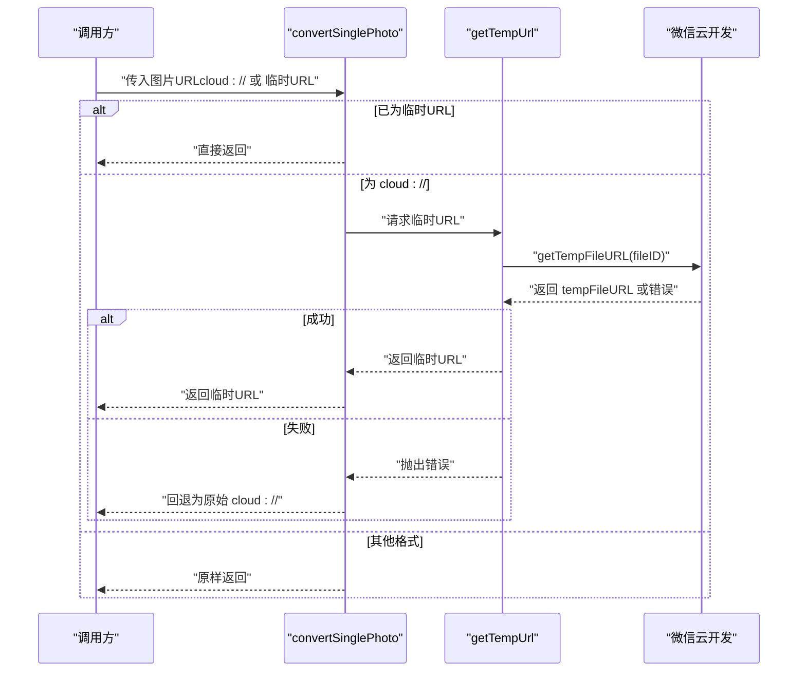
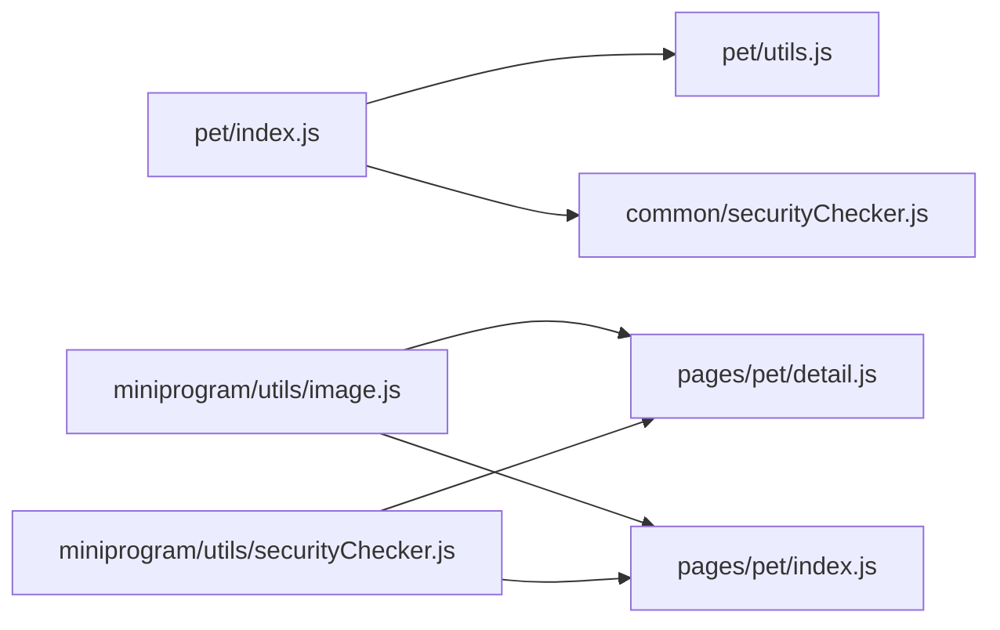

# 宠物数据验证与净化

<cite>
**本文引用的文件**
- [cloudfunctions/pet/index.js](file://cloudfunctions/pet/index.js)
- [cloudfunctions/pet/utils.js](file://cloudfunctions/pet/utils.js)
- [cloudfunctions/common/securityChecker.js](file://cloudfunctions/common/securityChecker.js)
- [miniprogram/utils/image.js](file://miniprogram/utils/image.js)
- [miniprogram/utils/securityChecker.js](file://miniprogram/utils/securityChecker.js)
- [miniprogram/pages/pet/detail.js](file://miniprogram/pages/pet/detail.js)
- [miniprogram/pages/pet/index.js](file://miniprogram/pages/pet/index.js)
- [miniprogram/pages/my/index.js](file://miniprogram/pages/my/index.js)
</cite>

## 目录
1. [引言](#引言)
2. [项目结构](#项目结构)
3. [核心组件](#核心组件)
4. [架构总览](#架构总览)
5. [详细组件分析](#详细组件分析)
6. [依赖关系分析](#依赖关系分析)
7. [性能考量](#性能考量)
8. [故障排查指南](#故障排查指南)
9. [结论](#结论)

## 引言
本技术文档聚焦于“养龟档案”项目中的宠物数据验证与净化能力，重点覆盖以下方面：
- 宠物数据净化机制（sanitizePetData）：图片URL转换、数据格式标准化、安全过滤处理
- 图片URL净化（sanitizePhotoUrl、sanitizePhotos）：临时URL识别、cloud://格式转换、错误处理机制
- 宠物数据验证规则、输入参数检查与业务逻辑验证
- 数据安全策略、XSS防护与恶意内容过滤
- 性能优化、批量处理与错误恢复机制

## 项目结构
围绕宠物数据净化与验证的关键模块分布如下：
- 云函数层（cloudfunctions）：负责数据持久化、图片URL净化、安全审核对接
- 小程序前端（miniprogram）：负责图片URL转换、临时链接获取、UI交互与错误恢复
- 共享工具（common）：提供通用的安全检查器与工具方法

图表来源
- [cloudfunctions/pet/index.js:1-82](file://cloudfunctions/pet/index.js#L1-L82)
- [cloudfunctions/pet/utils.js:1-69](file://cloudfunctions/pet/utils.js#L1-L69)
- [cloudfunctions/common/securityChecker.js:1-226](file://cloudfunctions/common/securityChecker.js#L1-L226)
- [miniprogram/utils/image.js:1-170](file://miniprogram/utils/image.js#L1-L170)
- [miniprogram/utils/securityChecker.js:1-122](file://miniprogram/utils/securityChecker.js#L1-L122)
- [miniprogram/pages/pet/detail.js:1-200](file://miniprogram/pages/pet/detail.js#L1-L200)
- [miniprogram/pages/pet/index.js:1-1143](file://miniprogram/pages/pet/index.js#L1-L1143)
- [miniprogram/pages/my/index.js:938-982](file://miniprogram/pages/my/index.js#L938-L982)

章节来源
- [cloudfunctions/pet/index.js:1-82](file://cloudfunctions/pet/index.js#L1-L82)
- [cloudfunctions/pet/utils.js:1-69](file://cloudfunctions/pet/utils.js#L1-L69)
- [cloudfunctions/common/securityChecker.js:1-226](file://cloudfunctions/common/securityChecker.js#L1-L226)
- [miniprogram/utils/image.js:1-170](file://miniprogram/utils/image.js#L1-L170)
- [miniprogram/utils/securityChecker.js:1-122](file://miniprogram/utils/securityChecker.js#L1-L122)
- [miniprogram/pages/pet/detail.js:1-200](file://miniprogram/pages/pet/detail.js#L1-L200)
- [miniprogram/pages/pet/index.js:1-1143](file://miniprogram/pages/pet/index.js#L1-L1143)
- [miniprogram/pages/my/index.js:938-982](file://miniprogram/pages/my/index.js#L938-L982)

## 核心组件
- 宠物数据净化（sanitizePetData）：在云函数层对返回给前端的数据进行统一净化，确保photos字段采用稳定的cloud://fileID格式，避免临时URL过期导致的显示失效。
- 图片URL净化（sanitizePhotoUrl/sanitizePhotos）：将过期的临时URL转换为稳定的cloud://fileID，保证缓存与持久化的一致性。
- 图片URL转换（convertSinglePhoto/getTempUrl）：在小程序端将cloud://fileID转换为可访问的临时URL，用于实时展示。
- 安全检查器（SecurityChecker）：提供图片/文本的异步/同步安全审核，并记录审核日志，支持业务场景映射与错误兜底。

章节来源
- [cloudfunctions/pet/index.js:11-43](file://cloudfunctions/pet/index.js#L11-L43)
- [miniprogram/utils/image.js:64-108](file://miniprogram/utils/image.js#L64-L108)
- [cloudfunctions/common/securityChecker.js:30-208](file://cloudfunctions/common/securityChecker.js#L30-L208)
- [miniprogram/utils/securityChecker.js:13-107](file://miniprogram/utils/securityChecker.js#L13-L107)

## 架构总览
整体流程分为“写入/更新阶段”和“读取/展示阶段”，两端分别承担不同的净化职责：
- 写入/更新阶段（小程序端）：上传图片后，将本地路径或cloud://fileID写入数据库；若需要即时展示，再将cloud://fileID转换为临时URL。
- 读取/展示阶段（云函数端）：从数据库读取数据，统一执行sanitizePetData，确保photos字段为稳定格式；前端再按需转换为临时URL以展示。

图表来源
- [cloudfunctions/pet/index.js:84-138](file://cloudfunctions/pet/index.js#L84-L138)
- [cloudfunctions/common/securityChecker.js:159-170](file://cloudfunctions/common/securityChecker.js#L159-L170)
- [miniprogram/utils/image.js:64-108](file://miniprogram/utils/image.js#L64-L108)

## 详细组件分析

### 宠物数据净化（sanitizePetData）
- 功能目标：确保返回给前端的宠物数据中，photos字段统一为cloud://fileID，避免临时URL过期导致的显示问题。
- 实现要点：
  - 输入校验：对传入的宠物对象进行空值与类型检查。
  - photos字段处理：若存在photos，则逐项执行sanitizePhotos。
  - 返回：返回已净化的宠物对象。

图表来源
- [cloudfunctions/pet/index.js:37-43](file://cloudfunctions/pet/index.js#L37-L43)

章节来源
- [cloudfunctions/pet/index.js:37-43](file://cloudfunctions/pet/index.js#L37-L43)

### 图片URL净化（sanitizePhotoUrl/sanitizePhotos）
- sanitizePhotoUrl：
  - 识别cloud://格式：直接返回。
  - 识别临时URL（包含tcb.qcloud.la）：解析域名前缀与文件路径，拼接为cloud://fileID。
  - 其他格式：原样返回。
- sanitizePhotos：对数组逐项调用sanitizePhotoUrl，实现批量净化。

图表来源
- [cloudfunctions/pet/index.js:16-27](file://cloudfunctions/pet/index.js#L16-L27)

章节来源
- [cloudfunctions/pet/index.js:16-32](file://cloudfunctions/pet/index.js#L16-L32)

### 图片URL转换（convertSinglePhoto/getTempUrl）
- convertSinglePhoto：
  - 已为临时URL（http开头）：直接返回。
  - 为cloud://：调用getTempUrl获取临时URL；失败则回退为原始cloud://，避免中断。
  - 其他格式：原样返回。
- getTempUrl：
  - 调用微信云开发接口获取临时URL；异常时抛出错误，便于上层捕获与降级。

图表来源
- [miniprogram/utils/image.js:87-108](file://miniprogram/utils/image.js#L87-L108)
- [miniprogram/utils/image.js:64-80](file://miniprogram/utils/image.js#L64-L80)

章节来源
- [miniprogram/utils/image.js:64-108](file://miniprogram/utils/image.js#L64-L108)

### 宠物数据验证规则与业务逻辑
- 创建宠物（createPet）：
  - 必填校验：名称必填。
  - 数量限制：根据系统配置限制用户最大宠物数量。
  - 别名唯一性：当提供别名时，需在同一openid下唯一。
  - 默认值：性别、状态、公开标记等字段设置默认值。
  - 分类同步：若分类非“无”，则同步到分类集合。
- 列表与详情（getPetList/getPetById）：
  - 权限校验：仅允许访问当前用户的数据。
  - 数据净化：返回前统一执行sanitizePetData。
- 更新与删除：
  - 权限校验：必须存在且属于当前用户。
  - 别名唯一性：更新时排除自身。
- 公开接口：
  - 公开列表与详情：仅返回公开宠物，且同样执行sanitizePetData。

章节来源
- [cloudfunctions/pet/index.js:84-138](file://cloudfunctions/pet/index.js#L84-L138)
- [cloudfunctions/pet/index.js:140-191](file://cloudfunctions/pet/index.js#L140-L191)
- [cloudfunctions/pet/index.js:193-250](file://cloudfunctions/pet/index.js#L193-L250)
- [cloudfunctions/pet/index.js:252-368](file://cloudfunctions/pet/index.js#L252-L368)

### 数据安全策略与恶意内容过滤
- 安全检查器（云侧）：
  - 支持图片异步审核（mediaCheckAsync）与文本审核（msgSecCheck）。
  - 场景映射：avatar/cover/pet/footprint/comment 等。
  - 日志记录：将审核结果与trace_id、bizId等写入数据库，便于追踪。
- 前端安全检查器：
  - 异步审核：checkImage（不阻塞主流程）。
  - 同步审核：checkImageSync/checkText（等待结果，适合关键流程）。
  - 批量检查：checkImages（对多张图片独立触发）。
- 错误兜底：当审核服务不可用时，前端默认放行，避免影响用户体验。

章节来源
- [cloudfunctions/common/securityChecker.js:30-208](file://cloudfunctions/common/securityChecker.js#L30-L208)
- [miniprogram/utils/securityChecker.js:13-107](file://miniprogram/utils/securityChecker.js#L13-L107)

### 图片URL净化在各页面的应用
- 宠物详情页（detail.js）：
  - 在渲染前对宠物数据执行sanitizePetData，确保photos字段稳定。
  - 展示时按需将cloud://转换为临时URL。
- 宠物列表页（index.js）：
  - 创建/更新流程中，若存在cloud://fileID，优先使用；否则上传后转换为临时URL展示。
  - 图片加载失败时，尝试重新生成临时URL或清空图片。
- 我的资料页（my/index.js）：
  - 对封面、营业执照、环境图片等字段进行相同净化与转换逻辑。

章节来源
- [miniprogram/pages/pet/detail.js:1-200](file://miniprogram/pages/pet/detail.js#L1-L200)
- [miniprogram/pages/pet/index.js:1017-1143](file://miniprogram/pages/pet/index.js#L1017-L1143)
- [miniprogram/pages/my/index.js:938-982](file://miniprogram/pages/my/index.js#L938-L982)

## 依赖关系分析
- 云函数层依赖：
  - utils.js：提供数据库初始化、上下文获取、响应封装、ID规范化等工具。
  - common/securityChecker.js：提供安全审核能力与日志记录。
- 小程序前端依赖：
  - utils/image.js：提供图片URL转换、净化、临时URL获取。
  - utils/securityChecker.js：提供前端安全检查器，封装云函数调用。

图表来源
- [cloudfunctions/pet/index.js:1-10](file://cloudfunctions/pet/index.js#L1-L10)
- [cloudfunctions/pet/utils.js:1-69](file://cloudfunctions/pet/utils.js#L1-L69)
- [cloudfunctions/common/securityChecker.js:1-226](file://cloudfunctions/common/securityChecker.js#L1-L226)
- [miniprogram/utils/image.js:1-170](file://miniprogram/utils/image.js#L1-L170)
- [miniprogram/utils/securityChecker.js:1-122](file://miniprogram/utils/securityChecker.js#L1-L122)
- [miniprogram/pages/pet/detail.js:1-200](file://miniprogram/pages/pet/detail.js#L1-L200)
- [miniprogram/pages/pet/index.js:1-1143](file://miniprogram/pages/pet/index.js#L1-L1143)

## 性能考量
- 批量处理：
  - sanitizePhotos：对数组元素逐一处理，时间复杂度O(n)，空间复杂度O(n)。
  - convertPetPhotosToUrls：遍历宠物列表与每只宠物的图片数组，适合分批处理以降低单次渲染压力。
- 异步与并发：
  - getTempUrl为异步调用，建议在UI线程外并发执行，完成后合并结果。
  - 安全检查采用异步提交（checkImage），不阻塞主流程。
- 错误恢复：
  - convertSinglePhoto在获取临时URL失败时回退为原始cloud://，避免中断。
  - getTempUrl失败时抛出错误，上层可捕获并提示或重试。
- 缓存策略：
  - 前端展示时可缓存临时URL，但注意过期与失效处理；云端返回稳定fileID，避免缓存过期问题。

[本节为通用性能指导，无需特定文件引用]

## 故障排查指南
- 图片无法显示：
  - 检查是否为过期的临时URL，云端应已转换为cloud://fileID；前端需将cloud://转换为临时URL。
  - 若转换失败，确认fileID是否有效，或尝试重新上传。
- 审核异常：
  - 云侧安全检查器返回错误时，检查fileID格式与网络连通性。
  - 前端安全检查器在服务不可用时会默认放行，可在日志中定位问题。
- 权限与数据缺失：
  - 列表/详情接口会校验用户权限，若报“不存在或无权限”，请确认当前用户与数据归属。
- 数量限制：
  - 创建宠物时若提示达到最大数量限制，需清理或调整系统配置。

章节来源
- [cloudfunctions/pet/index.js:84-138](file://cloudfunctions/pet/index.js#L84-L138)
- [cloudfunctions/pet/index.js:140-191](file://cloudfunctions/pet/index.js#L140-L191)
- [cloudfunctions/common/securityChecker.js:74-105](file://cloudfunctions/common/securityChecker.js#L74-L105)
- [miniprogram/utils/securityChecker.js:68-92](file://miniprogram/utils/securityChecker.js#L68-L92)
- [miniprogram/utils/image.js:96-108](file://miniprogram/utils/image.js#L96-L108)

## 结论
本项目通过“云端净化 + 前端转换”的双层策略，实现了宠物数据的稳定与安全：
- 云端统一将临时URL转换为cloud://fileID，确保缓存与持久化一致性。
- 前端在展示时将cloud://转换为临时URL，兼顾可用性与性能。
- 安全检查器贯穿上传与展示流程，提供异步/同步审核与日志追踪。
- 验证规则与权限控制保障数据完整性与隐私安全。