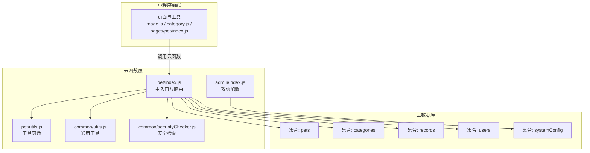
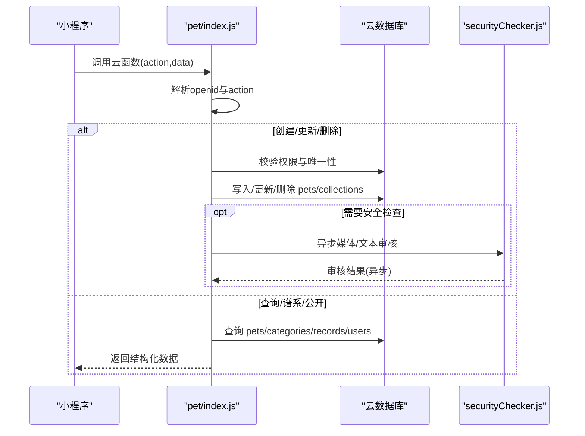
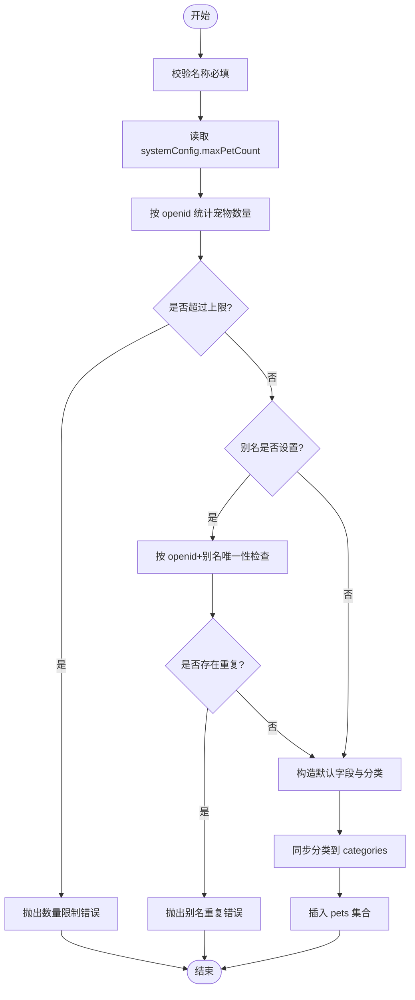
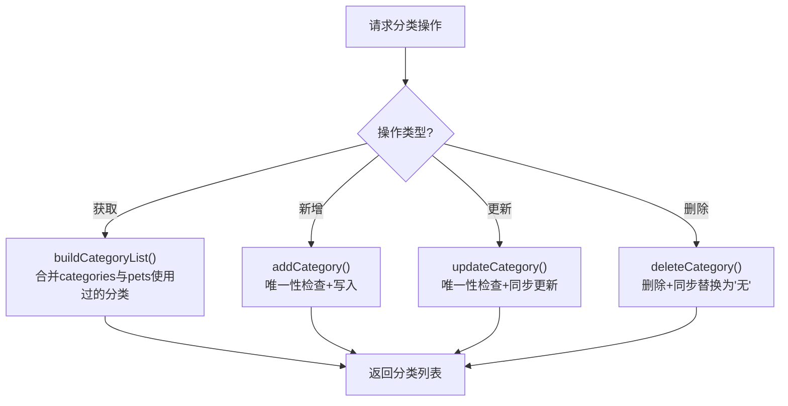
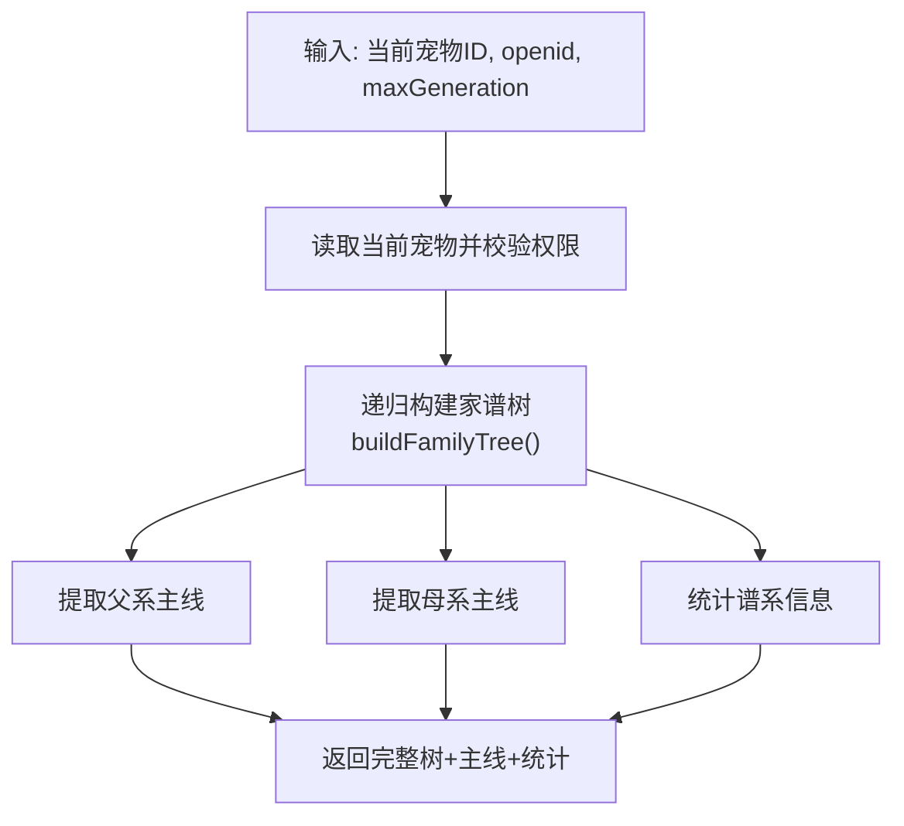
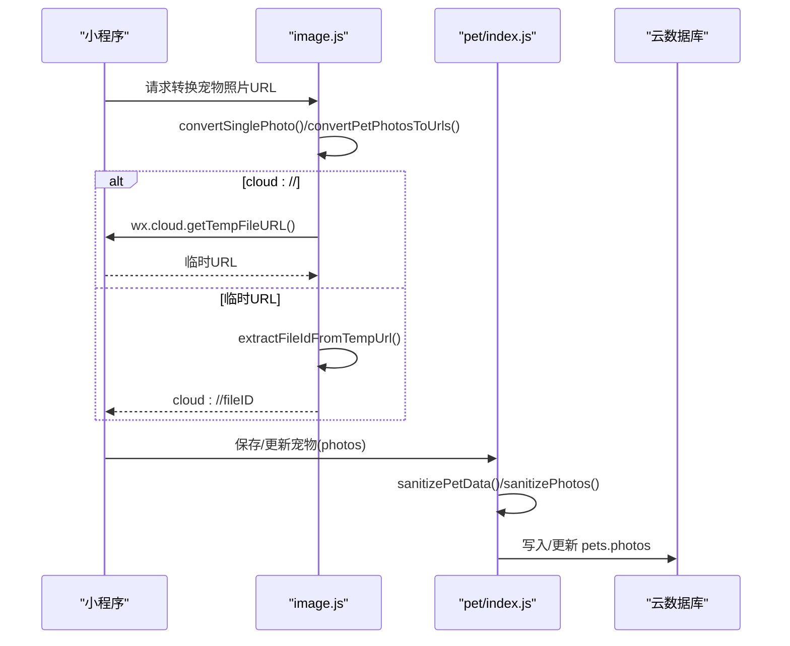
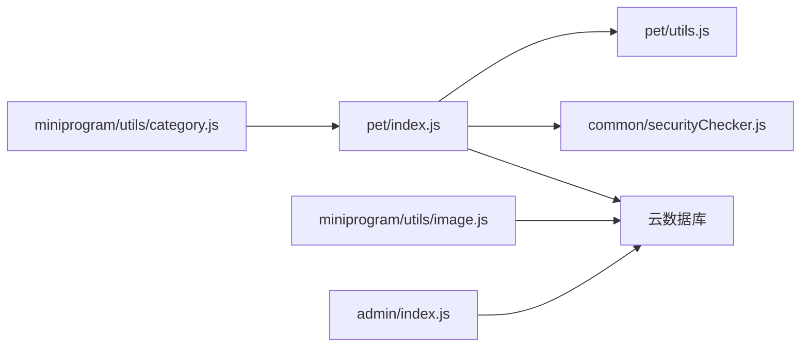
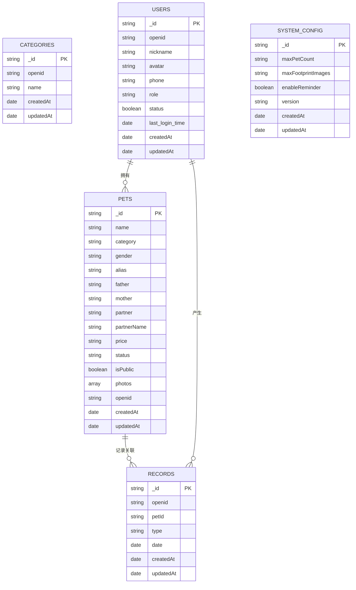

# 宠物管理云函数

<cite>
**本文引用的文件**
- [cloudfunctions/pet/index.js](file://cloudfunctions/pet/index.js)
- [cloudfunctions/pet/utils.js](file://cloudfunctions/pet/utils.js)
- [cloudfunctions/pet/config.json](file://cloudfunctions/pet/config.json)
- [cloudfunctions/common/securityChecker.js](file://cloudfunctions/common/securityChecker.js)
- [cloudfunctions/common/utils.js](file://cloudfunctions/common/utils.js)
- [cloudfunctions/record/utils.js](file://cloudfunctions/record/utils.js)
- [cloudfunctions/admin/index.js](file://cloudfunctions/admin/index.js)
- [miniprogram/utils/image.js](file://miniprogram/utils/image.js)
- [miniprogram/utils/category.js](file://miniprogram/utils/category.js)
- [miniprogram/pages/pet/index.js](file://miniprogram/pages/pet/index.js)
- [server-setup/database.sql](file://server-setup/database.sql)
</cite>

## 目录
1. [简介](#简介)
2. [项目结构](#项目结构)
3. [核心组件](#核心组件)
4. [架构总览](#架构总览)
5. [详细组件分析](#详细组件分析)
6. [依赖分析](#依赖分析)
7. [性能考虑](#性能考虑)
8. [故障排查指南](#故障排查指南)
9. [结论](#结论)
10. [附录](#附录)

## 简介
本文件面向“养龟档案”项目的宠物管理云函数，围绕宠物数据的CRUD操作、数据验证与权限控制、宠物分类系统、谱系查询（家谱树）、公开分享与隐私保护、图片处理与存储优化、数量限制与系统配置等主题，提供系统化、可操作的技术文档。文档既适合开发者深入理解实现细节，也便于产品与运营人员把握关键流程与边界。

## 项目结构
宠物管理云函数位于 cloudfunctions/pet，采用模块化设计：
- 入口文件负责路由分发与权限校验
- 工具模块提供数据库连接、上下文解析、响应封装、ID标准化等通用能力
- 分类与谱系查询逻辑内置于入口文件
- 图片URL净化与转换由小程序端工具配合云函数实现
- 系统配置与数量限制由管理员云函数维护，并在宠物创建时生效

图表来源
- [cloudfunctions/pet/index.js:45-82](file://cloudfunctions/pet/index.js#L45-L82)
- [cloudfunctions/pet/utils.js:1-69](file://cloudfunctions/pet/utils.js#L1-L69)
- [cloudfunctions/common/utils.js:1-69](file://cloudfunctions/common/utils.js#L1-L69)
- [cloudfunctions/common/securityChecker.js:1-226](file://cloudfunctions/common/securityChecker.js#L1-L226)
- [cloudfunctions/admin/index.js:476-508](file://cloudfunctions/admin/index.js#L476-L508)

章节来源
- [cloudfunctions/pet/index.js:1-82](file://cloudfunctions/pet/index.js#L1-L82)
- [cloudfunctions/pet/utils.js:1-69](file://cloudfunctions/pet/utils.js#L1-L69)

## 核心组件
- 主入口与路由分发：根据 action 参数分派到具体业务函数，统一处理错误与返回格式
- 数据库工具：封装数据库初始化、上下文获取、响应体封装、ID标准化
- 权限与安全：基于 openid 的资源隔离；图片/文本内容安全检查
- 宠物CRUD：创建、查询、更新、删除，含别名唯一性校验与数量限制
- 分类系统：分类列表构建、新增、更新、删除，以及与 pets 的同步
- 谱系查询：递归构建家谱树、提取父系/母系主线、统计谱系信息
- 公开分享：公开列表与详情，隐私保护与访问控制
- 图片处理：URL净化、cloud:// 与临时URL互转、缓存策略

章节来源
- [cloudfunctions/pet/index.js:45-82](file://cloudfunctions/pet/index.js#L45-L82)
- [cloudfunctions/pet/utils.js:1-69](file://cloudfunctions/pet/utils.js#L1-L69)
- [cloudfunctions/common/securityChecker.js:1-226](file://cloudfunctions/common/securityChecker.js#L1-L226)

## 架构总览
宠物管理云函数以“动作路由 + 权限校验 + 业务逻辑 + 数据持久化”的模式组织，结合小程序端的图片处理与分类同步，形成完整的宠物数据生命周期管理。

图表来源
- [cloudfunctions/pet/index.js:45-82](file://cloudfunctions/pet/index.js#L45-L82)
- [cloudfunctions/common/securityChecker.js:74-105](file://cloudfunctions/common/securityChecker.js#L74-L105)

## 详细组件分析

### 1) 宠物CRUD实现与数据验证
- 创建宠物
  - 必填校验：名称必填
  - 数量限制：读取 systemConfig 中的 maxPetCount，按 openid 统计现有宠物数量进行上限判断
  - 唯一性校验：别名（alias）在同用户下唯一，忽略空白
  - 默认值：性别、状态、isPublic、照片数组等
  - 分类同步：若分类非“无”，自动同步到 categories 集合
- 查询宠物
  - 列表：按 openid 过滤，支持分类、性别、模糊搜索（name正则），分页
  - 详情：按 id 查询并校验 openid
- 更新宠物
  - 权限校验：先读取文档确认存在且 openid 匹配
  - 唯一性校验：更新别名时排除自身
  - 分类同步：若新分类非“无”，同步到 categories
- 删除宠物
  - 权限校验：先读取文档确认存在且 openid 匹配
  - 关联清理：删除 pets 后，清理 records 中对应 petId 的记录

图表来源
- [cloudfunctions/pet/index.js:84-138](file://cloudfunctions/pet/index.js#L84-L138)

章节来源
- [cloudfunctions/pet/index.js:84-250](file://cloudfunctions/pet/index.js#L84-L250)

### 2) 权限控制与数据隔离
- 所有写操作均先读取目标文档，校验 openid 是否匹配，确保资源隔离
- 查询公开列表时，按 openid 与 isPublic=true 过滤
- 公开详情查询时，仅允许访问 isPublic=true 的宠物

章节来源
- [cloudfunctions/pet/index.js:182-250](file://cloudfunctions/pet/index.js#L182-L250)
- [cloudfunctions/pet/index.js:252-368](file://cloudfunctions/pet/index.js#L252-L368)

### 3) 宠物分类系统与同步机制
- 分类列表构建：合并 categories 集合与 pets 已使用分类，保证“无”在首位且去重
- 新增分类：校验唯一性，写入 categories
- 更新分类：校验“无”不可修改；校验新名称唯一；更新 categories 并同步 pets 中的旧分类
- 删除分类：删除 categories 记录，并将 pets 中该分类替换为“无”
- 创建/更新宠物时，若分类非“无”，自动同步到 categories

图表来源
- [cloudfunctions/pet/index.js:517-670](file://cloudfunctions/pet/index.js#L517-L670)
- [cloudfunctions/pet/index.js:672-688](file://cloudfunctions/pet/index.js#L672-L688)

章节来源
- [cloudfunctions/pet/index.js:517-688](file://cloudfunctions/pet/index.js#L517-L688)

### 4) 谱系查询与家谱树构建
- 递归算法：从当前宠物出发，按 generation 逐代查询父本与母本，直至达到 maxGeneration
- 主线提取：分别提取父系主线与母系主线，便于展示谱系脉络
- 统计信息：统计祖先总数、公母数量、最大深度，辅助繁育分析

图表来源
- [cloudfunctions/pet/index.js:376-412](file://cloudfunctions/pet/index.js#L376-L412)
- [cloudfunctions/pet/index.js:417-469](file://cloudfunctions/pet/index.js#L417-L469)
- [cloudfunctions/pet/index.js:474-515](file://cloudfunctions/pet/index.js#L474-L515)
- [cloudfunctions/pet/index.js:693-722](file://cloudfunctions/pet/index.js#L693-L722)

章节来源
- [cloudfunctions/pet/index.js:376-412](file://cloudfunctions/pet/index.js#L376-L412)
- [cloudfunctions/pet/index.js:417-469](file://cloudfunctions/pet/index.js#L417-L469)
- [cloudfunctions/pet/index.js:474-515](file://cloudfunctions/pet/index.js#L474-L515)
- [cloudfunctions/pet/index.js:693-722](file://cloudfunctions/pet/index.js#L693-L722)

### 5) 公开分享与隐私保护
- 公开列表：按 userId 与 isPublic=true 查询宠物，同时拉取用户公开名片信息
- 公开详情：无需登录，仅允许访问 isPublic=true 的宠物
- 附加信息：批量查询最新产蛋与交配记录，计算距上次产蛋天数

章节来源
- [cloudfunctions/pet/index.js:252-368](file://cloudfunctions/pet/index.js#L252-L368)

### 6) 图片处理、URL净化与存储优化
- 云函数侧净化：将过期的临时URL转换为 cloud://fileID，避免缓存失效
- 小程序侧转换：将 cloud:// 转换为临时URL用于展示；支持批量转换与单图转换
- 缓存策略：小程序端优先使用本地缓存的有效HTTP URL；若无有效URL再回退云端返回的cloud://，随后转换为临时URL
- URL净化：支持从临时URL提取fileID，确保缓存数据稳定

图表来源
- [cloudfunctions/pet/index.js:11-43](file://cloudfunctions/pet/index.js#L11-L43)
- [miniprogram/utils/image.js:38-108](file://miniprogram/utils/image.js#L38-L108)
- [miniprogram/utils/image.js:115-144](file://miniprogram/utils/image.js#L115-L144)

章节来源
- [cloudfunctions/pet/index.js:11-43](file://cloudfunctions/pet/index.js#L11-L43)
- [miniprogram/utils/image.js:1-170](file://miniprogram/utils/image.js#L1-L170)

### 7) 安全检查与内容合规
- 图片/媒体审核：通过云开发 openapi.security.mediaCheckAsync 异步审核
- 文本审核：通过云开发 openapi.security.msgSecCheck 审核
- 文件审核：自动将 cloud:// fileID 转为临时URL后审核
- 审核日志：记录 fileID、场景、traceId、状态、原因等，便于审计与追踪

章节来源
- [cloudfunctions/common/securityChecker.js:1-226](file://cloudfunctions/common/securityChecker.js#L1-L226)

### 8) 系统配置与业务规则
- 系统配置：通过 admin 云函数维护 systemConfig，包含 maxPetCount 等业务参数
- 宠物数量限制：创建时读取配置并按 openid 统计数量，超过上限拒绝创建
- 分类同步：创建/更新宠物时，若分类非“无”，自动同步到 categories

章节来源
- [cloudfunctions/admin/index.js:476-508](file://cloudfunctions/admin/index.js#L476-L508)
- [cloudfunctions/pet/index.js:89-98](file://cloudfunctions/pet/index.js#L89-L98)
- [cloudfunctions/pet/index.js:132-135](file://cloudfunctions/pet/index.js#L132-L135)
- [cloudfunctions/pet/index.js:221-225](file://cloudfunctions/pet/index.js#L221-L225)

## 依赖分析
- 模块耦合
  - pet/index.js 依赖 pet/utils.js 与 common/securityChecker.js
  - 小程序端 image.js 与 category.js 与云函数协同工作
  - admin/index.js 维护 systemConfig，影响 pet 的数量限制
- 外部依赖
  - 云开发 SDK 初始化与数据库命令
  - 云存储与临时URL获取
  - 安全检查 openapi

图表来源
- [cloudfunctions/pet/index.js:1-10](file://cloudfunctions/pet/index.js#L1-L10)
- [cloudfunctions/pet/utils.js:1-69](file://cloudfunctions/pet/utils.js#L1-L69)
- [cloudfunctions/common/securityChecker.js:1-226](file://cloudfunctions/common/securityChecker.js#L1-L226)
- [cloudfunctions/admin/index.js:476-508](file://cloudfunctions/admin/index.js#L476-L508)
- [miniprogram/utils/image.js:1-170](file://miniprogram/utils/image.js#L1-L170)
- [miniprogram/utils/category.js:1-65](file://miniprogram/utils/category.js#L1-L65)

章节来源
- [cloudfunctions/pet/index.js:1-10](file://cloudfunctions/pet/index.js#L1-L10)
- [cloudfunctions/pet/utils.js:1-69](file://cloudfunctions/pet/utils.js#L1-L69)
- [cloudfunctions/common/securityChecker.js:1-226](file://cloudfunctions/common/securityChecker.js#L1-L226)
- [cloudfunctions/admin/index.js:476-508](file://cloudfunctions/admin/index.js#L476-L508)
- [miniprogram/utils/image.js:1-170](file://miniprogram/utils/image.js#L1-L170)
- [miniprogram/utils/category.js:1-65](file://miniprogram/utils/category.js#L1-L65)

## 性能考虑
- 查询优化
  - 列表查询使用 where + orderBy + limit + skip 实现分页，避免一次性加载大量数据
  - 使用 count() 获取总数，hasMore 控制上拉加载
- 递归查询
  - 谱系查询按 generation 递归，maxGeneration 限制深度，防止深层遍历导致超时
- 并发与批处理
  - 分类列表构建使用 Promise.all 并行查询 categories 与 pets 的分类字段
  - 公开列表批量查询 records 的最新产蛋与交配记录，减少多次往返
- 存储与URL
  - 云函数侧将临时URL净化为 cloud://fileID，小程序端再转换为临时URL，降低缓存失效风险

章节来源
- [cloudfunctions/pet/index.js:140-180](file://cloudfunctions/pet/index.js#L140-L180)
- [cloudfunctions/pet/index.js:637-665](file://cloudfunctions/pet/index.js#L637-L665)
- [cloudfunctions/pet/index.js:297-346](file://cloudfunctions/pet/index.js#L297-L346)

## 故障排查指南
- 常见错误与定位
  - “宠物不存在/无权限”：通常为 openid 不匹配或文档不存在，检查 getPetById/updatePet/deletePet 的权限校验逻辑
  - “别名已存在”：检查别名唯一性校验，更新时需排除自身
  - “已达到最大宠物数量限制”：检查 systemConfig.maxPetCount 配置与用户已有宠物数量
  - “该宠物未公开”：公开详情仅允许访问 isPublic=true 的宠物
- 日志与审计
  - 安全检查日志记录 fileID、traceId、状态与原因，便于问题追踪
- 图片问题
  - 临时URL过期：云函数侧已净化为 cloud://fileID；小程序端可重新转换为临时URL
  - 转换失败：保留原始fileID，避免界面空白

章节来源
- [cloudfunctions/pet/index.js:182-250](file://cloudfunctions/pet/index.js#L182-L250)
- [cloudfunctions/pet/index.js:89-98](file://cloudfunctions/pet/index.js#L89-L98)
- [cloudfunctions/pet/index.js:352-368](file://cloudfunctions/pet/index.js#L352-L368)
- [cloudfunctions/common/securityChecker.js:180-207](file://cloudfunctions/common/securityChecker.js#L180-L207)
- [miniprogram/utils/image.js:64-108](file://miniprogram/utils/image.js#L64-L108)

## 结论
宠物管理云函数通过清晰的动作路由、严格的权限校验、完善的分类与谱系机制、以及图片URL净化与转换策略，实现了从创建到分享的全链路管理。结合系统配置与安全检查，既能满足业务扩展需求，又能保障数据一致性与用户体验。

## 附录

### A. 数据模型与集合关系
- pets：宠物主表，包含 name、category、gender、alias、parents、partner、price、status、isPublic、photos、openid 等
- categories：用户分类表，包含 openid 与 name
- records：事件记录表，包含 petId、type、date 等
- users：用户表（小程序端使用）
- systemConfig：系统配置表（管理员维护）

图表来源
- [cloudfunctions/pet/index.js:112-128](file://cloudfunctions/pet/index.js#L112-L128)
- [cloudfunctions/pet/index.js:259-262](file://cloudfunctions/pet/index.js#L259-L262)
- [cloudfunctions/admin/index.js:476-508](file://cloudfunctions/admin/index.js#L476-L508)
- [server-setup/database.sql:183-220](file://server-setup/database.sql#L183-L220)

### B. 配置项与默认值
- systemConfig.maxPetCount：默认 10，创建宠物时按 openid 统计数量进行上限判断
- systemConfig.maxFootprintImages：每条足迹最大图片数（MySQL表中定义）
- 其他业务开关与版本号：由管理员维护

章节来源
- [cloudfunctions/pet/index.js:89-98](file://cloudfunctions/pet/index.js#L89-L98)
- [cloudfunctions/admin/index.js:476-508](file://cloudfunctions/admin/index.js#L476-L508)
- [server-setup/database.sql:197-201](file://server-setup/database.sql#L197-L201)