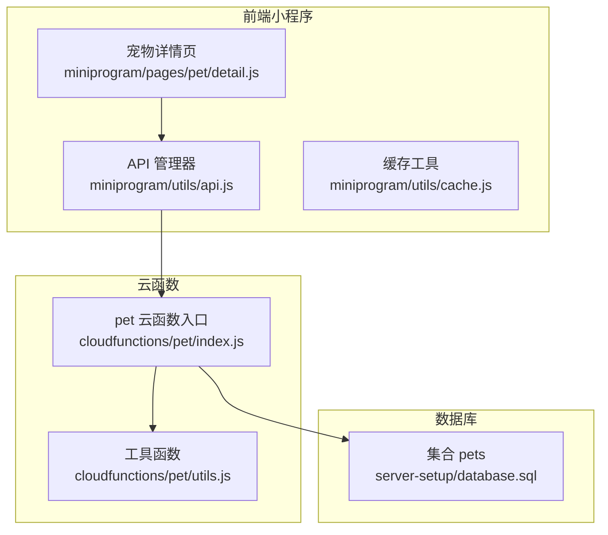
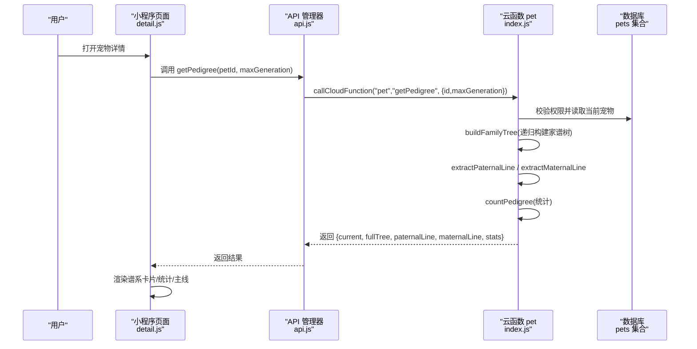
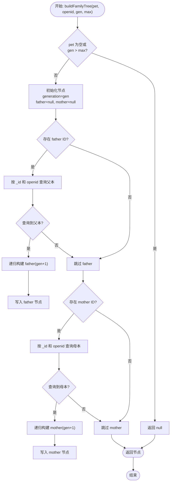
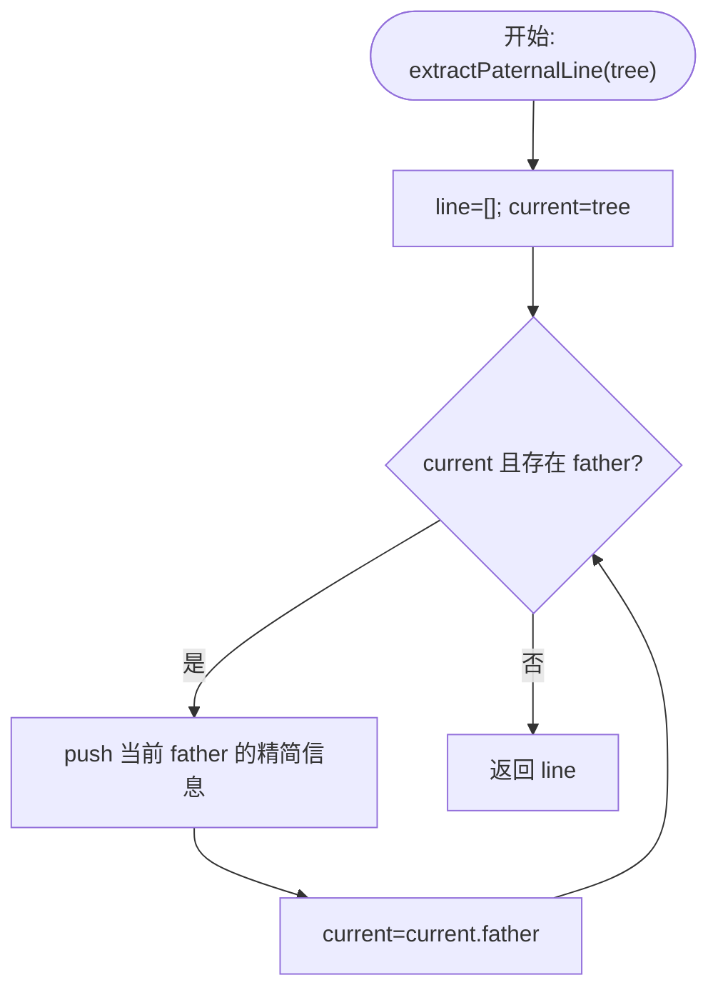
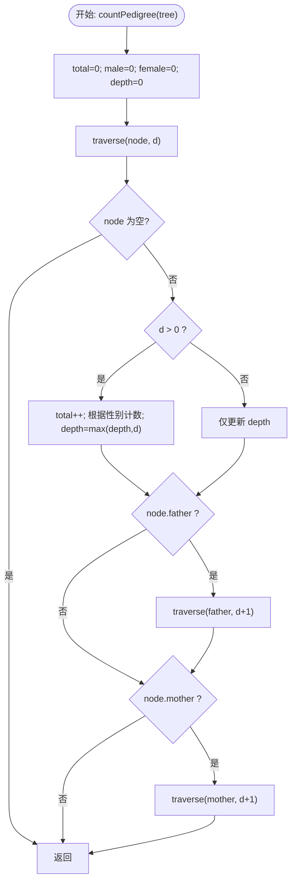
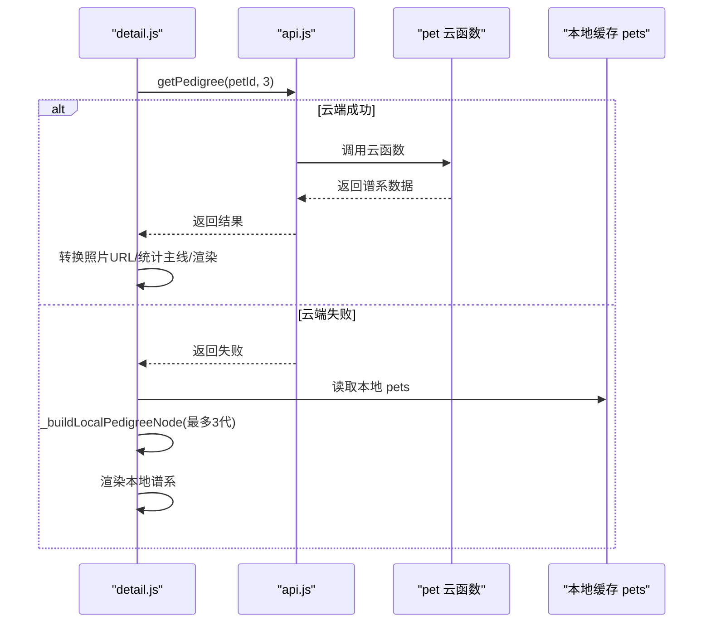
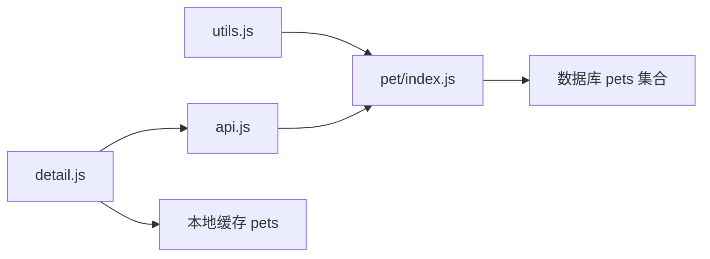

# 宠物谱系家谱查询

<cite>
**本文引用的文件**
- [cloudfunctions/pet/index.js](file://cloudfunctions/pet/index.js)
- [cloudfunctions/pet/utils.js](file://cloudfunctions/pet/utils.js)
- [miniprogram/utils/api.js](file://miniprogram/utils/api.js)
- [miniprogram/pages/pet/detail.js](file://miniprogram/pages/pet/detail.js)
- [miniprogram/utils/cache.js](file://miniprogram/utils/cache.js)
- [server-setup/database.sql](file://server-setup/database.sql)
</cite>

## 目录
1. [引言](#引言)
2. [项目结构](#项目结构)
3. [核心组件](#核心组件)
4. [架构总览](#架构总览)
5. [详细组件分析](#详细组件分析)
6. [依赖分析](#依赖分析)
7. [性能考虑](#性能考虑)
8. [故障排查指南](#故障排查指南)
9. [结论](#结论)

## 引言
本技术文档聚焦于“养龟档案”项目的宠物谱系家谱查询功能，围绕以下关键目标展开：
- 深入解析谱系查询 getPedigree 的递归算法实现，包括家谱树构建、代际关系处理与深度控制机制
- 详细分析 buildFamilyTree 递归函数的设计原理、数据结构组织与内存优化策略
- 阐述父系主线 extractPaternalLine 与母系主线 extractMaternalLine 的提取算法、血缘关系分析与谱系统计功能
- 解释谱系统计 countPedigree 的实现逻辑、性别分布统计与代际深度分析
- 提供谱系查询的性能优化、缓存策略与大数据量处理方案

## 项目结构
谱系查询功能涉及三层协作：
- 前端小程序：负责发起请求、渲染界面与本地回退
- 云函数 pet：负责鉴权、数据净化、递归构建家谱树、提取主线与统计
- 数据库：提供宠物与关联记录的数据支撑

**图表来源**
- [miniprogram/utils/api.js:63-65](file://miniprogram/utils/api.js#L63-L65)
- [miniprogram/pages/pet/detail.js:2355-2368](file://miniprogram/pages/pet/detail.js#L2355-L2368)
- [cloudfunctions/pet/index.js:45-82](file://cloudfunctions/pet/index.js#L45-L82)
- [cloudfunctions/pet/utils.js:15-18](file://cloudfunctions/pet/utils.js#L15-L18)
- [server-setup/database.sql:49-76](file://server-setup/database.sql#L49-L76)

**章节来源**
- [miniprogram/utils/api.js:63-65](file://miniprogram/utils/api.js#L63-L65)
- [miniprogram/pages/pet/detail.js:2355-2368](file://miniprogram/pages/pet/detail.js#L2355-L2368)
- [cloudfunctions/pet/index.js:45-82](file://cloudfunctions/pet/index.js#L45-L82)
- [cloudfunctions/pet/utils.js:15-18](file://cloudfunctions/pet/utils.js#L15-L18)
- [server-setup/database.sql:49-76](file://server-setup/database.sql#L49-L76)

## 核心组件
- getPedigree：对外暴露的谱系查询接口，串联鉴权、家谱树构建、主线提取与统计
- buildFamilyTree：递归构建家谱树，按代际深度控制停止条件
- extractPaternalLine / extractMaternalLine：沿父系/母系主线提取祖先链
- countPedigree：遍历全树统计祖先总数、性别分布与最大深度
- 前端 API 层：封装云函数调用并处理错误与回退

**章节来源**
- [cloudfunctions/pet/index.js:376-412](file://cloudfunctions/pet/index.js#L376-L412)
- [cloudfunctions/pet/index.js:417-469](file://cloudfunctions/pet/index.js#L417-L469)
- [cloudfunctions/pet/index.js:474-515](file://cloudfunctions/pet/index.js#L474-L515)
- [cloudfunctions/pet/index.js:693-722](file://cloudfunctions/pet/index.js#L693-L722)
- [miniprogram/utils/api.js:63-65](file://miniprogram/utils/api.js#L63-L65)

## 架构总览
谱系查询的端到端流程如下：

**图表来源**
- [miniprogram/pages/pet/detail.js:2355-2368](file://miniprogram/pages/pet/detail.js#L2355-L2368)
- [miniprogram/utils/api.js:63-65](file://miniprogram/utils/api.js#L63-L65)
- [cloudfunctions/pet/index.js:376-412](file://cloudfunctions/pet/index.js#L376-L412)
- [cloudfunctions/pet/index.js:417-469](file://cloudfunctions/pet/index.js#L417-L469)
- [cloudfunctions/pet/index.js:474-515](file://cloudfunctions/pet/index.js#L474-L515)
- [cloudfunctions/pet/index.js:693-722](file://cloudfunctions/pet/index.js#L693-L722)

## 详细组件分析

### getPedigree：谱系查询主流程
- 输入参数：petId、openid、maxGeneration（默认3代）、envId（可选）
- 校验与鉴权：确保 petId 存在、宠物属于当前用户
- 数据净化：标准化 ID、净化图片 URL
- 流程步骤：
  1) 递归构建家谱树：buildFamilyTree(currentPet, openid, generation=0, maxGeneration)
  2) 提取父系主线：extractPaternalLine(fullTree)
  3) 提取母系主线：extractMaternalLine(fullTree)
  4) 统计谱系信息：countPedigree(fullTree)
  5) 返回聚合结果

复杂度与性能要点：
- 时间复杂度近似 O(N)，N 为实际查询到的祖先节点数
- 通过 maxGeneration 控制递归深度，避免无限展开
- 通过 openid 限定查询范围，保证数据隔离与安全

**章节来源**
- [cloudfunctions/pet/index.js:376-412](file://cloudfunctions/pet/index.js#L376-L412)

### buildFamilyTree：家谱树递归构建
设计要点：
- 停止条件：节点为空或 generation > maxGeneration
- 递归方向：优先查询父本（father），再查询母本（mother）
- 数据结构：每个节点包含清洗后的宠物信息、generation、father、mother
- 权限控制：查询时同时限定 _id 与 openid，确保只能访问本人宠物

内存与性能优化：
- 按需递归：仅在存在父/母 ID 且匹配 openid 时才继续递归
- 结果裁剪：返回 null 以避免空分支占用空间
- 图片净化：提前净化 photos，减少后续渲染成本

**图表来源**
- [cloudfunctions/pet/index.js:417-469](file://cloudfunctions/pet/index.js#L417-L469)

**章节来源**
- [cloudfunctions/pet/index.js:417-469](file://cloudfunctions/pet/index.js#L417-L469)

### extractPaternalLine / extractMaternalLine：主线提取算法
- 父系主线：从当前节点沿 father 链向上提取，直到无父本
- 母系主线：从当前节点沿 mother 链向上提取，直到无母本
- 输出字段：id、name、alias、gender、category、photos、generation
- 算法特性：线性遍历，时间复杂度 O(D)，D 为对应主线长度

**图表来源**
- [cloudfunctions/pet/index.js:474-492](file://cloudfunctions/pet/index.js#L474-L492)
- [cloudfunctions/pet/index.js:497-515](file://cloudfunctions/pet/index.js#L497-L515)

**章节来源**
- [cloudfunctions/pet/index.js:474-492](file://cloudfunctions/pet/index.js#L474-L492)
- [cloudfunctions/pet/index.js:497-515](file://cloudfunctions/pet/index.js#L497-L515)

### countPedigree：谱系统计
- 统计指标：
  - 总祖先数（不包含当前个体）
  - 公龟数量
  - 母龟数量
  - 最大代际深度
- 遍历策略：DFS 前序遍历，遇到非根节点才计入祖先数与性别统计
- 复杂度：O(N)，N 为遍历节点数

**图表来源**
- [cloudfunctions/pet/index.js:693-722](file://cloudfunctions/pet/index.js#L693-L722)

**章节来源**
- [cloudfunctions/pet/index.js:693-722](file://cloudfunctions/pet/index.js#L693-L722)

### 前端集成与本地回退
- 请求入口：detail.js 中调用 API.getPedigree(petId, 3)
- 成功路径：云端返回后，进行照片 URL 转换与本地统计
- 降级路径：云端失败或无数据时，尝试从本地缓存 pets 中重建最多3代的家谱树

**图表来源**
- [miniprogram/pages/pet/detail.js:2355-2368](file://miniprogram/pages/pet/detail.js#L2355-L2368)
- [miniprogram/pages/pet/detail.js:2386-2403](file://miniprogram/pages/pet/detail.js#L2386-L2403)
- [miniprogram/pages/pet/detail.js:2418-2482](file://miniprogram/pages/pet/detail.js#L2418-L2482)

**章节来源**
- [miniprogram/pages/pet/detail.js:2355-2368](file://miniprogram/pages/pet/detail.js#L2355-L2368)
- [miniprogram/pages/pet/detail.js:2386-2403](file://miniprogram/pages/pet/detail.js#L2386-L2403)
- [miniprogram/pages/pet/detail.js:2418-2482](file://miniprogram/pages/pet/detail.js#L2418-L2482)

## 依赖分析
- 云函数 pet 对 utils 的依赖：获取数据库连接、获取 openid、响应封装、ID 规范化
- 云函数 pet 对数据库 pets 的依赖：按 _id 与 openid 查询父/母节点
- 前端 API 对云函数 pet 的依赖：统一调用 callCloudFunction 并处理错误
- 前端 detail 对本地缓存的依赖：在云端不可用时进行本地回退

**图表来源**
- [cloudfunctions/pet/utils.js:15-18](file://cloudfunctions/pet/utils.js#L15-L18)
- [cloudfunctions/pet/index.js:45-82](file://cloudfunctions/pet/index.js#L45-L82)
- [miniprogram/utils/api.js:63-65](file://miniprogram/utils/api.js#L63-L65)
- [miniprogram/pages/pet/detail.js:2386-2403](file://miniprogram/pages/pet/detail.js#L2386-L2403)

**章节来源**
- [cloudfunctions/pet/utils.js:15-18](file://cloudfunctions/pet/utils.js#L15-L18)
- [cloudfunctions/pet/index.js:45-82](file://cloudfunctions/pet/index.js#L45-L82)
- [miniprogram/utils/api.js:63-65](file://miniprogram/utils/api.js#L63-L65)
- [miniprogram/pages/pet/detail.js:2386-2403](file://miniprogram/pages/pet/detail.js#L2386-L2403)

## 性能考虑
- 递归深度控制：通过 maxGeneration 限制查询深度，默认3代，兼顾性能与可用性
- 条件查询：按 _id 与 openid 双条件查询父/母节点，避免跨用户数据泄露与无效扫描
- 数据净化：在云端一次性净化图片 URL，减少前端渲染负担
- 本地回退：当云端失败时，使用本地 pets 快速渲染有限代数的谱系，提升用户体验
- 缓存策略：建议在前端对近期查询结果进行短期缓存，结合过期清理降低重复请求

优化建议（通用指导，非特定实现）：
- 对高频查询的 petId 建议增加本地 LRU 缓存，命中则直接渲染
- 在 detail 页面对照片 URL 转换采用批量处理与并发控制，避免阻塞 UI
- 对大数据量谱系，可在前端分页/懒加载展示，或提供“仅显示主线”的开关

**章节来源**
- [cloudfunctions/pet/index.js:417-469](file://cloudfunctions/pet/index.js#L417-L469)
- [miniprogram/pages/pet/detail.js:2355-2368](file://miniprogram/pages/pet/detail.js#L2355-L2368)
- [miniprogram/utils/cache.js:11-36](file://miniprogram/utils/cache.js#L11-L36)

## 故障排查指南
常见错误与定位：
- 宠物不存在或无权限：云端 getPedigree 会抛出相应错误，前端应提示用户并引导重试
- 云端调用失败：API 管理器会标记 cloudAvailable=false，并返回 useFallback 标记
- 本地回退失败：检查本地缓存 pets 是否存在对应 petId，以及 father/mother 关系是否正确

排查步骤：
1) 确认 petId 有效且属于当前 openid
2) 检查云端 getPedigree 返回的 success/message
3) 若云端失败，确认本地缓存 pets 是否可用
4) 检查数据库 pets 集合中是否存在父/母节点及其 openid

**章节来源**
- [cloudfunctions/pet/index.js:382-388](file://cloudfunctions/pet/index.js#L382-L388)
- [miniprogram/utils/api.js:27-38](file://miniprogram/utils/api.js#L27-L38)
- [miniprogram/pages/pet/detail.js:2364-2367](file://miniprogram/pages/pet/detail.js#L2364-L2367)

## 结论
谱系查询功能通过“云端递归构建 + 主线提取 + 统计汇总”的组合，实现了对宠物家谱的高效查询与可视化呈现。其核心优势在于：
- 明确的代际深度控制与权限约束，保障性能与安全
- 清晰的递归构建与线性主线提取，便于理解与维护
- 前端云端优先、本地回退的容错设计，提升稳定性

建议在后续迭代中引入前端缓存与分页展示，进一步优化大数据量场景下的用户体验。