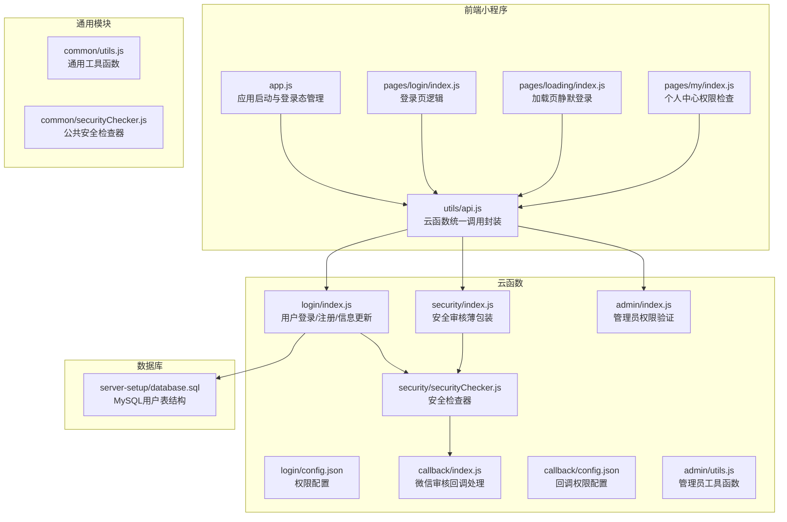
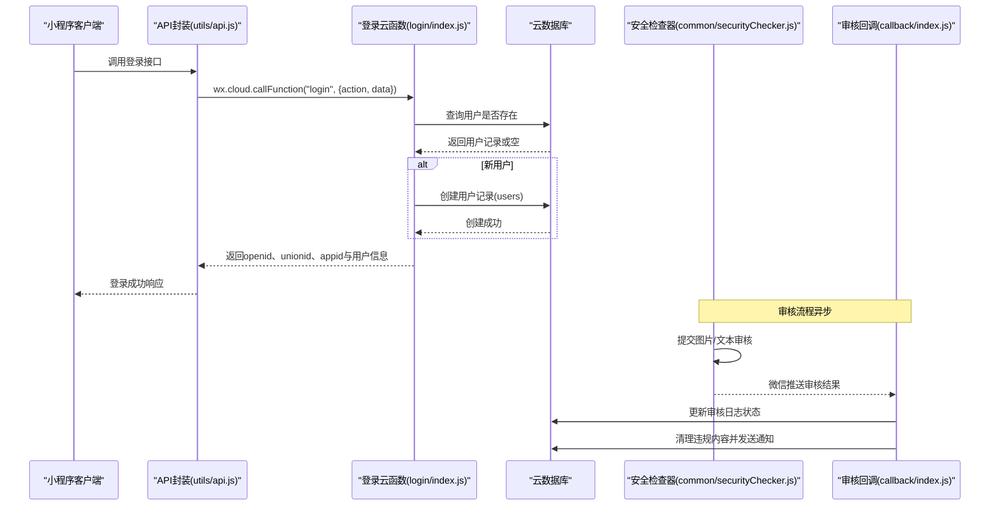
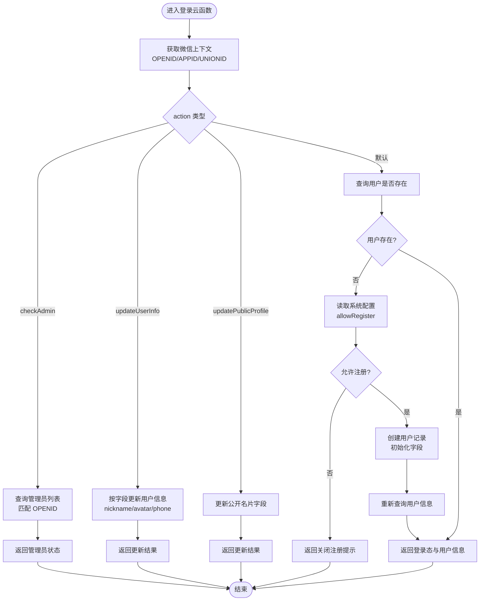
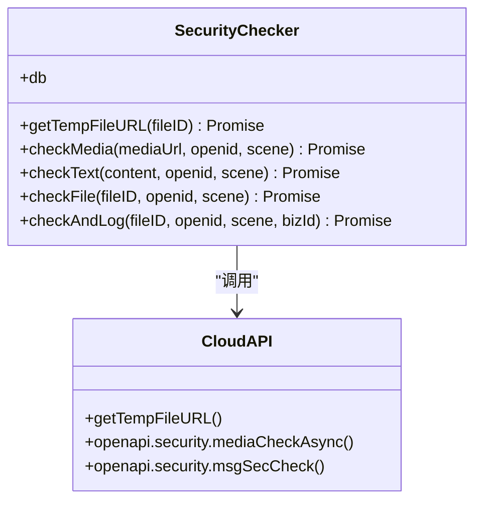
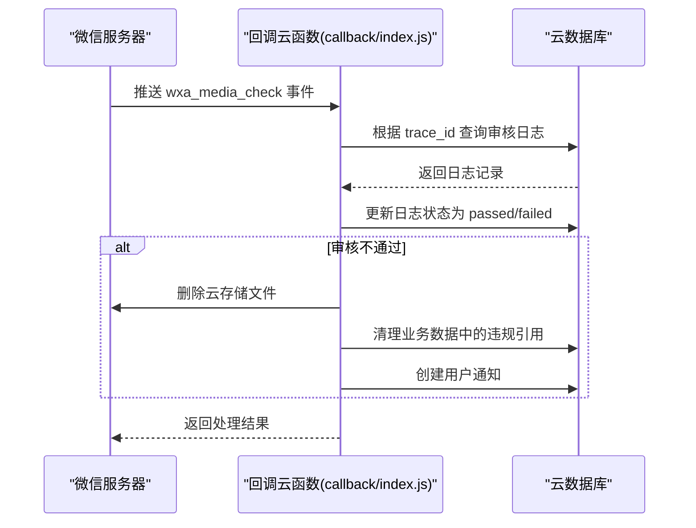
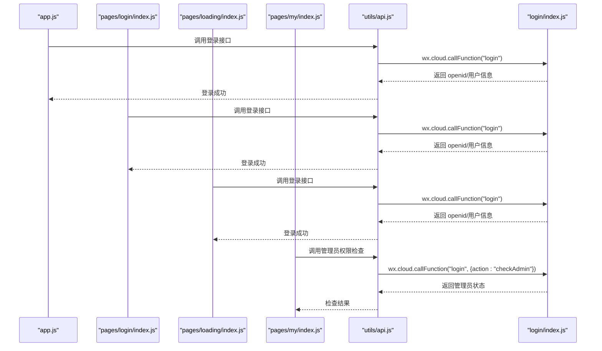
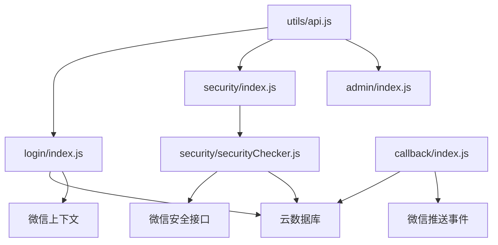

# 用户登录云函数

<cite>
**本文档引用的文件**
- [login/index.js](file://cloudfunctions/login/index.js)
- [login/config.json](file://cloudfunctions/login/config.json)
- [common/utils.js](file://cloudfunctions/common/utils.js)
- [common/securityChecker.js](file://cloudfunctions/common/securityChecker.js)
- [security/index.js](file://cloudfunctions/security/index.js)
- [security/securityChecker.js](file://cloudfunctions/security/securityChecker.js)
- [callback/index.js](file://cloudfunctions/callback/index.js)
- [callback/config.json](file://cloudfunctions/callback/config.json)
- [app.js](file://miniprogram/app.js)
- [pages/login/index.js](file://miniprogram/pages/login/index.js)
- [pages/loading/index.js](file://miniprogram/pages/loading/index.js)
- [pages/my/index.js](file://miniprogram/pages/my/index.js)
- [utils/api.js](file://miniprogram/utils/api.js)
- [admin/index.js](file://cloudfunctions/admin/index.js)
- [admin/utils.js](file://cloudfunctions/admin/utils.js)
- [database.sql](file://server-setup/database.sql)
</cite>

## 目录
1. [引言](#引言)
2. [项目结构](#项目结构)
3. [核心组件](#核心组件)
4. [架构概览](#架构概览)
5. [详细组件分析](#详细组件分析)
6. [依赖关系分析](#依赖关系分析)
7. [性能考虑](#性能考虑)
8. [故障排除指南](#故障排除指南)
9. [结论](#结论)
10. [附录](#附录)

## 引言
本技术文档面向养龟档案项目的用户登录云函数，深入解析微信授权登录的完整流程、code换取session机制以及用户信息获取过程。文档详细阐述了用户注册、登录态维护与会话管理的实现细节，解释了用户信息的存储结构、字段定义与数据同步机制，并覆盖用户权限验证、角色管理与访问控制策略。同时，文档提供了用户安全检查机制、防刷策略与异常处理流程，涵盖用户头像与昵称的自动更新及第三方平台集成，以及登录状态的持久化、过期处理与安全令牌管理。

## 项目结构
用户登录相关的核心代码分布在以下位置：
- 云函数层：login、security、callback、admin
- 前端小程序层：app.js、pages/login、pages/loading、pages/my、utils/api.js
- 通用工具与安全检查：common/securityChecker.js、common/utils.js
- 数据库结构：server-setup/database.sql

**图表来源**
- [login/index.js:1-148](file://cloudfunctions/login/index.js#L1-L148)
- [security/index.js:1-200](file://cloudfunctions/security/index.js#L1-L200)
- [callback/index.js:1-223](file://cloudfunctions/callback/index.js#L1-L223)
- [admin/index.js:1-217](file://cloudfunctions/admin/index.js#L1-L217)
- [common/securityChecker.js:1-226](file://cloudfunctions/common/securityChecker.js#L1-L226)
- [common/utils.js:1-69](file://cloudfunctions/common/utils.js#L1-L69)
- [database.sql:9-26](file://server-setup/database.sql#L9-L26)

**章节来源**
- [login/index.js:1-148](file://cloudfunctions/login/index.js#L1-L148)
- [security/index.js:1-200](file://cloudfunctions/security/index.js#L1-L200)
- [callback/index.js:1-223](file://cloudfunctions/callback/index.js#L1-L223)
- [admin/index.js:1-217](file://cloudfunctions/admin/index.js#L1-L217)
- [common/securityChecker.js:1-226](file://cloudfunctions/common/securityChecker.js#L1-L226)
- [common/utils.js:1-69](file://cloudfunctions/common/utils.js#L1-L69)
- [database.sql:9-26](file://server-setup/database.sql#L9-L26)

## 核心组件
- 用户登录云函数（login/index.js）：负责微信授权登录、用户注册、用户信息更新、公开名片更新与管理员权限检查。
- 安全检查器（common/securityChecker.js 与 security/securityChecker.js）：提供图片与文本内容的安全审核能力，支持异步回调处理。
- 审核回调云函数（callback/index.js）：接收微信推送的审核结果，自动清理违规内容并发送用户通知。
- 权限与管理员工具（admin/index.js、admin/utils.js）：提供管理员权限验证与用户管理能力。
- 前端登录流程（app.js、pages/login/index.js、pages/loading/index.js、pages/my/index.js、utils/api.js）：封装登录态管理、静默登录、强制登录与权限检查。

**章节来源**
- [login/index.js:38-147](file://cloudfunctions/login/index.js#L38-L147)
- [common/securityChecker.js:30-226](file://cloudfunctions/common/securityChecker.js#L30-L226)
- [security/index.js:15-64](file://cloudfunctions/security/index.js#L15-L64)
- [callback/index.js:42-109](file://cloudfunctions/callback/index.js#L42-L109)
- [admin/index.js:27-38](file://cloudfunctions/admin/index.js#L27-L38)

## 架构概览
用户登录云函数采用“前端调用云函数 -> 云函数处理业务逻辑 -> 数据库存储 -> 安全审核与回调”的整体架构。前端通过 wx.cloud.callFunction 调用 login 云函数，云函数根据 action 参数执行不同逻辑：检查管理员权限、更新用户信息、更新公开名片或完成用户注册与登录态返回。安全检查通过 security 云函数委托给公共安全检查器，审核结果由 callback 云函数接收并自动处理。

**图表来源**
- [utils/api.js:143-145](file://miniprogram/utils/api.js#L143-L145)
- [login/index.js:87-146](file://cloudfunctions/login/index.js#L87-L146)
- [common/securityChecker.js:74-105](file://cloudfunctions/common/securityChecker.js#L74-L105)
- [callback/index.js:57-109](file://cloudfunctions/callback/index.js#L57-L109)

## 详细组件分析

### 登录云函数（login/index.js）
- 功能概述
  - 获取微信上下文（OPENID、APPID、UNIONID）
  - 管理员权限检查（checkAdmin）
  - 用户信息更新（updateUserInfo）
  - 公开名片更新（updatePublicProfile）
  - 用户注册与登录态返回
- 关键流程
  - 管理员检查：从数据库或备用列表获取管理员列表，匹配当前 OPENID
  - 用户信息更新：按传入字段更新 nickname、avatar、phone 等
  - 公开名片更新：更新公开特长、微信号、地区、标签、简介、封面等
  - 注册逻辑：查询系统配置决定是否允许注册，若允许则创建用户记录
  - 异常处理：即使数据库失败也返回 OPENID，确保前端可用性

**图表来源**
- [login/index.js:38-147](file://cloudfunctions/login/index.js#L38-L147)

**章节来源**
- [login/index.js:24-36](file://cloudfunctions/login/index.js#L24-L36)
- [login/index.js:44-53](file://cloudfunctions/login/index.js#L44-L53)
- [login/index.js:55-67](file://cloudfunctions/login/index.js#L55-L67)
- [login/index.js:69-85](file://cloudfunctions/login/index.js#L69-L85)
- [login/index.js:87-146](file://cloudfunctions/login/index.js#L87-L146)

### 安全检查器（common/securityChecker.js）
- 功能概述
  - 图片安全审核（异步）：将 cloud:// 文件ID转换为临时HTTP URL，调用微信 mediaCheckAsync
  - 文本内容安全审核：调用微信 msgSecCheck
  - 文件审核：自动完成 fileID->URL 转换 + 调用审核
  - 审核日志记录：写入 security_logs 集合，包含 trace_id、场景、业务ID等
- 关键点
  - 场景映射：avatar/cover/pet/footprint/comment/nickname 映射到数字场景值
  - 结果标签映射：将微信返回的 label 映射为可读字符串
  - 异步回调：提交审核后返回 pending 状态，等待微信回调

**图表来源**
- [common/securityChecker.js:30-226](file://cloudfunctions/common/securityChecker.js#L30-L226)

**章节来源**
- [common/securityChecker.js:10-28](file://cloudfunctions/common/securityChecker.js#L10-L28)
- [common/securityChecker.js:74-105](file://cloudfunctions/common/securityChecker.js#L74-L105)
- [common/securityChecker.js:115-149](file://cloudfunctions/common/securityChecker.js#L115-L149)
- [common/securityChecker.js:159-170](file://cloudfunctions/common/securityChecker.js#L159-L170)
- [common/securityChecker.js:180-207](file://cloudfunctions/common/securityChecker.js#L180-L207)

### 审核回调云函数（callback/index.js）
- 功能概述
  - 接收微信推送的 wxa_media_check 事件
  - 根据 trace_id 查找对应审核日志，更新状态为 passed 或 failed
  - 审核不通过时，删除云存储文件、清理业务数据中的违规引用，并创建用户通知
- 关键流程
  - 查找日志并更新状态
  - 不通过时删除文件、清理业务引用、创建通知

**图表来源**
- [callback/index.js:42-109](file://cloudfunctions/callback/index.js#L42-L109)
- [callback/index.js:114-197](file://cloudfunctions/callback/index.js#L114-L197)
- [callback/index.js:202-223](file://cloudfunctions/callback/index.js#L202-L223)

**章节来源**
- [callback/index.js:57-88](file://cloudfunctions/callback/index.js#L57-L88)
- [callback/index.js:96-109](file://cloudfunctions/callback/index.js#L96-L109)
- [callback/index.js:114-197](file://cloudfunctions/callback/index.js#L114-L197)
- [callback/index.js:202-223](file://cloudfunctions/callback/index.js#L202-L223)

### 前端登录流程（app.js、pages/login/index.js、pages/loading/index.js、pages/my/index.js、utils/api.js）
- 功能概述
  - 应用启动时尝试从本地存储读取 openid，若不存在则调用登录云函数静默登录
  - 登录页支持协议勾选与手动登录，成功后保存 openid 到本地存储
  - 加载页在首次进入时调用登录云函数，预存 openid
  - 个人中心页面调用登录云函数检查管理员权限
  - API 封装统一封装云函数调用，处理成功/失败与降级逻辑

**图表来源**
- [app.js:84-140](file://miniprogram/app.js#L84-L140)
- [pages/login/index.js:52-87](file://miniprogram/pages/login/index.js#L52-L87)
- [pages/loading/index.js:86-107](file://miniprogram/pages/loading/index.js#L86-L107)
- [pages/my/index.js:1568-1585](file://miniprogram/pages/my/index.js#L1568-L1585)
- [utils/api.js:143-145](file://miniprogram/utils/api.js#L143-L145)

**章节来源**
- [app.js:60-140](file://miniprogram/app.js#L60-L140)
- [pages/login/index.js:52-154](file://miniprogram/pages/login/index.js#L52-L154)
- [pages/loading/index.js:86-107](file://miniprogram/pages/loading/index.js#L86-L107)
- [pages/my/index.js:1568-1585](file://miniprogram/pages/my/index.js#L1568-L1585)
- [utils/api.js:12-38](file://miniprogram/utils/api.js#L12-L38)

### 管理员权限与用户管理（admin/index.js、admin/utils.js）
- 功能概述
  - 从数据库获取启用的管理员列表，若数据库失败则使用备用列表
  - 验证调用者 OPENID 是否在管理员列表中
  - 提供用户列表查询、用户信息更新、封禁/解封用户等功能

**章节来源**
- [admin/index.js:16-38](file://cloudfunctions/admin/index.js#L16-L38)
- [admin/index.js:117-217](file://cloudfunctions/admin/index.js#L117-L217)
- [admin/utils.js:15-18](file://cloudfunctions/admin/utils.js#L15-L18)

## 依赖关系分析
- 登录云函数依赖云数据库与微信上下文，向前端返回 openid、unionid、appid 与用户信息
- 安全检查器依赖云存储临时URL与微信安全接口，将审核结果写入 security_logs
- 审核回调依赖微信推送事件，根据 trace_id 更新日志并清理违规内容
- 前端通过 API 封装统一调用云函数，实现登录态管理与权限检查

**图表来源**
- [login/index.js:38-147](file://cloudfunctions/login/index.js#L38-L147)
- [security/index.js:15-64](file://cloudfunctions/security/index.js#L15-L64)
- [security/securityChecker.js:70-141](file://cloudfunctions/security/securityChecker.js#L70-L141)
- [callback/index.js:42-109](file://cloudfunctions/callback/index.js#L42-L109)
- [utils/api.js:12-38](file://miniprogram/utils/api.js#L12-L38)

**章节来源**
- [login/index.js:38-147](file://cloudfunctions/login/index.js#L38-L147)
- [security/index.js:15-64](file://cloudfunctions/security/index.js#L15-L64)
- [security/securityChecker.js:70-141](file://cloudfunctions/security/securityChecker.js#L70-L141)
- [callback/index.js:42-109](file://cloudfunctions/callback/index.js#L42-L109)
- [utils/api.js:12-38](file://miniprogram/utils/api.js#L12-L38)

## 性能考虑
- 异步审核：图片与文本审核采用异步方式，不阻塞主流程，提升用户体验
- 缓存与降级：前端在本地存储 openid 与用户信息，减少重复登录请求
- 数据库查询优化：管理员列表与用户信息查询尽量使用索引字段（如 openid）
- 回调处理：审核回调异步处理，避免主线程阻塞

## 故障排除指南
- 登录失败
  - 检查云函数返回的 warning 字段，确认数据库操作异常原因
  - 确认系统配置 allowRegister 是否开启
- 审核异常
  - 检查 security_logs 中 pending 状态记录，必要时手动标记 timeout
  - 确认微信推送配置正确，回调云函数可正常接收事件
- 权限不足
  - 管理员权限检查失败时，确认 OPENID 是否在管理员列表中
  - 检查数据库 admins 集合数据是否正确

**章节来源**
- [login/index.js:97-99](file://cloudfunctions/login/index.js#L97-L99)
- [login/index.js:118-127](file://cloudfunctions/login/index.js#L118-L127)
- [login/index.js:136-146](file://cloudfunctions/login/index.js#L136-L146)
- [security/index.js:151-199](file://cloudfunctions/security/index.js#L151-L199)
- [callback/index.js:62-71](file://cloudfunctions/callback/index.js#L62-L71)
- [admin/index.js:31-38](file://cloudfunctions/admin/index.js#L31-L38)

## 结论
用户登录云函数通过清晰的职责划分与完善的异常处理，实现了微信授权登录、用户注册与信息更新、管理员权限验证与安全审核闭环。前端通过统一的 API 封装简化了登录态管理与权限检查，配合异步审核与回调处理，构建了稳定可靠的用户认证与内容安全体系。

## 附录

### 用户信息存储结构与字段定义
- users 集合字段（云开发）
  - openid：微信 OpenID（唯一）
  - unionid：微信 UnionID
  - appid：小程序 AppID
  - nickname：用户昵称
  - avatar：用户头像
  - phone：手机号
  - createdAt/updatedAt：创建与更新时间
- users 表（MySQL）
  - id：自增主键
  - openid：微信 OpenID（唯一）
  - nickname：用户昵称
  - avatar：用户头像
  - phone：手机号
  - role：角色（user/admin）
  - status：状态（1=正常, 0=禁用）
  - last_login_time：最后登录时间
  - created_at/updated_at：创建与更新时间

**章节来源**
- [login/index.js:103-114](file://cloudfunctions/login/index.js#L103-L114)
- [database.sql:9-26](file://server-setup/database.sql#L9-L26)

### 登录状态持久化与安全令牌管理
- 前端持久化
  - openid：本地存储，应用启动时优先读取
  - userInfo：合并用户昵称、头像、手机号等信息
  - registerTime：注册时间
  - isAdmin：管理员权限状态
- 登出清理
  - 清理 openid、userInfo、registerTime、isAdmin 等本地存储
  - 页面跳转至首页

**章节来源**
- [app.js:234-256](file://miniprogram/app.js#L234-L256)
- [pages/login/index.js:122-130](file://miniprogram/pages/login/index.js#L122-L130)

### 用户头像与昵称自动更新
- 登录成功后，若用户数据库中有头像或昵称，则优先使用数据库值
- 若数据库为空，系统将生成默认昵称并更新本地存储

**章节来源**
- [app.js:99-125](file://miniprogram/app.js#L99-L125)

### 第三方平台集成
- 微信安全审核：通过微信 openapi.security 接口进行图片与文本审核
- 微信推送回调：通过云开发控制台配置消息推送，接收 wxa_media_check 事件

**章节来源**
- [common/securityChecker.js:82-88](file://cloudfunctions/common/securityChecker.js#L82-L88)
- [callback/index.js:1-34](file://cloudfunctions/callback/index.js#L1-L34)