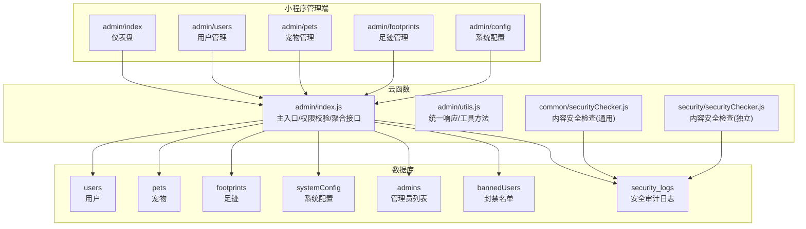
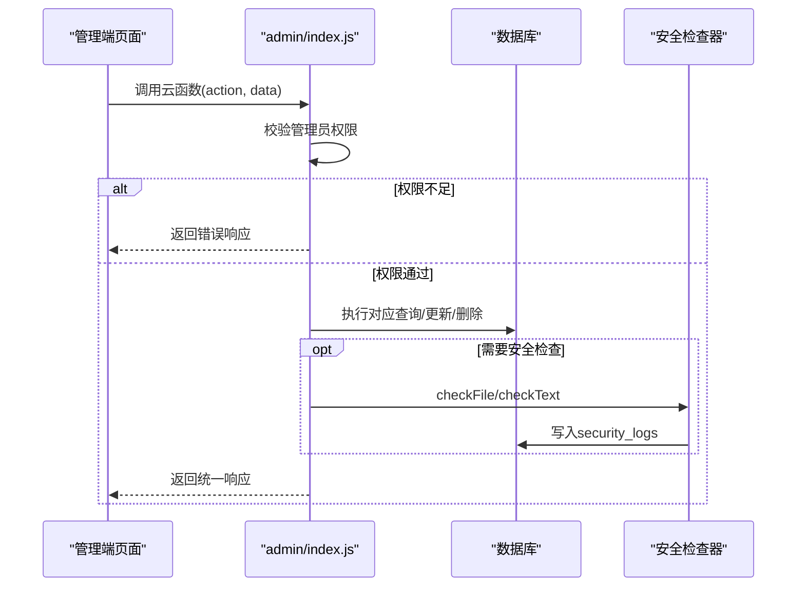
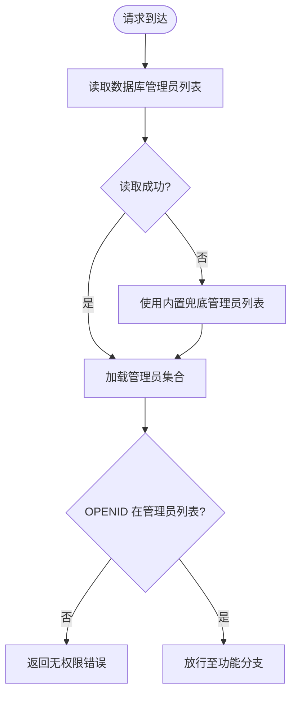
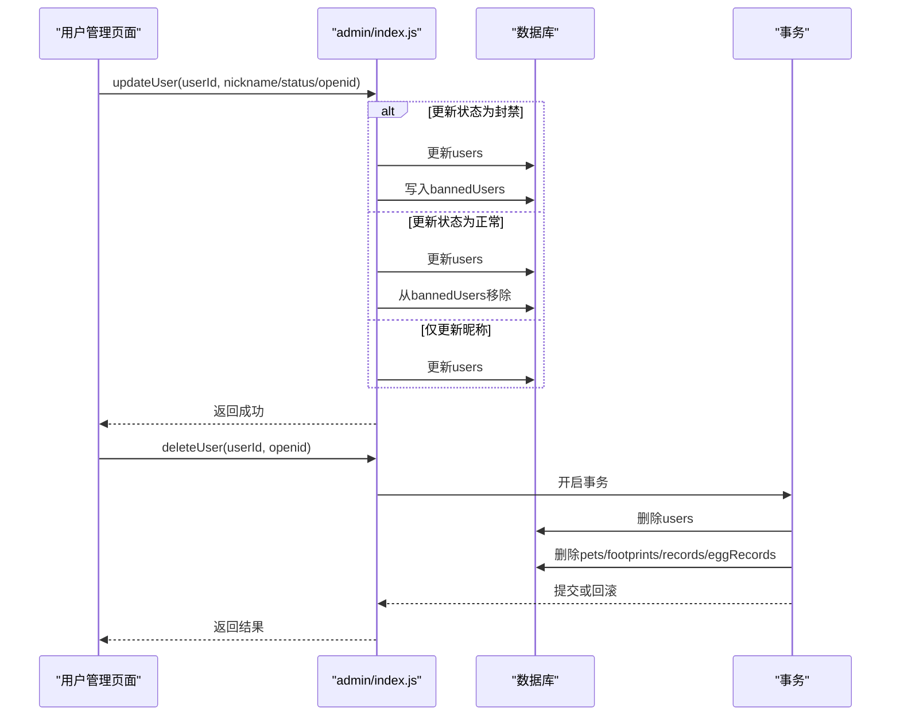
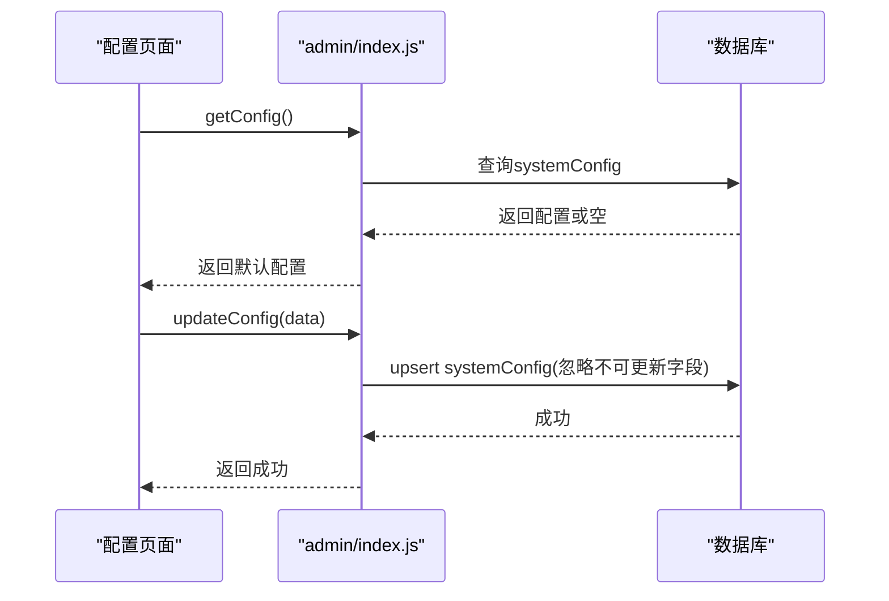
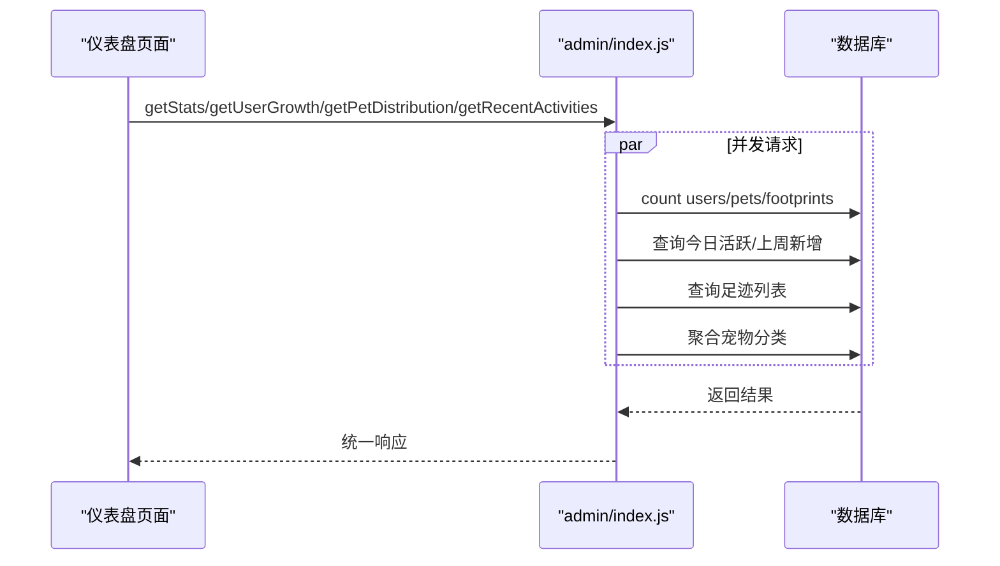
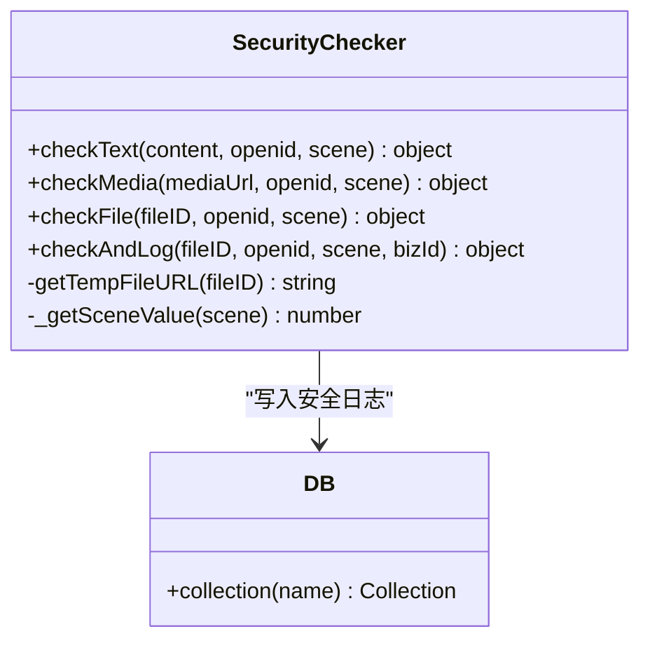
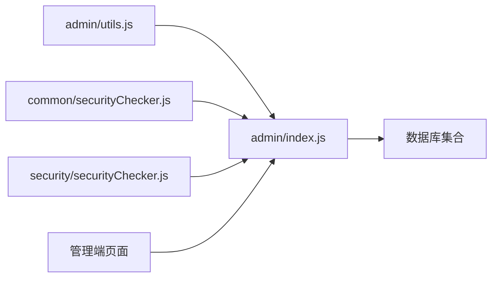

# 管理员云函数

<cite>
**本文引用的文件**
- [cloudfunctions/admin/index.js](file://cloudfunctions/admin/index.js)
- [cloudfunctions/admin/utils.js](file://cloudfunctions/admin/utils.js)
- [cloudfunctions/admin/config.json](file://cloudfunctions/admin/config.json)
- [cloudfunctions/common/securityChecker.js](file://cloudfunctions/common/securityChecker.js)
- [cloudfunctions/security/securityChecker.js](file://cloudfunctions/security/securityChecker.js)
- [cloudfunctions/security/config.json](file://cloudfunctions/security/config.json)
- [miniprogram/subpkg-admin/pages/admin/index.js](file://miniprogram/subpkg-admin/pages/admin/index.js)
- [miniprogram/subpkg-admin/pages/admin/users.js](file://miniprogram/subpkg-admin/pages/admin/users.js)
- [miniprogram/subpkg-admin/pages/admin/pets.js](file://miniprogram/subpkg-admin/pages/admin/pets.js)
- [miniprogram/subpkg-admin/pages/admin/footprints.js](file://miniprogram/subpkg-admin/pages/admin/footprints.js)
- [miniprogram/subpkg-admin/pages/admin/config.js](file://miniprogram/subpkg-admin/pages/admin/config.js)
</cite>

## 目录
1. [简介](#简介)
2. [项目结构](#项目结构)
3. [核心组件](#核心组件)
4. [架构总览](#架构总览)
5. [详细组件分析](#详细组件分析)
6. [依赖关系分析](#依赖关系分析)
7. [性能考虑](#性能考虑)
8. [故障排查指南](#故障排查指南)
9. [结论](#结论)
10. [附录](#附录)

## 简介
本文件面向“养龟档案”项目的管理员云函数，系统性梳理其权限体系、角色管理与功能控制机制；详解用户管理（查询、状态与权限调整）、系统配置管理（全局设置与业务规则维护）、数据统计分析（报表与可视化）、安全与审计（内容审核与合规）、以及运维支持（监控、日志与性能分析）。文档以代码为依据，辅以图示帮助非技术读者理解整体运作。

## 项目结构
管理员云函数位于 cloudfunctions/admin，配套有通用工具与安全检查器，并在小程序管理端提供仪表盘、用户、宠物、足迹与配置页面，形成“前端页面 → 云函数 → 数据库”的完整链路。

图表来源
- [cloudfunctions/admin/index.js:1-71](file://cloudfunctions/admin/index.js#L1-L71)
- [cloudfunctions/admin/utils.js:1-69](file://cloudfunctions/admin/utils.js#L1-L69)
- [cloudfunctions/common/securityChecker.js:1-226](file://cloudfunctions/common/securityChecker.js#L1-L226)
- [cloudfunctions/security/securityChecker.js:1-206](file://cloudfunctions/security/securityChecker.js#L1-L206)
- [miniprogram/subpkg-admin/pages/admin/index.js:1-123](file://miniprogram/subpkg-admin/pages/admin/index.js#L1-L123)

章节来源
- [cloudfunctions/admin/index.js:1-71](file://cloudfunctions/admin/index.js#L1-L71)
- [cloudfunctions/admin/utils.js:1-69](file://cloudfunctions/admin/utils.js#L1-L69)
- [cloudfunctions/admin/config.json:1-6](file://cloudfunctions/admin/config.json#L1-L6)
- [cloudfunctions/common/securityChecker.js:1-226](file://cloudfunctions/common/securityChecker.js#L1-L226)
- [cloudfunctions/security/securityChecker.js:1-206](file://cloudfunctions/security/securityChecker.js#L1-L206)
- [miniprogram/subpkg-admin/pages/admin/index.js:1-123](file://miniprogram/subpkg-admin/pages/admin/index.js#L1-L123)

## 核心组件
- 权限与入口
  - 主入口负责初始化环境、获取调用者OPENID、读取管理员列表并校验权限，随后根据 action 分发到具体功能函数。
  - 管理员来源优先从数据库 admins 表读取 enabled=true 的记录，失败时回退到内置兜底列表。
- 统一工具
  - 统一响应(successResponse/errorResponse)、数据库连接、OPENID提取、参数包装与ID标准化等。
- 功能模块
  - 统计数据、用户管理、宠物管理、足迹管理、近期动态、用户增长趋势、宠物分布、系统配置、用户状态变更与删除。
- 安全与审计
  - 内容安全检查器（文本/图片/云文件）与安全日志落库，支持场景映射与标签转换。

章节来源
- [cloudfunctions/admin/index.js:17-71](file://cloudfunctions/admin/index.js#L17-L71)
- [cloudfunctions/admin/utils.js:20-35](file://cloudfunctions/admin/utils.js#L20-L35)
- [cloudfunctions/common/securityChecker.js:30-208](file://cloudfunctions/common/securityChecker.js#L30-L208)
- [cloudfunctions/security/securityChecker.js:30-191](file://cloudfunctions/security/securityChecker.js#L30-L191)

## 架构总览
管理员云函数采用“单一入口 + 动作分发 + 权限前置校验”的模式，配合数据库聚合查询与事务保证关键操作一致性；前端通过 wx.cloud.callFunction 调用，实现仪表盘、用户、宠物、足迹与配置的管理闭环。

图表来源
- [cloudfunctions/admin/index.js:27-71](file://cloudfunctions/admin/index.js#L27-L71)
- [cloudfunctions/common/securityChecker.js:180-207](file://cloudfunctions/common/securityChecker.js#L180-L207)
- [cloudfunctions/security/securityChecker.js:163-190](file://cloudfunctions/security/securityChecker.js#L163-L190)

## 详细组件分析

### 权限体系与角色管理
- 管理员判定流程
  - 从数据库 admins 表筛选 enabled=true 的管理员集合；
  - 若数据库读取失败，回退到内置 OPENID 列表；
  - 以当前调用者 OPENID 是否在管理员列表中决定是否放行。
- 权限配置
  - admin 云函数的 config.json 声明了 openapi 权限白名单（空数组），实际权限由运行时管理员列表决定。
- 角色与职责
  - 管理员可执行：统计查询、用户管理、宠物管理、足迹管理、系统配置维护、用户状态变更与删除等。

图表来源
- [cloudfunctions/admin/index.js:17-38](file://cloudfunctions/admin/index.js#L17-L38)
- [cloudfunctions/admin/config.json:1-6](file://cloudfunctions/admin/config.json#L1-L6)

章节来源
- [cloudfunctions/admin/index.js:17-38](file://cloudfunctions/admin/index.js#L17-L38)
- [cloudfunctions/admin/config.json:1-6](file://cloudfunctions/admin/config.json#L1-L6)

### 用户管理功能
- 查询与筛选
  - 支持按昵称/用户名/姓名/openid 模糊搜索；
  - 支持按 status 过滤；
  - 支持按 createdAt/updatedAt/nickname 排序；
  - 分页与总数统计。
- 字段兼容与展示
  - 兼容多种昵称/头像/手机号字段名；
  - 统一格式化时间与状态显示。
- 状态与权限调整
  - 支持更新 nickname/status；
  - 当 status 变更为“封禁”时，自动写入 bannedUsers；
  - 当 status 变更为“正常”时，从 bannedUsers 移除。
- 删除用户（含级联清理）
  - 使用事务删除用户、其宠物、足迹、记录与产蛋记录，失败则回滚。

图表来源
- [cloudfunctions/admin/index.js:177-258](file://cloudfunctions/admin/index.js#L177-L258)
- [miniprogram/subpkg-admin/pages/admin/users.js:115-266](file://miniprogram/subpkg-admin/pages/admin/users.js#L115-L266)

章节来源
- [cloudfunctions/admin/index.js:118-174](file://cloudfunctions/admin/index.js#L118-L174)
- [cloudfunctions/admin/index.js:177-258](file://cloudfunctions/admin/index.js#L177-L258)
- [miniprogram/subpkg-admin/pages/admin/users.js:1-288](file://miniprogram/subpkg-admin/pages/admin/users.js#L1-L288)

### 系统配置管理
- 读取配置
  - 优先从 systemConfig 表读取最新配置，失败时返回默认配置对象。
- 更新配置
  - 忽略不可更新字段（如 _id、createdAt），写入 updatedAt 与 updatedBy；
  - 若存在记录则更新，否则新增。
- 前端交互
  - 管理端页面支持加载、编辑、保存、重置与本地缓存兜底。

图表来源
- [cloudfunctions/admin/index.js:434-508](file://cloudfunctions/admin/index.js#L434-L508)
- [miniprogram/subpkg-admin/pages/admin/config.js:49-114](file://miniprogram/subpkg-admin/pages/admin/config.js#L49-L114)

章节来源
- [cloudfunctions/admin/index.js:434-508](file://cloudfunctions/admin/index.js#L434-L508)
- [miniprogram/subpkg-admin/pages/admin/config.js:1-185](file://miniprogram/subpkg-admin/pages/admin/config.js#L1-L185)

### 数据统计分析与报表
- 总体指标
  - 用户数、宠物数、足迹数、今日活跃用户数、用户/宠物增长率。
- 近期动态
  - 最近5条足迹动态摘要。
- 用户增长趋势
  - 按自然周内每日统计新增用户数。
- 宠物类型分布
  - 统计各分类数量与占比。
- 可视化集成
  - 仪表盘页面并发拉取上述数据并渲染。

图表来源
- [cloudfunctions/admin/index.js:74-115](file://cloudfunctions/admin/index.js#L74-L115)
- [cloudfunctions/admin/index.js:382-431](file://cloudfunctions/admin/index.js#L382-L431)
- [cloudfunctions/admin/index.js:365-379](file://cloudfunctions/admin/index.js#L365-L379)
- [miniprogram/subpkg-admin/pages/admin/index.js:35-82](file://miniprogram/subpkg-admin/pages/admin/index.js#L35-L82)

章节来源
- [cloudfunctions/admin/index.js:74-115](file://cloudfunctions/admin/index.js#L74-L115)
- [cloudfunctions/admin/index.js:365-379](file://cloudfunctions/admin/index.js#L365-L379)
- [cloudfunctions/admin/index.js:382-431](file://cloudfunctions/admin/index.js#L382-L431)
- [miniprogram/subpkg-admin/pages/admin/index.js:1-123](file://miniprogram/subpkg-admin/pages/admin/index.js#L1-L123)

### 安全管理与审计日志
- 安全检查能力
  - 支持文本敏感内容检测与图片媒体异步检测；
  - 支持对云存储 fileID 自动转临时URL后检测；
  - 支持场景映射（资料、评论、社交日志等）与标签映射。
- 审计日志
  - 检测完成后写入 security_logs，包含 fileID、scene、bizId、openid、traceId、状态与原因等。
- 权限要求
  - 独立的安全云函数具备 openapi 权限白名单，确保仅能调用指定安全接口。

图表来源
- [cloudfunctions/common/securityChecker.js:30-208](file://cloudfunctions/common/securityChecker.js#L30-L208)
- [cloudfunctions/security/securityChecker.js:30-191](file://cloudfunctions/security/securityChecker.js#L30-L191)
- [cloudfunctions/security/config.json:1-8](file://cloudfunctions/security/config.json#L1-L8)

章节来源
- [cloudfunctions/common/securityChecker.js:1-226](file://cloudfunctions/common/securityChecker.js#L1-L226)
- [cloudfunctions/security/securityChecker.js:1-206](file://cloudfunctions/security/securityChecker.js#L1-L206)
- [cloudfunctions/security/config.json:1-8](file://cloudfunctions/security/config.json#L1-L8)

### 其他功能模块
- 宠物管理
  - 支持按名称模糊搜索与分类过滤；
  - 批量查询用户信息以显示主人昵称；
  - 统一头像取第一张照片或备用字段。
- 足迹管理
  - 支持按日期范围（今日/本周）与关键词过滤；
  - 支持前端二次过滤与分页展示。

章节来源
- [cloudfunctions/admin/index.js:261-320](file://cloudfunctions/admin/index.js#L261-L320)
- [cloudfunctions/admin/index.js:323-362](file://cloudfunctions/admin/index.js#L323-L362)
- [miniprogram/subpkg-admin/pages/admin/pets.js:1-96](file://miniprogram/subpkg-admin/pages/admin/pets.js#L1-L96)
- [miniprogram/subpkg-admin/pages/admin/footprints.js:1-66](file://miniprogram/subpkg-admin/pages/admin/footprints.js#L1-L66)

## 依赖关系分析
- 云函数内部依赖
  - admin/index.js 依赖 admin/utils.js 提供统一响应与工具方法；
  - 安全检查器独立于 admin，但 admin 可复用其能力。
- 前端依赖
  - 管理端页面通过 wx.cloud.callFunction 调用 admin 云函数；
  - 仪表盘并发拉取多项统计，提升用户体验。
- 数据库依赖
  - users/pets/footprints/systemConfig/admins/bannedUsers/security_logs 等集合构成核心数据模型。

图表来源
- [cloudfunctions/admin/index.js:1-2](file://cloudfunctions/admin/index.js#L1-L2)
- [cloudfunctions/admin/utils.js:1-69](file://cloudfunctions/admin/utils.js#L1-L69)
- [cloudfunctions/common/securityChecker.js:1-226](file://cloudfunctions/common/securityChecker.js#L1-L226)
- [cloudfunctions/security/securityChecker.js:1-206](file://cloudfunctions/security/securityChecker.js#L1-L206)

章节来源
- [cloudfunctions/admin/index.js:1-2](file://cloudfunctions/admin/index.js#L1-L2)
- [cloudfunctions/admin/utils.js:1-69](file://cloudfunctions/admin/utils.js#L1-L69)
- [cloudfunctions/common/securityChecker.js:1-226](file://cloudfunctions/common/securityChecker.js#L1-L226)
- [cloudfunctions/security/securityChecker.js:1-206](file://cloudfunctions/security/securityChecker.js#L1-L206)

## 性能考虑
- 并发查询
  - 统计接口使用 Promise.all 并发计数与查询，减少往返延迟。
- 分页与索引
  - 列表查询均使用 skip/limit 分页，建议在 users/pets/footprints 等集合建立相应索引以优化查询。
- 事务一致性
  - 删除用户采用事务，避免部分清理导致的数据不一致。
- 日志与可观测性
  - 关键路径打印错误日志，便于定位问题；建议接入平台日志系统以统一采集。

## 故障排查指南
- 无管理员权限
  - 现象：返回“无管理员权限”。
  - 排查：确认当前 OPENID 是否在 admins 表 enabled=true 或内置兜底列表中。
- 配置读取失败
  - 现象：返回默认配置。
  - 排查：检查 systemConfig 表是否存在且可读。
- 用户状态更新异常
  - 现象：更新 nickname/status 不生效。
  - 排查：确认传入字段是否定义；封禁/解封会联动 bannedUsers。
- 删除用户失败
  - 现象：返回删除失败并回滚。
  - 排查：检查事务中各集合的删除逻辑与权限。
- 安全检查失败
  - 现象：checkFile/checkText 返回失败或写入日志异常。
  - 排查：确认云存储 fileID 格式、临时URL获取、安全接口权限与网络连通性。

章节来源
- [cloudfunctions/admin/index.js:35-38](file://cloudfunctions/admin/index.js#L35-L38)
- [cloudfunctions/admin/index.js:476-508](file://cloudfunctions/admin/index.js#L476-L508)
- [cloudfunctions/admin/index.js:197-214](file://cloudfunctions/admin/index.js#L197-L214)
- [cloudfunctions/admin/index.js:228-257](file://cloudfunctions/admin/index.js#L228-L257)
- [cloudfunctions/common/securityChecker.js:159-207](file://cloudfunctions/common/securityChecker.js#L159-L207)
- [cloudfunctions/security/securityChecker.js:147-190](file://cloudfunctions/security/securityChecker.js#L147-L190)

## 结论
管理员云函数以清晰的权限前置校验为核心，围绕用户、宠物、足迹与系统配置提供完整的管理能力，并通过安全检查器与审计日志保障内容合规与可追溯。前端管理端通过并发请求与本地缓存增强体验。建议后续完善数据库索引、引入统一日志与告警、扩展审计维度与合规报告能力。

## 附录
- 常用接口清单
  - getStats：获取总体指标与增长趋势
  - getUsers：用户列表查询与筛选
  - getPets：宠物列表查询与筛选
  - getFootprints：足迹列表查询与筛选
  - getRecentActivities：近期动态
  - getUserGrowth：用户增长趋势
  - getPetDistribution：宠物类型分布
  - getConfig/updateConfig：系统配置读取与更新
  - updateUser/deleteUser：用户状态调整与删除