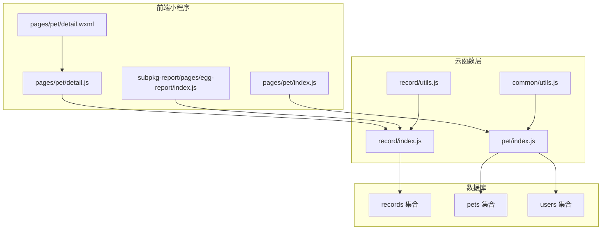
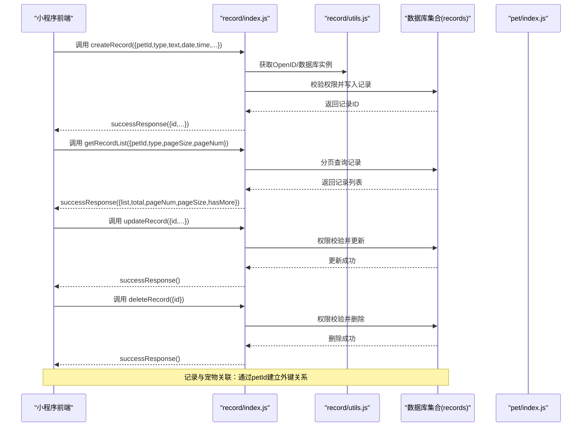
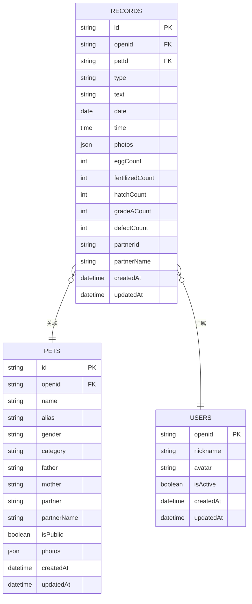
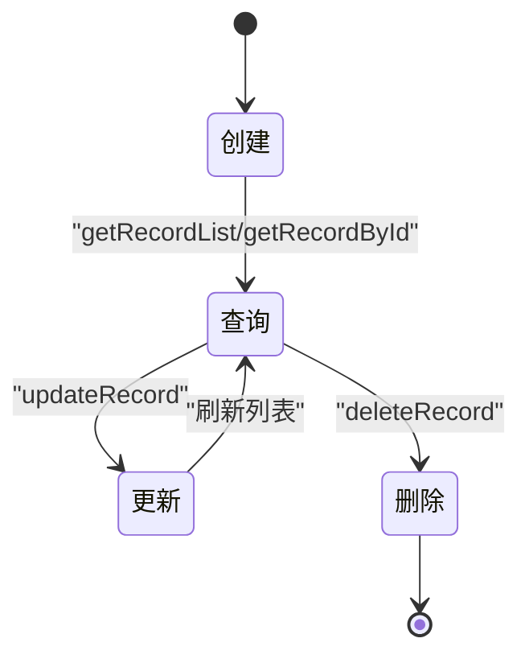
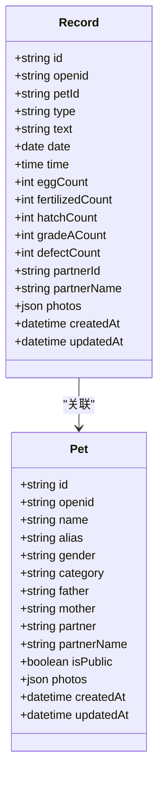
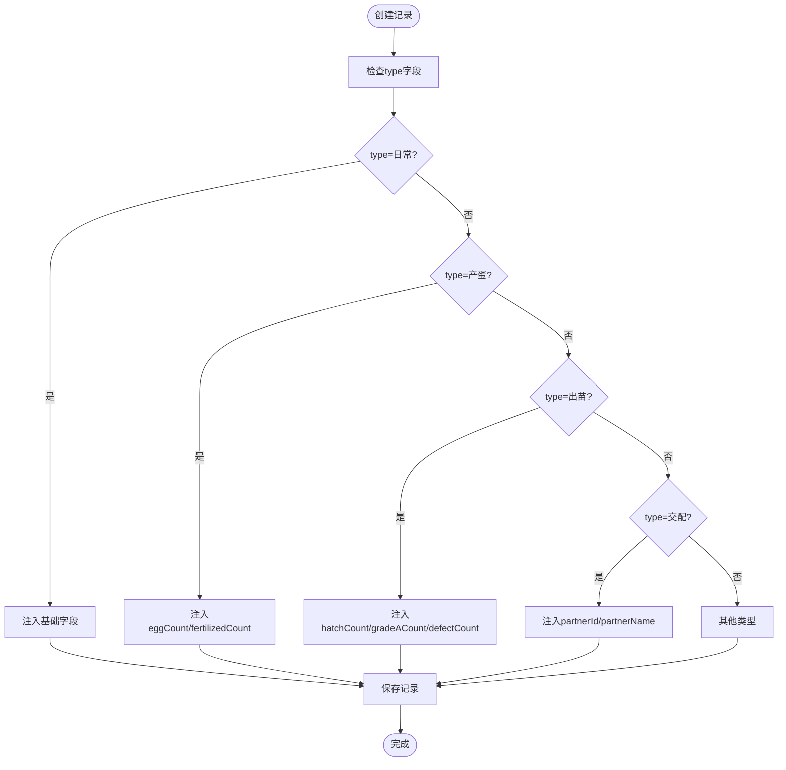
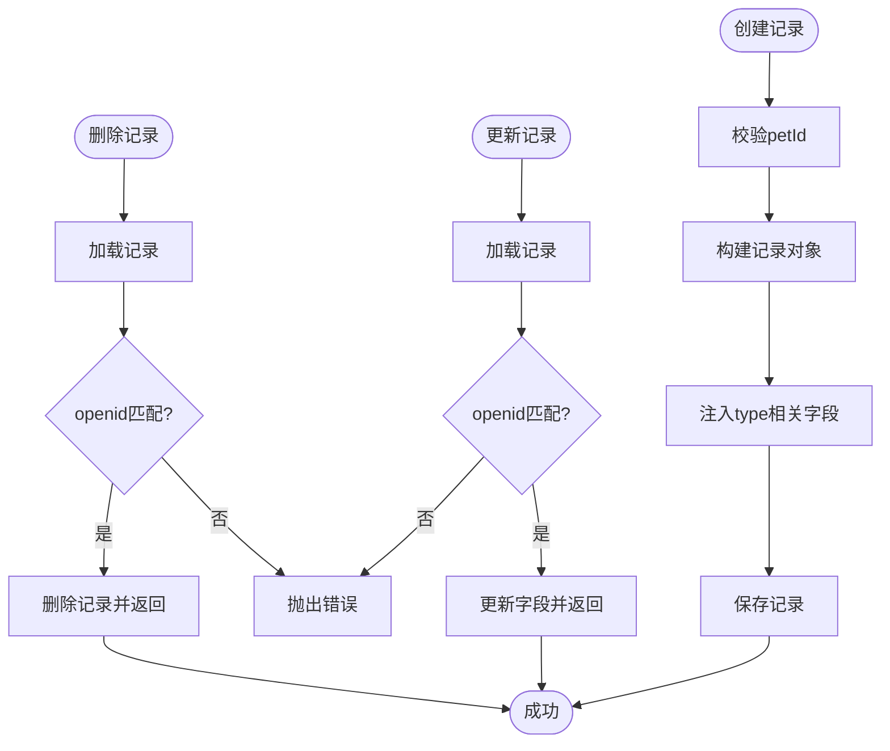
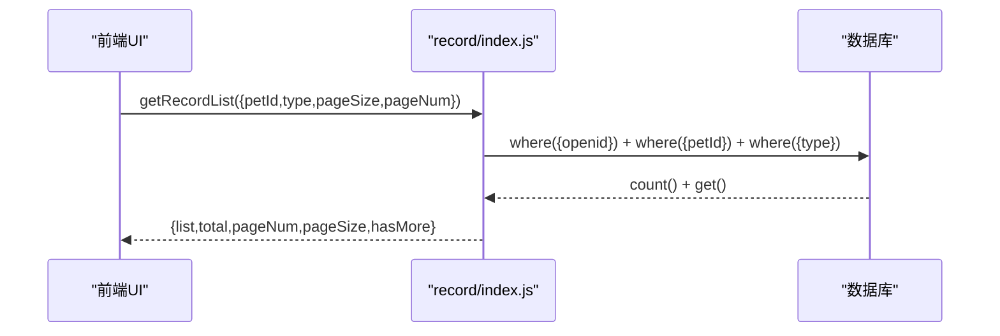
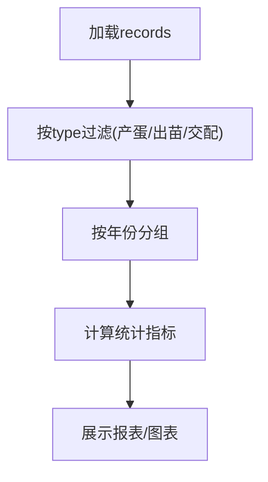
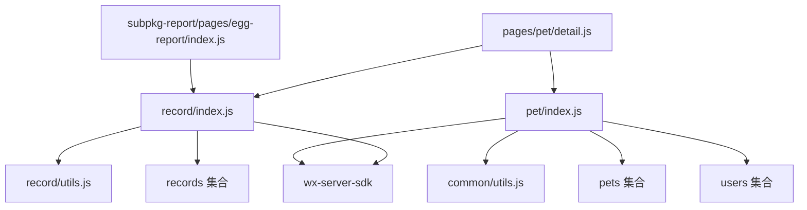

# 记录管理云函数

<cite>
**本文档引用的文件**
- [cloudfunctions/record/index.js](file://cloudfunctions/record/index.js)
- [cloudfunctions/record/utils.js](file://cloudfunctions/record/utils.js)
- [cloudfunctions/record/config.json](file://cloudfunctions/record/config.json)
- [cloudfunctions/pet/index.js](file://cloudfunctions/pet/index.js)
- [cloudfunctions/common/utils.js](file://cloudfunctions/common/utils.js)
- [server-setup/database.sql](file://server-setup/database.sql)
- [miniprogram/pages/pet/detail.js](file://miniprogram/pages/pet/detail.js)
- [miniprogram/pages/pet/detail.wxml](file://miniprogram/pages/pet/detail.wxml)
- [miniprogram/pages/pet/index.js](file://miniprogram/pages/pet/index.js)
- [miniprogram/subpkg-report/pages/egg-report/index.js](file://miniprogram/subpkg-report/pages/egg-report/index.js)
</cite>

## 目录
1. [简介](#简介)
2. [项目结构](#项目结构)
3. [核心组件](#核心组件)
4. [架构概览](#架构概览)
5. [详细组件分析](#详细组件分析)
6. [依赖分析](#依赖分析)
7. [性能考虑](#性能考虑)
8. [故障排查指南](#故障排查指南)
9. [结论](#结论)
10. [附录](#附录)

## 简介
本文件为“养龟档案”项目中记录管理云函数的技术文档，聚焦于健康记录、繁殖记录等各类记录的数据模型与业务逻辑，深入解析记录类型的扩展机制、自定义字段支持与数据验证规则，阐述记录生命周期管理、状态转换与时间线排序，解释记录与宠物的关联关系及数据完整性保障，并提供搜索过滤、全文检索与高级查询实现思路，涵盖导入导出、批量操作与数据迁移机制，以及统计分析、图表展示与报表生成能力。

## 项目结构
记录管理云函数位于 cloudfunctions/record 目录，采用模块化设计：
- 入口文件：index.js，负责路由分发与业务处理
- 工具库：utils.js，封装数据库初始化、鉴权、响应格式化与ID标准化
- 权限配置：config.json，定义开放接口权限
- 与宠物模块协作：通过宠物ID建立记录与宠物的关联关系
- 前端交互：小程序页面通过云函数API进行记录增删改查与统计分析

**图表来源**
- [cloudfunctions/record/index.js:1-191](file://cloudfunctions/record/index.js#L1-L191)
- [cloudfunctions/record/utils.js:1-69](file://cloudfunctions/record/utils.js#L1-L69)
- [cloudfunctions/pet/index.js:1-723](file://cloudfunctions/pet/index.js#L1-L723)
- [miniprogram/pages/pet/detail.js:1730-1929](file://miniprogram/pages/pet/detail.js#L1730-L1929)
- [miniprogram/pages/pet/detail.wxml:580-762](file://miniprogram/pages/pet/detail.wxml#L580-L762)
- [miniprogram/pages/pet/index.js:416-464](file://miniprogram/pages/pet/index.js#L416-L464)
- [miniprogram/subpkg-report/pages/egg-report/index.js:1-478](file://miniprogram/subpkg-report/pages/egg-report/index.js#L1-L478)

**章节来源**
- [cloudfunctions/record/index.js:1-191](file://cloudfunctions/record/index.js#L1-L191)
- [cloudfunctions/record/utils.js:1-69](file://cloudfunctions/record/utils.js#L1-L69)
- [cloudfunctions/pet/index.js:1-723](file://cloudfunctions/pet/index.js#L1-L723)

## 核心组件
- 记录管理云函数：提供创建、查询、更新、删除记录的完整CRUD能力，支持分页与权限控制
- 记录工具库：统一封装数据库初始化、OpenID获取、响应格式化与ID标准化
- 记录类型扩展：通过type字段区分日常、产蛋、出苗、交配等类型，并在创建时注入对应字段
- 数据验证与安全：基于OpenID进行权限校验，防止越权访问
- 与宠物模块集成：通过petId建立记录与宠物的关联，删除宠物时级联清理相关记录

**章节来源**
- [cloudfunctions/record/index.js:37-82](file://cloudfunctions/record/index.js#L37-L82)
- [cloudfunctions/record/index.js:84-111](file://cloudfunctions/record/index.js#L84-L111)
- [cloudfunctions/record/index.js:124-159](file://cloudfunctions/record/index.js#L124-L159)
- [cloudfunctions/pet/index.js:246-249](file://cloudfunctions/pet/index.js#L246-L249)

## 架构概览
记录管理云函数采用“入口路由 + 业务方法 + 工具库”的分层架构，结合微信云开发SDK进行数据库操作与鉴权。前端通过云函数API发起请求，云函数根据action参数分发到具体业务方法，完成数据校验、权限验证与数据库操作，并返回统一的成功/失败响应。

**图表来源**
- [cloudfunctions/record/index.js:10-35](file://cloudfunctions/record/index.js#L10-L35)
- [cloudfunctions/record/index.js:37-82](file://cloudfunctions/record/index.js#L37-L82)
- [cloudfunctions/record/index.js:84-111](file://cloudfunctions/record/index.js#L84-L111)
- [cloudfunctions/record/index.js:124-159](file://cloudfunctions/record/index.js#L124-L159)
- [cloudfunctions/pet/index.js:246-249](file://cloudfunctions/pet/index.js#L246-L249)

## 详细组件分析

### 数据模型与记录类型
记录数据模型以type字段为核心区分不同业务类型，并在创建时注入相应的业务字段：
- 日常记录：基础字段（petId、type、text、date、time、photos等）
- 产蛋记录：新增eggCount、fertilizedCount字段，用于统计受精率
- 出苗记录：新增hatchCount、gradeACount、defectCount字段，用于统计全品率
- 交配记录：新增partnerId、partnerName字段，关联配对对象
- 建档/事件记录：支持photos字段，便于附带照片

**图表来源**
- [cloudfunctions/record/index.js:42-77](file://cloudfunctions/record/index.js#L42-L77)
- [cloudfunctions/record/index.js:53-70](file://cloudfunctions/record/index.js#L53-L70)
- [cloudfunctions/pet/index.js:112-128](file://cloudfunctions/pet/index.js#L112-L128)

**章节来源**
- [cloudfunctions/record/index.js:42-77](file://cloudfunctions/record/index.js#L42-L77)
- [cloudfunctions/record/index.js:53-70](file://cloudfunctions/record/index.js#L53-L70)

### 记录生命周期与状态转换
- 创建：校验必填字段（如petId），注入type与业务字段，写入数据库
- 查询：支持按petId、type过滤与分页，按createdAt倒序排列
- 更新：权限校验后更新指定字段，自动更新updatedAt
- 删除：权限校验后删除记录
- 级联删除：删除宠物时，自动清理该宠物的所有记录

**图表来源**
- [cloudfunctions/record/index.js:37-82](file://cloudfunctions/record/index.js#L37-L82)
- [cloudfunctions/record/index.js:84-111](file://cloudfunctions/record/index.js#L84-L111)
- [cloudfunctions/record/index.js:124-159](file://cloudfunctions/record/index.js#L124-L159)
- [cloudfunctions/pet/index.js:246-249](file://cloudfunctions/pet/index.js#L246-L249)

**章节来源**
- [cloudfunctions/record/index.js:84-111](file://cloudfunctions/record/index.js#L84-L111)
- [cloudfunctions/record/index.js:124-159](file://cloudfunctions/record/index.js#L124-L159)
- [cloudfunctions/pet/index.js:246-249](file://cloudfunctions/pet/index.js#L246-L249)

### 记录与宠物的关联关系
- 一对一/多对一：每条记录通过petId关联到一个宠物
- 多对多关系处理：通过记录中的partnerId与配对对象建立关联，同时在宠物层面维护partner字段
- 数据完整性：删除宠物时，级联删除所有相关记录，避免悬挂引用

**图表来源**
- [cloudfunctions/record/index.js:42-77](file://cloudfunctions/record/index.js#L42-L77)
- [cloudfunctions/pet/index.js:112-128](file://cloudfunctions/pet/index.js#L112-L128)

**章节来源**
- [cloudfunctions/record/index.js:42-77](file://cloudfunctions/record/index.js#L42-L77)
- [cloudfunctions/pet/index.js:112-128](file://cloudfunctions/pet/index.js#L112-L128)

### 记录类型扩展机制与自定义字段
- 类型扩展：通过type字段扩展新的记录类型（如“健康”、“喂食”等），在创建时注入相应字段
- 自定义字段：前端可扩展自定义字段，云函数在创建时将字段合并到记录对象
- 字段兼容：历史记录可能包含多种字段命名（如eggCount/eggs等），前端在统计时提供兼容处理

**图表来源**
- [cloudfunctions/record/index.js:53-70](file://cloudfunctions/record/index.js#L53-L70)
- [miniprogram/subpkg-report/pages/egg-report/index.js:369-395](file://miniprogram/subpkg-report/pages/egg-report/index.js#L369-L395)

**章节来源**
- [cloudfunctions/record/index.js:53-70](file://cloudfunctions/record/index.js#L53-L70)
- [miniprogram/subpkg-report/pages/egg-report/index.js:369-395](file://miniprogram/subpkg-report/pages/egg-report/index.js#L369-L395)

### 数据验证规则与权限控制
- 必填校验：创建记录时要求petId存在
- 权限校验：所有读写操作均需验证记录的openid与当前用户一致
- 数值校验：产蛋/出苗等数值字段进行整数转换与默认值处理
- 级联删除：删除宠物时自动清理相关记录，保证数据一致性

**图表来源**
- [cloudfunctions/record/index.js:37-82](file://cloudfunctions/record/index.js#L37-L82)
- [cloudfunctions/record/index.js:124-159](file://cloudfunctions/record/index.js#L124-L159)

**章节来源**
- [cloudfunctions/record/index.js:37-82](file://cloudfunctions/record/index.js#L37-L82)
- [cloudfunctions/record/index.js:124-159](file://cloudfunctions/record/index.js#L124-L159)

### 搜索过滤、全文检索与高级查询
- 基础过滤：支持按petId、type过滤
- 分页：支持pageSize与pageNum分页参数
- 排序：默认按createdAt倒序
- 高级查询：前端可在records集合上进行更复杂的查询（如日期范围、文本匹配等）

**图表来源**
- [cloudfunctions/record/index.js:84-111](file://cloudfunctions/record/index.js#L84-L111)

**章节来源**
- [cloudfunctions/record/index.js:84-111](file://cloudfunctions/record/index.js#L84-L111)

### 导入导出、批量操作与数据迁移
- 导入：前端可将本地records缓存数据上传至云端，或通过批量API导入
- 导出：前端可将records导出为本地存储或报表
- 批量操作：支持批量删除、批量更新等操作（需在云函数中实现）
- 数据迁移：通过records与pets的关联关系，迁移宠物数据时同步迁移相关记录

**章节来源**
- [miniprogram/pages/pet/detail.js:1730-1929](file://miniprogram/pages/pet/detail.js#L1730-L1929)
- [cloudfunctions/pet/index.js:246-249](file://cloudfunctions/pet/index.js#L246-L249)

### 统计分析、图表展示与报表生成
- 产蛋报表：按年份分组，统计总窝数、总蛋数、受精窝数、受精蛋数与受精率
- 出苗报表：统计破壳数量、全品数、瑕疵数与全品率
- 交配状态：根据最近30天内的交配/产蛋记录判断待配状态
- 健康预警：根据最近30天内的健康记录判断预警状态

**图表来源**
- [miniprogram/subpkg-report/pages/egg-report/index.js:260-367](file://miniprogram/subpkg-report/pages/egg-report/index.js#L260-L367)
- [miniprogram/pages/pet/index.js:416-464](file://miniprogram/pages/pet/index.js#L416-L464)

**章节来源**
- [miniprogram/subpkg-report/pages/egg-report/index.js:260-367](file://miniprogram/subpkg-report/pages/egg-report/index.js#L260-L367)
- [miniprogram/pages/pet/index.js:416-464](file://miniprogram/pages/pet/index.js#L416-L464)

## 依赖分析
- 云函数依赖：微信云开发SDK、数据库集合（records、pets、users）
- 前端依赖：小程序云API、本地缓存（records、pets）
- 工具库复用：common/utils.js与record/utils.js提供通用工具函数

**图表来源**
- [cloudfunctions/record/index.js:1-10](file://cloudfunctions/record/index.js#L1-L10)
- [cloudfunctions/record/utils.js:1-18](file://cloudfunctions/record/utils.js#L1-L18)
- [cloudfunctions/pet/index.js:1-10](file://cloudfunctions/pet/index.js#L1-L10)
- [cloudfunctions/common/utils.js:1-18](file://cloudfunctions/common/utils.js#L1-L18)
- [miniprogram/pages/pet/detail.js:1730-1929](file://miniprogram/pages/pet/detail.js#L1730-L1929)
- [miniprogram/subpkg-report/pages/egg-report/index.js:1-478](file://miniprogram/subpkg-report/pages/egg-report/index.js#L1-L478)

**章节来源**
- [cloudfunctions/record/index.js:1-10](file://cloudfunctions/record/index.js#L1-L10)
- [cloudfunctions/record/utils.js:1-18](file://cloudfunctions/record/utils.js#L1-L18)
- [cloudfunctions/pet/index.js:1-10](file://cloudfunctions/pet/index.js#L1-L10)
- [cloudfunctions/common/utils.js:1-18](file://cloudfunctions/common/utils.js#L1-L18)

## 性能考虑
- 分页查询：通过pageSize与pageNum实现分页，减少单次查询数据量
- 索引优化：建议在records集合上建立openid、petId、type、date、createdAt等索引
- 权限校验：在云函数层进行权限校验，避免前端伪造
- 缓存策略：前端可缓存records与pets数据，减少重复查询
- 异步处理：批量操作建议异步执行，避免阻塞主线程

## 故障排查指南
- 记录不存在：检查openid与记录ID是否匹配，确认记录是否存在
- 权限不足：确认当前用户是否为记录创建者
- 参数错误：检查必填字段（如petId）是否正确传入
- 数据不一致：检查records与pets的关联关系，必要时执行级联删除

**章节来源**
- [cloudfunctions/record/index.js:113-121](file://cloudfunctions/record/index.js#L113-L121)
- [cloudfunctions/record/index.js:127-134](file://cloudfunctions/record/index.js#L127-L134)
- [cloudfunctions/record/index.js:147-154](file://cloudfunctions/record/index.js#L147-L154)

## 结论
记录管理云函数通过清晰的类型扩展机制、严格的权限控制与完善的生命周期管理，实现了健康记录、繁殖记录等多样化业务场景的支持。配合前端的统计分析与报表展示，形成了完整的记录管理体系。未来可在批量操作、全文检索与更丰富的自定义字段方面进一步增强。

## 附录
- 数据库表结构参考：records表包含type、date、time、photos、数值字段等，支持灵活扩展
- 前端交互：通过云函数API实现记录的增删改查与统计分析
- 权限配置：record/config.json定义开放接口权限，确保安全可控

**章节来源**
- [server-setup/database.sql:78-109](file://server-setup/database.sql#L78-L109)
- [cloudfunctions/record/config.json:1-6](file://cloudfunctions/record/config.json#L1-L6)