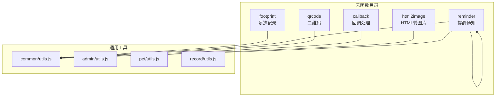
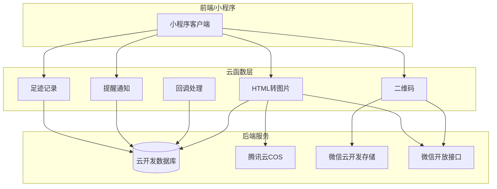
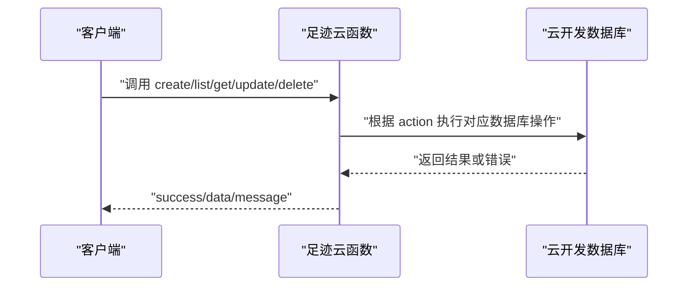
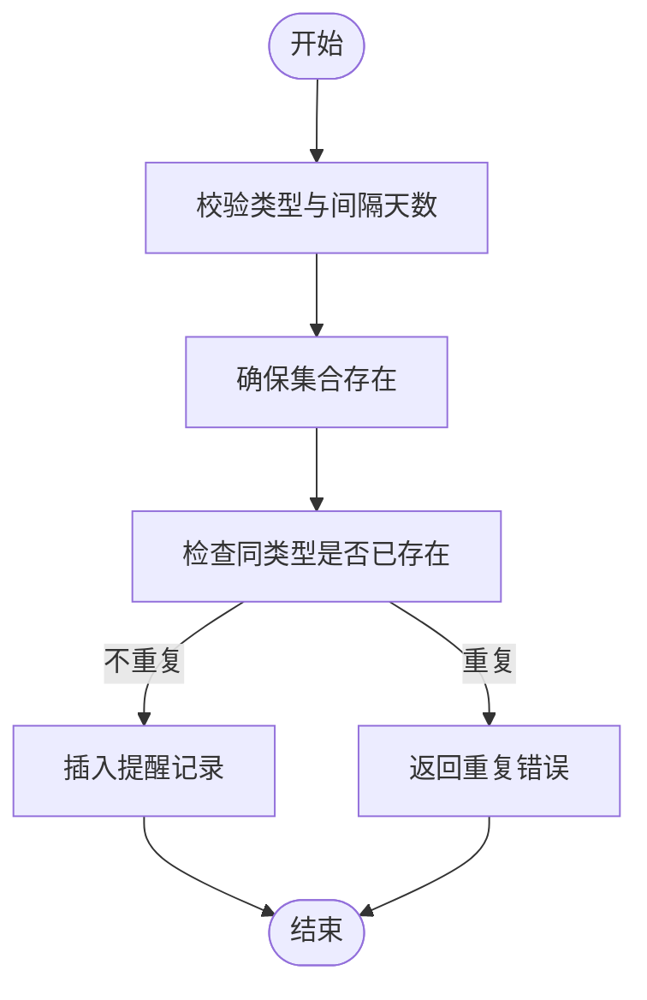
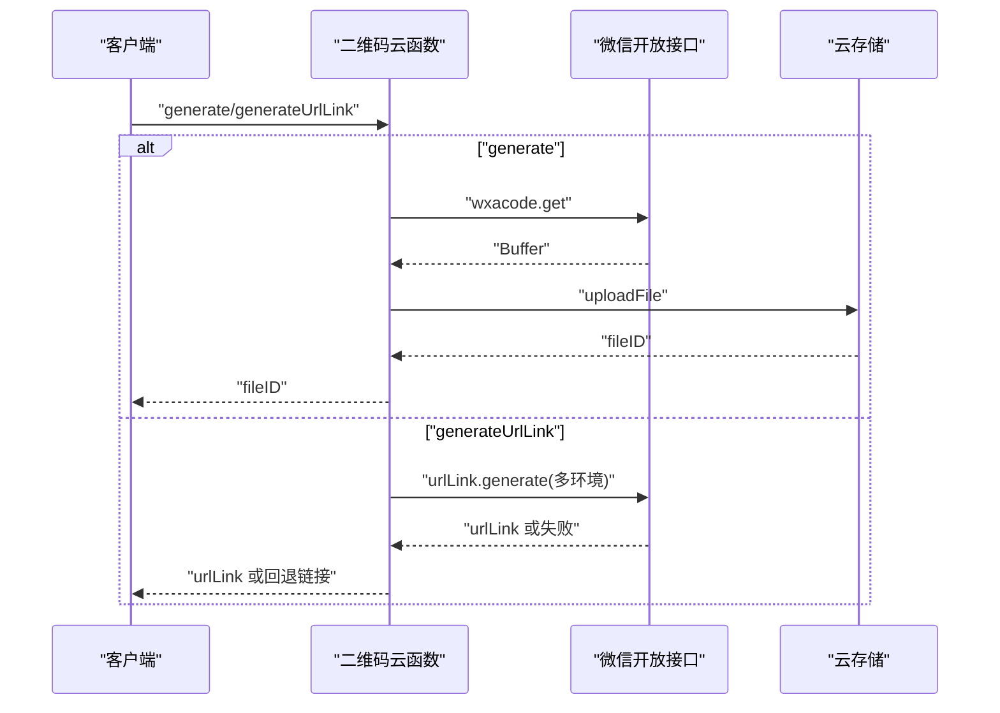
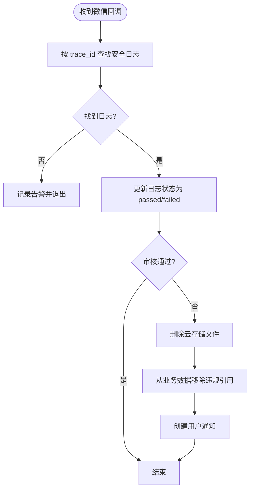
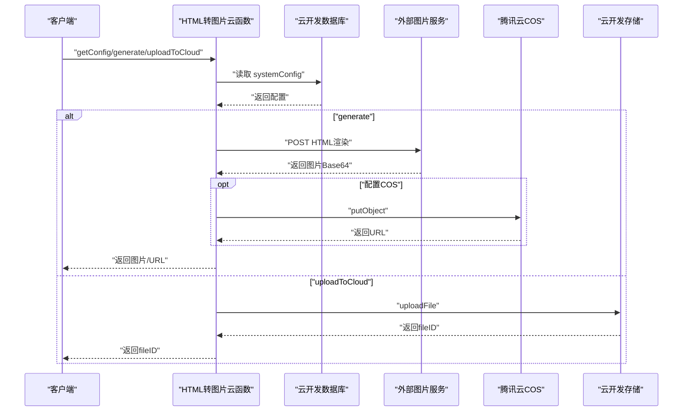
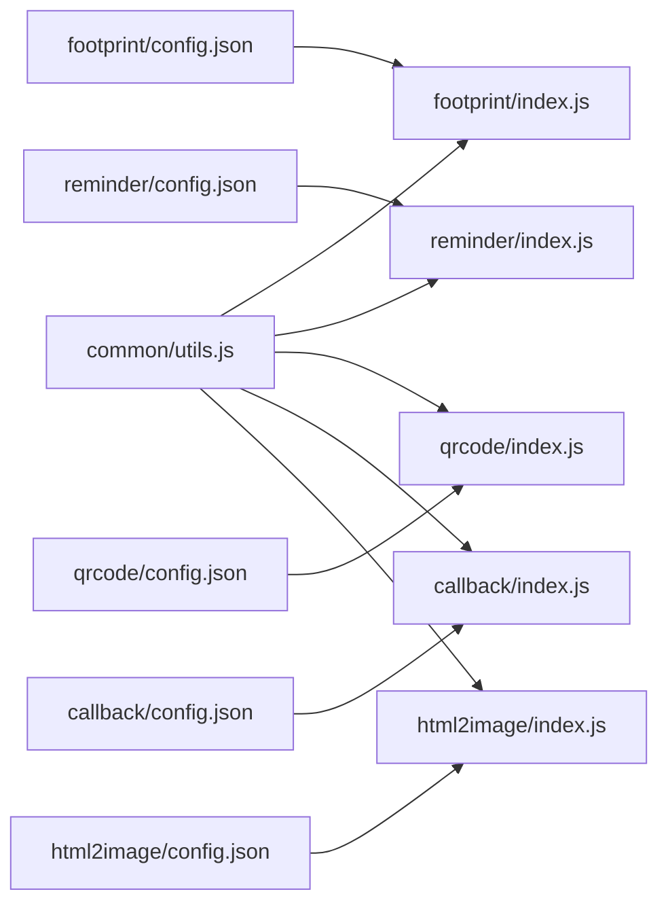

# 辅助功能云函数

<cite>
**本文档引用的文件**
- [cloudfunctions/footprint/index.js](file://cloudfunctions/footprint/index.js)
- [cloudfunctions/footprint/config.json](file://cloudfunctions/footprint/config.json)
- [cloudfunctions/reminder/index.js](file://cloudfunctions/reminder/index.js)
- [cloudfunctions/reminder/utils.js](file://cloudfunctions/reminder/utils.js)
- [cloudfunctions/reminder/config.json](file://cloudfunctions/reminder/config.json)
- [cloudfunctions/qrcode/index.js](file://cloudfunctions/qrcode/index.js)
- [cloudfunctions/qrcode/config.json](file://cloudfunctions/qrcode/config.json)
- [cloudfunctions/callback/index.js](file://cloudfunctions/callback/index.js)
- [cloudfunctions/callback/config.json](file://cloudfunctions/callback/config.json)
- [cloudfunctions/html2image/index.js](file://cloudfunctions/html2image/index.js)
- [cloudfunctions/html2image/config.json](file://cloudfunctions/html2image/config.json)
- [cloudfunctions/common/utils.js](file://cloudfunctions/common/utils.js)
- [cloudfunctions/admin/utils.js](file://cloudfunctions/admin/utils.js)
- [cloudfunctions/pet/utils.js](file://cloudfunctions/pet/utils.js)
- [cloudfunctions/record/utils.js](file://cloudfunctions/record/utils.js)
</cite>

## 目录
1. [引言](#引言)
2. [项目结构](#项目结构)
3. [核心组件](#核心组件)
4. [架构总览](#架构总览)
5. [详细组件分析](#详细组件分析)
6. [依赖关系分析](#依赖关系分析)
7. [性能与可靠性](#性能与可靠性)
8. [故障排查指南](#故障排查指南)
9. [结论](#结论)
10. [附录](#附录)

## 引言
本文件面向“养龟档案”项目的辅助功能云函数，围绕以下主题展开：足迹记录的数据模型与接口、位置信息采集与轨迹分析思路；提醒通知的定时任务、消息推送与用户提醒机制；二维码生成（小程序码与URL Link）、内容编码与样式定制；回调处理（异步审核结果）、异步任务队列与事件响应；以及配置参数、使用场景、集成方式、扩展指南与第三方服务集成建议。文档力求以循序渐进的方式呈现，既适合技术读者深入理解实现细节，也便于非技术读者把握整体能力边界。

## 项目结构
辅助功能云函数位于 cloudfunctions 目录下，按功能拆分独立子目录，每个子目录包含一个入口文件与配置文件。通用工具函数分布在 common 子目录及各业务模块 utils 中，统一提供数据库初始化、上下文获取、响应封装与ID规范化等能力。

图表来源
- [cloudfunctions/footprint/index.js:1-160](file://cloudfunctions/footprint/index.js#L1-L160)
- [cloudfunctions/reminder/index.js:1-205](file://cloudfunctions/reminder/index.js#L1-L205)
- [cloudfunctions/reminder/utils.js:1-69](file://cloudfunctions/reminder/utils.js#L1-L69)
- [cloudfunctions/qrcode/index.js:1-117](file://cloudfunctions/qrcode/index.js#L1-L117)
- [cloudfunctions/callback/index.js:1-223](file://cloudfunctions/callback/index.js#L1-L223)
- [cloudfunctions/html2image/index.js:1-205](file://cloudfunctions/html2image/index.js#L1-L205)
- [cloudfunctions/common/utils.js:1-69](file://cloudfunctions/common/utils.js#L1-L69)

章节来源
- [cloudfunctions/footprint/index.js:1-160](file://cloudfunctions/footprint/index.js#L1-L160)
- [cloudfunctions/reminder/index.js:1-205](file://cloudfunctions/reminder/index.js#L1-L205)
- [cloudfunctions/qrcode/index.js:1-117](file://cloudfunctions/qrcode/index.js#L1-L117)
- [cloudfunctions/callback/index.js:1-223](file://cloudfunctions/callback/index.js#L1-L223)
- [cloudfunctions/html2image/index.js:1-205](file://cloudfunctions/html2image/index.js#L1-L205)
- [cloudfunctions/common/utils.js:1-69](file://cloudfunctions/common/utils.js#L1-L69)

## 核心组件
- 足迹记录云函数：提供足迹的增删改查、分页与权限校验，支持图片数量上限控制与时间维度排序。
- 提醒通知云函数：提供提醒的创建、查询、更新、删除与“已完成”标记，并对重复类型进行约束。
- 二维码云函数：支持生成小程序码与生成URL Link（永久链接），并兼容多环境回退策略。
- 回调处理云函数：接收微信异步审核结果，更新安全日志、清理违规资源并在业务数据中移除引用，同时创建用户通知。
- HTML转图片云函数：对接外部图片生成服务，支持上传至腾讯云COS或云开发存储，并可动态获取服务配置。

章节来源
- [cloudfunctions/footprint/index.js:9-32](file://cloudfunctions/footprint/index.js#L9-L32)
- [cloudfunctions/reminder/index.js:10-37](file://cloudfunctions/reminder/index.js#L10-L37)
- [cloudfunctions/qrcode/index.js:7-22](file://cloudfunctions/qrcode/index.js#L7-L22)
- [cloudfunctions/callback/index.js:42-52](file://cloudfunctions/callback/index.js#L42-L52)
- [cloudfunctions/html2image/index.js:14-27](file://cloudfunctions/html2image/index.js#L14-L27)

## 架构总览
下图展示各云函数与数据库、微信开放接口、云存储之间的交互关系：

图表来源
- [cloudfunctions/footprint/index.js:7-32](file://cloudfunctions/footprint/index.js#L7-L32)
- [cloudfunctions/reminder/index.js:8-37](file://cloudfunctions/reminder/index.js#L8-L37)
- [cloudfunctions/qrcode/index.js:32-61](file://cloudfunctions/qrcode/index.js#L32-L61)
- [cloudfunctions/callback/index.js:59-109](file://cloudfunctions/callback/index.js#L59-L109)
- [cloudfunctions/html2image/index.js:14-27](file://cloudfunctions/html2image/index.js#L14-L27)

## 详细组件分析

### 足迹记录功能
- 功能概述
  - 提供足迹的创建、列表查询、详情获取、更新与删除。
  - 列表支持按类型过滤与分页，按创建时间倒序。
  - 支持系统配置项控制单条足迹最大图片数量。
- 数据模型要点
  - 关键字段：类型、URL、图片数组、缩略图、持续时间、日期/时间、关联宠物信息、创建/更新时间、用户标识。
  - 权限：所有操作均绑定 OPENID，防止越权访问。
- 处理逻辑
  - 创建：读取系统配置，校验图片数量上限，写入数据库并返回ID。
  - 列表：构造 where 条件（openid 及可选 type），分页查询并统计总数。
  - 详情：按 ID+OPENID 查询，不存在则抛错。
  - 更新/删除：先校验记录存在且属于当前用户，再执行更新/删除。
- 错误处理
  - 统一捕获异常并返回带错误信息的响应。
- 性能与复杂度
  - 列表查询为 O(n)（n为返回条目数），分页避免一次性加载过多。
  - 建议：对 type 与 openid 建立索引以优化查询。

图表来源
- [cloudfunctions/footprint/index.js:9-32](file://cloudfunctions/footprint/index.js#L9-L32)
- [cloudfunctions/footprint/index.js:34-72](file://cloudfunctions/footprint/index.js#L34-L72)
- [cloudfunctions/footprint/index.js:74-107](file://cloudfunctions/footprint/index.js#L74-L107)
- [cloudfunctions/footprint/index.js:109-126](file://cloudfunctions/footprint/index.js#L109-L126)
- [cloudfunctions/footprint/index.js:128-146](file://cloudfunctions/footprint/index.js#L128-L146)
- [cloudfunctions/footprint/index.js:148-159](file://cloudfunctions/footprint/index.js#L148-L159)

章节来源
- [cloudfunctions/footprint/index.js:9-32](file://cloudfunctions/footprint/index.js#L9-L32)
- [cloudfunctions/footprint/index.js:34-72](file://cloudfunctions/footprint/index.js#L34-L72)
- [cloudfunctions/footprint/index.js:74-107](file://cloudfunctions/footprint/index.js#L74-L107)
- [cloudfunctions/footprint/index.js:109-126](file://cloudfunctions/footprint/index.js#L109-L126)
- [cloudfunctions/footprint/index.js:128-146](file://cloudfunctions/footprint/index.js#L128-L146)
- [cloudfunctions/footprint/index.js:148-159](file://cloudfunctions/footprint/index.js#L148-L159)
- [cloudfunctions/footprint/config.json:1-6](file://cloudfunctions/footprint/config.json#L1-L6)

### 提醒通知功能
- 功能概述
  - 提供提醒的创建、按宠物查询、全量查询、详情、更新、删除与“已完成”标记。
  - 同一用户同一宠物下，同类型提醒不可重复。
- 处理逻辑
  - 创建：校验必填字段，确保集合存在，检查重复，写入数据库。
  - 查询：按 petId 或 openid 查询，集合不存在时返回空列表。
  - 更新：支持变更类型（需检查冲突）、间隔天数、最近完成时间、备注等。
  - 删除与标记完成：均进行权限校验。
- 错误处理
  - 对集合不存在、重复类型、越权等场景抛出明确错误。
- 性能与复杂度
  - 查询按类型与时间排序，建议在 petId 与 openid 上建立索引。

图表来源
- [cloudfunctions/reminder/index.js:55-102](file://cloudfunctions/reminder/index.js#L55-L102)
- [cloudfunctions/reminder/index.js:104-123](file://cloudfunctions/reminder/index.js#L104-L123)
- [cloudfunctions/reminder/index.js:126-142](file://cloudfunctions/reminder/index.js#L126-L142)
- [cloudfunctions/reminder/index.js:144-149](file://cloudfunctions/reminder/index.js#L144-L149)
- [cloudfunctions/reminder/index.js:151-179](file://cloudfunctions/reminder/index.js#L151-L179)
- [cloudfunctions/reminder/index.js:181-188](file://cloudfunctions/reminder/index.js#L181-L188)
- [cloudfunctions/reminder/index.js:190-204](file://cloudfunctions/reminder/index.js#L190-L204)

章节来源
- [cloudfunctions/reminder/index.js:10-37](file://cloudfunctions/reminder/index.js#L10-L37)
- [cloudfunctions/reminder/index.js:55-102](file://cloudfunctions/reminder/index.js#L55-L102)
- [cloudfunctions/reminder/index.js:104-142](file://cloudfunctions/reminder/index.js#L104-L142)
- [cloudfunctions/reminder/index.js:144-188](file://cloudfunctions/reminder/index.js#L144-L188)
- [cloudfunctions/reminder/index.js:190-204](file://cloudfunctions/reminder/index.js#L190-L204)
- [cloudfunctions/reminder/utils.js:1-69](file://cloudfunctions/reminder/utils.js#L1-L69)
- [cloudfunctions/reminder/config.json:1-6](file://cloudfunctions/reminder/config.json#L1-L6)

### 二维码生成功能
- 功能概述
  - 生成小程序码：支持指定页面路径与场景字符串，返回云存储 fileID。
  - 生成URL Link：返回永久有效的 urlLink 文本，支持多环境尝试与回退。
- 处理逻辑
  - 小程序码：调用微信 wxacode 接口生成 Buffer，上传至云存储，返回 fileID。
  - URL Link：优先多环境尝试生成，失败时回退为纯文本链接。
- 错误处理
  - 捕获微信接口错误码与错误信息，返回结构化失败响应。
- 性能与复杂度
  - 生成过程为同步请求，建议在前端缓存生成结果以减少重复调用。

图表来源
- [cloudfunctions/qrcode/index.js:10-22](file://cloudfunctions/qrcode/index.js#L10-L22)
- [cloudfunctions/qrcode/index.js:24-61](file://cloudfunctions/qrcode/index.js#L24-L61)
- [cloudfunctions/qrcode/index.js:65-117](file://cloudfunctions/qrcode/index.js#L65-L117)
- [cloudfunctions/qrcode/config.json:1-12](file://cloudfunctions/qrcode/config.json#L1-L12)

章节来源
- [cloudfunctions/qrcode/index.js:7-22](file://cloudfunctions/qrcode/index.js#L7-L22)
- [cloudfunctions/qrcode/index.js:24-61](file://cloudfunctions/qrcode/index.js#L24-L61)
- [cloudfunctions/qrcode/index.js:65-117](file://cloudfunctions/qrcode/index.js#L65-L117)
- [cloudfunctions/qrcode/config.json:1-12](file://cloudfunctions/qrcode/config.json#L1-L12)

### 回调处理与异步任务
- 功能概述
  - 接收微信异步审核结果（wxa_media_check），更新安全日志状态。
  - 审核不通过时，删除云存储文件、从业务数据中移除违规图片引用，并创建用户通知。
- 处理逻辑
  - 根据 trace_id 查找安全日志，更新状态与处理时间。
  - 若审核不通过：删除云存储文件；按场景标签（avatar/cover/pet/footprint）从用户或宠物/足迹集合中移除引用；必要时删除整条足迹记录；最后创建通知。
- 错误处理
  - 对删除文件、更新业务数据、创建通知等操作进行容错处理，避免影响主流程。

图表来源
- [cloudfunctions/callback/index.js:42-52](file://cloudfunctions/callback/index.js#L42-L52)
- [cloudfunctions/callback/index.js:57-109](file://cloudfunctions/callback/index.js#L57-L109)
- [cloudfunctions/callback/index.js:114-197](file://cloudfunctions/callback/index.js#L114-L197)
- [cloudfunctions/callback/index.js:202-223](file://cloudfunctions/callback/index.js#L202-L223)

章节来源
- [cloudfunctions/callback/index.js:1-52](file://cloudfunctions/callback/index.js#L1-L52)
- [cloudfunctions/callback/index.js:57-109](file://cloudfunctions/callback/index.js#L57-L109)
- [cloudfunctions/callback/index.js:114-197](file://cloudfunctions/callback/index.js#L114-L197)
- [cloudfunctions/callback/index.js:202-223](file://cloudfunctions/callback/index.js#L202-L223)
- [cloudfunctions/callback/config.json:1-5](file://cloudfunctions/callback/config.json#L1-L5)

### HTML转图片功能
- 功能概述
  - 对外提供图片生成服务配置获取、HTML内容生成图片、上传至腾讯云COS或云开发存储的能力。
- 处理逻辑
  - 获取配置：从 systemConfig 读取服务地址、超时、COS密钥与桶信息。
  - 生成图片：向外部服务发送POST请求，携带HTML与渲染参数，支持超时控制。
  - 上传COS：若配置完整，则将Base64图片上传至COS并返回URL；否则返回本地生成结果。
  - 上传云存储：直接将Base64图片上传至云开发存储。
- 错误处理
  - 对配置读取、服务调用、COS上传等环节进行异常捕获与降级处理。

图表来源
- [cloudfunctions/html2image/index.js:14-27](file://cloudfunctions/html2image/index.js#L14-L27)
- [cloudfunctions/html2image/index.js:32-55](file://cloudfunctions/html2image/index.js#L32-L55)
- [cloudfunctions/html2image/index.js:66-140](file://cloudfunctions/html2image/index.js#L66-L140)
- [cloudfunctions/html2image/index.js:177-205](file://cloudfunctions/html2image/index.js#L177-L205)
- [cloudfunctions/html2image/config.json:1-8](file://cloudfunctions/html2image/config.json#L1-L8)

章节来源
- [cloudfunctions/html2image/index.js:14-27](file://cloudfunctions/html2image/index.js#L14-L27)
- [cloudfunctions/html2image/index.js:32-55](file://cloudfunctions/html2image/index.js#L32-L55)
- [cloudfunctions/html2image/index.js:66-140](file://cloudfunctions/html2image/index.js#L66-L140)
- [cloudfunctions/html2image/index.js:177-205](file://cloudfunctions/html2image/index.js#L177-L205)
- [cloudfunctions/html2image/config.json:1-8](file://cloudfunctions/html2image/config.json#L1-L8)

## 依赖关系分析
- 通用工具复用
  - 各云函数共享通用工具函数，包括数据库初始化、上下文获取、响应封装与ID规范化，降低重复代码与提升一致性。
- 外部依赖
  - 微信开放接口：二维码生成、URL Link生成、媒体检测回调。
  - 腾讯云COS：图片上传与CDN加速。
  - 外部图片生成服务：基于HTTP协议的远程渲染服务。
- 配置管理
  - 通过 systemConfig 动态读取服务地址、超时、COS凭据等，便于环境切换与运维调整。

图表来源
- [cloudfunctions/common/utils.js:1-69](file://cloudfunctions/common/utils.js#L1-L69)
- [cloudfunctions/footprint/index.js:1-10](file://cloudfunctions/footprint/index.js#L1-L10)
- [cloudfunctions/reminder/index.js:1-10](file://cloudfunctions/reminder/index.js#L1-L10)
- [cloudfunctions/qrcode/index.js:1-10](file://cloudfunctions/qrcode/index.js#L1-L10)
- [cloudfunctions/callback/index.js:1-10](file://cloudfunctions/callback/index.js#L1-L10)
- [cloudfunctions/html2image/index.js:1-10](file://cloudfunctions/html2image/index.js#L1-L10)
- [cloudfunctions/footprint/config.json:1-6](file://cloudfunctions/footprint/config.json#L1-L6)
- [cloudfunctions/reminder/config.json:1-6](file://cloudfunctions/reminder/config.json#L1-L6)
- [cloudfunctions/qrcode/config.json:1-12](file://cloudfunctions/qrcode/config.json#L1-L12)
- [cloudfunctions/callback/config.json:1-5](file://cloudfunctions/callback/config.json#L1-L5)
- [cloudfunctions/html2image/config.json:1-8](file://cloudfunctions/html2image/config.json#L1-L8)

章节来源
- [cloudfunctions/common/utils.js:1-69](file://cloudfunctions/common/utils.js#L1-L69)
- [cloudfunctions/footprint/config.json:1-6](file://cloudfunctions/footprint/config.json#L1-L6)
- [cloudfunctions/reminder/config.json:1-6](file://cloudfunctions/reminder/config.json#L1-L6)
- [cloudfunctions/qrcode/config.json:1-12](file://cloudfunctions/qrcode/config.json#L1-L12)
- [cloudfunctions/callback/config.json:1-5](file://cloudfunctions/callback/config.json#L1-L5)
- [cloudfunctions/html2image/config.json:1-8](file://cloudfunctions/html2image/config.json#L1-L8)

## 性能与可靠性
- 查询优化
  - 在常用查询条件（如 openid、petId、type、createdAt）上建立索引，可显著降低查询延迟。
- 并发与幂等
  - 提醒创建时对“同类型提醒”进行唯一性约束，避免重复创建。
  - 回调处理对重复 trace_id 的日志进行幂等处理，避免重复清理与通知。
- 超时与降级
  - HTML转图片支持超时配置与COS上传失败降级，保证主流程稳定。
- 存储与成本
  - 二维码与图片生成结果上传至云存储/COS，建议结合生命周期策略清理过期文件。

## 故障排查指南
- 常见问题定位
  - 足迹操作失败：检查系统配置中的图片数量限制、OPENID 是否匹配、数据库连接状态。
  - 提醒操作失败：确认 petId/type/intervalDays 参数合法性，检查集合是否存在与重复类型冲突。
  - 二维码生成失败：查看微信接口错误码与错误信息，确认权限配置与环境变量。
  - 回调处理异常：检查 trace_id 对应的安全日志是否存在，关注删除文件与更新业务数据的容错日志。
  - HTML转图片失败：确认 systemConfig 配置正确、外部服务可达、COS凭据完整。
- 日志与监控
  - 各云函数均输出结构化错误信息，建议在云开发控制台查看实时日志并结合错误码定位问题。

章节来源
- [cloudfunctions/footprint/index.js:28-31](file://cloudfunctions/footprint/index.js#L28-L31)
- [cloudfunctions/reminder/index.js:33-36](file://cloudfunctions/reminder/index.js#L33-L36)
- [cloudfunctions/qrcode/index.js:49-60](file://cloudfunctions/qrcode/index.js#L49-L60)
- [cloudfunctions/callback/index.js:48-51](file://cloudfunctions/callback/index.js#L48-L51)
- [cloudfunctions/html2image/index.js:132-139](file://cloudfunctions/html2image/index.js#L132-L139)

## 结论
本套辅助功能云函数覆盖了足迹记录、提醒通知、二维码生成、回调处理与HTML转图片等关键能力，具备清晰的职责划分、一致的工具封装与完善的错误处理机制。通过合理的索引设计、超时与降级策略以及多环境配置管理，可在保证稳定性的同时满足多样化的业务需求。后续可在此基础上扩展更多提醒类型、增强轨迹分析算法、引入更丰富的二维码样式与内容编码策略，并完善与第三方服务的集成方案。

## 附录

### 配置参数与使用场景
- 足迹记录
  - 系统配置项：maxFootprintImages（单条足迹最大图片数）
  - 使用场景：记录宠物日常活动、健康监测、行为观察等
- 提醒通知
  - 必填参数：petId、type、intervalDays
  - 使用场景：喂食、换水、清洁、疫苗等周期性提醒
- 二维码
  - 小程序码：pagePath、scene
  - URL Link：petId、recordId（可选）
  - 使用场景：分享宠物档案、打印标签、扫码跳转
- HTML转图片
  - systemConfig：imageServerUrl、imageTimeout、qcloudSecretId/Key/Bucket/Region
  - 使用场景：生成分享海报、报告截图、报表导出预览

章节来源
- [cloudfunctions/footprint/index.js:36-44](file://cloudfunctions/footprint/index.js#L36-L44)
- [cloudfunctions/reminder/index.js:56-58](file://cloudfunctions/reminder/index.js#L56-L58)
- [cloudfunctions/qrcode/index.js:24-61](file://cloudfunctions/qrcode/index.js#L24-L61)
- [cloudfunctions/qrcode/index.js:65-117](file://cloudfunctions/qrcode/index.js#L65-L117)
- [cloudfunctions/html2image/index.js:32-55](file://cloudfunctions/html2image/index.js#L32-L55)

### 集成方式与最佳实践
- 集成方式
  - 在小程序端通过云函数调用接口，传入 action 与 data，解析返回的 success/data/message。
  - 对于需要鉴权的场景，确保在云函数内校验 OPENID 与业务数据归属。
- 最佳实践
  - 统一使用 common/utils.js 的响应封装与ID规范化，保持前后端契约一致。
  - 对外部服务调用增加超时与重试策略，避免阻塞主线程。
  - 对敏感操作（删除、更新）增加二次确认与审计日志。

章节来源
- [cloudfunctions/common/utils.js:20-35](file://cloudfunctions/common/utils.js#L20-L35)
- [cloudfunctions/reminder/utils.js:20-35](file://cloudfunctions/reminder/utils.js#L20-L35)

### 功能扩展指南
- 足迹记录
  - 增加位置信息字段与地理围栏分析，结合历史轨迹生成活动范围热力图。
  - 引入AI识别能力，自动标注足迹类型与健康状态。
- 提醒通知
  - 支持多种提醒渠道（微信模板消息、短信、邮件）与多设备同步。
  - 增加智能调度：根据宠物状态与历史完成情况动态调整提醒时间。
- 二维码
  - 支持批量生成、样式模板库、动态内容解码（含加密与签名）。
  - 增加离线二维码生成能力，减少对外部服务依赖。
- 回调处理
  - 引入规则引擎，支持自定义违规标签与处置策略。
  - 增加人工复审通道与申诉机制。
- HTML转图片
  - 支持多模板渲染、动态数据注入与分页长图生成。
  - 增加缓存策略与CDN加速，提升并发性能。