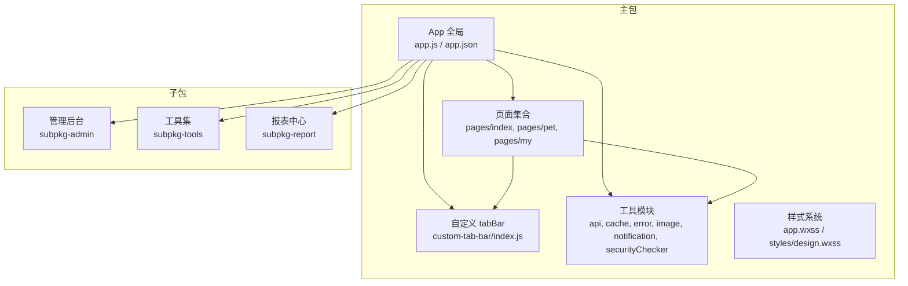
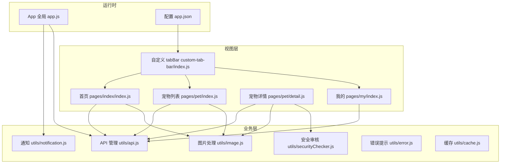
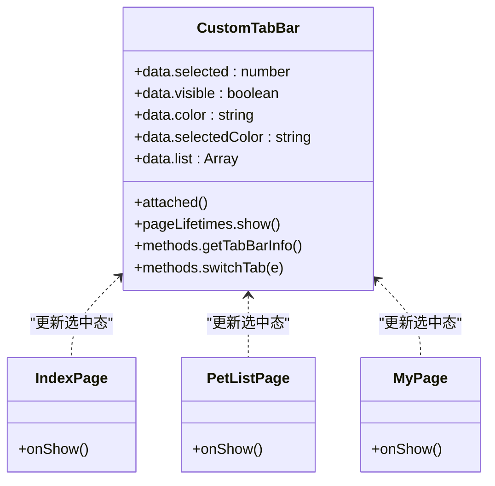
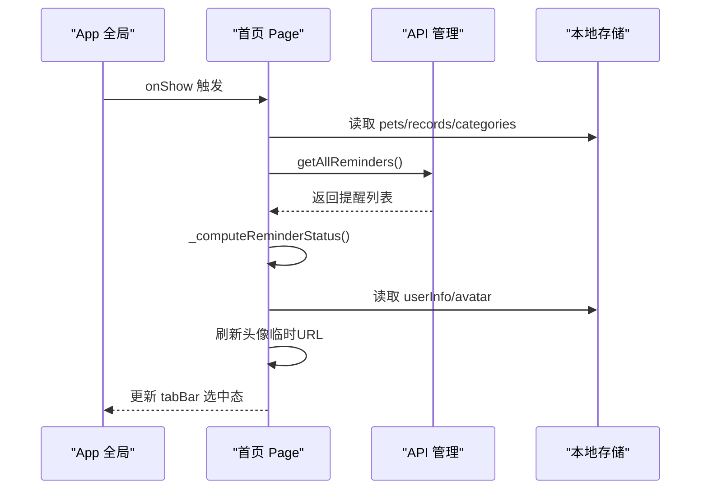
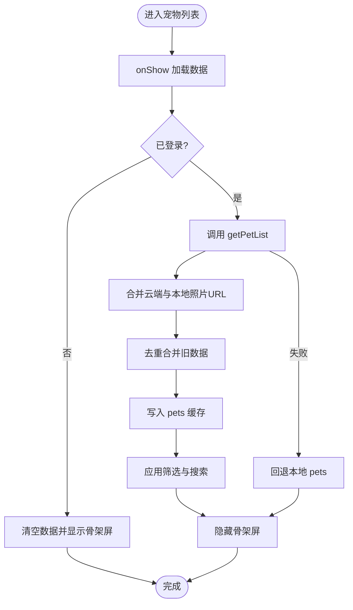
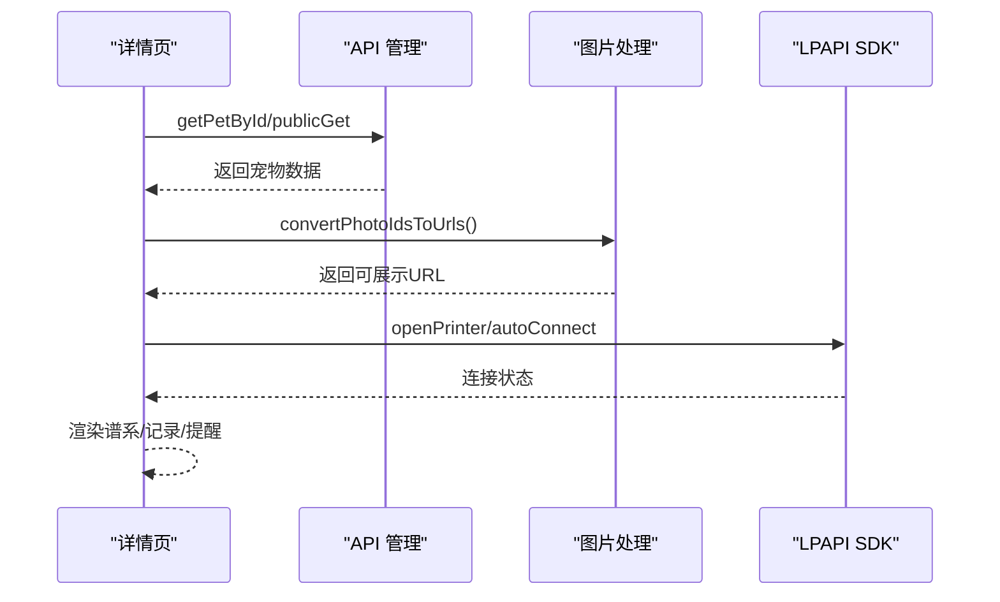
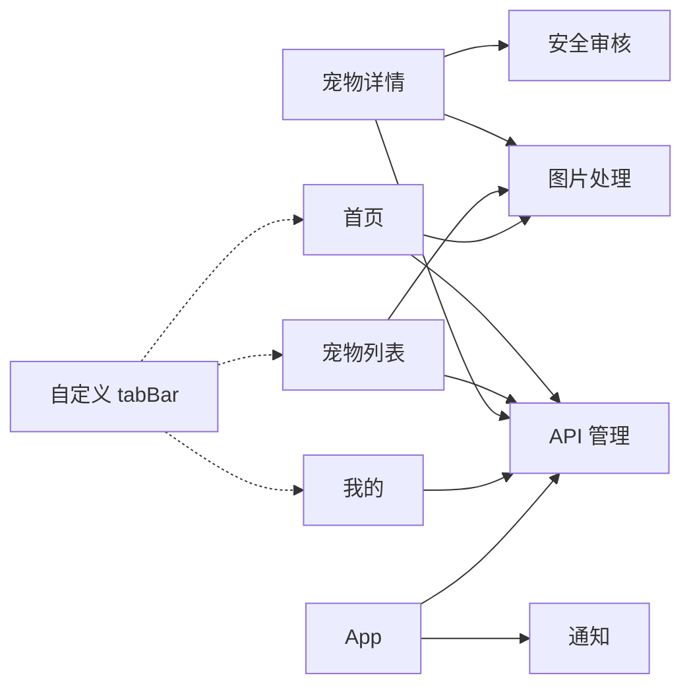

# 前端页面架构

<cite>
**本文引用的文件**
- [miniprogram/app.js](file://miniprogram/app.js)
- [miniprogram/app.json](file://miniprogram/app.json)
- [miniprogram/custom-tab-bar/index.js](file://miniprogram/custom-tab-bar/index.js)
- [miniprogram/custom-tab-bar/index.json](file://miniprogram/custom-tab-bar/index.json)
- [miniprogram/pages/index/index.js](file://miniprogram/pages/index/index.js)
- [miniprogram/pages/pet/index.js](file://miniprogram/pages/pet/index.js)
- [miniprogram/pages/pet/detail.js](file://miniprogram/pages/pet/detail.js)
- [miniprogram/pages/my/index.js](file://miniprogram/pages/my/index.js)
- [miniprogram/utils/api.js](file://miniprogram/utils/api.js)
- [miniprogram/utils/cache.js](file://miniprogram/utils/cache.js)
- [miniprogram/utils/error.js](file://miniprogram/utils/error.js)
- [miniprogram/utils/image.js](file://miniprogram/utils/image.js)
- [miniprogram/utils/notification.js](file://miniprogram/utils/notification.js)
- [miniprogram/utils/securityChecker.js](file://miniprogram/utils/securityChecker.js)
- [miniprogram/styles/design.wxss](file://miniprogram/styles/design.wxss)
- [miniprogram/app.wxss](file://miniprogram/app.wxss)
</cite>

## 目录
1. [引言](#引言)
2. [项目结构](#项目结构)
3. [核心组件](#核心组件)
4. [架构总览](#架构总览)
5. [详细组件分析](#详细组件分析)
6. [依赖分析](#依赖分析)
7. [性能考虑](#性能考虑)
8. [故障排查指南](#故障排查指南)
9. [结论](#结论)
10. [附录](#附录)

## 引言
本文件面向“养龟档案”小程序前端页面架构，系统梳理其页面设计模式、组件化架构、状态管理机制、路由与导航策略、页面间数据传递、自定义 tabBar 实现、布局与响应式设计、生命周期与数据绑定策略、用户交互处理最佳实践、性能优化与内存管理、渲染优化方法，以及小程序特有的 WXML/WXSS 语法与组件系统。文档同时提供扩展开发指导原则与代码规范建议。

## 项目结构
项目采用分包（subpackages）组织方式，主包包含基础页面与全局配置，子包按功能域划分（管理后台 subpkg-admin、工具 subpkg-tools、报表 subpkg-report）。自定义 tabBar 作为独立组件集成于主包。

图表来源
- [miniprogram/app.json:1-74](file://miniprogram/app.json#L1-L74)
- [miniprogram/app.js:1-312](file://miniprogram/app.js#L1-L312)
- [miniprogram/custom-tab-bar/index.js:1-72](file://miniprogram/custom-tab-bar/index.js#L1-L72)

章节来源
- [miniprogram/app.json:1-74](file://miniprogram/app.json#L1-L74)
- [miniprogram/app.js:1-312](file://miniprogram/app.js#L1-L312)

## 核心组件
- 应用生命周期与全局状态：App 初始化、云开发初始化、系统配置加载、登录态管理、二维码生成、通知检查、登出与页面跳转。
- 自定义 tabBar：基于 Component 的自定义组件，负责选中态与可见性控制、路由切换。
- 页面层：首页、宠物列表、宠物详情、我的页面，均采用 Page 架构，结合工具模块完成数据加载、状态管理与交互。
- 工具模块：API 管理（云函数封装）、缓存管理、错误提示、图片处理（云存储 URL 转换）、安全审核、通知管理。
- 样式系统：全局样式与设计令牌，提供主题变量、工具类与动画。

章节来源
- [miniprogram/app.js:1-312](file://miniprogram/app.js#L1-L312)
- [miniprogram/custom-tab-bar/index.js:1-72](file://miniprogram/custom-tab-bar/index.js#L1-L72)
- [miniprogram/utils/api.js:1-208](file://miniprogram/utils/api.js#L1-L208)
- [miniprogram/utils/cache.js:1-121](file://miniprogram/utils/cache.js#L1-L121)
- [miniprogram/utils/error.js:1-92](file://miniprogram/utils/error.js#L1-L92)
- [miniprogram/utils/image.js:1-170](file://miniprogram/utils/image.js#L1-L170)
- [miniprogram/utils/notification.js:1-146](file://miniprogram/utils/notification.js#L1-L146)
- [miniprogram/utils/securityChecker.js:1-122](file://miniprogram/utils/securityChecker.js#L1-L122)
- [miniprogram/styles/design.wxss:1-196](file://miniprogram/styles/design.wxss#L1-L196)
- [miniprogram/app.wxss:1-223](file://miniprogram/app.wxss#L1-L223)

## 架构总览
整体采用“页面 + 组件 + 工具模块”的分层架构，页面通过工具模块与云函数交互，状态通过 App 全局状态与本地缓存协同管理，自定义 tabBar 统一处理底部导航。

图表来源
- [miniprogram/pages/index/index.js:1-477](file://miniprogram/pages/index/index.js#L1-L477)
- [miniprogram/pages/pet/index.js:1-800](file://miniprogram/pages/pet/index.js#L1-L800)
- [miniprogram/pages/pet/detail.js:1-800](file://miniprogram/pages/pet/detail.js#L1-L800)
- [miniprogram/pages/my/index.js:1-800](file://miniprogram/pages/my/index.js#L1-L800)
- [miniprogram/custom-tab-bar/index.js:1-72](file://miniprogram/custom-tab-bar/index.js#L1-L72)
- [miniprogram/utils/api.js:1-208](file://miniprogram/utils/api.js#L1-L208)
- [miniprogram/utils/image.js:1-170](file://miniprogram/utils/image.js#L1-L170)
- [miniprogram/utils/securityChecker.js:1-122](file://miniprogram/utils/securityChecker.js#L1-L122)
- [miniprogram/utils/notification.js:1-146](file://miniprogram/utils/notification.js#L1-L146)
- [miniprogram/utils/error.js:1-92](file://miniprogram/utils/error.js#L1-L92)
- [miniprogram/utils/cache.js:1-121](file://miniprogram/utils/cache.js#L1-L121)
- [miniprogram/app.js:1-312](file://miniprogram/app.js#L1-L312)
- [miniprogram/app.json:1-74](file://miniprogram/app.json#L1-L74)

## 详细组件分析

### 自定义 tabBar 组件
- 设计目标：替代系统 tabBar，实现与页面路由联动、选中态与可见性控制。
- 关键点：
  - 通过 getCurrentPages 获取当前路由，匹配 list 中的 pagePath，设置 selected 或隐藏。
  - switchTab 调用 wx.switchTab，避免重复跳转。
  - 二次初始化延时获取，提升稳定性。
- 与页面协作：各页面 onShow 中主动更新 tabBar 可见性与选中态，确保一致性。

图表来源
- [miniprogram/custom-tab-bar/index.js:1-72](file://miniprogram/custom-tab-bar/index.js#L1-L72)
- [miniprogram/pages/index/index.js:48-79](file://miniprogram/pages/index/index.js#L48-L79)
- [miniprogram/pages/pet/index.js:97-139](file://miniprogram/pages/pet/index.js#L97-L139)
- [miniprogram/pages/my/index.js:123-157](file://miniprogram/pages/my/index.js#L123-L157)

章节来源
- [miniprogram/custom-tab-bar/index.js:1-72](file://miniprogram/custom-tab-bar/index.js#L1-L72)
- [miniprogram/custom-tab-bar/index.json:1-3](file://miniprogram/custom-tab-bar/index.json#L1-L3)
- [miniprogram/pages/index/index.js:48-79](file://miniprogram/pages/index/index.js#L48-L79)
- [miniprogram/pages/pet/index.js:97-139](file://miniprogram/pages/pet/index.js#L97-L139)
- [miniprogram/pages/my/index.js:123-157](file://miniprogram/pages/my/index.js#L123-L157)

### 首页页面（数据聚合与提醒）
- 数据来源：本地缓存（pets、records、categories 等）与云函数（提醒、统计、精选宠物）。
- 预加载策略：App 在 loading 页完成后，将数据注入 App.globalData，首页 onShow 中一次性应用，减少重复请求。
- 提醒计算：统一状态计算逻辑，按“超期/今天/明天”排序，支持“已完成”状态与周期推进。
- 用户头像刷新：针对云存储临时 URL 过期问题，提供刷新与错误兜底。
- 导航：跳转宠物列表、计算器、报表、公开档案等。

图表来源
- [miniprogram/pages/index/index.js:48-79](file://miniprogram/pages/index/index.js#L48-L79)
- [miniprogram/pages/index/index.js:259-331](file://miniprogram/pages/index/index.js#L259-L331)
- [miniprogram/utils/api.js:101-123](file://miniprogram/utils/api.js#L101-L123)
- [miniprogram/utils/image.js:119-133](file://miniprogram/utils/image.js#L119-L133)

章节来源
- [miniprogram/pages/index/index.js:1-477](file://miniprogram/pages/index/index.js#L1-L477)
- [miniprogram/utils/api.js:1-208](file://miniprogram/utils/api.js#L1-L208)
- [miniprogram/utils/image.js:1-170](file://miniprogram/utils/image.js#L1-L170)

### 宠物列表页面（分页、过滤、骨架屏）
- 分页与去重：支持分页加载，合并新旧数据并去重；并发请求序列号防覆盖。
- 过滤与搜索：分类/性别/状态三类筛选，支持别名/名称/编号搜索。
- 骨架屏：最小展示时长保障，避免闪烁；onHide 提前设置骨架屏。
- 云端回退：云函数失败时回退本地数据，保证可用性。
- 状态计算：基于记录计算动态状态（正常/待配/预警/出售/死亡）。

图表来源
- [miniprogram/pages/pet/index.js:199-338](file://miniprogram/pages/pet/index.js#L199-L338)
- [miniprogram/pages/pet/index.js:344-370](file://miniprogram/pages/pet/index.js#L344-L370)
- [miniprogram/pages/pet/index.js:400-475](file://miniprogram/pages/pet/index.js#L400-L475)

章节来源
- [miniprogram/pages/pet/index.js:1-800](file://miniprogram/pages/pet/index.js#L1-L800)
- [miniprogram/utils/image.js:38-57](file://miniprogram/utils/image.js#L38-L57)

### 宠物详情页面（谱系、记录、提醒、打印）
- 数据加载顺序：公开/私有模式切换、本地回退、谱系加载、记录与提醒加载。
- 图片处理：支持 cloud:// 与临时 URL 转换，错误时刷新或清空占位。
- 打印机集成：德佟 LPAPI SDK，自动连接与断开，支持 BLE 连接失败计数。
- 分享：支持分享卡片与朋友圈分享，支持 timeline。
- 权限与只读：扫码进入模式验证所有权，非创建者限制编辑。

图表来源
- [miniprogram/pages/pet/detail.js:420-459](file://miniprogram/pages/pet/detail.js#L420-L459)
- [miniprogram/utils/image.js:115-126](file://miniprogram/utils/image.js#L115-L126)
- [miniprogram/pages/pet/detail.js:256-295](file://miniprogram/pages/pet/detail.js#L256-L295)

章节来源
- [miniprogram/pages/pet/detail.js:1-800](file://miniprogram/pages/pet/detail.js#L1-L800)
- [miniprogram/utils/image.js:1-170](file://miniprogram/utils/image.js#L1-L170)

### 我的页面（统计、分享、打印配置）
- 统计数据：本地快速展示 + 云端精确数据静默更新。
- 分享卡片：封面、标签、物种图、环境图等，支持生成分享图并保存相册。
- 打印配置：云端用户配置优先，本地存储作为后备；支持自动连接与失败计数。
- 系统配置：从云函数读取，失败时回退本地存储。
- 回收站与最近浏览：维护用户行为数据。

章节来源
- [miniprogram/pages/my/index.js:1-800](file://miniprogram/pages/my/index.js#L1-L800)
- [miniprogram/utils/theme.js:1-800](file://miniprogram/utils/theme.js#L1-L800)

### API 管理（云函数封装）
- 统一封装 wx.cloud.callFunction，统一返回结构（success/data/message），网络异常时标记 cloudAvailable=false。
- 宠物、记录、提醒、足迹、登录、图片上传等接口统一管理。
- 图片上传后异步触发安全审核，避免阻塞主流程。

章节来源
- [miniprogram/utils/api.js:1-208](file://miniprogram/utils/api.js#L1-L208)

### 缓存管理
- 前缀 + 过期时间策略，支持清理过期缓存与批量清理。
- 存储满错误兜底重试，保证数据持久化。

章节来源
- [miniprogram/utils/cache.js:1-121](file://miniprogram/utils/cache.js#L1-L121)

### 错误与通知
- 错误提示：统一 toast 展示，支持确认对话框。
- 审核通知：定时检查未读通知，弹窗展示并标记已读；超时待审记录提示。

章节来源
- [miniprogram/utils/error.js:1-92](file://miniprogram/utils/error.js#L1-L92)
- [miniprogram/utils/notification.js:1-146](file://miniprogram/utils/notification.js#L1-L146)

### 图片处理与安全审核
- URL 转换：cloud:// 与临时 URL 相互转换，提取 fileID。
- 图片净化：将临时 URL 转为 cloud://fileID，确保存入缓存的数据不过期。
- 安全审核：异步提交审核，同步等待结果，服务不可用时放行。

章节来源
- [miniprogram/utils/image.js:1-170](file://miniprogram/utils/image.js#L1-L170)
- [miniprogram/utils/securityChecker.js:1-122](file://miniprogram/utils/securityChecker.js#L1-L122)

## 依赖分析
- 页面对工具模块的依赖：API、图片、缓存、错误、通知、安全审核。
- 自定义 tabBar 与页面的耦合：通过路由匹配与 setData 协同，降低直接依赖。
- 分包依赖：子包页面通过相对路径 navigateTo/navigateBack，避免主包循环依赖。

图表来源
- [miniprogram/pages/index/index.js:1-477](file://miniprogram/pages/index/index.js#L1-L477)
- [miniprogram/pages/pet/index.js:1-800](file://miniprogram/pages/pet/index.js#L1-L800)
- [miniprogram/pages/pet/detail.js:1-800](file://miniprogram/pages/pet/detail.js#L1-L800)
- [miniprogram/pages/my/index.js:1-800](file://miniprogram/pages/my/index.js#L1-L800)
- [miniprogram/utils/api.js:1-208](file://miniprogram/utils/api.js#L1-L208)
- [miniprogram/utils/image.js:1-170](file://miniprogram/utils/image.js#L1-L170)
- [miniprogram/utils/securityChecker.js:1-122](file://miniprogram/utils/securityChecker.js#L1-L122)
- [miniprogram/utils/notification.js:1-146](file://miniprogram/utils/notification.js#L1-L146)
- [miniprogram/app.js:1-312](file://miniprogram/app.js#L1-L312)
- [miniprogram/custom-tab-bar/index.js:1-72](file://miniprogram/custom-tab-bar/index.js#L1-L72)

章节来源
- [miniprogram/utils/api.js:1-208](file://miniprogram/utils/api.js#L1-L208)
- [miniprogram/utils/image.js:1-170](file://miniprogram/utils/image.js#L1-L170)
- [miniprogram/utils/securityChecker.js:1-122](file://miniprogram/utils/securityChecker.js#L1-L122)
- [miniprogram/utils/notification.js:1-146](file://miniprogram/utils/notification.js#L1-L146)
- [miniprogram/app.js:1-312](file://miniprogram/app.js#L1-L312)
- [miniprogram/custom-tab-bar/index.js:1-72](file://miniprogram/custom-tab-bar/index.js#L1-L72)

## 性能考虑
- 预加载与骨架屏：首页与我的页面在 loading 页完成后一次性应用预加载数据，配合骨架屏提升感知性能。
- 请求去重与并发控制：分页加载使用序列号防过期，首页提醒加载使用 Promise.all 并行请求。
- 图片优化：云端图片统一转换为临时 URL，避免过期；缓存净化仅保存 cloud://fileID，减少无效请求。
- 云函数失败回退：宠物列表与我的页面在云函数失败时回退本地数据，保证可用性。
- 内存管理：tabBar 在 onHide 中提前设置骨架屏，避免频繁重建；图片错误时及时清理与占位。
- 渲染优化：WXML 中尽量使用数据绑定与条件渲染，减少不必要的节点更新；使用工具类与主题变量统一样式，减少重复计算。

## 故障排查指南
- 登录态异常：检查 App.initLocalData 与 asyncLogin 流程，确认 openid 与 userInfo 缓存。
- 二维码生成失败：检查云函数 qrcode 调用与 fileID 存储，确认 page 与 scene 参数正确。
- 图片加载失败：检查 convertSinglePhoto 与 getTempUrl，确认 cloud:// 与临时 URL 转换逻辑。
- 通知未显示：检查 NotificationManager.getUnreadNotifications 节流与标记已读逻辑。
- 打印机连接失败：查看 autoConnect 与 connectFailCount，确认蓝牙适配器初始化与设备信息。

章节来源
- [miniprogram/app.js:60-140](file://miniprogram/app.js#L60-L140)
- [miniprogram/app.js:142-174](file://miniprogram/app.js#L142-L174)
- [miniprogram/utils/image.js:87-108](file://miniprogram/utils/image.js#L87-L108)
- [miniprogram/utils/notification.js:41-54](file://miniprogram/utils/notification.js#L41-L54)
- [miniprogram/pages/pet/detail.js:256-295](file://miniprogram/pages/pet/detail.js#L256-L295)

## 结论
本项目采用清晰的分层架构与自定义组件，结合工具模块实现稳定的云函数交互与数据处理。通过预加载、骨架屏、并发控制与回退策略，兼顾用户体验与性能。自定义 tabBar 与页面生命周期协同，确保导航一致性。建议在扩展开发中遵循统一的工具模块使用规范、状态管理策略与样式体系，持续优化渲染与内存占用。

## 附录

### 页面生命周期与数据绑定策略
- 页面生命周期：onLoad（初始化）、onShow（数据刷新）、onHide（状态收敛）、onUnload（资源释放）。
- 数据绑定：优先使用 setData 与局部更新，避免全量替换；复杂对象使用浅拷贝更新字段。
- 预加载与懒加载：首页与我的页面采用预加载 + 骨架屏策略；列表页采用分页与去重策略。

章节来源
- [miniprogram/pages/index/index.js:26-79](file://miniprogram/pages/index/index.js#L26-L79)
- [miniprogram/pages/pet/index.js:85-139](file://miniprogram/pages/pet/index.js#L85-L139)
- [miniprogram/pages/my/index.js:97-157](file://miniprogram/pages/my/index.js#L97-L157)

### 用户交互处理最佳实践
- 统一错误与成功提示：使用 error.js 的 showError/showSuccess。
- 确认对话框：使用 showConfirm，避免误操作。
- 加载状态：使用 showLoading/hideLoading，避免长时间无反馈。
- 分享与预览：统一使用 wx.showShareMenu、wx.shareAppMessage、wx.previewImage。

章节来源
- [miniprogram/utils/error.js:1-92](file://miniprogram/utils/error.js#L1-L92)
- [miniprogram/pages/pet/detail.js:352-403](file://miniprogram/pages/pet/detail.js#L352-L403)
- [miniprogram/pages/my/index.js:437-446](file://miniprogram/pages/my/index.js#L437-L446)

### 小程序 WXML/WXSS 语法与组件系统要点
- WXML：使用模板语法与数据绑定，条件渲染与列表渲染，事件绑定与数据集 dataset。
- WXSS：支持样式模块化与主题变量，使用 rpx 单位适配多设备，动画与过渡效果。
- 组件系统：自定义组件通过 json 声明，支持属性、方法与生命周期，与页面解耦。

章节来源
- [miniprogram/custom-tab-bar/index.json:1-3](file://miniprogram/custom-tab-bar/index.json#L1-L3)
- [miniprogram/styles/design.wxss:1-196](file://miniprogram/styles/design.wxss#L1-L196)
- [miniprogram/app.wxss:1-223](file://miniprogram/app.wxss#L1-L223)

### 页面扩展开发指导原则与代码规范
- 统一工具模块：API、图片、缓存、错误、通知、安全审核均通过对应模块封装。
- 状态管理：App 全局状态与本地缓存双轨，页面 onShow 中统一刷新。
- 路由与导航：使用 wx.switchTab/navigateTo/navigateBack，避免硬编码路径。
- 样式规范：使用 design.wxss 主题变量与工具类，避免内联样式。
- 性能优化：骨架屏、预加载、并发请求、去重与回退策略。
- 可靠性：云函数失败回退、图片错误兜底、通知与审核服务降级。

章节来源
- [miniprogram/utils/api.js:1-208](file://miniprogram/utils/api.js#L1-L208)
- [miniprogram/utils/cache.js:1-121](file://miniprogram/utils/cache.js#L1-L121)
- [miniprogram/utils/error.js:1-92](file://miniprogram/utils/error.js#L1-L92)
- [miniprogram/utils/notification.js:1-146](file://miniprogram/utils/notification.js#L1-L146)
- [miniprogram/utils/securityChecker.js:1-122](file://miniprogram/utils/securityChecker.js#L1-L122)
- [miniprogram/styles/design.wxss:1-196](file://miniprogram/styles/design.wxss#L1-L196)
- [miniprogram/app.wxss:1-223](file://miniprogram/app.wxss#L1-L223)