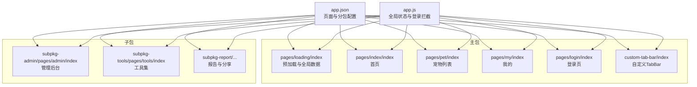
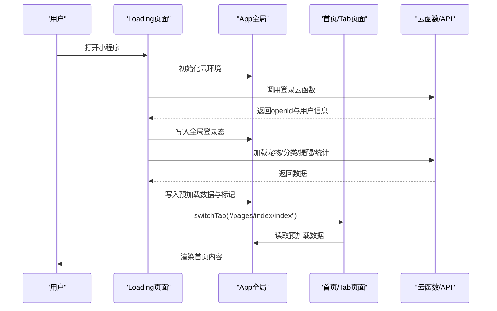
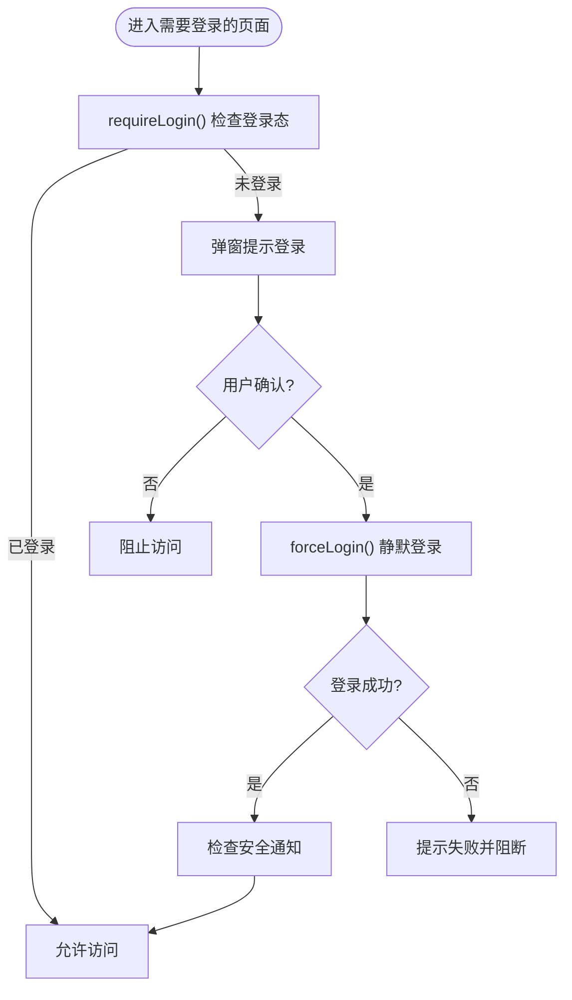
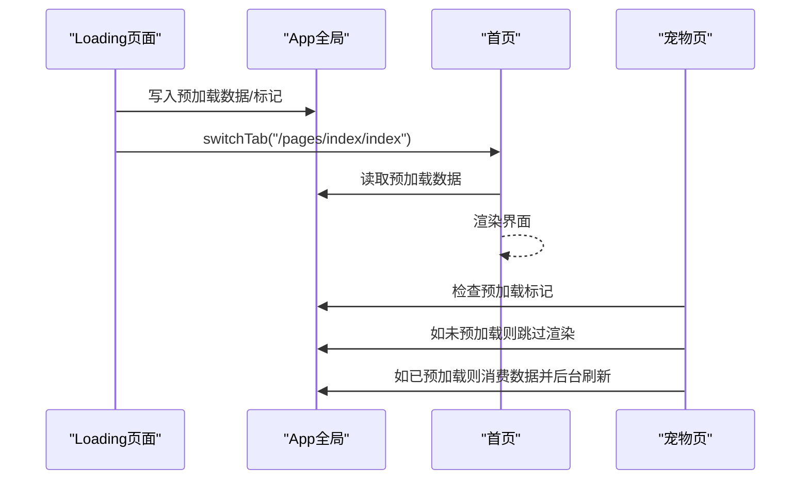
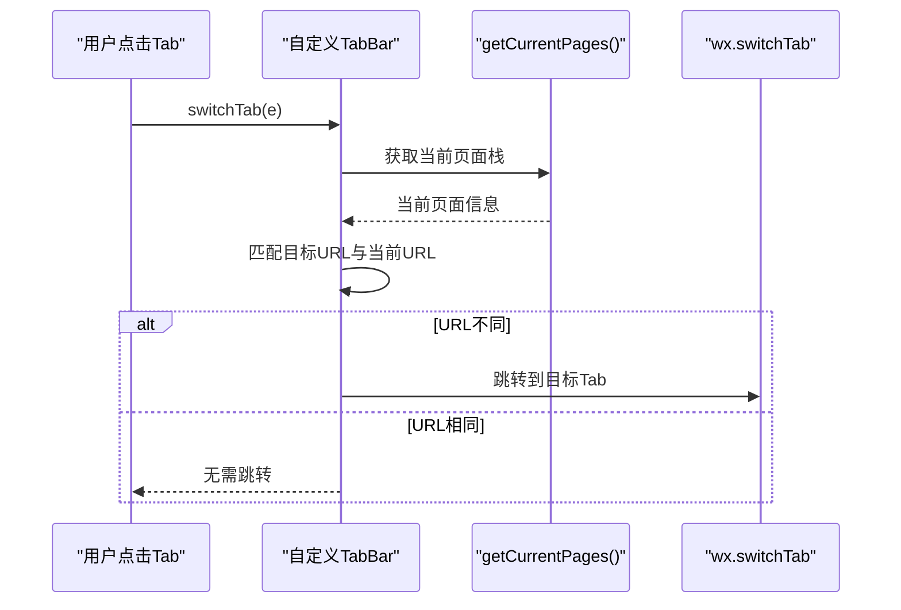
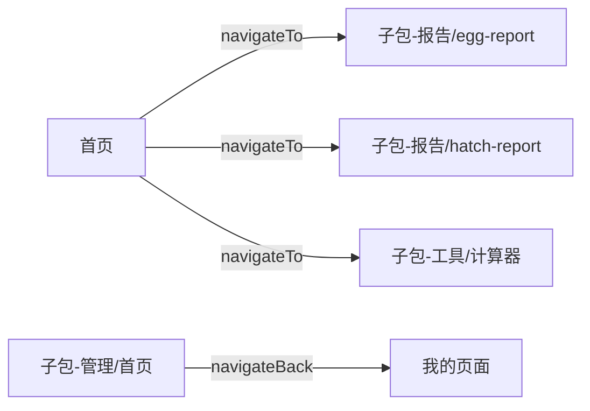
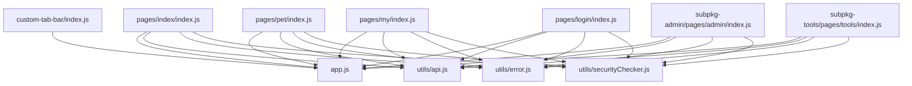

# 导航与路由系统

<cite>
**本文档引用的文件**
- [miniprogram/app.js](file://miniprogram/app.js)
- [miniprogram/app.json](file://miniprogram/app.json)
- [miniprogram/pages/index/index.js](file://miniprogram/pages/index/index.js)
- [miniprogram/pages/login/index.js](file://miniprogram/pages/login/index.js)
- [miniprogram/custom-tab-bar/index.js](file://miniprogram/custom-tab-bar/index.js)
- [miniprogram/utils/api.js](file://miniprogram/utils/api.js)
- [miniprogram/pages/pet/index.js](file://miniprogram/pages/pet/index.js)
- [miniprogram/pages/my/index.js](file://miniprogram/pages/my/index.js)
- [miniprogram/subpkg-admin/pages/admin/index.js](file://miniprogram/subpkg-admin/pages/admin/index.js)
- [miniprogram/subpkg-tools/pages/tools/index.js](file://miniprogram/subpkg-tools/pages/tools/index.js)
- [miniprogram/pages/loading/index.js](file://miniprogram/pages/loading/index.js)
- [miniprogram/utils/error.js](file://miniprogram/utils/error.js)
- [miniprogram/utils/securityChecker.js](file://miniprogram/utils/securityChecker.js)
- [miniprogram/utils/cache.js](file://miniprogram/utils/cache.js)
</cite>

## 目录
1. [引言](#引言)
2. [项目结构](#项目结构)
3. [核心组件](#核心组件)
4. [架构总览](#架构总览)
5. [详细组件分析](#详细组件分析)
6. [依赖关系分析](#依赖关系分析)
7. [性能考量](#性能考量)
8. [故障排查指南](#故障排查指南)
9. [结论](#结论)
10. [附录](#附录)

## 引言
本文件系统化梳理“养龟档案”小程序的导航与路由体系，围绕页面栈管理、分包加载、页面预加载、路由参数传递、返回处理与拦截机制展开，结合实际代码实现给出最佳实践、性能优化建议与调试排障方法，帮助开发者在复杂业务场景下构建稳定、高效且体验友好的导航系统。

## 项目结构
小程序采用分包策略组织页面，主包包含基础入口与核心页面，子包按功能域划分，降低首屏体积并提升加载效率。路由配置集中于应用级配置文件，自定义 TabBar 组件负责底部导航状态同步与跳转。

**图表来源**
- [miniprogram/app.json:1-74](file://miniprogram/app.json#L1-L74)
- [miniprogram/app.js:1-312](file://miniprogram/app.js#L1-L312)

**章节来源**
- [miniprogram/app.json:1-74](file://miniprogram/app.json#L1-L74)
- [miniprogram/app.js:1-312](file://miniprogram/app.js#L1-L312)

## 核心组件
- 应用生命周期与全局状态
  - 登录态管理、静默登录、强制登录、登出与拦截
  - 全局数据预加载标记与预加载数据缓存
- 自定义 TabBar
  - 基于页面栈识别当前路由，自动高亮对应 Tab
  - 触发 switchTab 跳转，避免重复跳转
- 预加载与分包
  - Loading 页面串行/并行加载关键数据，填充全局预加载区
  - 首次进入时，Tab 页面直接消费预加载数据，减少白屏
- 分包与页面栈
  - 主包与子包页面独立加载，跨包跳转使用相对根路径
  - navigateBack 支持跨包返回，必要时回退到 Tab 页面

**章节来源**
- [miniprogram/app.js:176-256](file://miniprogram/app.js#L176-L256)
- [miniprogram/custom-tab-bar/index.js:32-69](file://miniprogram/custom-tab-bar/index.js#L32-L69)
- [miniprogram/pages/loading/index.js:15-43](file://miniprogram/pages/loading/index.js#L15-L43)
- [miniprogram/pages/pet/index.js:97-139](file://miniprogram/pages/pet/index.js#L97-L139)

## 架构总览
下图展示从启动到首页渲染的关键流程，以及登录拦截与分包加载的关系。

**图表来源**
- [miniprogram/pages/loading/index.js:15-43](file://miniprogram/pages/loading/index.js#L15-L43)
- [miniprogram/app.js:84-140](file://miniprogram/app.js#L84-L140)
- [miniprogram/pages/index/index.js:48-79](file://miniprogram/pages/index/index.js#L48-L79)

## 详细组件分析

### 登录拦截与导航策略
- 登录拦截
  - 在需要登录的页面调用全局 requireLogin，未登录时弹窗提示，点击确认触发强制登录
  - 强制登录通过云函数获取 openid，成功后写入全局状态并触发安全通知检查
- 登出策略
  - 调用 reLaunch 回到宠物列表页，失败时降级为 Toast 提示
- 登录页策略
  - 首次进入尝试静默登录，若本地已同意协议则直接登录
  - 用户手动点击登录时，校验协议勾选后再发起登录流程

**图表来源**
- [miniprogram/app.js:176-225](file://miniprogram/app.js#L176-L225)
- [miniprogram/pages/login/index.js:89-154](file://miniprogram/pages/login/index.js#L89-L154)

**章节来源**
- [miniprogram/app.js:176-256](file://miniprogram/app.js#L176-L256)
- [miniprogram/pages/login/index.js:16-87](file://miniprogram/pages/login/index.js#L16-L87)

### 预加载与页面栈协同
- 预加载流程
  - Loading 页面串行加载云数据，填充全局预加载区（宠物、提醒、统计、二维码等）
  - 完成后设置全局 dataPreloaded 标记，随后 switchTab 到首页
- Tab 页面消费预加载
  - 首次进入且已预加载时，直接使用全局预加载数据，后台静默刷新
  - 避免 Tab 预创建导致的空数据覆盖与闪烁
- 骨架屏策略
  - Tab 页面 onHide 前置骨架屏，确保再次显示时渲染更友好

**图表来源**
- [miniprogram/pages/loading/index.js:45-74](file://miniprogram/pages/loading/index.js#L45-L74)
- [miniprogram/pages/index/index.js:34-69](file://miniprogram/pages/index/index.js#L34-L69)
- [miniprogram/pages/pet/index.js:111-139](file://miniprogram/pages/pet/index.js#L111-L139)

**章节来源**
- [miniprogram/pages/loading/index.js:15-84](file://miniprogram/pages/loading/index.js#L15-L84)
- [miniprogram/pages/index/index.js:34-79](file://miniprogram/pages/index/index.js#L34-L79)
- [miniprogram/pages/pet/index.js:97-154](file://miniprogram/pages/pet/index.js#L97-L154)

### 自定义 TabBar 与路由联动
- 路由识别
  - 通过 getCurrentPages 获取当前页面，匹配自定义 TabBar 的 list，设置选中与可见状态
- 切换逻辑
  - 当目标 URL 与当前 URL 不一致时，调用 wx.switchTab 跳转
  - 避免重复跳转与状态抖动

**图表来源**
- [miniprogram/custom-tab-bar/index.js:32-69](file://miniprogram/custom-tab-bar/index.js#L32-L69)

**章节来源**
- [miniprogram/custom-tab-bar/index.js:1-72](file://miniprogram/custom-tab-bar/index.js#L1-L72)

### 分包加载与跨包导航
- 分包配置
  - app.json 中声明 subpackages，按功能域拆分 admin、tools、report
- 跨包跳转
  - 使用相对根路径（如 "/subpkg-admin/pages/admin/index"）进行跳转
  - 管理后台页在返回时优先 navigateBack，失败则回退到我的页面
- 工具页与报告页
  - 工具页提供计算器、3D 龟缸等入口，均通过 navigateTo 跳转到子包页面

**图表来源**
- [miniprogram/app.json:11-40](file://miniprogram/app.json#L11-L40)
- [miniprogram/pages/index/index.js:398-422](file://miniprogram/pages/index/index.js#L398-L422)
- [miniprogram/subpkg-admin/pages/admin/index.js:102-121](file://miniprogram/subpkg-admin/pages/admin/index.js#L102-L121)
- [miniprogram/subpkg-tools/pages/tools/index.js:33-43](file://miniprogram/subpkg-tools/pages/tools/index.js#L33-L43)

**章节来源**
- [miniprogram/app.json:11-40](file://miniprogram/app.json#L11-L40)
- [miniprogram/subpkg-admin/pages/admin/index.js:97-121](file://miniprogram/subpkg-admin/pages/admin/index.js#L97-L121)
- [miniprogram/subpkg-tools/pages/tools/index.js:1-44](file://miniprogram/subpkg-tools/pages/tools/index.js#L1-L44)

### 页面跳转方式与使用场景
- navigateTo
  - 用于在当前页面栈上新增一层，适合子包内部或非 Tab 页面跳转
  - 示例：首页跳转到报告、工具页；宠物页扫码跳转详情
- redirectTo
  - 替换当前页面，适合一次性跳转且不需要返回的场景
  - 项目中未见显式使用，建议谨慎使用以免破坏页面栈
- switchTab
  - 仅用于跳转到已声明为 Tab 的页面，避免重复创建
  - 示例：Loading 完成后跳转首页；自定义 TabBar 触发跳转
- navigateBack
  - 返回上一页或多页，支持跨包返回
  - 示例：管理后台返回时优先 navigateBack，失败回退到 Tab 页面

**章节来源**
- [miniprogram/pages/index/index.js:383-422](file://miniprogram/pages/index/index.js#L383-L422)
- [miniprogram/pages/pet/index.js:529-581](file://miniprogram/pages/pet/index.js#L529-L581)
- [miniprogram/subpkg-admin/pages/admin/index.js:102-109](file://miniprogram/subpkg-admin/pages/admin/index.js#L102-L109)

### 路由参数传递与返回处理
- 参数传递
  - 通过 url 查询参数传递简单数据（如 petId、userId）
  - 登录页在未登录时通过 navigateBack 返回，若无可返回页面则 switchTab 到宠物页
- 返回处理
  - 管理后台返回时优先 navigateBack，失败则回退到我的页面
  - 首页与我的页面在 onShow 中统一刷新数据，避免重复加载

**章节来源**
- [miniprogram/pages/index/index.js:414-422](file://miniprogram/pages/index/index.js#L414-L422)
- [miniprogram/pages/login/index.js:303-321](file://miniprogram/pages/login/index.js#L303-L321)
- [miniprogram/subpkg-admin/pages/admin/index.js:102-109](file://miniprogram/subpkg-admin/pages/admin/index.js#L102-L109)

### 导航拦截机制与安全策略
- 内容安全
  - 图片上传后异步触发安全审核，失败不影响主流程
  - 文本审核在服务不可用时放行，保障基本可用性
- API 统一错误处理
  - APIManager 对云函数调用失败进行降级处理，返回 useFallback 标识
  - 错误提示通过统一工具函数展示，避免分散处理

**章节来源**
- [miniprogram/utils/securityChecker.js:43-92](file://miniprogram/utils/securityChecker.js#L43-L92)
- [miniprogram/utils/api.js:12-38](file://miniprogram/utils/api.js#L12-L38)
- [miniprogram/utils/error.js:27-34](file://miniprogram/utils/error.js#L27-L34)

## 依赖关系分析
- 页面到全局
  - 首页、宠物页、我的页在 onShow 中读取 App 全局状态与预加载数据
- 页面到工具
  - 统一使用 APIManager 调用云函数，错误处理与安全审核通过工具模块封装
- 页面到分包
  - 通过相对根路径跳转，避免硬编码页面路径

**图表来源**
- [miniprogram/pages/index/index.js:1-10](file://miniprogram/pages/index/index.js#L1-L10)
- [miniprogram/pages/pet/index.js:1-10](file://miniprogram/pages/pet/index.js#L1-L10)
- [miniprogram/pages/my/index.js:1-12](file://miniprogram/pages/my/index.js#L1-L12)
- [miniprogram/pages/login/index.js:1-14](file://miniprogram/pages/login/index.js#L1-L14)
- [miniprogram/custom-tab-bar/index.js:1-12](file://miniprogram/custom-tab-bar/index.js#L1-L12)
- [miniprogram/subpkg-admin/pages/admin/index.js:1-16](file://miniprogram/subpkg-admin/pages/admin/index.js#L1-L16)
- [miniprogram/subpkg-tools/pages/tools/index.js:1-6](file://miniprogram/subpkg-tools/pages/tools/index.js#L1-L6)
- [miniprogram/utils/api.js:1-10](file://miniprogram/utils/api.js#L1-L10)
- [miniprogram/utils/error.js:1-10](file://miniprogram/utils/error.js#L1-L10)
- [miniprogram/utils/securityChecker.js:1-12](file://miniprogram/utils/securityChecker.js#L1-L12)

**章节来源**
- [miniprogram/app.js:292-310](file://miniprogram/app.js#L292-L310)
- [miniprogram/utils/api.js:1-208](file://miniprogram/utils/api.js#L1-L208)

## 性能考量
- 骨架屏与首屏体验
  - Tab 页面在 onHide 前置骨架屏，确保再次显示时渲染更顺滑
  - 首屏通过 Loading 页面预加载关键数据，避免白屏与闪烁
- 并发与幂等
  - API 请求携带序列号，丢弃过期响应，避免竞态导致的旧数据覆盖
  - 预加载完成后标记 dataPreloaded，Tab 页面直接消费，减少重复请求
- 缓存与降级
  - 本地缓存优先，云端失败时回退本地数据
  - 安全审核服务不可用时放行，保障基本功能可用

**章节来源**
- [miniprogram/pages/pet/index.js:141-154](file://miniprogram/pages/pet/index.js#L141-L154)
- [miniprogram/pages/loading/index.js:45-74](file://miniprogram/pages/loading/index.js#L45-L74)
- [miniprogram/utils/cache.js:1-121](file://miniprogram/utils/cache.js#L1-L121)
- [miniprogram/utils/securityChecker.js:90-92](file://miniprogram/utils/securityChecker.js#L90-L92)

## 故障排查指南
- 登录失败
  - 检查云函数返回与本地存储写入，确认 openid 与用户信息是否正确缓存
  - 登录页在首次进入时尝试静默登录，若失败需引导用户手动登录
- 预加载未生效
  - 确认 Loading 页面是否完成 _finalizePreload 并设置 dataPreloaded
  - Tab 页面 onShow 中检查 _preloadedApplied 与 dataPreloaded 标记
- 安全审核异常
  - 图片上传后异步审核失败不影响主流程，可在后续任务中重试
  - 文本审核服务不可用时放行，注意业务风险
- 错误提示
  - 使用统一错误工具函数，确保提示文案一致、时长合理

**章节来源**
- [miniprogram/pages/login/index.js:52-87](file://miniprogram/pages/login/index.js#L52-L87)
- [miniprogram/pages/loading/index.js:45-74](file://miniprogram/pages/loading/index.js#L45-L74)
- [miniprogram/utils/securityChecker.js:43-92](file://miniprogram/utils/securityChecker.js#L43-L92)
- [miniprogram/utils/error.js:27-34](file://miniprogram/utils/error.js#L27-L34)

## 结论
本项目通过“预加载 + 分包 + 自定义 TabBar”的组合，实现了稳定的导航与路由体系：Loading 页面承担首屏数据聚合，Tab 页面直接消费预加载数据，显著缩短首屏时间；分包策略降低主包体积，提升启动速度；自定义 TabBar 与全局拦截机制共同保障导航一致性与安全性。建议在后续迭代中持续完善跨包返回与错误兜底策略，进一步优化用户体验与性能表现。

## 附录
- 最佳实践清单
  - 首屏数据预加载：在 Loading 页面完成关键数据聚合，设置全局标记
  - Tab 页面：onShow 中统一消费预加载数据，避免重复请求
  - 跳转策略：非 Tab 使用 navigateTo，Tab 使用 switchTab，返回使用 navigateBack
  - 参数传递：仅传递必要参数，避免复杂对象
  - 错误处理：统一使用 APIManager 与错误工具函数
  - 安全策略：上传后异步审核，服务不可用时放行
- 扩展开发指引
  - 新增页面：遵循 app.json 分包规范，使用相对根路径跳转
  - 新增 Tab：在 app.json 与自定义 TabBar 中同步配置
  - 跨包返回：优先 navigateBack，失败回退到最近的 Tab 页面