# 状态管理机制

<cite>
**本文引用的文件**
- [miniprogram/app.js](file://miniprogram/app.js)
- [miniprogram/app.json](file://miniprogram/app.json)
- [miniprogram/pages/loading/index.js](file://miniprogram/pages/loading/index.js)
- [miniprogram/pages/pet/index.js](file://miniprogram/pages/pet/index.js)
- [miniprogram/pages/pet/detail.js](file://miniprogram/pages/pet/detail.js)
- [miniprogram/utils/api.js](file://miniprogram/utils/api.js)
- [miniprogram/utils/cache.js](file://miniprogram/utils/cache.js)
- [miniprogram/utils/error.js](file://miniprogram/utils/error.js)
- [miniprogram/utils/image.js](file://miniprogram/utils/image.js)
- [miniprogram/utils/category.js](file://miniprogram/utils/category.js)
- [miniprogram/utils/notification.js](file://miniprogram/utils/notification.js)
- [cloudfunctions/pet/index.js](file://cloudfunctions/pet/index.js)
- [cloudfunctions/record/index.js](file://cloudfunctions/record/index.js)
- [cloudfunctions/reminder/index.js](file://cloudfunctions/reminder/index.js)
</cite>

## 目录
1. [引言](#引言)
2. [项目结构](#项目结构)
3. [核心组件](#核心组件)
4. [架构总览](#架构总览)
5. [详细组件分析](#详细组件分析)
6. [依赖关系分析](#依赖关系分析)
7. [性能考量](#性能考量)
8. [故障排查指南](#故障排查指南)
9. [结论](#结论)
10. [附录](#附录)

## 引言
本文件系统性梳理“养龟档案”小程序的状态管理机制，聚焦于数据绑定、状态管理与数据流控制。文档覆盖页面级状态管理、全局状态管理与本地缓存策略，解释响应式更新、状态同步与冲突处理，并给出最佳实践、调试技巧、错误处理与一致性保障方法，以及扩展开发指导。

## 项目结构
项目采用分包组织方式，主包包含启动页、首页、宠物页、我的页等；子包包含管理后台、工具集与报表模块。全局状态通过 App 实例的 globalData 统一持有，页面通过 setData 实现响应式更新，数据持久化依赖本地缓存与云函数接口。

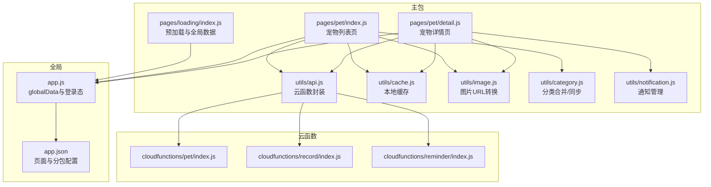

图表来源
- [miniprogram/pages/loading/index.js:1-450](file://miniprogram/pages/loading/index.js#L1-L450)
- [miniprogram/pages/pet/index.js:1-800](file://miniprogram/pages/pet/index.js#L1-L800)
- [miniprogram/pages/pet/detail.js:1-800](file://miniprogram/pages/pet/detail.js#L1-L800)
- [miniprogram/utils/api.js:1-208](file://miniprogram/utils/api.js#L1-L208)
- [miniprogram/utils/cache.js:1-121](file://miniprogram/utils/cache.js#L1-L121)
- [miniprogram/utils/image.js:1-170](file://miniprogram/utils/image.js#L1-L170)
- [miniprogram/utils/category.js:1-65](file://miniprogram/utils/category.js#L1-L65)
- [miniprogram/utils/notification.js:1-146](file://miniprogram/utils/notification.js#L1-L146)
- [cloudfunctions/pet/index.js:1-200](file://cloudfunctions/pet/index.js#L1-L200)
- [cloudfunctions/record/index.js:1-191](file://cloudfunctions/record/index.js#L1-L191)
- [cloudfunctions/reminder/index.js:1-200](file://cloudfunctions/reminder/index.js#L1-L200)
- [miniprogram/app.js:1-312](file://miniprogram/app.js#L1-L312)
- [miniprogram/app.json:1-74](file://miniprogram/app.json#L1-L74)

章节来源
- [miniprogram/app.json:1-74](file://miniprogram/app.json#L1-L74)

## 核心组件
- 全局应用状态与生命周期
  - App 实例负责云开发初始化、系统配置加载、登录态维护、全局数据预加载标记与预加载数据缓存。
  - 关键字段：isLoggedIn、openid、userInfo、systemConfig、dataPreloaded、预加载集合等。
- 预加载与全局数据
  - Loading 页面串行执行云初始化、静默登录、宠物列表与分类加载、首页与我的页数据聚合，最终设置 dataPreloaded 标志，供其他页面按需使用。
- 页面级状态管理
  - 宠物列表页与详情页均以 data 作为页面级状态源，通过 setData 实现响应式更新；同时结合本地缓存与云函数接口实现数据回退与同步。
- 云函数封装与错误降级
  - APIManager 统一封装云函数调用，统一处理 success/fail、错误消息与降级策略，支持本地回退。
- 本地缓存策略
  - cache 工具提供带过期时间的本地缓存，支持清理过期项与批量清理；图片 URL 转换与净化确保缓存数据不过期。
- 通知与安全
  - NotificationManager 负责未读通知与待审核记录的查询与提示，配合 App 的审核通知检查。

章节来源
- [miniprogram/app.js:1-312](file://miniprogram/app.js#L1-L312)
- [miniprogram/pages/loading/index.js:1-450](file://miniprogram/pages/loading/index.js#L1-L450)
- [miniprogram/utils/api.js:1-208](file://miniprogram/utils/api.js#L1-L208)
- [miniprogram/utils/cache.js:1-121](file://miniprogram/utils/cache.js#L1-L121)
- [miniprogram/utils/notification.js:1-146](file://miniprogram/utils/notification.js#L1-L146)

## 架构总览
整体采用“预加载 + 云函数 + 本地缓存”的数据流架构。App 作为全局状态中枢，Loading 页面完成一次性预加载并将数据写入 globalData；业务页面在 onShow/onLoad 中根据登录态与预加载标志决定是否走云端或本地回退路径；APIManager 统一处理云函数调用与错误降级；cache 工具与图片净化确保数据一致性与性能。

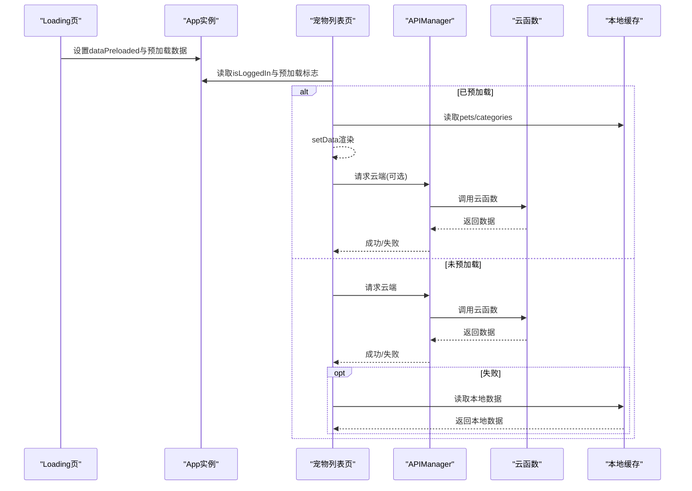

图表来源
- [miniprogram/pages/loading/index.js:45-74](file://miniprogram/pages/loading/index.js#L45-L74)
- [miniprogram/pages/pet/index.js:97-139](file://miniprogram/pages/pet/index.js#L97-L139)
- [miniprogram/utils/api.js:12-38](file://miniprogram/utils/api.js#L12-L38)
- [cloudfunctions/pet/index.js:140-180](file://cloudfunctions/pet/index.js#L140-L180)

## 详细组件分析

### 全局状态与生命周期（App）
- 初始化与系统配置
  - 云开发初始化后加载 systemConfig，兼容新旧集合，失败时降级到旧集合。
- 登录态与静默登录
  - 优先读取本地 openid；若无则调用云函数 login 获取 openid 并写入本地缓存；自动拉取/补齐用户信息。
- 全局数据预加载标记
  - Loading 页完成预加载后设置 dataPreloaded 与各集合缓存，供其他页面按需使用。
- 通知与安全检查
  - onShow 时检查未读通知与待审核记录，必要时弹窗提示。

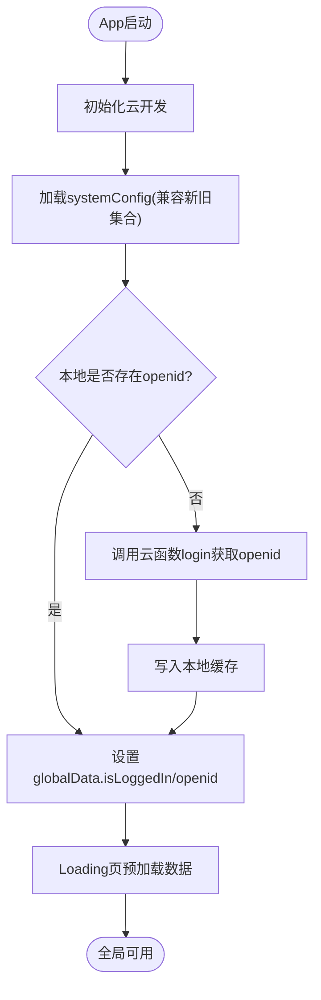

图表来源
- [miniprogram/app.js:2-58](file://miniprogram/app.js#L2-L58)
- [miniprogram/pages/loading/index.js:77-141](file://miniprogram/pages/loading/index.js#L77-L141)

章节来源
- [miniprogram/app.js:1-312](file://miniprogram/app.js#L1-L312)

### 预加载与全局数据（Loading 页）
- 分步加载
  - 云初始化 → 静默登录 → 宠物列表与分类 → 首页数据（提醒、统计、精选宠物） → 我的页数据（分享信息、二维码）。
- 预加载标记与回填
  - _finalizePreload 确保 dataPreloaded 与各集合存在，避免 Tab 预创建导致的竞态。
- 云端数据聚合
  - 合并云端与本地提醒，计算状态并排序，写入 globalData.preloadedReminders 与 preloadedHasReminder。

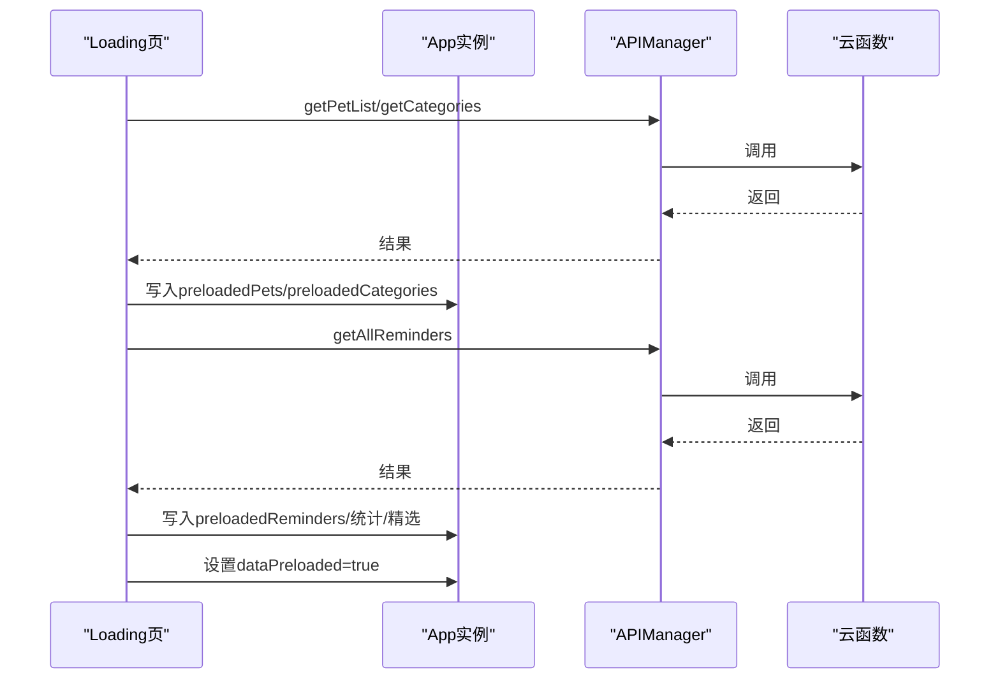

图表来源
- [miniprogram/pages/loading/index.js:15-74](file://miniprogram/pages/loading/index.js#L15-L74)
- [cloudfunctions/pet/index.js:140-180](file://cloudfunctions/pet/index.js#L140-L180)
- [cloudfunctions/reminder/index.js:125-142](file://cloudfunctions/reminder/index.js#L125-L142)

章节来源
- [miniprogram/pages/loading/index.js:1-450](file://miniprogram/pages/loading/index.js#L1-L450)

### 页面级状态管理（宠物列表页）
- 登录态与竞态处理
  - onShow 中读取 App 全局登录态，若本地尚未初始化，读取本地缓存 openid 并回填全局，避免异步初始化竞态。
- 预加载与骨架屏
  - 若 dataPreloaded 为真，直接使用 globalData 预加载数据渲染，后台静默同步；否则按需加载。
- 数据加载与回退
  - loadPets 通过 APIManager 调用云函数，合并本地缓存的图片 URL，去重与分页处理；失败时回退本地数据。
- 状态计算与过滤
  - computePetStatuses 基于 records 计算动态状态；updateFilteredPets 支持分类/性别/状态/搜索过滤。
- 并发与序列号
  - 使用 _loadSeq 防止并发请求导致的过期结果覆盖。

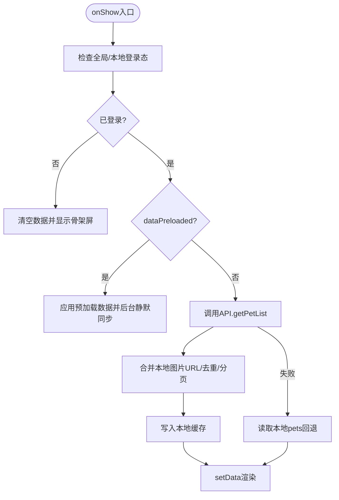

图表来源
- [miniprogram/pages/pet/index.js:97-139](file://miniprogram/pages/pet/index.js#L97-L139)
- [miniprogram/pages/pet/index.js:199-338](file://miniprogram/pages/pet/index.js#L199-L338)
- [miniprogram/utils/image.js:38-57](file://miniprogram/utils/image.js#L38-L57)

章节来源
- [miniprogram/pages/pet/index.js:1-800](file://miniprogram/pages/pet/index.js#L1-L800)
- [miniprogram/utils/image.js:1-170](file://miniprogram/utils/image.js#L1-L170)

### 页面级状态管理（宠物详情页）
- 模式与只读控制
  - 支持公开浏览与扫码进入只读模式，验证所有权后解除只读。
- 数据加载与回退
  - loadPetDetail 优先云端，失败回退本地 pets 或回收站；setPetData 规范化显示数据并触发记录过滤与分组。
- 图片错误与刷新
  - onPhotoError 通过 getTempUrl 刷新失效图片，必要时清空或替换。
- 分类与同步
  - _loadCategoriesFromCloud 合并云端与本地分类，缺失时同步至云端；更新后写入本地缓存与全局预加载。

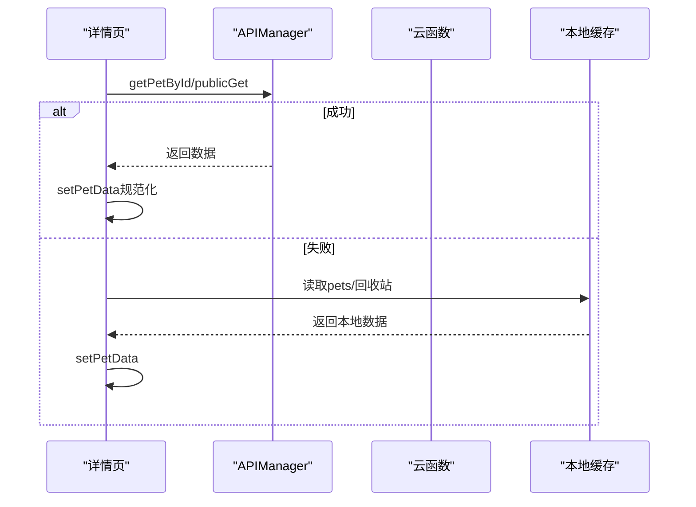

图表来源
- [miniprogram/pages/pet/detail.js:420-482](file://miniprogram/pages/pet/detail.js#L420-L482)
- [miniprogram/pages/pet/detail.js:587-616](file://miniprogram/pages/pet/detail.js#L587-L616)

章节来源
- [miniprogram/pages/pet/detail.js:1-800](file://miniprogram/pages/pet/detail.js#L1-L800)

### 云函数封装与错误降级（APIManager）
- 统一调用
  - callCloudFunction 统一处理返回结构与错误，失败时设置 cloudAvailable=false 并返回 useFallback 标记。
- 功能分组
  - 宠物、记录、提醒、足迹、登录等接口封装，统一返回 {success,data} 结构。
- 图片上传与安全
  - uploadImage 支持上传并异步触发安全审核，失败时返回友好消息。

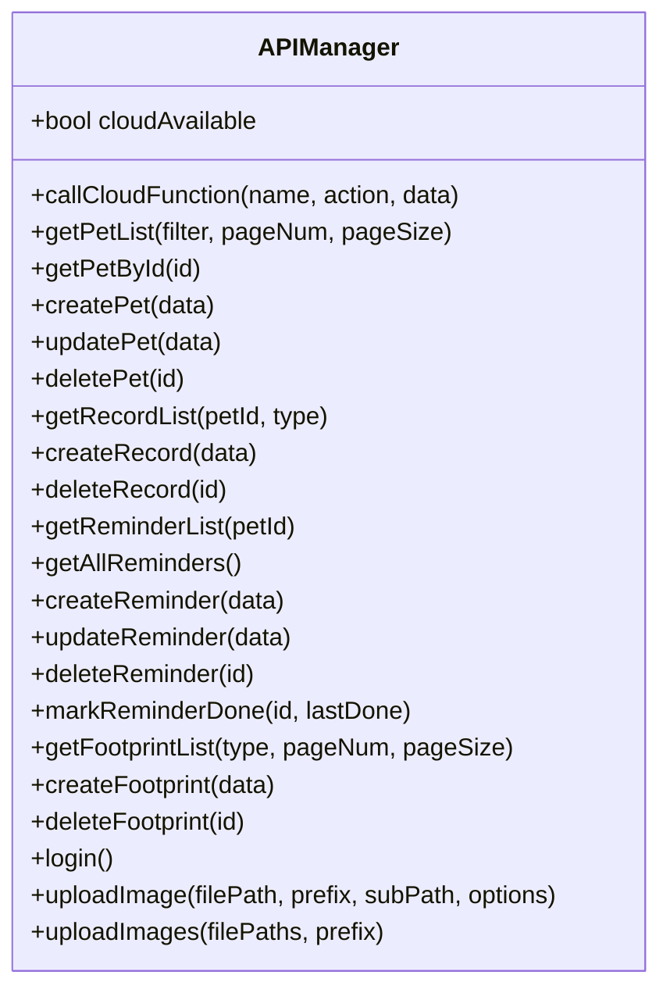

图表来源
- [miniprogram/utils/api.js:4-208](file://miniprogram/utils/api.js#L4-L208)

章节来源
- [miniprogram/utils/api.js:1-208](file://miniprogram/utils/api.js#L1-L208)

### 本地缓存策略（cache 工具）
- 带过期时间的缓存
  - setCache/getCache/removeCache/clearCache；过期清理与存储满错误的重试与清理。
- 图片 URL 净化
  - sanitizePhotoUrls/sanitizePetPhotos 将临时 URL 转为 cloud://fileID，确保缓存数据长期有效。

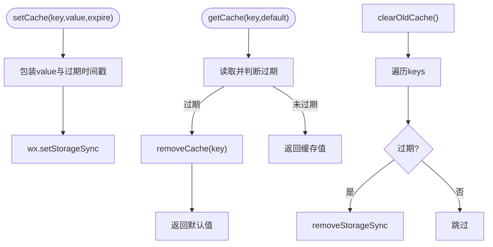

图表来源
- [miniprogram/utils/cache.js:11-97](file://miniprogram/utils/cache.js#L11-L97)
- [miniprogram/utils/image.js:133-159](file://miniprogram/utils/image.js#L133-L159)

章节来源
- [miniprogram/utils/cache.js:1-121](file://miniprogram/utils/cache.js#L1-L121)
- [miniprogram/utils/image.js:128-159](file://miniprogram/utils/image.js#L128-L159)

### 通知与安全（NotificationManager）
- 未读通知与待审核
  - getUnreadNotifications 带节流（1分钟），getPendingChecks 获取超时待审记录。
- 弹窗与标记
  - showNotificationDialog 递归弹窗并标记已读；showTimeoutToast 提示待审数量。

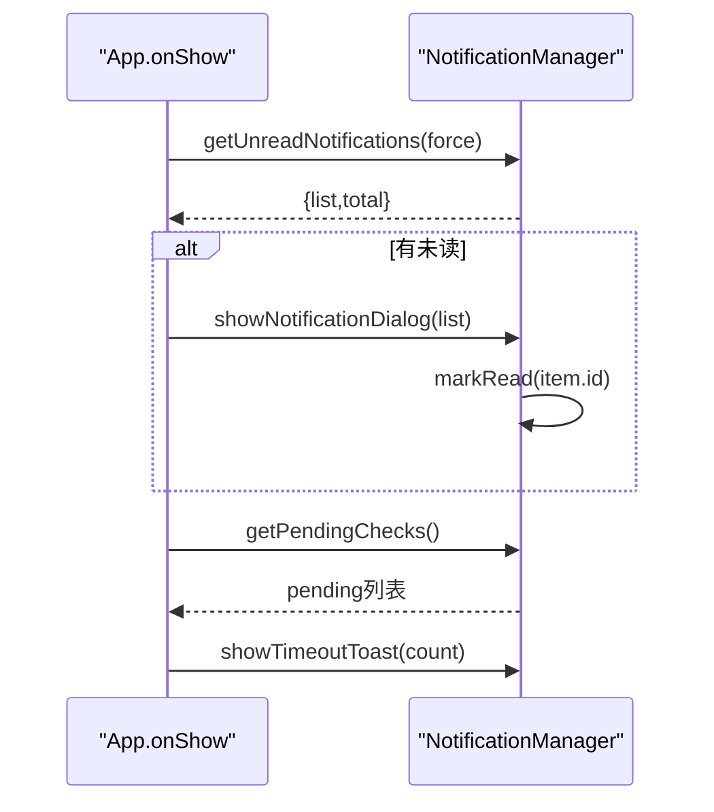

图表来源
- [miniprogram/app.js:267-288](file://miniprogram/app.js#L267-L288)
- [miniprogram/utils/notification.js:41-130](file://miniprogram/utils/notification.js#L41-L130)

章节来源
- [miniprogram/utils/notification.js:1-146](file://miniprogram/utils/notification.js#L1-L146)
- [miniprogram/app.js:267-288](file://miniprogram/app.js#L267-L288)

### 后端状态与一致性（云函数）
- 宠物集合
  - create/list/get/update/delete/getPedigree/publicGet/getCategories/addCategory/updateCategory/deleteCategory；统一返回 successResponse/errorResponse；create 时校验别名唯一性与数量上限。
- 记录集合
  - create/get/list/update/delete；支持产蛋/出苗/交配等扩展字段；updateQrBase64 静默更新 QR 缓存字段。
- 提醒集合
  - create/list/listAll/get/update/delete/markDone；确保集合存在，按 petId+type 去重，支持周期提醒模型。

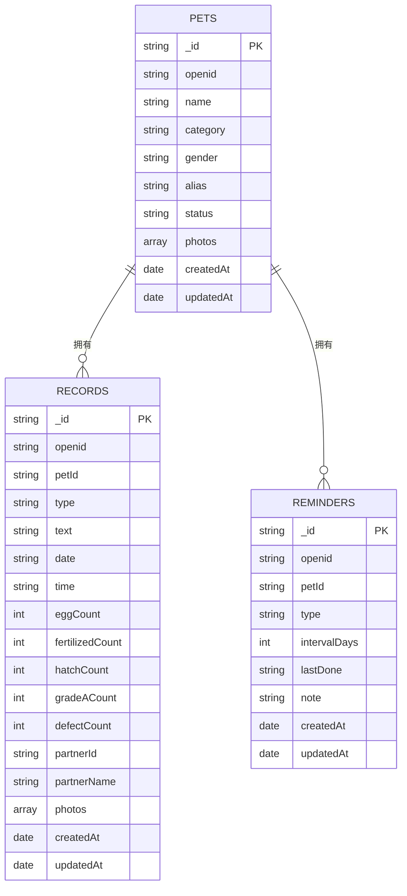

图表来源
- [cloudfunctions/pet/index.js:84-138](file://cloudfunctions/pet/index.js#L84-L138)
- [cloudfunctions/record/index.js:37-82](file://cloudfunctions/record/index.js#L37-L82)
- [cloudfunctions/reminder/index.js:55-102](file://cloudfunctions/reminder/index.js#L55-L102)

章节来源
- [cloudfunctions/pet/index.js:1-200](file://cloudfunctions/pet/index.js#L1-L200)
- [cloudfunctions/record/index.js:1-191](file://cloudfunctions/record/index.js#L1-L191)
- [cloudfunctions/reminder/index.js:1-200](file://cloudfunctions/reminder/index.js#L1-L200)

## 依赖关系分析
- 页面依赖 App 全局状态与 Loading 预加载数据，避免重复请求。
- 页面依赖 APIManager 统一调用云函数，失败时回退本地缓存。
- 图片处理依赖 image 工具链，确保 cloud:// 与临时 URL 的正确转换与净化。
- 分类管理依赖 category 工具与云函数，保证多来源合并与同步。

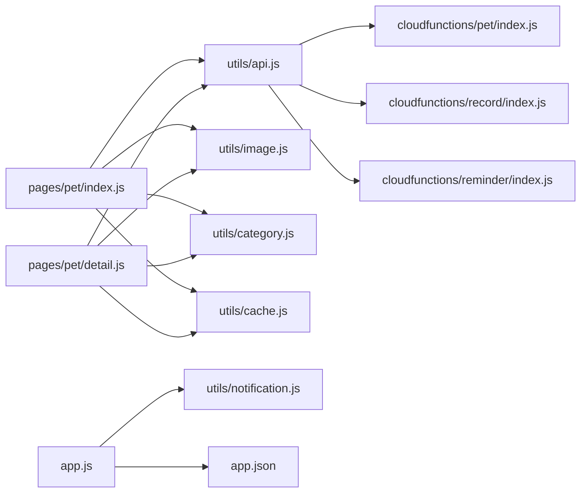

图表来源
- [miniprogram/pages/pet/index.js:1-800](file://miniprogram/pages/pet/index.js#L1-L800)
- [miniprogram/pages/pet/detail.js:1-800](file://miniprogram/pages/pet/detail.js#L1-L800)
- [miniprogram/utils/api.js:1-208](file://miniprogram/utils/api.js#L1-L208)
- [miniprogram/utils/image.js:1-170](file://miniprogram/utils/image.js#L1-L170)
- [miniprogram/utils/category.js:1-65](file://miniprogram/utils/category.js#L1-L65)
- [miniprogram/utils/cache.js:1-121](file://miniprogram/utils/cache.js#L1-L121)
- [miniprogram/utils/notification.js:1-146](file://miniprogram/utils/notification.js#L1-L146)
- [miniprogram/app.js:1-312](file://miniprogram/app.js#L1-L312)
- [miniprogram/app.json:1-74](file://miniprogram/app.json#L1-L74)
- [cloudfunctions/pet/index.js:1-200](file://cloudfunctions/pet/index.js#L1-L200)
- [cloudfunctions/record/index.js:1-191](file://cloudfunctions/record/index.js#L1-L191)
- [cloudfunctions/reminder/index.js:1-200](file://cloudfunctions/reminder/index.js#L1-L200)

章节来源
- [miniprogram/pages/pet/index.js:1-800](file://miniprogram/pages/pet/index.js#L1-L800)
- [miniprogram/pages/pet/detail.js:1-800](file://miniprogram/pages/pet/detail.js#L1-L800)
- [miniprogram/utils/api.js:1-208](file://miniprogram/utils/api.js#L1-L208)

## 性能考量
- 骨架屏与最小展示时长
  - 列表页在 onHide 时提前设置 showSkeleton，在 _hideSkeleton 中保证至少展示 600ms，提升感知性能。
- 并发请求防护
  - 使用 _loadSeq 序列号丢弃过期请求结果与错误，避免 UI 抖动与数据错乱。
- 图片 URL 转换与缓存
  - 云端返回 cloud://fileID，本地缓存前通过 sanitizePetPhotos 净化，减少无效请求与过期链接。
- 本地回退与降级
  - APIManager 在云函数调用失败时返回 useFallback 标记，页面据此选择本地回退路径。
- 预加载与懒加载
  - Loading 页集中预加载关键数据，其他页面按需使用；分包按需加载，降低首屏压力。

[本节为通用性能建议，无需特定文件引用]

## 故障排查指南
- 登录态异常
  - 检查 App.initLocalData 与 Loading.getOpenid 的 openid 读取与写入；确认 App.globalData.isLoggedIn 与本地缓存一致。
- 数据不一致
  - 确认 APIManager.cloudAvailable 标志与 useFallback 流程；检查本地缓存 pets/categories 的写入时机。
- 图片显示异常
  - 使用 getTempUrl 刷新失效图片；检查 sanitizePhotoUrls 是否正确将临时 URL 转为 cloud://fileID。
- 通知未显示
  - 检查 NotificationManager 节流与云函数调用结果；确认 App.onShow 中的 _checkSecurityNotifications 调用。
- 并发覆盖问题
  - 确认 _loadSeq 序列号在请求发起与接收两端均生效，避免过期结果 setData。

章节来源
- [miniprogram/app.js:61-140](file://miniprogram/app.js#L61-L140)
- [miniprogram/pages/loading/index.js:87-141](file://miniprogram/pages/loading/index.js#L87-L141)
- [miniprogram/utils/api.js:12-38](file://miniprogram/utils/api.js#L12-L38)
- [miniprogram/utils/image.js:64-108](file://miniprogram/utils/image.js#L64-L108)
- [miniprogram/utils/notification.js:41-130](file://miniprogram/utils/notification.js#L41-L130)
- [miniprogram/pages/pet/index.js:209-250](file://miniprogram/pages/pet/index.js#L209-L250)

## 结论
本项目通过“预加载 + 云函数 + 本地缓存”的组合实现了稳定的状态管理：App 作为全局中枢，Loading 页完成一次性预加载，业务页面在登录态与预加载标志下按需选择云端或本地路径；APIManager 统一错误降级与返回结构；cache 与图片净化确保数据一致性与性能。该方案兼顾用户体验与工程可维护性，适合中小规模多页面小程序的状态管理演进。

[本节为总结性内容，无需特定文件引用]

## 附录
- 最佳实践清单
  - 使用 _loadSeq 防止并发覆盖；在 setData 前后明确数据来源与优先级。
  - 对图片 URL 做统一转换与净化，确保缓存长期有效。
  - 分类与提醒等全局配置采用“云端优先 + 本地回退 + 补同步”策略。
  - 通知与安全检查采用节流与弹窗提示，避免频繁打扰。
- 扩展开发指导
  - 新增页面：遵循 onShow 读取全局登录态与预加载标志，优先使用 globalData，失败回退本地缓存。
  - 新增云函数：统一返回 successResponse/errorResponse，注意权限校验与集合存在性。
  - 新增缓存：使用 cache 工具的过期与清理能力，避免存储满与脏数据。

[本节为通用指导，无需特定文件引用]