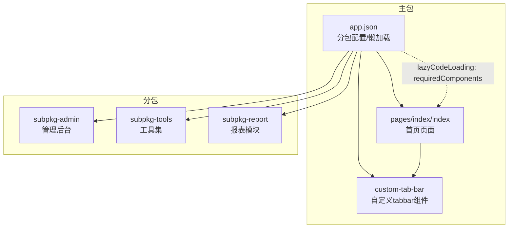
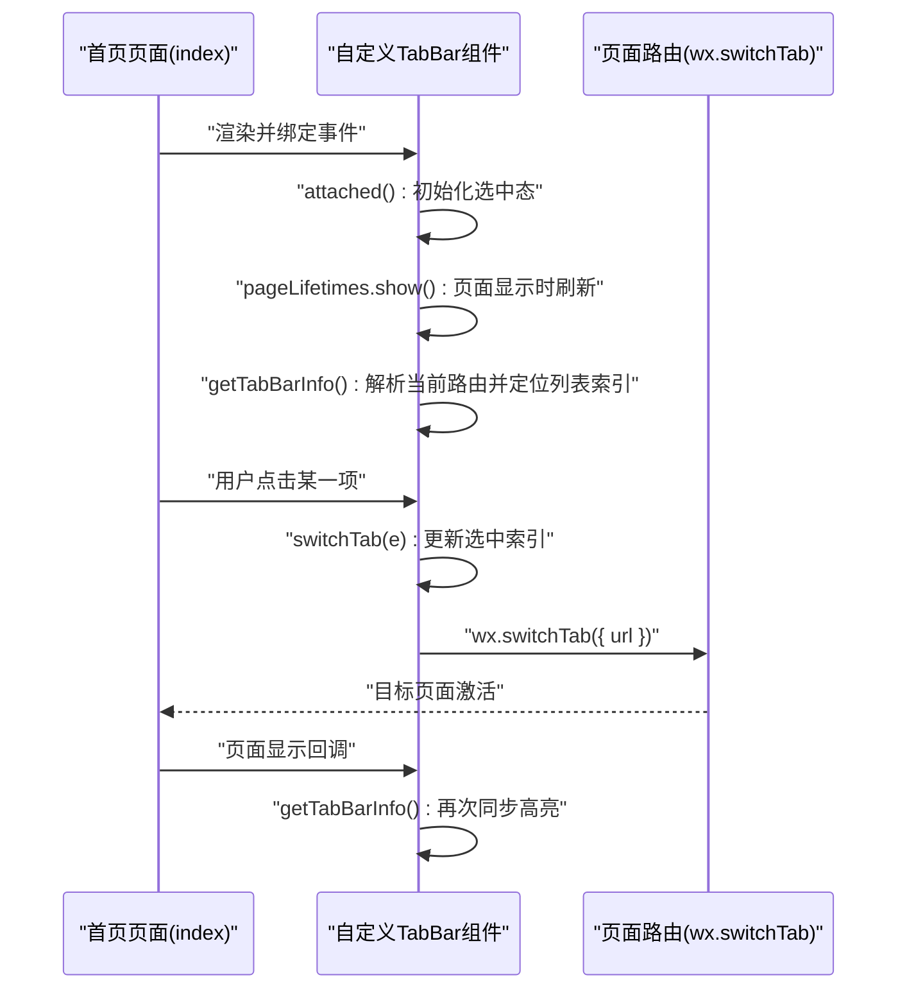
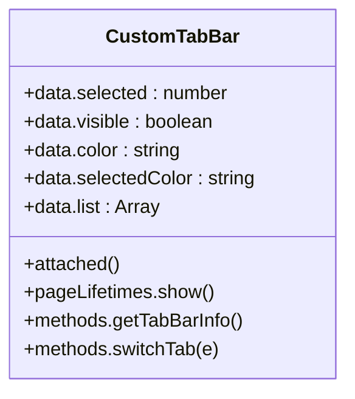
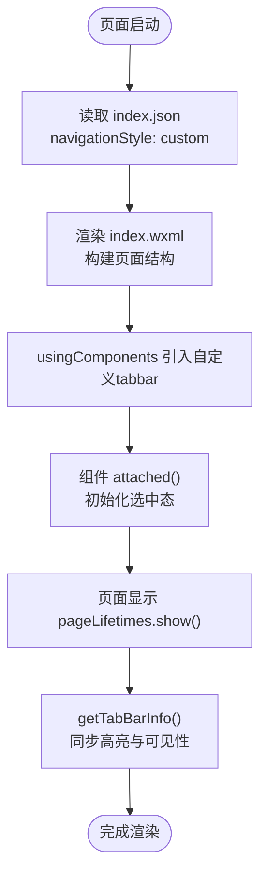
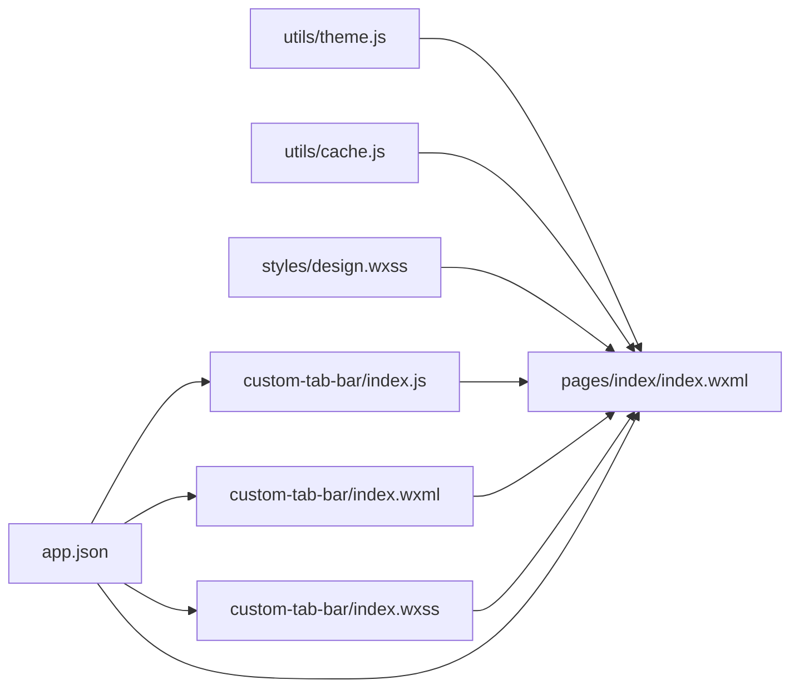

# 组件系统设计

<cite>
**本文引用的文件**
- [miniprogram/app.json](file://miniprogram/app.json)
- [miniprogram/custom-tab-bar/index.json](file://miniprogram/custom-tab-bar/index.json)
- [miniprogram/custom-tab-bar/index.js](file://miniprogram/custom-tab-bar/index.js)
- [miniprogram/custom-tab-bar/index.wxml](file://miniprogram/custom-tab-bar/index.wxml)
- [miniprogram/custom-tab-bar/index.wxss](file://miniprogram/custom-tab-bar/index.wxss)
- [miniprogram/pages/index/index.json](file://miniprogram/pages/index/index.json)
- [miniprogram/pages/index/index.wxml](file://miniprogram/pages/index/index.wxml)
- [miniprogram/styles/design.wxss](file://miniprogram/styles/design.wxss)
- [miniprogram/utils/theme.js](file://miniprogram/utils/theme.js)
- [miniprogram/utils/cache.js](file://miniprogram/utils/cache.js)
- [miniprogram/subpkg-report/pages/egg-report/index.json](file://miniprogram/subpkg-report/pages/egg-report/index.json)
- [miniprogram/subpkg-report/pages/footprint/index.json](file://miniprogram/subpkg-report/pages/footprint/index.json)
- [miniprogram/subpkg-admin/pages/admin/footprints.json](file://miniprogram/subpkg-admin/pages/admin/footprints.json)
</cite>

## 目录
1. [引言](#引言)
2. [项目结构](#项目结构)
3. [核心组件](#核心组件)
4. [架构总览](#架构总览)
5. [组件详解](#组件详解)
6. [依赖关系分析](#依赖关系分析)
7. [性能考量](#性能考量)
8. [故障排查指南](#故障排查指南)
9. [结论](#结论)
10. [附录](#附录)

## 引言
本文件面向“养龟档案”小程序的组件系统设计，系统性梳理其自定义组件的创建、注册与使用方式，阐释组件间数据传递、事件处理与生命周期管理，并总结组件封装最佳实践（属性定义、事件发射、样式隔离）、模板结构与样式系统、行为逻辑组织、复用策略、性能优化与调试技巧，以及扩展开发的指导原则与代码规范。文档同时给出架构图、流程图与类图，帮助读者从整体到细节全面理解该小程序的组件化架构。

## 项目结构
该项目采用微信小程序标准目录结构，页面按功能划分为主包与多个分包（admin、tools、report）。自定义 tabbar 作为全局组件独立于页面之外，通过 app.json 的 tabBar.custom 开启自定义导航栏，配合 pages/index/index 的 navigationStyle: "custom" 实现统一风格的导航体验。

图表来源
- [miniprogram/app.json:1-74](file://miniprogram/app.json#L1-L74)
- [miniprogram/pages/index/index.json:1-5](file://miniprogram/pages/index/index.json#L1-L5)

章节来源
- [miniprogram/app.json:1-74](file://miniprogram/app.json#L1-L74)
- [miniprogram/pages/index/index.json:1-5](file://miniprogram/pages/index/index.json#L1-L5)

## 核心组件
- 自定义 TabBar 组件：位于 custom-tab-bar 目录，提供毛玻璃背景、图标动画、活跃态指示与路由切换能力；通过 attached 与 pageLifetimes.show 生命周期自动同步当前页面高亮状态；通过 switchTab 方法触发页面跳转并更新选中态。
- 首页页面：在 index.json 中声明 navigationStyle: "custom"，并在 index.wxml 中通过 usingComponents 机制引入自定义组件，实现统一导航栏与业务内容分离。
- 设计系统样式：design.wxss 定义了 Design Tokens、通用工具类、按钮、标签、导航栏、安全区底部、Chip 与骨架屏等基础样式，为组件提供一致的视觉与交互语义。
- 工具库：theme.js 提供主题管理与 HTML 生成辅助函数；cache.js 提供带过期控制的本地缓存能力，支撑组件数据持久化与性能优化。

章节来源
- [miniprogram/custom-tab-bar/index.json:1-3](file://miniprogram/custom-tab-bar/index.json#L1-L3)
- [miniprogram/custom-tab-bar/index.js:1-72](file://miniprogram/custom-tab-bar/index.js#L1-L72)
- [miniprogram/custom-tab-bar/index.wxml:1-47](file://miniprogram/custom-tab-bar/index.wxml#L1-L47)
- [miniprogram/custom-tab-bar/index.wxss:1-265](file://miniprogram/custom-tab-bar/index.wxss#L1-L265)
- [miniprogram/pages/index/index.json:1-5](file://miniprogram/pages/index/index.json#L1-L5)
- [miniprogram/pages/index/index.wxml:1-138](file://miniprogram/pages/index/index.wxml#L1-L138)
- [miniprogram/styles/design.wxss:1-196](file://miniprogram/styles/design.wxss#L1-L196)
- [miniprogram/utils/theme.js:1-800](file://miniprogram/utils/theme.js#L1-L800)
- [miniprogram/utils/cache.js:1-121](file://miniprogram/utils/cache.js#L1-L121)

## 架构总览
下图展示了页面与自定义组件之间的关系、生命周期调用与事件流：

图表来源
- [miniprogram/custom-tab-bar/index.js:14-29](file://miniprogram/custom-tab-bar/index.js#L14-L29)
- [miniprogram/custom-tab-bar/index.js:31-70](file://miniprogram/custom-tab-bar/index.js#L31-L70)
- [miniprogram/pages/index/index.json:1-5](file://miniprogram/pages/index/index.json#L1-L5)

## 组件详解

### 自定义 TabBar 组件
- 组件注册与声明：index.json 中 component: true 明确组件身份。
- 数据与状态：包含默认颜色、选中索引、可见性与导航列表；通过 getCurrentPages() 获取当前路由，结合列表项进行匹配，决定选中态与可见性。
- 生命周期：
  - attached：初始化选中态，并延时二次校验，提升稳定性。
  - pageLifetimes.show：页面显示时刷新选中态。
- 事件处理：bindtap="switchTab"，根据 data-path 切换到对应页面，避免重复跳转。
- 样式系统：index.wxss 提供毛玻璃背景、图标动画、活跃指示器与文字强调，配合设计系统 tokens 实现统一风格。

图表来源
- [miniprogram/custom-tab-bar/index.js:1-72](file://miniprogram/custom-tab-bar/index.js#L1-L72)

章节来源
- [miniprogram/custom-tab-bar/index.json:1-3](file://miniprogram/custom-tab-bar/index.json#L1-L3)
- [miniprogram/custom-tab-bar/index.js:1-72](file://miniprogram/custom-tab-bar/index.js#L1-L72)
- [miniprogram/custom-tab-bar/index.wxml:1-47](file://miniprogram/custom-tab-bar/index.wxml#L1-L47)
- [miniprogram/custom-tab-bar/index.wxss:1-265](file://miniprogram/custom-tab-bar/index.wxss#L1-L265)

### 首页页面与组件集成
- 页面配置：index.json 中 navigationStyle: "custom" 关闭默认导航栏，为自定义组件让位。
- 模板结构：index.wxml 包含导航栏、滚动容器、功能区块、待办事项、常用功能与安全区底部等，体现清晰的业务分层。
- 组件使用：通过 usingComponents 机制引入自定义组件，实现导航栏与业务内容解耦。

图表来源
- [miniprogram/pages/index/index.json:1-5](file://miniprogram/pages/index/index.json#L1-L5)
- [miniprogram/pages/index/index.wxml:1-138](file://miniprogram/pages/index/index.wxml#L1-L138)
- [miniprogram/custom-tab-bar/index.js:14-29](file://miniprogram/custom-tab-bar/index.js#L14-L29)

章节来源
- [miniprogram/pages/index/index.json:1-5](file://miniprogram/pages/index/index.json#L1-L5)
- [miniprogram/pages/index/index.wxml:1-138](file://miniprogram/pages/index/index.wxml#L1-L138)

### 设计系统与样式隔离
- Design Tokens：design.wxss 定义颜色、半径、阴影、字号与间距等变量，形成统一的视觉语言。
- 通用工具类：card、section-title、btn、tag、chip、skeleton 等，便于组件快速复用。
- 样式隔离：组件样式通过局部作用域与类名组合实现隔离，避免跨组件污染；自定义 tabbar 通过独立 wxss 文件集中管理视觉表现。

章节来源
- [miniprogram/styles/design.wxss:1-196](file://miniprogram/styles/design.wxss#L1-L196)
- [miniprogram/custom-tab-bar/index.wxss:1-265](file://miniprogram/custom-tab-bar/index.wxss#L1-L265)

### 工具库与数据持久化
- 主题管理：theme.js 提供主题配置与 HTML 生成辅助，支持图片 URL 转 base64，便于导出与预览。
- 缓存管理：cache.js 提供带过期时间的本地缓存，包含设置、获取、清理与清空等操作，增强组件数据复用与性能。

章节来源
- [miniprogram/utils/theme.js:1-800](file://miniprogram/utils/theme.js#L1-L800)
- [miniprogram/utils/cache.js:1-121](file://miniprogram/utils/cache.js#L1-L121)

## 依赖关系分析
- 页面对组件的依赖：首页页面通过 usingComponents 引用自定义 tabbar，形成页面级依赖。
- 组件对运行时的依赖：自定义 tabbar 依赖 getCurrentPages() 与 wx.switchTab，用于路由解析与跳转。
- 分包与懒加载：app.json 中 lazyCodeLoading: "requiredComponents" 配置开启按需加载，减少首屏体积。
- 全局样式依赖：design.wxss 为组件提供统一设计令牌与工具类，降低样式耦合度。

图表来源
- [miniprogram/app.json:1-74](file://miniprogram/app.json#L1-L74)
- [miniprogram/pages/index/index.wxml:1-138](file://miniprogram/pages/index/index.wxml#L1-L138)
- [miniprogram/custom-tab-bar/index.js:1-72](file://miniprogram/custom-tab-bar/index.js#L1-L72)
- [miniprogram/custom-tab-bar/index.wxml:1-47](file://miniprogram/custom-tab-bar/index.wxml#L1-L47)
- [miniprogram/custom-tab-bar/index.wxss:1-265](file://miniprogram/custom-tab-bar/index.wxss#L1-L265)
- [miniprogram/styles/design.wxss:1-196](file://miniprogram/styles/design.wxss#L1-L196)
- [miniprogram/utils/theme.js:1-800](file://miniprogram/utils/theme.js#L1-L800)
- [miniprogram/utils/cache.js:1-121](file://miniprogram/utils/cache.js#L1-L121)

章节来源
- [miniprogram/app.json:1-74](file://miniprogram/app.json#L1-L74)
- [miniprogram/pages/index/index.wxml:1-138](file://miniprogram/pages/index/index.wxml#L1-L138)

## 性能考量
- 懒加载策略：通过 app.json 的 lazyCodeLoading: "requiredComponents"，仅在需要时加载组件，降低首屏资源压力。
- 组件复用：将通用 UI 与交互抽象为组件（如自定义 tabbar），减少重复实现与维护成本。
- 样式优化：使用 design.wxss 的 Design Tokens 与工具类，避免重复样式定义；组件样式局部化，减少冲突与回流。
- 数据缓存：利用 cache.js 的带过期缓存，减少网络请求与重复计算，提升组件响应速度。
- 图片处理：theme.js 的图片转 base64 能力，便于在导出场景中保证资源可用性。

章节来源
- [miniprogram/app.json:72-72](file://miniprogram/app.json#L72-L72)
- [miniprogram/utils/cache.js:1-121](file://miniprogram/utils/cache.js#L1-L121)
- [miniprogram/utils/theme.js:1-800](file://miniprogram/utils/theme.js#L1-L800)
- [miniprogram/styles/design.wxss:1-196](file://miniprogram/styles/design.wxss#L1-L196)

## 故障排查指南
- 自定义 tabbar 不显示或不生效
  - 检查 app.json 的 tabBar.custom 是否启用，以及页面 index.json 的 navigationStyle: "custom" 是否正确设置。
  - 确认页面 index.wxml 中 usingComponents 是否正确引入自定义组件。
- 选中态不更新
  - 观察 attached 与 pageLifetimes.show 生命周期是否执行；检查 getTabBarInfo() 的路由匹配逻辑与列表项 pagePath 是否一致。
- 跳转异常
  - 在 switchTab 中确认 data-path 与当前路由对比逻辑；避免重复跳转导致的状态抖动。
- 样式冲突
  - 检查组件 wxss 是否覆盖全局 design tokens；确保类名前缀唯一，避免样式穿透。
- 缓存问题
  - 使用 cache.js 的清理与重试逻辑，关注存储空间不足的异常分支。

章节来源
- [miniprogram/app.json:48-68](file://miniprogram/app.json#L48-L68)
- [miniprogram/pages/index/index.json:1-5](file://miniprogram/pages/index/index.json#L1-L5)
- [miniprogram/custom-tab-bar/index.js:14-29](file://miniprogram/custom-tab-bar/index.js#L14-L29)
- [miniprogram/custom-tab-bar/index.js:31-70](file://miniprogram/custom-tab-bar/index.js#L31-L70)
- [miniprogram/utils/cache.js:18-35](file://miniprogram/utils/cache.js#L18-L35)

## 结论
“养龟档案”的组件系统以自定义 tabbar 为核心入口，结合分包与懒加载策略，实现了页面与导航的解耦与高性能加载。通过 design.wxss 的设计令牌与工具类，组件具备良好的一致性与可维护性；配合 cache.js 与 theme.js 的数据与资源处理能力，进一步提升了用户体验与开发效率。建议在后续扩展中继续坚持组件化、样式隔离与性能优先的原则，持续完善组件复用与调试体系。

## 附录
- 分包页面示例：各分包页面的 usingComponents 通常为空对象，表明采用按需加载与主包共享组件的策略。
- 最佳实践清单
  - 属性定义：使用 properties 与 observers 管理输入与变更，避免直接修改外部传入数据。
  - 事件发射：通过 triggerEvent 发射语义化事件，保持父子组件通信清晰。
  - 样式隔离：组件内样式局部化，必要时使用类名前缀与 BEM 思想。
  - 生命周期：合理使用 attached、ready、pageLifetimes 等生命周期，避免阻塞主线程。
  - 性能优化：启用懒加载、缓存策略与按需渲染，减少不必要的 setData 与重绘。
  - 调试技巧：利用微信开发者工具的组件面板、日志与断点，定位生命周期与事件流问题。

章节来源
- [miniprogram/subpkg-report/pages/egg-report/index.json:1-3](file://miniprogram/subpkg-report/pages/egg-report/index.json#L1-L3)
- [miniprogram/subpkg-report/pages/footprint/index.json:1-3](file://miniprogram/subpkg-report/pages/footprint/index.json#L1-L3)
- [miniprogram/subpkg-admin/pages/admin/footprints.json:1-3](file://miniprogram/subpkg-admin/pages/admin/footprints.json#L1-L3)