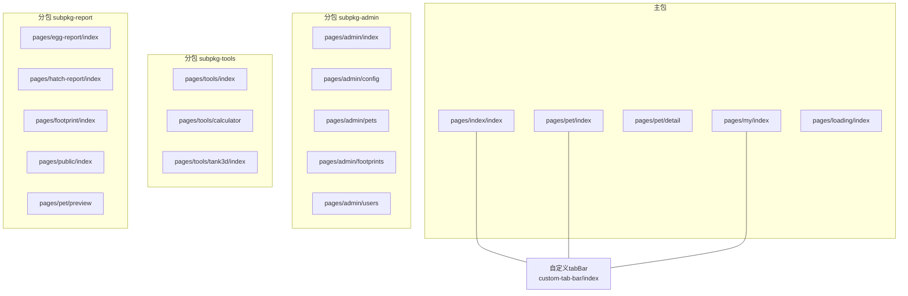
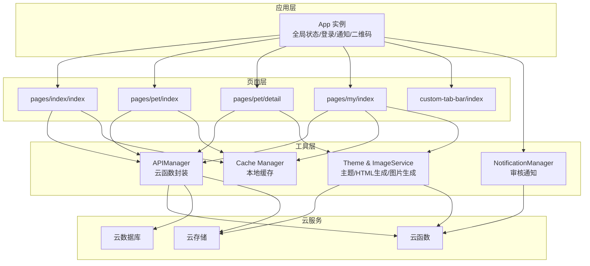
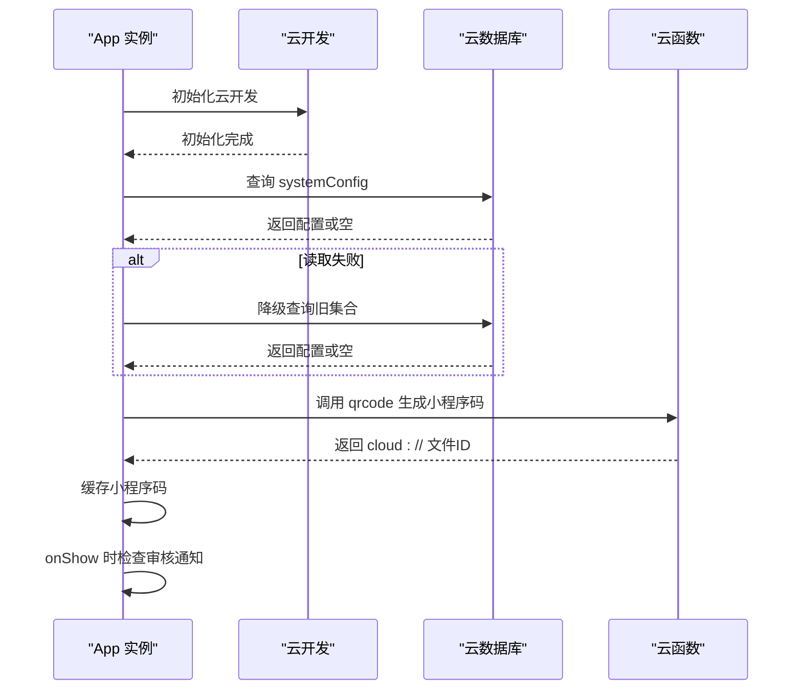
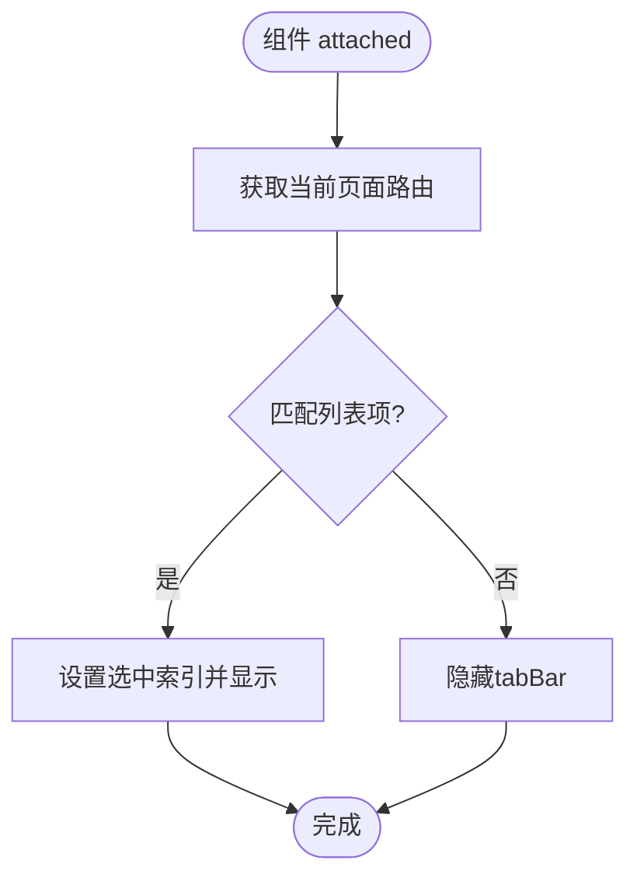
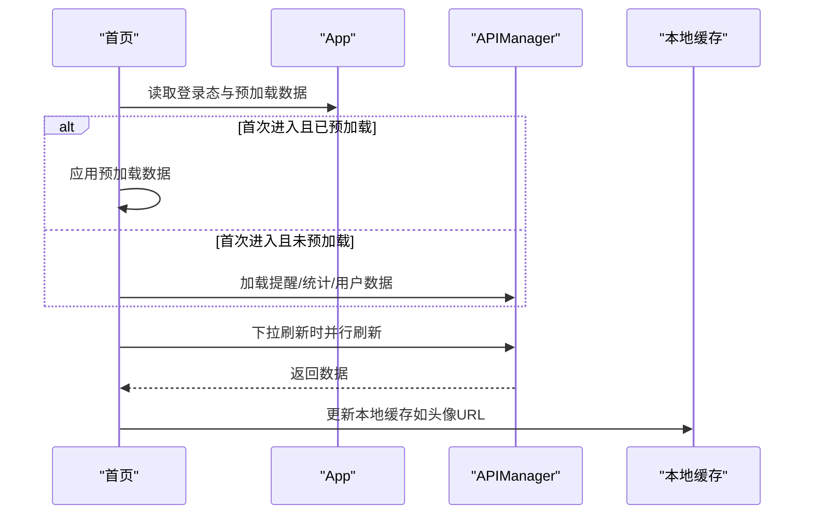
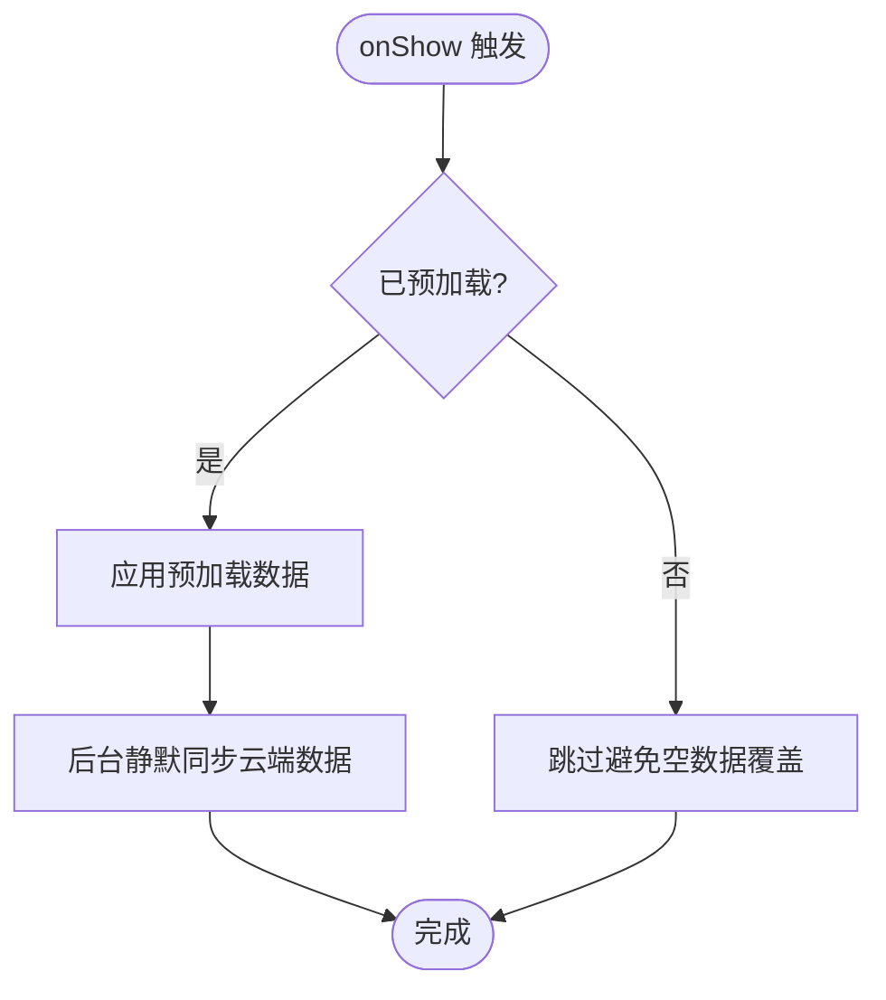
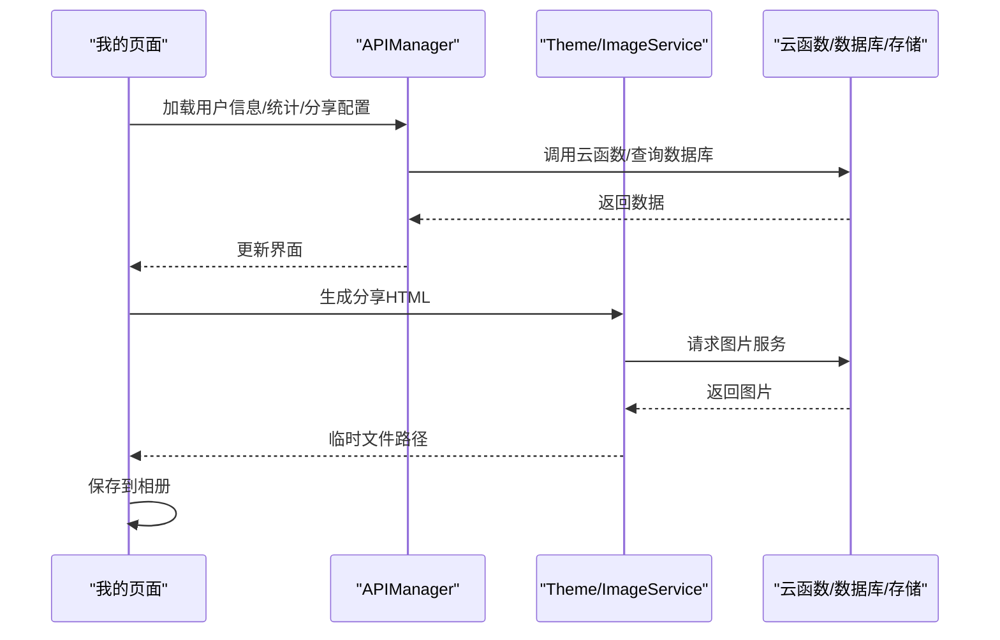
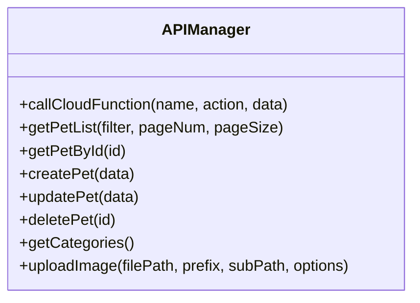
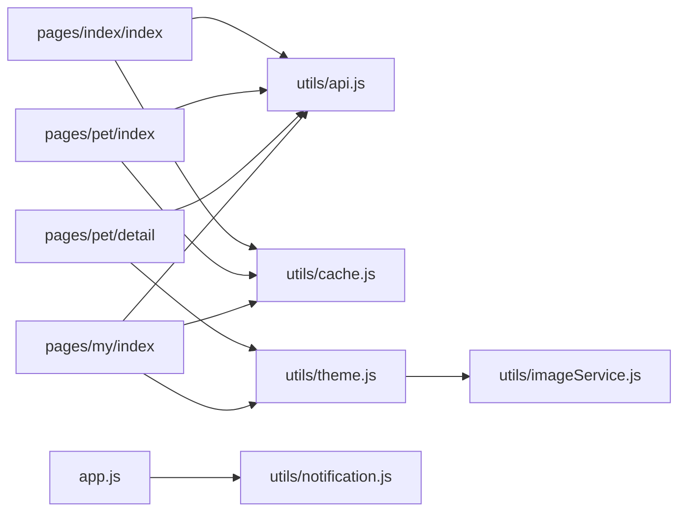

# 页面架构设计

<cite>
**本文档引用的文件**
- [miniprogram/app.js](file://miniprogram/app.js)
- [miniprogram/app.json](file://miniprogram/app.json)
- [miniprogram/custom-tab-bar/index.js](file://miniprogram/custom-tab-bar/index.js)
- [miniprogram/custom-tab-bar/index.json](file://miniprogram/custom-tab-bar/index.json)
- [miniprogram/pages/index/index.js](file://miniprogram/pages/index/index.js)
- [miniprogram/pages/index/index.json](file://miniprogram/pages/index/index.json)
- [miniprogram/pages/pet/index.js](file://miniprogram/pages/pet/index.js)
- [miniprogram/pages/pet/index.json](file://miniprogram/pages/pet/index.json)
- [miniprogram/pages/pet/detail.js](file://miniprogram/pages/pet/detail.js)
- [miniprogram/pages/pet/detail.json](file://miniprogram/pages/pet/detail.json)
- [miniprogram/pages/my/index.js](file://miniprogram/pages/my/index.js)
- [miniprogram/pages/my/index.json](file://miniprogram/pages/my/index.json)
- [miniprogram/utils/api.js](file://miniprogram/utils/api.js)
- [miniprogram/utils/cache.js](file://miniprogram/utils/cache.js)
- [miniprogram/utils/theme.js](file://miniprogram/utils/theme.js)
- [miniprogram/utils/imageService.js](file://miniprogram/utils/imageService.js)
- [miniprogram/utils/notification.js](file://miniprogram/utils/notification.js)
</cite>

## 目录
1. [引言](#引言)
2. [项目结构](#项目结构)
3. [核心组件](#核心组件)
4. [架构总览](#架构总览)
5. [详细组件分析](#详细组件分析)
6. [依赖分析](#依赖分析)
7. [性能考虑](#性能考虑)
8. [故障排查指南](#故障排查指南)
9. [结论](#结论)
10. [附录](#附录)

## 引言
本文件面向“养龟档案”小程序的页面架构设计，围绕页面组织结构、路由系统、页面生命周期管理、导航策略与数据传递、状态管理、模板与样式设计原则、性能优化、页面配置项与页面间通信方式进行系统化梳理，并提供扩展开发最佳实践与代码规范建议。目标是帮助开发者在理解现有实现的基础上，高效迭代与维护页面层功能。

## 项目结构
小程序采用分包与主包结合的组织方式：
- 主包 pages：包含启动页、首页、宠物列表、我的页面等核心页面
- 分包 subpackages：
  - subpkg-admin：管理后台页面集合
  - subpkg-tools：工具页面集合（计算器、3D龟缸等）
  - subpkg-report：报表与分享页面集合（孵化报告、足迹、公开主页等）

应用全局配置 app.json 控制页面注册、窗口样式、自定义 tabBar、分包与懒加载策略。

图表来源
- [miniprogram/app.json:1-74](file://miniprogram/app.json#L1-L74)
- [miniprogram/custom-tab-bar/index.js:1-72](file://miniprogram/custom-tab-bar/index.js#L1-L72)

章节来源
- [miniprogram/app.json:1-74](file://miniprogram/app.json#L1-L74)

## 核心组件
- 应用生命周期与全局状态：App 实例负责云开发初始化、系统配置加载、登录态管理、二维码生成、通知检查与登出等
- 自定义 TabBar：自定义组件承载底部导航，根据当前页面动态切换选中态
- 页面层：首页、宠物列表、宠物详情、我的页面分别承担不同职责，配合 API 管理器与缓存工具进行数据拉取与状态管理
- 工具层：API 管理器封装云函数调用；缓存工具提供本地持久化；主题与图片服务负责渲染与分享图生成

章节来源
- [miniprogram/app.js:1-312](file://miniprogram/app.js#L1-L312)
- [miniprogram/custom-tab-bar/index.js:1-72](file://miniprogram/custom-tab-bar/index.js#L1-L72)
- [miniprogram/utils/api.js:1-208](file://miniprogram/utils/api.js#L1-L208)
- [miniprogram/utils/cache.js:1-121](file://miniprogram/utils/cache.js#L1-L121)
- [miniprogram/utils/theme.js:1-2088](file://miniprogram/utils/theme.js#L1-L2088)
- [miniprogram/utils/imageService.js:1-202](file://miniprogram/utils/imageService.js#L1-L202)

## 架构总览
整体采用“应用层（App）—页面层（Page）—工具层（Utils）—云服务（Cloud Functions/Database/Storage）”的分层架构。页面通过 API 管理器与云函数交互，使用缓存工具提升首屏与离线体验，自定义 TabBar 统一导航体验，全局通知管理器在前台可见时检查审核通知。

图表来源
- [miniprogram/app.js:1-312](file://miniprogram/app.js#L1-L312)
- [miniprogram/pages/index/index.js:1-477](file://miniprogram/pages/index/index.js#L1-L477)
- [miniprogram/pages/pet/index.js:1-800](file://miniprogram/pages/pet/index.js#L1-L800)
- [miniprogram/pages/pet/detail.js](file://miniprogram/pages/pet/detail.js)
- [miniprogram/pages/my/index.js:1-800](file://miniprogram/pages/my/index.js#L1-L800)
- [miniprogram/utils/api.js:1-208](file://miniprogram/utils/api.js#L1-L208)
- [miniprogram/utils/cache.js:1-121](file://miniprogram/utils/cache.js#L1-L121)
- [miniprogram/utils/theme.js:1-2088](file://miniprogram/utils/theme.js#L1-L2088)
- [miniprogram/utils/imageService.js:1-202](file://miniprogram/utils/imageService.js#L1-L202)
- [miniprogram/utils/notification.js:1-146](file://miniprogram/utils/notification.js#L1-L146)

## 详细组件分析

### 应用层（App）与全局状态
- 云开发初始化与系统配置加载：优先从 systemConfig 集合读取，降级到旧的 system 集合
- 登录态管理：本地存储 openid 与用户信息，提供静默登录、强制登录、登出与登录态校验
- 二维码生成：后台调用云函数生成永久有效的 cloud:// 文件ID并缓存
- 通知检查：前台可见时检查未读审核通知与超时审核记录，必要时弹窗提示
- 预加载数据：全局 dataPreloaded 与多类预加载数据字段，供首页等页面按需使用

图表来源
- [miniprogram/app.js:1-312](file://miniprogram/app.js#L1-L312)

章节来源
- [miniprogram/app.js:1-312](file://miniprogram/app.js#L1-L312)

### 自定义 TabBar 组件
- 组件根据当前页面路由自动定位选中项，支持显示/隐藏
- 提供 switchTab 方法，避免重复跳转同一页面

图表来源
- [miniprogram/custom-tab-bar/index.js:1-72](file://miniprogram/custom-tab-bar/index.js#L1-L72)

章节来源
- [miniprogram/custom-tab-bar/index.js:1-72](file://miniprogram/custom-tab-bar/index.js#L1-L72)
- [miniprogram/custom-tab-bar/index.json:1-3](file://miniprogram/custom-tab-bar/index.json#L1-L3)

### 首页（pages/index/index）
- 生命周期：onLoad 设置导航高度与问候语；onShow 统一加载提醒、统计与用户数据；支持下拉刷新
- 预加载数据：通过 App 全局预加载字段快速填充界面
- 提醒计算：对云端与本地提醒进行聚合、状态计算与排序
- 导航：跳转宠物列表、计算器、报告等页面；未登录时触发登录提示

图表来源
- [miniprogram/pages/index/index.js:1-477](file://miniprogram/pages/index/index.js#L1-L477)
- [miniprogram/app.js:1-312](file://miniprogram/app.js#L1-L312)
- [miniprogram/utils/api.js:1-208](file://miniprogram/utils/api.js#L1-L208)

章节来源
- [miniprogram/pages/index/index.js:1-477](file://miniprogram/pages/index/index.js#L1-L477)
- [miniprogram/pages/index/index.json:1-5](file://miniprogram/pages/index/index.json#L1-L5)

### 宠物列表（pages/pet/index）
- 生命周期：onLoad 计算导航高度；onShow 根据预加载状态决定是否使用缓存数据并后台同步
- 骨架屏：通过最小显示时长策略避免闪烁
- 分页与过滤：支持分类、性别、状态与关键词搜索；上拉触底加载更多
- 数据合并：云端数据与本地缓存 photos 合并，优先使用有效本地 URL
- 状态计算：基于记录计算动态状态（正常/待配/预警/出售/死亡）

图表来源
- [miniprogram/pages/pet/index.js:1-800](file://miniprogram/pages/pet/index.js#L1-L800)

章节来源
- [miniprogram/pages/pet/index.js:1-800](file://miniprogram/pages/pet/index.js#L1-L800)
- [miniprogram/pages/pet/index.json:1-6](file://miniprogram/pages/pet/index.json#L1-L6)

### 宠物详情（pages/pet/detail）
- 页面配置：自定义导航样式
- 功能要点：作为展示型页面，通常通过路由参数 petId 与上层页面联动，结合 API 管理器与图片工具进行数据与资源加载

章节来源
- [miniprogram/pages/pet/detail.js](file://miniprogram/pages/pet/detail.js)
- [miniprogram/pages/pet/detail.json:1-5](file://miniprogram/pages/pet/detail.json#L1-L5)

### 我的（pages/my/index）
- 生命周期：onLoad 初始化蓝牙打印 SDK；onShow 根据登录态与预加载状态加载用户信息、统计、分享配置等
- 打印配置：从云端加载用户打印配置，支持自动连接与类型开关
- 分享图生成：通过主题与图片服务生成 HTML 并渲染为图片，支持保存到相册
- 系统配置：从云函数加载系统名称、版本与客服电话

图表来源
- [miniprogram/pages/my/index.js:1-800](file://miniprogram/pages/my/index.js#L1-L800)
- [miniprogram/utils/theme.js:1-2088](file://miniprogram/utils/theme.js#L1-L2088)
- [miniprogram/utils/imageService.js:1-202](file://miniprogram/utils/imageService.js#L1-L202)

章节来源
- [miniprogram/pages/my/index.js:1-800](file://miniprogram/pages/my/index.js#L1-L800)
- [miniprogram/pages/my/index.json:1-5](file://miniprogram/pages/my/index.json#L1-L5)

### API 管理器（utils/api.js）
- 统一封装云函数调用，统一处理 success/failure 与错误降级
- 提供宠物、记录、提醒、足迹、登录、图片上传等接口方法
- 图片上传后异步触发安全审核

图表来源
- [miniprogram/utils/api.js:1-208](file://miniprogram/utils/api.js#L1-L208)

章节来源
- [miniprogram/utils/api.js:1-208](file://miniprogram/utils/api.js#L1-L208)

### 缓存管理（utils/cache.js）
- 提供带过期时间的本地缓存，支持清理过期项与批量清理
- 在存储空间不足时尝试清理旧缓存后重试

章节来源
- [miniprogram/utils/cache.js:1-121](file://miniprogram/utils/cache.js#L1-L121)

### 主题与图片服务（utils/theme.js、utils/imageService.js）
- 主题管理：提供主题配置与 HTML 生成方法，支持将云存储与本地临时文件转换为 base64 data URI
- 图片服务：通过外部 HTTP 服务将 HTML 渲染为高清图片，支持 PNG/JPEG、质量与缩放参数

章节来源
- [miniprogram/utils/theme.js:1-2088](file://miniprogram/utils/theme.js#L1-L2088)
- [miniprogram/utils/imageService.js:1-202](file://miniprogram/utils/imageService.js#L1-L202)

### 通知管理（utils/notification.js）
- 封装审核通知查询、标记已读、弹窗展示与超时记录检查
- 采用节流策略避免频繁查询

章节来源
- [miniprogram/utils/notification.js:1-146](file://miniprogram/utils/notification.js#L1-L146)

## 依赖分析
- 页面与 App：各页面均通过 getApp() 获取全局实例，共享登录态、系统配置与预加载数据
- 页面与 API：页面通过 getAPI() 单例调用统一的云函数封装
- 页面与工具：缓存、主题、图片服务、通知管理作为工具模块被页面按需引入
- 分包与主包：app.json 中声明 subpackages，页面按需加载，减少主包体积

图表来源
- [miniprogram/pages/index/index.js:1-477](file://miniprogram/pages/index/index.js#L1-L477)
- [miniprogram/pages/pet/index.js:1-800](file://miniprogram/pages/pet/index.js#L1-L800)
- [miniprogram/pages/pet/detail.js](file://miniprogram/pages/pet/detail.js)
- [miniprogram/pages/my/index.js:1-800](file://miniprogram/pages/my/index.js#L1-L800)
- [miniprogram/utils/api.js:1-208](file://miniprogram/utils/api.js#L1-L208)
- [miniprogram/utils/cache.js:1-121](file://miniprogram/utils/cache.js#L1-L121)
- [miniprogram/utils/theme.js:1-2088](file://miniprogram/utils/theme.js#L1-L2088)
- [miniprogram/utils/imageService.js:1-202](file://miniprogram/utils/imageService.js#L1-L202)
- [miniprogram/app.js:1-312](file://miniprogram/app.js#L1-L312)
- [miniprogram/utils/notification.js:1-146](file://miniprogram/utils/notification.js#L1-L146)

章节来源
- [miniprogram/app.json:1-74](file://miniprogram/app.json#L1-L74)

## 性能考虑
- 骨架屏与最小显示时长：宠物列表在 onShow 时设置骨架屏并在最小显示时长后再隐藏，避免闪烁
- 预加载与懒加载：首页与我的页面在 App 全局预加载完成后优先使用缓存数据，后台静默同步
- 并行加载：首页下拉刷新与我的页面核心数据采用 Promise.all 并行处理
- 分包与懒加载：app.json 中开启 requiredComponents 懒加载，降低首屏包体
- 图片优化：图片上传后异步触发安全审核；主题工具将云存储与本地临时文件转换为 base64，便于渲染
- 缓存策略：本地缓存带过期时间，存储满时自动清理旧项

章节来源
- [miniprogram/pages/pet/index.js:1-800](file://miniprogram/pages/pet/index.js#L1-L800)
- [miniprogram/pages/index/index.js:1-477](file://miniprogram/pages/index/index.js#L1-L477)
- [miniprogram/app.json:72-73](file://miniprogram/app.json#L72-L73)
- [miniprogram/utils/cache.js:1-121](file://miniprogram/utils/cache.js#L1-L121)
- [miniprogram/utils/theme.js:1-2088](file://miniprogram/utils/theme.js#L1-L2088)

## 故障排查指南
- 登录态问题：检查 App 中登录流程与本地存储 openid，必要时调用强制登录
- 云函数调用失败：API 管理器会捕获错误并返回 useFallback 标志，页面应优雅降级
- 通知弹窗：通知管理器采用节流策略，短时间内重复触发无效；检查 _lastCheckTime
- 图片生成失败：图片服务通过外部 HTTP 服务渲染，检查 endpoint 与超时配置；确认 HTML 中图片 URL 已转换为 base64
- 缓存异常：当存储满报错时，缓存工具会尝试清理旧缓存后重试；若仍失败，检查 key 前缀与过期时间

章节来源
- [miniprogram/app.js:1-312](file://miniprogram/app.js#L1-L312)
- [miniprogram/utils/api.js:1-208](file://miniprogram/utils/api.js#L1-L208)
- [miniprogram/utils/notification.js:1-146](file://miniprogram/utils/notification.js#L1-L146)
- [miniprogram/utils/imageService.js:1-202](file://miniprogram/utils/imageService.js#L1-L202)
- [miniprogram/utils/cache.js:1-121](file://miniprogram/utils/cache.js#L1-L121)

## 结论
本项目在页面架构上实现了清晰的分层与职责分离：App 负责全局状态与云服务初始化，页面层通过 API 管理器与工具层协作完成数据拉取、状态管理与渲染优化。自定义 TabBar 提升导航一致性，分包与懒加载策略降低首屏压力。建议在后续迭代中进一步完善页面间通信协议与状态同步机制，持续优化图片与数据加载策略，提升用户体验与稳定性。

## 附录

### 页面配置项与页面间通信
- 页面配置项：各页面 JSON 中的 navigationStyle、enablePullDownRefresh、onReachBottomDistance 等影响页面行为
- 页面间通信：通过路由参数传递（如 petId）、全局预加载数据、本地缓存与云存储共享数据

章节来源
- [miniprogram/pages/index/index.json:1-5](file://miniprogram/pages/index/index.json#L1-L5)
- [miniprogram/pages/pet/index.json:1-6](file://miniprogram/pages/pet/index.json#L1-L6)
- [miniprogram/pages/pet/detail.json:1-5](file://miniprogram/pages/pet/detail.json#L1-L5)
- [miniprogram/pages/my/index.json:1-5](file://miniprogram/pages/my/index.json#L1-L5)

### 页面扩展开发最佳实践与代码规范
- 页面生命周期：在 onShow 中统一加载数据，在 onHide 中设置骨架屏，避免重复请求
- 数据加载：优先使用 App 预加载数据，后台静默同步；对并发请求使用序列号防覆盖
- 错误处理：API 调用统一捕获并降级，页面侧提供友好的提示与重试
- 图片处理：上传后异步审核；渲染前将云存储与本地临时文件转换为 base64
- 缓存策略：合理设置过期时间，存储满时自动清理旧项
- 导航与 TabBar：通过自定义 TabBar 组件统一管理选中态与显示逻辑

章节来源
- [miniprogram/pages/index/index.js:1-477](file://miniprogram/pages/index/index.js#L1-L477)
- [miniprogram/pages/pet/index.js:1-800](file://miniprogram/pages/pet/index.js#L1-L800)
- [miniprogram/pages/my/index.js:1-800](file://miniprogram/pages/my/index.js#L1-L800)
- [miniprogram/custom-tab-bar/index.js:1-72](file://miniprogram/custom-tab-bar/index.js#L1-L72)
- [miniprogram/utils/api.js:1-208](file://miniprogram/utils/api.js#L1-L208)
- [miniprogram/utils/cache.js:1-121](file://miniprogram/utils/cache.js#L1-L121)
- [miniprogram/utils/theme.js:1-2088](file://miniprogram/utils/theme.js#L1-L2088)
- [miniprogram/utils/imageService.js:1-202](file://miniprogram/utils/imageService.js#L1-L202)