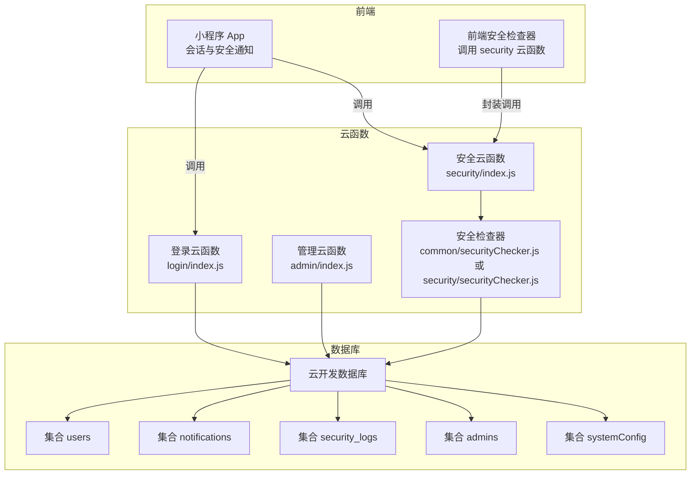
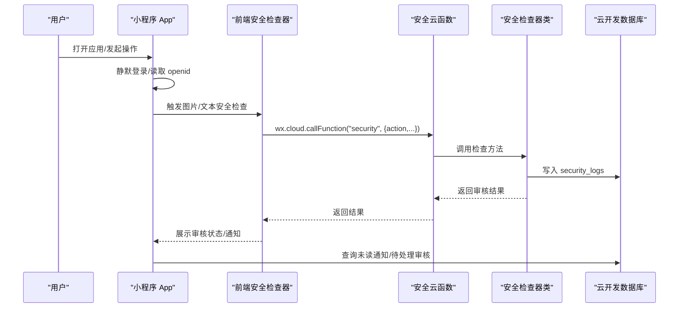
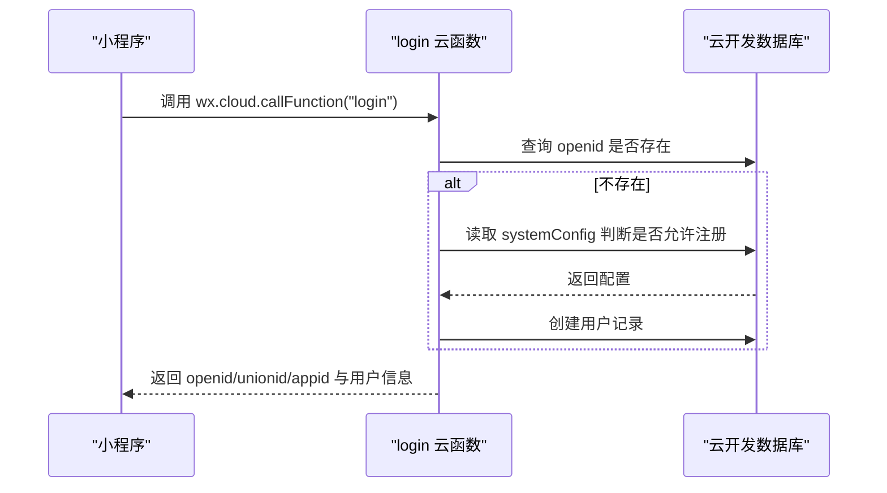
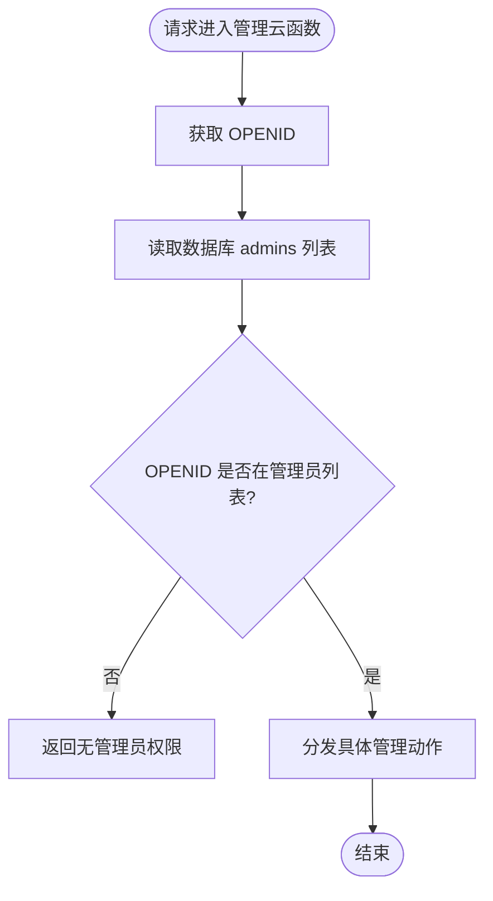
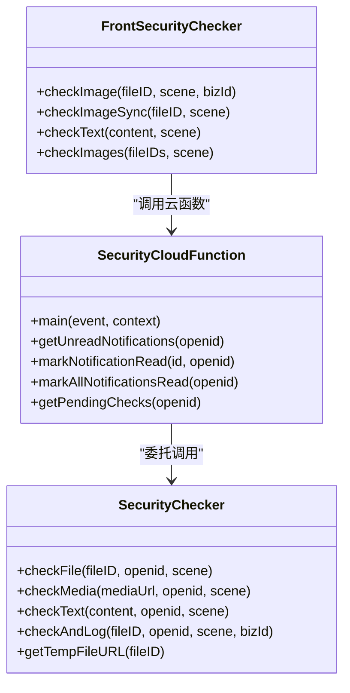
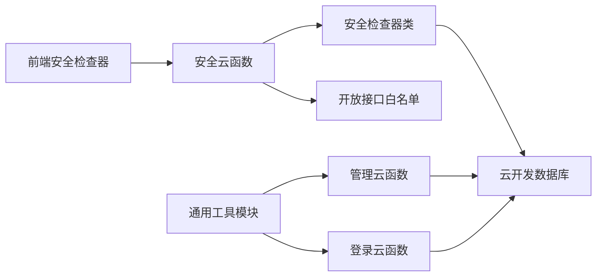

# 安全与权限

<cite>
**本文引用的文件**
- [cloudfunctions/common/securityChecker.js](file://cloudfunctions/common/securityChecker.js)
- [cloudfunctions/security/index.js](file://cloudfunctions/security/index.js)
- [cloudfunctions/security/securityChecker.js](file://cloudfunctions/security/securityChecker.js)
- [miniprogram/utils/securityChecker.js](file://miniprogram/utils/securityChecker.js)
- [cloudfunctions/admin/index.js](file://cloudfunctions/admin/index.js)
- [cloudfunctions/login/index.js](file://cloudfunctions/login/index.js)
- [cloudfunctions/common/utils.js](file://cloudfunctions/common/utils.js)
- [cloudfunctions/admin/utils.js](file://cloudfunctions/admin/utils.js)
- [cloudfunctions/pet/utils.js](file://cloudfunctions/pet/utils.js)
- [cloudfunctions/record/utils.js](file://cloudfunctions/record/utils.js)
- [cloudfunctions/reminder/utils.js](file://cloudfunctions/reminder/utils.js)
- [miniprogram/app.js](file://miniprogram/app.js)
- [cloudfunctions/security/config.json](file://cloudfunctions/security/config.json)
- [cloudfunctions/admin/config.json](file://cloudfunctions/admin/config.json)
- [cloudfunctions/login/config.json](file://cloudfunctions/login/config.json)
- [cloudfunctions/pet/config.json](file://cloudfunctions/pet/config.json)
- [cloudfunctions/record/config.json](file://cloudfunctions/record/config.json)
</cite>

## 目录
1. [引言](#引言)
2. [项目结构](#项目结构)
3. [核心组件](#核心组件)
4. [架构总览](#架构总览)
5. [详细组件分析](#详细组件分析)
6. [依赖关系分析](#依赖关系分析)
7. [性能考量](#性能考量)
8. [故障排查指南](#故障排查指南)
9. [结论](#结论)
10. [附录](#附录)

## 引言
本文件聚焦“养龟档案”项目的安全与权限控制体系，覆盖用户认证、权限管理、安全检查、云函数安全实现、数据访问控制、API防护策略、前端安全措施、敏感数据保护、会话管理、安全审计与合规、漏洞防护与应急响应、权限模型与角色分配、以及安全开发最佳实践与测试方法。文档以代码为依据，结合架构图与流程图，帮助开发者快速理解并改进系统的安全性。

## 项目结构
项目采用前后端分离与云函数协作的模式：
- 前端（微信小程序）负责用户交互、会话状态管理、调用云函数、展示安全通知与待处理审核。
- 云函数（wx-server-sdk）提供认证、权限校验、内容安全审核、统计与管理接口等能力。
- 数据库（云开发数据库）承载用户、宠物、足迹、系统配置、安全日志、通知等数据。
- 权限配置文件（config.json）声明云函数开放的API白名单。

图表来源
- [miniprogram/app.js:1-312](file://miniprogram/app.js#L1-L312)
- [cloudfunctions/login/index.js:1-148](file://cloudfunctions/login/index.js#L1-L148)
- [cloudfunctions/admin/index.js:1-533](file://cloudfunctions/admin/index.js#L1-L533)
- [cloudfunctions/security/index.js:1-200](file://cloudfunctions/security/index.js#L1-L200)
- [cloudfunctions/common/securityChecker.js:1-226](file://cloudfunctions/common/securityChecker.js#L1-L226)
- [cloudfunctions/security/securityChecker.js:1-206](file://cloudfunctions/security/securityChecker.js#L1-L206)

章节来源
- [miniprogram/app.js:1-312](file://miniprogram/app.js#L1-L312)
- [cloudfunctions/login/index.js:1-148](file://cloudfunctions/login/index.js#L1-L148)
- [cloudfunctions/admin/index.js:1-533](file://cloudfunctions/admin/index.js#L1-L533)
- [cloudfunctions/security/index.js:1-200](file://cloudfunctions/security/index.js#L1-L200)
- [cloudfunctions/common/securityChecker.js:1-226](file://cloudfunctions/common/securityChecker.js#L1-L226)
- [cloudfunctions/security/securityChecker.js:1-206](file://cloudfunctions/security/securityChecker.js#L1-L206)

## 核心组件
- 用户认证与会话
  - 登录云函数负责首次拉起用户记录、返回 openid/unionid/appid，并支持更新用户信息与公开名片。
  - 小程序 App 在启动时静默登录，持久化 openid，必要时弹窗引导登录。
- 权限管理
  - 管理员权限：通过数据库 admins 表或兜底配置判断管理员身份，仅管理员可访问管理云函数。
  - 云函数权限白名单：通过 config.json 的 openapi 字段声明允许调用的云开发开放接口。
- 内容安全审核
  - 前端安全检查器统一封装对 security 云函数的调用，支持图片异步审核、同步审核、文本审核与批量处理。
  - 安全云函数与安全检查器封装腾讯云内容安全接口，记录审核日志与通知。
- 数据访问控制
  - 云函数统一通过 wx-server-sdk 获取上下文 openid，结合业务逻辑进行数据访问与写入。
  - 管理云函数对用户、宠物、足迹等数据进行查询与管理，涉及事务与批量删除。

章节来源
- [cloudfunctions/login/index.js:38-147](file://cloudfunctions/login/index.js#L38-L147)
- [miniprogram/app.js:84-140](file://miniprogram/app.js#L84-L140)
- [cloudfunctions/admin/index.js:27-71](file://cloudfunctions/admin/index.js#L27-L71)
- [cloudfunctions/admin/config.json:1-6](file://cloudfunctions/admin/config.json#L1-L6)
- [cloudfunctions/security/config.json:1-9](file://cloudfunctions/security/config.json#L1-L9)
- [miniprogram/utils/securityChecker.js:13-122](file://miniprogram/utils/securityChecker.js#L13-L122)
- [cloudfunctions/security/index.js:15-64](file://cloudfunctions/security/index.js#L15-L64)
- [cloudfunctions/common/securityChecker.js:30-226](file://cloudfunctions/common/securityChecker.js#L30-L226)
- [cloudfunctions/security/securityChecker.js:30-206](file://cloudfunctions/security/securityChecker.js#L30-L206)

## 架构总览
下图展示了从前端到云函数再到数据库的典型调用链路，以及安全检查与通知的闭环。

图表来源
- [miniprogram/app.js:267-288](file://miniprogram/app.js#L267-L288)
- [miniprogram/utils/securityChecker.js:22-41](file://miniprogram/utils/securityChecker.js#L22-L41)
- [cloudfunctions/security/index.js:15-64](file://cloudfunctions/security/index.js#L15-L64)
- [cloudfunctions/common/securityChecker.js:180-207](file://cloudfunctions/common/securityChecker.js#L180-L207)

## 详细组件分析

### 用户认证与会话管理
- 登录流程
  - 小程序启动时调用 login 云函数，获取 openid/unionid/appid，若用户不存在则按系统配置创建用户记录。
  - 成功后持久化 openid，后续页面可直接使用。
- 会话与登录态
  - App 提供 requireLogin/promptLogin/forceLogin/logout 等方法，确保关键功能受登录态保护。
  - 登出时清理本地存储并重定向首页。
- 安全注意
  - 建议在登录云函数中增加 IP/频率限制与风控参数校验，防止滥用。
  - 对用户信息更新接口增加输入校验与字段白名单。

图表来源
- [cloudfunctions/login/index.js:38-147](file://cloudfunctions/login/index.js#L38-L147)
- [miniprogram/app.js:84-140](file://miniprogram/app.js#L84-L140)

章节来源
- [cloudfunctions/login/index.js:38-147](file://cloudfunctions/login/index.js#L38-L147)
- [miniprogram/app.js:84-140](file://miniprogram/app.js#L84-L140)
- [miniprogram/app.js:176-256](file://miniprogram/app.js#L176-L256)

### 权限管理与管理员控制
- 管理员判定
  - 优先从数据库 admins 集合读取启用的管理员列表，失败时回退到配置中的固定 openid。
  - 仅管理员可调用管理云函数的增删改查与统计接口。
- 权限白名单
  - 各云函数通过 config.json 的 openapi 字段声明允许调用的云开发开放接口，减少越权风险。
- 数据访问控制
  - 管理云函数在执行用户/宠物/足迹等操作前进行权限校验，涉及事务与批量删除，保证一致性。

图表来源
- [cloudfunctions/admin/index.js:27-71](file://cloudfunctions/admin/index.js#L27-L71)
- [cloudfunctions/admin/config.json:1-6](file://cloudfunctions/admin/config.json#L1-L6)

章节来源
- [cloudfunctions/admin/index.js:11-71](file://cloudfunctions/admin/index.js#L11-L71)
- [cloudfunctions/admin/config.json:1-6](file://cloudfunctions/admin/config.json#L1-L6)

### 内容安全审核与通知
- 前端安全检查器
  - 封装对 security 云函数的调用，支持异步提交审核（checkImage）、同步等待结果（checkImageSync）、文本审核（checkText）与批量图片检查。
  - 审核失败时前端可选择放行策略，避免影响用户体验。
- 安全云函数与检查器
  - 安全云函数根据 action 分发至检查器类，检查器类对接腾讯云内容安全接口，记录 security_logs。
  - 提供未读通知查询、标记已读、标记全部已读、查询待回调（pending）审核记录等功能。
- 通知与超时处理
  - 前端在 onShow 时检查未读通知与超时待处理审核，提示用户并引导处理。

图表来源
- [cloudfunctions/common/securityChecker.js:30-226](file://cloudfunctions/common/securityChecker.js#L30-L226)
- [cloudfunctions/security/index.js:15-200](file://cloudfunctions/security/index.js#L15-L200)
- [miniprogram/utils/securityChecker.js:13-122](file://miniprogram/utils/securityChecker.js#L13-L122)

章节来源
- [miniprogram/utils/securityChecker.js:13-122](file://miniprogram/utils/securityChecker.js#L13-L122)
- [cloudfunctions/security/index.js:15-200](file://cloudfunctions/security/index.js#L15-L200)
- [cloudfunctions/common/securityChecker.js:30-226](file://cloudfunctions/common/securityChecker.js#L30-L226)
- [cloudfunctions/security/securityChecker.js:30-206](file://cloudfunctions/security/securityChecker.js#L30-L206)

### 数据访问控制与API防护
- 统一工具模块
  - 各云函数通用工具模块提供 initCloud/getDB/getOpenId/successResponse/errorResponse/wrapAction/normalizeId 等方法，规范错误处理与响应格式。
- 云函数权限白名单
  - security 云函数开放 security.mediaCheckAsync 与 security.msgSecCheck；其余云函数未声明开放接口，默认仅允许基础云函数调用。
- 输入校验与异常处理
  - 安全检查器与各云函数均对必填参数进行校验，捕获异常并返回标准化错误信息，避免泄露内部细节。

章节来源
- [cloudfunctions/common/utils.js:1-69](file://cloudfunctions/common/utils.js#L1-L69)
- [cloudfunctions/admin/utils.js:1-69](file://cloudfunctions/admin/utils.js#L1-L69)
- [cloudfunctions/pet/utils.js:1-69](file://cloudfunctions/pet/utils.js#L1-L69)
- [cloudfunctions/record/utils.js:1-69](file://cloudfunctions/record/utils.js#L1-L69)
- [cloudfunctions/reminder/utils.js:1-69](file://cloudfunctions/reminder/utils.js#L1-L69)
- [cloudfunctions/security/config.json:1-9](file://cloudfunctions/security/config.json#L1-L9)
- [cloudfunctions/login/config.json:1-6](file://cloudfunctions/login/config.json#L1-L6)
- [cloudfunctions/pet/config.json:1-6](file://cloudfunctions/pet/config.json#L1-L6)
- [cloudfunctions/record/config.json:1-6](file://cloudfunctions/record/config.json#L1-L6)

### 前端安全措施与敏感数据保护
- 会话管理
  - 通过本地存储 openid 实现会话保持；登出时清除敏感信息。
- 敏感数据保护
  - 不在前端打印或存储敏感字段；对用户隐私信息进行最小化采集与展示。
- 安全通知
  - 启动时与前台可见时检查未读通知与超时审核，提升用户对内容合规的认知。

章节来源
- [miniprogram/app.js:60-140](file://miniprogram/app.js#L60-L140)
- [miniprogram/app.js:267-288](file://miniprogram/app.js#L267-L288)

## 依赖关系分析
- 组件耦合
  - 前端安全检查器依赖安全云函数；安全云函数依赖安全检查器类；安全检查器类依赖云开发数据库与开放接口。
  - 管理云函数依赖数据库与通用工具模块；登录云函数依赖数据库与系统配置。
- 外部依赖
  - wx-server-sdk 提供云函数运行时与数据库访问；腾讯云内容安全接口提供审核能力。
- 权限与配置
  - config.json 的 openapi 字段定义了云函数可调用的开放接口范围，降低越权风险。

图表来源
- [miniprogram/utils/securityChecker.js:13-122](file://miniprogram/utils/securityChecker.js#L13-L122)
- [cloudfunctions/security/index.js:15-64](file://cloudfunctions/security/index.js#L15-L64)
- [cloudfunctions/common/securityChecker.js:30-226](file://cloudfunctions/common/securityChecker.js#L30-L226)
- [cloudfunctions/admin/index.js:1-533](file://cloudfunctions/admin/index.js#L1-L533)
- [cloudfunctions/login/index.js:1-148](file://cloudfunctions/login/index.js#L1-148)
- [cloudfunctions/common/utils.js:1-69](file://cloudfunctions/common/utils.js#L1-L69)
- [cloudfunctions/security/config.json:1-9](file://cloudfunctions/security/config.json#L1-L9)

章节来源
- [cloudfunctions/common/utils.js:1-69](file://cloudfunctions/common/utils.js#L1-L69)
- [cloudfunctions/admin/index.js:1-533](file://cloudfunctions/admin/index.js#L1-L533)
- [cloudfunctions/login/index.js:1-148](file://cloudfunctions/login/index.js#L1-L148)
- [cloudfunctions/security/config.json:1-9](file://cloudfunctions/security/config.json#L1-L9)

## 性能考量
- 审核异步化
  - 图片审核采用异步提交，避免阻塞主线程；前端可轮询待处理审核或接收通知提示。
- 批量处理
  - 前端支持批量图片检查，减少重复调用次数。
- 数据库查询优化
  - 管理云函数在查询用户/宠物/足迹时使用索引字段与分页，避免全表扫描。
- 事务与一致性
  - 删除用户时使用事务，确保关联数据一致性，减少碎片数据。

章节来源
- [miniprogram/utils/securityChecker.js:95-106](file://miniprogram/utils/securityChecker.js#L95-L106)
- [cloudfunctions/admin/index.js:227-258](file://cloudfunctions/admin/index.js#L227-L258)

## 故障排查指南
- 审核接口调用失败
  - 检查 media_url 是否可公网访问；确认 fileID 转换为临时 URL 成功；查看错误码与日志。
- 审核结果未回调
  - 前端定期检查 security_logs 中 pending 状态且超时的记录，标记为 timeout 并提示用户。
- 通知未显示
  - 确认用户已登录；检查 notifications 集合中 openid 与 isRead 字段；确认前端通知管理器可用。
- 管理员权限不足
  - 检查 admins 集合中 enabled=true 的管理员列表；确认 OPENID 匹配；检查 config.json 权限配置。

章节来源
- [cloudfunctions/common/securityChecker.js:74-105](file://cloudfunctions/common/securityChecker.js#L74-L105)
- [cloudfunctions/security/index.js:151-200](file://cloudfunctions/security/index.js#L151-L200)
- [cloudfunctions/admin/index.js:31-38](file://cloudfunctions/admin/index.js#L31-L38)

## 结论
本项目通过“前端安全检查器 + 安全云函数 + 安全检查器类 + 数据库”的组合，实现了内容安全审核与通知闭环；通过管理员权限校验与权限白名单，降低了越权风险；通过统一工具模块与标准化响应，提升了可维护性。建议进一步完善风控参数校验、接口限流、日志审计与合规策略，持续提升整体安全性。

## 附录

### 权限模型与角色分配
- 角色
  - 普通用户：可使用登录、基本资料管理、内容发布与审核通知查看。
  - 管理员：具备用户/宠物/足迹等数据的查询与管理权限，支持系统配置更新与统计分析。
- 权限分配
  - 管理员列表优先来自数据库 admins 集合，失败时回退到配置中的固定 openid。
  - 云函数通过 config.json 的 openapi 白名单限制可调用的开放接口。

章节来源
- [cloudfunctions/admin/index.js:11-38](file://cloudfunctions/admin/index.js#L11-L38)
- [cloudfunctions/admin/config.json:1-6](file://cloudfunctions/admin/config.json#L1-L6)
- [cloudfunctions/security/config.json:1-9](file://cloudfunctions/security/config.json#L1-L9)

### 安全审计与合规
- 审计要点
  - 记录 security_logs 审核轨迹与状态；记录管理员操作与变更；记录登录与登出事件。
- 合规建议
  - 明确数据最小化原则；对敏感字段加密存储；建立数据保留与删除策略；定期备份与恢复演练。

章节来源
- [cloudfunctions/common/securityChecker.js:180-207](file://cloudfunctions/common/securityChecker.js#L180-L207)
- [cloudfunctions/admin/index.js:476-508](file://cloudfunctions/admin/index.js#L476-L508)

### 安全开发最佳实践
- 编码规范
  - 参数校验与输入净化；错误信息脱敏；统一异常处理；最小权限原则。
- 代码审查
  - 关注权限校验、敏感数据处理、日志记录与错误返回；检查 openapi 白名单配置。
- 安全测试
  - 单元测试覆盖边界条件；集成测试验证权限与数据一致性；压力测试评估审核接口吞吐。

章节来源
- [cloudfunctions/common/utils.js:20-44](file://cloudfunctions/common/utils.js#L20-L44)
- [cloudfunctions/security/config.json:1-9](file://cloudfunctions/security/config.json#L1-L9)