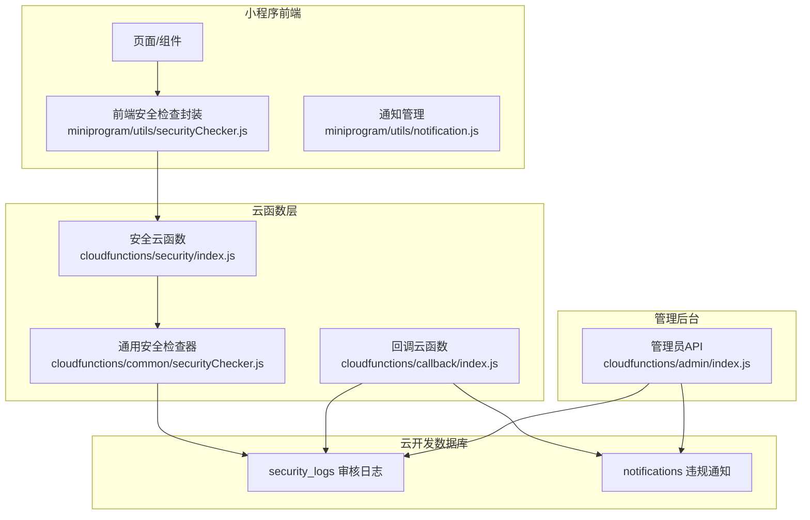
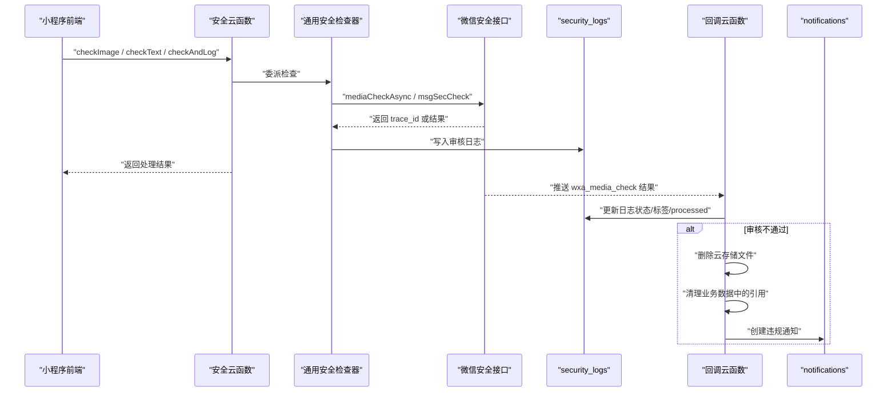
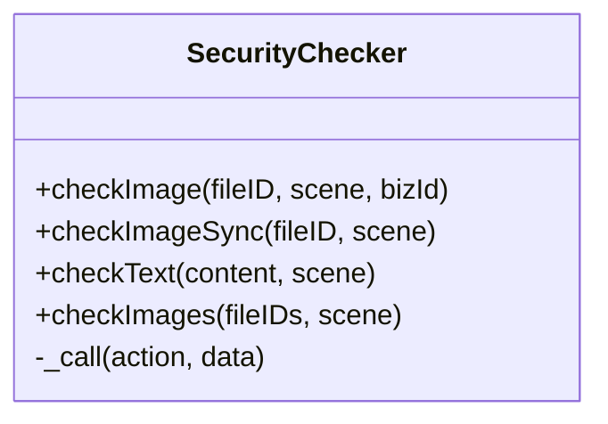
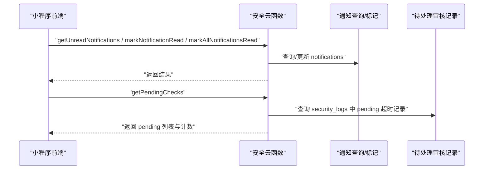
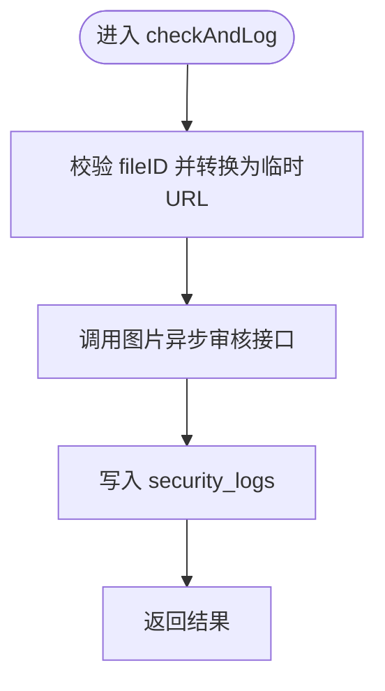
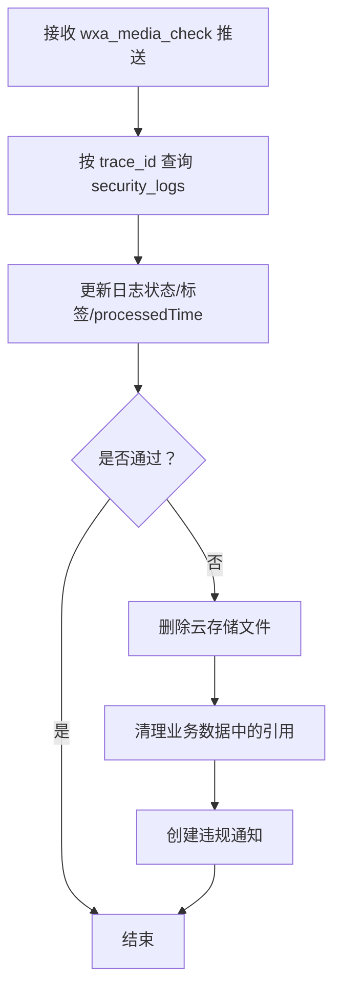
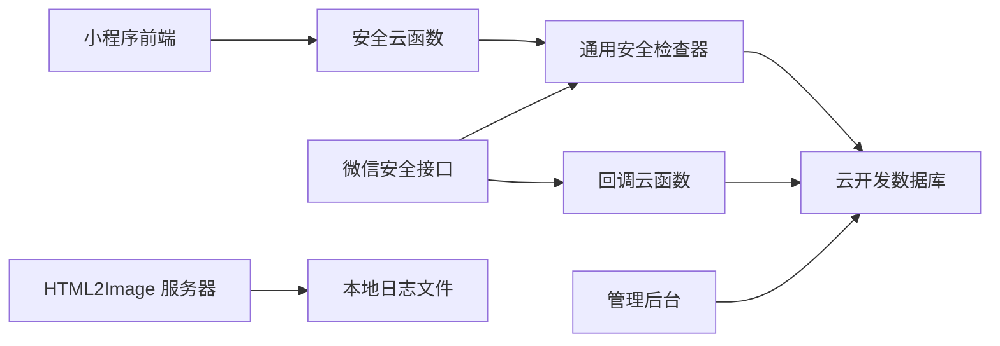
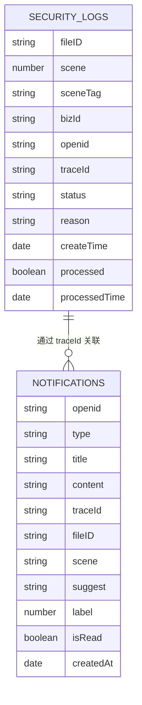

# 安全审计与监控

<cite>
**本文档引用的文件**
- [cloudfunctions/common/securityChecker.js](file://cloudfunctions/common/securityChecker.js)
- [cloudfunctions/security/index.js](file://cloudfunctions/security/index.js)
- [cloudfunctions/security/securityChecker.js](file://cloudfunctions/security/securityChecker.js)
- [cloudfunctions/security/config.json](file://cloudfunctions/security/config.json)
- [cloudfunctions/callback/index.js](file://cloudfunctions/callback/index.js)
- [cloudfunctions/callback/config.json](file://cloudfunctions/callback/config.json)
- [miniprogram/utils/securityChecker.js](file://miniprogram/utils/securityChecker.js)
- [miniprogram/utils/notification.js](file://miniprogram/utils/notification.js)
- [cloudfunctions/admin/index.js](file://cloudfunctions/admin/index.js)
- [cloudfunctions/admin/utils.js](file://cloudfunctions/admin/utils.js)
- [cloudfunctions/record/index.js](file://cloudfunctions/record/index.js)
- [cloudfunctions/record/utils.js](file://cloudfunctions/record/utils.js)
- [cloudfunctions/pet/index.js](file://cloudfunctions/pet/index.js)
- [cloudfunctions/pet/utils.js](file://cloudfunctions/pet/utils.js)
- [html2image-server/logger.js](file://html2image-server/logger.js)
- [server-setup/database.sql](file://server-setup/database.sql)
</cite>

## 目录
1. [引言](#引言)
2. [项目结构](#项目结构)
3. [核心组件](#核心组件)
4. [架构总览](#架构总览)
5. [详细组件分析](#详细组件分析)
6. [依赖关系分析](#依赖关系分析)
7. [性能考量](#性能考量)
8. [故障排查指南](#故障排查指南)
9. [结论](#结论)
10. [附录](#附录)

## 引言
本文件面向开发者与运维人员，系统化梳理“安全审计与监控”体系，覆盖以下方面：
- 安全事件记录与审计日志采集
- 异常行为检测机制与内容安全审核
- 用户行为监控、访问模式分析与安全威胁识别
- 云函数安全日志、数据库操作审计与API调用监控
- 实时告警机制、安全事件响应与应急处置流程
- 安全指标统计、风险评估与合规性检查
- 日志分析工具、安全仪表板与审计报告生成
- 安全监控配置指南、告警处理流程与安全事件调查方法

## 项目结构
围绕安全审计与监控的关键模块包括：
- 前端安全检查封装与通知管理
- 云函数安全审核与回调处理
- 审核日志与违规通知数据库模型
- 管理后台统计与报表能力
- 服务器侧日志记录与分析

**图表来源**
- [cloudfunctions/security/index.js:15-64](file://cloudfunctions/security/index.js#L15-L64)
- [cloudfunctions/callback/index.js:42-52](file://cloudfunctions/callback/index.js#L42-L52)
- [cloudfunctions/common/securityChecker.js:188-207](file://cloudfunctions/common/securityChecker.js#L188-L207)
- [cloudfunctions/admin/index.js:74-87](file://cloudfunctions/admin/index.js#L74-L87)

**章节来源**
- [cloudfunctions/security/index.js:15-64](file://cloudfunctions/security/index.js#L15-L64)
- [cloudfunctions/callback/index.js:42-52](file://cloudfunctions/callback/index.js#L42-L52)
- [cloudfunctions/common/securityChecker.js:188-207](file://cloudfunctions/common/securityChecker.js#L188-L207)
- [cloudfunctions/admin/index.js:74-87](file://cloudfunctions/admin/index.js#L74-L87)

## 核心组件
- 前端安全检查封装：提供图片/文本异步与同步审核、批量检查与错误降级策略。
- 云函数安全检查器：封装云开发安全接口调用、文件URL转换、审核日志入库。
- 回调处理云函数：接收微信异步审核结果，更新日志状态、清理违规资源、下发违规通知。
- 审核日志与通知数据库：记录trace_id、场景、建议、标签、状态、处理时间等。
- 管理后台统计：聚合用户、宠物、足迹数量，生成趋势与分布报表。

**章节来源**
- [miniprogram/utils/securityChecker.js:13-107](file://miniprogram/utils/securityChecker.js#L13-L107)
- [cloudfunctions/common/securityChecker.js:30-207](file://cloudfunctions/common/securityChecker.js#L30-L207)
- [cloudfunctions/callback/index.js:57-109](file://cloudfunctions/callback/index.js#L57-L109)
- [cloudfunctions/admin/index.js:74-87](file://cloudfunctions/admin/index.js#L74-L87)

## 架构总览
整体采用“前端触发+云函数处理+回调闭环+数据库审计”的闭环架构，结合管理后台统计与报表能力，形成从“事件采集—日志记录—异常处理—通知告知—统计分析”的完整链路。

**图表来源**
- [cloudfunctions/security/index.js:22-39](file://cloudfunctions/security/index.js#L22-L39)
- [cloudfunctions/common/securityChecker.js:74-105](file://cloudfunctions/common/securityChecker.js#L74-L105)
- [cloudfunctions/callback/index.js:57-109](file://cloudfunctions/callback/index.js#L57-L109)

## 详细组件分析

### 组件A：前端安全检查封装
- 功能要点
  - 异步审核：上传后触发后台审核，不阻塞主线程。
  - 同步审核：等待结果后再执行后续业务逻辑。
  - 文本审核：对评论、论坛等场景进行内容安全检测。
  - 批量图片审核：对多张图片独立触发异步审核。
  - 错误降级：当审核服务不可用时，默认放行，保证用户体验。
- 关键路径
  - [miniprogram/utils/securityChecker.js:50-74](file://miniprogram/utils/securityChecker.js#L50-L74)
  - [miniprogram/utils/securityChecker.js:82-92](file://miniprogram/utils/securityChecker.js#L82-L92)
  - [miniprogram/utils/securityChecker.js:99-106](file://miniprogram/utils/securityChecker.js#L99-L106)

**图表来源**
- [miniprogram/utils/securityChecker.js:13-107](file://miniprogram/utils/securityChecker.js#L13-L107)

**章节来源**
- [miniprogram/utils/securityChecker.js:13-107](file://miniprogram/utils/securityChecker.js#L13-L107)

### 组件B：云函数安全检查器与薄包装层
- 功能要点
  - 薄包装层：根据 action 分发至具体检查逻辑。
  - 通知查询与标记：提供未读通知查询、单条/全部标记已读。
  - 待处理审核记录：查询超过阈值时间仍未回调的记录并标记超时。
- 关键路径
  - [cloudfunctions/security/index.js:15-64](file://cloudfunctions/security/index.js#L15-L64)
  - [cloudfunctions/security/index.js:69-98](file://cloudfunctions/security/index.js#L69-L98)
  - [cloudfunctions/security/index.js:151-199](file://cloudfunctions/security/index.js#L151-L199)

**图表来源**
- [cloudfunctions/security/index.js:69-98](file://cloudfunctions/security/index.js#L69-L98)
- [cloudfunctions/security/index.js:151-199](file://cloudfunctions/security/index.js#L151-L199)

**章节来源**
- [cloudfunctions/security/index.js:15-64](file://cloudfunctions/security/index.js#L15-L64)
- [cloudfunctions/security/index.js:69-98](file://cloudfunctions/security/index.js#L69-L98)
- [cloudfunctions/security/index.js:151-199](file://cloudfunctions/security/index.js#L151-L199)

### 组件C：通用安全检查器（核心逻辑）
- 功能要点
  - 场景映射：avatar/cover/pet/footprint/comment 等场景到数值映射。
  - 文件URL转换：将 cloud:// 文件ID转为临时HTTP URL。
  - 图片异步审核：调用微信安全接口，返回 trace_id 并记录日志。
  - 文本审核：调用微信安全接口，返回建议与标签。
  - 审核并记录：统一入口，写入 security_logs。
- 关键路径
  - [cloudfunctions/common/securityChecker.js:10-28](file://cloudfunctions/common/securityChecker.js#L10-L28)
  - [cloudfunctions/common/securityChecker.js:74-105](file://cloudfunctions/common/securityChecker.js#L74-L105)
  - [cloudfunctions/common/securityChecker.js:115-149](file://cloudfunctions/common/securityChecker.js#L115-L149)
  - [cloudfunctions/common/securityChecker.js:188-207](file://cloudfunctions/common/securityChecker.js#L188-L207)

**图表来源**
- [cloudfunctions/common/securityChecker.js:159-207](file://cloudfunctions/common/securityChecker.js#L159-L207)

**章节来源**
- [cloudfunctions/common/securityChecker.js:10-28](file://cloudfunctions/common/securityChecker.js#L10-L28)
- [cloudfunctions/common/securityChecker.js:74-105](file://cloudfunctions/common/securityChecker.js#L74-L105)
- [cloudfunctions/common/securityChecker.js:115-149](file://cloudfunctions/common/securityChecker.js#L115-L149)
- [cloudfunctions/common/securityChecker.js:188-207](file://cloudfunctions/common/securityChecker.js#L188-L207)

### 组件D：回调处理与违规处置
- 功能要点
  - 接收微信推送的 wxa_media_check 事件。
  - 根据 trace_id 查找对应日志，更新状态、标签、处理标志与时间。
  - 审核不通过时：
    - 删除云存储文件；
    - 清理业务数据中的图片引用（用户头像/封面、宠物相册、足迹相册）；
    - 创建违规通知。
- 关键路径
  - [cloudfunctions/callback/index.js:57-109](file://cloudfunctions/callback/index.js#L57-L109)
  - [cloudfunctions/callback/index.js:114-197](file://cloudfunctions/callback/index.js#L114-L197)
  - [cloudfunctions/callback/index.js:202-223](file://cloudfunctions/callback/index.js#L202-L223)

**图表来源**
- [cloudfunctions/callback/index.js:57-109](file://cloudfunctions/callback/index.js#L57-L109)
- [cloudfunctions/callback/index.js:114-197](file://cloudfunctions/callback/index.js#L114-L197)
- [cloudfunctions/callback/index.js:202-223](file://cloudfunctions/callback/index.js#L202-L223)

**章节来源**
- [cloudfunctions/callback/index.js:57-109](file://cloudfunctions/callback/index.js#L57-L109)
- [cloudfunctions/callback/index.js:114-197](file://cloudfunctions/callback/index.js#L114-L197)
- [cloudfunctions/callback/index.js:202-223](file://cloudfunctions/callback/index.js#L202-L223)

### 组件E：管理后台统计与报表
- 功能要点
  - 统计用户、宠物、足迹总数。
  - 计算今日活跃用户（今日创建足迹的用户数）。
  - 用户增长趋势（按周几统计）。
  - 宠物类型分布（百分比）。
- 关键路径
  - [cloudfunctions/admin/index.js:74-87](file://cloudfunctions/admin/index.js#L74-L87)
  - [cloudfunctions/admin/index.js:382-410](file://cloudfunctions/admin/index.js#L382-L410)
  - [cloudfunctions/admin/index.js:412-431](file://cloudfunctions/admin/index.js#L412-L431)

**章节来源**
- [cloudfunctions/admin/index.js:74-87](file://cloudfunctions/admin/index.js#L74-L87)
- [cloudfunctions/admin/index.js:382-410](file://cloudfunctions/admin/index.js#L382-L410)
- [cloudfunctions/admin/index.js:412-431](file://cloudfunctions/admin/index.js#L412-L431)

### 组件F：数据库模型与权限配置
- 审核日志表 security_logs
  - 字段：fileID、scene、sceneTag、bizId、openid、traceId、status、reason、createTime、processed、processedTime。
  - 用途：记录每次审核请求与结果，支撑回溯与统计。
- 违规通知表 notifications
  - 字段：openid、type、title、content、traceId、fileID、scene、suggest、label、isRead、createdAt。
  - 用途：向用户推送违规通知。
- 权限配置
  - 安全云函数开启 security.mediaCheckAsync、security.msgSecCheck。
  - 回调云函数默认无 openapi 权限，仅接收微信推送。
- 关键路径
  - [cloudfunctions/common/securityChecker.js:188-207](file://cloudfunctions/common/securityChecker.js#L188-L207)
  - [cloudfunctions/callback/index.js:79-88](file://cloudfunctions/callback/index.js#L79-L88)
  - [cloudfunctions/callback/index.js:208-222](file://cloudfunctions/callback/index.js#L208-L222)
  - [cloudfunctions/security/config.json:1-8](file://cloudfunctions/security/config.json#L1-L8)
  - [cloudfunctions/callback/config.json:1-5](file://cloudfunctions/callback/config.json#L1-L5)

**章节来源**
- [cloudfunctions/common/securityChecker.js:188-207](file://cloudfunctions/common/securityChecker.js#L188-L207)
- [cloudfunctions/callback/index.js:79-88](file://cloudfunctions/callback/index.js#L79-L88)
- [cloudfunctions/callback/index.js:208-222](file://cloudfunctions/callback/index.js#L208-L222)
- [cloudfunctions/security/config.json:1-8](file://cloudfunctions/security/config.json#L1-L8)
- [cloudfunctions/callback/config.json:1-5](file://cloudfunctions/callback/config.json#L1-L5)

### 组件G：服务器侧日志记录与分析
- 功能要点
  - 服务器启动时创建日志目录。
  - 输出控制台日志并写入本地文件，按日期分割。
  - 提供 HTTP 请求、浏览器事件、请求开始/结束等日志接口。
- 关键路径
  - [html2image-server/logger.js:15-44](file://html2image-server/logger.js#L15-L44)
  - [html2image-server/logger.js:64-94](file://html2image-server/logger.js#L64-L94)

**章节来源**
- [html2image-server/logger.js:15-44](file://html2image-server/logger.js#L15-L44)
- [html2image-server/logger.js:64-94](file://html2image-server/logger.js#L64-L94)

## 依赖关系分析
- 前端依赖云函数：通过 wx.cloud.callFunction 调用安全云函数。
- 安全云函数依赖通用检查器：复用 checkFile/checkText/checkAndLog。
- 通用检查器依赖云开发数据库：写入 security_logs。
- 回调云函数依赖云开发数据库：更新 security_logs、创建 notifications。
- 管理后台依赖云开发数据库：读取统计与报表数据。
- 服务器侧日志独立于云开发，便于排查服务端问题。

**图表来源**
- [miniprogram/utils/securityChecker.js:22-41](file://miniprogram/utils/securityChecker.js#L22-L41)
- [cloudfunctions/security/index.js:19-20](file://cloudfunctions/security/index.js#L19-L20)
- [cloudfunctions/common/securityChecker.js:36-41](file://cloudfunctions/common/securityChecker.js#L36-L41)
- [cloudfunctions/callback/index.js:59-60](file://cloudfunctions/callback/index.js#L59-L60)
- [cloudfunctions/admin/index.js:74-87](file://cloudfunctions/admin/index.js#L74-L87)
- [html2image-server/logger.js:15-44](file://html2image-server/logger.js#L15-L44)

**章节来源**
- [miniprogram/utils/securityChecker.js:22-41](file://miniprogram/utils/securityChecker.js#L22-L41)
- [cloudfunctions/security/index.js:19-20](file://cloudfunctions/security/index.js#L19-L20)
- [cloudfunctions/common/securityChecker.js:36-41](file://cloudfunctions/common/securityChecker.js#L36-L41)
- [cloudfunctions/callback/index.js:59-60](file://cloudfunctions/callback/index.js#L59-L60)
- [cloudfunctions/admin/index.js:74-87](file://cloudfunctions/admin/index.js#L74-L87)
- [html2image-server/logger.js:15-44](file://html2image-server/logger.js#L15-L44)

## 性能考量
- 异步审核优先：前端使用 checkImage 异步提交，避免阻塞 UI。
- 错误降级：文本审核失败时默认放行，降低对业务的影响。
- 日志写入幂等：回调更新日志时以 trace_id 定位，避免重复处理。
- 查询限制：通知与待处理记录查询均设置 limit，防止大结果集影响性能。
- 服务器日志：按日期切分文件，避免单文件过大；忽略文件写入异常，减少抖动。

[本节为通用指导，不直接分析具体文件]

## 故障排查指南
- 审核接口调用失败
  - 检查安全云函数权限配置与微信开放接口授权。
  - 关注通用检查器的日志输出与返回码。
- 审核结果未回调
  - 在安全云函数中查询 security_logs 中 pending 超时记录。
  - 检查微信推送配置是否正确指向回调云函数。
- 违规内容未清理
  - 核对回调日志是否更新 processed 字段。
  - 检查云存储文件删除与业务数据清理是否成功。
- 通知未送达
  - 核对 notifications 表写入是否成功。
  - 检查前端通知管理的查询频率与节流策略。
- 服务器侧问题
  - 查看 HTML2Image 服务器日志文件，定位请求耗时与异常。

**章节来源**
- [cloudfunctions/security/config.json:1-8](file://cloudfunctions/security/config.json#L1-L8)
- [cloudfunctions/security/index.js:151-199](file://cloudfunctions/security/index.js#L151-L199)
- [cloudfunctions/callback/index.js:57-109](file://cloudfunctions/callback/index.js#L57-L109)
- [cloudfunctions/callback/index.js:208-222](file://cloudfunctions/callback/index.js#L208-L222)
- [miniprogram/utils/notification.js:41-46](file://miniprogram/utils/notification.js#L41-L46)
- [html2image-server/logger.js:64-94](file://html2image-server/logger.js#L64-L94)

## 结论
本项目通过“前端触发 + 云函数检查 + 回调闭环 + 数据库审计 + 管理统计”的架构，实现了从内容安全审核到异常处置、从日志记录到统计分析的全流程闭环。建议持续完善：
- 增加实时告警通道（如邮件/IM）与自动化处置脚本；
- 引入访问模式分析与异常行为检测规则；
- 完善合规性检查清单与审计报告模板；
- 加强服务器侧日志聚合与可视化仪表板。

[本节为总结性内容，不直接分析具体文件]

## 附录

### A. 安全监控配置指南
- 微信安全接口授权
  - 在安全云函数中启用 security.mediaCheckAsync、security.msgSecCheck。
- 回调推送配置
  - 在云开发控制台设置消息推送，事件类型为 wxa_media_check，目标云函数为 callback。
- 前端调用方式
  - 使用前端安全检查封装提供的接口进行图片/文本审核，并处理返回结果。

**章节来源**
- [cloudfunctions/security/config.json:1-8](file://cloudfunctions/security/config.json#L1-L8)
- [cloudfunctions/callback/index.js:6-19](file://cloudfunctions/callback/index.js#L6-L19)
- [miniprogram/utils/securityChecker.js:13-107](file://miniprogram/utils/securityChecker.js#L13-L107)

### B. 告警处理流程
- 审核不通过 → 自动删除违规文件 → 清理业务引用 → 发送违规通知 → 更新日志 processed。
- 前端定期查询未读通知与待处理审核记录，必要时提示用户或引导处理。

**章节来源**
- [cloudfunctions/callback/index.js:96-109](file://cloudfunctions/callback/index.js#L96-L109)
- [cloudfunctions/callback/index.js:114-197](file://cloudfunctions/callback/index.js#L114-L197)
- [cloudfunctions/callback/index.js:202-223](file://cloudfunctions/callback/index.js#L202-L223)
- [cloudfunctions/security/index.js:69-98](file://cloudfunctions/security/index.js#L69-L98)
- [cloudfunctions/security/index.js:151-199](file://cloudfunctions/security/index.js#L151-L199)

### C. 安全事件调查方法
- 依据 trace_id 在 security_logs 中定位原始请求与处理过程。
- 核对 notifications 中的通知内容与用户交互记录。
- 检查业务数据中是否存在残留引用，必要时进行二次清理。
- 对服务器侧异常，查看本地日志文件定位问题根因。

**章节来源**
- [cloudfunctions/callback/index.js:62-71](file://cloudfunctions/callback/index.js#L62-L71)
- [cloudfunctions/callback/index.js:79-88](file://cloudfunctions/callback/index.js#L79-L88)
- [cloudfunctions/callback/index.js:208-222](file://cloudfunctions/callback/index.js#L208-L222)
- [html2image-server/logger.js:64-94](file://html2image-server/logger.js#L64-L94)

### D. 数据模型图

**图表来源**
- [cloudfunctions/common/securityChecker.js:188-207](file://cloudfunctions/common/securityChecker.js#L188-L207)
- [cloudfunctions/callback/index.js:208-222](file://cloudfunctions/callback/index.js#L208-L222)