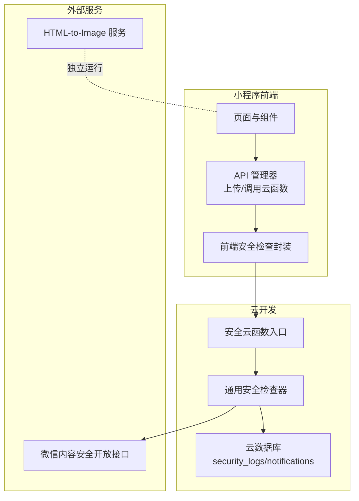
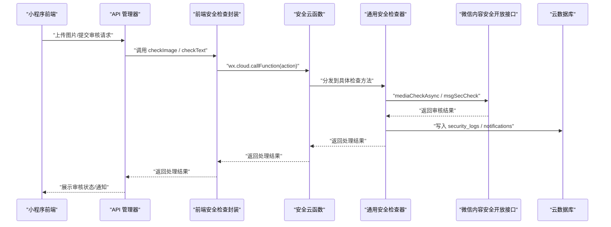
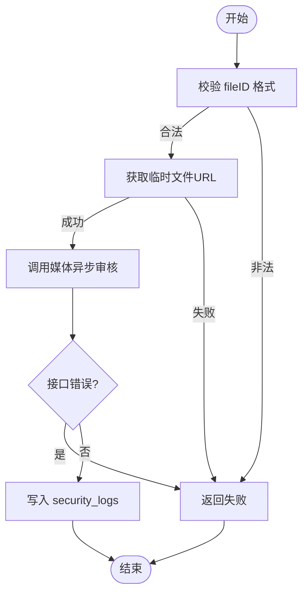
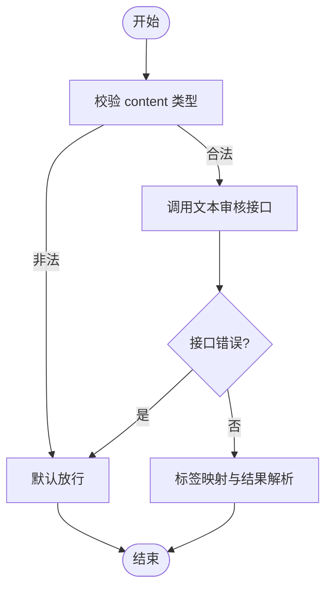
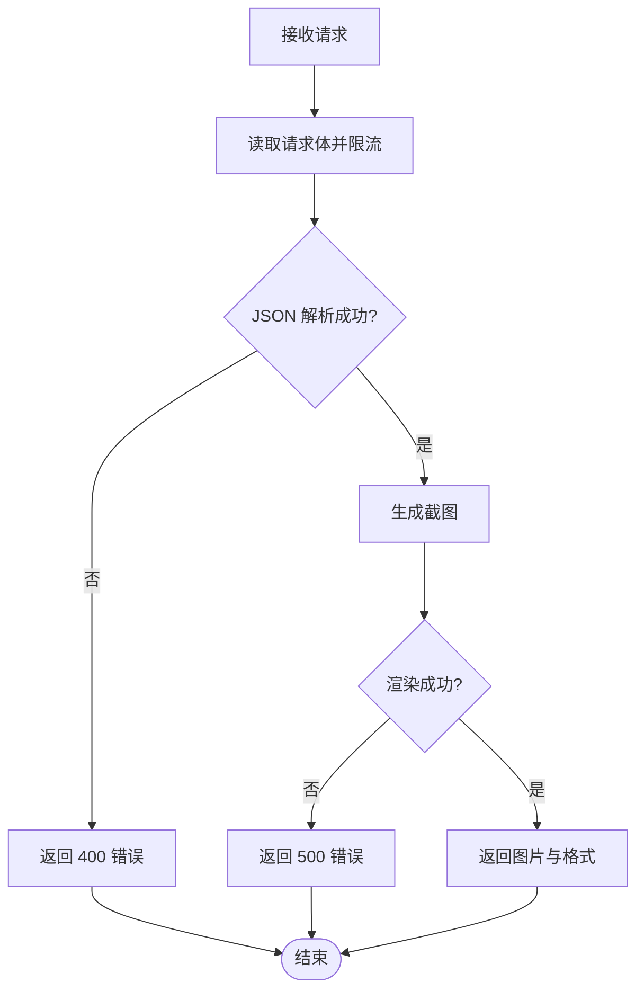
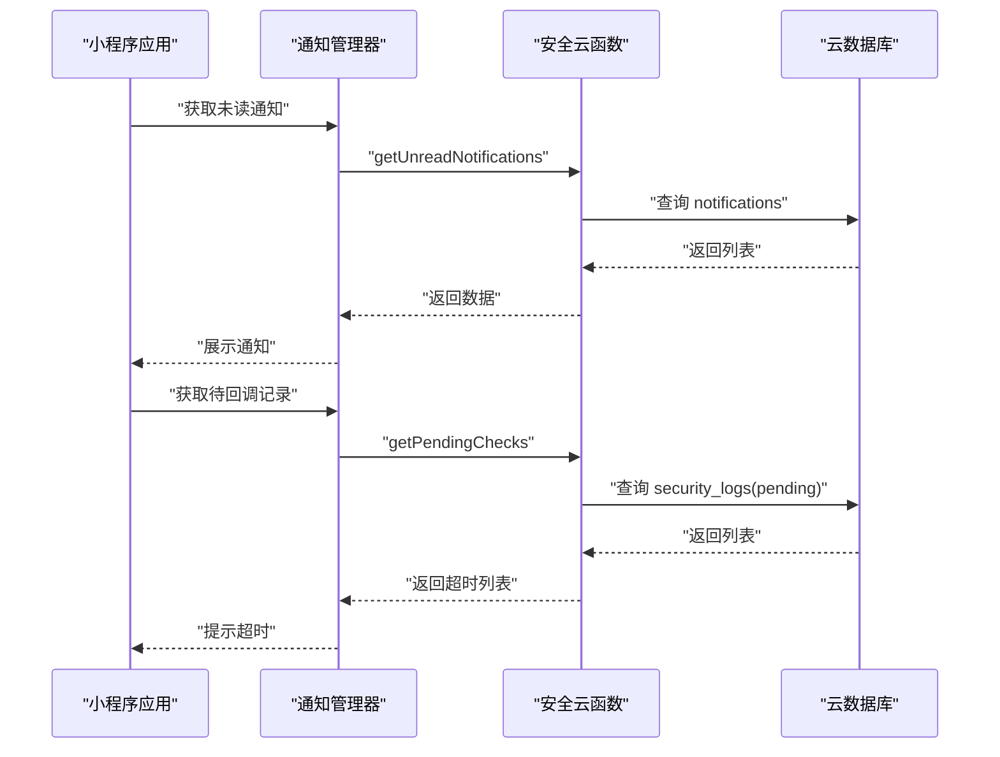
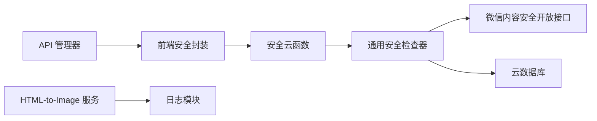

# 数据安全防护

<cite>
**本文引用的文件**   
- [cloudfunctions/common/securityChecker.js](file://cloudfunctions/common/securityChecker.js)
- [miniprogram/utils/securityChecker.js](file://miniprogram/utils/securityChecker.js)
- [cloudfunctions/security/index.js](file://cloudfunctions/security/index.js)
- [cloudfunctions/security/securityChecker.js](file://cloudfunctions/security/securityChecker.js)
- [miniprogram/utils/api.js](file://miniprogram/utils/api.js)
- [miniprogram/app.js](file://miniprogram/app.js)
- [cloudfunctions/admin/utils.js](file://cloudfunctions/admin/utils.js)
- [html2image-server/server.js](file://html2image-server/server.js)
- [html2image-server/logger.js](file://html2image-server/logger.js)
- [cloudfunctions/security/config.json](file://cloudfunctions/security/config.json)
</cite>

## 目录
1. [引言](#引言)
2. [项目结构](#项目结构)
3. [核心组件](#核心组件)
4. [架构总览](#架构总览)
5. [详细组件分析](#详细组件分析)
6. [依赖关系分析](#依赖关系分析)
7. [性能与安全特性](#性能与安全特性)
8. [故障排查指南](#故障排查指南)
9. [结论](#结论)
10. [附录](#附录)

## 引言
本文件围绕“数据安全防护”主题，系统梳理并解读本项目的敏感内容检测与违规处理机制，覆盖图片审核、文本审核、多媒体内容安全检查、数据传输与存储安全、隐私数据处理、输入验证与防护（SQL 注入/XSS）、数据脱敏、访问日志与泄露防护、敏感信息识别与风险评估，并面向开发者提供编码规范、安全测试方法与最佳实践。

## 项目结构
项目由小程序前端、云开发云函数、以及独立的 HTML 到图像转换服务组成。安全能力主要集中在云函数中的内容安全审核模块与前端的安全检查封装，辅以服务端日志与基础防护策略。

图表来源
- [miniprogram/utils/api.js:148-190](file://miniprogram/utils/api.js#L148-L190)
- [miniprogram/utils/securityChecker.js:13-107](file://miniprogram/utils/securityChecker.js#L13-L107)
- [cloudfunctions/security/index.js:15-64](file://cloudfunctions/security/index.js#L15-L64)
- [cloudfunctions/common/securityChecker.js:30-208](file://cloudfunctions/common/securityChecker.js#L30-L208)

章节来源
- [miniprogram/utils/api.js:148-190](file://miniprogram/utils/api.js#L148-L190)
- [miniprogram/utils/securityChecker.js:13-107](file://miniprogram/utils/securityChecker.js#L13-L107)
- [cloudfunctions/security/index.js:15-64](file://cloudfunctions/security/index.js#L15-L64)
- [cloudfunctions/common/securityChecker.js:30-208](file://cloudfunctions/common/securityChecker.js#L30-L208)

## 核心组件
- 前端安全检查封装：提供图片异步审核、文本同步审核、批量图片检查等能力，统一调用安全云函数。
- 安全云函数入口：薄包装层，按 action 分发至通用检查器，同时提供通知与待回调记录查询。
- 通用安全检查器：封装微信内容安全开放接口调用、文件 URL 获取、审核日志入库、场景映射与标签映射。
- API 管理器：统一封装云函数调用、图片上传与安全检查联动。
- 应用生命周期：在启动与前台可见时检查安全通知与待回调记录。
- 日志与监控：HTML-to-Image 服务提供请求级日志与健康检查，便于审计与问题定位。

章节来源
- [miniprogram/utils/securityChecker.js:13-107](file://miniprogram/utils/securityChecker.js#L13-L107)
- [cloudfunctions/security/index.js:15-64](file://cloudfunctions/security/index.js#L15-L64)
- [cloudfunctions/common/securityChecker.js:30-208](file://cloudfunctions/common/securityChecker.js#L30-L208)
- [miniprogram/utils/api.js:148-190](file://miniprogram/utils/api.js#L148-L190)
- [miniprogram/app.js:267-288](file://miniprogram/app.js#L267-L288)
- [html2image-server/server.js:208-330](file://html2image-server/server.js#L208-L330)
- [html2image-server/logger.js:64-94](file://html2image-server/logger.js#L64-L94)

## 架构总览
整体安全架构采用“前端触发 + 云函数处理 + 开放接口校验 + 数据库记录”的闭环设计。前端负责触发与展示，云函数负责调用微信内容安全接口并落库，数据库用于记录审核轨迹与违规通知，服务端日志用于审计与排障。

图表来源
- [miniprogram/utils/api.js:148-190](file://miniprogram/utils/api.js#L148-L190)
- [miniprogram/utils/securityChecker.js:22-41](file://miniprogram/utils/securityChecker.js#L22-L41)
- [cloudfunctions/security/index.js:22-39](file://cloudfunctions/security/index.js#L22-L39)
- [cloudfunctions/common/securityChecker.js:74-105](file://cloudfunctions/common/securityChecker.js#L74-L105)
- [cloudfunctions/common/securityChecker.js:115-149](file://cloudfunctions/common/securityChecker.js#L115-L149)

## 详细组件分析

### 图片审核实现
- 文件 ID 转临时 URL：通过云 SDK 获取临时可访问 URL，再调用媒体异步审核接口。
- 场景映射：支持资料、评论、论坛、社交日志等场景，统一映射为数值场景值。
- 异步审核：提交后返回 trace_id，建议通过回调或轮询查询最终结果。
- 审核日志：无论成功与否均写入 security_logs，便于审计与追踪。

图表来源
- [cloudfunctions/common/securityChecker.js:159-170](file://cloudfunctions/common/securityChecker.js#L159-L170)
- [cloudfunctions/common/securityChecker.js:74-105](file://cloudfunctions/common/securityChecker.js#L74-L105)
- [cloudfunctions/common/securityChecker.js:180-207](file://cloudfunctions/common/securityChecker.js#L180-L207)

章节来源
- [cloudfunctions/common/securityChecker.js:74-105](file://cloudfunctions/common/securityChecker.js#L74-L105)
- [cloudfunctions/common/securityChecker.js:159-170](file://cloudfunctions/common/securityChecker.js#L159-L170)
- [cloudfunctions/common/securityChecker.js:180-207](file://cloudfunctions/common/securityChecker.js#L180-L207)
- [cloudfunctions/security/index.js:22-39](file://cloudfunctions/security/index.js#L22-L39)

### 文本审核实现
- 输入校验：确保 content 存在且为字符串。
- 场景映射：默认评论场景，支持自定义场景。
- 同步审核：直接返回审核结果，包含建议与标签映射。
- 降级策略：当审核服务不可用时，默认放行，保证业务可用性。

图表来源
- [cloudfunctions/common/securityChecker.js:115-149](file://cloudfunctions/common/securityChecker.js#L115-L149)
- [miniprogram/utils/securityChecker.js:82-92](file://miniprogram/utils/securityChecker.js#L82-L92)

章节来源
- [cloudfunctions/common/securityChecker.js:115-149](file://cloudfunctions/common/securityChecker.js#L115-L149)
- [miniprogram/utils/securityChecker.js:82-92](file://miniprogram/utils/securityChecker.js#L82-L92)

### 多媒体内容安全检查（HTML-to-Image 服务）
- 请求体限制：对请求体大小进行限制，防止过大负载。
- JSON 解析与错误处理：对非法 JSON 返回明确错误。
- 浏览器池管理：启动/断开/超时控制，确保稳定性。
- 日志记录：请求开始/结束、状态码、耗时、浏览器事件均有日志输出，便于审计与排障。

图表来源
- [html2image-server/server.js:276-318](file://html2image-server/server.js#L276-L318)
- [html2image-server/logger.js:71-86](file://html2image-server/logger.js#L71-L86)

章节来源
- [html2image-server/server.js:276-318](file://html2image-server/server.js#L276-L318)
- [html2image-server/logger.js:71-86](file://html2image-server/logger.js#L71-L86)

### 审核通知与待回调记录
- 未读通知：按 openid 查询未读违规通知，支持分页与排序。
- 标记已读：校验通知归属与权限后更新状态。
- 待回调记录：查询 10 分钟内 pending 的记录并标记超时，提醒用户或后续处理。

图表来源
- [cloudfunctions/security/index.js:69-98](file://cloudfunctions/security/index.js#L69-L98)
- [cloudfunctions/security/index.js:103-127](file://cloudfunctions/security/index.js#L103-L127)
- [cloudfunctions/security/index.js:151-200](file://cloudfunctions/security/index.js#L151-L200)
- [miniprogram/app.js:267-288](file://miniprogram/app.js#L267-L288)

章节来源
- [cloudfunctions/security/index.js:69-98](file://cloudfunctions/security/index.js#L69-L98)
- [cloudfunctions/security/index.js:103-127](file://cloudfunctions/security/index.js#L103-L127)
- [cloudfunctions/security/index.js:151-200](file://cloudfunctions/security/index.js#L151-L200)
- [miniprogram/app.js:267-288](file://miniprogram/app.js#L267-L288)

### 数据传输加密与存储安全
- 传输加密：小程序与云函数通过微信云托管提供的 HTTPS 通道通信；HTML-to-Image 服务为本地部署，建议在生产环境通过反向代理启用 TLS。
- 存储安全：图片上传使用云存储 fileID，前端通过临时 URL 访问；审核完成后可按需删除或保留，结合权限控制与最小暴露原则。
- 敏感信息处理：前端对审核失败或不可用时采用降级策略，避免因安全服务异常导致业务中断。

章节来源
- [miniprogram/utils/api.js:156-178](file://miniprogram/utils/api.js#L156-L178)
- [cloudfunctions/common/securityChecker.js:51-64](file://cloudfunctions/common/securityChecker.js#L51-L64)
- [miniprogram/utils/securityChecker.js:90-92](file://miniprogram/utils/securityChecker.js#L90-L92)

### 输入验证、SQL 注入与 XSS 防范
- 输入验证：前端对必填字段进行简单校验（如 content 非空），云函数侧对场景参数进行映射与默认值处理。
- SQL 注入：本项目使用云数据库，未直接使用 SQL；若扩展至传统数据库，应采用参数化查询与白名单策略。
- XSS 防范：前端渲染文本时遵循最小信任原则，必要时对不可信内容进行转义；HTML-to-Image 服务仅处理受控 HTML，避免执行任意脚本。

章节来源
- [cloudfunctions/common/securityChecker.js:107-149](file://cloudfunctions/common/securityChecker.js#L107-L149)
- [cloudfunctions/security/index.js:22-39](file://cloudfunctions/security/index.js#L22-L39)
- [html2image-server/server.js:157-205](file://html2image-server/server.js#L157-L205)

### 数据脱敏、访问日志与泄露防护
- 数据脱敏：当前未见显式的敏感字段脱敏实现；建议对日志与接口响应中的敏感字段进行脱敏处理。
- 访问日志：HTML-to-Image 服务提供请求级日志与健康检查；云函数侧可通过数据库记录与日志工具完善审计。
- 泄露防护：严格控制 fileID 的暴露范围，仅在必要时生成临时 URL；对审核日志与通知进行权限校验。

章节来源
- [html2image-server/logger.js:64-94](file://html2image-server/logger.js#L64-L94)
- [cloudfunctions/common/securityChecker.js:180-207](file://cloudfunctions/common/securityChecker.js#L180-L207)
- [cloudfunctions/security/index.js:103-127](file://cloudfunctions/security/index.js#L103-L127)

### 敏感信息识别、内容过滤与风险评估
- 场景化识别：通过场景映射区分资料、评论、论坛、社交日志等，便于差异化策略。
- 标签映射：将平台返回的标签映射为可读状态，辅助人工复核与自动化处理。
- 风险评估：结合建议与标签，对高风险内容采取暂停展示、限制发布、通知用户等措施。

章节来源
- [cloudfunctions/common/securityChecker.js:10-28](file://cloudfunctions/common/securityChecker.js#L10-L28)
- [cloudfunctions/common/securityChecker.js:131-144](file://cloudfunctions/common/securityChecker.js#L131-L144)

## 依赖关系分析
- 前端依赖：小程序云开发 SDK、云函数调用、本地存储 openid 与用户信息。
- 云函数依赖：微信云 SDK、云数据库、内容安全开放接口权限配置。
- 服务端依赖：Puppeteer 无头浏览器、系统 Chrome/Chromium 可执行路径、日志文件系统。

图表来源
- [miniprogram/utils/securityChecker.js:13-107](file://miniprogram/utils/securityChecker.js#L13-L107)
- [cloudfunctions/security/index.js:15-64](file://cloudfunctions/security/index.js#L15-L64)
- [cloudfunctions/common/securityChecker.js:30-208](file://cloudfunctions/common/securityChecker.js#L30-L208)
- [html2image-server/server.js:13-14](file://html2image-server/server.js#L13-L14)

章节来源
- [cloudfunctions/security/config.json:1-8](file://cloudfunctions/security/config.json#L1-L8)
- [cloudfunctions/admin/utils.js:1-69](file://cloudfunctions/admin/utils.js#L1-L69)

## 性能与安全特性
- 异步审核：图片审核采用异步模式，避免阻塞上传流程，提升用户体验。
- 降级策略：文本审核在服务不可用时默认放行，保障业务连续性。
- 超时检测：待回调记录超时检测与标记，便于后续处理与提醒。
- 日志与健康：服务端提供健康检查与详细日志，便于运维与安全审计。

章节来源
- [cloudfunctions/common/securityChecker.js:91-100](file://cloudfunctions/common/securityChecker.js#L91-L100)
- [miniprogram/utils/securityChecker.js:90-92](file://miniprogram/utils/securityChecker.js#L90-L92)
- [cloudfunctions/security/index.js:151-200](file://cloudfunctions/security/index.js#L151-L200)
- [html2image-server/server.js:217-230](file://html2image-server/server.js#L217-L230)
- [html2image-server/logger.js:64-94](file://html2image-server/logger.js#L64-L94)

## 故障排查指南
- 审核接口错误：检查微信内容安全开放接口权限配置与调用参数。
- 临时 URL 获取失败：确认 fileID 格式正确与云存储权限。
- 审核日志缺失：检查数据库写入异常与权限设置。
- 通知未显示：确认 openid 与通知归属匹配，检查未读计数与分页。
- 服务端异常：查看 HTML-to-Image 服务日志与健康检查状态。

章节来源
- [cloudfunctions/security/config.json:1-8](file://cloudfunctions/security/config.json#L1-L8)
- [cloudfunctions/common/securityChecker.js:51-64](file://cloudfunctions/common/securityChecker.js#L51-L64)
- [cloudfunctions/common/securityChecker.js:180-207](file://cloudfunctions/common/securityChecker.js#L180-L207)
- [cloudfunctions/security/index.js:69-98](file://cloudfunctions/security/index.js#L69-L98)
- [html2image-server/server.js:323-329](file://html2image-server/server.js#L323-L329)

## 结论
本项目在内容安全方面建立了从前端触发、云函数处理、开放接口校验到数据库记录的完整闭环，具备异步审核、降级策略与超时检测等安全特性。建议进一步完善日志脱敏、权限最小化、输入校验与数据库安全加固，并在生产环境为独立服务启用 TLS 与访问控制，持续提升整体数据安全水平。

## 附录

### 开发者数据安全编码规范（要点）
- 输入校验：前端与云函数均需进行参数校验与类型检查。
- 权限控制：基于 openid 与资源归属进行严格的权限校验。
- 最小暴露：仅在必要时生成临时 URL，限制 fileID 的传播范围。
- 降级策略：对外部依赖（如内容安全服务）采用可控降级，保障业务连续性。
- 日志安全：避免在日志中输出敏感信息，必要时进行脱敏处理。

### 安全测试方法（建议）
- 功能测试：覆盖正常、异常、边界输入，验证审核结果与日志记录。
- 回归测试：模拟接口错误、网络抖动、服务不可用等场景，验证降级与重试。
- 渗透测试：对云函数与服务端接口进行弱口令、越权、注入等测试（如扩展数据库）。
- 审计测试：检查日志完整性与访问控制有效性。

### 最佳实践清单
- 审核前置：上传即触发异步审核，必要时提供同步审核选项。
- 通知机制：及时推送违规通知，支持一键已读与批量处理。
- 超时治理：对长时间 pending 的记录进行标记与提醒。
- 服务治理：为独立服务启用健康检查、日志与告警，确保可观测性。