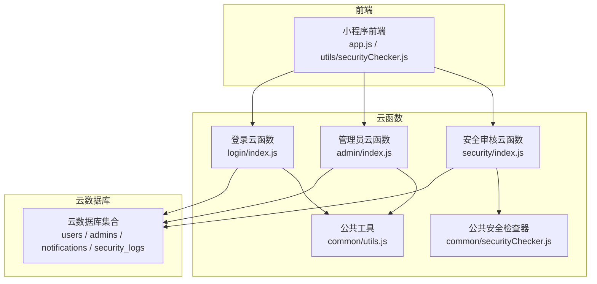
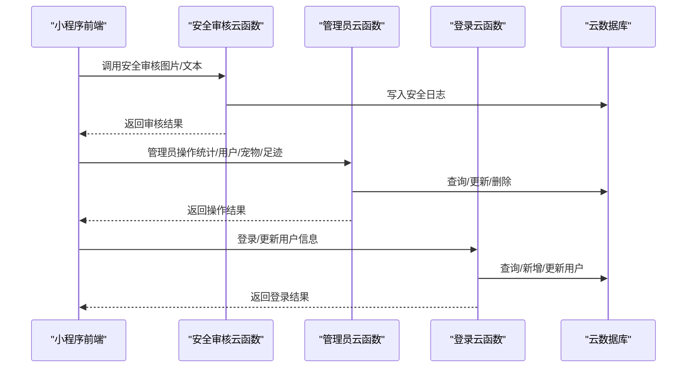
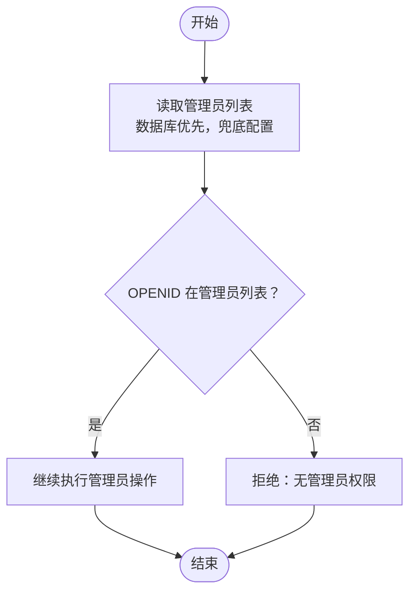
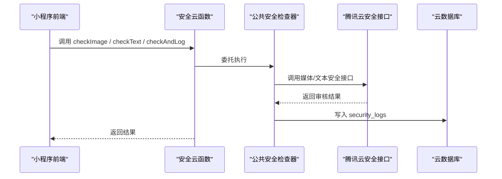
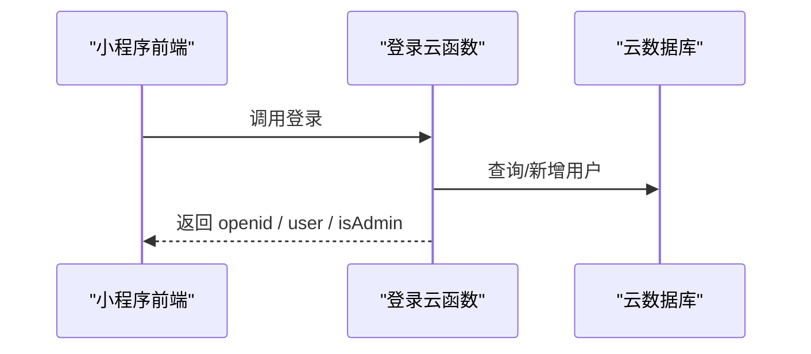
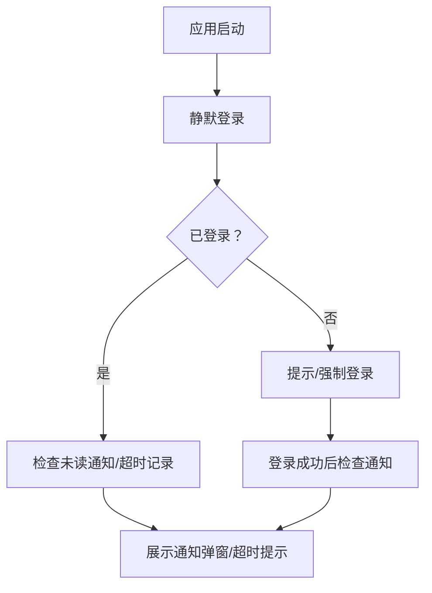
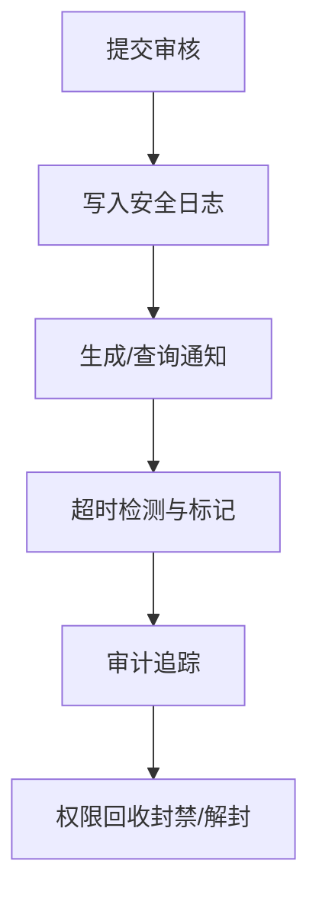
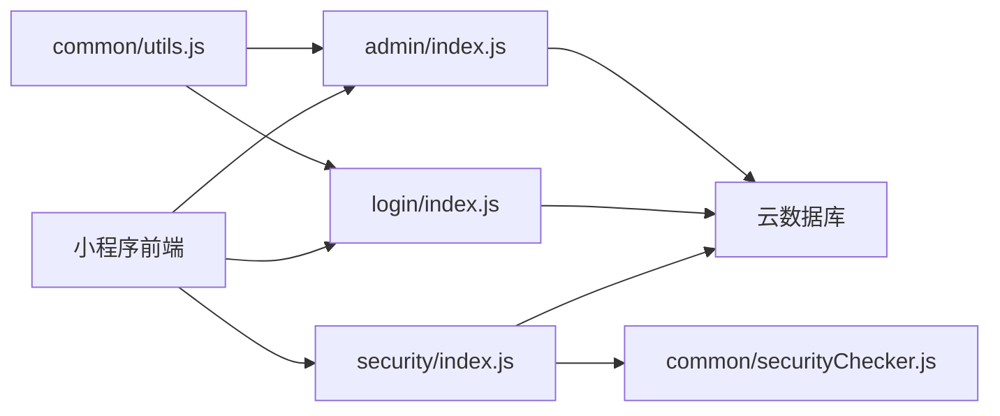

# 权限控制体系

<cite>
**本文引用的文件**
- [cloudfunctions/common/securityChecker.js](file://cloudfunctions/common/securityChecker.js)
- [cloudfunctions/common/utils.js](file://cloudfunctions/common/utils.js)
- [cloudfunctions/admin/index.js](file://cloudfunctions/admin/index.js)
- [cloudfunctions/admin/utils.js](file://cloudfunctions/admin/utils.js)
- [cloudfunctions/admin/config.json](file://cloudfunctions/admin/config.json)
- [cloudfunctions/security/index.js](file://cloudfunctions/security/index.js)
- [cloudfunctions/security/config.json](file://cloudfunctions/security/config.json)
- [cloudfunctions/login/index.js](file://cloudfunctions/login/index.js)
- [cloudfunctions/login/config.json](file://cloudfunctions/login/config.json)
- [miniprogram/utils/securityChecker.js](file://miniprogram/utils/securityChecker.js)
- [miniprogram/app.js](file://miniprogram/app.js)
</cite>

## 目录
1. [引言](#引言)
2. [项目结构](#项目结构)
3. [核心组件](#核心组件)
4. [架构概览](#架构概览)
5. [详细组件分析](#详细组件分析)
6. [依赖关系分析](#依赖关系分析)
7. [性能考虑](#性能考虑)
8. [故障排查指南](#故障排查指南)
9. [结论](#结论)
10. [附录](#附录)

## 引言
本文件系统性梳理“养龟档案”项目的权限控制体系，覆盖管理员权限模型、用户角色与权限分配、数据访问限制、操作权限验证、云函数权限检查、请求拦截与访问控制、前端权限验证与界面元素控制、权限继承与组合、动态权限管理、权限审计与变更记录以及权限回收机制。文档面向开发者提供权限设计指南、配置方法与问题排查方案。

## 项目结构
项目采用“云开发 + 小程序前端”的分层架构：
- 云函数层：统一处理权限校验、数据访问与业务逻辑，如管理员云函数、安全审核云函数、登录云函数等。
- 公共工具层：提供通用的响应封装、数据库连接、上下文获取等能力。
- 前端层：小程序端负责用户交互、权限提示与界面元素控制，并通过云函数调用实现权限相关操作。

图表来源
- [cloudfunctions/login/index.js:1-148](file://cloudfunctions/login/index.js#L1-L148)
- [cloudfunctions/admin/index.js:1-533](file://cloudfunctions/admin/index.js#L1-L533)
- [cloudfunctions/security/index.js:1-200](file://cloudfunctions/security/index.js#L1-L200)
- [cloudfunctions/common/utils.js:1-69](file://cloudfunctions/common/utils.js#L1-L69)
- [cloudfunctions/common/securityChecker.js:1-226](file://cloudfunctions/common/securityChecker.js#L1-L226)

章节来源
- [cloudfunctions/login/index.js:1-148](file://cloudfunctions/login/index.js#L1-L148)
- [cloudfunctions/admin/index.js:1-533](file://cloudfunctions/admin/index.js#L1-L533)
- [cloudfunctions/security/index.js:1-200](file://cloudfunctions/security/index.js#L1-L200)
- [cloudfunctions/common/utils.js:1-69](file://cloudfunctions/common/utils.js#L1-L69)
- [cloudfunctions/common/securityChecker.js:1-226](file://cloudfunctions/common/securityChecker.js#L1-L226)

## 核心组件
- 管理员权限控制：通过管理员白名单（数据库优先，兜底配置）进行权限校验，所有管理员操作均需先验证 OPENID 是否在管理员列表中。
- 安全审核权限：前端通过云函数调用腾讯云内容安全接口，支持图片与文本审核；云函数侧提供审核结果记录与通知查询。
- 登录与用户态：登录云函数负责用户信息初始化、管理员身份判定与基础用户信息更新。
- 公共工具：统一封装云开发初始化、数据库连接、响应格式与错误处理，降低重复代码。

章节来源
- [cloudfunctions/admin/index.js:11-38](file://cloudfunctions/admin/index.js#L11-L38)
- [cloudfunctions/security/index.js:15-64](file://cloudfunctions/security/index.js#L15-L64)
- [cloudfunctions/login/index.js:38-53](file://cloudfunctions/login/index.js#L38-L53)
- [cloudfunctions/common/utils.js:3-69](file://cloudfunctions/common/utils.js#L3-L69)

## 架构概览
下图展示了权限控制的关键交互路径：前端发起请求 → 云函数进行权限校验 → 数据库读写 → 返回结果。

图表来源
- [cloudfunctions/security/index.js:15-64](file://cloudfunctions/security/index.js#L15-L64)
- [cloudfunctions/admin/index.js:27-71](file://cloudfunctions/admin/index.js#L27-L71)
- [cloudfunctions/login/index.js:38-147](file://cloudfunctions/login/index.js#L38-L147)

## 详细组件分析

### 管理员权限控制
- 管理员来源：优先从数据库集合读取启用状态的管理员列表，失败时回退到代码中的兜底管理员列表。
- 权限校验：每次管理员操作前，读取管理员列表并比对当前请求上下文中的 OPENID，若不在列表则拒绝操作并返回错误。
- 管理员操作范围：统计、用户管理、宠物管理、足迹管理、配置管理等。

图表来源
- [cloudfunctions/admin/index.js:16-38](file://cloudfunctions/admin/index.js#L16-L38)

章节来源
- [cloudfunctions/admin/index.js:11-38](file://cloudfunctions/admin/index.js#L11-L38)
- [cloudfunctions/admin/utils.js:1-69](file://cloudfunctions/admin/utils.js#L1-L69)
- [cloudfunctions/admin/config.json:1-6](file://cloudfunctions/admin/config.json#L1-L6)

### 安全审核与内容风控
- 前端封装：小程序端通过公共安全检查器调用安全云函数，支持异步提交与同步等待两种模式。
- 云函数薄包装：安全云函数根据 action 分发至公共安全检查器，执行腾讯云内容安全接口调用。
- 审核记录：将审核请求写入安全日志集合，包含场景、业务ID、用户OPENID、状态等。
- 通知与超时处理：提供未读通知查询、标记已读、待回调超时记录查询与标记。

图表来源
- [cloudfunctions/security/index.js:15-64](file://cloudfunctions/security/index.js#L15-L64)
- [cloudfunctions/common/securityChecker.js:30-207](file://cloudfunctions/common/securityChecker.js#L30-L207)
- [cloudfunctions/security/config.json:1-9](file://cloudfunctions/security/config.json#L1-L9)

章节来源
- [miniprogram/utils/securityChecker.js:1-122](file://miniprogram/utils/securityChecker.js#L1-L122)
- [cloudfunctions/security/index.js:15-64](file://cloudfunctions/security/index.js#L15-L64)
- [cloudfunctions/common/securityChecker.js:30-207](file://cloudfunctions/common/securityChecker.js#L30-L207)
- [cloudfunctions/security/config.json:1-9](file://cloudfunctions/security/config.json#L1-L9)

### 登录与用户态管理
- 登录流程：首次进入时静默调用登录云函数，获取 OPENID 与用户信息，持久化到本地存储。
- 管理员判定：登录云函数会查询数据库管理员表，判断当前用户是否为管理员并返回标识。
- 用户信息更新：支持更新昵称、头像、手机号等字段。

图表来源
- [cloudfunctions/login/index.js:38-147](file://cloudfunctions/login/index.js#L38-L147)
- [cloudfunctions/login/config.json:1-6](file://cloudfunctions/login/config.json#L1-L6)

章节来源
- [cloudfunctions/login/index.js:24-53](file://cloudfunctions/login/index.js#L24-L53)
- [cloudfunctions/login/index.js:55-85](file://cloudfunctions/login/index.js#L55-L85)
- [cloudfunctions/login/index.js:87-147](file://cloudfunctions/login/index.js#L87-L147)
- [cloudfunctions/login/config.json:1-6](file://cloudfunctions/login/config.json#L1-L6)

### 前端权限验证与界面控制
- 登录态与强制登录：应用启动时尝试静默登录，未登录时弹窗提示或强制登录。
- 审核通知与超时提示：进入前台时检查未读审核通知与超时待回调记录，必要时弹窗或提示。
- 安全检查器封装：提供图片/文本审核调用，支持异步与同步两种模式，便于在页面中按需使用。

图表来源
- [miniprogram/app.js:84-140](file://miniprogram/app.js#L84-L140)
- [miniprogram/app.js:267-288](file://miniprogram/app.js#L267-L288)
- [miniprogram/utils/securityChecker.js:1-122](file://miniprogram/utils/securityChecker.js#L1-L122)

章节来源
- [miniprogram/app.js:176-225](file://miniprogram/app.js#L176-L225)
- [miniprogram/app.js:267-288](file://miniprogram/app.js#L267-L288)
- [miniprogram/utils/securityChecker.js:1-122](file://miniprogram/utils/securityChecker.js#L1-L122)

### 数据访问限制与操作权限验证
- 管理员操作：所有管理员相关操作均在云函数入口处进行 OPENID 校验，未授权直接拒绝。
- 用户数据隔离：管理员查询用户/宠物/足迹时，应结合业务规则确保仅访问合法范围（例如用户维度的足迹查询可通过 openid 过滤）。
- 审核日志与通知：安全日志与通知查询均按 openid 进行过滤，防止越权查看他人数据。

章节来源
- [cloudfunctions/admin/index.js:27-71](file://cloudfunctions/admin/index.js#L27-L71)
- [cloudfunctions/security/index.js:69-98](file://cloudfunctions/security/index.js#L69-L98)
- [cloudfunctions/security/index.js:103-144](file://cloudfunctions/security/index.js#L103-L144)
- [cloudfunctions/security/index.js:151-200](file://cloudfunctions/security/index.js#L151-L200)

### 权限继承、组合与动态管理
- 权限来源与优先级：管理员权限以数据库为准，代码兜底为辅，保证可动态调整。
- 动态配置：系统配置集合支持运行时更新，管理员可调整注册开关、配额限制等策略。
- 权限组合：前端通过云函数调用实现“异步审核 + 同步阻塞”两种模式，满足不同业务场景。

章节来源
- [cloudfunctions/admin/index.js:16-25](file://cloudfunctions/admin/index.js#L16-L25)
- [cloudfunctions/admin/index.js:476-508](file://cloudfunctions/admin/index.js#L476-L508)
- [miniprogram/utils/securityChecker.js:43-92](file://miniprogram/utils/securityChecker.js#L43-L92)

### 权限审计、变更记录与回收
- 审核日志：安全云函数将每次审核请求写入安全日志集合，包含场景、业务ID、OPENID、状态、原因等字段，便于审计与追踪。
- 通知与超时：提供未读通知查询与待回调超时记录查询，支持标记已读与批量处理。
- 权限回收：管理员可将用户状态置为“封禁”，并将其加入封禁列表；解封时从封禁列表移除。

图表来源
- [cloudfunctions/common/securityChecker.js:179-207](file://cloudfunctions/common/securityChecker.js#L179-L207)
- [cloudfunctions/security/index.js:151-200](file://cloudfunctions/security/index.js#L151-L200)
- [cloudfunctions/admin/index.js:196-214](file://cloudfunctions/admin/index.js#L196-L214)

章节来源
- [cloudfunctions/common/securityChecker.js:179-207](file://cloudfunctions/common/securityChecker.js#L179-L207)
- [cloudfunctions/security/index.js:69-98](file://cloudfunctions/security/index.js#L69-L98)
- [cloudfunctions/security/index.js:151-200](file://cloudfunctions/security/index.js#L151-L200)
- [cloudfunctions/admin/index.js:196-214](file://cloudfunctions/admin/index.js#L196-L214)

## 依赖关系分析
- 云函数依赖公共工具：统一的云开发初始化、数据库连接、响应封装与错误处理。
- 安全云函数依赖公共安全检查器：复用腾讯云内容安全接口调用与日志记录逻辑。
- 管理员云函数依赖公共工具与数据库：管理员列表读取、用户/宠物/足迹查询与更新。
- 前端依赖安全检查器与应用层：封装云函数调用、登录态管理与通知检查。

图表来源
- [cloudfunctions/common/utils.js:1-69](file://cloudfunctions/common/utils.js#L1-L69)
- [cloudfunctions/admin/index.js:1-10](file://cloudfunctions/admin/index.js#L1-L10)
- [cloudfunctions/login/index.js:1-22](file://cloudfunctions/login/index.js#L1-L22)
- [cloudfunctions/security/index.js:1-10](file://cloudfunctions/security/index.js#L1-L10)
- [cloudfunctions/common/securityChecker.js:1-10](file://cloudfunctions/common/securityChecker.js#L1-L10)

章节来源
- [cloudfunctions/common/utils.js:1-69](file://cloudfunctions/common/utils.js#L1-L69)
- [cloudfunctions/admin/index.js:1-10](file://cloudfunctions/admin/index.js#L1-L10)
- [cloudfunctions/login/index.js:1-22](file://cloudfunctions/login/index.js#L1-L22)
- [cloudfunctions/security/index.js:1-10](file://cloudfunctions/security/index.js#L1-L10)
- [cloudfunctions/common/securityChecker.js:1-10](file://cloudfunctions/common/securityChecker.js#L1-L10)

## 性能考虑
- 并发与事务：管理员删除用户时使用事务保证一致性，减少多次往返带来的延迟。
- 批量查询：管理员查询用户列表时对用户信息进行批量查询与映射，降低查询次数。
- 异步审核：前端支持异步审核，避免阻塞主线程，提升用户体验。
- 日志与通知：安全日志与通知查询限制数量与排序，避免大结果集导致的性能问题。

章节来源
- [cloudfunctions/admin/index.js:227-257](file://cloudfunctions/admin/index.js#L227-L257)
- [cloudfunctions/admin/index.js:284-300](file://cloudfunctions/admin/index.js#L284-L300)
- [miniprogram/utils/securityChecker.js:43-106](file://miniprogram/utils/securityChecker.js#L43-L106)
- [cloudfunctions/security/index.js:69-98](file://cloudfunctions/security/index.js#L69-L98)

## 故障排查指南
- 管理员权限不足
  - 症状：管理员操作返回“无管理员权限”。
  - 排查：确认当前 OPENID 是否存在于管理员集合且 enabled 为真；若数据库不可用，检查兜底管理员列表是否包含该 OPENID。
  - 参考
    - [cloudfunctions/admin/index.js:16-38](file://cloudfunctions/admin/index.js#L16-L38)
- 安全审核失败
  - 症状：图片/文本审核返回失败或异常。
  - 排查：检查云函数权限配置、腾讯云安全接口可用性、临时文件URL获取是否成功、安全日志写入是否报错。
  - 参考
    - [cloudfunctions/security/config.json:1-9](file://cloudfunctions/security/config.json#L1-L9)
    - [cloudfunctions/common/securityChecker.js:74-105](file://cloudfunctions/common/securityChecker.js#L74-L105)
    - [cloudfunctions/common/securityChecker.js:159-170](file://cloudfunctions/common/securityChecker.js#L159-L170)
- 通知与超时记录异常
  - 症状：未读通知缺失或超时记录未更新。
  - 排查：确认通知集合与安全日志集合结构、查询条件与时间阈值、超时标记逻辑。
  - 参考
    - [cloudfunctions/security/index.js:69-98](file://cloudfunctions/security/index.js#L69-L98)
    - [cloudfunctions/security/index.js:151-200](file://cloudfunctions/security/index.js#L151-L200)
- 登录失败或用户信息未更新
  - 症状：静默登录失败或用户信息未持久化。
  - 排查：检查登录云函数数据库操作、系统配置读取、本地存储写入。
  - 参考
    - [cloudfunctions/login/index.js:87-147](file://cloudfunctions/login/index.js#L87-L147)
    - [miniprogram/app.js:84-140](file://miniprogram/app.js#L84-L140)

章节来源
- [cloudfunctions/admin/index.js:16-38](file://cloudfunctions/admin/index.js#L16-L38)
- [cloudfunctions/security/config.json:1-9](file://cloudfunctions/security/config.json#L1-L9)
- [cloudfunctions/common/securityChecker.js:74-105](file://cloudfunctions/common/securityChecker.js#L74-L105)
- [cloudfunctions/common/securityChecker.js:159-170](file://cloudfunctions/common/securityChecker.js#L159-L170)
- [cloudfunctions/security/index.js:69-98](file://cloudfunctions/security/index.js#L69-L98)
- [cloudfunctions/security/index.js:151-200](file://cloudfunctions/security/index.js#L151-L200)
- [cloudfunctions/login/index.js:87-147](file://cloudfunctions/login/index.js#L87-L147)
- [miniprogram/app.js:84-140](file://miniprogram/app.js#L84-L140)

## 结论
本项目通过“数据库驱动的管理员白名单 + 云函数入口权限校验 + 前端安全检查器封装 + 审核日志与通知机制”的组合，构建了清晰、可扩展且具备审计能力的权限控制体系。建议在后续迭代中进一步完善权限粒度划分、引入更细粒度的资源级权限与RBAC模型，并持续优化性能与可观测性。

## 附录
- 权限设计指南
  - 管理员来源：以数据库为准，代码兜底为辅，确保可动态调整。
  - 权限验证：所有管理员操作必须在云函数入口进行 OPENID 校验。
  - 审核流程：前端异步提交，云函数记录日志，必要时同步等待结果。
  - 审计与回收：完善安全日志与通知，支持封禁/解封等权限回收操作。
- 权限配置方法
  - 管理员列表：维护 admins 集合，enabled 字段控制是否启用。
  - 系统配置：维护 systemConfig 集合，支持运行时更新。
  - 云函数权限：通过 config.json 中的 permissions.openapi 控制开放的云调用。
- 权限问题排查清单
  - 确认管理员 OPENID 是否在数据库或兜底列表中。
  - 检查云函数权限配置与腾讯云安全接口可用性。
  - 核对安全日志与通知集合结构与查询条件。
  - 验证登录云函数数据库操作与本地存储写入。