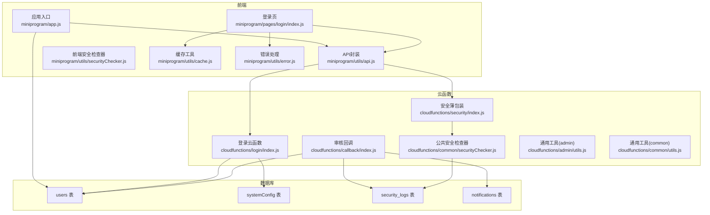
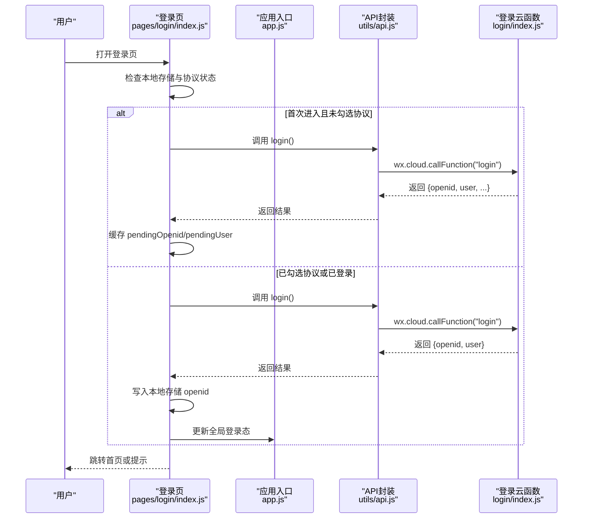
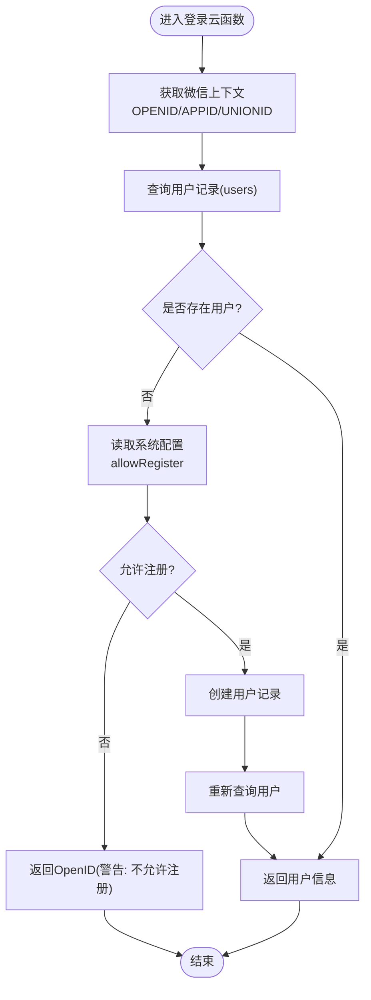
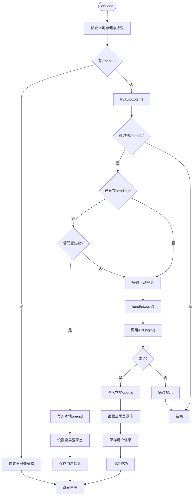
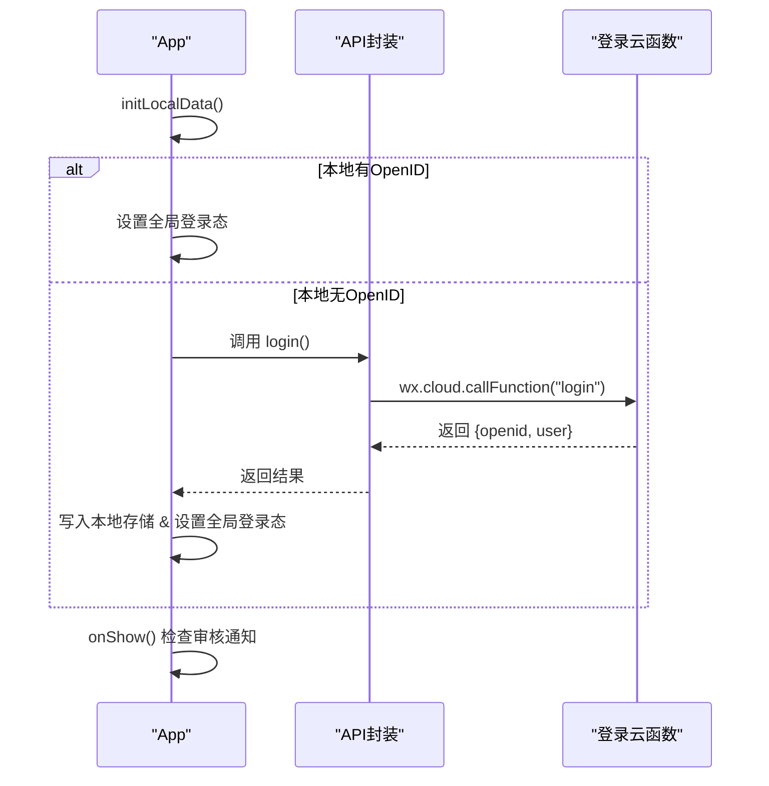
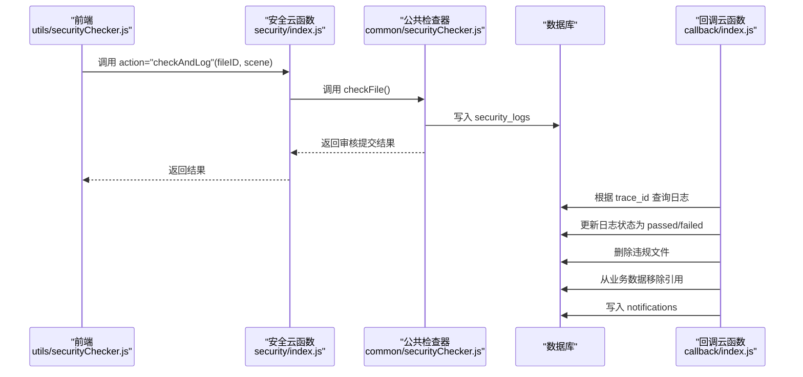
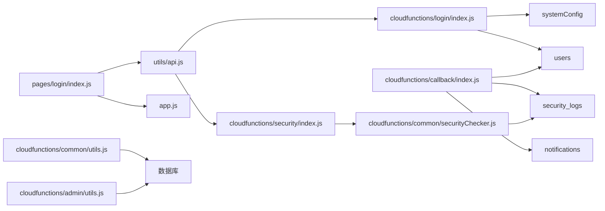

# 用户认证机制

<cite>
**本文引用的文件**
- [miniprogram/pages/login/index.js](file://miniprogram/pages/login/index.js)
- [cloudfunctions/login/index.js](file://cloudfunctions/login/index.js)
- [cloudfunctions/login/config.json](file://cloudfunctions/login/config.json)
- [miniprogram/utils/api.js](file://miniprogram/utils/api.js)
- [miniprogram/app.js](file://miniprogram/app.js)
- [cloudfunctions/common/securityChecker.js](file://cloudfunctions/common/securityChecker.js)
- [cloudfunctions/security/index.js](file://cloudfunctions/security/index.js)
- [cloudfunctions/callback/index.js](file://cloudfunctions/callback/index.js)
- [miniprogram/utils/securityChecker.js](file://miniprogram/utils/securityChecker.js)
- [cloudfunctions/admin/utils.js](file://cloudfunctions/admin/utils.js)
- [cloudfunctions/common/utils.js](file://cloudfunctions/common/utils.js)
- [miniprogram/utils/cache.js](file://miniprogram/utils/cache.js)
- [miniprogram/utils/error.js](file://miniprogram/utils/error.js)
- [miniprogram/pages/my/index.js](file://miniprogram/pages/my/index.js)
</cite>

## 目录
1. [引言](#引言)
2. [项目结构](#项目结构)
3. [核心组件](#核心组件)
4. [架构总览](#架构总览)
5. [详细组件分析](#详细组件分析)
6. [依赖关系分析](#依赖关系分析)
7. [性能考量](#性能考量)
8. [故障排查指南](#故障排查指南)
9. [结论](#结论)
10. [附录](#附录)

## 引言
本文件系统性梳理“养龟档案”小程序的用户认证机制，覆盖微信小程序登录流程、OpenID获取、会话管理、云函数登录接口实现、用户状态验证与token管理、前端登录页面逻辑、用户信息存储与会话保持、第三方登录集成与授权流程、安全令牌处理、登录状态检查与自动续期、异常处理方案、安全最佳实践与防暴力破解策略、会话劫持防护，以及面向开发者的接口使用指南与常见问题解决方案。

## 项目结构
认证相关能力主要分布在以下模块：
- 前端页面与应用层：登录页、应用生命周期、API封装、安全检查器、缓存与错误处理
- 云函数层：登录、安全审核薄包装、回调处理、通用工具
- 数据库与配置：系统配置、用户表、安全日志、通知等

**图表来源**
- [miniprogram/pages/login/index.js:1-323](file://miniprogram/pages/login/index.js#L1-L323)
- [cloudfunctions/login/index.js:1-148](file://cloudfunctions/login/index.js#L1-L148)
- [cloudfunctions/security/index.js:1-200](file://cloudfunctions/security/index.js#L1-L200)
- [cloudfunctions/common/securityChecker.js:1-226](file://cloudfunctions/common/securityChecker.js#L1-L226)
- [cloudfunctions/callback/index.js:1-223](file://cloudfunctions/callback/index.js#L1-L223)
- [miniprogram/utils/api.js:1-208](file://miniprogram/utils/api.js#L1-L208)
- [miniprogram/utils/securityChecker.js:1-122](file://miniprogram/utils/securityChecker.js#L1-L122)
- [cloudfunctions/admin/utils.js:1-69](file://cloudfunctions/admin/utils.js#L1-L69)
- [cloudfunctions/common/utils.js:1-69](file://cloudfunctions/common/utils.js#L1-L69)

**章节来源**
- [miniprogram/pages/login/index.js:1-323](file://miniprogram/pages/login/index.js#L1-L323)
- [cloudfunctions/login/index.js:1-148](file://cloudfunctions/login/index.js#L1-L148)
- [cloudfunctions/security/index.js:1-200](file://cloudfunctions/security/index.js#L1-L200)
- [cloudfunctions/common/securityChecker.js:1-226](file://cloudfunctions/common/securityChecker.js#L1-L226)
- [cloudfunctions/callback/index.js:1-223](file://cloudfunctions/callback/index.js#L1-L223)
- [miniprogram/utils/api.js:1-208](file://miniprogram/utils/api.js#L1-L208)
- [miniprogram/utils/securityChecker.js:1-122](file://miniprogram/utils/securityChecker.js#L1-L122)
- [cloudfunctions/admin/utils.js:1-69](file://cloudfunctions/admin/utils.js#L1-L69)
- [cloudfunctions/common/utils.js:1-69](file://cloudfunctions/common/utils.js#L1-L69)

## 核心组件
- 登录云函数：负责获取微信上下文、查询/创建用户、返回OpenID与用户信息，并支持管理员校验与用户信息更新等扩展动作。
- 前端登录页：负责协议展示与勾选、静默自动登录、手动登录、用户信息合并与持久化、跳转逻辑。
- 应用生命周期：负责全局登录态初始化、静默登录、登出清理、审核通知检查。
- API封装：统一封装云函数调用、错误处理、登录接口代理。
- 安全检查器：封装图片/文本安全审核调用，支持异步提交与同步等待结果。
- 审核回调：接收微信异步回调，更新安全日志、清理违规资源、推送通知。

**章节来源**
- [cloudfunctions/login/index.js:38-147](file://cloudfunctions/login/index.js#L38-L147)
- [miniprogram/pages/login/index.js:52-154](file://miniprogram/pages/login/index.js#L52-L154)
- [miniprogram/app.js:60-140](file://miniprogram/app.js#L60-L140)
- [miniprogram/utils/api.js:143-145](file://miniprogram/utils/api.js#L143-L145)
- [cloudfunctions/common/securityChecker.js:30-208](file://cloudfunctions/common/securityChecker.js#L30-L208)
- [cloudfunctions/callback/index.js:42-109](file://cloudfunctions/callback/index.js#L42-L109)

## 架构总览
整体认证流程分为两阶段：
- OpenID获取与用户状态建立：前端通过API调用登录云函数，云函数基于微信上下文提取OPENID/UNIONID/APPID，查询或创建用户记录，返回OpenID与用户信息。
- 会话管理与状态保持：前端将OpenID写入本地存储，应用层在启动时读取并建立全局登录态；后续页面按需检查登录态并进行强制登录或提示。

**图表来源**
- [miniprogram/pages/login/index.js:52-154](file://miniprogram/pages/login/index.js#L52-L154)
- [miniprogram/utils/api.js:143-145](file://miniprogram/utils/api.js#L143-L145)
- [cloudfunctions/login/index.js:38-147](file://cloudfunctions/login/index.js#L38-L147)

**章节来源**
- [miniprogram/pages/login/index.js:16-87](file://miniprogram/pages/login/index.js#L16-L87)
- [cloudfunctions/login/index.js:87-147](file://cloudfunctions/login/index.js#L87-L147)

## 详细组件分析

### 登录云函数实现
- 上下文解析：通过云开发SDK获取OPENID、APPID、UNIONID。
- 用户查询/创建：查询users集合是否存在对应OpenID；不存在则读取systemConfig中的注册开关，允许注册时创建用户记录。
- 返回结构：始终返回OpenID/UNIONID/APPID；用户信息来自数据库或null；数据库异常时仍返回OpenID并携带warning。
- 权限配置：登录云函数权限声明中未显式声明openapi权限，安全云函数显式声明了媒体与文本审核权限。

**图表来源**
- [cloudfunctions/login/index.js:38-147](file://cloudfunctions/login/index.js#L38-L147)

**章节来源**
- [cloudfunctions/login/index.js:38-147](file://cloudfunctions/login/index.js#L38-L147)
- [cloudfunctions/login/config.json:1-6](file://cloudfunctions/login/config.json#L1-L6)
- [cloudfunctions/security/config.json:1-9](file://cloudfunctions/security/config.json#L1-L9)

### 前端登录页面逻辑
- 协议与自动登录：首次进入检查协议勾选与本地OpenID；若已勾选则静默登录并写入全局态；否则仅预存pendingOpenid等待手动登录。
- 手动登录：校验协议勾选，调用API.login()，成功后写入本地存储openid，更新全局登录态，保存用户信息，提示并跳转。
- 用户信息合并策略：优先保留本地修改（昵称/头像/手机），云端仅在本地为空时补充，避免覆盖用户最新修改。
- 跳转与返回：根据历史页面栈决定navigateBack或switchTab首页。

**图表来源**
- [miniprogram/pages/login/index.js:16-154](file://miniprogram/pages/login/index.js#L16-L154)

**章节来源**
- [miniprogram/pages/login/index.js:16-195](file://miniprogram/pages/login/index.js#L16-L195)

### 应用生命周期与会话管理
- 启动初始化：onLaunch中初始化云开发，onCloudReady加载系统配置；initLocalData优先读取本地OpenID建立登录态；否则异步调用登录云函数。
- 强制登录：requireLogin未登录时弹窗提示，点击去登录后调用forceLogin，静默获取OpenID并写入本地存储与全局态。
- 登出：清理全局登录态与本地存储，reLaunch回到首页。
- 审核通知：每次进入前台检查未读通知与超时审核记录，必要时弹窗提示。

**图表来源**
- [miniprogram/app.js:60-140](file://miniprogram/app.js#L60-L140)
- [miniprogram/app.js:176-288](file://miniprogram/app.js#L176-L288)

**章节来源**
- [miniprogram/app.js:60-140](file://miniprogram/app.js#L60-L140)
- [miniprogram/app.js:176-288](file://miniprogram/app.js#L176-L288)

### 安全审核与回调处理
- 前端安全检查器：封装对security云函数的调用，支持异步提交checkAndLog与同步checkImage/checkText。
- 云函数安全薄包装：将请求分发至公共安全检查器，执行媒体/文本审核，并记录日志。
- 回调处理：接收微信推送的审核结果，更新security_logs状态，清理违规资源，推送违规通知。

**图表来源**
- [miniprogram/utils/securityChecker.js:13-122](file://miniprogram/utils/securityChecker.js#L13-L122)
- [cloudfunctions/security/index.js:15-64](file://cloudfunctions/security/index.js#L15-L64)
- [cloudfunctions/common/securityChecker.js:30-208](file://cloudfunctions/common/securityChecker.js#L30-L208)
- [cloudfunctions/callback/index.js:42-109](file://cloudfunctions/callback/index.js#L42-L109)

**章节来源**
- [miniprogram/utils/securityChecker.js:13-122](file://miniprogram/utils/securityChecker.js#L13-L122)
- [cloudfunctions/security/index.js:15-64](file://cloudfunctions/security/index.js#L15-L64)
- [cloudfunctions/common/securityChecker.js:30-208](file://cloudfunctions/common/securityChecker.js#L30-L208)
- [cloudfunctions/callback/index.js:42-109](file://cloudfunctions/callback/index.js#L42-L109)

### 第三方登录与授权流程
- 当前实现：基于微信小程序登录，通过云函数获取OPENID/UNIONID/APPID，未见其他第三方登录入口。
- 授权流程：前端登录页要求用户勾选协议，随后调用登录云函数完成OpenID获取与用户状态建立。
- 安全令牌：未实现自定义token；会话状态依赖本地存储的openid与应用全局态。

**章节来源**
- [cloudfunctions/login/index.js:40-41](file://cloudfunctions/login/index.js#L40-L41)
- [miniprogram/pages/login/index.js:89-154](file://miniprogram/pages/login/index.js#L89-L154)

### 登录状态检查、自动续期与异常处理
- 登录检查：应用层提供requireLogin与promptLogin，未登录时弹窗提示并跳转登录。
- 自动续期：当前未实现token自动续期；建议在云函数中引入短期token并在前端定时刷新。
- 异常处理：API封装捕获云函数调用异常并降级提示；前端登录页对协议缺失、登录失败进行明确提示。

**章节来源**
- [miniprogram/app.js:176-225](file://miniprogram/app.js#L176-L225)
- [miniprogram/utils/api.js:12-38](file://miniprogram/utils/api.js#L12-L38)
- [miniprogram/pages/login/index.js:143-153](file://miniprogram/pages/login/index.js#L143-L153)

## 依赖关系分析
- 前端依赖关系：登录页依赖API封装与应用全局态；API封装依赖云函数与错误处理；安全检查器依赖云函数security。
- 云函数依赖关系：登录云函数依赖数据库users与systemConfig；安全薄包装依赖公共安全检查器；回调依赖数据库security_logs与notifications。
- 通用工具：admin与common工具提供统一的数据库初始化、OpenID获取、响应封装与ID规范化。

**图表来源**
- [miniprogram/pages/login/index.js:1-323](file://miniprogram/pages/login/index.js#L1-L323)
- [miniprogram/utils/api.js:1-208](file://miniprogram/utils/api.js#L1-L208)
- [cloudfunctions/login/index.js:1-148](file://cloudfunctions/login/index.js#L1-L148)
- [cloudfunctions/security/index.js:1-200](file://cloudfunctions/security/index.js#L1-L200)
- [cloudfunctions/common/securityChecker.js:1-226](file://cloudfunctions/common/securityChecker.js#L1-L226)
- [cloudfunctions/callback/index.js:1-223](file://cloudfunctions/callback/index.js#L1-L223)
- [cloudfunctions/admin/utils.js:1-69](file://cloudfunctions/admin/utils.js#L1-L69)
- [cloudfunctions/common/utils.js:1-69](file://cloudfunctions/common/utils.js#L1-L69)

**章节来源**
- [miniprogram/pages/login/index.js:1-323](file://miniprogram/pages/login/index.js#L1-L323)
- [miniprogram/utils/api.js:1-208](file://miniprogram/utils/api.js#L1-L208)
- [cloudfunctions/login/index.js:1-148](file://cloudfunctions/login/index.js#L1-L148)
- [cloudfunctions/security/index.js:1-200](file://cloudfunctions/security/index.js#L1-L200)
- [cloudfunctions/common/securityChecker.js:1-226](file://cloudfunctions/common/securityChecker.js#L1-L226)
- [cloudfunctions/callback/index.js:1-223](file://cloudfunctions/callback/index.js#L1-L223)
- [cloudfunctions/admin/utils.js:1-69](file://cloudfunctions/admin/utils.js#L1-L69)
- [cloudfunctions/common/utils.js:1-69](file://cloudfunctions/common/utils.js#L1-L69)

## 性能考量
- 云函数调用：API封装统一处理错误与降级，减少前端重复逻辑；登录云函数尽量避免复杂查询，必要时增加索引。
- 前端渲染：登录页与应用层使用本地存储与全局态，减少不必要的云调用；图片上传后异步提交安全审核，避免阻塞主流程。
- 缓存策略：提供通用缓存工具，支持过期时间与清理策略，降低存储压力。

**章节来源**
- [miniprogram/utils/api.js:12-38](file://miniprogram/utils/api.js#L12-L38)
- [miniprogram/utils/cache.js:11-121](file://miniprogram/utils/cache.js#L11-L121)

## 故障排查指南
- 登录失败：检查云函数返回的message或warning；确认系统配置中是否允许注册；查看数据库users与systemConfig集合。
- 审核不通过：通过security云函数的getUnreadNotifications与getPendingChecks检查未读通知与超时记录；关注回调云函数是否正确更新日志与清理资源。
- 云函数权限：确保security云函数具备security.mediaCheckAsync与security.msgSecCheck权限；登录云函数无openapi权限声明。
- 前端异常：使用错误处理工具统一提示；检查API封装的useFallback标志与cloudAvailable状态。

**章节来源**
- [cloudfunctions/login/index.js:136-146](file://cloudfunctions/login/index.js#L136-L146)
- [cloudfunctions/security/index.js:69-98](file://cloudfunctions/security/index.js#L69-L98)
- [cloudfunctions/security/index.js:151-200](file://cloudfunctions/security/index.js#L151-L200)
- [cloudfunctions/security/config.json:1-9](file://cloudfunctions/security/config.json#L1-L9)
- [miniprogram/utils/error.js:8-92](file://miniprogram/utils/error.js#L8-L92)
- [miniprogram/utils/api.js:27-37](file://miniprogram/utils/api.js#L27-L37)

## 结论
本项目实现了基于微信OpenID的轻量级认证体系：前端登录页负责协议与状态建立，云函数负责上下文解析与用户记录维护，应用层负责全局会话管理与通知检查。安全方面通过异步审核与回调清理形成闭环。建议后续引入短期token与自动续期、完善防暴力破解与会话劫持防护策略，并持续优化数据库索引与缓存策略以提升性能与稳定性。

## 附录

### 登录接口使用指南
- 前端调用：通过API.login()发起登录请求，内部封装云函数调用与错误处理。
- 云函数调用：调用wx.cloud.callFunction("login")，传入action与data（当前登录云函数未使用action/data）。
- 返回字段：始终包含openid/unionid/appid；用户信息来自数据库或null；数据库异常时返回warning。

**章节来源**
- [miniprogram/utils/api.js:143-145](file://miniprogram/utils/api.js#L143-L145)
- [cloudfunctions/login/index.js:38-147](file://cloudfunctions/login/index.js#L38-L147)

### 常见问题与解决方案
- 无法注册：检查systemConfig.allowRegister配置；若为false，登录云函数将返回不允许注册的提示。
- 协议未勾选导致无法登录：登录页会在未勾选时阻止手动登录并提示。
- 审核超时：通过security云函数的getPendingChecks获取超时记录并提示用户。
- 登出后仍自动登录：应用层通过agreedBefore判断是否自动登录，登出会清理本地存储与全局态。

**章节来源**
- [cloudfunctions/login/index.js:93-99](file://cloudfunctions/login/index.js#L93-L99)
- [miniprogram/pages/login/index.js:89-98](file://miniprogram/pages/login/index.js#L89-L98)
- [cloudfunctions/security/index.js:151-200](file://cloudfunctions/security/index.js#L151-L200)
- [miniprogram/app.js:233-256](file://miniprogram/app.js#L233-L256)