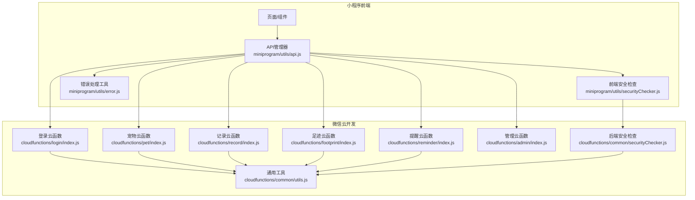
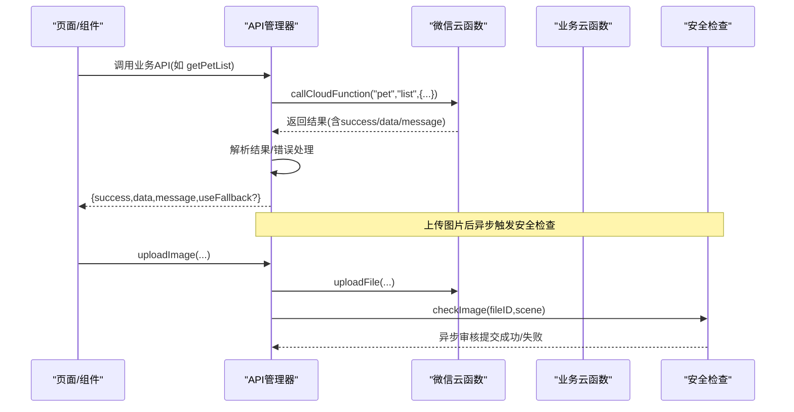
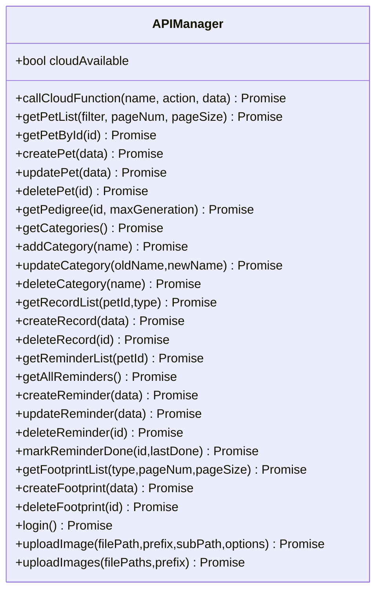
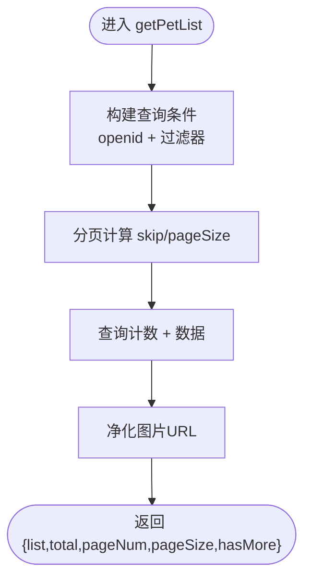
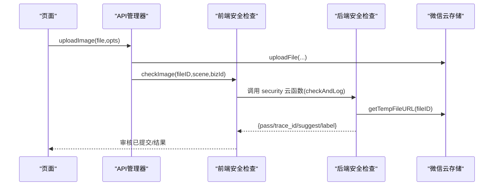
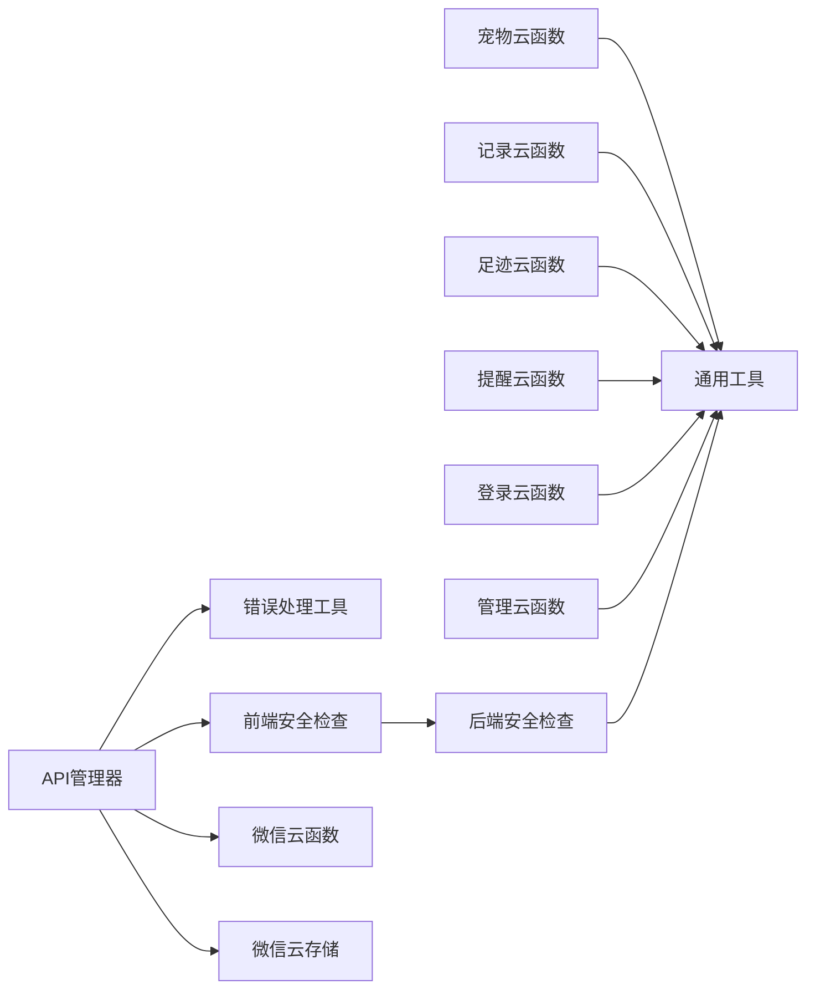

# API管理器

<cite>
**本文引用的文件**
- [miniprogram/utils/api.js](file://miniprogram/utils/api.js)
- [miniprogram/utils/error.js](file://miniprogram/utils/error.js)
- [miniprogram/utils/securityChecker.js](file://miniprogram/utils/securityChecker.js)
- [cloudfunctions/common/securityChecker.js](file://cloudfunctions/common/securityChecker.js)
- [cloudfunctions/common/utils.js](file://cloudfunctions/common/utils.js)
- [cloudfunctions/pet/index.js](file://cloudfunctions/pet/index.js)
- [cloudfunctions/record/index.js](file://cloudfunctions/record/index.js)
- [cloudfunctions/footprint/index.js](file://cloudfunctions/footprint/index.js)
- [cloudfunctions/reminder/index.js](file://cloudfunctions/reminder/index.js)
- [cloudfunctions/admin/index.js](file://cloudfunctions/admin/index.js)
- [cloudfunctions/login/index.js](file://cloudfunctions/login/index.js)
</cite>

## 目录
1. [引言](#引言)
2. [项目结构](#项目结构)
3. [核心组件](#核心组件)
4. [架构总览](#架构总览)
5. [详细组件分析](#详细组件分析)
6. [依赖关系分析](#依赖关系分析)
7. [性能考量](#性能考量)
8. [故障排查指南](#故障排查指南)
9. [结论](#结论)
10. [附录](#附录)

## 引言
本文件面向“API管理器”的设计与实现，聚焦于小程序前端的统一API封装、云函数统一调用机制、错误处理与降级策略、安全检查机制、网络状态监控与异常恢复、最佳实践、性能优化与调试技巧，并给出配置项、扩展方法与单元测试指南。目标是帮助开发者快速理解与高效使用API管理器，覆盖宠物管理、记录管理、提醒事件、足迹管理等业务模块。

## 项目结构
该项目采用“小程序前端 + 微信云开发云函数 + 云存储”的分层架构。前端通过API管理器统一封装对云函数的调用；云函数按业务域拆分（pet、record、reminder、footprint、login、admin等），并通过通用工具模块提供数据库初始化、OpenID解析、响应格式化等能力；安全检查在前端与后端均有实现，形成“上传即审+异步回调”的双轨保障。

图表来源
- [miniprogram/utils/api.js:1-208](file://miniprogram/utils/api.js#L1-L208)
- [miniprogram/utils/securityChecker.js:1-122](file://miniprogram/utils/securityChecker.js#L1-L122)
- [cloudfunctions/common/utils.js:1-69](file://cloudfunctions/common/utils.js#L1-L69)
- [cloudfunctions/pet/index.js:1-723](file://cloudfunctions/pet/index.js#L1-L723)
- [cloudfunctions/record/index.js:1-191](file://cloudfunctions/record/index.js#L1-L191)
- [cloudfunctions/footprint/index.js:1-160](file://cloudfunctions/footprint/index.js#L1-L160)
- [cloudfunctions/reminder/index.js:1-205](file://cloudfunctions/reminder/index.js#L1-L205)
- [cloudfunctions/login/index.js:1-148](file://cloudfunctions/login/index.js#L1-L148)
- [cloudfunctions/admin/index.js:1-533](file://cloudfunctions/admin/index.js#L1-L533)
- [cloudfunctions/common/securityChecker.js:1-226](file://cloudfunctions/common/securityChecker.js#L1-L226)

章节来源
- [miniprogram/utils/api.js:1-208](file://miniprogram/utils/api.js#L1-L208)
- [cloudfunctions/common/utils.js:1-69](file://cloudfunctions/common/utils.js#L1-L69)

## 核心组件
- API管理器（APIManager）
  - 统一调用云函数，负责请求封装、结果解析、错误捕获与降级标记。
  - 提供宠物、记录、提醒、足迹、登录等业务API方法。
  - 提供图片上传与安全审核集成。
- 安全检查器（SecurityChecker）
  - 前端：封装对“security”云函数的调用，支持异步/同步审核与批量处理。
  - 后端：提供图片/文本审核、fileID转URL、审核日志落库等能力。
- 错误处理工具（error.js）
  - 统一错误消息提取、Toast提示、加载状态管理、确认对话框等。

章节来源
- [miniprogram/utils/api.js:4-191](file://miniprogram/utils/api.js#L4-L191)
- [miniprogram/utils/securityChecker.js:13-107](file://miniprogram/utils/securityChecker.js#L13-L107)
- [cloudfunctions/common/securityChecker.js:30-208](file://cloudfunctions/common/securityChecker.js#L30-L208)
- [miniprogram/utils/error.js:8-91](file://miniprogram/utils/error.js#L8-L91)

## 架构总览
API管理器以“统一入口 + 业务分发”的方式组织，所有云函数调用均经由APIManager的callCloudFunction方法，确保：
- 请求标准化：统一action/data参数结构。
- 结果一致性：统一success/data/message结构。
- 异常降级：网络异常时标记cloudAvailable=false并返回useFallback标志，便于前端做降级策略。
- 安全前置：图片上传后异步触发后端安全检查，前端可选择同步等待结果。

图表来源
- [miniprogram/utils/api.js:12-38](file://miniprogram/utils/api.js#L12-L38)
- [miniprogram/utils/securityChecker.js:50-59](file://miniprogram/utils/securityChecker.js#L50-L59)
- [cloudfunctions/common/securityChecker.js:159-170](file://cloudfunctions/common/securityChecker.js#L159-L170)

## 详细组件分析

### API管理器（APIManager）类
- 设计要点
  - 单例模式：通过工厂函数返回唯一实例，避免重复初始化。
  - 统一调用：callCloudFunction集中处理请求、结果解析与异常降级。
  - 业务API：按模块暴露方法，内部统一转发至对应云函数的action。
  - 图片上传：封装uploadFile并触发安全检查，支持批量上传。
- 关键流程
  - 云函数调用：构造{name, data:{action,data}}，解析result.success/data/message。
  - 错误处理：捕获异常，记录错误详情，设置cloudAvailable=false并返回useFallback=true。
  - 安全检查：上传完成后异步调用后端安全检查，不阻塞上传主流程。
- 数据结构与复杂度
  - 调用链路为O(1)，结果解析为O(1)。
  - 批量上传为O(n)遍历，但异步触发审核，避免阻塞。
- 优化建议
  - 在调用前增加本地参数校验，减少无效请求。
  - 对高频调用结果进行轻量缓存（如分类列表）。
  - 对网络异常进行指数退避重试与断线提示。

图表来源
- [miniprogram/utils/api.js:4-191](file://miniprogram/utils/api.js#L4-L191)

章节来源
- [miniprogram/utils/api.js:4-191](file://miniprogram/utils/api.js#L4-L191)

### 宠物管理API
- 主要功能
  - 列表/详情：支持过滤、分页、搜索、性别筛选。
  - CRUD：创建、更新、删除，含别名唯一性校验与公开状态控制。
  - 家谱：递归构建谱系树，提取父系/母系主线，统计谱系信息。
  - 分类：动态同步分类到集合，支持增删改查。
- 关键点
  - 权限校验：所有读写均校验openid归属。
  - 数据净化：将过期临时URL转换为cloud://fileID。
  - 性能：批量查询与聚合统计使用Promise.all与索引字段。

图表来源
- [cloudfunctions/pet/index.js:140-180](file://cloudfunctions/pet/index.js#L140-L180)
- [cloudfunctions/pet/index.js:16-32](file://cloudfunctions/pet/index.js#L16-L32)

章节来源
- [cloudfunctions/pet/index.js:45-82](file://cloudfunctions/pet/index.js#L45-L82)
- [cloudfunctions/pet/index.js:140-180](file://cloudfunctions/pet/index.js#L140-L180)
- [cloudfunctions/pet/index.js:370-412](file://cloudfunctions/pet/index.js#L370-L412)
- [cloudfunctions/pet/index.js:517-634](file://cloudfunctions/pet/index.js#L517-L634)

### 记录管理API
- 主要功能
  - 产蛋/出苗/交配等多类型记录，携带照片与派生字段。
  - CRUD与分页，支持按宠物与类型过滤。
  - QR缓存静默更新（仅记录创建者可更新）。
- 关键点
  - 权限校验：读取/更新/删除均校验openid归属。
  - 类型扩展：新增类型时可扩展字段，保持向后兼容。

章节来源
- [cloudfunctions/record/index.js:10-35](file://cloudfunctions/record/index.js#L10-L35)
- [cloudfunctions/record/index.js:37-82](file://cloudfunctions/record/index.js#L37-L82)
- [cloudfunctions/record/index.js:84-111](file://cloudfunctions/record/index.js#L84-L111)
- [cloudfunctions/record/index.js:161-190](file://cloudfunctions/record/index.js#L161-L190)

### 提醒事件API
- 主要功能
  - 按宠物维度设置提醒类型与周期，支持标记完成。
  - 支持查询某宠物提醒、当前用户所有提醒。
  - 集合自动创建与兼容旧SDK。
- 关键点
  - 防重复：同一宠物+类型唯一。
  - 兼容性：集合不存在时返回空列表或引导创建。

章节来源
- [cloudfunctions/reminder/index.js:10-37](file://cloudfunctions/reminder/index.js#L10-L37)
- [cloudfunctions/reminder/index.js:54-102](file://cloudfunctions/reminder/index.js#L54-L102)
- [cloudfunctions/reminder/index.js:104-142](file://cloudfunctions/reminder/index.js#L104-L142)
- [cloudfunctions/reminder/index.js:190-204](file://cloudfunctions/reminder/index.js#L190-L204)

### 足迹管理API
- 主要功能
  - 支持图片/视频等多类型足迹，限制每条最多图片数量。
  - CRUD与分页，支持按类型过滤。
- 关键点
  - 权限校验：读取/更新/删除均校验openid归属。
  - 配置驱动：图片数量上限来自系统配置。

章节来源
- [cloudfunctions/footprint/index.js:9-32](file://cloudfunctions/footprint/index.js#L9-L32)
- [cloudfunctions/footprint/index.js:34-72](file://cloudfunctions/footprint/index.js#L34-L72)
- [cloudfunctions/footprint/index.js:74-107](file://cloudfunctions/footprint/index.js#L74-L107)
- [cloudfunctions/footprint/index.js:148-159](file://cloudfunctions/footprint/index.js#L148-L159)

### 登录与管理API
- 登录云函数
  - 检查管理员身份、更新用户信息与公开名片、新用户注册与兜底策略。
- 管理云函数
  - 统计数据、用户/宠物/足迹管理、系统配置读取与更新、用户增长与分布分析。

章节来源
- [cloudfunctions/login/index.js:38-147](file://cloudfunctions/login/index.js#L38-L147)
- [cloudfunctions/admin/index.js:27-71](file://cloudfunctions/admin/index.js#L27-L71)
- [cloudfunctions/admin/index.js:434-508](file://cloudfunctions/admin/index.js#L434-L508)

### 安全检查机制
- 前端安全检查
  - 封装对“security”云函数的调用，支持异步/同步审核与批量处理。
  - 审核场景映射与标签映射，便于后端统一处理。
- 后端安全检查
  - 提供图片/文本审核、fileID转临时URL、审核日志落库。
  - 审核结果结构化，便于前端展示与后续处理。

图表来源
- [miniprogram/utils/api.js:156-178](file://miniprogram/utils/api.js#L156-L178)
- [miniprogram/utils/securityChecker.js:50-74](file://miniprogram/utils/securityChecker.js#L50-L74)
- [cloudfunctions/common/securityChecker.js:159-170](file://cloudfunctions/common/securityChecker.js#L159-L170)

章节来源
- [miniprogram/utils/securityChecker.js:13-107](file://miniprogram/utils/securityChecker.js#L13-L107)
- [cloudfunctions/common/securityChecker.js:30-208](file://cloudfunctions/common/securityChecker.js#L30-L208)

## 依赖关系分析
- 前端依赖
  - API管理器依赖错误处理工具与安全检查器。
  - 业务API最终调用微信云函数与云存储。
- 云函数依赖
  - 各业务云函数依赖通用工具模块（数据库初始化、OpenID解析、响应格式化）。
  - 安全检查器依赖微信云开发SDK与数据库。
- 外部依赖
  - 微信云开发环境（云函数、云数据库、云存储、开放接口）。

图表来源
- [miniprogram/utils/api.js:1-3](file://miniprogram/utils/api.js#L1-L3)
- [cloudfunctions/common/utils.js:1-69](file://cloudfunctions/common/utils.js#L1-L69)

章节来源
- [miniprogram/utils/api.js:1-3](file://miniprogram/utils/api.js#L1-L3)
- [cloudfunctions/common/utils.js:1-69](file://cloudfunctions/common/utils.js#L1-L69)

## 性能考量
- 请求合并与并发
  - 批量上传使用顺序循环，建议在业务侧根据场景考虑并发控制与进度反馈。
- 数据净化与URL转换
  - 宠物模块对图片URL进行净化，避免过期链接导致二次请求失败。
- 分页与查询
  - 列表接口统一支持分页与计数，建议前端结合hasMore与懒加载优化渲染。
- 审核异步化
  - 上传后异步触发安全检查，避免阻塞主流程；前端可结合useFallback做降级提示。

## 故障排查指南
- 云函数调用失败
  - 现象：返回{success:false,message,error,useFallback:true}，cloudAvailable=false。
  - 处理：前端显示错误提示，启用降级策略（离线缓存/本地占位）。
- 权限校验失败
  - 现象：返回“不存在/无权限”错误。
  - 处理：检查当前用户openid与数据归属，必要时重新登录。
- 审核服务异常
  - 现象：前端安全检查返回“审核服务异常”，后端checkAndLog写入日志。
  - 处理：前端可选择同步等待或放行（文本审核默认放行），关注日志追踪。
- 集合不存在
  - 现象：提醒云函数在旧SDK下可能报“集合不存在”。
  - 处理：在云开发控制台创建reminders集合，或升级SDK版本。

章节来源
- [miniprogram/utils/api.js:27-38](file://miniprogram/utils/api.js#L27-L38)
- [cloudfunctions/reminder/index.js:39-52](file://cloudfunctions/reminder/index.js#L39-L52)
- [cloudfunctions/reminder/index.js:114-120](file://cloudfunctions/reminder/index.js#L114-L120)
- [cloudfunctions/common/securityChecker.js:188-204](file://cloudfunctions/common/securityChecker.js#L188-L204)

## 结论
API管理器通过统一入口与清晰的业务分层，实现了跨模块的一致性调用体验；配合前后端联动的安全检查与完善的错误处理，提升了系统的稳定性与安全性。建议在实际使用中结合业务场景进行参数校验、缓存与重试策略，并持续关注云函数与数据库的性能指标与资源配额。

## 附录

### API调用最佳实践
- 参数校验：在调用前对必填字段与范围进行校验，减少无效请求。
- 错误提示：使用错误处理工具统一Toast与加载状态，提升用户体验。
- 降级策略：当useFallback为true时，优先使用本地缓存或占位数据。
- 并发控制：批量上传时控制并发数，避免触发云函数/存储限流。
- 审核策略：上传后立即异步提交审核；对关键场景（头像、封面、足迹）可选择同步等待。

### 性能优化建议
- 列表分页：合理设置pageSize，结合滚动加载与hasMore判断。
- 数据净化：对图片URL进行一次性净化，避免重复转换。
- 缓存策略：对静态数据（如分类列表）进行短期缓存。
- 日志与监控：记录关键调用耗时与错误码，便于定位瓶颈。

### 调试技巧
- 控制台日志：利用console输出错误详情与useFallback标记。
- 云函数日志：在云函数中打印请求参数与异常堆栈，定位问题根因。
- 审核追踪：通过trace_id与审核日志定位审核状态与原因。

### 配置选项与扩展方法
- 配置项
  - 系统配置集合（systemConfig）：最大宠物数、最大足迹图片数、是否允许注册等。
  - 管理员列表：数据库优先，失败时回退内置管理员列表。
- 扩展方法
  - 新增业务API：在API管理器中新增方法，统一转发至新的云函数action。
  - 新增云函数：在对应目录新增index.js与utils.js，遵循通用工具规范。
  - 新增安全场景：在前端安全检查器中扩展场景映射与标签映射。

章节来源
- [cloudfunctions/admin/index.js:434-473](file://cloudfunctions/admin/index.js#L434-L473)
- [cloudfunctions/admin/index.js:11-25](file://cloudfunctions/admin/index.js#L11-L25)
- [cloudfunctions/common/securityChecker.js:10-28](file://cloudfunctions/common/securityChecker.js#L10-L28)
- [miniprogram/utils/securityChecker.js:10-17](file://miniprogram/utils/securityChecker.js#L10-L17)

### 单元测试指南
- 测试策略
  - 云函数：针对各业务模块的增删改查与边界条件编写测试用例，模拟权限校验、集合不存在、数据净化等场景。
  - 前端API：对API管理器的方法进行Mock，模拟云函数返回与异常场景，验证错误处理与降级逻辑。
  - 安全检查：模拟上传、审核提交与日志落库，验证前后端协同。
- 建议工具
  - 使用微信云开发提供的本地调试工具与云函数测试框架。
  - 前端使用Jest或类似的单元测试框架，结合Mock WX云函数调用。