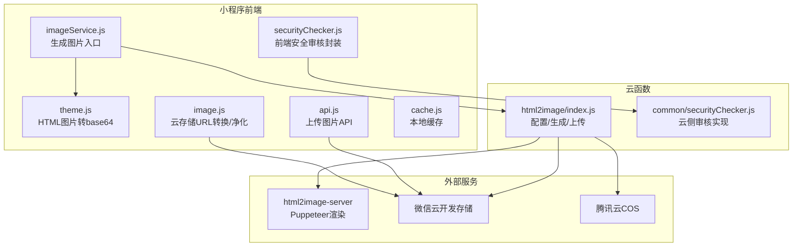
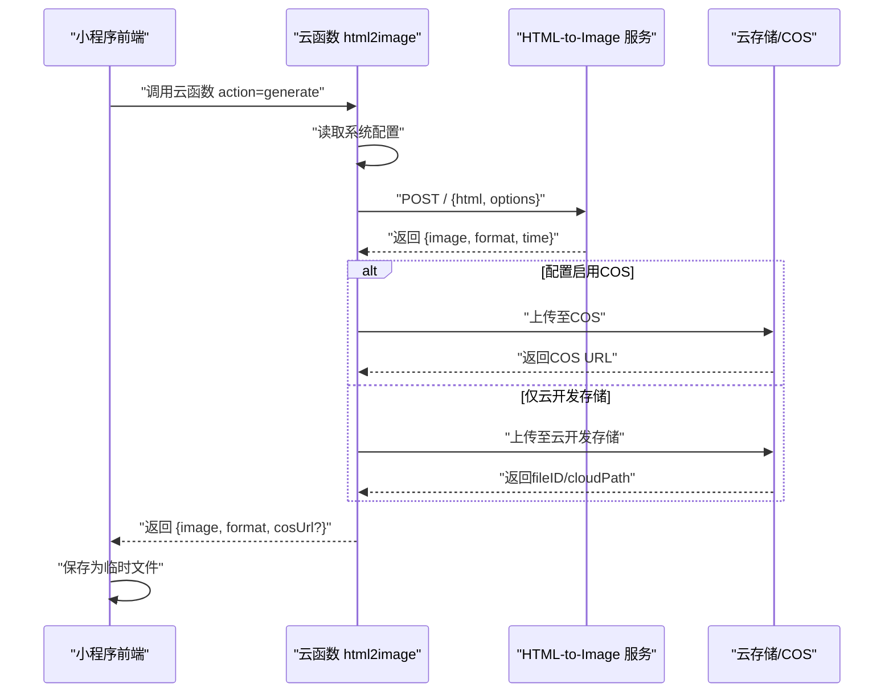
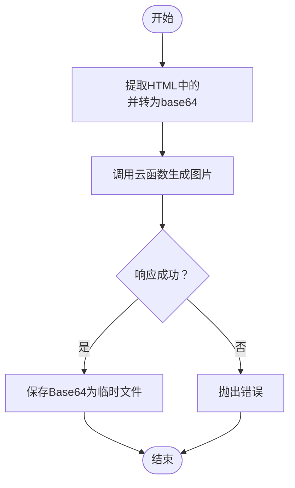
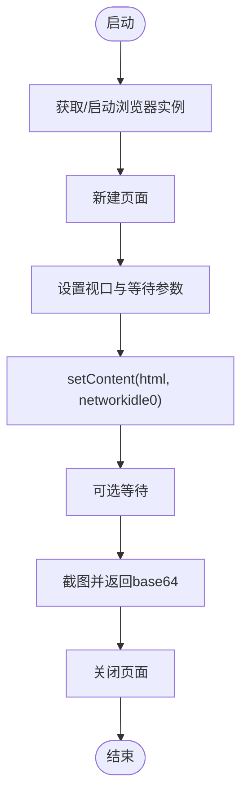
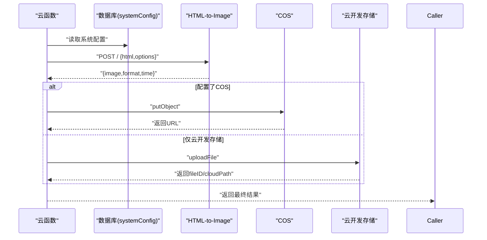
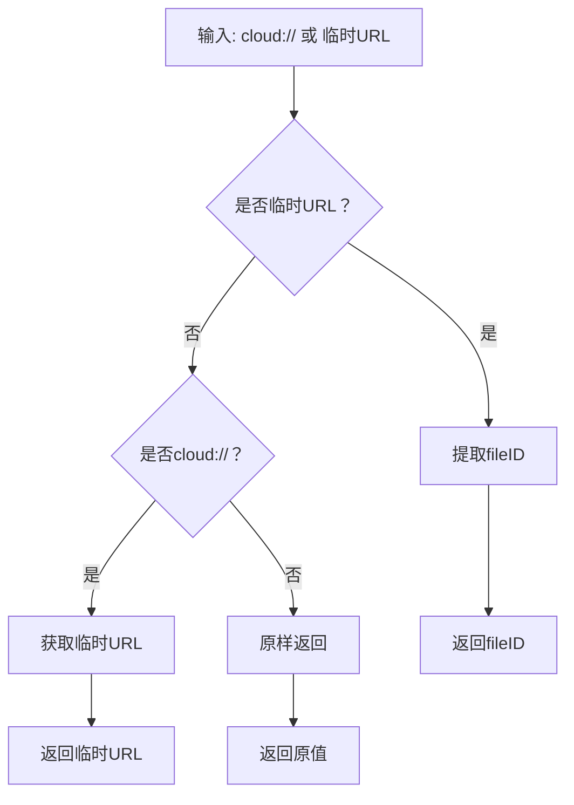
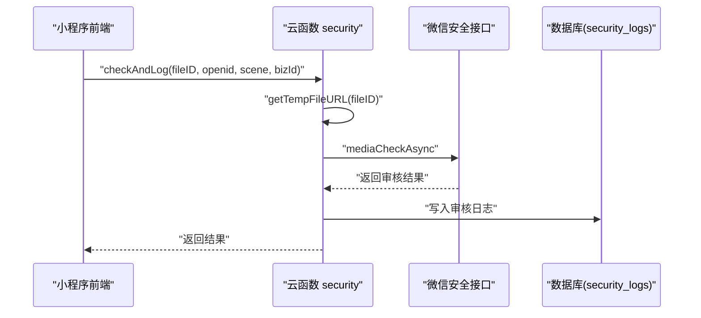
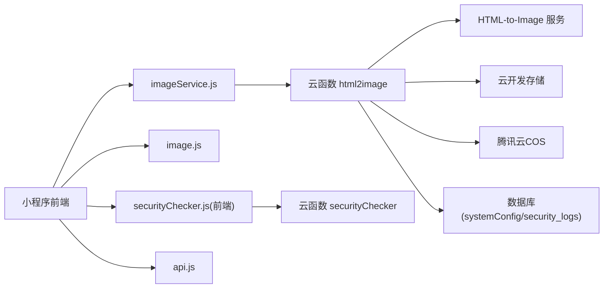

# 图片服务

<cite>
**本文引用的文件**
- [imageService.js](file://miniprogram/utils/imageService.js)
- [image.js](file://miniprogram/utils/image.js)
- [theme.js](file://miniprogram/utils/theme.js)
- [securityChecker.js](file://miniprogram/utils/securityChecker.js)
- [securityChecker.js](file://cloudfunctions/common/securityChecker.js)
- [index.js](file://cloudfunctions/html2image/index.js)
- [server.js](file://html2image-server/server.js)
- [config.js](file://html2image-server/config.js)
- [api.js](file://miniprogram/utils/api.js)
- [config.wxml](file://miniprogram/subpkg-admin/pages/admin/config.wxml)
- [cache.js](file://miniprogram/utils/cache.js)
- [detail.js](file://miniprogram/pages/pet/detail.js)
</cite>

## 目录
1. [简介](#简介)
2. [项目结构](#项目结构)
3. [核心组件](#核心组件)
4. [架构总览](#架构总览)
5. [详细组件分析](#详细组件分析)
6. [依赖分析](#依赖分析)
7. [性能考虑](#性能考虑)
8. [故障排查指南](#故障排查指南)
9. [结论](#结论)
10. [附录](#附录)

## 简介
本文件面向“图片服务模块”，系统性梳理从 HTML 渲染到图片生成、压缩、格式转换、上传、安全审核、云存储集成、文件管理、缓存与懒加载、性能优化、配置参数、质量控制与错误处理，以及与 API 管理器的协作关系与最佳实践。目标读者包括前端工程师、后端工程师、运维与测试人员。

## 项目结构
图片服务涉及三层协同：
- 小程序前端层：负责图片生成请求、URL 规范化、安全审核触发、缓存与懒加载策略。
- 云函数层：负责图片生成服务配置拉取、调用 HTML-to-Image 服务、可选上传至云存储/COS，并记录审核日志。
- HTML-to-Image 服务：基于 Puppeteer 的无头浏览器渲染引擎，将 HTML 转为 PNG/JPEG/WebP 图片。

图表来源
- [imageService.js:1-202](file://miniprogram/utils/imageService.js#L1-L202)
- [theme.js:1-200](file://miniprogram/utils/theme.js#L1-L200)
- [image.js:1-170](file://miniprogram/utils/image.js#L1-L170)
- [securityChecker.js:1-122](file://miniprogram/utils/securityChecker.js#L1-L122)
- [securityChecker.js:1-226](file://cloudfunctions/common/securityChecker.js#L1-L226)
- [index.js:1-205](file://cloudfunctions/html2image/index.js#L1-L205)
- [server.js:1-365](file://html2image-server/server.js#L1-L365)
- [config.js:1-268](file://html2image-server/config.js#L1-L268)
- [api.js:140-190](file://miniprogram/utils/api.js#L140-L190)

章节来源
- [imageService.js:1-202](file://miniprogram/utils/imageService.js#L1-L202)
- [index.js:1-205](file://cloudfunctions/html2image/index.js#L1-L205)
- [server.js:1-365](file://html2image-server/server.js#L1-L365)

## 核心组件
- 图片生成服务（小程序端）：将 HTML 渲染为图片，支持 PNG/JPEG/WebP，控制宽高、缩放、质量等参数，并保存为临时文件。
- HTML-to-Image 服务：基于 Puppeteer 的渲染引擎，提供健康检查、配置查询、主接口等。
- 云函数桥接：拉取系统配置、调用渲染服务、可选上传至云存储/COS。
- 云存储与 URL 规范化：将 cloud:// 与临时 URL 转换，确保缓存与分享稳定性。
- 安全审核：前后端协同，异步/同步审核，记录日志。
- 缓存与懒加载：本地缓存与 URL 刷新策略，减少重复请求与过期失效。

章节来源
- [imageService.js:48-80](file://miniprogram/utils/imageService.js#L48-L80)
- [server.js:157-205](file://html2image-server/server.js#L157-L205)
- [index.js:66-140](file://cloudfunctions/html2image/index.js#L66-L140)
- [image.js:38-126](file://miniprogram/utils/image.js#L38-L126)
- [securityChecker.js:1-226](file://cloudfunctions/common/securityChecker.js#L1-L226)

## 架构总览
图片服务的端到端流程如下：
- 小程序端准备 HTML，将其中的图片 URL 转为 base64（Puppeteer 无法访问本地/云存储路径）。
- 调用云函数 html2image，传递 HTML 与渲染选项。
- 云函数读取系统配置，向 HTML-to-Image 服务发起请求。
- HTML-to-Image 服务使用 Puppeteer 渲染并返回 base64 图片。
- 云函数可选将图片上传至云开发存储或腾讯云COS，并返回可用 URL。
- 小程序端保存图片到本地临时目录，供后续分享/预览使用。

图表来源
- [imageService.js:98-143](file://miniprogram/utils/imageService.js#L98-L143)
- [index.js:66-140](file://cloudfunctions/html2image/index.js#L66-L140)
- [server.js:276-318](file://html2image-server/server.js#L276-L318)

## 详细组件分析

### 组件A：图片生成服务（小程序端）
职责与流程
- 将 HTML 中的图片 URL 转为 base64 data URI，确保 Puppeteer 可访问。
- 调用云函数生成图片，解析响应并保存为临时文件。
- 支持自定义渲染参数：宽度、设备缩放、格式、质量、全屏截图等。

关键点
- 参数校验与默认值：宽度、缩放、格式、质量、加载提示文案。
- 错误处理：网络失败、云函数返回错误、保存文件失败。
- 临时文件保存：目录创建、二进制写入、异常捕获。

图表来源
- [imageService.js:59-80](file://miniprogram/utils/imageService.js#L59-L80)
- [imageService.js:98-143](file://miniprogram/utils/imageService.js#L98-L143)
- [imageService.js:149-196](file://miniprogram/utils/imageService.js#L149-L196)

章节来源
- [imageService.js:48-80](file://miniprogram/utils/imageService.js#L48-L80)
- [imageService.js:98-143](file://miniprogram/utils/imageService.js#L98-L143)
- [imageService.js:149-196](file://miniprogram/utils/imageService.js#L149-L196)

### 组件B：HTML-to-Image 服务（Node.js）
职责与流程
- 启动/复用 Puppeteer 浏览器实例，支持超时与断连处理。
- 提供健康检查、配置查询、主接口（POST /）。
- 渲染逻辑：设置视口、等待资源加载、按需等待、截图输出 base64。

关键点
- 浏览器池管理：单例、超时、断连重连。
- 渲染参数：宽高、deviceScaleFactor、format、quality、clip、waitFor。
- 错误处理：请求体过大、JSON 解析失败、渲染异常。

图表来源
- [server.js:65-105](file://html2image-server/server.js#L65-L105)
- [server.js:157-205](file://html2image-server/server.js#L157-L205)

章节来源
- [server.js:1-365](file://html2image-server/server.js#L1-L365)
- [config.js:27-74](file://html2image-server/config.js#L27-L74)

### 组件C：云函数桥接（html2image）
职责与流程
- 拉取系统配置（图片服务地址、超时、COS/云开发密钥等）。
- 调用 HTML-to-Image 服务生成图片。
- 可选上传至腾讯云COS或云开发存储，返回可用 URL。
- 提供上传云存储的独立接口。

关键点
- 配置优先级：数据库配置优先于默认值。
- 异常降级：上传COS失败不影响主流程。
- 云存储上传：COS 与云开发存储两种路径。

图表来源
- [index.js:32-55](file://cloudfunctions/html2image/index.js#L32-L55)
- [index.js:66-140](file://cloudfunctions/html2image/index.js#L66-L140)
- [index.js:145-172](file://cloudfunctions/html2image/index.js#L145-L172)
- [index.js:177-205](file://cloudfunctions/html2image/index.js#L177-L205)

章节来源
- [index.js:1-205](file://cloudfunctions/html2image/index.js#L1-L205)

### 组件D：云存储与 URL 规范化
职责与流程
- 将 cloud:// 转为临时访问 URL，便于渲染与分享。
- 将临时 URL 转回 cloud:// fileID，确保缓存与持久化一致性。
- 批量转换与净化，保证数据结构稳定。

关键点
- 临时 URL 提取 fileID 的正则与拼接规则。
- 异常处理：无效 URL、转换失败时的回退策略。

图表来源
- [image.js:11-31](file://miniprogram/utils/image.js#L11-L31)
- [image.js:64-80](file://miniprogram/utils/image.js#L64-L80)
- [image.js:133-144](file://miniprogram/utils/image.js#L133-L144)

章节来源
- [image.js:1-170](file://miniprogram/utils/image.js#L1-L170)

### 组件E：安全审核机制
职责与流程
- 前端封装：提供异步/同步审核接口，批量触发与文本审核。
- 云函数实现：将 fileID 转为临时 URL，调用微信安全接口，记录审核日志。

关键点
- 场景映射：头像、封面、宠物、足迹、评论、昵称等。
- 异步审核：提交后返回 trace_id，结果通过异步回调返回。
- 审核日志：记录 fileID、场景、bizId、openid、状态与原因。

图表来源
- [securityChecker.js:1-122](file://miniprogram/utils/securityChecker.js#L1-L122)
- [securityChecker.js:74-105](file://cloudfunctions/common/securityChecker.js#L74-L105)
- [securityChecker.js:180-207](file://cloudfunctions/common/securityChecker.js#L180-L207)

章节来源
- [securityChecker.js:1-122](file://miniprogram/utils/securityChecker.js#L1-L122)
- [securityChecker.js:1-226](file://cloudfunctions/common/securityChecker.js#L1-L226)

### 组件F：上传与质量控制
职责与流程
- 小程序上传：调用 wx.cloud.uploadFile，返回 fileID。
- 质量控制：PNG/JPEG/WebP 格式与质量参数由渲染服务控制。
- 审核触发：上传成功后异步触发安全审核。

关键点
- 路径组织：prefix/subPath/filename，便于分类管理。
- 错误处理：上传失败时统一错误处理与消息提示。
- 质量参数：渲染服务端控制，小程序端通过云函数透传。

章节来源
- [api.js:156-178](file://miniprogram/utils/api.js#L156-L178)
- [index.js:66-140](file://cloudfunctions/html2image/index.js#L66-L140)
- [server.js:176-188](file://html2image-server/server.js#L176-L188)

### 组件G：缓存与懒加载
职责与流程
- 本地缓存：统一前缀、过期时间、清理过期缓存。
- 懒加载：在需要时才发起请求，避免不必要的网络消耗。
- URL 刷新：云存储签名过期时自动刷新，避免 403。

章节来源
- [cache.js:1-121](file://miniprogram/utils/cache.js#L1-L121)
- [image.js:108-126](file://miniprogram/utils/image.js#L108-L126)
- [detail.js:119-133](file://miniprogram/pages/pet/detail.js#L119-L133)

## 依赖分析
- 小程序端依赖
  - imageService.js 依赖 theme.js（HTML 图片 base64 转换）、云函数（生成图片）、本地文件系统（保存临时文件）。
  - image.js 依赖 wx.cloud（获取临时 URL）、正则与字符串处理。
  - securityChecker.js 依赖 wx.cloud.callFunction（调用云函数）。
  - api.js 依赖 wx.cloud.uploadFile（上传图片）。
- 云函数依赖
  - html2image/index.js 依赖 wx-server-sdk、request-promise、cos-nodejs-sdk-v5、数据库读取配置。
  - common/securityChecker.js 依赖 wx-server-sdk 开放接口与数据库。
- HTML-to-Image 服务依赖
  - puppeteer、配置模块、日志模块。

图表来源
- [imageService.js:16-201](file://miniprogram/utils/imageService.js#L16-L201)
- [image.js:1-170](file://miniprogram/utils/image.js#L1-L170)
- [securityChecker.js:1-122](file://miniprogram/utils/securityChecker.js#L1-L122)
- [index.js:1-205](file://cloudfunctions/html2image/index.js#L1-L205)
- [securityChecker.js:1-226](file://cloudfunctions/common/securityChecker.js#L1-L226)
- [server.js:1-365](file://html2image-server/server.js#L1-L365)

## 性能考虑
- 浏览器实例复用：避免频繁启动/关闭，降低冷启动成本。
- 渲染参数优化：合理设置 width、deviceScaleFactor、format、quality，平衡清晰度与体积。
- 请求体大小限制：服务端默认最大请求体大小，避免超大 HTML 导致内存压力。
- 超时控制：浏览器启动超时、协议超时、云函数调用超时，避免长时间阻塞。
- 上传降级：COS 上传失败不影响主流程，保证可用性。
- 缓存策略：本地缓存与 URL 刷新，减少重复请求与过期失效。

章节来源
- [server.js:65-105](file://html2image-server/server.js#L65-L105)
- [server.js:164-188](file://html2image-server/server.js#L164-L188)
- [config.js:70-74](file://html2image-server/config.js#L70-L74)
- [index.js:114-118](file://cloudfunctions/html2image/index.js#L114-L118)

## 故障排查指南
常见问题与定位
- 生成图片失败
  - 检查 HTML-to-Image 服务健康状态与日志。
  - 确认渲染参数合法范围（宽高、缩放、质量）。
  - 查看云函数返回的错误信息与 detail。
- 云存储上传失败
  - 检查密钥、存储桶、区域配置。
  - 确认文件大小与权限。
- 审核未生效
  - 确认 fileID 格式与临时 URL 获取成功。
  - 检查安全日志写入是否成功。
- URL 过期导致 403
  - 使用 image.js 的转换函数刷新临时 URL。
  - 在页面生命周期中定期刷新头像等关键图片 URL。

章节来源
- [server.js:308-316](file://html2image-server/server.js#L308-L316)
- [index.js:132-139](file://cloudfunctions/html2image/index.js#L132-L139)
- [securityChecker.js:188-207](file://cloudfunctions/common/securityChecker.js#L188-L207)
- [image.js:64-80](file://miniprogram/utils/image.js#L64-L80)

## 结论
该图片服务模块通过小程序端的统一入口、云函数的桥接与配置管理、以及 HTML-to-Image 服务的高效渲染，实现了从 HTML 到图片的完整链路。配合云存储与安全审核、URL 规范化、缓存与懒加载策略，整体具备良好的可维护性与扩展性。建议持续关注渲染参数与超时配置，结合监控与日志完善可观测性。

## 附录

### 配置参数与质量控制
- 小程序端渲染参数
  - 宽度：像素
  - 设备缩放：倍数
  - 格式：png/jpeg/webp
  - 质量：0-100（仅对非 PNG）
  - 全屏截图：布尔
- HTML-to-Image 服务默认配置
  - 默认视口：宽、高、deviceScaleFactor
  - 默认格式：png
  - 默认质量：90
  - 加载超时：毫秒
  - 请求体最大限制：字节
- 云函数配置
  - 图片服务地址：默认兜底地址
  - 超时：毫秒
  - COS 密钥、存储桶、区域：可选启用

章节来源
- [imageService.js:59-66](file://miniprogram/utils/imageService.js#L59-L66)
- [server.js:164-188](file://html2image-server/server.js#L164-L188)
- [config.js:27-74](file://html2image-server/config.js#L27-L74)
- [index.js:32-55](file://cloudfunctions/html2image/index.js#L32-L55)

### 错误处理方法
- 网络与云函数调用失败：捕获 errMsg，返回统一错误对象。
- 保存文件失败：捕获编码/写入异常，返回明确错误信息。
- 审核服务异常：前端降级放行，记录日志以便后续处理。
- URL 转换失败：保留原值并记录错误，避免中断流程。

章节来源
- [imageService.js:133-142](file://miniprogram/utils/imageService.js#L133-L142)
- [imageService.js:177-195](file://miniprogram/utils/imageService.js#L177-L195)
- [securityChecker.js:36-40](file://miniprogram/utils/securityChecker.js#L36-L40)
- [image.js:76-79](file://miniprogram/utils/image.js#L76-L79)

### 扩展接口与自定义处理
- 自定义渲染选项：通过云函数透传 options 至 HTML-to-Image 服务。
- 自定义上传路径：在上传 API 中指定 prefix 与 subPath。
- 自定义安全场景：在调用安全审核时传入场景标识。
- 自定义缓存策略：在缓存工具中设置过期时间与清理策略。

章节来源
- [api.js:156-178](file://miniprogram/utils/api.js#L156-L178)
- [securityChecker.js:49-74](file://miniprogram/utils/securityChecker.js#L49-L74)
- [cache.js:11-36](file://miniprogram/utils/cache.js#L11-L36)

### 与 API 管理器的协作关系与最佳实践
- API 管理器提供上传图片能力，内部调用 wx.cloud.uploadFile 并触发安全审核。
- 最佳实践
  - 上传成功后再触发异步审核，避免阻塞主流程。
  - 对批量上传采用顺序或并发控制，避免资源争用。
  - 在页面生命周期中对关键图片 URL 进行刷新，避免签名过期。
  - 使用统一的错误处理与日志记录，便于问题定位。

章节来源
- [api.js:156-178](file://miniprogram/utils/api.js#L156-L178)
- [detail.js:119-133](file://miniprogram/pages/pet/detail.js#L119-L133)