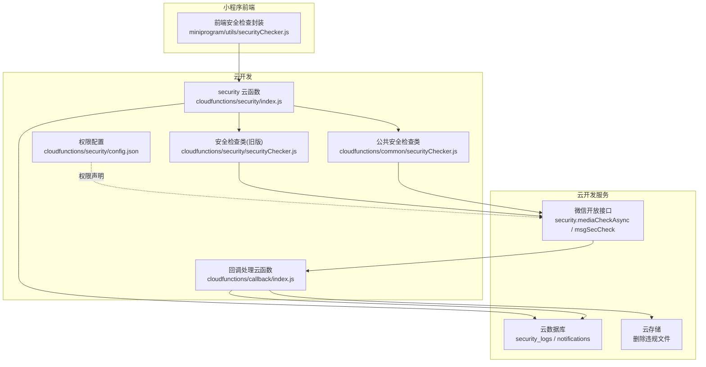
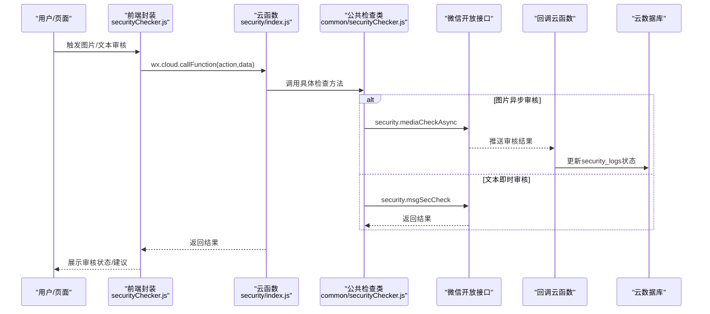
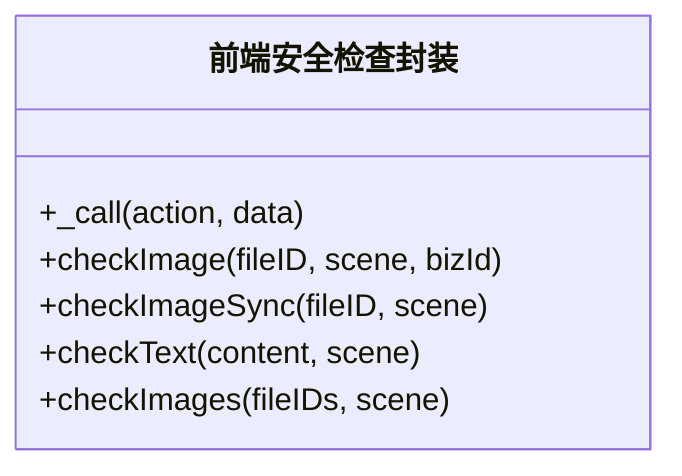
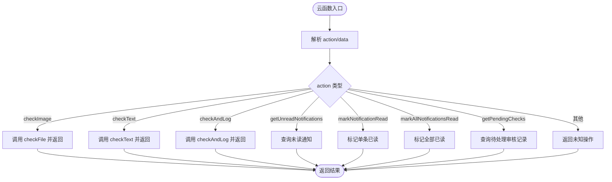
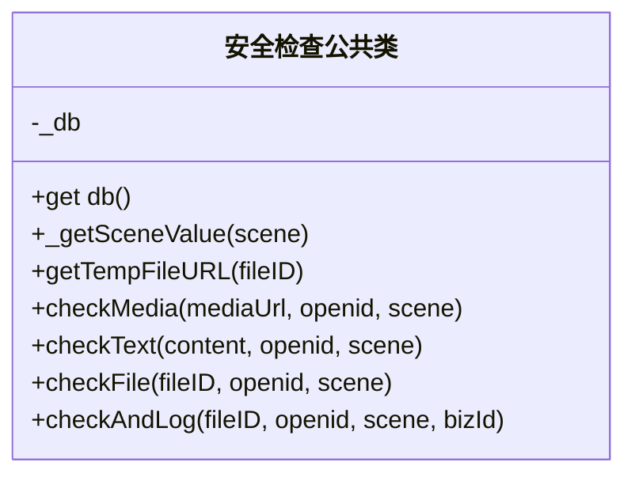
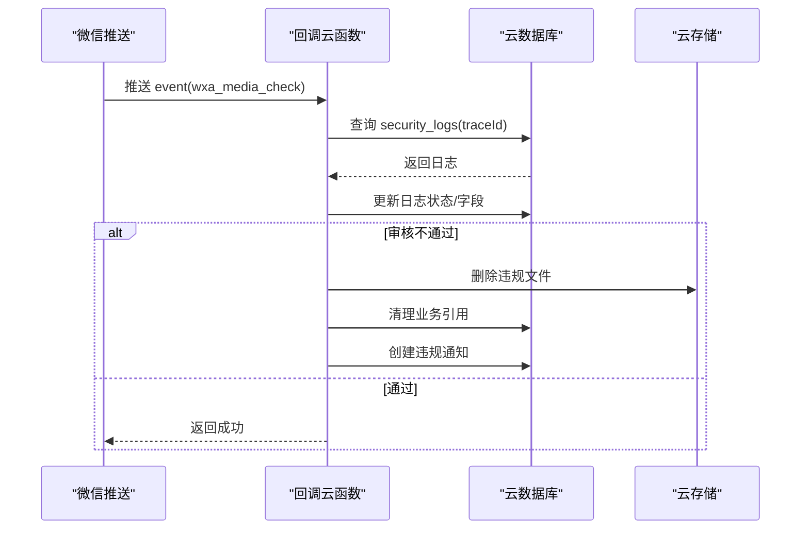
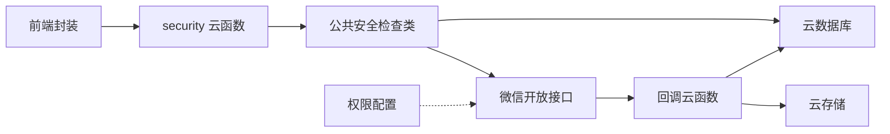

# 安全检查器

<cite>
**本文档引用的文件**
- [cloudfunctions/security/securityChecker.js](file://cloudfunctions/security/securityChecker.js)
- [cloudfunctions/common/securityChecker.js](file://cloudfunctions/common/securityChecker.js)
- [cloudfunctions/security/index.js](file://cloudfunctions/security/index.js)
- [cloudfunctions/callback/index.js](file://cloudfunctions/callback/index.js)
- [cloudfunctions/security/config.json](file://cloudfunctions/security/config.json)
- [cloudfunctions/common/utils.js](file://cloudfunctions/common/utils.js)
- [miniprogram/utils/securityChecker.js](file://miniprogram/utils/securityChecker.js)
- [miniprogram/utils/imageService.js](file://miniprogram/utils/imageService.js)
- [miniprogram/pages/pet/detail.js](file://miniprogram/pages/pet/detail.js)
</cite>

## 目录
1. [引言](#引言)
2. [项目结构](#项目结构)
3. [核心组件](#核心组件)
4. [架构总览](#架构总览)
5. [详细组件分析](#详细组件分析)
6. [依赖分析](#依赖分析)
7. [性能考虑](#性能考虑)
8. [故障排查指南](#故障排查指南)
9. [结论](#结论)
10. [附录](#附录)

## 引言
本文件面向“安全检查器”的设计与实现，覆盖图片安全审核、内容过滤与访问控制的机制；解释配置策略、审核规则与风险评估思路；阐述异步处理、回调清理与数据库日志；给出配置参数、扩展接口与集成方法；并提供与API管理器协作的最佳实践、错误处理与日志记录建议，以及测试与质量保障指南。

## 项目结构
安全检查器由三层组成：
- 前端封装层：小程序端统一调用云函数的安全检查入口，支持异步/同步两种模式，并对文本审核服务不可用时进行降级放行。
- 云函数薄包装层：security 云函数作为动作分发器，将请求委派给公共安全检查类，并提供“未读通知”“待处理审核记录查询”等辅助能力。
- 安全检查公共类：封装图片与文本审核、云存储文件ID到URL转换、审核日志落库、异步回调处理等核心逻辑。
- 回调处理云函数：接收微信异步审核结果，更新日志状态、清理违规资源并下发违规通知。

**图表来源**
- [cloudfunctions/security/index.js:15-64](file://cloudfunctions/security/index.js#L15-L64)
- [cloudfunctions/common/securityChecker.js:30-208](file://cloudfunctions/common/securityChecker.js#L30-L208)
- [cloudfunctions/security/securityChecker.js:30-191](file://cloudfunctions/security/securityChecker.js#L30-L191)
- [cloudfunctions/callback/index.js:42-88](file://cloudfunctions/callback/index.js#L42-L88)
- [cloudfunctions/security/config.json:1-9](file://cloudfunctions/security/config.json#L1-L9)

**章节来源**
- [cloudfunctions/security/index.js:15-64](file://cloudfunctions/security/index.js#L15-L64)
- [cloudfunctions/common/securityChecker.js:30-208](file://cloudfunctions/common/securityChecker.js#L30-L208)
- [cloudfunctions/security/securityChecker.js:30-191](file://cloudfunctions/security/securityChecker.js#L30-L191)
- [cloudfunctions/callback/index.js:42-88](file://cloudfunctions/callback/index.js#L42-L88)
- [cloudfunctions/security/config.json:1-9](file://cloudfunctions/security/config.json#L1-L9)

## 核心组件
- 前端安全检查封装：提供图片异步审核、图片同步审核、文本审核、批量图片审核等方法，并以单例导出，便于全局复用。
- 云函数薄包装层：根据 action 分发至具体检查逻辑，同时提供通知查询与待处理审核记录查询能力。
- 公共安全检查类：统一封装图片异步审核、文本即时审核、云存储文件ID转临时URL、审核日志落库、场景映射与标签映射。
- 回调处理云函数：接收微信推送的异步审核结果，更新日志状态，清理违规资源并创建违规通知。

关键职责与边界：
- 前端仅负责调用云函数与展示结果，不直接调用微信开放接口。
- 云函数薄包装层仅做参数校验与动作分发，核心逻辑在公共类。
- 公共类负责与微信开放接口交互、数据库读写与错误处理。
- 回调云函数负责最终态治理（删除文件、清理引用、通知用户）。

**章节来源**
- [miniprogram/utils/securityChecker.js:13-107](file://miniprogram/utils/securityChecker.js#L13-L107)
- [cloudfunctions/security/index.js:15-64](file://cloudfunctions/security/index.js#L15-L64)
- [cloudfunctions/common/securityChecker.js:30-208](file://cloudfunctions/common/securityChecker.js#L30-L208)
- [cloudfunctions/callback/index.js:57-109](file://cloudfunctions/callback/index.js#L57-L109)

## 架构总览
整体流程分为“提交审核”“异步回调”“违规处置”三段式：

**图表来源**
- [miniprogram/utils/securityChecker.js:22-41](file://miniprogram/utils/securityChecker.js#L22-L41)
- [cloudfunctions/security/index.js:22-39](file://cloudfunctions/security/index.js#L22-L39)
- [cloudfunctions/common/securityChecker.js:74-105](file://cloudfunctions/common/securityChecker.js#L74-L105)
- [cloudfunctions/callback/index.js:42-88](file://cloudfunctions/callback/index.js#L42-L88)

## 详细组件分析

### 组件一：前端安全检查封装（小程序）
- 功能要点
  - 异步审核：提交后不阻塞主线程，适合上传后触发的后台审核。
  - 同步审核：等待结果后再继续业务流程，适合强约束场景。
  - 文本审核：对空内容直接放行，服务异常时采用降级放行策略。
  - 批量审核：遍历 fileID 列表并独立触发异步审核。
- 错误处理
  - 云函数调用失败时返回统一结构，前端记录日志并提示。
  - 文本审核服务不可用时返回通过，避免影响用户体验。
- 性能与体验
  - 异步模式降低首屏渲染压力；同步模式确保关键流程可控。

**图表来源**
- [miniprogram/utils/securityChecker.js:13-107](file://miniprogram/utils/securityChecker.js#L13-L107)

**章节来源**
- [miniprogram/utils/securityChecker.js:13-107](file://miniprogram/utils/securityChecker.js#L13-L107)

### 组件二：云函数薄包装层（security）
- 功能要点
  - 动作分发：根据 action 调用对应检查方法（图片、文本、异步提交）。
  - 辅助能力：未读通知查询、标记已读、全部已读、待处理审核记录查询。
  - 统一错误处理：捕获异常并返回标准结构。
- 数据访问控制
  - 通知查询与标记均基于 openid 进行用户隔离与权限校验。
- 与公共类的关系
  - 将核心逻辑委派给公共安全检查类，保持薄包装与高内聚。

**图表来源**
- [cloudfunctions/security/index.js:15-64](file://cloudfunctions/security/index.js#L15-L64)
- [cloudfunctions/security/index.js:69-144](file://cloudfunctions/security/index.js#L69-L144)
- [cloudfunctions/security/index.js:151-200](file://cloudfunctions/security/index.js#L151-L200)

**章节来源**
- [cloudfunctions/security/index.js:15-64](file://cloudfunctions/security/index.js#L15-L64)
- [cloudfunctions/security/index.js:69-144](file://cloudfunctions/security/index.js#L69-L144)
- [cloudfunctions/security/index.js:151-200](file://cloudfunctions/security/index.js#L151-L200)

### 组件三：公共安全检查类（common）
- 功能要点
  - 场景映射：将字符串场景映射为数字场景值，覆盖资料、评论、论坛、社交日志等。
  - 标签映射：将微信返回的标签码映射为中文标签。
  - 图片异步审核：调用 security.mediaCheckAsync，返回 trace_id 与“待定”建议。
  - 文本即时审核：调用 security.msgSecCheck，返回通过/拦截/可疑等建议及标签。
  - 文件ID转URL：将 cloud:// 文件ID转换为临时HTTP URL，再进行审核。
  - 日志落库：将审核请求与上下文写入 security_logs，便于后续追踪与治理。
- 错误处理
  - 对微信接口调用失败与异常进行捕获与返回，避免中断流程。
  - 获取临时URL失败时返回明确原因。
- 性能与可靠性
  - 异步审核不阻塞前端，提升响应速度。
  - 日志落库用于审计与回溯，便于问题定位。

**图表来源**
- [cloudfunctions/common/securityChecker.js:30-208](file://cloudfunctions/common/securityChecker.js#L30-L208)

**章节来源**
- [cloudfunctions/common/securityChecker.js:30-208](file://cloudfunctions/common/securityChecker.js#L30-L208)

### 组件四：回调处理云函数（callback）
- 功能要点
  - 接收微信推送的异步审核结果，按 trace_id 匹配 security_logs。
  - 更新日志状态为 passed/failed/risky，并记录 processed 标记与 processedTime。
  - 不通过时执行“清理”：删除云存储文件、从业务集合中移除引用、创建违规通知。
- 数据一致性
  - 通过 trace_id 关联日志，确保回调与提交一一对应。
  - 对不同场景（头像、封面、宠物、足迹）分别清理，兜底策略遍历常用集合。
- 可观测性
  - 对未匹配日志进行告警记录，便于排查异常回调。

**图表来源**
- [cloudfunctions/callback/index.js:42-88](file://cloudfunctions/callback/index.js#L42-L88)
- [cloudfunctions/callback/index.js:114-196](file://cloudfunctions/callback/index.js#L114-L196)
- [cloudfunctions/callback/index.js:202-223](file://cloudfunctions/callback/index.js#L202-L223)

**章节来源**
- [cloudfunctions/callback/index.js:42-88](file://cloudfunctions/callback/index.js#L42-L88)
- [cloudfunctions/callback/index.js:114-196](file://cloudfunctions/callback/index.js#L114-L196)
- [cloudfunctions/callback/index.js:202-223](file://cloudfunctions/callback/index.js#L202-L223)

### 组件五：权限配置与工具
- 权限配置
  - 在 security 云函数的 config.json 中声明所需 openapi 权限，确保 mediaCheckAsync 与 msgSecCheck 可用。
- 通用工具
  - 提供统一的环境初始化、数据库获取、OpenID 获取、响应封装与错误处理工具，便于在各云函数中复用。

**章节来源**
- [cloudfunctions/security/config.json:1-9](file://cloudfunctions/security/config.json#L1-L9)
- [cloudfunctions/common/utils.js:3-44](file://cloudfunctions/common/utils.js#L3-L44)

## 依赖分析
- 前端依赖云函数薄包装层，后者依赖公共安全检查类。
- 公共安全检查类依赖微信开放接口与云数据库。
- 回调云函数依赖云数据库与云存储，形成闭环治理。
- 权限配置文件为云函数运行时提供必要的接口授权。

**图表来源**
- [cloudfunctions/security/index.js:15-64](file://cloudfunctions/security/index.js#L15-L64)
- [cloudfunctions/common/securityChecker.js:30-208](file://cloudfunctions/common/securityChecker.js#L30-L208)
- [cloudfunctions/callback/index.js:42-88](file://cloudfunctions/callback/index.js#L42-L88)
- [cloudfunctions/security/config.json:1-9](file://cloudfunctions/security/config.json#L1-L9)

**章节来源**
- [cloudfunctions/security/index.js:15-64](file://cloudfunctions/security/index.js#L15-L64)
- [cloudfunctions/common/securityChecker.js:30-208](file://cloudfunctions/common/securityChecker.js#L30-L208)
- [cloudfunctions/callback/index.js:42-88](file://cloudfunctions/callback/index.js#L42-L88)
- [cloudfunctions/security/config.json:1-9](file://cloudfunctions/security/config.json#L1-L9)

## 性能考虑
- 异步审核优先：图片审核采用异步模式，避免阻塞前端，缩短首屏时间。
- 批量处理：前端提供批量图片审核接口，减少多次调用开销。
- 降级策略：文本审核服务不可用时采用“放行”策略，保障业务连续性。
- 超时治理：云函数提供“待处理审核记录查询”，对长时间 pending 的记录进行标记，便于人工干预。
- 日志与追踪：通过 trace_id 串联提交与回调，便于定位性能瓶颈与异常路径。

[本节为通用性能讨论，不直接分析具体文件]

## 故障排查指南
- 常见问题与定位
  - 云函数调用失败：检查前端封装的 _call 方法返回结构，查看控制台日志。
  - 审核接口错误：关注公共类中对 errcode 的判断与错误信息返回。
  - 临时URL获取失败：确认 fileID 格式与权限，检查 getTempFileURL 的返回。
  - 回调未命中日志：检查 trace_id 是否正确传递，确认 security_logs 中是否存在对应记录。
  - 违规清理未生效：确认回调云函数是否被触发、权限配置是否正确、业务集合清理逻辑是否覆盖目标场景。
- 建议措施
  - 增加重试与退避策略（针对网络抖动）。
  - 对 pending 超时记录定期巡检与人工复核。
  - 对高频场景增加缓存与去重（如同一文件短时间内重复提交）。

**章节来源**
- [miniprogram/utils/securityChecker.js:22-41](file://miniprogram/utils/securityChecker.js#L22-L41)
- [cloudfunctions/common/securityChecker.js:74-105](file://cloudfunctions/common/securityChecker.js#L74-L105)
- [cloudfunctions/callback/index.js:62-71](file://cloudfunctions/callback/index.js#L62-L71)

## 结论
本安全检查器通过“前端封装 + 云函数薄包装 + 公共检查类 + 回调治理”的分层设计，实现了图片与文本的合规审核、异步处理与闭环治理。其配置简洁、扩展性强，能够满足多场景下的内容安全需求，并具备良好的可观测性与可维护性。

[本节为总结性内容，不直接分析具体文件]

## 附录

### 配置参数与扩展接口
- 场景映射（字符串到数字）
  - avatar/cover/pet/footprint/comment/nickname → 1/2/3/4
- 标签映射（微信标签码到中文）
  - 100 正常；20001 时政；20002 色情；20006 违法犯罪；21000 其他
- 云函数动作
  - checkImage：对已上传文件进行图片异步审核
  - checkText：对文本进行即时审核
  - checkAndLog：提交审核并记录日志
  - getUnreadNotifications/markNotificationRead/markAllNotificationsRead：通知相关
  - getPendingChecks：查询待处理审核记录
- 权限配置
  - security.mediaCheckAsync、security.msgSecCheck

**章节来源**
- [cloudfunctions/common/securityChecker.js:10-28](file://cloudfunctions/common/securityChecker.js#L10-L28)
- [cloudfunctions/security/index.js:22-55](file://cloudfunctions/security/index.js#L22-L55)
- [cloudfunctions/security/config.json:1-9](file://cloudfunctions/security/config.json#L1-L9)

### 集成方法与最佳实践
- 前端集成
  - 使用单例封装，跨页面/组件复用。
  - 上传后采用异步审核，编辑/发布前采用同步审核。
  - 对空文本直接放行，服务异常时降级放行。
- 云函数集成
  - 通过薄包装层统一入口，避免分散调用。
  - 对通知与待处理记录提供统一查询接口，便于前端展示。
- 回调集成
  - 在云开发控制台配置消息推送为云函数模式，绑定回调云函数。
  - 确保权限配置包含所需 openapi。
- 最佳实践
  - 严格区分场景与标签，便于审计与统计。
  - 对高频提交进行去重与限流，避免重复审核。
  - 对 pending 超时记录建立巡检与报警机制。

**章节来源**
- [miniprogram/utils/securityChecker.js:50-92](file://miniprogram/utils/securityChecker.js#L50-L92)
- [cloudfunctions/security/index.js:69-144](file://cloudfunctions/security/index.js#L69-L144)
- [cloudfunctions/callback/index.js:1-34](file://cloudfunctions/callback/index.js#L1-L34)
- [cloudfunctions/security/config.json:1-9](file://cloudfunctions/security/config.json#L1-L9)

### 测试方法与质量保证
- 单元测试建议
  - 对 checkText/checkImage/checkFile 的输入输出进行断言，覆盖正常/异常/空值/越权等场景。
  - 对 checkAndLog 的日志落库行为进行验证，确保字段完整。
- 集成测试建议
  - 模拟微信回调，验证回调云函数对日志状态、文件删除、业务清理与通知创建的正确性。
  - 验证通知查询与标记接口的权限隔离与数据一致性。
- 质量保障
  - 建立监控指标：审核成功率、平均耗时、pending 超时比例、回调延迟。
  - 对异常路径进行日志埋点与告警，确保问题可追溯。

[本节为通用测试与质量建议，不直接分析具体文件]