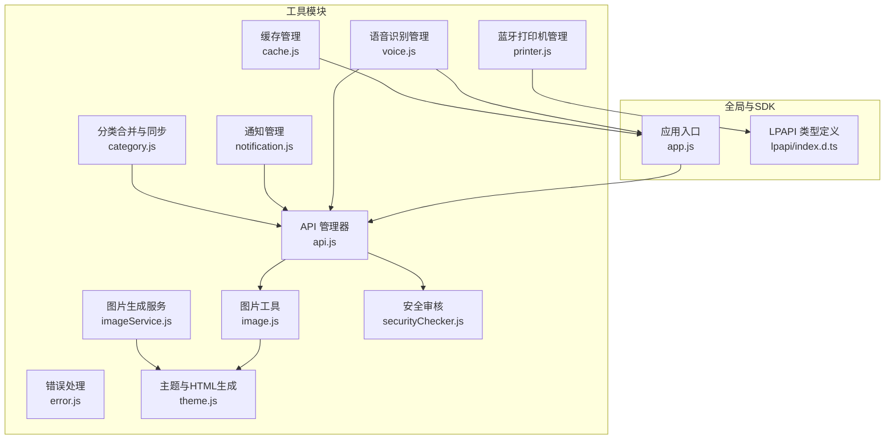
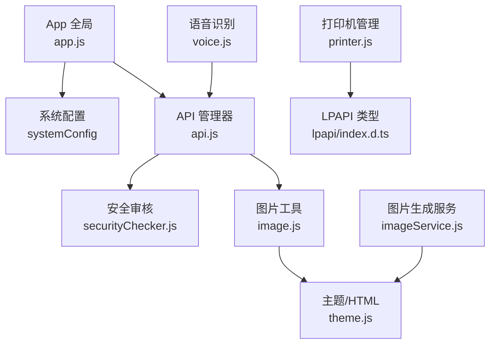
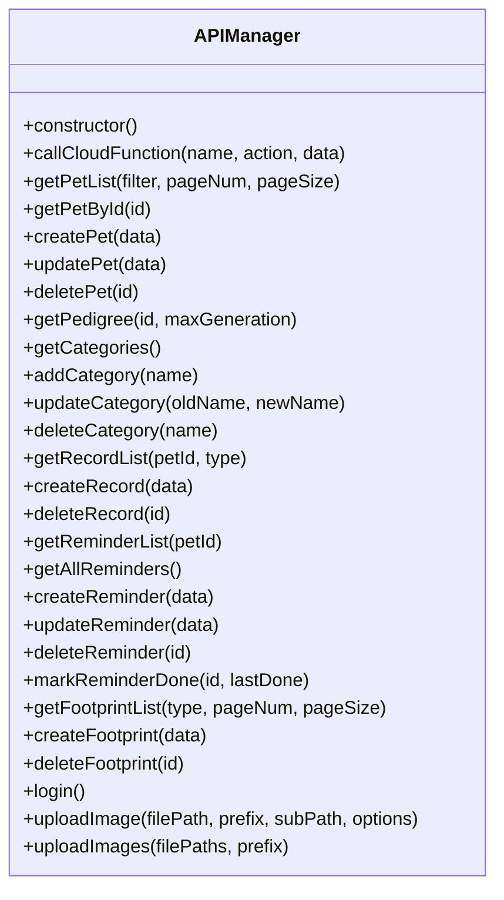
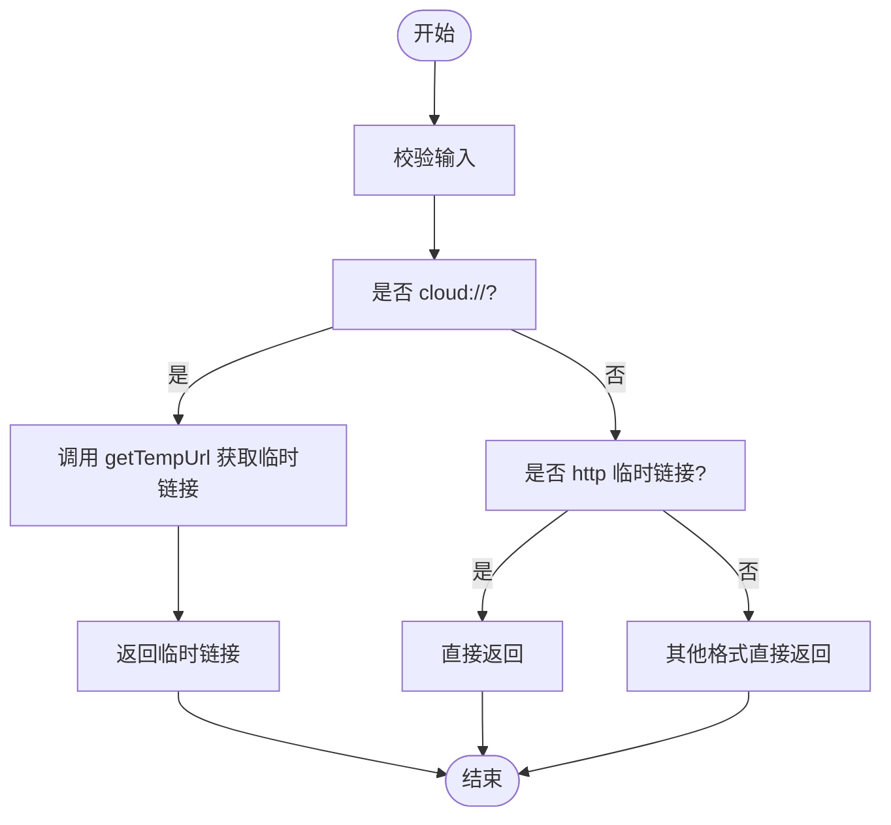
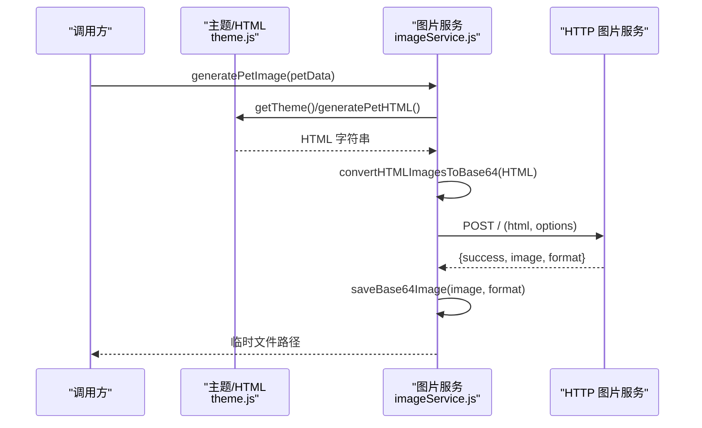
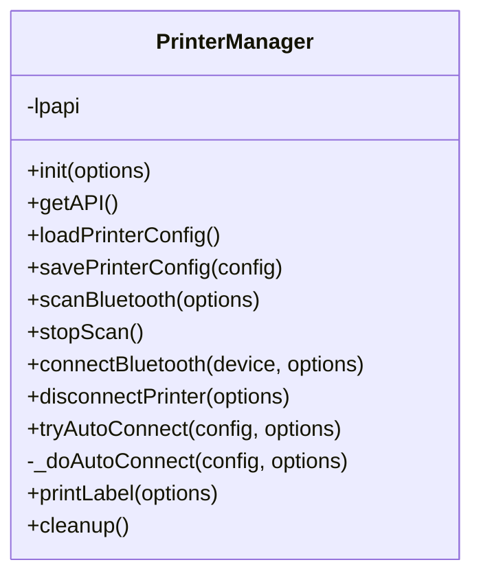
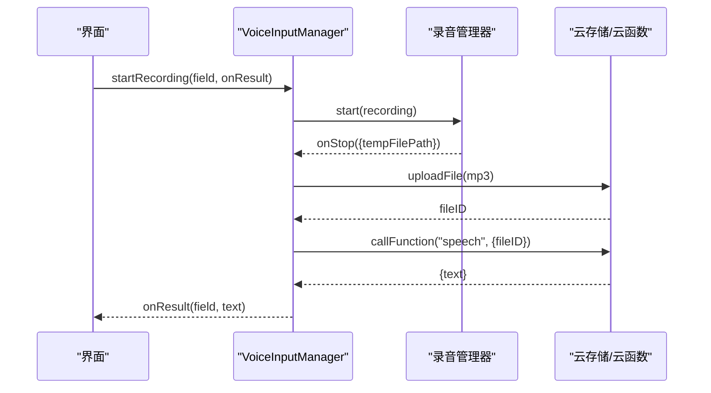
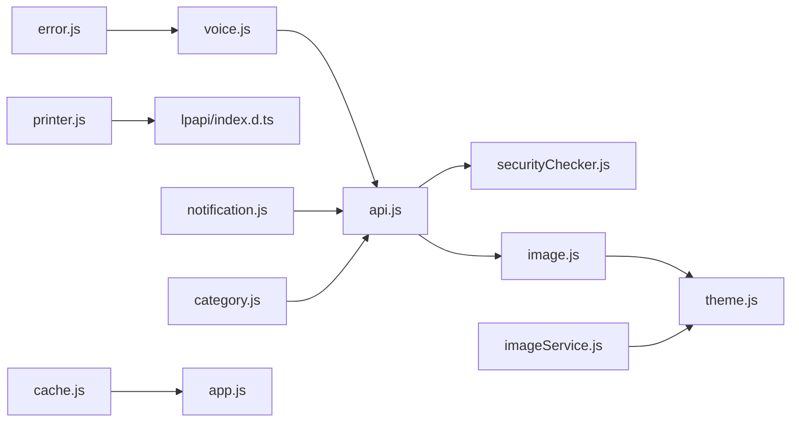

# 工具类库

<cite>
**本文引用的文件**
- [miniprogram/utils/api.js](file://miniprogram/utils/api.js)
- [miniprogram/utils/image.js](file://miniprogram/utils/image.js)
- [miniprogram/utils/imageService.js](file://miniprogram/utils/imageService.js)
- [miniprogram/utils/printer.js](file://miniprogram/utils/printer.js)
- [miniprogram/utils/voice.js](file://miniprogram/utils/voice.js)
- [miniprogram/utils/error.js](file://miniprogram/utils/error.js)
- [miniprogram/utils/securityChecker.js](file://miniprogram/utils/securityChecker.js)
- [miniprogram/utils/cache.js](file://miniprogram/utils/cache.js)
- [miniprogram/utils/notification.js](file://miniprogram/utils/notification.js)
- [miniprogram/utils/category.js](file://miniprogram/utils/category.js)
- [miniprogram/utils/theme.js](file://miniprogram/utils/theme.js)
- [miniprogram/app.js](file://miniprogram/app.js)
- [miniprogram/lpapi/index.d.ts](file://miniprogram/lpapi/index.d.ts)
</cite>

## 目录
1. [引言](#引言)
2. [项目结构](#项目结构)
3. [核心组件](#核心组件)
4. [架构总览](#架构总览)
5. [详细组件分析](#详细组件分析)
6. [依赖分析](#依赖分析)
7. [性能考虑](#性能考虑)
8. [故障排查指南](#故障排查指南)
9. [结论](#结论)
10. [附录](#附录)

## 引言
本文件面向“养龟档案”项目中的工具类库，系统梳理并深入解析以下工具模块：
- API 调用封装与云函数代理
- 图片处理与云存储 URL 转换
- 图片生成服务（基于外部 HTTP 服务）
- 蓝牙打印机管理（德佟 P1）
- 语音识别与录音管理
- 错误处理、缓存、安全审核、通知、分类合并与同步等辅助能力

文档目标：
- 说明各工具模块的功能边界、使用方法与扩展机制
- 解释模块化设计、依赖注入与错误处理策略
- 提供配置参数、性能优化与兼容性建议
- 给出单元与集成测试思路及质量保障方法
- 总结与业务逻辑解耦的设计原则与可复用性实践

## 项目结构
工具类库主要位于 miniprogram/utils 目录，配合全局配置与第三方 SDK 类型声明，形成统一的基础设施层。

图表来源
- [miniprogram/utils/api.js:1-208](file://miniprogram/utils/api.js#L1-L208)
- [miniprogram/utils/image.js:1-170](file://miniprogram/utils/image.js#L1-L170)
- [miniprogram/utils/imageService.js:1-202](file://miniprogram/utils/imageService.js#L1-L202)
- [miniprogram/utils/printer.js:1-314](file://miniprogram/utils/printer.js#L1-L314)
- [miniprogram/utils/voice.js:1-195](file://miniprogram/utils/voice.js#L1-L195)
- [miniprogram/utils/error.js:1-92](file://miniprogram/utils/error.js#L1-L92)
- [miniprogram/utils/securityChecker.js:1-122](file://miniprogram/utils/securityChecker.js#L1-L122)
- [miniprogram/utils/cache.js:1-121](file://miniprogram/utils/cache.js#L1-L121)
- [miniprogram/utils/notification.js:1-146](file://miniprogram/utils/notification.js#L1-L146)
- [miniprogram/utils/category.js:1-65](file://miniprogram/utils/category.js#L1-L65)
- [miniprogram/utils/theme.js:1-2088](file://miniprogram/utils/theme.js#L1-L2088)
- [miniprogram/app.js:1-312](file://miniprogram/app.js#L1-L312)
- [miniprogram/lpapi/index.d.ts:1-19](file://miniprogram/lpapi/index.d.ts#L1-L19)

章节来源
- [miniprogram/utils/api.js:1-208](file://miniprogram/utils/api.js#L1-L208)
- [miniprogram/utils/image.js:1-170](file://miniprogram/utils/image.js#L1-L170)
- [miniprogram/utils/imageService.js:1-202](file://miniprogram/utils/imageService.js#L1-L202)
- [miniprogram/utils/printer.js:1-314](file://miniprogram/utils/printer.js#L1-L314)
- [miniprogram/utils/voice.js:1-195](file://miniprogram/utils/voice.js#L1-L195)
- [miniprogram/utils/error.js:1-92](file://miniprogram/utils/error.js#L1-L92)
- [miniprogram/utils/securityChecker.js:1-122](file://miniprogram/utils/securityChecker.js#L1-L122)
- [miniprogram/utils/cache.js:1-121](file://miniprogram/utils/cache.js#L1-L121)
- [miniprogram/utils/notification.js:1-146](file://miniprogram/utils/notification.js#L1-L146)
- [miniprogram/utils/category.js:1-65](file://miniprogram/utils/category.js#L1-L65)
- [miniprogram/utils/theme.js:1-2088](file://miniprogram/utils/theme.js#L1-L2088)
- [miniprogram/app.js:1-312](file://miniprogram/app.js#L1-L312)
- [miniprogram/lpapi/index.d.ts:1-19](file://miniprogram/lpapi/index.d.ts#L1-L19)

## 核心组件
- API 管理器：统一封装云函数调用、图片上传与安全审核触发，提供宠物、记录、提醒、足迹等业务 API 的便捷方法，并内置云可用性状态与回退策略。
- 图片工具：负责 cloud:// 与临时 URL 的相互转换、批量净化、以及单张/列表转换。
- 图片生成服务：通过外部 HTTP 服务将 HTML 渲染为图片，支持自定义尺寸、缩放、格式与质量，并保存至用户数据目录。
- 蓝牙打印机管理：封装德佟 LPAPI 的发现、连接、断开、自动连接与标签打印流程，提供配置持久化与资源清理。
- 语音识别管理：录音控制、超时处理、上传云端、调用云函数进行语音识别，并统一错误提示。
- 错误处理：统一错误消息提取、加载/成功/确认对话框等 UI 交互。
- 安全审核：封装 security 云函数调用，支持图片异步/同步审核与文本审核。
- 通知管理：查询未读通知、标记已读、弹窗展示、待审核超时提示。
- 缓存管理：带过期时间的本地缓存封装，支持清理过期与兜底策略。
- 分类合并与同步：合并多来源分类列表，保证“无”在首位且不重复，并将本地缺失分类同步到云端。
- 主题与 HTML 生成：图片生成前将 HTML 中的图片 URL 转为 base64，支持多种图片源与 MIME 推断。

章节来源
- [miniprogram/utils/api.js:1-208](file://miniprogram/utils/api.js#L1-L208)
- [miniprogram/utils/image.js:1-170](file://miniprogram/utils/image.js#L1-L170)
- [miniprogram/utils/imageService.js:1-202](file://miniprogram/utils/imageService.js#L1-L202)
- [miniprogram/utils/printer.js:1-314](file://miniprogram/utils/printer.js#L1-L314)
- [miniprogram/utils/voice.js:1-195](file://miniprogram/utils/voice.js#L1-L195)
- [miniprogram/utils/error.js:1-92](file://miniprogram/utils/error.js#L1-L92)
- [miniprogram/utils/securityChecker.js:1-122](file://miniprogram/utils/securityChecker.js#L1-L122)
- [miniprogram/utils/notification.js:1-146](file://miniprogram/utils/notification.js#L1-L146)
- [miniprogram/utils/cache.js:1-121](file://miniprogram/utils/cache.js#L1-L121)
- [miniprogram/utils/category.js:1-65](file://miniprogram/utils/category.js#L1-L65)
- [miniprogram/utils/theme.js:1-2088](file://miniprogram/utils/theme.js#L1-L2088)

## 架构总览
工具类库采用“模块化 + 单例导出”的组织方式，围绕全局应用配置与云服务能力构建，确保跨页面复用与一致性。

图表来源
- [miniprogram/app.js:1-312](file://miniprogram/app.js#L1-L312)
- [miniprogram/utils/api.js:1-208](file://miniprogram/utils/api.js#L1-L208)
- [miniprogram/utils/securityChecker.js:1-122](file://miniprogram/utils/securityChecker.js#L1-L122)
- [miniprogram/utils/image.js:1-170](file://miniprogram/utils/image.js#L1-L170)
- [miniprogram/utils/imageService.js:1-202](file://miniprogram/utils/imageService.js#L1-L202)
- [miniprogram/utils/theme.js:1-2088](file://miniprogram/utils/theme.js#L1-L2088)
- [miniprogram/utils/printer.js:1-314](file://miniprogram/utils/printer.js#L1-L314)
- [miniprogram/lpapi/index.d.ts:1-19](file://miniprogram/lpapi/index.d.ts#L1-L19)
- [miniprogram/utils/voice.js:1-195](file://miniprogram/utils/voice.js#L1-L195)

## 详细组件分析

### API 管理器（APIManager）
职责
- 统一调用云函数，封装返回结构与错误处理，维护云可用性状态
- 提供宠物、记录、提醒、足迹、登录等业务 API 的便捷方法
- 图片上传封装，支持安全审核触发与批量上传

关键点
- 返回结构统一为 { success, data?, message?, error?, useFallback? }
- 云函数调用失败时置位 cloudAvailable=false，并返回 useFallback 标记
- 图片上传后异步触发安全审核（可选跳过）

图表来源
- [miniprogram/utils/api.js:1-208](file://miniprogram/utils/api.js#L1-L208)

章节来源
- [miniprogram/utils/api.js:1-208](file://miniprogram/utils/api.js#L1-L208)

### 图片工具（image.js）
职责
- cloud:// 与临时 URL 的相互转换
- 批量转换宠物照片、批量转换图片 ID 列表
- URL 净化：将临时 URL 转为 cloud:// fileID，确保缓存稳定

图表来源
- [miniprogram/utils/image.js:1-170](file://miniprogram/utils/image.js#L1-L170)

章节来源
- [miniprogram/utils/image.js:1-170](file://miniprogram/utils/image.js#L1-L170)

### 图片生成服务（imageService.js）
职责
- 通过外部 HTTP 服务渲染 HTML 为图片，支持宽高、缩放、格式、质量与加载提示
- 宠物档案专用生成器，自动注入主题与 HTML
- 将 base64 图片保存到用户数据目录，返回临时文件路径

关键点
- 从全局配置读取图片服务端点与超时，提供默认兜底
- 调用前将 HTML 中的图片 URL 转为 base64，避免 Puppeteer 无法访问本地/云存储路径
- 保存图片到 wx.env.USER_DATA_PATH

图表来源
- [miniprogram/utils/imageService.js:1-202](file://miniprogram/utils/imageService.js#L1-L202)
- [miniprogram/utils/theme.js:1-2088](file://miniprogram/utils/theme.js#L1-L2088)

章节来源
- [miniprogram/utils/imageService.js:1-202](file://miniprogram/utils/imageService.js#L1-L202)
- [miniprogram/utils/theme.js:1-2088](file://miniprogram/utils/theme.js#L1-L2088)

### 蓝牙打印机管理（printer.js）
职责
- 初始化 LPAPI、扫描设备、连接/断开、自动连接
- 打印标签（二维码 + 文字），支持按记录类型开关二维码打印
- 配置持久化与资源清理

图表来源
- [miniprogram/utils/printer.js:1-314](file://miniprogram/utils/printer.js#L1-L314)
- [miniprogram/lpapi/index.d.ts:1-19](file://miniprogram/lpapi/index.d.ts#L1-L19)

章节来源
- [miniprogram/utils/printer.js:1-314](file://miniprogram/utils/printer.js#L1-L314)
- [miniprogram/lpapi/index.d.ts:1-19](file://miniprogram/lpapi/index.d.ts#L1-L19)

### 语音识别管理（voice.js）
职责
- 录音控制（开始/停止/取消）、超时处理
- 上传录音至云存储，调用 speech 云函数进行识别
- 统一错误提示与加载状态

图表来源
- [miniprogram/utils/voice.js:1-195](file://miniprogram/utils/voice.js#L1-L195)

章节来源
- [miniprogram/utils/voice.js:1-195](file://miniprogram/utils/voice.js#L1-L195)

### 错误处理（error.js）
职责
- 统一错误消息提取与 UI 提示
- 加载/成功/确认对话框封装

章节来源
- [miniprogram/utils/error.js:1-92](file://miniprogram/utils/error.js#L1-L92)

### 安全审核（securityChecker.js）
职责
- 封装 security 云函数调用
- 图片异步/同步审核、文本审核
- 批量图片审核

章节来源
- [miniprogram/utils/securityChecker.js:1-122](file://miniprogram/utils/securityChecker.js#L1-L122)

### 通知管理（notification.js）
职责
- 查询未读通知（带节流）、标记已读/全部已读
- 弹窗展示审核提示、待审核超时提示

章节来源
- [miniprogram/utils/notification.js:1-146](file://miniprogram/utils/notification.js#L1-L146)

### 缓存管理（cache.js）
职责
- 带过期时间的本地缓存封装
- 清理过期缓存与兜底策略

章节来源
- [miniprogram/utils/cache.js:1-121](file://miniprogram/utils/cache.js#L1-L121)

### 分类合并与同步（category.js）
职责
- 合并多来源分类列表，保证“无”在首位且不重复
- 将本地缺失分类同步到云端

章节来源
- [miniprogram/utils/category.js:1-65](file://miniprogram/utils/category.js#L1-L65)

### 主题与 HTML 生成（theme.js）
职责
- 将 HTML 中的图片 URL 转为 base64 data URI
- 生成宠物档案 HTML（包含照片、标签、统计、谱系、事件记录等）

章节来源
- [miniprogram/utils/theme.js:1-2088](file://miniprogram/utils/theme.js#L1-L2088)

## 依赖分析
- 模块内聚与耦合
  - API 管理器聚合云函数调用与图片上传，依赖安全审核模块
  - 图片生成服务依赖主题模块进行 HTML 转换
  - 语音识别依赖 API 管理器与全局 openid
  - 打印机管理依赖 LPAPI 类型定义
  - 通知与安全审核共享云函数调用
- 外部依赖
  - 云开发 wx.cloud、云函数、云存储
  - 外部图片生成 HTTP 服务（endpoint 来自全局配置）
  - 蓝牙 LPAPI SDK（德佟 P1）

图表来源
- [miniprogram/utils/api.js:1-208](file://miniprogram/utils/api.js#L1-L208)
- [miniprogram/utils/securityChecker.js:1-122](file://miniprogram/utils/securityChecker.js#L1-L122)
- [miniprogram/utils/image.js:1-170](file://miniprogram/utils/image.js#L1-L170)
- [miniprogram/utils/imageService.js:1-202](file://miniprogram/utils/imageService.js#L1-L202)
- [miniprogram/utils/theme.js:1-2088](file://miniprogram/utils/theme.js#L1-L2088)
- [miniprogram/utils/voice.js:1-195](file://miniprogram/utils/voice.js#L1-L195)
- [miniprogram/utils/printer.js:1-314](file://miniprogram/utils/printer.js#L1-L314)
- [miniprogram/lpapi/index.d.ts:1-19](file://miniprogram/lpapi/index.d.ts#L1-L19)
- [miniprogram/utils/notification.js:1-146](file://miniprogram/utils/notification.js#L1-L146)
- [miniprogram/utils/category.js:1-65](file://miniprogram/utils/category.js#L1-L65)
- [miniprogram/utils/error.js:1-92](file://miniprogram/utils/error.js#L1-L92)
- [miniprogram/utils/cache.js:1-121](file://miniprogram/utils/cache.js#L1-L121)
- [miniprogram/app.js:1-312](file://miniprogram/app.js#L1-L312)

章节来源
- [miniprogram/utils/api.js:1-208](file://miniprogram/utils/api.js#L1-L208)
- [miniprogram/utils/securityChecker.js:1-122](file://miniprogram/utils/securityChecker.js#L1-L122)
- [miniprogram/utils/image.js:1-170](file://miniprogram/utils/image.js#L1-L170)
- [miniprogram/utils/imageService.js:1-202](file://miniprogram/utils/imageService.js#L1-L202)
- [miniprogram/utils/theme.js:1-2088](file://miniprogram/utils/theme.js#L1-L2088)
- [miniprogram/utils/voice.js:1-195](file://miniprogram/utils/voice.js#L1-L195)
- [miniprogram/utils/printer.js:1-314](file://miniprogram/utils/printer.js#L1-L314)
- [miniprogram/lpapi/index.d.ts:1-19](file://miniprogram/lpapi/index.d.ts#L1-L19)
- [miniprogram/utils/notification.js:1-146](file://miniprogram/utils/notification.js#L1-L146)
- [miniprogram/utils/category.js:1-65](file://miniprogram/utils/category.js#L1-L65)
- [miniprogram/utils/error.js:1-92](file://miniprogram/utils/error.js#L1-L92)
- [miniprogram/utils/cache.js:1-121](file://miniprogram/utils/cache.js#L1-L121)
- [miniprogram/app.js:1-312](file://miniprogram/app.js#L1-L312)

## 性能考虑
- 图片生成
  - 将 HTML 中的图片 URL 转为 base64，避免外部服务访问受限导致失败
  - 控制图片尺寸与质量，减少传输与渲染开销
- 云函数调用
  - 统一错误处理与回退策略，避免 UI 阻塞
  - 图片上传后异步触发安全审核，不阻塞主流程
- 缓存
  - 本地缓存带过期时间，定期清理过期项，降低重复请求
- 蓝牙连接
  - 自动连接失败次数限制，避免频繁重试造成资源浪费
- 语音识别
  - 录音超时控制与错误忽略策略，提升用户体验

## 故障排查指南
- 云函数调用失败
  - 检查 cloudAvailable 状态与 useFallback 标记
  - 查看错误日志与 errMsg/message 字段
- 图片上传/下载失败
  - 校验 fileID 格式与临时 URL 转换逻辑
  - 确认安全审核是否开启与场景参数正确
- 图片生成失败
  - 检查图片服务端点与超时配置
  - 确认 HTML 中图片 URL 已转换为 base64
- 蓝牙连接问题
  - 确认 LPAPI 已初始化，蓝牙适配器状态正常
  - 检查自动连接失败次数阈值
- 语音识别失败
  - 确认录音文件上传成功与云函数返回结构
  - 检查 openid 与用户存储权限

章节来源
- [miniprogram/utils/api.js:1-208](file://miniprogram/utils/api.js#L1-L208)
- [miniprogram/utils/image.js:1-170](file://miniprogram/utils/image.js#L1-L170)
- [miniprogram/utils/imageService.js:1-202](file://miniprogram/utils/imageService.js#L1-L202)
- [miniprogram/utils/printer.js:1-314](file://miniprogram/utils/printer.js#L1-L314)
- [miniprogram/utils/voice.js:1-195](file://miniprogram/utils/voice.js#L1-L195)
- [miniprogram/utils/securityChecker.js:1-122](file://miniprogram/utils/securityChecker.js#L1-L122)

## 结论
该工具类库通过模块化设计与单例导出，实现了 API 调用、图片处理、图片生成、蓝牙打印、语音识别、安全审核、通知与缓存等能力的统一抽象与复用。结合全局配置与错误处理机制，提升了系统的稳定性与可维护性。建议在后续迭代中完善单元测试与集成测试覆盖，并持续优化性能与兼容性。

## 附录

### 配置参数与默认值
- 图片生成服务端点与超时
  - 端点：优先从全局 systemConfig.imageServerUrl 读取，否则使用默认值
  - 超时：优先从全局 systemConfig.imageTimeout 读取，否则使用默认值
- 云函数调用
  - 云可用性状态：由调用结果动态更新
- 打印机配置
  - 包含 enabled、autoPrint、autoConnect、connected、deviceId、deviceName、connectFailCount、qrPrintTypes 等字段
- 图片上传
  - 支持 prefix、subPath 与 options（scene、skipCheck）

章节来源
- [miniprogram/utils/imageService.js:1-202](file://miniprogram/utils/imageService.js#L1-L202)
- [miniprogram/app.js:1-312](file://miniprogram/app.js#L1-L312)
- [miniprogram/utils/printer.js:1-314](file://miniprogram/utils/printer.js#L1-L314)
- [miniprogram/utils/api.js:1-208](file://miniprogram/utils/api.js#L1-L208)

### 测试与质量保证
- 单元测试
  - 对图片 URL 转换、base64 转换、缓存 CRUD、分类合并与同步等纯函数进行断言
- 集成测试
  - 模拟云函数调用与图片生成服务调用，验证错误处理与回退逻辑
  - 蓝牙连接与打印流程的端到端测试（模拟 LPAPI）
  - 语音识别流程的上传与云函数调用链路测试
- 质量保障
  - 统一错误处理与日志输出
  - 关键流程添加加载/提示状态，提升用户体验

### 扩展开发指导
- 新增工具类
  - 采用单例导出模式，避免重复初始化
  - 明确依赖关系，尽量通过已有工具类组合
- 错误处理
  - 规范化返回结构，提供兜底消息与 useFallback 标记
- 兼容性
  - 读取全局配置作为默认值，支持运行时覆盖
  - 对外部服务失败进行优雅降级与提示