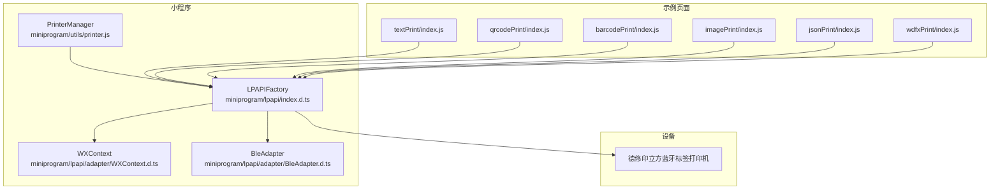
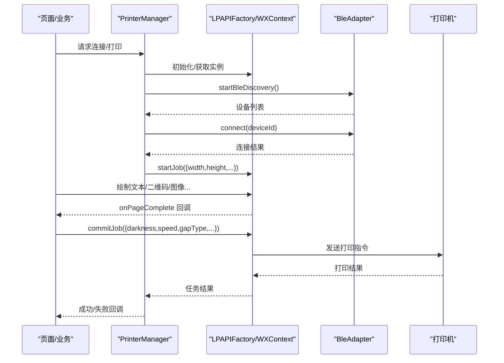
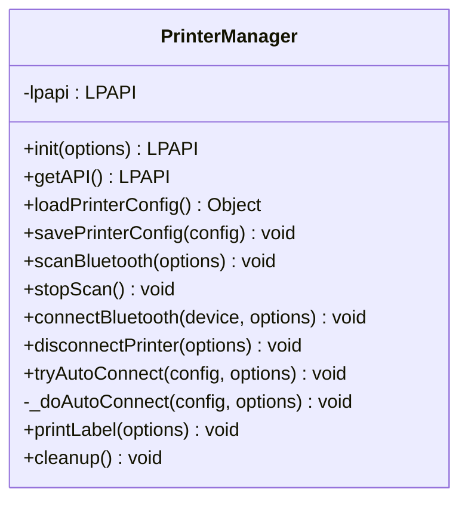
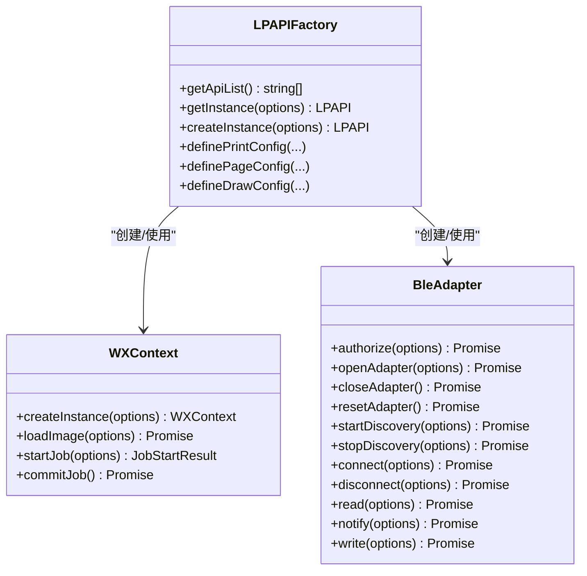
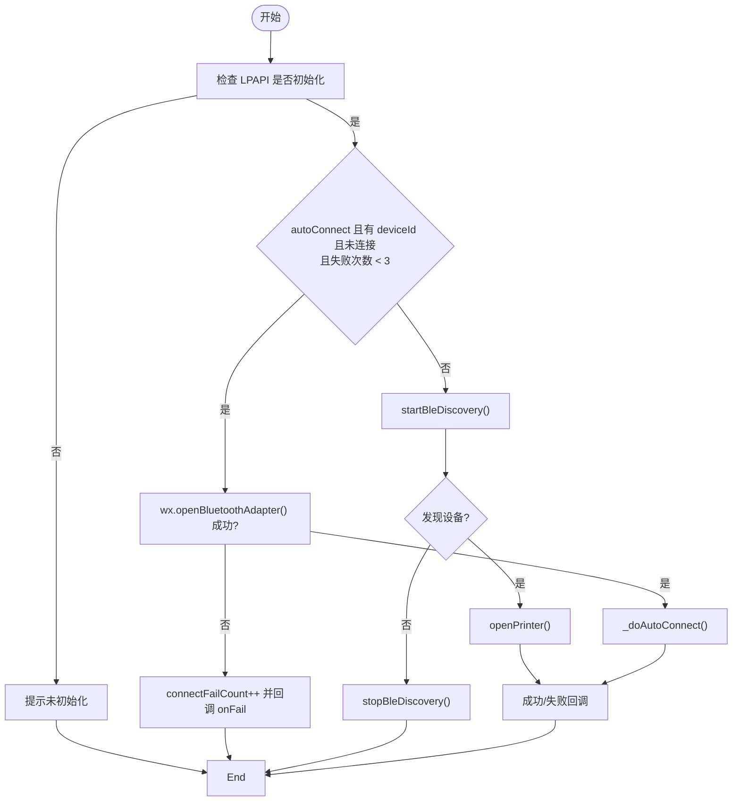
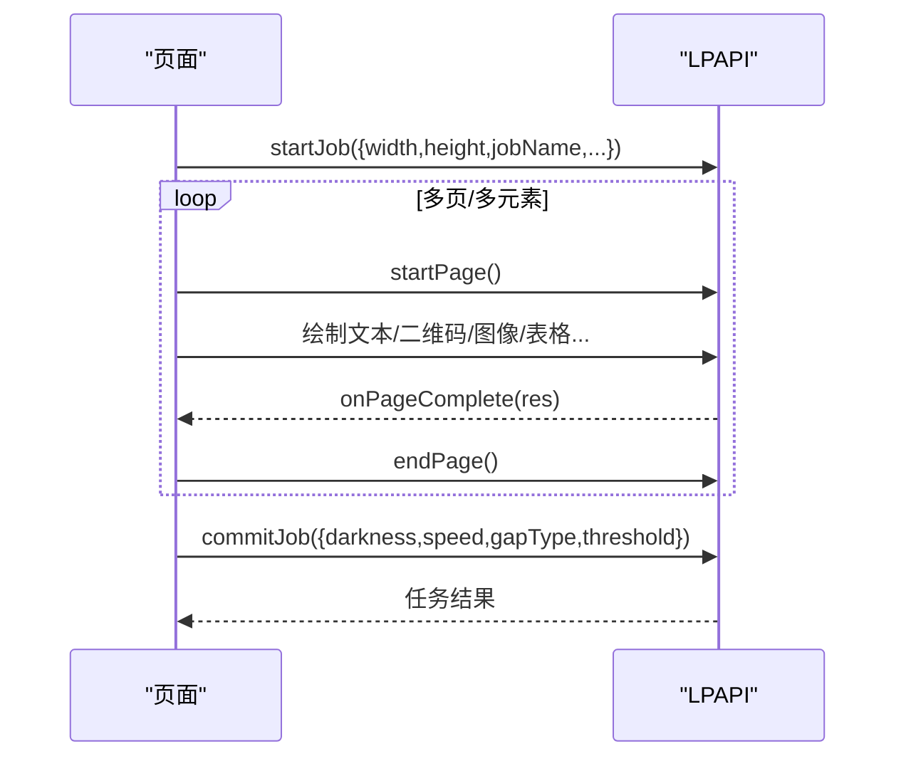
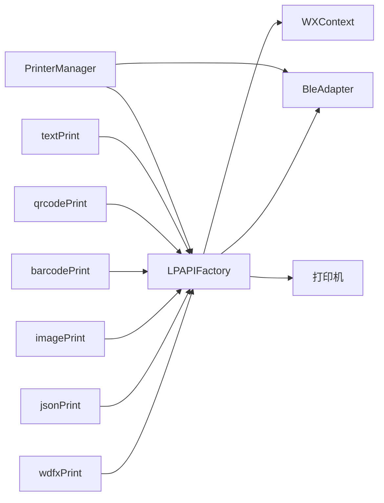

# 打印管理

<cite>
**本文档引用的文件**
- [printer.js](file://miniprogram/utils/printer.js)
- [index.d.ts](file://miniprogram/lpapi/index.d.ts)
- [BleAdapter.d.ts](file://miniprogram/lpapi/adapter/BleAdapter.d.ts)
- [WXContext.d.ts](file://miniprogram/lpapi/adapter/WXContext.d.ts)
- [README.md](file://detonger/README.md)
- [textPrint/index.js](file://detonger/test/lpapi-ble-test/pages/textPrint/index.js)
- [qrcodePrint/index.js](file://detonger/test/lpapi-ble-test/pages/qrcodePrint/index.js)
- [barcodePrint/index.js](file://detonger/test/lpapi-ble-test/pages/barcodePrint/index.js)
- [imagePrint/index.js](file://detonger/test/lpapi-ble-test/pages/imagePrint/index.js)
- [jsonPrint/index.js](file://detonger/test/lpapi-ble-test/pages/jsonPrint/index.js)
- [wdfxPrint/index.js](file://detonger/test/lpapi-ble-test/pages/wdfxPrint/index.js)
</cite>

## 目录
1. [简介](#简介)
2. [项目结构](#项目结构)
3. [核心组件](#核心组件)
4. [架构总览](#架构总览)
5. [详细组件分析](#详细组件分析)
6. [依赖关系分析](#依赖关系分析)
7. [性能考量](#性能考量)
8. [故障排除指南](#故障排除指南)
9. [结论](#结论)
10. [附录](#附录)

## 简介
本文件面向“打印管理模块”，聚焦以下目标：
- 解释蓝牙打印机集成架构与 LPAPI SDK 的使用方法
- 说明设备连接管理、打印任务队列、标签模板与打印配置
- 阐述打印状态监控、错误处理与设备兼容性策略
- 提供配置参数、模板定制与批量打印实践
- 说明打印管理器的扩展接口、自定义打印逻辑与故障排除

本模块基于德佟印立方系列蓝牙标签打印机，通过微信小程序的 BLE 与 Canvas 抽象，将绘制的标签内容转换为打印机指令并通过 BLE 发送打印。

## 项目结构
围绕打印管理的关键目录与文件：
- 小程序工具层：miniprogram/utils/printer.js（打印管理器）
- LPAPI 封装与类型：miniprogram/lpapi/*.d.ts
- 官方 LPAPI 文档与接口说明：detonger/README.md
- 示例页面：detonger/test/lpapi-ble-test/pages/*（文本、二维码、条形码、图像、JSON、表格等）

图表来源
- [printer.js:1-314](file://miniprogram/utils/printer.js#L1-L314)
- [index.d.ts:1-19](file://miniprogram/lpapi/index.d.ts#L1-L19)
- [BleAdapter.d.ts:1-59](file://miniprogram/lpapi/adapter/BleAdapter.d.ts#L1-L59)
- [WXContext.d.ts:1-19](file://miniprogram/lpapi/adapter/WXContext.d.ts#L1-L19)
- [textPrint/index.js:1-399](file://detonger/test/lpapi-ble-test/pages/textPrint/index.js#L1-L399)
- [qrcodePrint/index.js:1-377](file://detonger/test/lpapi-ble-test/pages/qrcodePrint/index.js#L1-L377)
- [barcodePrint/index.js:1-345](file://detonger/test/lpapi-ble-test/pages/barcodePrint/index.js#L1-L345)
- [imagePrint/index.js:1-347](file://detonger/test/lpapi-ble-test/pages/imagePrint/index.js#L1-L347)
- [jsonPrint/index.js:1-367](file://detonger/test/lpapi-ble-test/pages/jsonPrint/index.js#L1-L367)
- [wdfxPrint/index.js:1-346](file://detonger/test/lpapi-ble-test/pages/wdfxPrint/index.js#L1-L346)

章节来源
- [printer.js:1-314](file://miniprogram/utils/printer.js#L1-L314)
- [index.d.ts:1-19](file://miniprogram/lpapi/index.d.ts#L1-L19)
- [BleAdapter.d.ts:1-59](file://miniprogram/lpapi/adapter/BleAdapter.d.ts#L1-L59)
- [WXContext.d.ts:1-19](file://miniprogram/lpapi/adapter/WXContext.d.ts#L1-L19)
- [README.md:1-800](file://detonger/README.md#L1-L800)

## 核心组件
- 打印管理器 PrinterManager
  - 负责 LPAPI 实例化、蓝牙扫描/连接/断开、自动连接、打印任务调度与资源清理
  - 提供标签打印（如 40×20mm 标签）的业务封装
- LPAPI 封装与上下文
  - LPAPIFactory：统一获取 LPAPI 实例，支持日志级别、Canvas 上下文注入
  - WXContext：基于微信 Canvas 的绘制上下文，负责 startJob/commitJob 生命周期
  - BleAdapter：封装 BLE 适配器，提供 discover/connect/disconnect/read/write 等能力
- 示例页面
  - 文本、二维码、条形码、图像、JSON、表格等打印场景的完整流程演示

章节来源
- [printer.js:1-314](file://miniprogram/utils/printer.js#L1-L314)
- [index.d.ts:1-19](file://miniprogram/lpapi/index.d.ts#L1-L19)
- [BleAdapter.d.ts:1-59](file://miniprogram/lpapi/adapter/BleAdapter.d.ts#L1-L59)
- [WXContext.d.ts:1-19](file://miniprogram/lpapi/adapter/WXContext.d.ts#L1-L19)

## 架构总览
整体架构由“小程序应用层 → 打印管理器 → LPAPI 抽象 → BLE 适配器 → 打印机”构成。应用层通过 PrinterManager 统一调度，LPAPI 负责标签绘制与任务提交，BLE 适配器负责底层蓝牙通信。

图表来源
- [printer.js:75-141](file://miniprogram/utils/printer.js#L75-L141)
- [textPrint/index.js:136-177](file://detonger/test/lpapi-ble-test/pages/textPrint/index.js#L136-L177)
- [qrcodePrint/index.js:123-145](file://detonger/test/lpapi-ble-test/pages/qrcodePrint/index.js#L123-L145)
- [index.d.ts:1-19](file://miniprogram/lpapi/index.d.ts#L1-L19)
- [BleAdapter.d.ts:1-59](file://miniprogram/lpapi/adapter/BleAdapter.d.ts#L1-L59)

## 详细组件分析

### 打印管理器 PrinterManager
职责与关键点：
- 初始化与实例获取：懒加载 LPAPIFactory 并缓存实例
- 配置持久化：本地存储读取/写入打印机配置（启用、自动打印、自动连接、连接状态、设备信息、失败计数、二维码打印类型映射）
- 蓝牙扫描/停止：封装 startBleDiscovery/stopBleDiscovery
- 连接/断开：openPrinter/closePrinter，带成功/失败回调与用户提示
- 自动连接：wx.openBluetoothAdapter + openPrinter，失败次数上限控制
- 标签打印：创建打印任务、绘制内容、提交任务，支持二维码开关与智能截断
- 资源清理：停止扫描、关闭打印机

图表来源
- [printer.js:5-298](file://miniprogram/utils/printer.js#L5-L298)

章节来源
- [printer.js:1-314](file://miniprogram/utils/printer.js#L1-L314)

### LPAPI 抽象与 WXContext
- LPAPIFactory：getInstance 支持注入 Canvas 与日志级别；definePrintConfig/definePageConfig/defineDrawConfig 提供配置化能力
- WXContext：继承 DrawContext，负责创建 Canvas、加载图片、startJob/endPage/commitJob 生命周期
- BleAdapter：IBleAdapter 实现，封装授权、适配器打开/关闭、发现设备、连接/断开、读写特征值等

图表来源
- [index.d.ts:1-19](file://miniprogram/lpapi/index.d.ts#L1-L19)
- [WXContext.d.ts:1-19](file://miniprogram/lpapi/adapter/WXContext.d.ts#L1-L19)
- [BleAdapter.d.ts:1-59](file://miniprogram/lpapi/adapter/BleAdapter.d.ts#L1-L59)

章节来源
- [index.d.ts:1-19](file://miniprogram/lpapi/index.d.ts#L1-L19)
- [WXContext.d.ts:1-19](file://miniprogram/lpapi/adapter/WXContext.d.ts#L1-L19)
- [BleAdapter.d.ts:1-59](file://miniprogram/lpapi/adapter/BleAdapter.d.ts#L1-L59)

### 设备连接管理
- 蓝牙适配器初始化：wx.openBluetoothAdapter（自动连接时）
- 发现设备：startBleDiscovery，支持超时、间隔、设备回调、适配器状态回调
- 连接设备：openPrinter(name/deviceId, success/fail)
- 断开设备：closePrinter，配合确认弹窗
- 自动连接：受配置与失败次数限制，避免频繁重试

图表来源
- [printer.js:172-215](file://miniprogram/utils/printer.js#L172-L215)
- [printer.js:75-105](file://miniprogram/utils/printer.js#L75-L105)
- [printer.js:115-141](file://miniprogram/utils/printer.js#L115-L141)

章节来源
- [printer.js:75-141](file://miniprogram/utils/printer.js#L75-L141)
- [printer.js:172-215](file://miniprogram/utils/printer.js#L172-L215)

### 打印任务与标签模板
- 任务创建：startJob({ width, height, jobName, dpi, backgroundColor/backgroundImage, orientation })
- 页面绘制：drawText/draw2DQRCode/drawImage/drawBarcode/drawRectangle/drawTable 等
- 页面提交：endPage/onPageComplete（逐页回调）
- 任务提交：commitJob({ darkness, speed, gapType, threshold, success/fail })

图表来源
- [textPrint/index.js:310-397](file://detonger/test/lpapi-ble-test/pages/textPrint/index.js#L310-L397)
- [qrcodePrint/index.js:297-376](file://detonger/test/lpapi-ble-test/pages/qrcodePrint/index.js#L297-L376)
- [barcodePrint/index.js:300-343](file://detonger/test/lpapi-ble-test/pages/barcodePrint/index.js#L300-L343)
- [imagePrint/index.js:311-347](file://detonger/test/lpapi-ble-test/pages/imagePrint/index.js#L311-L347)
- [jsonPrint/index.js:312-367](file://detonger/test/lpapi-ble-test/pages/jsonPrint/index.js#L312-L367)
- [wdfxPrint/index.js:309-346](file://detonger/test/lpapi-ble-test/pages/wdfxPrint/index.js#L309-L346)

章节来源
- [textPrint/index.js:310-397](file://detonger/test/lpapi-ble-test/pages/textPrint/index.js#L310-L397)
- [qrcodePrint/index.js:297-376](file://detonger/test/lpapi-ble-test/pages/qrcodePrint/index.js#L297-L376)
- [barcodePrint/index.js:300-343](file://detonger/test/lpapi-ble-test/pages/barcodePrint/index.js#L300-L343)
- [imagePrint/index.js:311-347](file://detonger/test/lpapi-ble-test/pages/imagePrint/index.js#L311-L347)
- [jsonPrint/index.js:312-367](file://detonger/test/lpapi-ble-test/pages/jsonPrint/index.js#L312-L367)
- [wdfxPrint/index.js:309-346](file://detonger/test/lpapi-ble-test/pages/wdfxPrint/index.js#L309-L346)

### 打印配置与参数
- 打印任务参数：width/height/orientation/jobName/dpi/background*
- 打印行为参数：darkness/speed/gapType/gapLength/threshold
- 二维码/条形码参数：text、尺寸、对齐、纠错级别、类型等
- 任务状态与结果：onPageComplete、commitJob 返回值包含 statusCode/printable/pages 等

章节来源
- [README.md:237-412](file://detonger/README.md#L237-L412)
- [textPrint/index.js:250-264](file://detonger/test/lpapi-ble-test/pages/textPrint/index.js#L250-L264)
- [qrcodePrint/index.js:240-251](file://detonger/test/lpapi-ble-test/pages/qrcodePrint/index.js#L240-L251)
- [barcodePrint/index.js:244-254](file://detonger/test/lpapi-ble-test/pages/barcodePrint/index.js#L244-L254)

### 打印状态监控与错误处理
- 状态码与错误码：LPA_Result、printable 状态码
- 逐页回调：onPageComplete 提供 pageIndex/printPages/dataUrl 等
- 失败处理：连接失败、打印失败、任务创建失败、参数错误、超时等
- 用户反馈：连接中/打印中提示、失败 toast、断开确认

章节来源
- [README.md:186-230](file://detonger/README.md#L186-L230)
- [README.md:349-372](file://detonger/README.md#L349-L372)
- [printer.js:134-140](file://miniprogram/utils/printer.js#L134-L140)
- [printer.js:271-286](file://miniprogram/utils/printer.js#L271-L286)

### 设备兼容性策略
- 仅支持德佟印立方系列蓝牙标签打印机
- 蓝牙权限与系统要求：Android 需开启蓝牙/GPS、允许定位；iOS 需开启蓝牙
- 调试模式影响打印速度，建议关闭调试模式
- 通过 setSupportPrefixes 限制搜索/连接的打印机型号

章节来源
- [README.md:1-14](file://detonger/README.md#L1-L14)
- [README.md:108-117](file://detonger/README.md#L108-L117)

### 扩展接口与自定义逻辑
- LPAPIFactory.define* 系列：支持打印配置、页面配置、绘制项扩展配置的函数式定义
- 自定义绘制：通过 WXContext 的 loadImage/startJob/endPage/commitJob 组合实现复杂模板
- 批量打印：循环 startPage/endPage，注意避免 foreach 的异步陷阱

章节来源
- [index.d.ts:12-18](file://miniprogram/lpapi/index.d.ts#L12-L18)
- [textPrint/index.js:317-340](file://detonger/test/lpapi-ble-test/pages/textPrint/index.js#L317-L340)
- [barcodePrint/index.js:315-340](file://detonger/test/lpapi-ble-test/pages/barcodePrint/index.js#L315-L340)

## 依赖关系分析
- PrinterManager 依赖 LPAPIFactory/WXContext/BleAdapter
- 示例页面依赖 LPAPIFactory 与各自绘制逻辑
- LPAPIFactory 依赖 WXContext 与 BleAdapter
- 设备端依赖德佟印立方打印机固件与 BLE 协议栈

图表来源
- [printer.js:15-28](file://miniprogram/utils/printer.js#L15-L28)
- [index.d.ts:1-19](file://miniprogram/lpapi/index.d.ts#L1-L19)
- [BleAdapter.d.ts:1-59](file://miniprogram/lpapi/adapter/BleAdapter.d.ts#L1-L59)
- [WXContext.d.ts:1-19](file://miniprogram/lpapi/adapter/WXContext.d.ts#L1-L19)
- [textPrint/index.js:1-399](file://detonger/test/lpapi-ble-test/pages/textPrint/index.js#L1-L399)
- [qrcodePrint/index.js:1-377](file://detonger/test/lpapi-ble-test/pages/qrcodePrint/index.js#L1-L377)
- [barcodePrint/index.js:1-345](file://detonger/test/lpapi-ble-test/pages/barcodePrint/index.js#L1-L345)
- [imagePrint/index.js:1-347](file://detonger/test/lpapi-ble-test/pages/imagePrint/index.js#L1-L347)
- [jsonPrint/index.js:1-367](file://detonger/test/lpapi-ble-test/pages/jsonPrint/index.js#L1-L367)
- [wdfxPrint/index.js:1-346](file://detonger/test/lpapi-ble-test/pages/wdfxPrint/index.js#L1-L346)

章节来源
- [printer.js:1-314](file://miniprogram/utils/printer.js#L1-L314)
- [index.d.ts:1-19](file://miniprogram/lpapi/index.d.ts#L1-L19)
- [BleAdapter.d.ts:1-59](file://miniprogram/lpapi/adapter/BleAdapter.d.ts#L1-L59)
- [WXContext.d.ts:1-19](file://miniprogram/lpapi/adapter/WXContext.d.ts#L1-L19)

## 性能考量
- 关闭调试模式以提升打印速度
- 合理设置 gapType、darkness、speed，避免过高浓度与过快速度导致打印质量下降
- 图像打印前确保图片加载完成，避免在 commitJob 时图片未就绪
- 批量打印时使用循环 startPage/endPage，避免一次性绘制过多内容导致内存压力

## 故障排除指南
常见问题与处理：
- 未检测到打印机/未指定打印机：检查设备列表与 openPrinter 参数
- 连接失败：确认蓝牙权限、GPS（Android）、蓝牙授权；查看 adapterStateChange 回调
- 正在打印中/任务被取消：等待当前任务完成或取消后再发起新任务
- 电压异常/打印头/纸张/碳带问题：根据 printable 状态码提示处理硬件问题
- 自动连接失败次数过多：检查 connectFailCount 与失败原因，必要时手动重试

章节来源
- [README.md:186-230](file://detonger/README.md#L186-L230)
- [README.md:349-372](file://detonger/README.md#L349-L372)
- [printer.js:184-194](file://miniprogram/utils/printer.js#L184-L194)
- [printer.js:209-214](file://miniprogram/utils/printer.js#L209-L214)

## 结论
本模块通过 PrinterManager 将 LPAPI 抽象与 BLE 适配器整合，形成稳定可靠的蓝牙标签打印能力。其配置化接口、逐页回调与完善的错误码体系，使得模板定制、批量打印与状态监控成为可能。遵循设备兼容性与性能优化建议，可在实际业务中高效落地打印需求。

## 附录
- 配置参数速查
  - 打印任务：width/height/orientation/jobName/dpi/background*
  - 打印行为：darkness/speed/gapType/gapLength/threshold
  - 二维码/条形码：text、尺寸、对齐、纠错级别、类型
- 模板定制建议
  - 使用 definePrintConfig/definePageConfig/defineDrawConfig 进行配置化
  - 复杂布局优先采用 WXContext 的 startJob/endPage/commitJob 流程
- 批量打印实践
  - 循环 startPage/endPage，逐页提交并监听 onPageComplete
  - 控制并发与内存占用，避免一次性绘制过多内容