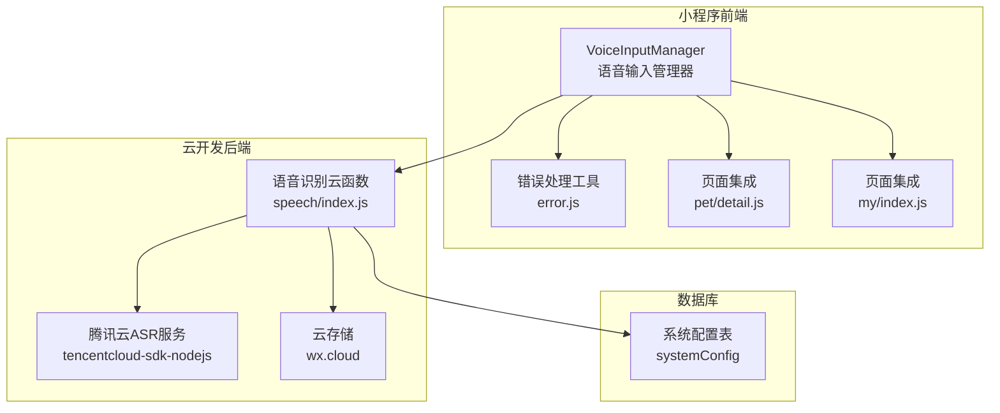
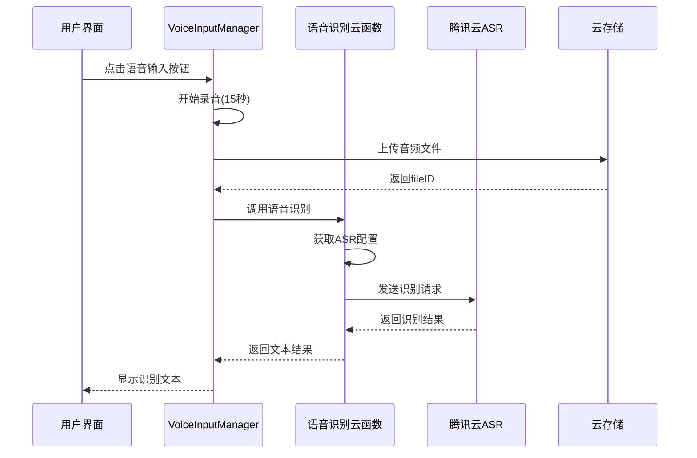
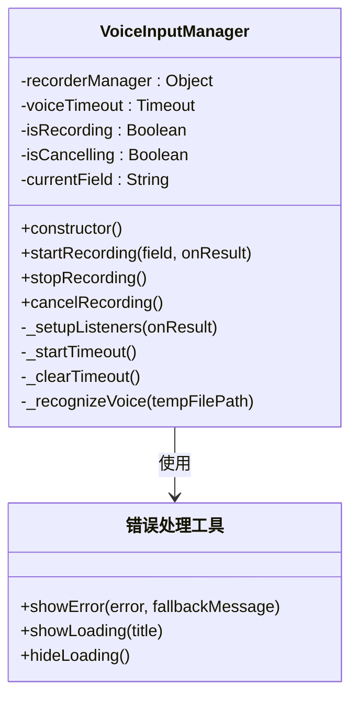
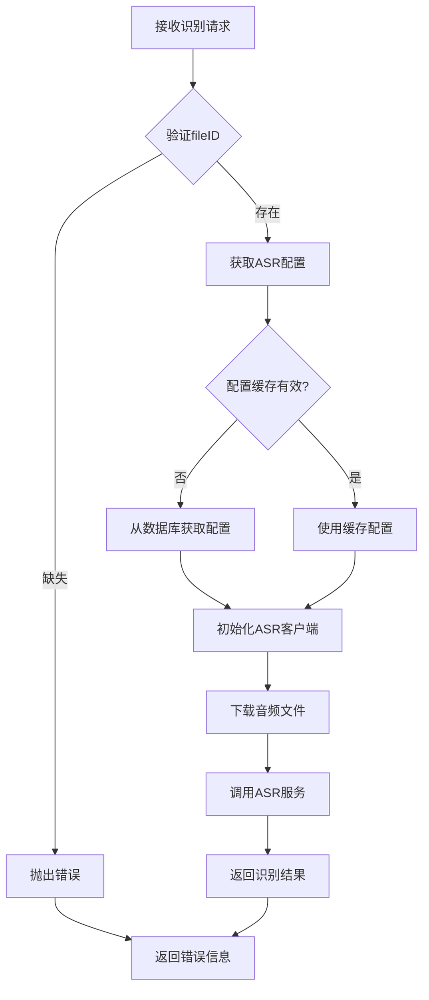
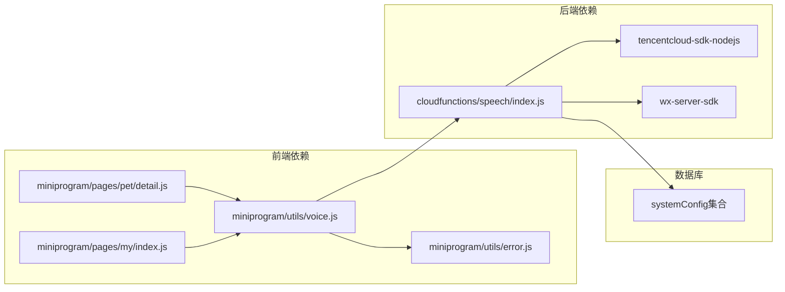

# 语音识别

<cite>
**本文档引用的文件**
- [voice.js](file://miniprogram/utils/voice.js)
- [error.js](file://miniprogram/utils/error.js)
- [index.js](file://cloudfunctions/speech/index.js)
- [config.json](file://cloudfunctions/speech/config.json)
- [package.json](file://cloudfunctions/speech/package.json)
- [detail.js](file://miniprogram/pages/pet/detail.js)
- [index.js](file://miniprogram/pages/my/index.js)
- [app.json](file://miniprogram/app.json)
</cite>

## 目录
1. [简介](#简介)
2. [项目结构](#项目结构)
3. [核心组件](#核心组件)
4. [架构总览](#架构总览)
5. [详细组件分析](#详细组件分析)
6. [依赖关系分析](#依赖关系分析)
7. [性能考虑](#性能考虑)
8. [故障排除指南](#故障排除指南)
9. [结论](#结论)
10. [附录](#附录)

## 简介
本项目实现了基于微信小程序平台的语音识别功能，涵盖语音输入、语音转文字以及语音控制等能力。系统采用前端录音采集、云端腾讯云ASR识别的架构设计，支持中文普通话识别，并提供了完善的错误处理、权限管理和用户体验优化机制。

语音识别功能主要服务于宠物档案管理场景，用户可以通过语音输入快速录入宠物名称、别名、备注等信息，提升数据录入效率和交互体验。

## 项目结构
语音识别功能涉及前后端分离的完整架构：



**图表来源**
- [voice.js:1-195](file://miniprogram/utils/voice.js#L1-L195)
- [index.js:1-144](file://cloudfunctions/speech/index.js#L1-L144)

**章节来源**
- [voice.js:1-195](file://miniprogram/utils/voice.js#L1-L195)
- [index.js:1-144](file://cloudfunctions/speech/index.js#L1-L144)
- [app.json:1-74](file://miniprogram/app.json#L1-L74)

## 核心组件
语音识别系统由以下核心组件构成：

### 前端组件
- **VoiceInputManager**: 语音输入管理器，负责录音控制、识别流程管理
- **错误处理工具**: 统一的错误提示和加载状态管理
- **页面集成**: 在宠物详情页和我的页面中集成语音功能

### 后端组件
- **语音识别云函数**: 负责调用腾讯云ASR服务进行语音转文字
- **配置管理系统**: 从数据库获取ASR服务配置
- **文件存储服务**: 处理音频文件的上传和下载

**章节来源**
- [voice.js:4-194](file://miniprogram/utils/voice.js#L4-L194)
- [index.js:17-92](file://cloudfunctions/speech/index.js#L17-L92)

## 架构总览
系统采用三层架构设计，确保功能的高可用性和可扩展性：



**图表来源**
- [voice.js:18-178](file://miniprogram/utils/voice.js#L18-L178)
- [index.js:95-143](file://cloudfunctions/speech/index.js#L95-L143)

## 详细组件分析

### VoiceInputManager 类分析
VoiceInputManager 是整个语音识别系统的核心控制器，负责管理录音状态、处理识别流程和错误处理。



**图表来源**
- [voice.js:4-194](file://miniprogram/utils/voice.js#L4-L194)
- [error.js:1-92](file://miniprogram/utils/error.js#L1-L92)

#### 录音配置参数
系统采用标准化的录音参数配置：
- **采样率**: 16kHz (16000Hz)
- **声道数**: 单声道(1)
- **编码比特率**: 48kbps
- **格式**: MP3
- **时长限制**: 15秒
- **超时处理**: 15秒自动停止

#### 识别流程
1. **开始录音**: 初始化录音管理器，设置监听器
2. **录音完成**: 自动触发识别流程
3. **文件上传**: 将录音文件上传至云存储
4. **云端识别**: 调用语音识别云函数
5. **结果返回**: 将识别结果回调给调用方

**章节来源**
- [voice.js:18-178](file://miniprogram/utils/voice.js#L18-L178)

### 语音识别云函数分析
云函数负责与腾讯云ASR服务的交互，实现真正的语音转文字功能。



**图表来源**
- [index.js:95-143](file://cloudfunctions/speech/index.js#L95-L143)

#### 配置管理机制
- **配置缓存**: 5分钟内有效，减少数据库查询
- **降级机制**: 数据库获取失败时使用环境变量
- **动态更新**: 配置变更时自动重新初始化客户端

#### 错误处理策略
- **网络异常**: 捕获并返回友好的错误信息
- **认证失败**: 检查API密钥配置
- **文件处理**: 验证文件ID的有效性

**章节来源**
- [index.js:17-143](file://cloudfunctions/speech/index.js#L17-L143)

### 页面集成分析
语音功能在多个页面中得到集成，提供一致的用户体验。

#### 宠物详情页集成
在宠物详情页中，语音功能主要用于：
- **名称输入**: 支持语音输入宠物名称
- **别名输入**: 支持语音输入宠物别名  
- **备注输入**: 支持语音输入记录备注

#### 我的页面集成
在个人中心页面中，语音功能作为通用工具提供：
- **全局语音输入**: 适用于各种文本输入场景
- **统一管理**: 通过单例模式提供一致的语音服务

**章节来源**
- [detail.js:2258-2292](file://miniprogram/pages/pet/detail.js#L2258-L2292)
- [index.js:1-100](file://miniprogram/pages/my/index.js#L1-L100)

## 依赖关系分析

### 技术栈依赖


**图表来源**
- [voice.js:1-3](file://miniprogram/utils/voice.js#L1-L3)
- [index.js:1-2](file://cloudfunctions/speech/index.js#L1-L2)
- [package.json:6-9](file://cloudfunctions/speech/package.json#L6-L9)

### 外部服务依赖
- **腾讯云ASR服务**: 核心语音识别服务
- **微信云开发**: 提供云存储和云函数服务
- **微信小程序API**: 录音管理、文件上传等基础能力

**章节来源**
- [package.json:1-10](file://cloudfunctions/speech/package.json#L1-L10)

## 性能考虑
语音识别系统的性能优化主要体现在以下几个方面：

### 1. 流程优化
- **异步处理**: 录音和识别过程完全异步，避免UI阻塞
- **超时控制**: 15秒超时机制防止长时间录音占用资源
- **内存管理**: 及时清理录音资源和定时器

### 2. 网络优化
- **文件上传**: 使用云存储减少网络传输时间
- **配置缓存**: 5分钟缓存机制降低数据库访问频率
- **错误重试**: 对于临时性错误提供合理的重试机制

### 3. 用户体验优化
- **实时反馈**: 录音开始、结束、识别过程都有明确的视觉反馈
- **加载状态**: 识别过程中显示加载指示器
- **错误提示**: 统一的错误处理和用户友好的提示信息

## 故障排除指南

### 常见问题及解决方案

#### 1. 无法启动录音
**可能原因**:
- 设备麦克风权限未授权
- 录音设备被其他应用占用
- 系统版本不支持录音功能

**解决方法**:
- 检查应用权限设置
- 关闭其他录音应用
- 更新微信版本

#### 2. 识别失败
**可能原因**:
- 网络连接不稳定
- ASR配置信息缺失
- 音频质量不佳

**解决方法**:
- 检查网络连接状态
- 确认腾讯云API密钥配置
- 重新录制清晰的音频

#### 3. 云函数调用失败
**可能原因**:
- 云函数部署失败
- 数据库连接异常
- 权限配置错误

**解决方法**:
- 检查云函数日志
- 验证数据库连接
- 确认权限配置

**章节来源**
- [error.js:8-34](file://miniprogram/utils/error.js#L8-L34)
- [index.js:88-91](file://cloudfunctions/speech/index.js#L88-L91)

## 结论
本项目的语音识别功能实现了完整的端到端解决方案，具有以下特点：

1. **架构清晰**: 前后端分离的设计便于维护和扩展
2. **用户体验优秀**: 提供直观的语音输入界面和及时的反馈
3. **稳定性强**: 完善的错误处理和降级机制
4. **可扩展性好**: 支持配置管理和服务升级

通过合理的技术选型和架构设计，系统能够在保证功能完整性的同时，提供良好的用户体验和稳定的性能表现。

## 附录

### 配置参数说明
- **录音参数**: 采样率16kHz、MP3格式、15秒时长
- **识别参数**: 中文普通话识别、16k采样率
- **缓存策略**: ASR配置5分钟缓存
- **超时设置**: 录音15秒自动停止

### 扩展接口建议
1. **多语言支持**: 可扩展支持粤语、英语等其他语言
2. **实时识别**: 实现边录边识的功能
3. **批量处理**: 支持批量音频文件识别
4. **自定义模型**: 支持特定领域的专业词汇识别

### 集成示例
系统提供了标准的集成接口，可在任意页面中通过以下方式使用：

```javascript
const { getVoiceManager } = require('../../utils/voice.js')
const voiceManager = getVoiceManager()

// 开始语音输入
voiceManager.startRecording('fieldName', (field, text) => {
  // 处理识别结果
})
```