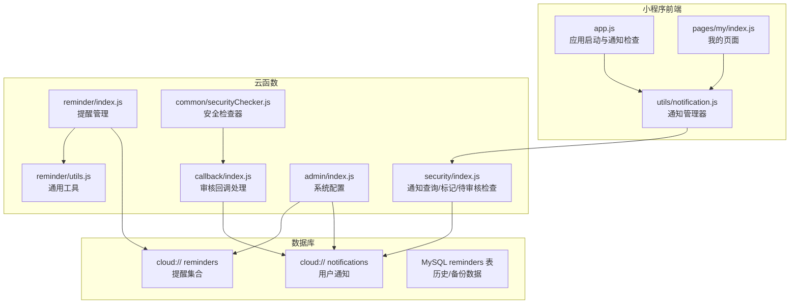
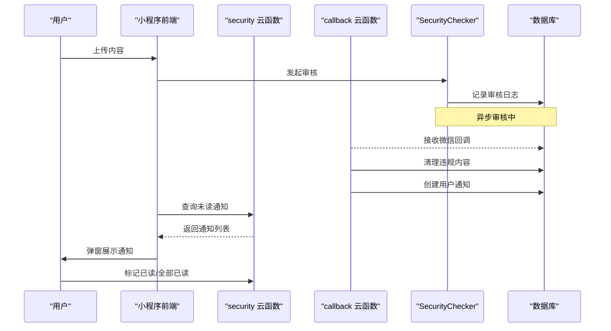
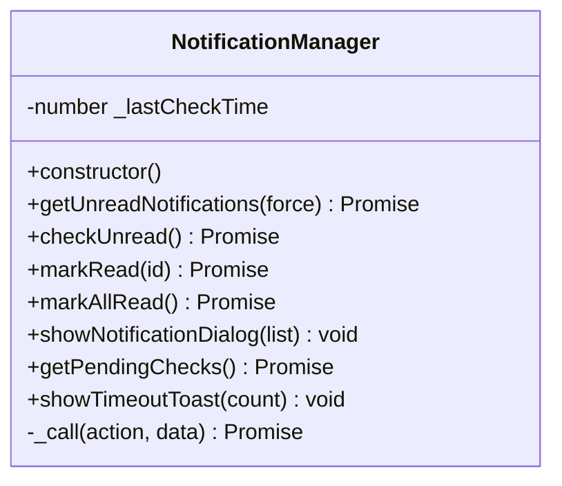
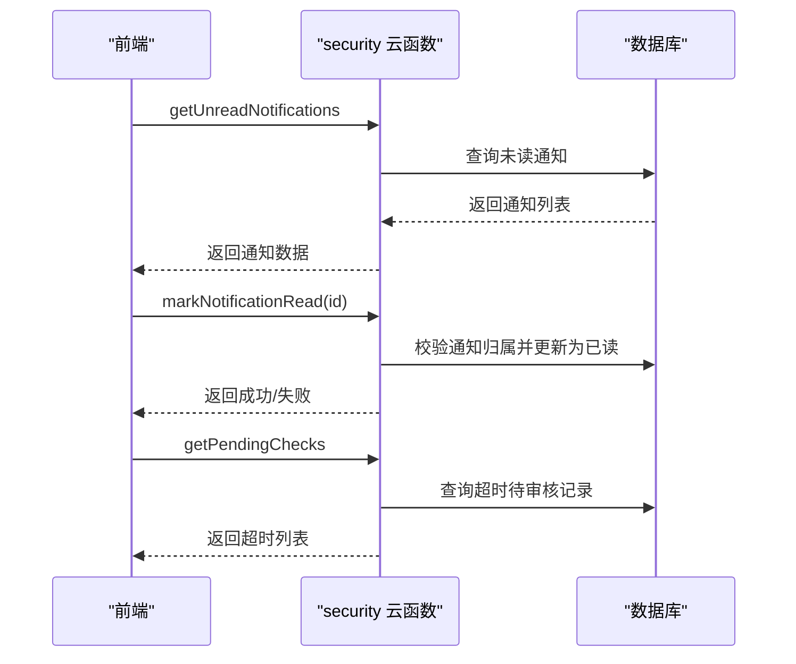
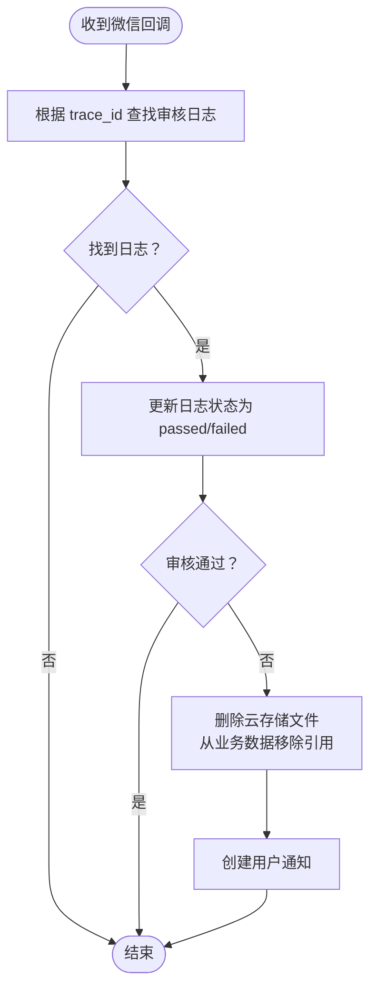
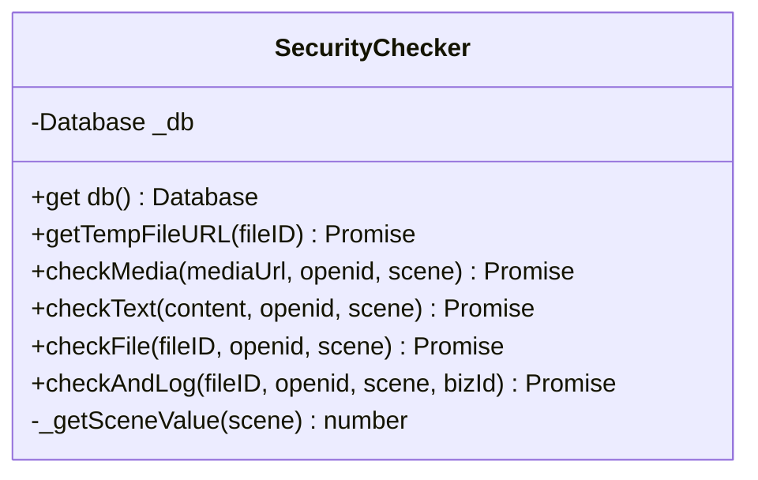
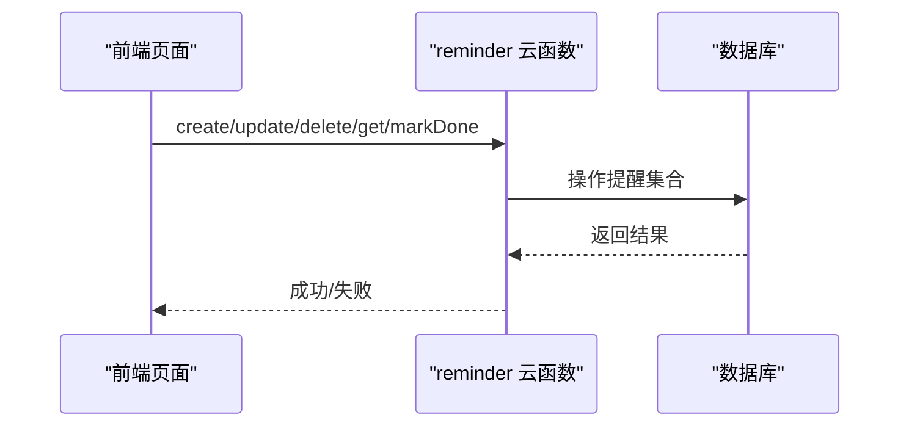
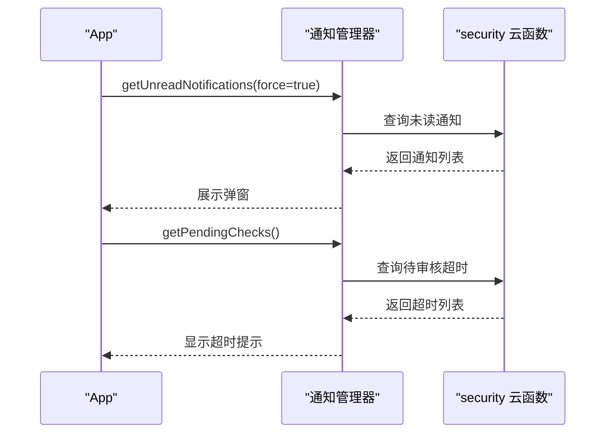
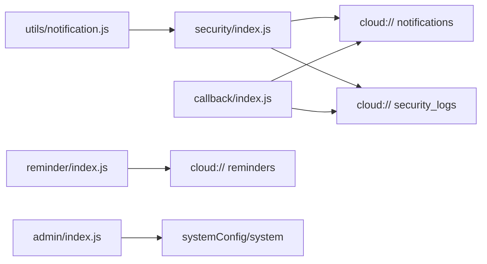

# 通知系统

<cite>
**本文档引用的文件**
- [notification.js](file://miniprogram/utils/notification.js)
- [security/index.js](file://cloudfunctions/security/index.js)
- [callback/index.js](file://cloudfunctions/callback/index.js)
- [securityChecker.js](file://cloudfunctions/common/securityChecker.js)
- [reminder/index.js](file://cloudfunctions/reminder/index.js)
- [reminder/utils.js](file://cloudfunctions/reminder/utils.js)
- [admin/index.js](file://cloudfunctions/admin/index.js)
- [database.sql](file://server-setup/database.sql)
- [app.js](file://miniprogram/app.js)
- [index.js](file://miniprogram/pages/my/index.js)
</cite>

## 目录
1. [简介](#简介)
2. [项目结构](#项目结构)
3. [核心组件](#核心组件)
4. [架构总览](#架构总览)
5. [详细组件分析](#详细组件分析)
6. [依赖关系分析](#依赖关系分析)
7. [性能考虑](#性能考虑)
8. [故障排查指南](#故障排查指南)
9. [结论](#结论)
10. [附录](#附录)

## 简介
本通知系统围绕“内容安全审核”和“周期性提醒”两大主题构建，覆盖从内容上传到审核结果回传、违规处理、用户通知展示的完整闭环，并提供提醒管理能力。系统采用微信云开发与小程序前端协同工作，通过云函数实现安全审核、通知创建与状态管理，前端负责通知展示与用户交互。

## 项目结构
通知系统主要分布在以下位置：
- 前端：小程序 utils/notification.js 负责通知查询、展示与标记已读
- 云函数：security/index.js 提供通知查询、标记已读、标记全部已读、待审核超时检查
- 审核回调：callback/index.js 接收微信异步回调，清理违规内容并创建用户通知
- 安全检查器：common/securityChecker.js 提供图片/文本审核能力与日志记录
- 提醒管理：reminder/index.js 提供提醒的增删改查与完成标记
- 管理配置：admin/index.js 提供系统配置（含通知标题/内容等）
- 数据库：server-setup/database.sql 定义提醒表结构

图表来源
- [notification.js:1-146](file://miniprogram/utils/notification.js#L1-L146)
- [security/index.js:1-200](file://cloudfunctions/security/index.js#L1-L200)
- [callback/index.js:1-223](file://cloudfunctions/callback/index.js#L1-L223)
- [securityChecker.js:1-226](file://cloudfunctions/common/securityChecker.js#L1-L226)
- [reminder/index.js:1-205](file://cloudfunctions/reminder/index.js#L1-L205)
- [reminder/utils.js:1-69](file://cloudfunctions/reminder/utils.js#L1-L69)
- [admin/index.js:434-508](file://cloudfunctions/admin/index.js#L434-L508)
- [database.sql:138-161](file://server-setup/database.sql#L138-L161)

章节来源
- [notification.js:1-146](file://miniprogram/utils/notification.js#L1-L146)
- [security/index.js:1-200](file://cloudfunctions/security/index.js#L1-L200)
- [callback/index.js:1-223](file://cloudfunctions/callback/index.js#L1-L223)
- [securityChecker.js:1-226](file://cloudfunctions/common/securityChecker.js#L1-L226)
- [reminder/index.js:1-205](file://cloudfunctions/reminder/index.js#L1-L205)
- [reminder/utils.js:1-69](file://cloudfunctions/reminder/utils.js#L1-L69)
- [admin/index.js:434-508](file://cloudfunctions/admin/index.js#L434-L508)
- [database.sql:138-161](file://server-setup/database.sql#L138-L161)

## 核心组件
- 前端通知管理器：封装云函数调用、未读通知查询、弹窗展示、标记已读/全部已读、待审核超时提示
- 安全云函数：提供通知查询、标记已读、标记全部已读、待审核超时检查
- 审核回调云函数：接收微信异步回调，清理违规内容并创建用户通知
- 安全检查器：封装图片/文本审核、临时URL获取、审核日志记录
- 提醒管理云函数：新增/查询/更新/删除提醒，标记完成
- 系统配置：提供通知标题/内容等配置项

章节来源
- [notification.js:1-146](file://miniprogram/utils/notification.js#L1-L146)
- [security/index.js:41-144](file://cloudfunctions/security/index.js#L41-L144)
- [callback/index.js:54-109](file://cloudfunctions/callback/index.js#L54-L109)
- [securityChecker.js:30-208](file://cloudfunctions/common/securityChecker.js#L30-L208)
- [reminder/index.js:10-37](file://cloudfunctions/reminder/index.js#L10-L37)

## 架构总览
通知系统分为两条主线：
- 内容安全通知链路：前端上传内容 → 安全检查器发起审核 → 微信异步回调 → 回调云函数清理违规内容并创建通知 → 前端展示通知
- 周期提醒链路：用户设置提醒 → 云端存储提醒 → 前端计算到期状态 → 用户标记完成 → 云端更新完成时间

图表来源
- [security/index.js:41-144](file://cloudfunctions/security/index.js#L41-L144)
- [callback/index.js:54-109](file://cloudfunctions/callback/index.js#L54-L109)
- [securityChecker.js:172-207](file://cloudfunctions/common/securityChecker.js#L172-L207)

## 详细组件分析

### 前端通知管理器（utils/notification.js）
- 职责：封装与安全云函数的交互，提供未读通知查询、快速检查、弹窗展示、标记已读/全部已读、待审核超时提示
- 关键特性：
  - 查询节流：每分钟最多查询一次，避免频繁请求
  - 弹窗展示：按时间倒序取最新通知，展示后自动标记已读，支持递归展示剩余通知
  - 待审核超时：检查超过10分钟仍未回调的记录，提示用户

图表来源
- [notification.js:13-146](file://miniprogram/utils/notification.js#L13-L146)

章节来源
- [notification.js:1-146](file://miniprogram/utils/notification.js#L1-L146)

### 安全云函数（cloudfunctions/security/index.js）
- 职责：提供通知查询、标记已读、标记全部已读、待审核超时检查
- 权限校验：严格校验通知所属用户，防止越权操作
- 待审核超时：筛选超过10分钟仍为 pending 的记录，标记为 timeout 并返回给前端

图表来源
- [security/index.js:69-144](file://cloudfunctions/security/index.js#L69-L144)

章节来源
- [security/index.js:41-144](file://cloudfunctions/security/index.js#L41-L144)

### 审核回调云函数（cloudfunctions/callback/index.js）
- 职责：接收微信异步回调，清理违规内容并创建用户通知
- 流程：
  - 根据 trace_id 查找审核日志
  - 更新日志状态为 passed/failed
  - 审核不通过时：删除云存储文件、从业务数据中移除引用、创建用户通知
  - 通知内容包含违规场景与标签说明

图表来源
- [callback/index.js:54-109](file://cloudfunctions/callback/index.js#L54-L109)

章节来源
- [callback/index.js:1-223](file://cloudfunctions/callback/index.js#L1-L223)

### 安全检查器（cloudfunctions/common/securityChecker.js）
- 职责：封装图片/文本审核、临时URL获取、审核日志记录
- 场景映射：avatar/cover/pet/footprint/comment/nickname 对应不同审核场景
- 日志记录：将审核请求写入 security_logs，便于后续回调处理与超时检查

图表来源
- [securityChecker.js:30-226](file://cloudfunctions/common/securityChecker.js#L30-L226)

章节来源
- [securityChecker.js:1-226](file://cloudfunctions/common/securityChecker.js#L1-L226)

### 提醒管理（cloudfunctions/reminder/index.js）
- 职责：新增/查询/更新/删除提醒，标记完成
- 业务规则：
  - 同一宠物+同一类型不可重复
  - 类型变更时检查冲突
  - 完成标记更新 lastDone
- 前端状态计算：基于 lastDone + intervalDays 计算下次到期、状态文本与样式

图表来源
- [reminder/index.js:10-37](file://cloudfunctions/reminder/index.js#L10-L37)
- [reminder/index.js:54-101](file://cloudfunctions/reminder/index.js#L54-L101)
- [reminder/index.js:151-178](file://cloudfunctions/reminder/index.js#L151-L178)
- [reminder/index.js:190-204](file://cloudfunctions/reminder/index.js#L190-L204)

章节来源
- [reminder/index.js:1-205](file://cloudfunctions/reminder/index.js#L1-L205)
- [reminder/utils.js:1-69](file://cloudfunctions/reminder/utils.js#L1-L69)

### 应用启动与通知检查（miniprogram/app.js）
- 在应用启动后，调用通知管理器检查未读通知并弹窗展示
- 同时检查待审核超时记录并提示用户

图表来源
- [app.js:270-288](file://miniprogram/app.js#L270-L288)
- [notification.js:41-105](file://miniprogram/utils/notification.js#L41-L105)

章节来源
- [app.js:270-288](file://miniprogram/app.js#L270-L288)
- [notification.js:1-146](file://miniprogram/utils/notification.js#L1-L146)

## 依赖关系分析
- 前端依赖：utils/notification.js 依赖 wx.cloud.callFunction 调用 security 云函数
- 安全云函数依赖：查询/更新 notifications 集合，查询 security_logs 集合
- 审核回调依赖：读取 security_logs，清理云存储与业务数据，写入 notifications
- 提醒云函数依赖：操作 reminders 集合，依赖 utils.js 提供的工具方法
- 系统配置：admin 云函数提供通知标题/内容等配置项

图表来源
- [notification.js:22-34](file://miniprogram/utils/notification.js#L22-L34)
- [security/index.js:74-98](file://cloudfunctions/security/index.js#L74-L98)
- [callback/index.js:62-109](file://cloudfunctions/callback/index.js#L62-L109)
- [reminder/index.js:8-101](file://cloudfunctions/reminder/index.js#L8-L101)
- [admin/index.js:434-508](file://cloudfunctions/admin/index.js#L434-L508)

章节来源
- [notification.js:1-146](file://miniprogram/utils/notification.js#L1-L146)
- [security/index.js:1-200](file://cloudfunctions/security/index.js#L1-L200)
- [callback/index.js:1-223](file://cloudfunctions/callback/index.js#L1-L223)
- [reminder/index.js:1-205](file://cloudfunctions/reminder/index.js#L1-L205)
- [admin/index.js:434-508](file://cloudfunctions/admin/index.js#L434-L508)

## 性能考虑
- 查询节流：前端通知管理器每分钟最多查询一次，减少不必要的云函数调用
- 限制返回数量：安全云函数查询未读通知限制为20条，避免大列表传输
- 异步回调：审核采用异步模式，回调处理在云函数中进行，前端无需轮询
- 数据库索引：提醒表包含 openid、pet_id、remind_time、status 等索引，提升查询效率
- 临时URL缓存：安全检查器获取临时URL失败时直接返回，避免重复请求

章节来源
- [notification.js:41-54](file://miniprogram/utils/notification.js#L41-L54)
- [security/index.js:74-98](file://cloudfunctions/security/index.js#L74-L98)
- [securityChecker.js:50-64](file://cloudfunctions/common/securityChecker.js#L50-L64)
- [database.sql:138-161](file://server-setup/database.sql#L138-L161)

## 故障排查指南
- 通知未显示
  - 检查前端是否正确调用通知管理器并传入 force=true
  - 确认安全云函数返回的未读通知列表非空
- 无法标记已读
  - 校验通知ID是否存在且属于当前用户
  - 检查云函数返回的错误信息
- 审核回调未触发
  - 确认微信云开发控制台已配置消息推送为云函数模式
  - 检查回调云函数部署状态与日志
- 提醒未生效
  - 检查提醒集合是否存在，必要时手动创建
  - 确认 intervalDays 和 lastDone 字段正确
- 待审核超时提示
  - 检查 security_logs 中 pending 状态记录是否超过10分钟

章节来源
- [security/index.js:103-127](file://cloudfunctions/security/index.js#L103-L127)
- [callback/index.js:42-52](file://cloudfunctions/callback/index.js#L42-L52)
- [reminder/index.js:39-52](file://cloudfunctions/reminder/index.js#L39-L52)

## 结论
通知系统通过“内容安全审核 + 周期提醒”的双轨设计，实现了从内容合规到用户提醒的完整闭环。前端以通知管理器为核心，云函数提供安全与提醒能力，数据库承载通知与提醒数据。系统具备良好的扩展性与可维护性，适合在多场景下复用与定制。

## 附录

### 通知类型与触发条件
- 内容安全通知
  - 触发条件：审核回调返回不通过
  - 通知内容：包含违规场景与标签说明
- 周期提醒通知
  - 触发条件：到期日到达
  - 通知内容：提醒类型、宠物名称、到期状态

章节来源
- [callback/index.js:200-223](file://cloudfunctions/callback/index.js#L200-L223)
- [reminder/index.js:104-142](file://cloudfunctions/reminder/index.js#L104-L142)

### 展示策略
- 前端弹窗展示：按时间倒序取最新通知，展示后自动标记已读
- 待审核超时：超过10分钟仍未回调的记录，提示用户

章节来源
- [notification.js:84-105](file://miniprogram/utils/notification.js#L84-L105)
- [security/index.js:151-195](file://cloudfunctions/security/index.js#L151-L195)

### 权限管理与个性化配置
- 权限管理：安全云函数严格校验通知归属，防止越权
- 个性化配置：系统配置提供通知标题/内容等项，可在管理端修改

章节来源
- [security/index.js:108-127](file://cloudfunctions/security/index.js#L108-L127)
- [admin/index.js:434-508](file://cloudfunctions/admin/index.js#L434-L508)

### 配置参数与系统设置
- 系统配置项：通知标题、通知内容、最大宠物数、允许注册等
- 数据库提醒表：包含 openid、pet_id、type、remind_time、status 等字段

章节来源
- [admin/index.js:434-508](file://cloudfunctions/admin/index.js#L434-L508)
- [database.sql:138-161](file://server-setup/database.sql#L138-L161)

### 扩展接口与自定义逻辑
- 扩展点：可在回调云函数中增加新的违规场景处理逻辑
- 自定义通知：通过系统配置或业务逻辑扩展通知模板与内容

章节来源
- [callback/index.js:111-197](file://cloudfunctions/callback/index.js#L111-L197)
- [admin/index.js:434-508](file://cloudfunctions/admin/index.js#L434-L508)

### 与应用其他模块的数据交互
- 登录模块：应用启动时自动获取 openid 并检查通知
- 我的页面：加载统计与系统配置，结合通知展示
- 提醒模块：跨宠物提醒汇总，结合通知进行展示与交互

章节来源
- [app.js:84-140](file://miniprogram/app.js#L84-L140)
- [index.js:1-200](file://miniprogram/pages/my/index.js#L1-L200)
- [reminder/index.js:125-142](file://cloudfunctions/reminder/index.js#L125-L142)