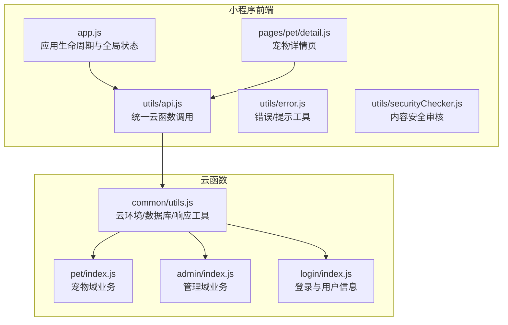
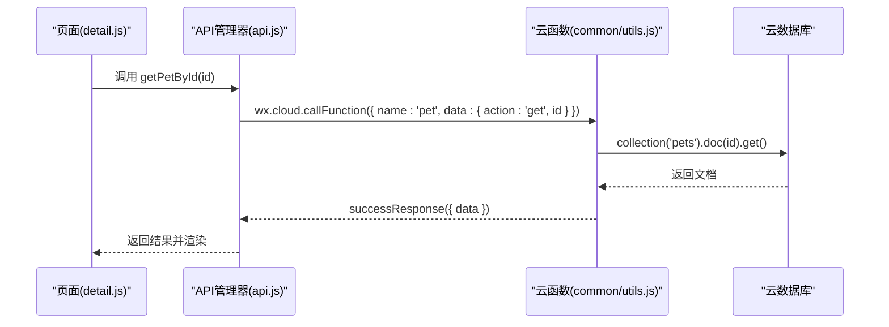
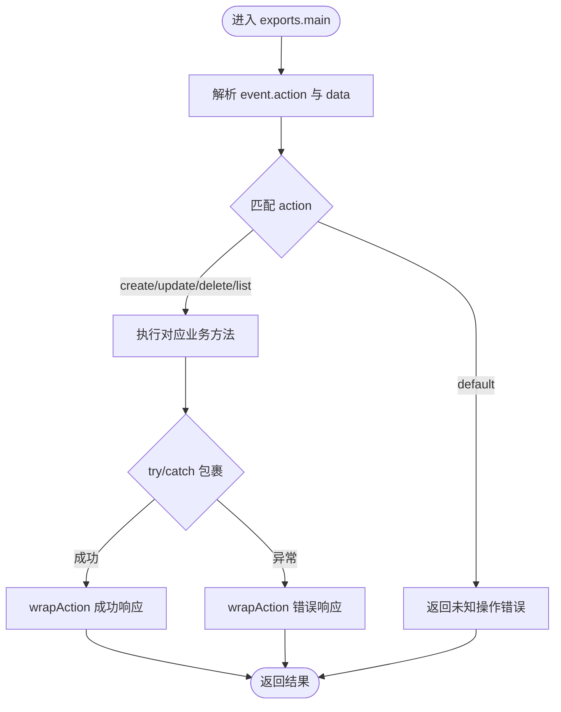
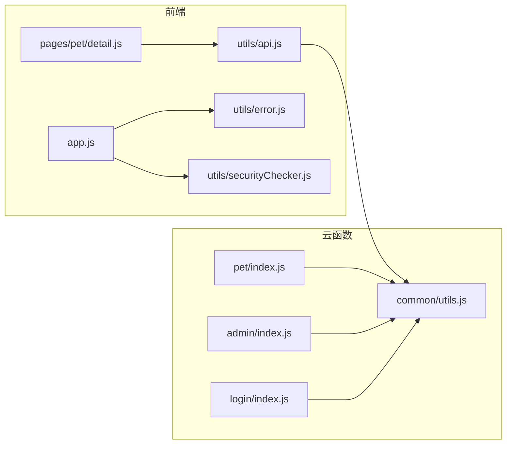

# 代码规范

<cite>
**本文引用的文件**   
- [miniprogram/app.js](file://miniprogram/app.js)
- [miniprogram/utils/api.js](file://miniprogram/utils/api.js)
- [miniprogram/utils/error.js](file://miniprogram/utils/error.js)
- [miniprogram/utils/securityChecker.js](file://miniprogram/utils/securityChecker.js)
- [miniprogram/pages/pet/detail.js](file://miniprogram/pages/pet/detail.js)
- [cloudfunctions/common/utils.js](file://cloudfunctions/common/utils.js)
- [cloudfunctions/pet/index.js](file://cloudfunctions/pet/index.js)
- [cloudfunctions/admin/index.js](file://cloudfunctions/admin/index.js)
- [cloudfunctions/login/index.js](file://cloudfunctions/login/index.js)
</cite>

## 目录
1. [引言](#引言)
2. [项目结构](#项目结构)
3. [核心组件](#核心组件)
4. [架构总览](#架构总览)
5. [详细组件分析](#详细组件分析)
6. [依赖关系分析](#依赖关系分析)
7. [性能考量](#性能考量)
8. [故障排查指南](#故障排查指南)
9. [结论](#结论)
10. [附录](#附录)

## 引言
本规范文档面向“养龟档案”项目全体开发者，覆盖小程序前端、云函数与云开发的整体代码风格与工程实践。内容包括：
- JavaScript/ES6+ 语法与模块化规范
- 变量与函数命名约定
- 文件组织结构标准
- 小程序组件命名、页面结构与样式类名规范
- 云函数开发规范、参数传递与错误处理标准
- 注释规范、代码格式化与 Git 提交信息格式
- 代码审查要点与质量工具配置建议
- 面向不同经验水平的实践指导

## 项目结构
项目采用“小程序前端 + 云函数 + 云开发”的分层架构：
- 小程序前端位于 miniprogram 目录，包含页面、组件、工具库与资源
- 云函数位于 cloudfunctions 目录，按业务域拆分（pet、admin、login、record、reminder、security 等）
- 通用工具位于 cloudfunctions/common 下，封装云环境初始化、数据库访问、响应格式化等

图表来源
- [miniprogram/app.js:1-312](file://miniprogram/app.js#L1-L312)
- [miniprogram/utils/api.js:1-208](file://miniprogram/utils/api.js#L1-L208)
- [cloudfunctions/common/utils.js:1-69](file://cloudfunctions/common/utils.js#L1-L69)
- [cloudfunctions/pet/index.js:1-723](file://cloudfunctions/pet/index.js#L1-L723)
- [cloudfunctions/admin/index.js:1-533](file://cloudfunctions/admin/index.js#L1-L533)
- [cloudfunctions/login/index.js:1-148](file://cloudfunctions/login/index.js#L1-L148)

章节来源
- [miniprogram/app.js:1-312](file://miniprogram/app.js#L1-L312)
- [miniprogram/utils/api.js:1-208](file://miniprogram/utils/api.js#L1-L208)
- [cloudfunctions/common/utils.js:1-69](file://cloudfunctions/common/utils.js#L1-L69)

## 核心组件
- 应用入口与全局状态：负责云开发初始化、系统配置加载、登录态维护、二维码生成与安全通知检查
- API 管理器：统一封装云函数调用、错误处理与图片上传流程
- 错误与提示工具：提供统一的错误消息、加载与确认对话框
- 内容安全审核：封装 security 云函数调用，支持异步/同步审核与批量处理
- 页面控制器：以页面为单位组织数据、交互与业务流程，遵循单一职责与清晰的生命周期

章节来源
- [miniprogram/app.js:1-312](file://miniprogram/app.js#L1-L312)
- [miniprogram/utils/api.js:1-208](file://miniprogram/utils/api.js#L1-L208)
- [miniprogram/utils/error.js:1-92](file://miniprogram/utils/error.js#L1-L92)
- [miniprogram/utils/securityChecker.js:1-122](file://miniprogram/utils/securityChecker.js#L1-L122)

## 架构总览
整体调用链路如下：小程序前端通过 API 管理器调用云函数，云函数通过通用工具完成数据库访问与响应封装，最终返回给前端。

图表来源
- [miniprogram/pages/pet/detail.js:420-459](file://miniprogram/pages/pet/detail.js#L420-L459)
- [miniprogram/utils/api.js:43-49](file://miniprogram/utils/api.js#L43-L49)
- [cloudfunctions/common/utils.js:20-35](file://cloudfunctions/common/utils.js#L20-L35)
- [cloudfunctions/pet/index.js:182-191](file://cloudfunctions/pet/index.js#L182-L191)

## 详细组件分析

### JavaScript/ES6+ 语法与模块化规范
- 使用 ES6+ 语法：箭头函数、模板字符串、解构赋值、Promise/async-await、类与模块导出
- 模块化：统一使用 require/exports 或 ES Module（视平台支持），避免全局污染
- 命名规范
  - 变量与函数：小驼峰命名（如 loadSystemConfig、generateQrcode）
  - 类与构造函数：大驼峰命名（如 APIManager、SecurityChecker）
  - 私有成员：以下划线前缀（如 _checkSecurityNotifications、_call）
  - 常量：全大写下划线（如 MAX_PET_COUNT）
- 文件命名：页面与组件以功能命名（如 detail.js、index.js），工具类以功能语义命名（如 api.js、error.js）

章节来源
- [miniprogram/app.js:1-312](file://miniprogram/app.js#L1-L312)
- [miniprogram/utils/api.js:1-208](file://miniprogram/utils/api.js#L1-L208)
- [miniprogram/utils/securityChecker.js:1-122](file://miniprogram/utils/securityChecker.js#L1-L122)

### 变量与函数命名约定
- 变量：描述性强、避免缩写；布尔变量以 is/has/can 前缀（如 isLoggedIn、hasMore）
- 函数：动词开头，清晰表达意图（如 loadPetDetail、uploadImage、checkText）
- 云函数：以业务域命名（如 pet、admin、login、record、reminder、security）
- 参数：明确作用域与类型（如 action、data、pageNum/pageSize）

章节来源
- [miniprogram/utils/api.js:12-145](file://miniprogram/utils/api.js#L12-L145)
- [cloudfunctions/pet/index.js:45-82](file://cloudfunctions/pet/index.js#L45-L82)
- [cloudfunctions/admin/index.js:27-71](file://cloudfunctions/admin/index.js#L27-L71)

### 文件组织结构标准
- 小程序前端
  - pages：页面级目录，包含 index、detail、my 等子目录
  - components：自定义组件目录（如 tabBar）
  - utils：工具模块（api、error、image、securityChecker 等）
  - assets/images/icons/styles：静态资源与样式
- 云函数
  - 按业务域拆分目录（pet、admin、login、record、reminder、security 等）
  - common：通用工具（utils.js）
  - 每个云函数包含 config.json、index.js、package.json（如存在）

章节来源
- [miniprogram/pages/pet/detail.js:1-800](file://miniprogram/pages/pet/detail.js#L1-L800)
- [cloudfunctions/common/utils.js:1-69](file://cloudfunctions/common/utils.js#L1-L69)

### 小程序组件命名、页面结构与样式类名规范
- 组件命名：采用功能语义命名（如 custom-tab-bar、tabBar），避免使用平台特定命名
- 页面结构：遵循 WXML 结构清晰、wx:if/wx:for 条件渲染合理，避免深层嵌套
- 样式类名：采用 BEM 或语义化命名（如 normal、warning、pending），避免使用平台内部类名
- 数据绑定：使用驼峰命名与清晰的 data 字段，避免直接操作 DOM

章节来源
- [miniprogram/pages/pet/detail.js:11-152](file://miniprogram/pages/pet/detail.js#L11-L152)

### 云函数开发规范
- 环境初始化：统一使用 initCloud 与 getDB，确保 env 动态配置
- 请求参数：严格校验 action 与 data，使用 switch 分发
- 数据访问：使用 command、正则与聚合查询，注意索引与性能
- 响应格式：统一 successResponse/errorResponse，包含 success、data/message/error
- 错误处理：try/catch 包裹，记录错误日志，返回标准化错误对象

图表来源
- [cloudfunctions/pet/index.js:45-82](file://cloudfunctions/pet/index.js#L45-L82)
- [cloudfunctions/common/utils.js:37-44](file://cloudfunctions/common/utils.js#L37-L44)

章节来源
- [cloudfunctions/common/utils.js:1-69](file://cloudfunctions/common/utils.js#L1-L69)
- [cloudfunctions/pet/index.js:1-723](file://cloudfunctions/pet/index.js#L1-L723)
- [cloudfunctions/admin/index.js:1-533](file://cloudfunctions/admin/index.js#L1-L533)
- [cloudfunctions/login/index.js:1-148](file://cloudfunctions/login/index.js#L1-L148)

### 参数传递约定与错误处理标准
- 参数传递
  - 云函数统一传入 { action, data } 结构，action 为字符串，data 为对象
  - 分页参数：pageNum、pageSize；过滤参数：filter（如 series/gender/searchText）
- 错误处理
  - 前端：统一 handleError/showError/showLoading 等工具
  - 云函数：errorResponse 返回 { success:false, message, error }
  - 通用工具：wrapAction 将业务异常包装为统一响应

章节来源
- [miniprogram/utils/api.js:12-38](file://miniprogram/utils/api.js#L12-L38)
- [miniprogram/utils/error.js:1-92](file://miniprogram/utils/error.js#L1-L92)
- [cloudfunctions/common/utils.js:28-44](file://cloudfunctions/common/utils.js#L28-L44)

### 注释规范
- 类与模块：使用 JSDoc 风格注释，说明用途、参数与返回值
- 私有方法：标注 @private，并简述行为
- 关键流程：在复杂分支处添加注释说明决策依据
- 示例：参考 APIManager 与 SecurityChecker 的注释风格

章节来源
- [miniprogram/utils/api.js:9-38](file://miniprogram/utils/api.js#L9-L38)
- [miniprogram/utils/securityChecker.js:1-122](file://miniprogram/utils/securityChecker.js#L1-L122)

### 代码格式化与 Git 提交信息格式
- 格式化建议：使用 Prettier（项目中存在 .prettierrc 配置文件）与 ESLint（项目中存在 .eslintrc.js 配置文件），统一缩进、分号与引号策略
- Git 提交信息格式：采用“类型(scope): 描述”，如 feat(utils): 添加图片上传工具；fix(login): 修复登录态判断；docs(readme): 更新部署说明
- 提交前检查：确保通过 Lint 与单元测试（如存在）

章节来源
- [miniprogram/app.js:1-312](file://miniprogram/app.js#L1-L312)

### 代码审查标准与质量工具
- 代码审查要点
  - 命名一致性：变量、函数、文件命名符合规范
  - 错误处理：异常捕获与用户提示完整
  - 性能与安全：避免 N+1 查询、敏感信息脱敏、图片审核流程
  - 可维护性：单一职责、模块边界清晰、注释完整
- 质量工具配置
  - ESLint：规则集建议启用 strict 模式与 no-unused-vars/no-console 限制
  - Prettier：统一代码风格，与 IDE 保存钩子集成
  - 测试：为关键云函数编写单元测试，覆盖正常与异常分支

章节来源
- [miniprogram/utils/api.js:1-208](file://miniprogram/utils/api.js#L1-L208)
- [cloudfunctions/common/utils.js:1-69](file://cloudfunctions/common/utils.js#L1-L69)

## 依赖关系分析
- 前端依赖
  - app.js 依赖 utils/error.js、utils/securityChecker.js
  - pages/pet/detail.js 依赖 utils/api.js、utils/error.js、utils/image.js、utils/category.js
- 云函数依赖
  - common/utils.js 提供 initCloud/getDB/successResponse/errorResponse
  - pet/admin/login 等云函数依赖 common/utils.js

图表来源
- [miniprogram/app.js:1-312](file://miniprogram/app.js#L1-L312)
- [miniprogram/pages/pet/detail.js:1-10](file://miniprogram/pages/pet/detail.js#L1-L10)
- [miniprogram/utils/api.js:1-208](file://miniprogram/utils/api.js#L1-L208)
- [cloudfunctions/common/utils.js:1-69](file://cloudfunctions/common/utils.js#L1-L69)
- [cloudfunctions/pet/index.js:1-723](file://cloudfunctions/pet/index.js#L1-L723)
- [cloudfunctions/admin/index.js:1-533](file://cloudfunctions/admin/index.js#L1-L533)
- [cloudfunctions/login/index.js:1-148](file://cloudfunctions/login/index.js#L1-L148)

章节来源
- [miniprogram/app.js:1-312](file://miniprogram/app.js#L1-L312)
- [miniprogram/utils/api.js:1-208](file://miniprogram/utils/api.js#L1-L208)
- [cloudfunctions/common/utils.js:1-69](file://cloudfunctions/common/utils.js#L1-L69)

## 性能考量
- 前端
  - 预加载与缓存：利用 globalData 预加载宠物、分类、提醒等数据，减少重复请求
  - 图片优化：上传后异步触发安全审核，避免阻塞主流程
  - 分页与懒加载：列表分页与骨架屏提升首屏体验
- 云函数
  - 并发查询：使用 Promise.all 并行获取统计与关联数据
  - 索引与查询：合理使用正则与复合索引，避免全表扫描
  - 事务与回滚：删除用户等高风险操作使用事务保证一致性

章节来源
- [miniprogram/app.js:292-310](file://miniprogram/app.js#L292-L310)
- [miniprogram/utils/api.js:167-177](file://miniprogram/utils/api.js#L167-L177)
- [cloudfunctions/admin/index.js:227-258](file://cloudfunctions/admin/index.js#L227-L258)

## 故障排查指南
- 登录与鉴权
  - 前端：requireLogin/promptLogin/forceLogin 流程，检查 openid 与 userInfo 存储
  - 云函数：login 云函数返回 openid 与用户信息，若数据库异常仍返回 openid
- 图片上传与审核
  - 前端：uploadImage 返回 fileID，异步触发安全检查；失败时使用 handleError 统一提示
  - 云函数：安全审核失败不影响上传主流程，前端降级放行
- 数据一致性
  - 前端：本地缓存与云端回退策略，避免因网络异常导致页面空白
  - 云函数：wrapAction 统一封装异常，返回标准化错误对象

章节来源
- [miniprogram/app.js:176-225](file://miniprogram/app.js#L176-L225)
- [cloudfunctions/login/index.js:87-147](file://cloudfunctions/login/index.js#L87-L147)
- [miniprogram/utils/api.js:156-190](file://miniprogram/utils/api.js#L156-L190)
- [miniprogram/utils/securityChecker.js:44-92](file://miniprogram/utils/securityChecker.js#L44-L92)
- [miniprogram/pages/pet/detail.js:420-482](file://miniprogram/pages/pet/detail.js#L420-L482)

## 结论
本规范文档总结了“养龟档案”项目在小程序前端与云函数层面的编码实践，涵盖命名、结构、调用链、错误处理与质量保障等方面。建议团队在日常开发中严格执行命名与注释规范，统一使用 API 管理器与通用工具，确保前后端协作顺畅、可维护性强、性能稳定。

## 附录
- 代码示例（以路径代替具体代码）
  - 正确写法：使用 APIManager 的 getPetById 方法发起请求，参见 [miniprogram/utils/api.js:43-49](file://miniprogram/utils/api.js#L43-L49)
  - 错误写法：直接调用 wx.cloud.callFunction 未封装，参见 [miniprogram/pages/pet/detail.js:420-459](file://miniprogram/pages/pet/detail.js#L420-L459)
  - 统一错误处理：使用 handleError/showError，参见 [miniprogram/utils/error.js:8-34](file://miniprogram/utils/error.js#L8-L34)
  - 云函数响应封装：使用 successResponse/errorResponse，参见 [cloudfunctions/common/utils.js:20-35](file://cloudfunctions/common/utils.js#L20-L35)
  - 内容安全审核：异步 checkImage 与同步 checkImageSync，参见 [miniprogram/utils/securityChecker.js:50-92](file://miniprogram/utils/securityChecker.js#L50-L92)